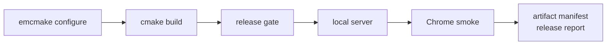

# Web Release 构建与测试

> 用途：记录 Chrome 单线程 Web demo 的固定构建、验收、人工测试和发布目录约定。

## 支持范围

- 浏览器：Chrome / Chromium 是当前必须验收目标。
- 线程模型：默认单线程，不要求 COOP / COEP。
- 图形：WebGL2，Bloom / HDR emissive 当前正式降级为 LDR / no-bloom。
- VFX：当前首版使用 `null_vfx_backend`，Effekseer 作为后续增强项。
- 存储：`/persistent` 挂载 IDBFS，保存和用户设置需要等待 sync 完成。



## 一条命令自动验收

clean checkout 或新 build 目录使用：

```bash
python3 tools/web_release/web_release_runbook.py auto \
  --configure \
  --build-dir build/web-release \
  --output-dir build/web-release/web-release-auto
```

已有 Web build 目录只想复验当前产物：

```bash
python3 tools/web_release/web_release_runbook.py auto \
  --skip-build \
  --build-dir build/web-gameplay-phase11 \
  --output-dir build/web-gameplay-phase11/web-release-auto
```

CI 或无浏览器环境只跑 build + release gate：

```bash
python3 tools/web_release/web_release_runbook.py auto \
  --configure \
  --skip-smoke \
  --build-dir build/web-release \
  --output-dir build/web-release/web-release-gate
```

自动验收输出：

- `auto-check.json`：命令、环境、gate、smoke、artifact summary。
- `auto-check.log`：完整命令日志。
- `artifact-manifest.json`：发布文件、MIME、cache 策略、sha256、gzip、brotli 尺寸。
- `release-report.md`：可读摘要、尺寸表、性能预算、截图列表。
- `chromium-smoke.json`：Chrome smoke 详细结果。
- `smoke/*.png`：标题页、地图、菜单、存档等截图。

## 人工测试预览

构建、gate 并启动本地预览：

```bash
python3 tools/web_release/web_release_runbook.py manual \
  --configure \
  --build-dir build/web-release \
  --output-dir build/web-release/web-release-manual \
  --open
```

只生成人工测试记录，不启动服务器：

```bash
python3 tools/web_release/web_release_runbook.py manual \
  --skip-build \
  --check-only \
  --build-dir build/web-gameplay-phase11 \
  --output-dir build/web-gameplay-phase11/web-release-manual
```

只启动静态服务器的底层入口：

```bash
python3 tools/web_release/serve_web_release.py \
  --build-dir build/web-release \
  --port 8787
```

人工测试 checklist：

- 标题页显示正常，Start / Load / Exit 可见，控制台没有 fatal error。
- 点击 Start，进入角色创建，再进入 `home_exterior`。
- Network 面板能看到 `shared-ui.tfpack`、`audio-core.tfpack`、`home-map.tfpack` 按需请求。
- 移动玩家，打开并关闭 inventory / hotbar / pause。
- 修改一次音量设置，刷新页面后确认设置恢复。
- 保存 slot0，刷新页面，从标题页 Load slot0 回到 `home_exterior`。
- 删除 slot0，刷新页面后确认 slot0 不再可加载。

## 发布目录结构

部署根目录就是 Web build 目录。至少包含：

```text
TinyFarmRPG-Web.html
TinyFarmRPG-Web.js
TinyFarmRPG-Web.wasm
TinyFarmRPG-Web.data
favicon.ico
web-packages/
  audio-core.tfpack
  home-map.tfpack
  shared-ui.tfpack
  web-package-index.json
```

`web-boot-preload.args` 是构建元数据，不是运行时必须下载的文件。`artifact-manifest.json` 和 `release-report.md` 默认写在 runbook 的 `--output-dir` 中，用于审计，不要求放入站点根目录。

## HTTP Header

本地预览服务器会设置正确 MIME：

| 后缀 | MIME |
|---|---|
| `.wasm` | `application/wasm` |
| `.data` | `application/octet-stream` |
| `.tfpack` | `application/octet-stream` |
| `.js` | `application/javascript` |

默认单线程发布不需要：

- `Cross-Origin-Opener-Policy`
- `Cross-Origin-Embedder-Policy`

如果后续启用 pthreads / SharedArrayBuffer，才需要 COOP / COEP。当前单线程 Chrome demo 不用这些 header 做 gate。

cache 策略：

- 本地预览：全部 `no-cache`。
- 正式部署：`TinyFarmRPG-Web.html` 使用 `no-cache`。
- `.js`、`.wasm`、`.data`、`.tfpack` 如果部署在带版本号的 release 目录下，可以使用长期 immutable cache；如果固定覆盖同一路径，应使用 `no-cache` 或明确的 cache busting。

## 清除 Web 存档

推荐方式：

- Chrome DevTools -> Application -> Storage -> Clear site data。
- 或 DevTools -> Application -> IndexedDB，删除当前 localhost origin 下的 `/persistent` 数据库。

清除后刷新页面，日志应重新出现：

- `TinyFarmRPG persistent FS sync started direction=from_browser`
- `GameApp: Web persistent storage is mounted and populated.`

## 常见失败

`emcmake not found`

- 先安装或激活 emsdk。
- runbook 会自动识别 `~/.local/emsdk`，如果你使用其他路径，需要先 source 对应的 `emsdk_env.sh`。

`TinyFarmRPG-Web.data` 过大

- release gate 会失败。
- 确认 `TF_WEB_BOOT_ONLY_PRELOAD=ON`，并确认 build 使用的是 `web-release-boot.args`。

`.tfpack` 404 或 MIME 错误

- 确认部署时保留 `web-packages/` 目录。
- 确认服务器把 `.tfpack` 返回为 `application/octet-stream`。

刷新后丢档或设置未恢复

- 检查日志中是否有 `TinyFarmRPG persistent FS sync completed direction=to_browser success=true`。
- 检查 `chromium-smoke.json` 中 `persistent_storage_logs.sync_failed` 是否为 0。

Chrome 自动化失败但人工可玩

- 先跑 `manual --check-only` 确认 build/gate 通过。
- 再用 `auto --headless` 或显式 `--browser` 选择可用的 Chromium-family 浏览器。
