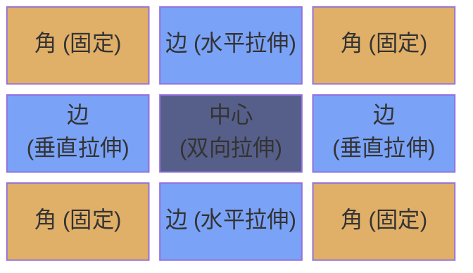
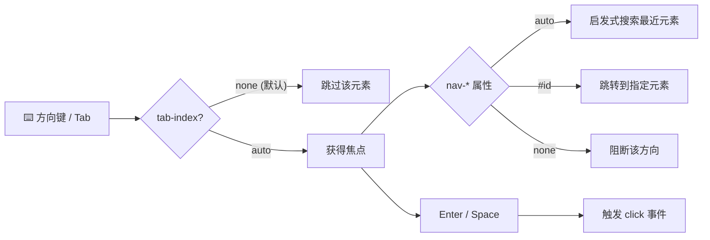
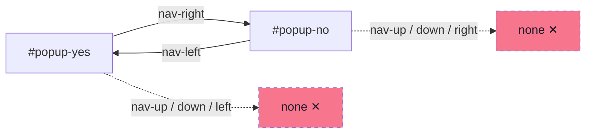
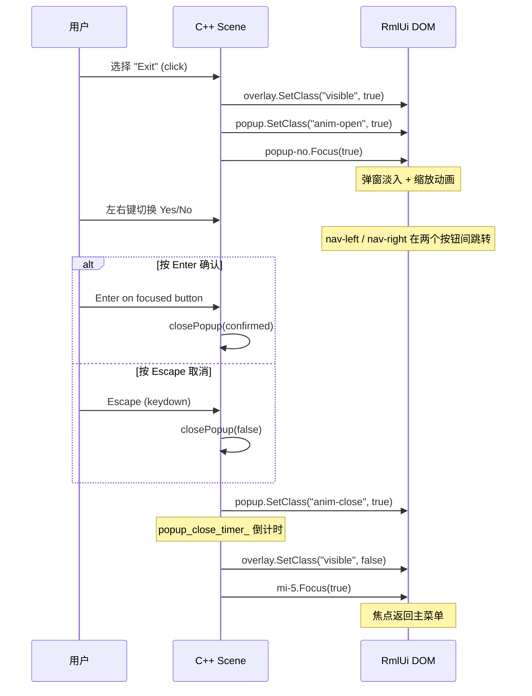
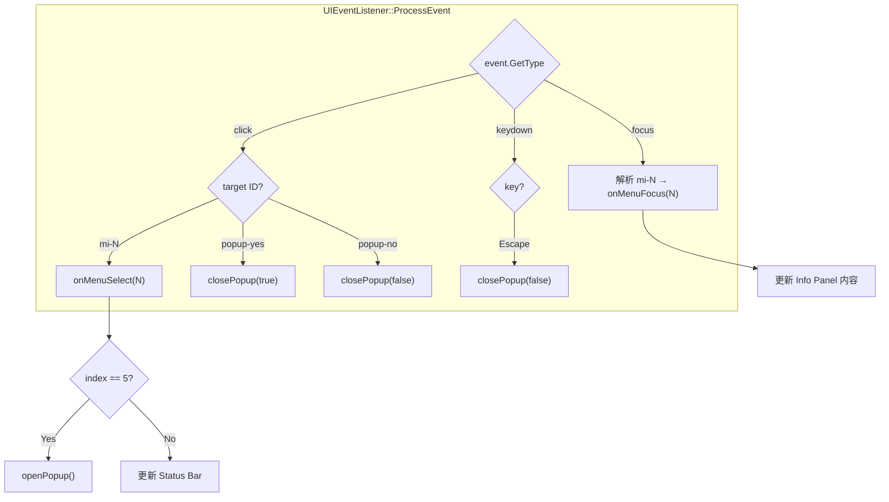

# L12: JRPG 窗口框架与键盘导航

> 配套代码：`learn/jrpg_window/` | 构建目标：`learn_jrpg_window`

---

## 1. 本课概述

从本课开始进入 **Phase IV — JRPG 界面实战**。前三阶段学习的所有 RmlUi 特性将在此整合应用。

本课建立 JRPG UI 的**基础设施**：

- **窗口皮肤系统**：用 `ninepatch` 装饰器 + `image-color` 创建可复用、可变色的窗口
- **键盘导航**：`tab-index` + `nav-*` 属性实现方向键菜单导航
- **焦点样式**：`:focus-visible` 伪类为键盘操作提供视觉反馈
- **窗口动画**：`@keyframes` 实现打开/关闭的缩放淡入效果
- **模态弹窗**：覆盖层 + 焦点陷阱模式

---

## 2. JRPG 窗口皮肤系统

### 2.1 为什么用精灵九宫格？

JRPG 窗口的核心需求：**同一套边框素材适应不同尺寸**。九宫格（9-patch）装饰器把一张窗口素材切成 9 个区域——四角固定、四边拉伸、中心填充——天然满足此需求。



### 2.2 ninepatch 声明

```css
@spritesheet jrpg-ui {
    src: ../../../assets/textures/UI/learn_spritesheet.png;
    resolution: 1x;

    /* 外轮廓矩形 + 内容区域矩形 */
    window-outer: 0px 0px 32px 32px;
    window-inner: 4px 4px 24px 24px;
}
```

两个矩形足以定义九宫格：
- `window-outer`：整张窗口素材区域
- `window-inner`：内容可绘制区域（四角 = outer 与 inner 的差值）

### 2.3 应用到元素

```css
.jrpg-window {
    decorator: ninepatch(window-outer, window-inner, 1.0);
    padding: 6dp 8dp;
}
```

第三个参数 `1.0` 是边缘缩放因子，控制边框粗细。

### 2.4 image-color 颜色变体

通过 `image-color` 对同一套素材进行乘法染色，快速生成不同用途的窗口：

```css
.win-blue  { image-color: #8090c0; }  /* 主菜单 */
.win-teal  { image-color: #70a898; }  /* 信息面板 */
.win-dark  { image-color: #606068; }  /* 状态栏 */
.win-gold  { image-color: #c0a070; }  /* 弹窗对话框 */
```

> **原理**：`image-color` 将精灵的每个像素 RGB 分量与指定颜色做分量乘法。白色基底 × 任意色 = 该色原值；灰色基底 × 任意色 = 暗化版本。

### 2.5 标准窗口结构

所有 JRPG 窗口遵循统一的标题 + 内容布局：

```html
<div class="jrpg-window win-blue">
    <div class="win-title">Command</div>
    <div class="win-body">
        <!-- 菜单项 / 信息内容 -->
    </div>
</div>
```

```css
.win-title {
    font-weight: bold;
    color: #e0af68;            /* 金色标题 */
    border-bottom: 1dp #565f89; /* 分隔线 */
    margin-bottom: 4dp;
}
```

### 2.6 ninepatch vs tiled-box

| 方式 | 精灵数 | 优点 | 缺点 |
|------|--------|------|------|
| `ninepatch(outer, inner, scale)` | 2 | 声明简单、自动切分 | 边缘缩放因子只有一个 |
| `tiled-box(tl, tc, tr, ml, mc, mr, bl, bc, br)` | 9 | 完全控制每个区域 | 声明冗长 |

推荐先用 `ninepatch`，只在需要精确控制单个区域时才用 `tiled-box`。

---

## 3. 键盘导航（JRPG 核心交互）

JRPG 的操作模型以 **方向键 + 确认/取消** 为核心，与 Web 的鼠标点击模型完全不同。RmlUi 内置了完整的空间导航支持。

### 3.1 tab-index — 使元素可聚焦



```css
.menu-item {
    tab-index: auto;
}
```

| 值 | 作用 |
|----|------|
| `none`（默认） | 不可聚焦 |
| `auto` | 可通过 Tab 键和空间导航聚焦；按 Enter/Space 触发 click 事件 |

### 3.2 nav-* — 空间导航方向

```css
.menu-item {
    nav-up: auto;
    nav-down: auto;
}
```

| 属性 | 说明 |
|------|------|
| `nav-up` / `nav-down` / `nav-left` / `nav-right` | 控制该方向键的导航行为 |
| `nav` | 四个方向的简写 |

每个方向支持的值：

| 值 | 行为 |
|----|------|
| `auto` | 启发式搜索：在该方向上找最近的可聚焦元素 |
| `none` | 禁用该方向导航 |
| `#element_id` | 导航到指定 ID 的元素 |
| `horizontal` / `vertical` | 限制搜索范围到水平/垂直方向 |

### 3.3 导航启发式算法

`auto` 模式下，RmlUi 使用空间距离启发式：

```
得分 = 主轴距离 + 10000 × 偏轴距离
```

偏轴惩罚极重（×10000），确保导航优先选择同一列/行内的元素。

### 3.4 焦点陷阱（模态弹窗）

弹窗内的按钮应限制导航范围，防止焦点逃逸到背景：



```css
#popup-yes {
    nav-left: none;
    nav-right: #popup-no;
    nav-up: none;
    nav-down: none;
}

#popup-no {
    nav-left: #popup-yes;
    nav-right: none;
    nav-up: none;
    nav-down: none;
}
```

显式指定 `nav-right: #popup-no` 实现两个按钮之间的左右互跳，同时阻断上下方向。

---

## 4. :focus 与 :focus-visible

### 4.1 两个伪类的区别

| 伪类 | 触发条件 | 用途 |
|------|----------|------|
| `:focus` | 元素获得焦点（任何方式） | 通用焦点样式 |
| `:focus-visible` | 通过键盘/导航获得焦点 | 仅键盘操作时显示焦点指示器 |

在 JRPG 中，**优先使用 `:focus-visible`**——鼠标点击时不需要显示导航光标。

### 4.2 RPGMaker 风格光标

经典 RPG 菜单的光标效果：选中项左移 + 闪烁箭头：

```css
.menu-item {
    padding: 3dp 6dp;
    transition: background-color padding-left color 0.12s cubic-out;
}

.menu-item:focus-visible {
    background-color: #7aa2f730;
    color: #7dcfff;
    padding-left: 14dp;        /* 右移文字，腾出光标空间 */
}
```

光标箭头用 `<span class="cursor">` 子元素实现：

```html
<div class="menu-item">
    <span class="cursor">&gt;</span> Items
</div>
```

```css
.cursor {
    opacity: 0;
}

.menu-item:focus-visible .cursor {
    opacity: 1;
    animation: 0.8s linear infinite cursor-blink;
}

@keyframes cursor-blink {
    from { opacity: 1; }
    50%  { opacity: 0; }
    to   { opacity: 1; }
}
```

> **注意**：RmlUi 不支持 `::before` / `::after` 伪元素，因此光标必须用实际 DOM 元素实现。

### 4.3 C++ 设置初始焦点

```cpp
if (auto* first = doc_->GetElementById("mi-0")) {
    first->Focus(true);  // true = 激活 :focus-visible
}
```

`Focus(false)` 只触发 `:focus`；`Focus(true)` 同时触发 `:focus-visible`。

---

## 5. 窗口动画

### 5.1 打开动画

```css
@keyframes window-open {
    from {
        transform: scale(0.85);
        opacity: 0;
    }
    to {
        transform: scale(1.0);
        opacity: 1;
    }
}

.anim-open {
    animation: 0.2s cubic-out window-open;
}
```

### 5.2 关闭动画

```css
@keyframes window-close {
    from {
        transform: scale(1.0);
        opacity: 1;
    }
    to {
        transform: scale(0.85);
        opacity: 0;
    }
}

.anim-close {
    animation: 0.15s cubic-in window-close;
}
```

### 5.3 C++ 控制动画生命周期

打开窗口：
```cpp
modal_overlay_->SetClass("visible", true);   // display: none → flex
popup_window_->SetClass("anim-open", true);  // 触发动画
```

关闭窗口（需要等动画播完再隐藏）：
```cpp
popup_window_->SetClass("anim-open", false);
popup_window_->SetClass("anim-close", true);
popup_close_timer_ = 0.18f;  // 动画时长
```

在 `update(dt)` 中倒计时完成后：
```cpp
if (popup_close_timer_ <= 0.0f) {
    modal_overlay_->SetClass("visible", false);  // 隐藏
    popup_window_->SetClass("anim-close", false);
}
```

> **关键点**：关闭动画结束后才能 `display: none`，否则动画会被截断。

---

## 6. 模态弹窗模式

### 6.1 覆盖层

```css
.modal-overlay {
    display: none;
    position: absolute;
    left: 0; top: 0;
    width: 100%; height: 100%;
    background-color: #00000080;  /* 半透明黑色遮罩 */
}

.modal-overlay.visible {
    display: flex;
    justify-content: center;
    align-items: center;
}
```

覆盖层铺满视口，阻断对背景元素的鼠标交互。`display: flex` + `justify/align: center` 让弹窗居中。

### 6.2 完整弹窗流程



---

## 7. 场景 C++ 代码分析

### 7.1 事件监听器模式

本课使用 C++ `Rml::EventListener` 替代 `data-event-*` 属性，因为：
- 需要监听 `focus` 事件（data-event-focus 行为不确定）
- 需要监听 `keydown` 事件处理 Escape 键
- 所有逻辑集中在一个 `ProcessEvent` 方法中



```cpp
class UIEventListener final : public Rml::EventListener {
public:
    void ProcessEvent(Rml::Event& event) override {
        const auto& type = event.GetType();    // "focus" / "click" / "keydown"
        auto* target = event.GetTargetElement();
        const auto& id = target->GetId();      // "mi-0" / "popup-yes" / ...

        // 根据事件类型和目标 ID 分发处理
    }
};
```

### 7.2 监听器注册与清理

注册时记录到列表，清理时统一移除：

```mermaid
flowchart LR
    subgraph init["init()"]
        R1["addListener(mi-0, focus)"]
        R2["addListener(mi-0, click)"]
        R3["..."]
        R4["addListener(doc, keydown)"]
    end

    subgraph store["registrations_ vector"]
        direction TB
        S1["{ mi-0, focus, false }"]
        S2["{ mi-0, click, false }"]
        S3["..."]
        S4["{ doc, keydown, false }"]
    end

    subgraph clean_["clean()"]
        direction TB
        C1["for each reg: RemoveEventListener"]
        C2["registrations_.clear()"]
        C3["unloadAllRmlDocuments()"]
    end

    init --> store --> clean_
```



> **顺序至关重要**：`RemoveEventListener` 必须在 `unloadAllRmlDocuments()` **之前**调用。

```cpp
void addListener(Rml::Element* el, const Rml::String& event, bool capture = false) {
    el->AddEventListener(event, listener_.get(), capture);
    registrations_.push_back({el, event, capture});
}
```

清理：

```cpp
void clean() override {
    for (auto& [el, event, capture] : registrations_) {
        el->RemoveEventListener(event, listener_.get(), capture);
    }
    registrations_.clear();
    unloadAllRmlDocuments();
}
```

### 7.3 信息面板更新

通过 `SetInnerRML()` 直接修改元素内容：

```cpp
void onMenuFocus(int index) {
    info_title_el_->SetInnerRML(menu_info_[index].title);
    info_desc_el_->SetInnerRML(menu_info_[index].description);
}
```

这比 data binding 更直接，适用于简单的文本替换场景。

---

## 8. 演示场景结构

```
┌─ Page Header ("L12: JRPG Window & Navigation") ─────────┐
│                                                           │
│  ┌─ win-blue ────┐  ┌─ win-teal ──────────────────────┐  │
│  │ Command       │  │ Information                      │  │
│  │ ─────────     │  │ ───────────                      │  │
│  │ > Items       │  │ [选中项的详细描述]                │  │
│  │   Equipment   │  │                                  │  │
│  │   Skills      │  │                                  │  │
│  │   Status      │  │                                  │  │
│  │   Save        │  │                                  │  │
│  │   Exit        │  │                                  │  │
│  └───────────────┘  └──────────────────────────────────┘  │
│                                                           │
│  ┌─ win-dark ─────────────────────────────────────────┐   │
│  │ Arrows: move cursor | Enter: confirm | Esc: cancel │   │
│  └────────────────────────────────────────────────────┘   │
│                                                           │
│              ┌─ win-gold (popup) ──┐                      │
│              │ Confirm             │                      │
│              │ Return to title?    │                      │
│              │   [Yes]    [No]     │                      │
│              └─────────────────────┘                      │
└───────────────────────────────────────────────────────────┘
```

四个窗口变体演示同一套皮肤的不同配色用途。

---

## 9. 练习

### 9.1 基础练习
1. 修改 `.win-blue` 的 `image-color` 值，观察窗口配色变化
2. 将 `nav-up: auto` 改为 `nav-up: none` 在第一个菜单项上，观察导航到顶部后的行为
3. 修改 `cursor-blink` 动画使光标闪烁更快/更慢

### 9.2 进阶练习
1. **添加窗口皮肤变体**：创建 `.win-red` 变体（`image-color: #c07070`），用于警告弹窗
2. **横向子菜单**：选择 "Items" 后在右侧面板内显示一个横向物品分类菜单（全部/消耗品/装备），用 `nav-left` / `nav-right` 导航
3. **多层焦点管理**：添加第二个弹窗（确认存档），实现弹窗关闭后焦点正确返回到之前聚焦的菜单项

### 9.3 挑战练习
为窗口系统创建一个独立的 `jrpg_theme.rcss` 主题文件，让其他课程（L13–L16）可以直接 `<link>` 引入复用。

---

## 10. 概念总结

| 概念 | 要点 |
|------|------|
| `ninepatch(outer, inner, scale)` | 只需 2 个矩形定义九宫格窗口皮肤 |
| `image-color` | 对精灵做乘法染色，一套素材生成多种配色 |
| `tab-index: auto` | 使元素可通过键盘聚焦，Enter/Space 触发 click |
| `nav-up/down/left/right` | 控制方向键导航目标：`auto` / `none` / `#id` |
| `:focus-visible` | 仅键盘导航时激活的伪类，避免鼠标点击时出现焦点框 |
| `Focus(true)` | C++ 端设置焦点并激活 `:focus-visible` |
| 焦点陷阱 | 弹窗按钮设 `nav-*: none` 或 `#id`，防止焦点逃逸 |
| 关闭动画定时 | 播放关闭动画后用计时器延迟 `display: none` |
| 监听器清理 | `RemoveEventListener` 必须在 `unloadAllRmlDocuments` 之前 |
