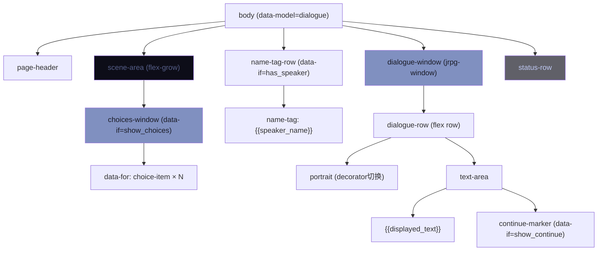
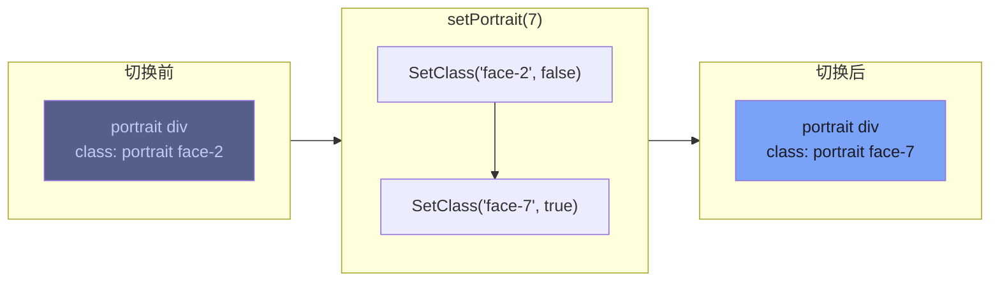
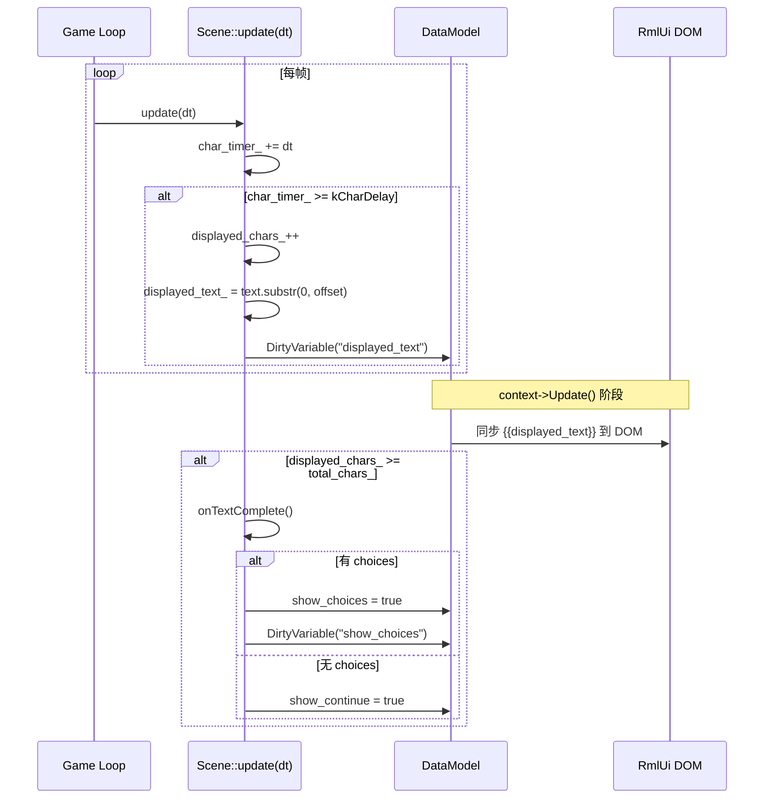
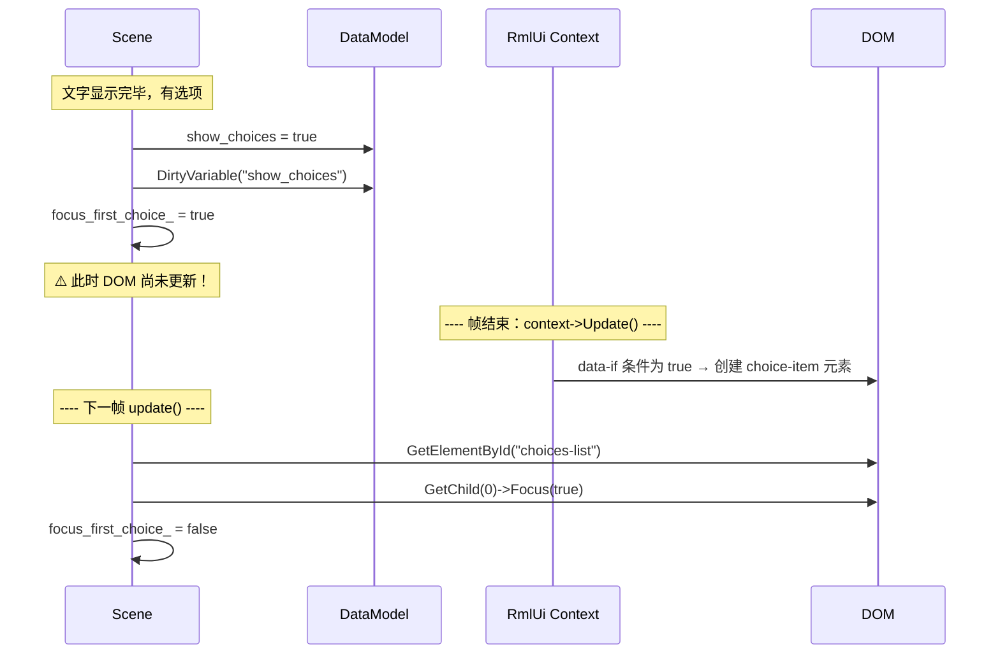
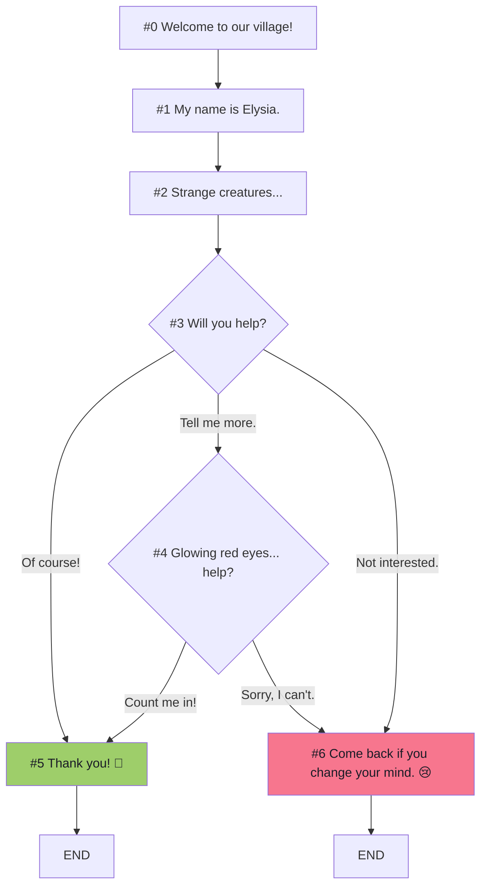
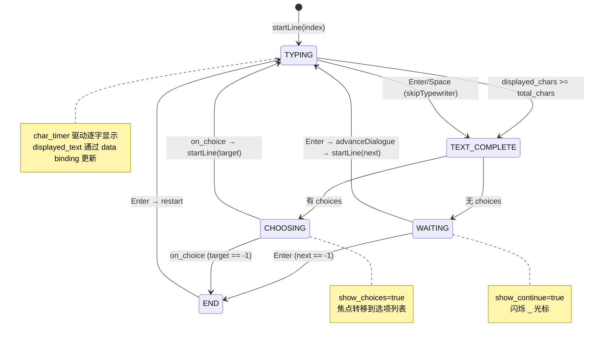
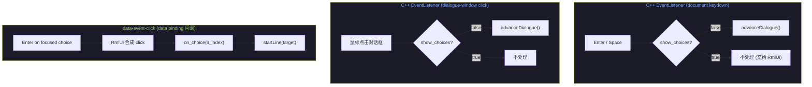

# L13: 对话系统

> 配套代码：`learn/jrpg_dialogue/` | 构建目标：`learn_jrpg_dialogue`

---

## 1. 本课概述

对话系统是 JRPG 中最高频的交互界面。本课实现一个完整的对话框架：

- **对话窗口布局**：角色头像 + 说话人名字标签 + 文字区域
- **打字机效果**：逐字显示文本，支持 UTF-8，可按键跳过
- **选项分支**：`data-for` 渲染选项列表，键盘导航选择
- **数据绑定驱动**：全部 UI 状态通过 data model 同步
- **表情切换**：通过 `@spritesheet` + CSS 类切换角色头像表情

---

## 2. 对话窗口布局

### 2.1 整体结构

经典 JRPG 对话框位于屏幕底部，DOM 层级关系如下：



屏幕布局示意：

```
┌── Scene area (游戏世界 / 空白区) ──────────────────┐
│                         ┌─ Choices (条件出现) ──┐  │
│                         │ > Of course!          │  │
│                         │   Tell me more.       │  │
│                         └───────────────────────┘  │
├── Name tag ──┐                                      │
├──────────────┴──────────────────────────────────────┤
│ [Portrait]  Hello, adventurer! Welcome to our...▮  │
├─────────────────────────────────────────────────────┤
│ Enter: advance | Space: skip                         │
└──────────────────────────────────────────────────────┘
```

### 2.2 名字标签重叠效果

名字标签浮在对话窗口上方，通过负 margin 实现重叠：

```css
.name-tag-row {
    position: relative;
    z-index: 1;
    margin-bottom: -8dp;   /* 向下重叠 8dp */
    padding-left: 16dp;
}

.name-tag {
    display: inline-block;  /* 自适应内容宽度 */
    padding: 2dp 12dp;
}
```

`data-if="has_speaker"` 控制名字标签的显示/隐藏——无说话人时自动移除。

### 2.3 头像与文字的横向排列

```html
<div class="dialogue-row">
    <div class="portrait" id="portrait"></div>
    <div class="text-area">
        <span>{{displayed_text}}</span>
        <span class="continue-marker" data-if="show_continue">_</span>
    </div>
</div>
```

```css
.dialogue-row {
    display: flex;
    flex-direction: row;
    gap: 8dp;
}

.portrait {
    width: 48dp;
    height: 48dp;
    min-width: 48dp;
    border: 1dp #565f89;
}
```

头像 div 没有内容文字，通过 `decorator: image(sprite)` 显示精灵图。

---

## 3. 角色头像精灵表

### 3.1 @spritesheet 声明

头像素材为 3 行 × 5 列的精灵表，每格 64×64 像素：

```css
@spritesheet portraits {
    src: ../../../assets/farm-rpg/Character and Portrait/Portrait/Premade/1.png;
    resolution: 1x;

    face-0:   0px   0px 64px 64px;   /* 默认 */
    face-1:  64px   0px 64px 64px;   /* 微笑 */
    face-2: 128px   0px 64px 64px;   /* 惊讶 */
    /* ... 共 15 个表情 */
}
```

### 3.2 CSS 类映射

每个表情对应一个 CSS 类：

```css
.face-0  { decorator: image(face-0); }
.face-1  { decorator: image(face-1); }
/* ... */
```

### 3.3 C++ 切换表情

通过 `SetClass` 动态切换当前显示的表情：



```cpp
void setPortrait(int idx) {
    if (current_portrait_ >= 0)
        portrait_el_->SetClass("face-" + std::to_string(current_portrait_), false);
    current_portrait_ = idx;
    if (idx >= 0)
        portrait_el_->SetClass("face-" + std::to_string(idx), true);
}
```

> **为什么不用 data binding 切换 decorator？**
> RmlUi 的 `decorator` 属性不能通过 data binding 动态设置。CSS 类切换是推荐的方式。

---

## 4. 打字机效果

### 4.1 原理

每帧更新已显示的字符数，用 `substr()` 截取文本前缀，通过 data binding 推送到 UI：



### 4.2 UTF-8 安全切片

直接按字节截断会破坏多字节字符（中文/日文）。预计算每个 UTF-8 字符的字节偏移：

```cpp
void prepareTypewriter(const std::string& text) {
    char_offsets_.clear();
    char_offsets_.push_back(0);
    for (size_t i = 0; i < text.size();) {
        auto c = static_cast<unsigned char>(text[i]);
        int len = (c < 0x80) ? 1 : (c < 0xE0) ? 2 : (c < 0xF0) ? 3 : 4;
        i += len;
        char_offsets_.push_back(static_cast<int>(i));
    }
    total_chars_ = static_cast<int>(char_offsets_.size()) - 1;
}
```

更新时使用预计算偏移安全截取：

```cpp
displayed_text_ = current_text_.substr(0, char_offsets_[displayed_chars_]);
```

### 4.3 按键跳过

Space 或 Enter 立即显示全文：

```cpp
void skipTypewriter() {
    displayed_chars_ = total_chars_;
    displayed_text_  = current_text_;
    model_handle_.DirtyVariable("displayed_text");
    onTextComplete();
}
```

### 4.4 等待输入标记

文字显示完成后出现闪烁的 `_` 光标，提示玩家按键继续：

```html
<span class="continue-marker" data-if="show_continue">_</span>
```

```css
.continue-marker {
    animation: 0.6s linear infinite cursor-blink;
}
```

`show_continue` 在文字完成 **且** 无选项时为 true。有选项时隐藏光标，焦点转移到选项列表。

---

## 5. 选项分支

### 5.1 data-for 动态渲染

选项列表通过 data binding 动态生成：

```html
<div data-for="choice : choices" class="choice-item"
     data-event-click="on_choice(it_index)">
    <span class="cursor">&gt;</span> {{choice.label}}
</div>
```

`it_index` 是 `data-for` 内置变量，自动提供当前项的索引值。

### 5.2 struct 注册

```cpp
if (auto sh = ctor.RegisterStruct<Choice>()) {
    sh.RegisterMember("label", &Choice::label);
}
ctor.RegisterArray<std::vector<Choice>>();
ctor.Bind("choices", &choices_);
```

### 5.3 键盘导航

选项项复用 L12 的菜单项样式和导航属性：

```css
.choice-item {
    tab-index: auto;
    nav-up: auto;
    nav-down: auto;
}
```

### 5.4 延迟聚焦

`data-if="show_choices"` 为 true 后，选项元素在下一帧才创建。必须延迟一帧再聚焦：



```cpp
// 在 onTextComplete() 中：
focus_first_choice_ = true;

// 在 update() 中：
if (focus_first_choice_) {
    auto* list = doc_->GetElementById("choices-list");
    if (list && list->GetNumChildren() > 0) {
        list->GetChild(0)->Focus(true);
        focus_first_choice_ = false;
    }
}
```

> **为什么需要延迟？** data model 的 DOM 更新发生在 RmlUi 的 `context->Update()` 阶段，
> 晚于场景的 `update()` 调用。设置 dirty variable 后，同帧内 DOM 尚未更新。

---

## 6. 对话脚本结构

### 6.1 DialogueLine 数据结构

```cpp
struct DialogueLine {
    std::string              speaker;        // 说话人名字
    int                      portrait_idx;   // 表情精灵索引
    std::string              text;           // 对话文本
    std::vector<std::string> choices;        // 选项文字（空 = 无选项）
    std::vector<int>         choice_targets; // 每个选项跳转的行号
    int                      next;           // 默认下一行（-1 = 结束）
};
```

演示脚本的分支结构：



### 6.2 对话流程状态机



---

## 7. 事件处理策略

本课使用**混合模式**——根据事件性质选择最合适的处理方式：



| 事件 | 处理方式 | 原因 |
|------|----------|------|
| Enter/Space 推进对话 | C++ `EventListener` on document keydown | 全局捕获，不依赖焦点元素 |
| 点击对话窗口推进 | C++ `EventListener` on dialogue-window click | 直接 DOM 事件 |
| 选择选项 | `data-event-click="on_choice(it_index)"` | data-for 元素最适合用 data binding 回调 |

> **关键**：当选项可见时，keydown 监听器**不处理** Enter/Space。此时 Enter 由
> 聚焦的选项元素通过 `tab-index: auto` → 合成 click → `data-event-click` 自动处理。

---

## 8. 练习

### 8.1 基础练习
1. 修改 `kCharDelay` 值，观察打字速度变化
2. 为对话脚本添加第二个角色（不同名字、不同头像），观察名字标签和头像的切换
3. 将打字机光标字符从 `_` 改为 `v`（模拟 RPGMaker 的"继续"标记）

### 8.2 进阶练习
1. **文字音效**：每显示一个字符时播放一个短促音效（模拟 Undertale 风格对话）
2. **富文本对话**：在 `SetInnerRML()` 中插入 `<span style="color: #e0af68;">关键词</span>` 高亮
3. **选项动画**：选项窗口出现时添加 L12 学过的 `window-open` 动画

### 8.3 挑战练习
将对话脚本从硬编码改为 JSON 文件加载，结构如：
```json
{
  "lines": [
    {"speaker": "Elysia", "portrait": 0, "text": "Hello!",
     "choices": [{"label": "Hi!", "next": 2}], "next": 1}
  ]
}
```

---

## 9. 概念总结

| 概念 | 要点 |
|------|------|
| `data-if` | 条件显示/隐藏元素（从 DOM 添加/移除） |
| `data-for` + `it_index` | 渲染列表 + 获取当前项索引 |
| `data-event-click` | data binding 事件回调，适用于动态生成的元素 |
| `DirtyAllVariables()` | 批量标记所有绑定变量为脏，适合多变量同时变化 |
| `RegisterStruct` + `RegisterArray` | 绑定 struct 数组到 data-for |
| UTF-8 字符偏移 | 预计算 `char_offsets_[]` 防止截断多字节字符 |
| `decorator: image(sprite)` | 通过 CSS 类切换装饰器实现表情切换 |
| 延迟聚焦 | `data-if` 元素在下一帧才创建，聚焦需延迟 |
| 混合事件模式 | 全局键盘用 `EventListener`，列表项用 `data-event-click` |
