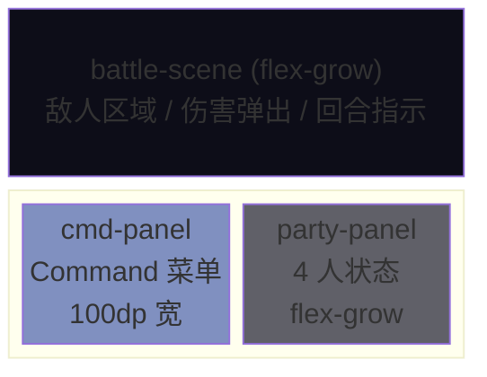
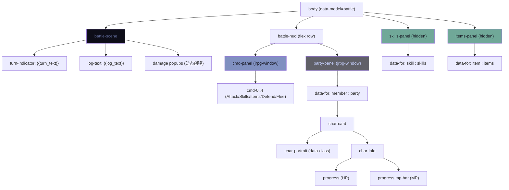
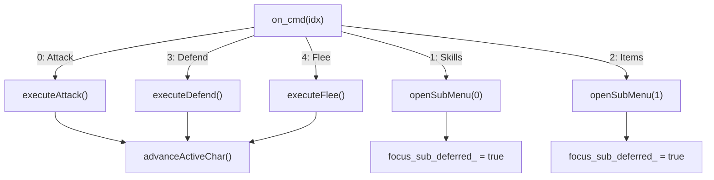
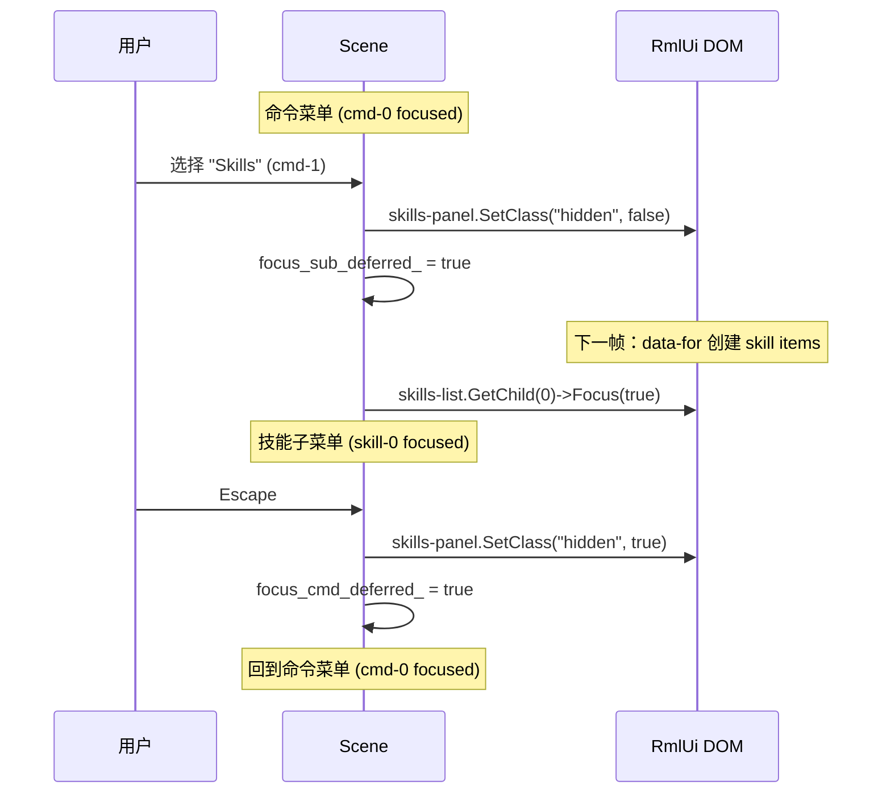
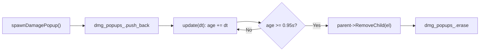
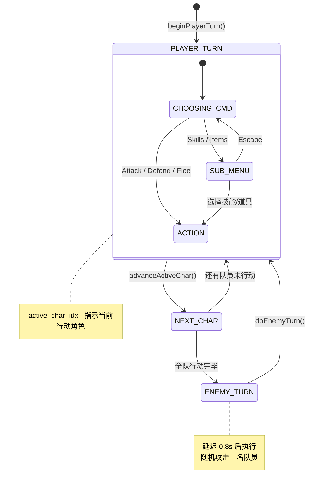
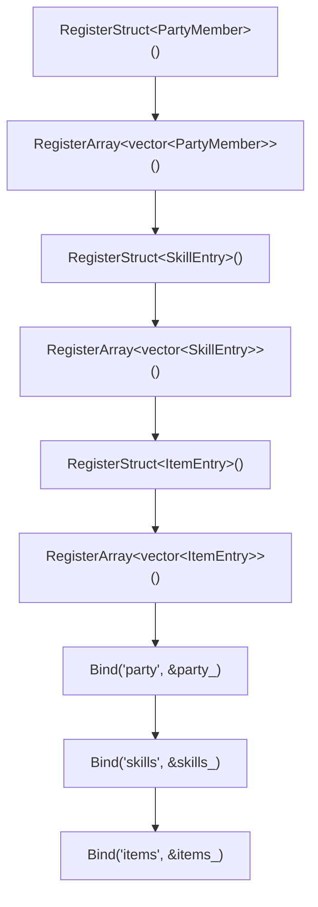

# L14: 战斗界面

> 配套代码：`learn/jrpg_battle/` | 构建目标：`learn_jrpg_battle`

---

## 1. 本课概述

回合制战斗 UI 是 JRPG 中最复杂的界面，整合了前面所有课程的技术。本课实现：

- **角色状态面板**：`<progress>` 元素做 HP/MP 条，`data-for` 渲染 4 人队伍
- **行动命令菜单**：攻击/技能/道具/防御/逃跑，键盘导航
- **技能/道具子菜单**：展开/收起，Escape 返回上级，不可用项灰显
- **伤害数字弹出**：`CreateElement` 动态创建 + `@keyframes` 浮动淡出
- **受击闪烁**：`@keyframes` 闪烁动画
- **回合管理**：玩家 4 人依次行动 → 敌人回合 → 循环

---

## 2. 整体布局

### 2.1 屏幕分区



### 2.2 DOM 结构



---

## 3. 角色状态面板

### 3.1 `<progress>` 元素

RmlUi 内置 `<progress>` 元素，自动管理填充条渲染：

```html
<progress data-attr-value="member.hp_ratio"
          data-class-hp-low="member.hp_low">
</progress>
```

| 属性 | 说明 |
|------|------|
| `value` | 填充比例，0.0 ~ 1.0（默认 max=1.0） |
| `max` | 最大值（默认 1.0） |
| `direction` | 填充方向：`right`(默认) / `left` / `top` / `bottom` |

### 3.2 样式化 progress

`<progress>` 内部自动创建一个 `fill` 伪元素，可通过 `progress fill` 选择器样式化：

```css
progress {
    display: block;
    height: 6dp;
    background-color: #1a1b26;     /* 轨道底色 */
    border: 1dp #333355;
}

progress fill {
    background-color: #9ece6a;     /* HP 填充色 (绿) */
}

progress.mp-bar fill {
    background-color: #7aa2f7;     /* MP 填充色 (蓝) */
}

progress.hp-low fill {
    background-color: #f7768e;     /* 低 HP 警告 (红) */
}
```

### 3.3 HP 比例与低血量标记

```cpp
void PartyMember::refreshRatios() {
    hp_ratio = float(hp) / float(max_hp);
    mp_ratio = float(mp) / float(max_mp);
    hp_low   = (hp_ratio < 0.3f);
}
```

`data-attr-value` 将 `hp_ratio` 绑定到 `<progress>` 的 `value` 属性；`data-class-hp-low` 动态切换 `.hp-low` 类。

### 3.4 data-class 头像切换

`data-for` 内部无法使用 C++ `SetClass()`，需要用 `data-class-*` 绑定布尔值：

```html
<div class="char-portrait"
     data-class-face-0="member.face_0"
     data-class-face-1="member.face_1"
     ...>
</div>
```

```cpp
struct PartyMember {
    int face_idx = 0;
    bool face_0 = false, face_1 = false, ...;

    void setFaceFlags() {
        face_0 = (face_idx == 0);
        face_1 = (face_idx == 1);
        // ...
    }
};
```

> **为什么不用 SetClass？** `data-for` 生成的元素是 data model 管理的，生命周期由 binding 控制。
> 用 `data-class-*` 让 data model 统一驱动所有状态。

### 3.5 当前行动角色高亮

```html
<div data-for="member : party" class="char-card"
     data-class-active-char="member.is_active">
```

```css
.char-card.active-char {
    border: 1dp #e0af6880;   /* 金色边框 */
}
```

---

## 4. 行动命令菜单

### 4.1 命令列表

5 个固定命令项，使用 `data-event-click` 直接绑定回调：

```html
<div class="cmd-item" data-event-click="on_cmd(0)">
    <span class="cursor">&gt;</span> Attack
</div>
```

### 4.2 命令分发



---

## 5. 子菜单系统（技能 / 道具）

### 5.1 显示/隐藏

子菜单用 CSS 类 `.hidden` 控制 `display: none`：

```cpp
void openSubMenu(int type) {
    sub_menu_type_ = type;
    skills_panel_el_->SetClass("hidden", type != 0);
    items_panel_el_->SetClass("hidden",  type != 1);
    focus_sub_deferred_ = true;
}

void closeSubMenu() {
    sub_menu_type_ = -1;
    skills_panel_el_->SetClass("hidden", true);
    items_panel_el_->SetClass("hidden", true);
}
```

### 5.2 Escape 返回上级菜单

```cpp
if (key == KI_ESCAPE && sub_menu_type_ >= 0) {
    closeSubMenu();
    event.StopPropagation();
}
```

### 5.3 不可用项灰显

```css
.sub-item.disabled {
    color: #444466;
    tab-index: none;   /* 键盘导航跳过 */
}
```

`tab-index: none` 确保键盘导航自动跳过灰色项。

### 5.4 多层菜单焦点管理



### 5.5 智能聚焦：跳过 disabled 项

```cpp
if (focus_sub_deferred_) {
    auto* list = doc_->GetElementById(list_id);
    for (int i = 0; i < list->GetNumChildren(); ++i) {
        if (!list->GetChild(i)->IsClassSet("disabled")) {
            list->GetChild(i)->Focus(true);
            break;
        }
    }
}
```

---

## 6. 伤害数字弹出动画

### 6.1 动态创建元素

```cpp
auto el_ptr = doc_->CreateElement("div");
auto* el = el_ptr.get();
el->SetClassNames("dmg-popup dmg-animate");
el->SetInnerRML(std::to_string(value));
el->SetProperty("left", std::to_string(x) + "dp");
el->SetProperty("top",  std::to_string(y) + "dp");
battle_scene_el_->AppendChild(std::move(el_ptr));
dmg_popups_.push_back({el, 0.0f});
```

> **注意**：`CreateElement()` 返回 `Rml::ElementPtr`（unique_ptr）。保存裸指针用于后续操作，
> 将所有权通过 `std::move` 转移给父元素。

### 6.2 浮动淡出动画

```css
@keyframes dmg-float {
    0% {
        transform: translateY(0);
        opacity: 1;
    }
    70% {
        opacity: 1;
    }
    100% {
        transform: translateY(-30dp);
        opacity: 0;
    }
}

.dmg-animate {
    animation: 0.9s cubic-out dmg-float;
}
```

### 6.3 生命周期管理



---

## 7. 受击闪烁效果

```css
@keyframes hit-blink {
    0%  { opacity: 1; }
    25% { opacity: 0.2; }
    50% { opacity: 1; }
    75% { opacity: 0.2; }
    100%{ opacity: 1; }
}

.hit-flash {
    animation: 0.3s linear hit-blink;
}
```

通过 `SetClass("hit-flash", true)` 触发，动画结束后移除类即可重复触发。

---

## 8. 回合管理

### 8.1 状态机



### 8.2 敌人回合延迟

```cpp
void advanceActiveChar() {
    active_char_idx_ = (active_char_idx_ + 1) % party_.size();
    if (active_char_idx_ == 0) {
        // 全队行动完毕 → 敌人回合
        enemy_turn_pending_ = true;
        enemy_turn_timer_   = 0.8f;
    } else {
        beginPlayerTurn();
    }
}

// 在 update(dt) 中：
if (enemy_turn_pending_) {
    enemy_turn_timer_ -= dt;
    if (enemy_turn_timer_ <= 0) {
        doEnemyTurn();   // 敌人攻击 → beginPlayerTurn()
    }
}
```

---

## 9. data binding 要点

### 9.1 多 struct 注册顺序

所有 `RegisterStruct` 和 `RegisterArray` 必须在 `Bind` 之前完成：



### 9.2 data-attr-* 绑定属性

`data-attr-value` 将 data model 变量绑定到 HTML 属性（而非文本内容）：

```html
<progress data-attr-value="member.hp_ratio">
```

等价于在 C++ 中调用 `element->SetAttribute("value", hp_ratio)`，但由 data model 自动驱动。

### 9.3 data-class-* 条件类名

`data-class-{classname}` 根据布尔值添加/移除 CSS 类：

```html
<div data-class-active-char="member.is_active"
     data-class-hp-low="member.hp_low">
```

| 绑定变量为 true | 效果 |
|----------------|------|
| `is_active = true` | 添加 `.active-char` 类 |
| `hp_low = true` | 添加 `.hp-low` 类 |

---

## 10. 练习

### 10.1 基础练习
1. 修改 HP 条颜色阈值：30% 以下红色 → 50% 以下黄色 → 正常绿色
2. 在技能子菜单聚焦项变化时更新 `skill_desc` 描述栏文字
3. 为治疗数字弹出添加一个不同的动画（先放大再缩回）

### 10.2 进阶练习
1. **目标选择**：选择技能后弹出目标选择菜单（选择队友治疗 / 选择敌人攻击）
2. **ATB 条**：为每个角色添加一个行动条（`<progress direction="right">`），模拟 ATB 系统
3. **状态异常图标**：在角色卡片中用 `data-for` + 精灵图渲染中毒/麻痹图标行

### 10.3 挑战练习
将战斗逻辑抽离到独立的 `BattleEngine` 类中，Scene 仅负责 UI 绑定，实现 MVC 分离。

---

## 11. 概念总结

| 概念 | 要点 |
|------|------|
| `<progress>` | 内置填充条元素，`value` / `max` / `direction` 属性 |
| `progress fill` | progress 的填充伪元素，可设 `background-color` / `decorator` |
| `data-attr-value` | 将 data model 变量绑定到 HTML 属性（非文本） |
| `data-class-*` | 条件类名，根据布尔值添加/移除 CSS 类 |
| `CreateElement` + `AppendChild` | 动态创建 DOM 元素，返回 `ElementPtr`(unique_ptr) |
| `SetProperty` | C++ 端直接设置内联样式（position / left / top 等） |
| `IsClassSet` | 检查元素是否具有某个 CSS 类 |
| `.disabled` + `tab-index: none` | 灰显项 + 键盘导航跳过 |
| `StopPropagation()` | 阻止事件冒泡（Escape 不传播到上层） |
| 延迟敌人回合 | `update(dt)` 中计时器驱动，避免瞬间执行 |
