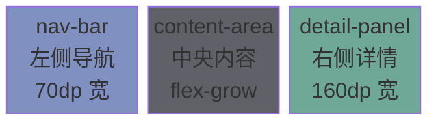
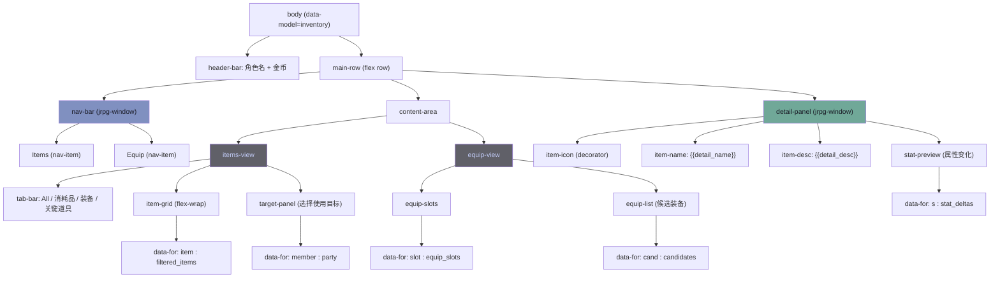
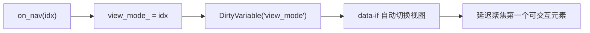
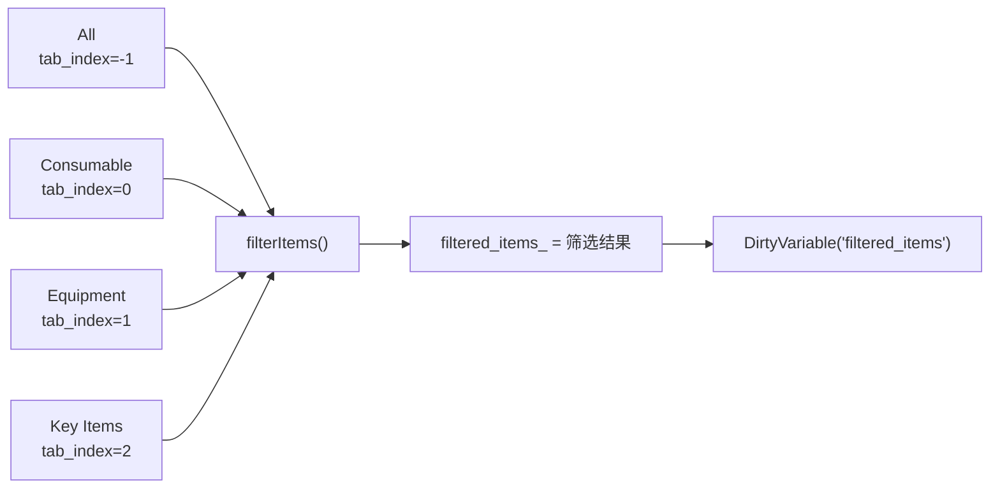
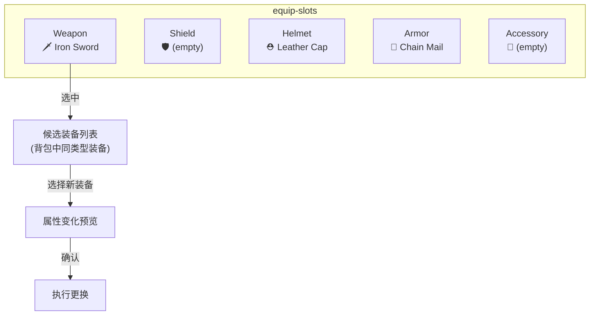
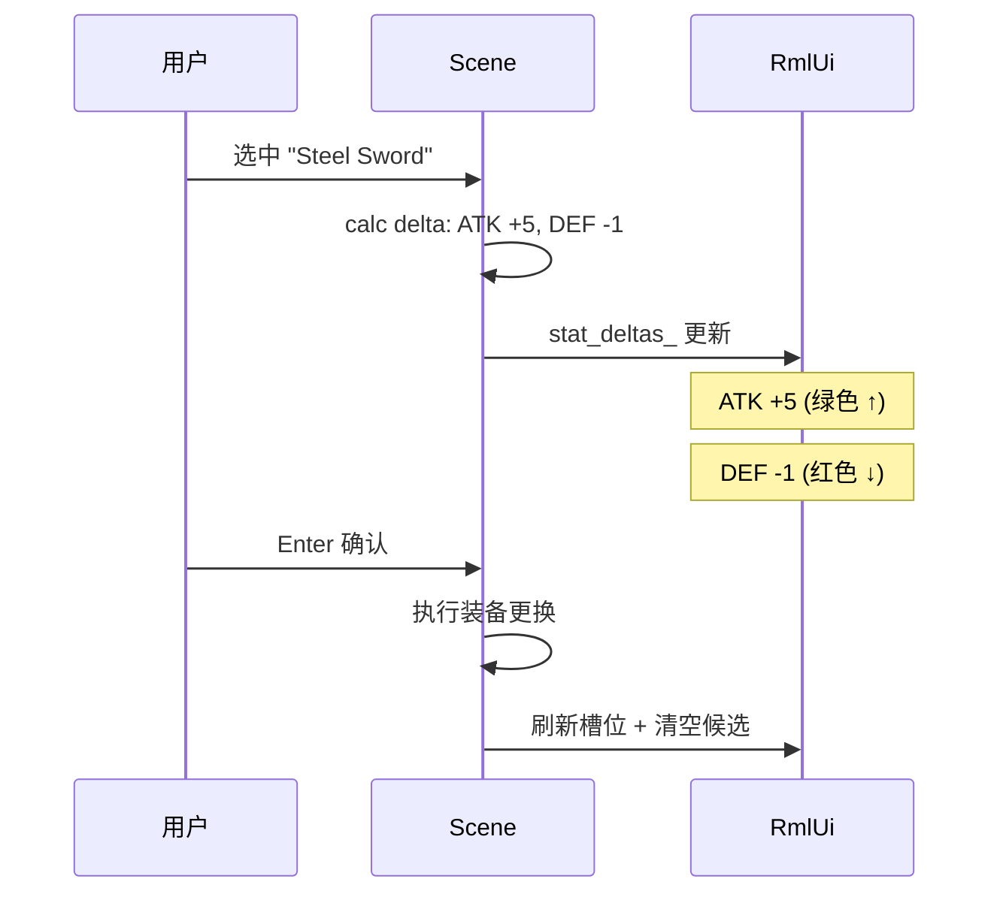
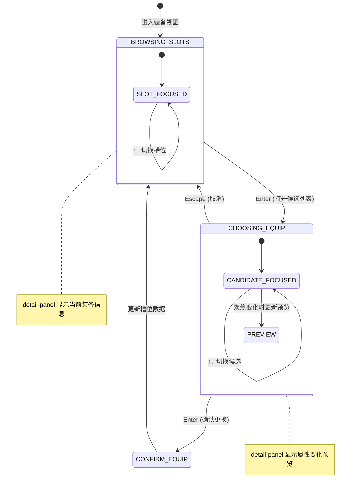
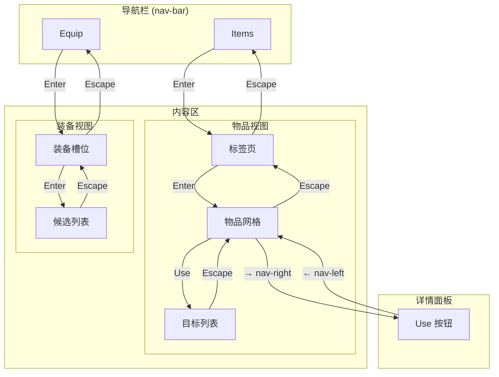
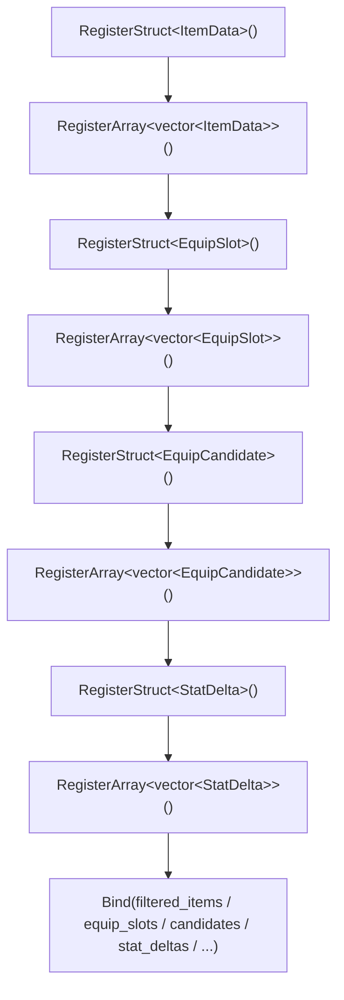

# L15: 物品与装备系统

> 配套代码：`learn/jrpg_inventory/` | 构建目标：`learn_jrpg_inventory`

---

## 1. 本课概述

背包与装备系统是 JRPG 中核心的资源管理界面。本课实现：

- **背包标签页**：All / 消耗品 / 装备 / 关键道具四分类，自定义 tab 按钮组切换
- **物品网格**：`flex-wrap` 实现 N×M 格子布局，`data-for` 渲染物品列表
- **物品详情**：选中物品后在右侧显示名称、图标、描述、效果
- **装备面板**：5 个装备槽位（武器/盾牌/头盔/铠甲/饰品），当前装备显示
- **装备更换**：选中槽位 → 弹出可装备列表 → 属性对比预览
- **属性变化**：攻击力 +3 ↑（绿色）/ -2 ↓（红色）实时预览

---

## 2. 整体布局

### 2.1 屏幕分区（640×360dp）



三栏布局是 JRPG 菜单的经典模式：左侧分类导航、中央物品/装备列表、右侧详情预览。

### 2.2 DOM 结构



---

## 3. 左侧导航切换

### 3.1 视图切换模式

两个主视图（Items / Equip）通过 `data-if` 条件显示控制：

```html
<div data-if="view_mode == 0" id="items-view">...</div>
<div data-if="view_mode == 1" id="equip-view">...</div>
```

```cpp
int view_mode_ = 0;  // 0=Items, 1=Equip

void switchView(int mode) {
    view_mode_ = mode;
    model_handle_.DirtyVariable("view_mode");
    // 重置详情面板
    clearDetail();
}
```

### 3.2 导航项高亮

```html
<div class="nav-item" data-class-nav-active="is_items_view"
     data-event-click="on_nav(0)">
    <span class="cursor">&gt;</span> Items
</div>
```



---

## 4. 背包物品网格

### 4.1 flex-wrap 网格布局

物品格子使用 `flex-wrap` 实现自适应网格——当一行放不下时自动换行：

```css
.item-grid {
    display: flex;
    flex-direction: row;
    flex-wrap: wrap;
    align-content: flex-start;
    gap: 3dp;
    overflow: auto scroll;
    flex-grow: 1;             /* 填满剩余空间 */
    width: 100%;
}

.item-cell {
    flex: 0 0 36dp;
    min-width: 36dp;
    max-width: 36dp;
    height: 36dp;
    position: relative;      /* 数量角标的定位锚点 */
    box-sizing: border-box;
    tab-index: auto;
    nav-up: auto;
    nav-down: auto;
    nav-left: auto;
    nav-right: auto;
}
```

> **nav 四方向**：网格布局需要 `nav-left/right` + `nav-up/down` 全部开启，
> 这样方向键可以在格子间自由移动。这与菜单列表只需 `nav-up/down` 不同。

### 4.2 物品数量角标

```html
<div data-for="item : filtered_items" class="item-cell" id="item-{{it_index}}"
     data-event-mouseover="on_item_select(it_index)"
     data-event-click="on_item_select(it_index)">
    <div class="item-icon"
         data-class-ic0="item.ic0" data-class-ic1="item.ic1"
         data-class-ic2="item.ic2" data-class-ic3="item.ic3"
         data-class-ic4="item.ic4" data-class-ic5="item.ic5"
         data-class-ic6="item.ic6" data-class-ic7="item.ic7">
    </div>
    <div data-if="item.qty > 1" class="item-qty">x{{item.qty}}</div>
</div>
```

每个图标 ID 对应一个布尔值 `ic0`~`ic7`，通过 `data-class-icN` 条件地添加 CSS 类。
这是 RmlUi data binding 不支持动态 decorator 名称的变通方案（同 L14 头像切换）。

角标使用绝对定位叠加在格子右下角：

```css
.item-qty {
    position: absolute;
    right: 1dp;
    bottom: 0;
    font-size: 8dp;
    color: #ffffff;
    background-color: #00000080;
    padding: 0 2dp;
}
```

### 4.3 分类标签页



本课使用自定义 tab 按钮组，而不是 RmlUi 内置 `<tabset>`。原因是切换标签时不仅要切视觉状态，还要在 C++ 端同步重建 `filtered_items_`：

```cpp
enum class ItemCategory { Consumable, Equipment, KeyItem };

void filterItems() {
    filtered_items_.clear();
    for (int i = 0; i < static_cast<int>(all_items_.size()); ++i) {
        const bool tab_matches = (current_tab_ == -1)
                              || (all_items_[i].category == current_tab_);
        if (tab_matches && all_items_[i].qty > 0) {
            filtered_items_.push_back(all_items_[i]);
        }
    }
    model_handle_.DirtyVariable("filtered_items");
}
```

### 4.4 标签样式

```css
.tab-bar {
    display: flex;
    flex-direction: row;
    gap: 2dp;
    margin-bottom: 4dp;
}

.tab-btn {
    padding: 2dp 5dp;
    font-size: 8dp;
    color: #565f89;
    tab-index: auto;
    nav-left: auto;
    nav-right: auto;
    nav-down: auto;
    transition: color background-color 0.1s cubic-out;
}

.tab-btn.tab-active {
    color: #e0af68;
    background-color: #e0af6818;
    border-bottom: 1dp #e0af68;
}
```

---

## 5. 物品详情面板

### 5.1 选中物品时更新详情

```cpp
void onItemSelect(int filtered_idx) {
    if (filtered_idx < 0 || filtered_idx >= static_cast<int>(filtered_items_.size())) return;

    auto& item = filtered_items_[filtered_idx];
    detail_name_ = item.name;
    detail_desc_ = item.desc;
    setDetailIcon(item.icon_id);
    can_use_ = canUseItem(item);

    dirtyDetailBindings();
}
```

### 5.2 图标切换

与 L14 头像切换相同的 `data-class-*` 模式——每种图标 ID 对应一个布尔值和一个 CSS 类：

```css
.detail-icon {
    width: 32dp;
    height: 32dp;
    margin: 4dp auto 6dp auto;
    border: 1dp #33335580;
    background-color: #1a1b2640;
}

/* icon-0 ~ icon-7 在 @spritesheet 中定义 */
.ic0 { decorator: image(icon-0); }
.ic1 { decorator: image(icon-1); }
.ic2 { decorator: image(icon-2); }
/* ... ic3 ~ ic7 同理 */
```

```html
<div data-if="show_detail_icon" class="detail-icon"
     data-class-ic0="det_ic0" data-class-ic1="det_ic1"
     data-class-ic2="det_ic2" data-class-ic3="det_ic3"
     data-class-ic4="det_ic4" data-class-ic5="det_ic5"
     data-class-ic6="det_ic6" data-class-ic7="det_ic7">
</div>
```

### 5.3 使用按钮 + 目标选择

```html
<div data-if="show_use_button" class="action-btn"
     data-event-click="on_use_item">
    Use
</div>

<div data-if="show_targets" class="target-panel jrpg-window win-teal">
    <div class="win-title">{{target_panel_title}}</div>
    <div class="target-list" id="target-list">
        <div data-for="member : party" class="target-item"
             data-class-disabled="member.disabled"
             data-event-click="on_target_select(it_index)">
            <span class="cursor">&gt;</span>
            <span class="target-summary">{{member.target_summary}}</span>
        </div>
    </div>
</div>
```

目标列表这里刻意保持单行摘要，不在条目里堆两行复杂布局。这样布局更稳，鼠标命中区和键盘/手柄焦点也更容易保持一致。

```cpp
void PartyMember::refreshStatus() {
    status_text = isDown() ? "KO" : (poisoned ? "Poison" : "OK");
    target_summary = std::format("{} [{}]  HP {}/{}  MP {}/{}",
                                 name, status_text, hp, max_hp, mp, max_mp);
}

void onUseItem() {
    if (!can_use_) return;
    openTargetPanel();
}

void openTargetPanel() {
    const auto& item = all_items_[selected_item_master_idx_];
    show_targets_ = true;
    show_use_button_ = false;
    target_panel_title_ = "Use " + item.name;

    for (auto& member : party_) {
        member.disabled = !isTargetValidForItem(item, member);
    }

    model_handle_.DirtyVariable("show_targets");
    model_handle_.DirtyVariable("show_use_button");
    model_handle_.DirtyVariable("party");
    focus_target_deferred_ = true;
}

// 在 update(dt) 中维持目标列表焦点，避免弹窗失焦后方向键/手柄失效
if (show_targets_ && !focus_target_deferred_ && !hasFocusedTargetElement()) {
    focusTargetElement(getPreferredTargetIndex());
}

void confirmTargetUse(int target_idx) {
    auto& item = all_items_[selected_item_master_idx_];
    auto& target = party_[target_idx];

    // 根据道具效果结算 HP / MP / 复活 / 解毒
    item.qty--;
    closeTargetPanel(false, false);
    filterItems();
}
```

### 5.4 目标有效性判断

不同消耗品对目标有不同的限制条件——回复药只能对活着的人用，复活道具只能对 KO 的人用，解毒只对中毒目标有意义：

```cpp
bool isTargetValidForItem(const ItemData& item, const PartyMember& target) const {
    // 复活道具只能对 KO 目标使用
    if (item.revive_hp > 0) return target.isDown();

    // KO 目标不能接受非复活道具
    if (!target.isAlive()) return false;

    // 解毒：目标必须中毒（除非同时有 HP/MP 回复效果）
    if (item.cure_poison && !target.poisoned && item.heal_hp == 0 && item.heal_mp == 0)
        return false;

    return (item.heal_hp > 0) || (item.heal_mp > 0) || item.cure_poison;
}
```

`canUseItem()` 则遍历全队判断是否至少有一个有效目标，控制 Use 按钮的显示：

```cpp
bool canUseItem(const ItemData& item) const {
    if (item.category != kCatConsumable || item.qty <= 0) return false;
    return std::any_of(party_.begin(), party_.end(),
        [&](const PartyMember& m) { return isTargetValidForItem(item, m); });
}
```

### 5.5 目标预览文字

选中目标时在 detail-panel 中显示使用效果预览：

```cpp
std::string buildTargetPreviewText(const ItemData& item, const PartyMember& target) const {
    if (item.revive_hp > 0 && target.isDown()) {
        return std::format("Revive {} with {} HP.", target.name,
                           std::min(target.max_hp, item.revive_hp));
    }
    if (item.heal_hp > 0 && target.isAlive()) {
        int next_hp = std::min(target.max_hp, target.hp + item.heal_hp);
        return std::format("HP {} / {} -> {} / {}.",
                           target.hp, target.max_hp, next_hp, target.max_hp);
    }
    if (item.heal_mp > 0) {
        int next_mp = std::min(target.max_mp, target.mp + item.heal_mp);
        return std::format("MP {} / {} -> {} / {}.",
                           target.mp, target.max_mp, next_mp, target.max_mp);
    }
    if (item.cure_poison) {
        return target.poisoned ? "Will cure poison." : "Target is not poisoned.";
    }
    return target.status_text;
}
```

### 5.6 鼠标与键盘交互同步

目标列表同时支持鼠标 hover 和键盘方向键导航。使用引擎提供的 `HoverFocusSyncListener` 将鼠标悬停自动转化为焦点，确保两种输入方式的状态始终一致：

```cpp
hover_focus_listener_ = std::make_unique<engine::ui::rmlui::HoverFocusSyncListener>(
    *context_.getGLRenderer().getRmlUILayer(),
    [](Rml::Element* element) {
        // 只同步非禁用的 target-item
        return element != nullptr && element->IsClassSet("target-item")
            && !element->IsClassSet("disabled");
    });
doc_->AddEventListener("mouseover", hover_focus_listener_.get());
```

> **注意事项**：`HoverFocusSyncListener` 在 `clean()` 时必须先于 `unloadAllRmlDocuments()` 移除。

---

## 6. 装备系统

### 6.1 装备槽位



### 6.2 数据结构

```cpp
struct EquipSlot {
    std::string slot_name;     // "Weapon", "Shield", ...
    std::string equipped_name; // 当前装备名，空="(empty)"
    int  slot_type    = 0;     // 0=Weapon,1=Shield,2=Helmet,3=Armor,4=Accessory
    bool is_selected  = false; // 当前选中的槽位
    int  equipped_idx = -1;    // 在 all_items_ 中的索引，-1 = 空

    // icon 布尔值（同 ItemData 的 ic0~ic7 模式）
    bool ic0 = false, ic1 = false, ic2 = false, ic3 = false;
    bool ic4 = false, ic5 = false, ic6 = false, ic7 = false;
    void setIconFlags(int icon_id);
};

struct EquipCandidate {
    std::string name;
    int  atk_delta  = 0;   // 与当前装备的攻击差值
    int  def_delta  = 0;   // 与当前装备的防御差值
    int  spd_delta  = 0;   // 与当前装备的速度差值
    int  item_index = -1;  // 在 all_items_ 中的索引，-1 = "(Remove)"
};
```

### 6.3 属性变化预览

选中候选装备时，计算与当前装备的属性差值并显示：



### 6.4 属性变化颜色

```cpp
struct StatDelta {
    std::string label;       // "ATK", "DEF", "SPD"
    std::string display;     // "+5", "-1", "0"
    bool is_positive = false;
    bool is_negative = false;
};
```

```html
<div data-for="s : stat_deltas" class="stat-delta-row">
    <span class="delta-label">{{s.label}}</span>
    <span class="delta-value"
          data-class-delta-up="s.is_positive"
          data-class-delta-down="s.is_negative">
        {{s.display}}
    </span>
</div>
```

```css
.delta-up   { color: #9ece6a; }   /* 绿色：属性提升 */
.delta-down { color: #f7768e; }   /* 红色：属性下降 */
```

---

## 7. 装备更换流程

### 7.1 完整状态机



### 7.2 候选列表筛选

```cpp
void openCandidateList(int slot_idx) {
    auto& slot = equip_slots_[slot_idx];
    candidates_.clear();

    // "(Remove)" 选项：卸下当前装备（只在已装备时出现）
    if (slot.equipped_idx >= 0) {
        auto& cur = all_items_[slot.equipped_idx];
        candidates_.push_back({"(Remove)", -cur.atk, -cur.def, -cur.spd, -1});
    }

    // 从背包中筛选匹配该槽位类型的装备
    for (int i = 0; i < static_cast<int>(all_items_.size()); ++i) {
        auto& item = all_items_[i];
        if (item.category != kCatEquipment) continue;
        if (item.equip_slot != slot.slot_type) continue;
        if (item.qty <= 0) continue;
        if (i == slot.equipped_idx) continue;  // 跳过已装备的

        int cur_atk = 0, cur_def = 0, cur_spd = 0;
        if (slot.equipped_idx >= 0) {
            auto& cur = all_items_[slot.equipped_idx];
            cur_atk = cur.atk; cur_def = cur.def; cur_spd = cur.spd;
        }
        candidates_.push_back({
            item.name,
            item.atk - cur_atk, item.def - cur_def, item.spd - cur_spd,
            i
        });
    }

    show_candidates_ = true;
    model_handle_.DirtyVariable("candidates");
    model_handle_.DirtyVariable("show_candidates");
    focus_candidate_deferred_ = true;
}
```

### 7.3 确认装备更换

```cpp
void confirmEquip(int cand_idx) {
    auto& cand = candidates_[cand_idx];
    auto& slot = equip_slots_[selected_slot_idx_];

    // 旧装备回到背包
    if (slot.equipped_idx >= 0) {
        all_items_[slot.equipped_idx].qty++;
    }

    // 新装备从背包扣除
    if (cand.item_index >= 0) {
        all_items_[cand.item_index].qty--;
        slot.equipped_name = cand.name;
        slot.equipped_idx = cand.item_index;
        // 更新角色属性
    } else {
        slot.equipped_name = "(empty)";
        slot.equipped_idx = -1;
    }

    // 刷新 UI 和背包过滤结果
    model_handle_.DirtyVariable("equip_slots");
    filterItems();
    closeCandidateList();
}
```

---

## 8. 焦点管理策略

### 8.1 多层面板焦点流



### 8.2 延迟聚焦

与 L14 相同，`data-for` / `data-if` 生成的元素需要等一帧后才能聚焦。物品格子、装备槽、候选列表、目标列表都采用同一套延迟聚焦模式：

```cpp
// 在 update(dt) 中
if (focus_grid_deferred_) {
    if (auto* grid = doc_->GetElementById("item-grid")) {
        if (grid->GetNumChildren() > 0) {
            grid->GetChild(0)->Focus(true);
            focus_grid_deferred_ = false;
        }
    }
}
```

---

## 9. data binding 要点

### 9.1 多 struct + 多 array 注册



### 9.2 过滤后的视图数组

直接绑定一个 `filtered_items_` 数组，而非在 RML 模板中做过滤。
这样切换标签页时只需重建 `filtered_items_` 并 `DirtyVariable`：

```cpp
// 绑定的是 filtered 视图，不是全量 all_items_
ctor.Bind("filtered_items", &filtered_items_);
```

> **为什么不绑 all_items_ 再在 RML 里过滤？** RmlUi 的 `data-for` 不支持过滤表达式，
> 必须在 C++ 端准备好子集。

### 9.3 data-if 与 view_mode 联动

```html
<div data-if="view_mode == 0" id="items-view">...</div>
<div data-if="view_mode == 1" id="equip-view">...</div>
```

`data-if` 表达式支持 `==` 比较运算符，可以直接用整数比较控制视图切换。

---

## 10. 角色属性面板

### 10.1 当前属性显示

```html
<div class="char-stats-row">
    <span class="stat-chip">ATK {{char_atk_text}}</span>
    <span class="stat-chip">DEF {{char_def_text}}</span>
    <span class="stat-chip">SPD {{char_spd_text}}</span>
</div>
```

绑定的是 `char_atk_text_`（`std::string`）而非 `char_atk_`（`int`），因为 RmlUi 文本插值直接显示字符串更方便，也方便未来加格式化（如千位分隔符）。

### 10.2 装备属性预览的实现技巧

选中候选装备时，detail-panel 中显示属性差值：

```
ATK  +5  (绿)
DEF  -1  (红)
SPD   0  (灰)
```

通过 `stat_deltas_` 数组渲染，每个元素包含 label / display / is_positive / is_negative：

```css
.delta-value {
    font-size: 10dp;
    color: #565f89;     /* 无变化：灰色 */
}

.delta-value.delta-up {
    color: #9ece6a;     /* 提升：绿色 */
}

.delta-value.delta-down {
    color: #f7768e;     /* 下降：红色 */
}
```

---

## 11. 练习

### 11.1 基础练习
1. 物品使用后数量减少，到 0 时从列表移除（更新 `all_items_` 并重新过滤）
2. 为目标列表补上头像或状态图标，让 `Phoenix Down` / `Antidote` 的可用目标更直观
3. 装备更换后重新计算角色总属性并刷新显示

### 11.2 进阶练习
1. **物品排序**：在标签栏右侧添加排序按钮，按名称/数量排序
2. **拖拽排列**：探索 RmlUi 的 `drag` 事件，实现物品格子拖拽交换
3. **多角色切换**：在装备面板顶部添加角色头像行，左右键切换角色

### 11.3 挑战练习
将物品数据从 JSON 文件加载（`assets/data/items.json`），实现数据驱动的物品系统。

---

## 12. 概念总结

| 概念 | 要点 |
|------|------|
| `flex-wrap` | 弹性换行，实现自适应网格布局，需配合固定 `flex-basis` 子元素 |
| `nav-left/right` + `nav-up/down` | 网格布局需四方向导航（菜单列表只需上下） |
| `data-if` 表达式 | 支持 `==` 比较，用整数控制多视图切换 |
| C++ 端过滤 | `data-for` 不支持过滤表达式，用 C++ 准备子集数组 |
| 绝对定位角标 | 父元素 `position: relative`，角标 `position: absolute` + `right/bottom` |
| `data-class-*` 图标切换 | 每种图标对应一个布尔值，同 L14 头像切换模式 |
| 属性差值预览 | `StatDelta` 结构 + `is_positive/is_negative` 布尔 → 条件 CSS 类 |
| 多层焦点流 | 导航栏 → 内容区 → 详情面板 / 目标列表，Enter 进入 / Escape 返回 |
| `overflow: auto scroll` | 列表超出时自动显示滚动条 |
| 候选列表筛选 | 根据槽位类型过滤背包中的装备项 |
| 目标选择覆盖层 | `Use` 打开 `target-panel`，选择角色后再结算道具效果 |
