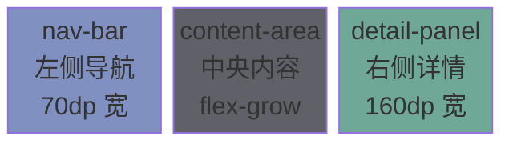
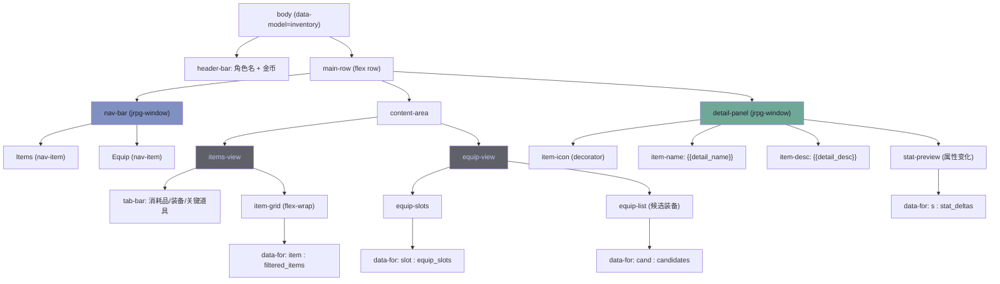
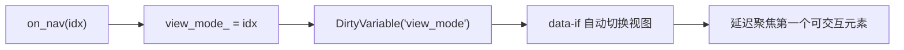
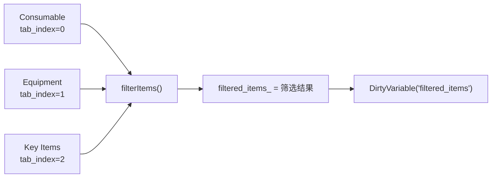
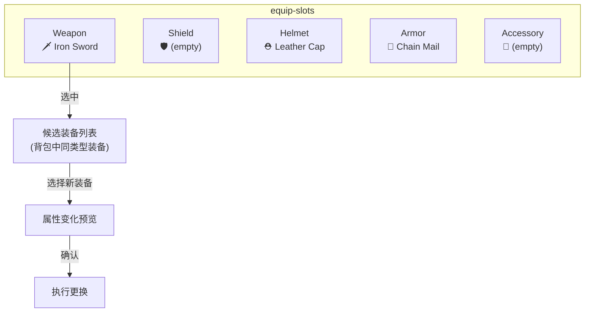
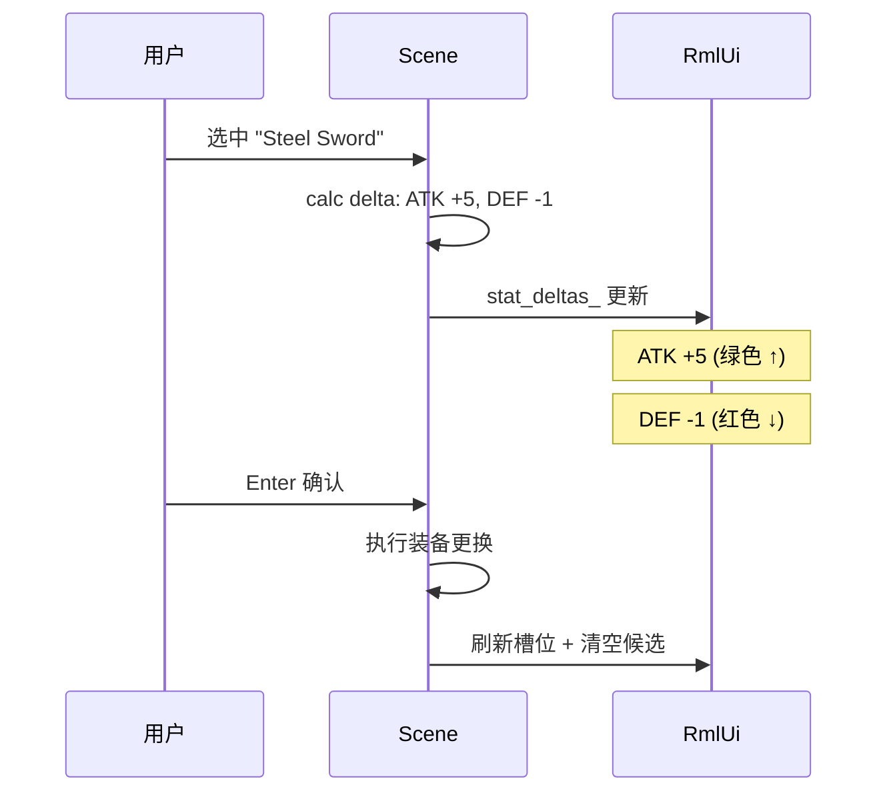
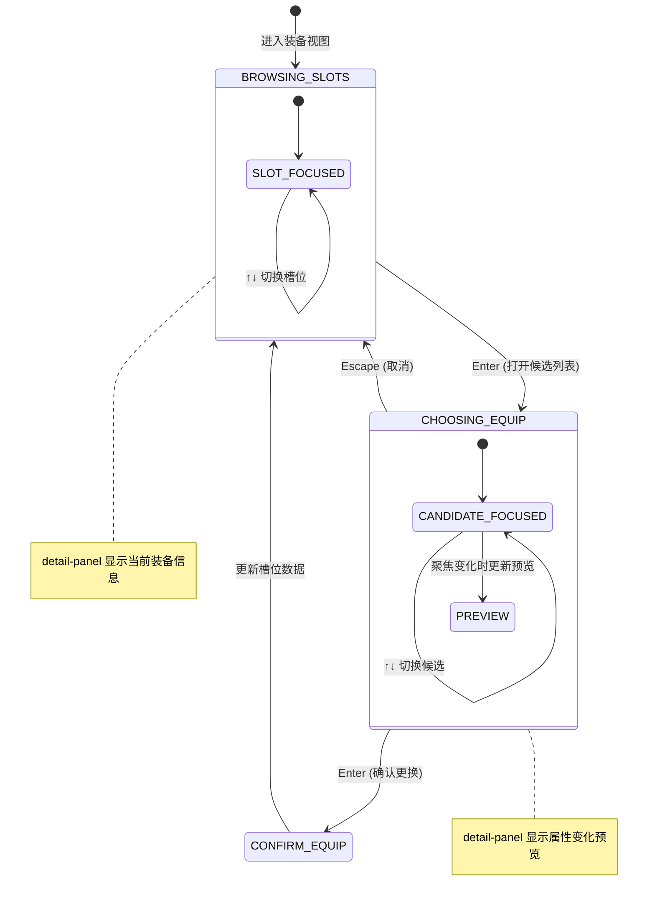
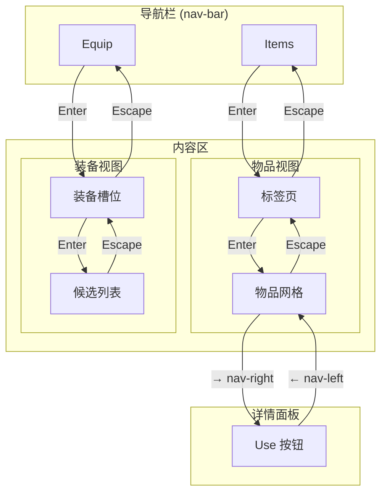
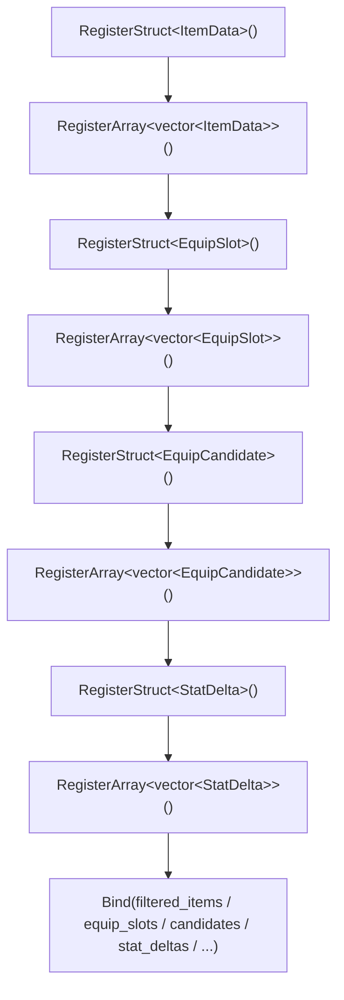

# L15: 物品与装备系统

> 配套代码：`learn/jrpg_inventory/` | 构建目标：`learn_jrpg_inventory`

---

## 1. 本课概述

背包与装备系统是 JRPG 中核心的资源管理界面。本课实现：

- **背包标签页**：消耗品 / 装备 / 关键道具三个分类，`<tabset>` 切换
- **物品网格**：`flex-wrap` 实现 N×M 格子布局，`data-for` 渲染物品列表
- **物品详情**：选中物品后在右侧显示名称、图标、描述、效果
- **装备面板**：5 个装备槽位（武器/盾牌/头盔/铠甲/饰品），当前装备显示
- **装备更换**：选中槽位 → 弹出可装备列表 → 属性对比预览
- **属性变化**：攻击力 +3 ↑（绿色）/ -2 ↓（红色）实时预览

---

## 2. 整体布局

### 2.1 屏幕分区（640×360dp）



三栏布局是 JRPG 菜单的经典模式：左侧分类导航、中央物品/装备列表、右侧详情预览。

### 2.2 DOM 结构



---

## 3. 左侧导航切换

### 3.1 视图切换模式

两个主视图（Items / Equip）通过 `data-if` 条件显示控制：

```html
<div data-if="view_mode == 0" id="items-view">...</div>
<div data-if="view_mode == 1" id="equip-view">...</div>
```

```cpp
int view_mode_ = 0;  // 0=Items, 1=Equip

void switchView(int mode) {
    view_mode_ = mode;
    model_handle_.DirtyVariable("view_mode");
    // 重置详情面板
    clearDetail();
}
```

### 3.2 导航项高亮

```html
<div class="nav-item" data-class-nav-active="is_items_view"
     data-event-click="on_nav(0)">
    <span class="cursor">&gt;</span> Items
</div>
```



---

## 4. 背包物品网格

### 4.1 flex-wrap 网格布局

物品格子使用 `flex-wrap` 实现自适应网格——当一行放不下时自动换行：

```css
.item-grid {
    display: flex;
    flex-direction: row;
    flex-wrap: wrap;
    gap: 3dp;
    overflow: auto scroll;
    max-height: 200dp;
}

.item-cell {
    width: 36dp;
    height: 36dp;
    position: relative;      /* 数量角标的定位锚点 */
    tab-index: auto;
    nav-up: auto;
    nav-down: auto;
    nav-left: auto;
    nav-right: auto;
}
```

> **nav 四方向**：网格布局需要 `nav-left/right` + `nav-up/down` 全部开启，
> 这样方向键可以在格子间自由移动。这与菜单列表只需 `nav-up/down` 不同。

### 4.2 物品数量角标

```html
<div data-for="item : filtered_items" class="item-cell"
     data-event-click="on_item_select(it_index)">
    <div class="item-icon" data-class-icon-potion="item.icon_potion"
         data-class-icon-sword="item.icon_sword" ...></div>
    <div data-if="item.qty > 1" class="item-qty">{{item.qty}}</div>
</div>
```

角标使用绝对定位叠加在格子右下角：

```css
.item-qty {
    position: absolute;
    right: 1dp;
    bottom: 0;
    font-size: 8dp;
    color: #ffffff;
    background-color: #00000080;
    padding: 0 2dp;
}
```

### 4.3 分类标签页



用 C++ 端手动过滤而非 RmlUi 内置 `<tabset>`，因为我们需要对列表数据做分类筛选：

```cpp
enum class ItemCategory { Consumable, Equipment, KeyItem };

void filterItems() {
    filtered_items_.clear();
    for (int i = 0; i < static_cast<int>(all_items_.size()); ++i) {
        if (all_items_[i].category == static_cast<int>(current_tab_)) {
            filtered_items_.push_back(all_items_[i]);
        }
    }
    model_handle_.DirtyVariable("filtered_items");
}
```

### 4.4 标签样式

```css
.tab-bar {
    display: flex;
    flex-direction: row;
    gap: 2dp;
    margin-bottom: 4dp;
}

.tab-btn {
    padding: 2dp 8dp;
    font-size: 10dp;
    color: #565f89;
    tab-index: auto;
    nav-left: auto;
    nav-right: auto;
    transition: color background-color 0.1s cubic-out;
}

.tab-btn.tab-active {
    color: #e0af68;
    background-color: #e0af6820;
    border-bottom: 1dp #e0af68;
}
```

---

## 5. 物品详情面板

### 5.1 选中物品时更新详情

```cpp
void onItemSelect(int filtered_idx) {
    if (filtered_idx < 0 || filtered_idx >= ssize(filtered_items_)) return;

    auto& item = filtered_items_[filtered_idx];
    detail_name_ = item.name;
    detail_desc_ = item.desc;
    detail_icon_id_ = item.icon_id;
    updateDetailIcon();

    model_handle_.DirtyVariable("detail_name");
    model_handle_.DirtyVariable("detail_desc");
}
```

### 5.2 图标切换

与 L14 头像切换相同的 `data-class-*` 模式——每种图标对应一个布尔值：

```css
.detail-icon {
    width: 32dp;
    height: 32dp;
    margin: 0 auto 4dp auto;
}

.icon-potion  { decorator: image(icon-potion); }
.icon-sword   { decorator: image(icon-sword); }
.icon-shield  { decorator: image(icon-shield); }
/* ... */
```

### 5.3 使用/装备按钮

```html
<div data-if="can_use" class="action-btn"
     data-event-click="on_use_item">
    Use
</div>
```

```cpp
bool can_use_ = false;  // 绑定到 data model

void refreshCanUse() {
    can_use_ = (selected_item_idx_ >= 0)
            && (filtered_items_[selected_item_idx_].category == 0); // Consumable
    model_handle_.DirtyVariable("can_use");
}
```

---

## 6. 装备系统

### 6.1 装备槽位



### 6.2 数据结构

```cpp
struct EquipSlot {
    std::string slot_name;     // "Weapon", "Shield", ...
    std::string equipped_name; // 当前装备名，空="(empty)"
    int  slot_type = 0;        // 0=Weapon,1=Shield,2=Helmet,3=Armor,4=Accessory
    bool is_selected = false;  // 当前选中的槽位
};

struct EquipCandidate {
    std::string name;
    int  atk_delta = 0;   // 与当前装备的攻击差值
    int  def_delta = 0;   // 与当前装备的防御差值
    int  item_index = -1; // 在 all_items_ 中的索引
};
```

### 6.3 属性变化预览

选中候选装备时，计算与当前装备的属性差值并显示：



### 6.4 属性变化颜色

```cpp
struct StatDelta {
    std::string label;  // "ATK", "DEF", ...
    int   value = 0;    // +5, -1
    bool  is_positive = false;
    bool  is_negative = false;
    std::string display; // "+5" or "-1"
};
```

```html
<div data-for="s : stat_deltas" class="stat-delta-row">
    <span class="delta-label">{{s.label}}</span>
    <span class="delta-value"
          data-class-delta-up="s.is_positive"
          data-class-delta-down="s.is_negative">
        {{s.display}}
    </span>
</div>
```

```css
.delta-up   { color: #9ece6a; }   /* 绿色：属性提升 */
.delta-down { color: #f7768e; }   /* 红色：属性下降 */
```

---

## 7. 装备更换流程

### 7.1 完整状态机



### 7.2 候选列表筛选

```cpp
void openCandidateList(int slot_type) {
    candidates_.clear();

    // (None) 选项：卸下当前装备
    candidates_.push_back({"(Remove)", 0, 0, -1});

    for (int i = 0; i < ssize(all_items_); ++i) {
        auto& item = all_items_[i];
        if (item.category != 1) continue;             // 非装备跳过
        if (item.equip_slot_type != slot_type) continue; // 类型不匹配跳过

        int atk_d = item.atk - current_equip_atk;
        int def_d = item.def - current_equip_def;
        candidates_.push_back({item.name, atk_d, def_d, i});
    }

    model_handle_.DirtyVariable("candidates");
    equip_state_ = EquipState::ChoosingCandidate;
    focus_candidate_deferred_ = true;
}
```

### 7.3 确认装备更换

```cpp
void confirmEquip(int cand_idx) {
    auto& cand = candidates_[cand_idx];
    auto& slot = equip_slots_[selected_slot_idx_];

    // 将旧装备放回背包（如果有）
    if (!slot.equipped_name.empty() && slot.equipped_name != "(empty)") {
        // 恢复物品到 all_items_
    }

    // 装备新物品
    if (cand.item_index >= 0) {
        slot.equipped_name = cand.name;
        // 更新角色属性
    } else {
        slot.equipped_name = "(empty)";
    }

    // 刷新 UI
    model_handle_.DirtyVariable("equip_slots");
    closeCandidateList();
}
```

---

## 8. 焦点管理策略

### 8.1 多层面板焦点流



### 8.2 延迟聚焦

与 L14 相同，`data-for` / `data-if` 生成的元素需要等一帧后才能聚焦：

```cpp
// 在 update(dt) 中
if (focus_grid_deferred_) {
    if (auto* grid = doc_->GetElementById("item-grid")) {
        if (grid->GetNumChildren() > 0) {
            grid->GetChild(0)->Focus(true);
            focus_grid_deferred_ = false;
        }
    }
}
```

---

## 9. data binding 要点

### 9.1 多 struct + 多 array 注册



### 9.2 过滤后的视图数组

直接绑定一个 `filtered_items_` 数组，而非在 RML 模板中做过滤。
这样切换标签页时只需重建 `filtered_items_` 并 `DirtyVariable`：

```cpp
// 绑定的是 filtered 视图，不是全量 all_items_
ctor.Bind("filtered_items", &filtered_items_);
```

> **为什么不绑 all_items_ 再在 RML 里过滤？** RmlUi 的 `data-for` 不支持过滤表达式，
> 必须在 C++ 端准备好子集。

### 9.3 data-if 与 view_mode 联动

```html
<div data-if="view_mode == 0" id="items-view">...</div>
<div data-if="view_mode == 1" id="equip-view">...</div>
```

`data-if` 表达式支持 `==` 比较运算符，可以直接用整数比较控制视图切换。

---

## 10. 角色属性面板

### 10.1 当前属性显示

```html
<div class="char-stats">
    <div class="stat-row">
        <span class="stat-label">ATK</span>
        <span class="stat-value">{{char_atk}}</span>
    </div>
    <div class="stat-row">
        <span class="stat-label">DEF</span>
        <span class="stat-value">{{char_def}}</span>
    </div>
    <div class="stat-row">
        <span class="stat-label">SPD</span>
        <span class="stat-value">{{char_spd}}</span>
    </div>
</div>
```

### 10.2 装备属性预览的实现技巧

选中候选装备时，同时显示「当前值」和「变化后值 + 差值箭头」：

```
ATK  25  →  30   +5 ↑ (绿)
DEF  18  →  17   -1 ↓ (红)
SPD  12  →  12    0   (灰)
```

通过 `stat_deltas_` 数组渲染，每个元素包含 label / value / is_positive / is_negative：

```css
.delta-value {
    font-size: 10dp;
    color: #565f89;     /* 无变化：灰色 */
}

.delta-value.delta-up {
    color: #9ece6a;     /* 提升：绿色 */
}

.delta-value.delta-down {
    color: #f7768e;     /* 下降：红色 */
}
```

---

## 11. 练习

### 11.1 基础练习
1. 物品使用后数量减少，到 0 时从列表移除（更新 `all_items_` 并重新过滤）
2. 在物品格子上添加 `:focus-visible` 高亮边框样式
3. 装备更换后重新计算角色总属性并刷新显示

### 11.2 进阶练习
1. **物品排序**：在标签栏右侧添加排序按钮，按名称/数量排序
2. **拖拽排列**：探索 RmlUi 的 `drag` 事件，实现物品格子拖拽交换
3. **多角色切换**：在装备面板顶部添加角色头像行，左右键切换角色

### 11.3 挑战练习
将物品数据从 JSON 文件加载（`assets/data/items.json`），实现数据驱动的物品系统。

---

## 12. 概念总结

| 概念 | 要点 |
|------|------|
| `flex-wrap` | 弹性换行，实现自适应网格布局，需配合固定宽度子元素 |
| `nav-left/right` + `nav-up/down` | 网格布局需四方向导航（菜单列表只需上下） |
| `data-if` 表达式 | 支持 `==` 比较，用整数控制多视图切换 |
| C++ 端过滤 | `data-for` 不支持过滤表达式，用 C++ 准备子集数组 |
| 绝对定位角标 | 父元素 `position: relative`，角标 `position: absolute` + `right/bottom` |
| `data-class-*` 图标切换 | 每种图标对应一个布尔值，同 L14 头像切换模式 |
| 属性差值预览 | `StatDelta` 结构 + `is_positive/is_negative` 布尔 → 条件 CSS 类 |
| 多层焦点流 | 导航栏 → 内容区 → 详情面板，Enter 进入 / Escape 返回 |
| `overflow: auto scroll` | 列表超出时自动显示滚动条 |
| 候选列表筛选 | 根据槽位类型过滤背包中的装备项 |
