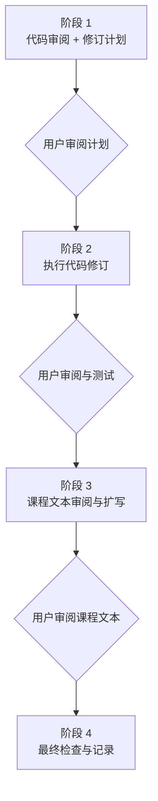

# TinyFarmRPG 课程审阅工作流索引

> 目标：从 L02 开始，每节课按阶段推进。每个阶段完成后都停下来等待用户审阅或测试，不再默认一次完成整节课的全部任务。

## 总原则

- **按课程顺序推进**：默认从当前进度的下一讲继续，不跳讲。
- **分阶段交付**：一节课分为代码审阅计划、代码修订执行、课程文本审阅扩写、最终收尾四个阶段。
- **阶段之间需要用户确认**：除非用户明确授权继续，否则完成当前阶段后等待审阅。
- **代码优先级最高**：如果实现会让课程讲错，或核心路径存在质量问题，先处理代码，再处理课程文本。
- **事实持续沉淀**：跨讲事实、代码片段锚点、共享数字和跨讲承诺统一写入事实账本。
- **不改冻结参考**：`lecture_plans/ref/OpenGL与迷你农场` 与 `lecture_plans/ref/TinyFarm` 只读不改。

## 配套文件

| 文件 | 用途 |
| --- | --- |
| `lecture_plans/lecture-review-workflow.md` | 本索引，只说明阶段划分和入口 |
| `lecture_plans/workflows/01-code-review-plan.md` | 阶段 1：代码审阅 + 修订计划 |
| `lecture_plans/workflows/02-code-revision.md` | 阶段 2：执行代码修订 |
| `lecture_plans/workflows/03-lecture-text-review.md` | 阶段 3：课程文本审阅与扩写 |
| `lecture_plans/workflows/04-finalize.md` | 阶段 4：最终检查、记录与收尾 |
| `lecture_plans/workflows/fact-ledger.md` | 事实账本 |
| `lecture_plans/workflows/progress.md` | 逐讲阶段进度 |

## 阶段总览

## 使用方式

开始某一讲时：

1. 先读本索引。
2. 读取 `lecture_plans/workflows/progress.md`，确认当前讲次和阶段。
3. 读取 `lecture_plans/workflows/fact-ledger.md`，复用已有事实口径。
4. 根据当前阶段读取对应的详细工作流文件。
5. 只执行当前阶段要求的动作；阶段完成后等待用户确认。

## 阶段完成口径

| 阶段 | 完成后交付 |
| --- | --- |
| 阶段 1 | 代码审阅发现、证据、修订计划、风险和测试建议；不执行代码修订 |
| 阶段 2 | 已执行的代码改动、验证结果、剩余风险；等待用户审阅和测试 |
| 阶段 3 | 课程文本事实修正、扩写、Mermaid 图、阅读清单和练习调整；等待用户审阅 |
| 阶段 4 | 最终链接 / Mermaid / 构建测试记录、事实账本和进度表更新、整讲收尾摘要 |

## 重要约束

- 阶段 1 不改源码和课程正文，只给计划。
- 阶段 2 只做已确认的代码修订；除必要记录外，不扩写课程正文。
- 阶段 3 不改业务代码，只处理讲义、事实账本和必要课程文档。
- 阶段 4 不引入新功能；只做检查、记录和收尾。
