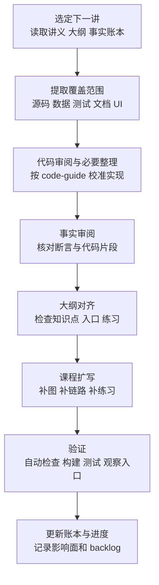

# TinyFarmRPG 单讲审阅与优化工作流

> 目标：针对 `lecture_plans/lectures` 下的每一节课，按课程顺序完成代码审阅、事实校准、课程扩写和验证；同时维护跨讲事实账本，避免单讲看似正确、整套课程合起来不一致。

## 配套文件

后续每讲审阅时固定维护三类文件：

| 文件 | 用途 |
| --- | --- |
| `lecture_plans/lecture-review-workflow.md` | 本工作流说明 |
| `lecture_plans/lecture-fact-ledger.md` | 共享事实、代码片段锚点、跨讲承诺和全局一致性待查项 |
| `lecture_plans/lecture-review-progress.md` | 逐讲进度、验证记录、残留 backlog |

`lecture_plans/ref/OpenGL与迷你农场` 与 `lecture_plans/ref/TinyFarm` 是冻结参考资料：可以读取、链接和对照，不在本轮课程修订中修改。

## 总原则

- **按课程顺序，一讲一迭代**：默认从 L00 到 L26 依次处理；每次聚焦一讲，但要记录它对其他讲的影响。
- **证据先于表达**：先确认源码、数据、测试、文档和运行观察点，再改正文。
- **代码优先级最高**：如果实现会让课程讲错，或本讲核心路径存在质量问题，应先按 `for_agent/code-guide.md` 整理代码，再更新讲义。若代码改动可能影响其他讲，必须写入事实账本和进度表，等本轮逐讲修订后做全局一致性检查。
- **讲清边界，不追求巨细无遗**：课程优先解释模块边界、数据流、事件流、设计取舍和调试方法，不逐行复述实现。
- **图服务于理解**：每张 Mermaid 图必须回答一个具体问题；图示数量是体检值，不是硬指标，已有足够密度时应合并或精简。
- **单讲与全局两层校验**：单讲处理时保证本讲准确；全套过完后再做一次跨讲一致性 pass。

## 每讲固定流程

### 1. 课程范围取证

先读取本讲正文、课程大纲中对应小节、事实账本，以及必要的上一期参考章节。提取本讲实际覆盖的内容，形成临时证据表。

证据表模板：

| 课程说法 / 主题 | 证据入口 | 校验结果 | 处理方式 |
| --- | --- | --- | --- |
| 例：任务交付走 `QuestTurnInService` | `src/game/domain/quest_turn_in_service.*`、相关测试 | 准确 / 需修正 | 保留讲法 / 改正文 / 先改代码 |

取证入口优先级：

1. 本讲列出的源码入口。
2. `lecture_plans/tinyfarmrpg-course-outline.md` 中对应讲次。
3. `lecture_plans/lecture-fact-ledger.md` 中已有共享事实和跨讲承诺。
4. `docs/overview.md` 与相关 `docs/game/*` 文档。
5. `assets/data`、`scripts`、`ui/rmlui` 中被本讲引用的数据与内容。
6. `tests` 中覆盖该模块的单元测试或集成测试。
7. 上一期参考教程 `lecture_plans/ref/OpenGL与迷你农场` 中用于对照的章节。

### 2. 事实账本维护

凡是会被多讲复用、容易随代码变化漂移、或需要跨讲承诺的内容，都必须写入 `lecture_plans/lecture-fact-ledger.md`。

必须登记的内容：

- 共享数字与版本：schema 版本、库版本、系统数量、数据文件数量、项目规模表述。
- 共享术语：domain service、catalog、script bridge、overlay scene、SystemScheduler 等。
- 关键源码入口：类名、函数名、命名空间、文件路径。
- 代码片段锚点：讲义中贴出的真实代码片段对应的文件和符号。
- 跨讲承诺：例如“详深留 L08”“铺垫 L20”“后续 L24 展开”。
- 代码改动影响面：rename、move、接口签名变化、数据字段变化。

每讲开始时先读账本，避免重新发明口径；每讲结束时更新账本，供下一讲复用。

### 3. 代码审阅与必要整理

如果本讲涉及源码实现，先按 `for_agent/code-guide.md` 审阅。若涉及 RmlUi 或弹出场景 UI，还要先读：

- `for_agent/rmlui-guide.md`
- `for_agent/ui-style-guide.md`

代码审阅重点：

- 是否符合现代 C++ 风格，优先 RAII，避免异常。
- 模块边界是否清楚，`engine` 与 `game` 依赖方向是否干净。
- 写入路径是否集中到领域服务或明确的系统入口。
- command / event / domain service 的职责是否混杂。
- 数据目录、脚本内容层与 C++ 规则层是否边界清楚。
- 是否存在影响教学准确性的旧实现、重复路径或命名误导。
- 关键失败路径是否有测试覆盖。

处理分级：

| 分级 | 含义 | 处理 |
| --- | --- | --- |
| 必须先改 | 当前实现会让课程讲错，或本讲核心路径存在明显质量问题 | 先修代码，再改课程；记录影响面 |
| 课程说明 | 实现是有意识的取舍，适合在讲义中解释 | 不改代码，在正文说明设计取舍 |
| 后续 backlog | 与本讲关系不强，或改动范围过大 | 记录在进度表，不阻塞本讲 |

若代码改动涉及重命名、移动文件、接口签名、数据字段或事件名，必须先用 `rg` 扫描 `lecture_plans/lectures` 的引用面，并把受影响讲次写入事实账本。当前讲必须同步修正；其他讲可在本轮顺序推进时修正，但不能丢记录。

### 4. 课程事实审阅

逐条检查正文是否符合项目真实情况，尤其注意这些容易漂移的内容：

- 文件路径、类名、函数名、命名空间是否真实存在。
- command / event / component / catalog / service 名称是否准确。
- JSON 字段、Lua API、Tiled 字段、RML/RCSS 文件名是否准确。
- 测试名、DebugPanel 名、工具名是否真实存在。
- “约 60 行”“28+ systems”“4 万行”这类数字是否有证据；没有证据就改成更稳的描述，或登记到账本后统一口径。
- 阅读清单和源码入口是否能让学生真的沿链路读下去。
- 讲义中对后续讲次的引用是否已登记为跨讲承诺。

建议把课程正文中的断言分成三类：

| 类型 | 审阅方式 |
| --- | --- |
| 架构判断 | 对照 `docs`、源码目录和装配/调用链 |
| 行为判断 | 对照测试、系统实现、事件分发和运行观察点 |
| 教学类比 | 确认不误导即可，不必逐字绑定源码 |

### 5. 代码片段专项检查

讲义中贴出的真实代码片段是高风险漂移源，必须单独检查。

每段代码片段都要确认：

- 锚定到 `文件 + 符号`，必要时补充函数名、结构体名或测试名。
- 片段中的类名、函数名、参数名、字段名与当前源码一致。
- 如果为教学删减，正文标注“节选”或“核心形态”，避免学生以为可直接复制完整实现。
- 如果片段只表达旧版本对照，必须明确说明它来自上一期参考项目。
- 片段对应的文件和符号写入事实账本的“代码片段锚点”表。

### 6. 讲义与大纲对齐

每讲都要对照 `lecture_plans/tinyfarmrpg-course-outline.md` 的对应小节，检查正文是否覆盖大纲承诺：

- 本讲目标是否一致。
- 核心知识点是否遗漏或改口径。
- 阅读清单是否仍然有效。
- 源码入口是否真实且优先级合理。
- 自测问题是否能从正文和源码中得到正确答案。
- 最小练习是否可执行，且不会引导学生修改错误路径。

如果正文有意偏离大纲，应更新大纲或在交付总结中说明原因，不能让两者长期分叉。

### 7. 课程扩写与 Mermaid 补图

在事实校验之后再扩写正文。优先补这些内容：

- 本讲第一张“关键链路”图。
- 核心概念的边界图或状态图。
- 失败路径 / 原子写入 / 生命周期图。
- 从 UI、Lua、DebugPanel、工具或测试入口追到源码的观察图。
- 自测问题与最小练习，使学生能动手验证本讲结论。

图示数量建议：

| 讲次类型 | Mermaid 体检值 | 说明 |
| --- | --- | --- |
| 架构 / 系统设计课 | 4-6 张 | 模块边界、装配链路、数据流、取舍图 |
| 玩法闭环课 | 4-6 张 | command / event、状态变化、失败路径、调试入口 |
| UI / 输入课 | 4-6 张 | Scene 栈、输入上下文、RmlUi 生命周期、数据绑定 |
| 工程化课 | 4-6 张 | 状态机、线程边界、资源加载、测试策略 |
| 开篇 / 收尾课 | 2-4 张 | 全局路线、学习路径、复盘结构 |

图示数量只作为体检值：低于建议值时优先思考是否缺少关键概念图；高于建议值时检查是否有重复表达。硬门槛是“每张图都回答一个具体问题”。

常用图类型：

| 图类型 | 适合表达 |
| --- | --- |
| `flowchart` | 数据流、装配流程、失败路径、模块关系 |
| `sequenceDiagram` | command / event / service / UI / Lua 的调用顺序 |
| `stateDiagram-v2` | 战斗、地图预加载、覆盖式场景、存档迁移状态 |
| `classDiagram` | catalog、component、service 之间的静态关系 |
| `erDiagram` | 数据目录、JSON schema、存档结构 |

Mermaid 注意事项：

- 换行使用 ` `，不要使用 `\n`。
- 节点文字不要嵌入 Markdown。
- 避免在节点里写 `1. `、`2. ` 这类编号。
- 图中只放结构，细节放在正文解释。

### 8. 验证

若只改课程文本：

- 优先使用脚本或命令检查 Markdown 相对链接、源码入口路径和资源路径是否存在；没有现成脚本时，至少用 `rg`、`find`、`test -f` 等命令辅助检查，不只靠肉眼。
- Mermaid 图优先用可用工具解析或渲染；若本机没有 `mmdc` 等工具，在交付中说明只做了人工语法检查。
- 检查新增阅读清单、源码入口、观察步骤和练习都能落到真实文件或操作。
- 检查自测题是否能从正文、源码或运行观察中得到明确答案。

若改了代码：

- 使用 ninja 构建项目。
- 优先运行与本讲模块直接相关的测试。
- 如果涉及 UI，按对应 UI 指南做资源、样式和场景检查。
- 若改动影响讲义引用面，完成引用扫描并更新事实账本。
- 在交付中说明实际执行过的构建与测试命令。

可观察入口验证：

- 讲义提到的 DebugPanel、工具、脚本、示例数据、运行步骤必须确认真实存在。
- 如果当前无法运行观察步骤，要说明限制，并至少验证入口文件、命令或面板注册位置。

### 9. 交付总结

每讲完成后，总结应包含：

- 代码是否有改动，改了哪些核心路径。
- 课程正文改了哪些结构：事实修正、图示、练习、阅读清单。
- 事实账本新增或更新了哪些共享事实、片段锚点、跨讲承诺。
- 已运行的构建 / 测试 / 链接或 Mermaid 检查。
- 尚未处理但值得后续跟进的 backlog。

同时更新 `lecture_plans/lecture-review-progress.md`，记录该讲状态、验证范围和残留风险。

## 单讲完成定义

一节课达到以下条件，才算本轮处理完成：

- 覆盖范围已经取证，核心说法能回到源码、数据、测试、文档或可观察入口。
- 本讲涉及的关键代码已按 `code-guide.md` 审阅；必要整理已完成或记录为 backlog。
- 课程中的文件路径、类名、函数名、事件名、数据字段、测试名和工具名已校准。
- 讲义中的真实代码片段已完成锚点登记和逐字核对。
- 本讲与课程大纲对应小节已对齐，偏离项已修正或记录。
- Mermaid 图能支撑本讲概念阐释，且每张图都有明确问题意识。
- 阅读清单、源码入口、自测问题和最小练习可以真实执行，答案路径正确。
- 如有代码改动，已完成必要构建和测试验证，并记录跨讲影响面。
- 事实账本和进度表已更新。

## 全局一致性检查

完成 L00-L26 的顺序修订后，必须额外做一次全局 pass。

全局检查重点：

- 共享数字、版本、schema、系统数量、目录结构是否全套一致。
- 同一个类、函数、数据字段、Lua API、DebugPanel 或工具名是否全套一致。
- “详深留 Lxx”“下一讲展开”“铺垫 Lxx”等跨讲承诺是否真的兑现。
- 代码改动引起的路径、片段、图示和练习是否已全部更新。
- 大纲与 27 篇正文是否仍保持同一课程路线。
- 事实账本中的待查项和进度表中的 backlog 是否已处理或明确保留。

## Agent 执行备忘

后续推进某一讲时，建议按下面顺序开始：

1. 读取目标讲义、课程大纲对应小节、事实账本、进度表和相关规范文件。
2. 用 `rg` 查找讲义中提到的类名、文件名、事件名、数据字段、工具名和跨讲引用。
3. 抽取本讲证据表，并先判断是否需要代码整理。
4. 若要改代码，先扫描讲义引用面，完成代码、构建和测试，再改当前讲义。
5. 若只改讲义，先做事实修正和片段锚点核对，再补 Mermaid、练习和观察入口。
6. 更新事实账本和进度表。
7. 最终交付时明确说明验证范围，不把未验证内容写成已验证结论。
