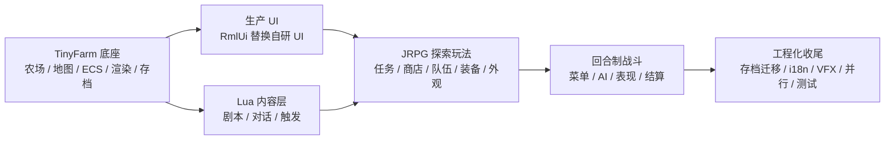
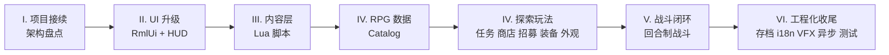

# L00 开篇：从 TinyFarm 到 TinyFarmRPG

欢迎来到 C++ 游戏开发系列的第六期课程：**TinyFarmRPG**。

如果你完整跟下来了上一期《OpenGL 与迷你农场》，那么你手上已经有了一个接近 5 万行级别的 2D 农场经营 Demo——种植、收获、昼夜、存档、UI、地图切换、ECS 一应俱全。本期课程不会推倒重来，而是带你**在这套底座上继续往上"长"出一个日式 RPG**。

## 🎯 本课目标

用一节课的时间，把整套课程的"地形图"摆在你面前。读完之后，你应该能回答：

1. TinyFarmRPG 相对 TinyFarm 多了什么？为什么这次不从零写起？
2. 这套课程会按什么节奏拆开？每个阶段你能拿到什么能力？
3. 在开始 L01 之前，我需要先准备好哪些先修知识？

---

## 🗺️ 项目预览：TinyFarmRPG

> 📦 **配套代码**：项目仓库即本目录所在的 `TinyFarmRPG`。

TinyFarmRPG 在 TinyFarm 的农场经营底座上，叠加了一整套 JRPG 闭环。游戏整体仍然是 2D 像素风格，但玩法范围已经从"种田"扩展到"探险 + 战斗"。

### 继承自 TinyFarm 的能力

这些能力在上一期已经完整建好，本期不再重讲底层实现：

- 🌾 **农场经营**：种植、浇水、收获、物品管理
- 🗺️ **地图与世界**：Tiled 地图、多地图切换、世界状态
- 🎨 **2D 渲染**：OpenGL + 精灵批处理 + 光照与后处理
- 🎵 **音频**：MiniAudio 驱动的音效与背景音乐
- 🌅 **昼夜循环**：时间系统驱动的环境变化
- 💾 **基础存档**：游戏状态序列化与读档
- 🧱 **ECS 与场景栈**：EnTT + Scene 栈作为运行时骨架

### TinyFarmRPG 新增的能力

本期课程将带你逐步实现这些新系统：

- 📜 **剧情与对话**：分支对白、选项、剧本式 NPC
- 📋 **任务系统**：接任务、追踪目标、回收奖励
- 🛒 **商店系统**：买卖、按状态切换库存
- 👥 **队伍与招募**：从单人农场主到 JRPG 队伍
- ⚔️ **装备与成长**：职业、等级、经验、装备属性
- 🧍 **分层角色外观**：可换装、可生成头像
- 🎮 **回合制战斗**：完整的 JRPG 战斗闭环（玩家菜单 + AI + 表现 + 结算）
- 🪄 **Effekseer 特效**：战斗与剧情特效系统
- 🧩 **Lua 内容层**：剧本、对白、剧情触发都走 Lua
- 🖼️ **RmlUi 生产 UI**：替换上一期的自研 UI 框架
- 🌍 **本地化**：中英双语 + 跨场景文案管线
- ⚙️ **异步预加载 + 并行调度**：减少切图卡顿、提高 CPU 利用率

### 一张图看清继承关系



---

## 🚨 学习模式：和上一期一致，再往前一步

上一期我们已经约定了两条规则：**不再逐行讲代码**、**基于完整工程剖析**。本期继续沿用，并在此之上再往前推一步：

- **架构优先，细节留阅读清单**：每讲只挑关键类与关键流程讲透，其余通过源码入口和练习引导你自读。
- **聚焦"新增能力"**：上一期讲过的内容只在建立上下文时简要回顾，不重复展开。
- **先看再讲**：架构类讲次尽量提供可观察的运行入口（调试面板、DOT 图导出等），避免"纯架构图"过载。
- **外链子教程**：RmlUi 与多线程已有独立子教程，主线只讲"项目里如何用"，原理细节外链。

> **为什么这么做？**
> TinyFarm 已经是接近 5 万行级别的工程，TinyFarmRPG 在它基础上又增加了相当体量。如果继续"渐进式构建"，节奏会被拖得非常慢。真实工作中你接手的项目几乎都是这种规模——读懂、改对、扩好，才是真功夫。

---

## 📚 课程路线图

本期主线共 **27 讲**（L00–L26），分为 6 个阶段：

| 阶段 | 讲次 | 主题 | 产出 |
| --- | --- | --- | --- |
| I. 项目接续与架构基础 | L00–L02 | 开篇、架构地图、领域服务边界 | 建立新项目心智模型 |
| II. 生产 UI 与输入升级 | L03–L05 | RmlUi 接入、HUD 与覆盖式场景、输入上下文 | 替换自研 UI 的设计路线 |
| III. Lua 内容层 | L06–L08 | ScriptHost、Sol2 绑定、脚本事件桥 | NPC / 地图 / 剧情可脚本化 |
| IV. RPG 数据与探索玩法 | L09–L14 | Catalog、任务、商店、队伍、装备、外观 | JRPG 探索侧闭环 |
| V. 回合制战斗 | L15–L20 | 入口、领域核心、动作解析、菜单 / AI、表现、结算 | 最小可玩战斗闭环 |
| VI. 工程化收尾 | L21–L26 | 存档、本地化、VFX、异步、并行、测试 | 项目级质量收尾 |



完整的逐讲大纲请参见 [`tinyfarmrpg-course-outline.md`](../tinyfarmrpg-course-outline.md)。

---

## 📖 每讲怎么读

为了保持架构课的节奏，每一讲都按统一模板组织。你可以提前知道每个段落的"用途"，方便取舍：

| 段落 | 你能拿到什么 |
| --- | --- |
| **本讲目标** | 一句话告诉你"读完之后能做什么" |
| **关键链路** | 一张 mermaid 小图，说明跨模块的数据流或事件流 |
| **核心知识点** | 3–6 条，围绕"为什么这样做"而不是"做了什么" |
| **阅读清单** | 项目内 docs + 上期相关章节 + 子教程外链 |
| **源码入口** | 3–5 个文件，按"读这几个就能动手改"的优先级排列 |
| **自测问题** | 3–4 个开放问题，能口头回答即视为理解 |
| **最小练习** | 30–60 分钟工作量的小改动或观察任务 |

**建议阅读节奏**：先扫一遍目标、知识点和源码入口，然后直接打开项目里对应的文件配合本讲文字一起看；最后用自测问题反向验证理解，再决定要不要做练习。

---

## 🗂️ 项目目录速览

第一次打开 TinyFarmRPG 仓库时，先看几个"门牌号"，剩下的等具体讲次再深入：

```
TinyFarmRPG/
├── src/
│   ├── engine/        # 与玩法无关的可复用基础设施
│   │   ├── core/      #   GameApp / Context / 配置
│   │   ├── scene/     #   Scene 栈
│   │   ├── render/    #   渲染管线
│   │   ├── ui/        #   RmlUi 运行时
│   │   ├── script/    #   Lua VM 与安全边界
│   │   ├── vfx/       #   Effekseer 后端
│   │   └── ...        #   audio / input / resource / async ...
│   ├── game/          # TinyFarmRPG 特定玩法
│   │   ├── runtime/   #   声明式装配（catalog / service / system）
│   │   ├── scene/     #   Title / GameScene / 各覆盖式 UI 场景
│   │   ├── domain/    #   领域服务（Inventory / Quest / Shop ...）
│   │   ├── battle/    #   回合制战斗领域核心
│   │   ├── script/    #   tf.* Lua API 绑定
│   │   └── ...        #   component / system / data / save ...
│   └── main.cpp       # 极薄入口
├── assets/data/       # JSON 数据目录（catalog 都在这里）
│   ├── rpg/           #   actors / classes / skills / states / equipment / enemies / troops
│   ├── quests.json
│   ├── shops.json
│   └── ...
├── scripts/           # Lua 内容脚本
│   ├── bootstrap.lua  #   内容组合根
│   ├── lib/           #   共享工具（state / once / dialogue ...）
│   ├── maps/          #   地图事件
│   ├── npcs/          #   NPC 对白
│   └── quests/        #   任务脚本
├── ui/rmlui/          # RmlUi 文档与样式
│   ├── theme/         #   全局主题
│   ├── hud/           #   常驻 HUD
│   ├── scenes/        #   覆盖式弹出场景
│   └── overlay/       #   叠加层
├── docs/              # 项目文档（engine / game / gameplay / tutorial）
├── tests/             # Google Test 测试
├── tools/             # 调试与验证工具
└── for_agent/         # 编码规范（AI 辅助开发用）
```

> **三条新增的"主干道"**：`assets/data/rpg/`（RPG 规则数据）、`scripts/`（Lua 内容层）、`ui/rmlui/`（生产 UI）。上一期都没有，是本期反复出现的目录。

---

## ✅ 先修条件 Checklist

本课程**不是从零开始**。在开始 L01 之前，请确认以下条件已就位：

| 资源 | 角色 | 范围 |
| --- | --- | --- |
| 上一期《OpenGL 与迷你农场》 | **完整先修** | intro + part-01..part-33 全部，本期不重讲基础 |
| RmlUi 子教程 L01–L06 | **前置必修** | 文档结构、盒模型、布局、样式、事件、数据绑定基础 |
| RmlUi 子教程 L07–L15 | **穿插推荐** | 自定义元素、动画、JRPG 实战；L03/L04/L18 会点名 |
| 多线程子教程 | **穿插推荐** | L21 / L24 / L25 会指明具体章节 |

### 为什么 RmlUi 子教程 L01–L06 是"前置必修"？

主线 L03 只讲"项目如何接入 RmlUi"，不会重讲 RML/RCSS 语法。如果你直接跳到 L03，会因为语法陌生而看不懂 UI 文件结构。建议把 RmlUi 子教程基础部分（L01–L06）作为开课前的"暑假作业"先过一遍。

### C++ 与游戏开发基础

和上一期一致：

- 熟悉现代 C++（C++20 常用特性，能阅读中等复杂度的工程代码）
- 理解游戏循环、事件、ECS、Scene 等基本概念
- 至少完成过上一期 TinyFarm 项目，或具备等价工程经验

---

## 🆚 与上一期教程的衔接

上一期的内容在本期里有三种处理方式：

| 处理方式 | 含义 | 例子 |
| --- | --- | --- |
| **回顾** | 本期会再次提到，作为新内容的对照基线 | part-02 架构设计 → 本期 L01 |
| **升级** | 上一期能力本期会大幅扩展 | part-32 存档 → 本期 L21（schema 迁移 + 异步） |
| **替换** | 上一期方案被新方案彻底取代 | part-17/18 自研 UI → 本期 L03 RmlUi |
| **略过** | 上一期已经讲透，本期不再涉及 | part-09–12 渲染细节 |

完整对照表见大纲 [《与上一套教程的衔接》](../tinyfarmrpg-course-outline.md#与上一套教程的衔接) 一节。

---

## 🛠️ 技术栈速览

相比上一期，本期新增或升级的技术栈用 **加粗** 标出：

| 类别 | 技术 |
| --- | --- |
| 核心语言 | C++20 |
| 构建工具 | CMake 3.13+ |
| 图形 / 平台 | SDL3 + OpenGL + GLAD |
| ECS 框架 | EnTT 3.16.0 |
| **生产 UI** | **RmlUi 6.2**（替换上期自研 UI） |
| 调试 UI | ImGui |
| 字体渲染 | FreeType 2.14.1 + HarfBuzz 12.1.0 |
| 音频 | MiniAudio |
| 数学库 | GLM 1.0.1 |
| 日志库 | spdlog 1.15.3 |
| JSON 解析 | nlohmann-json 3.12.0 |
| **脚本宿主** | **Lua 5.4.8 + Sol2 v3.5.0**（新增） |
| **粒子特效** | **Effekseer 1.7.3.0**（新增） |
| 测试框架 | GoogleTest 1.17.0 |
| 关卡编辑 | Tiled |

---

## 📋 阅读清单

| 顺序 | 文件 / 章节 | 核心关注点 |
| :---: | --- | --- |
| 1 | [`docs/overview.md`](../../docs/overview.md) | 项目定位、核心架构原则、Lua 内容层约定 |
| 2 | 上一期 [00-开篇](../ref/OpenGL与迷你农场/00-开篇.md) | 回忆 TinyFarm 的项目定位 |
| 3 | 上一期 [01-构建与运行](../ref/OpenGL与迷你农场/01-构建与运行.md) | 复习 CMake 构建与运行时资源约定（本期不再重讲） |
| 4 | [`tinyfarmrpg-course-outline.md`](../tinyfarmrpg-course-outline.md) | 完整逐讲大纲 |

---

## 🔑 源码入口

只看这两处建立"入口的薄"的直觉，具体实现留到后续讲次：

| 顺序  | 文件                                                         | 你会看到什么                               |
| :-: | ---------------------------------------------------------- | ------------------------------------ |
|  1  | [`src/main.cpp`](../../src/main.cpp)                       | 整个入口只有一行：`game::run()`               |
|  2  | [`src/game/game_entry.cpp`](../../src/game/game_entry.cpp) | `game::run()` 如何创建 `GameApp` 并注册初始场景 |
|  3  | [`src/game/game_entry.h`](../../src/game/game_entry.h)     | `game` 命名空间下 `run()` 的声明             |
|  4  | [`src/engine/core/`](../../src/engine/core)                | `GameApp` 与 `Context`，主循环骨架的归属       |

> **观察重点**：`main.cpp` 几乎为空，所有启动逻辑都在 `game_entry.cpp` 里。这种"薄入口"模式从上一期就在用，本期延续。

---

## ❓ 自测问题

读完本讲，建议尝试口头回答：

1. **TinyFarmRPG 相对 TinyFarm 主要多了哪 5 个玩法系统？** 如果让你按"对玩家可见性"排序，哪个最显眼？
2. **为什么这一次不推倒重来？** 把"在旧底座上扩"作为前提，会给后续讲次带来哪些约束？（提示：架构边界、旧系统接口、目录组织……）
3. **本期为什么把课程拆成 6 个阶段？** 如果让你把 L03（RmlUi）和 L15（战斗入口）的顺序对调，会带来什么问题？

---

## 🧪 最小练习

1. **跑通项目**：参照上一期 L01 的步骤完成 configure / build / run，确认能进入 TinyFarmRPG 的标题画面。
2. **浏览 [`docs/overview.md`](../../docs/overview.md)**：通读一遍"核心架构原则"和"Lua 内容层约定"两节。
3. **写下你的"拆解清单"**：对照本讲的阶段总览，在自己的笔记里写下**你最想先拆开看的 3 个系统**，并写一句理由。后续每讲开始前回头对照，看你的好奇心是否被解答。

---

## 📌 小结

回到开头的三个问题，你现在应该能清晰地回答：

1. **新增了什么？** 在 TinyFarm 农场底座上叠加了剧情、任务、商店、队伍、装备、外观、回合制战斗、Lua 内容层、RmlUi 生产 UI、本地化等多个系统。
2. **怎么拆？** 6 个阶段 27 讲，从"项目接续"走到"工程化收尾"，每讲都按统一模板讲清"为什么这样做"。
3. **怎么准备？** 完整跟完上一期 TinyFarm，再过一遍 RmlUi 子教程基础（L01–L06），就可以开始 L01。

## 🚀 下节课预告

下一讲（**L01 游戏架构设计**）我们会对齐上一期 part-02，把新项目的架构地图摆出来。重点不在重讲分层和 ECS，而是看 TinyFarmRPG 如何用 `GameRuntimeAssembler`、`RuntimeServiceFactory`、`SystemFactory` 这套**声明式装配**取代上期"在 GameScene 里手动 new 系统"的模式，让项目能继续"长大"而不腐烂。
