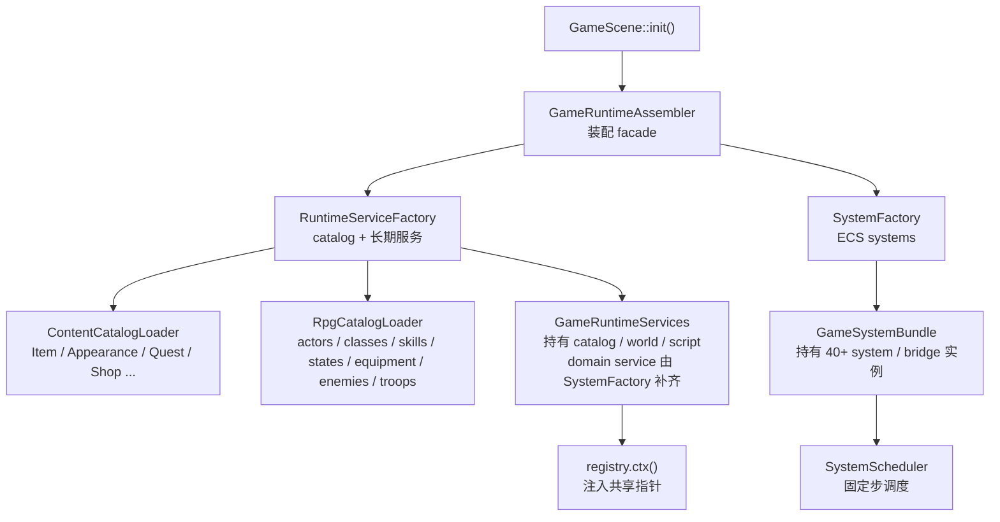
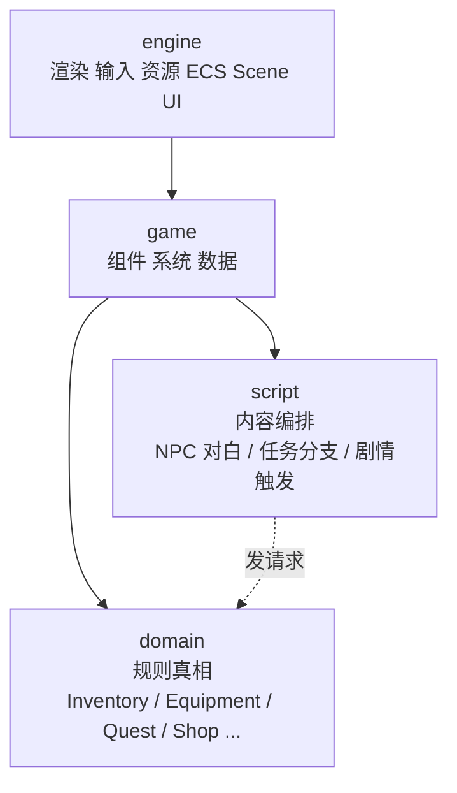
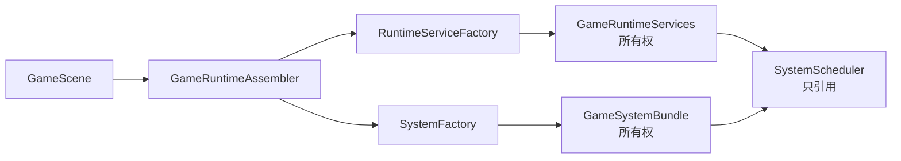
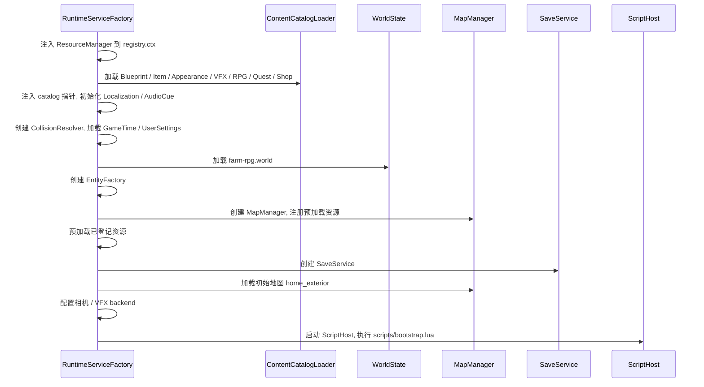

# L01 游戏架构设计：从"new 一切"到声明式装配

上一讲我们建立了课程的全局地图。这一讲，我们正式进入项目内部：**站在新项目的入口（`GameScene::init()`）面前，看 TinyFarmRPG 如何把一个接近 5 万行的 TinyFarm 底座扩展成一个能继续生长的 JRPG 工程**。

如果你回想上一期 TinyFarm 的 `GameScene::init()`——里面手动 new 了三十多个 system，依赖顺序靠注释和经验维护。本期把这件事翻新了：catalog、service、system 的"创建"被拆到一组工厂里，`GameScene` 只剩下"按下启动键"的工作。

---

## 🎯 本讲目标

读完本讲之后，你应该能回答：

1. 在 TinyFarm 的"engine + game"两层之上，TinyFarmRPG 又长出了哪两层？它们各自的职责边界是什么？
2. `GameRuntimeAssembler` / `RuntimeServiceFactory` / `SystemFactory` / `GameSystemBundle` 这四个角色分别在做什么？
3. 为什么 catalog 必须在 service 之前加载，service 又必须在 system 之前装配？顺序错了会发生什么？
4. 新增一个 gameplay 运行期共享的 service（例如"天气系统"）需要动哪几个文件？

---

## 🗺️ 关键链路



> **观察重点**：`GameScene` 不再"创建"任何 service 或 system，只是把自己交给 `GameRuntimeAssembler`，由后者按顺序委托给两个 Factory。

---

## 💡 核心知识点

### 1. 回顾：上一期 TinyFarm 的两层架构

上一期我们在 [part-02](../ref/OpenGL与迷你农场/02-游戏架构设计.md) 建立了清晰的两层：

- **engine 层**：渲染、输入、音频、资源、ECS 框架、Scene 栈、UI 框架等"与具体游戏无关"的能力。
- **game 层**：TinyFarm 特定的玩法、组件、系统、数据目录、UI 控件。

依赖单向：`game → engine`，引擎层不能 `#include` 游戏层。

这两层在 TinyFarmRPG 里完整保留，但**仅靠这两层已经不够了**。理由很简单：随着任务、商店、装备、战斗、Lua 内容层的加入，"原子写入规则"和"剧本式内容编排"如果继续直接写在 system 里，会让 system 越来越胖、越来越难测。

### 2. 新增的两个分层：domain 与 script

TinyFarmRPG 把原本的两层向上拆出两个新角色：



- **domain 层**（`src/game/domain/`）：把"会改变玩家状态的写入操作"集中到一组**领域服务**里。`InventoryDomainService`、`EquipmentDomainService`、`QuestTurnInService`、`ShopTransactionService` 都属于这一层。**这层负责"规则真相"——preflight 校验、原子写入、反馈事件**。详深留到 L02 与 L10。
- **script 层**（`scripts/` + `src/game/script/`）：Lua 内容脚本和 C++ 绑定。**这层负责"内容编排"——NPC 对白、任务分支、剧情触发**。详深留到 L06–L08。

> **为什么要拆？** 一句话：**写入规则要绝对集中、写入触发要绝对灵活**。
> domain 集中，是为了让"加物品 / 卖物品 / 装备 / 交付任务"这种状态变化无论从 system、UI、Lua、存档哪条路径触发，规则都一致。
> script 灵活，是为了让"NPC 在不同时间说不同的话"这种内容变化不需要重编译。

### 3. 装配模式：从"new 一切"到"声明式装配"

回到 TinyFarm 的 `GameScene::init()`——你会看到三十多个 `make_unique<XxxSystem>(...)` 排成长长一列，依赖顺序靠注释和工程师记忆维护。**功能再多一倍，这个文件就要爆炸了**。

TinyFarmRPG 把它彻底重构了。来看新项目的 `GameScene::init()` 核心：

```cpp
bool GameScene::init() {
    if (!game::runtime::GameRuntimeAssembler::assembleServices({
            *this, context_, registry_, game_time_, *services_})) {
        return false;
    }
    if (!game::runtime::GameRuntimeAssembler::assembleSystems({
            context_, registry_, *services_, *systems_})) {
        return false;
    }
    // ... 输入上下文、UI、事件订阅、首帧同步 ...
}
```

`GameScene` 不再自己 new 任何东西。它把"装配"这件事完全委托给一组工厂：

| 角色 | 文件 | 职责 |
| --- | --- | --- |
| `GameRuntimeAssembler` | `runtime/game_runtime_assembler.*` | **外观入口**，把"装配 service / 装配 system"两件事拆开委托 |
| `RuntimeServiceFactory` | `runtime/runtime_service_factory.*` | 创建并加载所有长期 service（catalog / WorldState / MapManager / SaveService / ScriptHost ...） |
| `SystemFactory` | `runtime/system_factory.*` | 先补齐缺失的 domain service，再创建 40+ system / bridge 实例 |
| `GameRuntimeServices` | `runtime/system_bundle.h` | 持有"service / catalog"的 struct |
| `GameSystemBundle` | `runtime/system_bundle.h` | 持有"system 实例"的 struct |
| `SystemScheduler` | `runtime/system_scheduler.*` | 不拥有 system，只在固定步里**引用** bundle 推进 |



**这个改造解决了什么问题？**

- **依赖可见**：service 与 system 各自被独立列表化，依赖关系写在工厂参数表里，一眼看穿。
- **顺序由数据描述**：哪个 catalog 先加载、哪个 service 在哪个 catalog 之后创建，全部由 `assemble()` 内部的固定流水线决定。
- **测试友好**：要单元测试一个 system，只需要构造它依赖的那部分 service，不需要把整个 `GameScene` 拉起来。
- **新增路径固定**：新增 catalog / service / system 时，会沿着 manifest、services、factory、scheduler 这几处登记；需要动的点更多，但每一步都有明确归属。

### 4. Service 装配顺序：先数据，再世界，最后脚本

`RuntimeServiceFactory::assemble` 有一条严格的流水线，**顺序就是依赖**：



关键的"为什么"：

- **Catalog 先于一切**：后续 system 与 service 都要查这些静态规则。`InventoryDomainService` 依赖 `ItemCatalog`、`QuestTurnInService` 依赖 `ItemCatalog`、`EquipmentDomainService` 依赖 `RpgCatalog`。**catalog 加载失败会直接 `return false` 中断装配**。
- **WorldState 先于 MapManager**：`MapManager` 构造函数会读 `WorldState` 里的世界图（neighbors / triggers）。
- **MapManager 先于 SaveService**：存档需要回写"当前在哪张图、地图里实体快照如何还原"。
- **ScriptHost 是 service 装配的最后一步**：脚本里 `tf.quest.status(...)`、`tf.shop.open(...)`、`tf.map.travel(...)` 之类的 API 需要 catalog、WorldState、MapManager、Localization 等运行期服务已经就位；Lua 发出的玩法请求会先进入 dispatcher，后续由 `SystemFactory` 补齐的 domain service 和 gameplay system 处理。

> **观察小练习**：打开 [`runtime_service_factory.cpp`](../../src/game/runtime/runtime_service_factory.cpp)，看 `assemble()` 主函数，数一数它在哪些前置条件失败时 `return false`——这些都是装配失败时的"硬停点"，对应上面流水线的依赖前置。

### 5. ContentCatalogLoader 与 RpgCatalogLoader：集中加载，集中校验

如果说"工厂"管的是"谁先创建谁"，那 `ContentCatalogLoader` 管的就是"内容数据从哪里读"。

集中路径定义在 [`game_content_manifest.h`](../../src/game/runtime/game_content_manifest.h)：

```cpp
struct GameContentManifest final {
    static constexpr const char* ActorBlueprints = "assets/data/actor_blueprint.json";
    static constexpr const char* Items           = "assets/data/item_config.json";
    static constexpr const char* AppearanceCatalog = "assets/data/appearance_catalog.json";
    static constexpr const char* RpgManifest     = "assets/data/rpg/manifest.json";
    static constexpr const char* RpgRoot         = "assets/data/rpg";
    static constexpr const char* Quests          = "assets/data/quests.json";
    static constexpr const char* Shops           = "assets/data/shops.json";
    // ... 等等
};
```

`ContentCatalogLoader` 提供一组 `ensureXxx()` 静态函数，每个负责一类 catalog 的"懒加载 + 校验"。`RpgCatalogLoader` 单独处理 RPG 数据（actors / classes / skills / states / equipment / enemies / troops），因为它分散在 `assets/data/rpg/` 下的多个文件里，需要走 manifest 加载。

**集中 manifest 的两个好处**：

- **改路径不改装配代码**：新版本想把数据搬到 `assets/data/v2/items.json`？只改一行 manifest 即可。
- **加内容有固定模板**：新增一类 catalog → 在 manifest 加一行 → 在 `system_bundle.h` 的 `GameRuntimeServices` 加一个智能指针字段 → 在 `ContentCatalogLoader` 加一个 `ensureXxx()` → 在 `RuntimeServiceFactory::assemble` 调用一次。整个流程是固定 checklist。

### 6. ServiceLookup 与 `registry.ctx()`：场景层"找服务"的统一入口

`GameScene` 持有 `GameRuntimeServices`（所有权）。`SystemFactory` 创建 system 时会显式传入硬依赖；而 UI 场景、调试面板或一些跨模块 helper 不适合从 `GameScene` 一路传参时，可以通过 `entt::registry::ctx()` 找到少量共享服务。

`runtime_service_factory.cpp` 里这段是典型套路：

```cpp
void injectCatalogPointers(entt::registry& registry, GameRuntimeServices& services) {
    injectRegistryContextPointer(registry, services.rpg_catalog.get());
    injectRegistryContextPointer(registry, services.quest_catalog.get());
    injectRegistryContextPointer(registry, services.shop_catalog.get());
}
```

UI 控件需要本地化服务时，用一个统一的 helper（[`service_lookup.h`](../../src/game/runtime/service_lookup.h)）：

```cpp
inline LocalizationService* findLocalizationService(entt::registry& registry) {
    auto** service = registry.ctx().find<LocalizationService*>();
    return service ? *service : nullptr;
}
```

**为什么用 `registry.ctx()` 辅助取服务，而不是全局单例？**

- **生命周期跟 Scene 走**：Scene 退出，ctx 里的指针自然失效，避免悬空。
- **测试时可替换**：跑单测时构造一个独立的 registry，注入测试用的 service mock，scene 代码完全不变。
- **避免 UI 层一路传指针**：覆盖式场景和 tab 内容越来越多，如果每个构造函数都继续追加本地化、catalog、world 等指针，参数列表会失控。`registry.ctx()` 让少量共享服务可以按需查找。

> **注意**：`registry.ctx()` 里的指针**不表达所有权**，所有权仍在 `GameRuntimeServices`。读代码时把 ctx 视为"这个 Scene 生命周期内可访问的共享服务表"即可。

### 7. Blueprint 与 EntityFactory 的位置（详深留 L08）

上一期 [part-23](../ref/OpenGL与迷你农场/23-蓝图与实体工厂.md) 讲过 Blueprint 与 EntityFactory：把"角色 / 动物 / 作物"的组件组合从 C++ 类型挪到 JSON。这套机制在 TinyFarmRPG 完整保留：

- `BlueprintManager`（`src/game/factory/blueprint_manager.*`）：管理 actor / animal / crop 三类蓝图。
- `EntityFactory`（`src/game/factory/entity_factory.*`）：按蓝图 id 把组件挂到 entity 上。

新项目里它们在装配流水线中的位置：


本讲只标记"它们在装配流水线的哪个位置"。**脚本化 NPC、商人、`scripted_interaction=true` 等 blueprint 字段扩展**留到 L08 详深。

---

## 📋 阅读清单

| 顺序 | 文件 / 章节 | 关注点 |
| :---: | --- | --- |
| 1 | 上一期 [part-02 游戏架构设计](../ref/OpenGL与迷你农场/02-游戏架构设计.md) | TinyFarm 的两层架构、ECS / Scene / Context 基础 |
| 2 | 上一期 [part-26 游戏场景初始化与系统编排](../ref/OpenGL与迷你农场/26-游戏场景初始化与系统编排.md) | 旧版本"手动 new"模式的痛点对照 |
| 3 | [`docs/game/runtime-assembly.md`](../../docs/game/runtime-assembly.md) | 装配阶段、registry.ctx 注入、新增服务 checklist |
| 4 | [`docs/game/game_scene.md`](../../docs/game/game_scene.md) | `GameScene::init` 的 7 步流水线、运行期分工 |

---

## 🔑 源码入口

按"读这几个就能动手改"的优先级：

| 顺序 | 文件 | 你会看到什么 |
| :---: | --- | --- |
| 1 | [`src/game/runtime/system_bundle.h`](../../src/game/runtime/system_bundle.h) | `GameRuntimeServices` 与 `GameSystemBundle` 的字段表——一眼看清"项目装了什么 service / 什么 system" |
| 2 | [`src/game/runtime/game_runtime_assembler.h`](../../src/game/runtime/game_runtime_assembler.h) | 两个 `Params` struct + `assembleServices` / `assembleSystems` 两个静态入口 |
| 3 | [`src/game/runtime/runtime_service_factory.cpp`](../../src/game/runtime/runtime_service_factory.cpp) | 装配流水线的"主函数"`assemble()`，看 `return false` 的位置就能读懂依赖顺序 |
| 4 | [`src/game/runtime/system_factory.cpp`](../../src/game/runtime/system_factory.cpp) | 先 ensure domain service，再创建 system / bridge 的模板 |
| 5 | [`src/game/runtime/service_lookup.h`](../../src/game/runtime/service_lookup.h) | 用 14 行代码示范"如何从 registry 找服务" |
| 6 | [`src/game/runtime/game_content_manifest.h`](../../src/game/runtime/game_content_manifest.h) | 所有静态资源路径的集中常量表 |
| 7 | [`src/game/runtime/system_scheduler.*`](../../src/game/runtime/system_scheduler.h) | system 创建之后如何进入固定步调度 |

---

## ❓ 自测问题

1. **新增"天气系统"**：假设要加一个 `WeatherSystem` 以及配套的 `WeatherCatalog`（JSON 数据），你需要按顺序动哪几个文件？为什么"加 catalog 字段"必须排在"加 system 字段"之前？
2. **ServiceLookup 解决了哪个具体痛点？** 如果 UI 场景需要本地化服务，为什么 TinyFarmRPG 选择"registry.ctx() + helper 函数"模式，而不是让每个 UI 构造函数一路传递 `LocalizationService*`？
3. **顺序错位实验**：如果把 `RuntimeServiceFactory::assemble` 里 `initMapManager()` 与 `initWorldState()` 的位置对调，编译能通过吗？运行期会在哪个前置校验处失败？
4. **可选**：`GameRuntimeServices` 用 `unique_ptr` 与 `shared_ptr` 混着用——`item_catalog` 是 `shared_ptr`，`inventory_domain_service` 是 `unique_ptr`。差别在哪里？

---

## 🧪 最小练习

**目标**：选 `LocalizationService` 作为样本，逆向追出它的"被谁注册 / 被谁拿到 / 被谁用"三条链路。

操作步骤：

1. **注册路径**：从 [`runtime_service_factory.cpp`](../../src/game/runtime/runtime_service_factory.cpp) 中搜 `LocalizationService`，找出"创建"和"注入 registry.ctx"的两行代码。
2. **取出路径**：在 [`src/game/`](../../src/game) 里 grep `findLocalizationService`，看哪些文件用了 `service_lookup.h` 提供的 helper。
3. **使用路径**：选一处使用点（推荐 [`ui/equipment_tab_content.cpp`](../../src/game/ui/equipment_tab_content.cpp)），观察它如何通过 `tryLocalize` / `localizeTextOrFallback` 把 i18n key 翻译成显示文本。

完成后用一句话回答：**如果想把 `LocalizationService` 换成测试用的 mock 实现，最少要改几行代码？**

---

## 📌 小结

- TinyFarmRPG 在 `engine / game` 两层之上长出了 `domain`（规则真相）与 `script`（内容编排）两个新角色。
- `GameScene` 不再"手动 new"任何 service 或 system，而是把装配委托给 `GameRuntimeAssembler` → `RuntimeServiceFactory` / `SystemFactory` 的固定流水线。
- 装配顺序由"依赖前置"决定：catalog → world → map → save → script。任何一步失败都会中断装配并 `return false`。
- 共享服务通过 `registry.ctx()` 注入，UI 与 system 用 `service_lookup` helper 取出，避免"到处传指针"。

## 🚀 下节课预告

装配解决的是"东西怎么进来"。下一讲（**L02 领域服务概览与命令/事件边界**）会反向看"东西怎么写回去"——为什么背包、装备、任务、商店的"写入操作"要集中到一组 domain service，以及它们与 command / event / system / Lua 的协作模式。这是后续所有玩法讲次的共同骨架，先建立直觉再展开具体服务。
