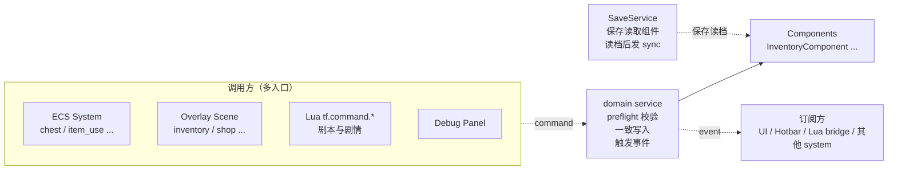
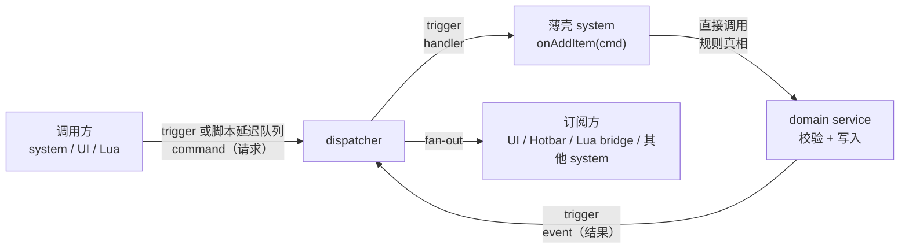
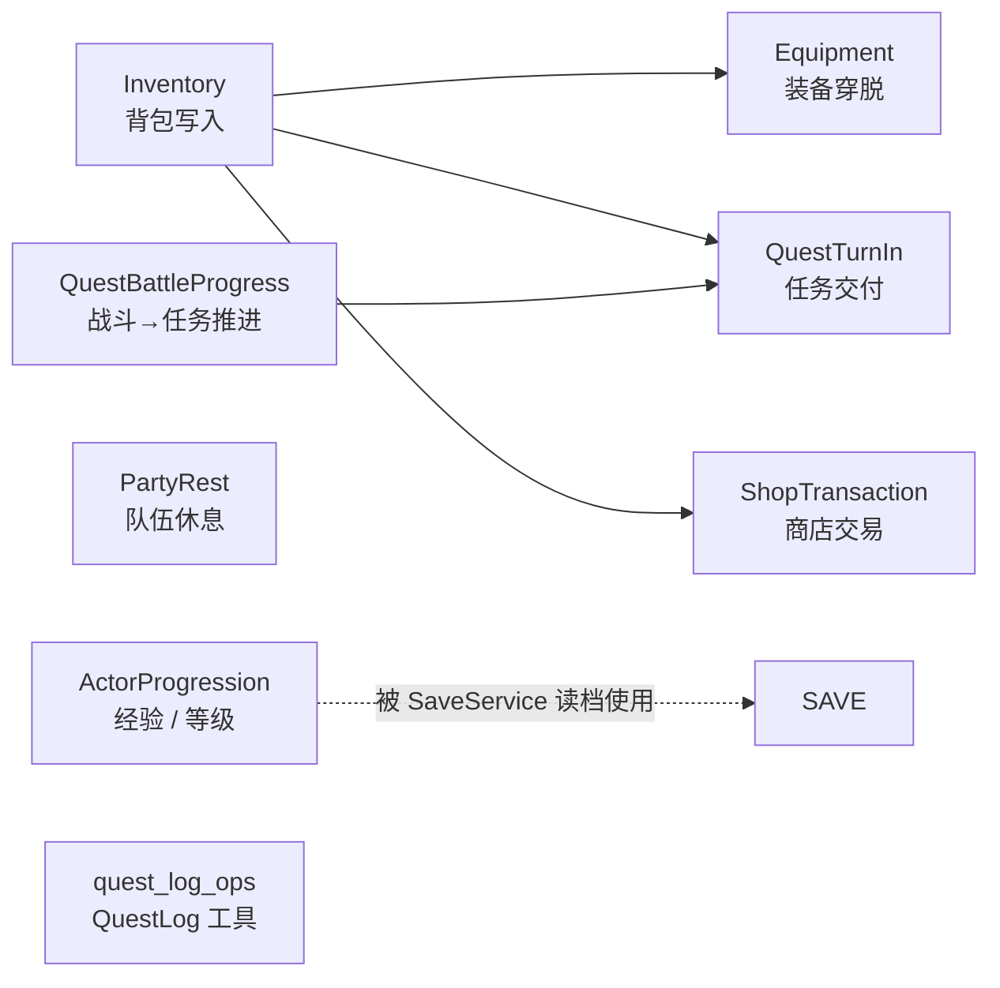

# 第2课 领域服务概览与命令/事件边界

上节课我们看了"东西怎么进来"——`GameRuntimeAssembler` 把 catalog、service、system 按依赖顺序装配起来。这节课反向看"**东西怎么写回去**"。

当玩家拾取一个苹果、卖掉一把锄头、交付一个任务——谁来决定"这个写入是否合法？是否完成？是否要通知 UI？"

> 这节课是"骨架课"。我们的目标不是记住 8 个 domain 文件的细节，而是建立**直觉**：`src/game/domain/` 这一层存在的意义、它和 command / event 的协作方式、以及为什么这是后续所有玩法课程（任务、商店、装备、战斗）的共同模板。单个服务的具体实现细节会在后续课程中逐个展开。

---

## 读完这节课，你应该能回答

1. 为什么"加物品 / 穿装备 / 完成任务 / 商店交易"这类操作不直接写在 system 或 scene 里？
2. `command`、`event`、`domain service` 三者各自承担什么角色？为什么不让 system 直接调 system？
3. `src/game/domain/` 里 8 个文件分成哪三种形态？什么时候用哪种？
4. 领域服务的"共同模式"——preflight 校验、一致写入、反馈事件——具体长什么样？

---

## 先看再讲：在调试面板里感受一次写入

在开始读代码之前，强烈建议先动手操作一次：

1. 跑起 TinyFarmRPG，进入 `GameScene`。
2. 按 `F5` 打开 ImGui 调试面板，找到背包相关面板。
3. 给玩家加 3 个物品（比如 `strawberry_seed`）。
4. 观察控制台和 HUD：背包格子刷新了、快捷栏自动绑定了、Floating Notice 弹出来了。

一次写入，触发了**至少 3 处 UI 反应**。而且所有这些反应——格子刷新、快捷栏同步、提示弹出——都不是"加物品"那个函数手动去调的。它们各自订阅了同一个事件，互不知情。

这就是领域服务存在的意义：**让一次写入的所有副作用集中、可控、可观察**。带着这个画面往下读代码，理解会顺畅很多。

---

## 关键链路：多入口 → 单点写入 → 多订阅



记住一句话：**多入口 → 单点写入 → 多订阅**。这就是 domain 层的核心拓扑，也是整节课要反复印证的模式。

> `SaveService` 不是 `InventoryChanged` 的订阅者。保存时它直接从当前组件抓取数据；读档 apply 后，它触发 `InventorySyncCommand` / `HotbarSyncCommand` 让 UI 重新同步。这和"玩法写入发事件"是两条不同的链路，注意区分。

---

## 核心知识点

### 1. 为什么"散写在 system 里"行不通？

先反过来想：**如果不集中，会发生什么？**

假设每个需要"加物品"的地方都自己实现一遍：

```cpp
// ChestSystem: 玩家开箱子
auto& inv = registry.get<InventoryComponent>(player);
inv.slots[empty_slot].item_id_ = reward_id;
inv.slots[empty_slot].count_ = 1;
dispatcher.trigger(InventoryChanged{...});

// ItemUseSystem: 收获作物
auto& inv = registry.get<InventoryComponent>(player);
// 合并堆叠？规则在哪？stack_limit 怎么取？
// ...

// ShopMenuScene: 玩家买物品
// 又要再写一遍合并堆叠 + 触发事件 + 失败回退 ...

// Lua tf.command.add_item: 剧本送礼
// 再写一遍 ...
```

这看起来每个地方"也就几行代码"，但实际上埋了四个坑：

- **规则漂移**。合并堆叠、stack_limit、空槽分配的逻辑在 4 个地方各写一份，过几个版本就会不一致。玩家在商店买物品能正常堆叠，但收 NPC 礼物时却多占了一个格子——这种 bug 查起来想死。
- **事件遗漏**。某个人忘了发 `InventoryChanged`，UI 就"看起来加了但格子没刷新"。玩家会以为东西丢了。
- **半成功状态**。某个地方"先扣金币再加物品"，背包满了——钱没了，物品没拿到。玩家直接关游戏。
- **测试成本爆炸**。要测"加物品"的边界条件（堆叠满、背包满、无效 id），得把 ChestSystem、ItemUseSystem、ShopMenuScene 等每一个调用方都拉起来。

TinyFarmRPG 用**领域服务**一次性解决：背包里的加 / 减 / 移动 / 排序全部走 `InventoryDomainService`。其中"加物品"统一落到 `addItem(...)` 一个函数。规则集中、事件集中、测试集中。

### 2. command / event / domain service 三角分工

很多人初学时会把 command 和 event 搞混。在 TinyFarmRPG 的体系里，它们的语义边界非常清晰：



| 名字 | 语义 | 例子 | 不应该承担什么 |
| --- | --- | --- | --- |
| **command** | "**请求**做某件事"——可能被拒绝 | `AddItemCommand`, `OpenShopCommand`, `TurnInQuestCommand` | 不携带"结果"信息 |
| **event** | "**事实**已经发生"——客观陈述 | `InventoryChanged`, `InventoryFullEvent`, `QuestCompletedEvent` | 不携带"请求"语义 |
| **domain service** | "**规则真相**"——决定能否成功、如何写入 | `InventoryDomainService::addItem` | 不开 UI、不读输入、不打开 Scene |

> **为什么不让 system 直接调 system？** 四个层面的理由：
> - **解耦**。调用方不需要 `#include` 被调方的头文件，依赖图保持平坦。
> - **多订阅**。UI、Hotbar、脚本桥可以一起订阅 `InventoryChanged`，互不知情。新增订阅者时已有的代码一行不用改。
> - **调度边界**。command 可以直接 `trigger`，也可以在脚本回调里先进入延迟队列，等回调结束后再触发——避免在 Lua 脚本栈中途改 ECS 状态。
> - **可重放 / 可记录**。基于 command 的日志可以重放玩家行为，排查 bug 时还原现场非常有用。

**一个完整例子**：玩家从 NPC 那里收到 3 个 `strawberry_seed`。

```lua
-- 1. Lua 内容层发出请求
tf.command.add_item("strawberry_seed", 3)
```

```cpp
// 2. C++ 侧 ScriptGameApi 解析字符串 id 和目标实体
//    triggerFromScript(...) 在普通调用中直接 trigger；
//    如果正在处理脚本回调，则先延迟到回调结束后再 trigger。
triggerFromScript(host, dispatcher, AddItemCommand{player, item_id, 3, -1});

// 3. InventorySystem 是个"薄壳"，只负责把 command 转给 domain service
void InventorySystem::onAddItem(const AddItemCommand& evt) {
    (void)inventory_domain_service_.addItem(
        evt.target, evt.item_id, evt.count, evt.preferred_slot_index);
}

// 4. domain service 做规则真相：catalog 校验、合并堆叠、空槽分配、失败回报
//    成功或部分成功时 trigger InventoryChanged(diff)
//    全部失败或部分失败时 trigger InventoryFullEvent(rejected)

// 5. UI / Hotbar / ScriptEventBridge 监听 InventoryChanged 各自刷新或转发
```

注意：**`InventorySystem` 本身几乎不包含写入逻辑**——它就是 command 与 domain service 之间的胶水。这是 TinyFarmRPG 区别于 TinyFarm 的关键改造：system 从"逻辑持有者"变成了"消息路由者"。

### 3. 领域服务的共同模式：preflight → 一致写入 → event

打开 [`inventory_domain_service.cpp`](../../src/game/domain/inventory_domain_service.cpp)，`addItem()` 的骨架长这样：

```cpp
InventoryMutationResult InventoryDomainService::addItem(
        entt::entity target, entt::id_type item_id, int count, int preferred) {

    InventoryMutationResult result{};
    result.target = target;

    // ────── ① preflight 校验：参数合法吗？catalog 里有这个物品吗？ ──────
    if (target == entt::null || item_id == entt::null || count <= 0) return result;
    const auto* item = catalog_.findItem(item_id);
    if (item == nullptr) {
        result.rejected = count;
        return result;
    }
    if (!ensureInventory(target)) {
        result.rejected = count;
        return result;
    }

    // ────── ② 计算与一致写入 ──────
    //   读取 item->stack_limit_
    //   优先 preferred slot，再尝试已有堆叠，最后填空槽
    //   每个真实变更都进入 diff，remaining 记录未接收数量

    // ────── ③ 发反馈事件 ──────
    if (!diff.empty()) emitChanged(target, diff, /*from_add=*/true);
    if (remaining > 0) dispatcher_.trigger(InventoryFullEvent{...});

    return result;
}
```

**三段式是所有领域服务的公共骨架**：

1. **Preflight 校验**。在动手之前判断"能不能做"。失败立刻返回，**不留中间状态**。这意味着你不会看到"已经扣了钱但物品没加上"的情况——因为扣钱本身也在校验通过之后才发生。
2. **一致写入**。写入逻辑集中在 service 内部结算。像 `addItem` 这种允许"部分接收"的操作，用 `accepted / rejected` 和事件把结果说清楚；像商店购买这种必须"全有全无"的复合交易，则需要提前预演或回滚。
3. **反馈事件**。成功路径发 `XxxChanged`（携带 diff），失败路径发专门事件（`InventoryFullEvent`、`ShopTradeFailureReason` 等）。订阅方不需要知道"为什么变"，只需要知道"变了什么"。

> **进阶约定**：对"先扣 A 再加 B"的复合操作（典型是商店交易），TinyFarmRPG 用 **Preview / Commit 二分**：UI 点确认前先 `previewBuy()` 纯查询——"能买吗？买了之后背包什么状态？"——玩家真的点了"购买"再 `commitBuy()` 写入。这样就不会出现"钱扣了才发现背包满"的尴尬。这是 [商店系统](11-商店系统.md) 的核心话题。

### 4. `src/game/domain/` 全景：8 个文件，三种形态

打开目录，按"是否持有外部依赖"分成三类：

| 形态 | 文件 | 谁持有 | 何时用 |
| --- | --- | --- | --- |
| **有状态服务**（持有 registry / dispatcher / catalog 引用） | `inventory_domain_service.h`<br/>`equipment_domain_service.h`<br/>`quest_turn_in_service.h`<br/>`shop_transaction_service.h` | `GameRuntimeServices` 持有 `unique_ptr` | 需要多个调用方共享、持续监听 dispatcher 时 |
| **无状态算法类**（无成员；可能是 `static`，也可能临时构造后调用） | `actor_progression_service.h`<br/>`party_rest_service.h`<br/>`quest_battle_progress_resolver.h` | 任何地方按需调用 | 纯算法、不需要长生命周期 |
| **自由函数命名空间** | `quest_log_ops.h` | 任何处理 `QuestLogComponent` 的位置 | 只操作单个组件、无外部依赖 |

这种分类不是历史偶然，而是有意的设计选择：

- 持有 catalog 引用的 → 在装配期注入，做成类成员便于生命周期管理。
- 经验曲线、HP/MP 恢复公式、战斗后任务推进这种纯算法 → 不进 `GameRuntimeServices`，避免无意义的长生命周期。
- `tryAcceptQuest` / `isQuestActive` 这种只操作单个组件的小工具 → namespace 函数最轻量，零开销。

**8 个文件覆盖的玩法领域**：



注意 `Equipment`、`QuestTurnIn`、`ShopTransaction` 三者都**复用** `InventoryDomainService` 来写物品——装备脱下要回背包、任务奖励要给物品、商店买卖要扣加物品，全部走同一个入口。这就是"单点写入"原则在跨服务协作中的体现。

### 5. service 不读 UI，不开 Scene——交互结果交给 system / scene 表达

这是一条非常重要的边界约定，值得单独拿出来强调。

**❌ 错误做法**：在 `QuestTurnInService` 里直接 `requestPushScene(std::make_unique<QuestRewardScene>(...))`。
**✅ 正确做法**：`QuestTurnInService::turnIn()` 只返回 `QuestTurnInResult` 并写入奖励 / 任务状态；`QuestInteractionSystem::turnInQuest()` 拿到成功结果后，再触发 `QuestCompletedEvent`，并决定是否显示完成文本。

这条边界让 domain 层保持**可测试性**：单元测试只需要 mock dispatcher 截获事件，不需要把整个 `RmlUiRuntime` 拉起来。想象一下如果每个 service 都去开 UI——那测试一个"背包满时的任务交付失败"就得启动完整的渲染管线，根本不现实。

### 6. 测试：最低安全网

`tests/game/` 下每个有状态 domain service 都有一个对应的 `*_test.cpp`：

- `inventory_domain_service_test.cpp` — 背包满、部分成功、堆叠合并等失败路径。
- `equipment_domain_service_test.cpp` — 装备槽位不匹配、等级不够、背包满时脱不下等。
- `quest_turn_in_service_test.cpp` — objective 未达成、奖励物品塞不下等。
- `shop_transaction_service_test.cpp` — 钱不够、商品不存在、买完背包满等。

随便打开一个，会发现它们都遵循同一个模板：

```cpp
TEST(InventoryDomainServiceTest, AddItemPartial_EmitsChangedAndFullEvent) {
    // ① 构造最小 fixture：registry + dispatcher + 测试 ItemCatalog + service
    // ② 准备初始状态：把背包塞到只剩 1 格能加
    // ③ 用 capture 结构监听 InventoryChanged 与 InventoryFullEvent
    // ④ 调一次 service.addItem(player, item_id, 3)
    // ⑤ 断言：accepted=1, rejected=2, 两个事件都发了一次
}
```

> **为新增玩法补测试时，先写失败路径。** 成功路径很容易被 system 集成测试覆盖；真正容易出问题的是边界条件——背包满、钱不够、状态非法。先把失败路径测出来，再写成功路径。这是 TinyFarmRPG 的工程经验。

---

## 配合阅读

| 顺序 | 文件 / 章节 | 关注点 |
| :---: | --- | --- |
| 1 | [`docs/game/domain-services.md`](../../docs/game/domain-services.md) | **本节课核心阅读材料**——8 个文件总览、调用链、新增 service checklist |
| 2 | [`docs/game/runtime-assembly.md`](../../docs/game/runtime-assembly.md)（领域服务装配章节） | 服务装配顺序、依赖图 |
| 3 | 上一期 [part-06 事件系统](../ref/OpenGL与迷你农场/06-事件系统.md) | `entt::dispatcher` 的 `trigger / enqueue / update` 三种语义 |
| 4 | 上一期 [part-08 ECS 在本项目中的落地](../ref/OpenGL与迷你农场/08-ECS%20在本项目中的落地.md) | 组件 / 系统 / Registry 的基础（本期不重讲） |

---

## 从这几个文件开始看

| 顺序 | 文件 | 你会看到什么 |
| :---: | --- | --- |
| 1 | [`src/game/domain/inventory_domain_service.h`](../../src/game/domain/inventory_domain_service.h) | **作为模板通览一次**：构造参数 + `ensureInventory / addItem / removeItem / moveItem / sortInventory` + `InventoryMutationResult` |
| 2 | [`src/game/domain/inventory_domain_service.cpp`](../../src/game/domain/inventory_domain_service.cpp) | `addItem()` 的三段式骨架（preflight / 一致写入 / 事件），以及 `moveItem / sortInventory` 如何留在 domain |
| 3 | [`src/game/defs/commands.h`](../../src/game/defs/commands.h) | 用 `#include` 串起来的"命令总表"，按模块拆成 `commands_inventory.h` 等 |
| 4 | [`src/game/defs/events.h`](../../src/game/defs/events.h) | 与 commands 平行的"事件总表" |
| 5 | [`src/game/system/inventory_system.cpp`](../../src/game/system/inventory_system.cpp)（`onAddItem`） | 看 system 如何"薄壳化"：只把 command 转发给 domain service |

> **阅读建议**：把 `inventory_system.cpp` 与 `inventory_domain_service.cpp` 并排打开。你会发现 **system 几乎没有规则逻辑**——所有规则都在 domain 里。这是 TinyFarmRPG 对"system 应该只是数据驱动逻辑"的具体表达。

---

## 检查你的理解

1. **集中写入解决了哪些散写方案的痛点？** 至少列出 3 个，并各举一个会"坏掉"的具体场景（提示：规则漂移、事件遗漏、半成功状态、测试成本）。
2. **command 与 event 的边界**：能否把 `InventoryChanged` 当作 command 用（即让 system 监听 `InventoryChanged` 并写背包）？为什么这是坏主意？
3. **preflight 与回退在 `addItem` 里如何体现？** 打开 `inventory_domain_service.cpp` 找出前三个早退点：参数非法、catalog 查不到物品、目标实体无法拥有背包。它们分别返回什么？
4. **形态选择**：如果你要新增一个"钓鱼"服务（持有 `FishCatalog` 引用、被多个调用方共享），应该做成"有状态类"、"无状态算法类"还是"自由函数 namespace"？理由？

---

## 动手试试

**目标**：把"加物品"这条完整链路画出来。

操作步骤：

1. 选 **`AddItemCommand`** 作为入口，沿着 dispatcher 找到它的 handler——预计在 [`inventory_system.cpp`](../../src/game/system/inventory_system.cpp) 的 `onAddItem`。
2. 跟进到 [`inventory_domain_service.cpp`](../../src/game/domain/inventory_domain_service.cpp)，标出 preflight 检查的 3 个早退点。
3. 找到成功路径上的 `emitChanged()` 与失败路径上的 `dispatcher_.trigger(InventoryFullEvent{...})`。
4. 用 grep 查 `InventoryChanged` 的订阅者——至少能找到 `HotbarSystem`、`InventoryTabContent`、`EquipmentTabContent`、`ScriptEventBridge`。再对照 `SaveService`：它保存时读取组件，读档后发 sync command，而不是订阅 `InventoryChanged`。
5. 把以上整理成一张 mermaid 流程图：**入口 command → preflight → 写入 → 成功 / 失败事件 → 各订阅者**。

**完成后回答**：如果让你给"加物品"加一个新副作用（比如"加物品时播放音效"），你会在以下哪个位置加？为什么？

- A. 在 `inventory_domain_service.cpp::addItem()` 里直接调 `AudioPlayer::play(...)`
- B. 新建一个 `ActionSoundSystem`，订阅 `InventoryChanged` 事件
- C. 在每个调用方（ChestSystem / ItemUseSystem / ...）里各自 play 一次

---

## 小结

这节课我们建立了一个贯穿后续所有玩法课程的"骨架直觉"：

- 玩法状态的写入遵循**多入口 → 单点写入 → 多订阅**。这是 domain 层存在的根本原因。
- command（请求）、event（事实）、domain service（规则真相）三者分工明确，不要混用。
- 所有领域服务遵循 **preflight → 一致写入 → event** 三段式；复合操作再加 **Preview / Commit** 二分。
- 8 个 domain 文件分三种形态（有状态类 / 无状态算法类 / 自由函数），形态由"是否持有外部依赖"决定，不是随意划分的。
- 三条核心边界：写入必须发事件、service 不开 UI、catalog 只读。这让 domain 层可测、可演进。
- 失败路径测试是新增玩法的最低安全网——先测"怎么失败"，再测"怎么成功"。

架构基础到这里就结束了。下节课开始，我们进入一个新阶段。

---

## 下节课预告

下节课 **[RmlUi 接入](03-RmlUi接入.md)** 会回答一个很多上一期同学心中的疑问：**TinyFarm 已经有了自研 UIManager，为什么还要砍掉重来，接入 RmlUi？** 接入点在哪里？与原有资源 / 字体系统怎么共存？调试面板为什么继续用 ImGui 而不是也换成 RmlUi？我们下节课见。
