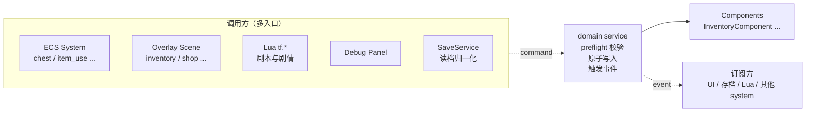
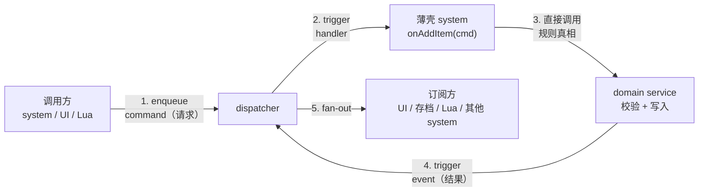
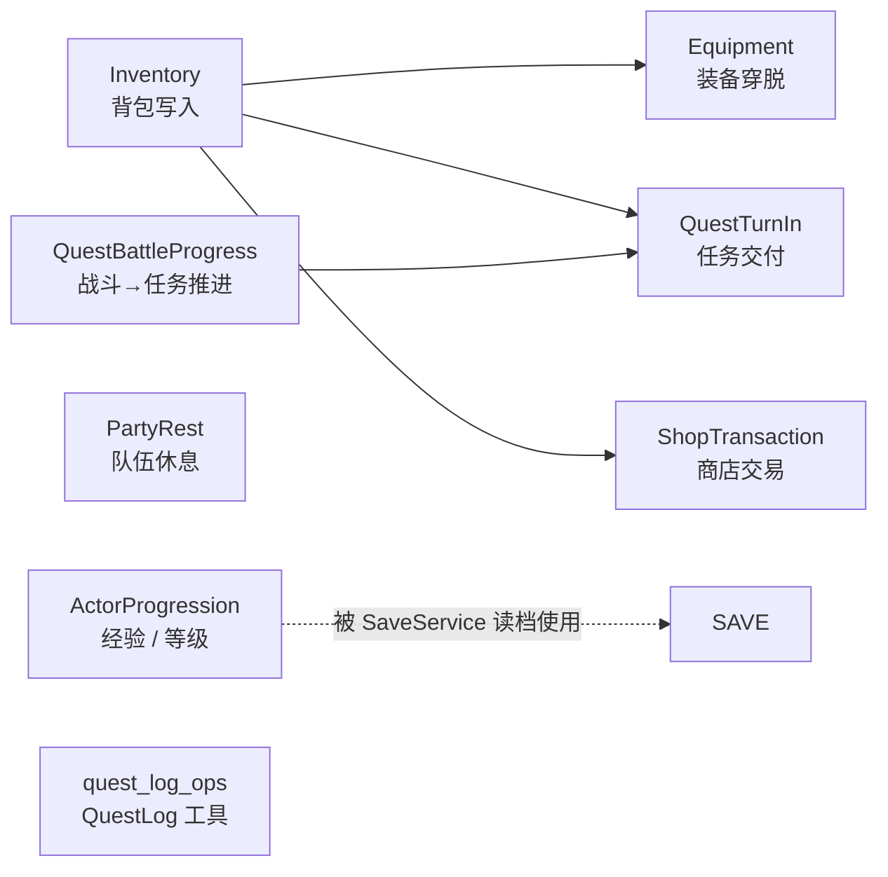

# L02 领域服务概览与命令 / 事件边界

L01 我们看了"东西怎么进来"——`GameRuntimeAssembler` 把 catalog、service、system 按依赖顺序装配起来。这一讲反向看"**东西怎么写回去**"：当玩家拾取一个苹果、卖一把锄头、交付一个任务时，谁来决定"这个写入是否合法、是否完成、是否要通知 UI"？

> 本讲是"骨架课"。我们要建立的是**直觉**——`src/game/domain/` 这一层存在的意义、它和 command / event 的协作方式、以及为什么这是后续所有玩法讲次的共同模板。**单个服务的具体实现细节**（preview / commit 二分、装备槽位规则、商店交易等）留到 L10 / L11 / L13 详细展开。

---

## 🎯 本讲目标

读完之后，你应该能回答：

1. 为什么"加物品 / 穿装备 / 完成任务 / 商店交易"这类操作不直接写在 system 或 scene 里？
2. `command` / `event` / `domain service` 三者各自承担什么？为什么不让 system 直接调 system？
3. `src/game/domain/` 里 8 个文件分成哪三种形态？什么时候用哪种？
4. 领域服务的"共同模式"——preflight 校验、原子写入、反馈事件——具体长什么样？

---

## 👁️ 先看再讲：在调试面板里看一次写入

在开讲前，建议先打开项目里的 **Inventory Debug Panel**：

1. 跑起来 TinyFarmRPG，进入 `GameScene`。
2. 按 `F5` 打开 ImGui 调试面板，找到背包相关面板。
3. 给玩家"加 3 个苹果"。
4. 观察控制台 / HUD：背包格子刷新、Hotbar 自动绑定、Floating Notice（如有）一并到位。

整条链路只动了一次写入，但触发了**至少 3 处 UI 反应**。这就是领域服务存在的意义——让"一次写入"的所有副作用集中、可控、可观察。回头再看代码，会理解得更顺。

---

## 🗺️ 关键链路



记住一句话：**多入口 → 单点写入 → 多订阅**。这就是 domain 层的核心拓扑。

---

## 💡 核心知识点

### 1. 为什么"散写在 system 里"的方案不可持续

我们先反向看：**如果不集中**，会发生什么？

假设你要给"加物品"这个操作写代码。每个调用方都自己实现一遍：

```cpp
// ChestSystem: 玩家开箱子
auto& inv = registry.get<InventoryComponent>(player);
inv.slots[empty_slot].item_id_ = reward_id;
inv.slots[empty_slot].count_ = 1;
dispatcher.trigger(InventoryChanged{...});

// ItemUseSystem: 收获作物
auto& inv = registry.get<InventoryComponent>(player);
// 合并堆叠？规则在哪？stack_limit 怎么取？
// ...

// ShopMenuScene: 玩家买物品
// 又要再写一遍合并堆叠 + 触发事件 + 失败回退 ...

// Lua tf.inventory.add: 剧本送礼
// 再写一遍 ...
```

**这套散写方案的具体痛点**：

- **规则漂移**：合并堆叠、stack_limit、空槽分配的细节在 4 个地方各写一份，过几个版本就会不一致。
- **事件遗漏**：有人忘了发 `InventoryChangedEvent`，UI 就"看起来加了但格子没刷新"。
- **半成功状态**：某地方"先扣金币再加物品"，背包满了就出现"钱没了、物品没拿到"的玩家投诉。
- **测试成本爆炸**：要测"加物品"的边界条件（堆叠满、背包满、无效 id），得把 ChestSystem、ItemUseSystem 等每个都拉起来。

TinyFarmRPG 用 **领域服务** 一次性消除这些问题：所有"加 / 减 / 改"都必须走 `InventoryDomainService::addItem(...)`。规则集中、事件集中、测试集中。

### 2. command / event / domain service 三角分工

很多人初学时会把 command 和 event 弄混。在 TinyFarmRPG 的体系里，它们有非常明确的分工：



三个角色的语义边界：

| 名字 | 语义 | 例子 | 不应该承担什么 |
| --- | --- | --- | --- |
| **command** | "**请求**做某件事"——可能被拒绝 | `AddItemCommand`, `BuyItemCommand`, `TurnInQuestCommand` | 不携带"结果"信息 |
| **event** | "**事实**已经发生"——客观陈述 | `InventoryChanged`, `InventoryFullEvent`, `QuestCompletedEvent` | 不携带"请求"语义 |
| **domain service** | "**规则真相**"——决定能否成功、如何写入 | `InventoryDomainService::addItem` | 不开 UI、不读输入、不打开 Scene |

> **为什么不让 system → system 直接调用？** 答案在 4 个层面：
> - **解耦**：调用方不需要 `#include` 被调方的头文件，依赖图保持平坦。
> - **多订阅**：UI / 存档 / 脚本可以一起订阅 `InventoryChanged`，互不知情。
> - **跨线程边界**：command 可以 `enqueue` 到下一帧统一处理，避免在 update 中间改 ECS 引发迭代器失效。
> - **可重放 / 可记录**：基于 command 的日志可以重放玩家行为，便于排查 bug。

**举一个完整例子**：玩家从 NPC 那里收到 3 个苹果。

```cpp
// 1. Lua 内容层发出请求
//    （C++ 侧最终落到 dispatcher.enqueue<AddItemCommand>(...)）
tf.inventory.add(player, "apple", 3)

// 2. InventorySystem 是个"薄壳"，只负责把 command 转给 domain service
void InventorySystem::onAddItem(const AddItemCommand& evt) {
    (void)inventory_domain_service_.addItem(
        evt.target, evt.item_id, evt.count, evt.preferred_slot_index);
}

// 3. domain service 做规则真相：合并堆叠、空槽分配、失败回退
//    成功时 trigger InventoryChanged(diff)
//    全部失败或部分失败时 trigger InventoryFullEvent(rejected)

// 4. UI / 存档 / Hotbar 监听 InventoryChanged 各自刷新
```

注意：**`InventorySystem` 本身几乎不包含写入逻辑**——它就是 command 与 domain service 之间的胶水。这是 TinyFarmRPG 区别于 TinyFarm 的关键改造。

### 3. 领域服务的共同模式：preflight → atomic write → event

打开 [`inventory_domain_service.cpp`](../../src/game/domain/inventory_domain_service.cpp)，`addItem()` 的骨架是这样：

```cpp
InventoryMutationResult InventoryDomainService::addItem(
        entt::entity target, entt::id_type item_id, int count, int preferred) {

    // ────── ① preflight 校验：参数合法吗？目标存在吗？ ──────
    if (target == entt::null || item_id == entt::null || count <= 0) return {};
    if (!ensureInventory(target)) { /* 返回 rejected = count */ }

    // ────── ② 计算与原子写入 ──────
    //   先在 diff 里收集"打算改哪些槽位"
    //   一边走 tryMerge / tryFillEmpty 一边累计 remaining
    //   diff 累积过程中如果出错可以整体放弃（这里实现上靠 remaining 计算）

    // ────── ③ 发反馈事件 ──────
    if (!diff.empty()) emitChanged(target, diff, /*from_add=*/true);
    if (remaining > 0) dispatcher_.trigger(InventoryFullEvent{...});

    return { accepted, rejected, diff };
}
```

**三段式是所有领域服务的公共骨架**：

1. **Preflight 校验**：在动手前判断"能不能做"。失败立刻返回，**不留中间状态**。
2. **原子写入**：成功就完整成功；如果中途必须放弃（背包满了），已经做的修改要可回滚或在计算阶段就避免提交。
3. **反馈事件**：成功路径发 `XxxChanged`（携带 diff），失败路径发专门事件（`InventoryFullEvent`、`ShopTradeFailureReason` 等）。

> **进阶约定**：对"先扣 A 再加 B"的复合操作（典型是商店交易），TinyFarmRPG 用 **Preview / Commit 二分**：UI 点确认前先 `previewBuy()` 纯查询，玩家真的点了"购买"再 `commitBuy()` 写入。**避免在已经扣钱后才发现背包满**。这是 L11 的核心话题。

### 4. `src/game/domain/` 全景：8 个文件分三种形态

打开目录，按"是否持有外部依赖"分成三类（细节留 [docs/game/domain-services.md](../../docs/game/domain-services.md)）：

| 形态 | 文件 | 谁持有 | 何时用 |
| --- | --- | --- | --- |
| **有状态服务**<br/>（持有 registry / dispatcher / catalog 引用） | `inventory_domain_service.h`<br/>`equipment_domain_service.h`<br/>`quest_turn_in_service.h`<br/>`shop_transaction_service.h` | `GameRuntimeServices` 持有 `unique_ptr` | 需要多个调用方共享、持续监听 dispatcher 时 |
| **静态工具类**<br/>（全部方法 `static`，无成员） | `actor_progression_service.h`<br/>`party_rest_service.h`<br/>`quest_battle_progress_resolver.h` | 任何地方按需调用 | 纯算法、不需要长生命周期 |
| **自由函数命名空间** | `quest_log_ops.h` | 任何处理 `QuestLogComponent` 的位置 | 只操作单个组件、无外部依赖 |

**这种分类不是历史包袱，而是有意区分**：

- 持有 catalog 引用的需要在装配期注入 → 做成类成员便于生命周期管理。
- 经验曲线、HP/MP 恢复公式之类的纯数学 → 做成 static 避免无意义对象。
- `tryAcceptQuest` / `isQuestActive` 这种纯操作组件的小工具 → namespace 函数最轻量。

**8 个文件覆盖的玩法领域**：



注意 `Equipment / QuestTurnIn / ShopTransaction` 三者都**复用** `InventoryDomainService` 来写物品——这是"单点写入"原则的体现：装备脱下要回背包、任务奖励要给物品、商店买卖要扣加物品，全都走同一个入口。

### 5. service 不读 UI，不开 Scene——它只"发事件"

这是一条非常重要的边界约定。

**❌ 错误做法**：在 `QuestTurnInService` 里直接 `requestPushScene(std::make_unique<QuestRewardScene>(...))`。
**✅ 正确做法**：domain 只 trigger `QuestCompletedEvent`，由 `GameScene` 或专门的 UI controller 订阅后决定要不要弹画面。

这条边界让 domain 层保持**可测试性**：单元测试可以用 mock dispatcher 截获事件，不需要把 `RmlUiRuntime` 拉起来。

### 6. 测试是最低安全网

`tests/game/` 下每个有状态 domain service 都有一个对应的 `*_test.cpp`：

- `inventory_domain_service_test.cpp` — 背包满、部分成功、堆叠合并等失败路径。
- `equipment_domain_service_test.cpp` — 装备槽位不匹配、等级不够、背包满时脱不下等。
- `quest_turn_in_service_test.cpp` — objective 未达成、奖励物品塞不下等。
- `shop_transaction_service_test.cpp` — 钱不够、商品不存在、买完背包满等。

随便打开一个，会发现它们都遵循一个模板：

```cpp
TEST(InventoryDomainServiceTest, AddItemPartial_EmitsChangedAndFullEvent) {
    // ① 构造最小 fixture：registry + dispatcher + 空 catalog + service
    // ② 准备初始状态：把背包塞到只剩 1 格能加
    // ③ 用 capture 结构监听 InventoryChanged 与 InventoryFullEvent
    // ④ 调一次 service.addItem(player, item_id, 3)
    // ⑤ 断言：accepted=1, rejected=2, 两个事件都发了一次
}
```

> **为新增玩法补测试时，先写失败路径**：成功路径很容易被 system 集成测试覆盖；真正容易出问题的是边界条件（背包满、钱不够、状态非法）。**先把失败路径测出来，再写成功路径**——这是 TinyFarmRPG 的工程经验。

---

## 📋 阅读清单

| 顺序 | 文件 / 章节 | 关注点 |
| :---: | --- | --- |
| 1 | [`docs/game/domain-services.md`](../../docs/game/domain-services.md) | **本讲核心阅读材料**——8 个文件总览、调用链、新增 service checklist |
| 2 | [`docs/game/runtime-assembly.md`](../../docs/game/runtime-assembly.md)（领域服务装配章节） | 服务装配顺序、依赖图 |
| 3 | 上一期 [part-06 事件系统](../ref/OpenGL与迷你农场/06-事件系统.md) | `entt::dispatcher` 的 `trigger / enqueue / update` 三种语义 |
| 4 | 上一期 [part-08 ECS 在本项目中的落地](../ref/OpenGL与迷你农场/08-ECS%20在本项目中的落地.md) | 组件 / 系统 / Registry 的基础（本期不重讲） |

---

## 🔑 源码入口

| 顺序 | 文件 | 你会看到什么 |
| :---: | --- | --- |
| 1 | [`src/game/domain/inventory_domain_service.h`](../../src/game/domain/inventory_domain_service.h) | **仅作为模板**通览一次：构造参数 + 3 个公共方法 + `InventoryMutationResult` |
| 2 | [`src/game/domain/inventory_domain_service.cpp`](../../src/game/domain/inventory_domain_service.cpp) | `addItem()` 的三段式骨架（preflight / 写入 / 事件） |
| 3 | [`src/game/defs/commands.h`](../../src/game/defs/commands.h) | 用 `#include` 串起来的"命令总表"，按模块拆成 `commands_inventory.h` 等 |
| 4 | [`src/game/defs/events.h`](../../src/game/defs/events.h) | 与 commands 平行的"事件总表" |
| 5 | [`src/game/system/inventory_system.cpp`](../../src/game/system/inventory_system.cpp)（`onAddItem`） | 看 system 如何"薄壳化"：只把 command 转发给 domain service |

> **观察建议**：把 `inventory_system.cpp` 与 `inventory_domain_service.cpp` 并排打开。会发现 **system 几乎没有规则逻辑**——所有规则都在 domain 里。这是 TinyFarmRPG 对"system 应该只是数据驱动逻辑"的具体表达。

---

## ❓ 自测问题

1. **集中写入解决了哪些散写方案的痛点？** 至少列出 3 个，并各举一个会"坏掉"的具体场景（提示：规则漂移、事件遗漏、半成功状态、测试成本）。
2. **command 与 event 的边界**：能否把 `InventoryChanged` 当作 command 用（即让 system 监听 `InventoryChanged` 并写背包）？为什么这是个坏主意？
3. **preflight 与回退在 `addItem` 里如何体现？** 打开 `inventory_domain_service.cpp` 找出三个 `return` 语句，分别对应哪种失败？
4. **形态选择**：如果你要新增一个"钓鱼"服务（持有 `FishCatalog` 引用、被多个调用方共享），应该做成"有状态类"、"static 工具类"还是"自由函数 namespace"？理由？

---

## 🧪 最小练习

**目标**：把"加物品"这条完整链路画出来。

操作步骤：

1. 选 **`AddItemCommand`** 作为入口，沿着 dispatcher 找到它的 handler——预计在 [`inventory_system.cpp`](../../src/game/system/inventory_system.cpp) 的 `onAddItem`。
2. 跟进到 [`inventory_domain_service.cpp`](../../src/game/domain/inventory_domain_service.cpp)，标出 preflight 检查的 3 个早退点。
3. 找到成功路径上的 `emitChanged()` 与失败路径上的 `dispatcher_.trigger(InventoryFullEvent{...})`。
4. 用 grep 查 `InventoryChanged` 的订阅者——至少能找到 HUD（Hotbar）、Inventory Menu UI、存档 / save 相关代码。
5. 把以上整理成一张 mermaid 流程图：**入口 command → preflight → 写入 → 成功 / 失败事件 → 各订阅者**。

**完成后回答**：如果让你给"加物品"加一个新副作用（比如"加物品时播放音效"），你会在以下哪个位置加？为什么？
- A. 在 `inventory_domain_service.cpp::addItem()` 里直接调 `AudioPlayer::play(...)`
- B. 新建一个 `ActionSoundSystem`，订阅 `InventoryChanged` 事件
- C. 在每个调用方（ChestSystem / ItemUseSystem / ...）里各自 play 一次

---

## 📌 小结

- 玩法状态的写入**多入口、单点写入、多订阅**——这是 domain 层存在的根本原因。
- command / event / domain service 三角分工：command 是请求，event 是事实，service 是规则真相。
- 所有领域服务遵循 **preflight → atomic write → event** 三段式；复合操作再加 **Preview / Commit** 二分。
- 8 个 domain 文件分三种形态（有状态类 / static 工具 / 自由函数），形态由依赖决定。
- 写入必须发事件、service 不开 UI、catalog 只读——这三条边界让 domain 层可测、可演进。
- 失败路径测试是新增玩法的最低安全网。

## 🚀 下节课预告

架构基础到此完成。从下一讲开始，我们进入 **Stage II — 生产 UI 与输入升级**。**L03 RmlUi 接入**会回答一个让很多上一期学生不解的问题——**TinyFarm 已经有了自研 UIManager，为什么 TinyFarmRPG 要砍掉重新接入 RmlUi？**接入点在哪里、与原有资源 / 字体系统怎么共存、调试面板为什么继续用 ImGui？我们下讲见。
