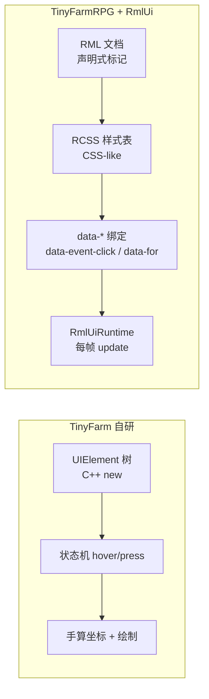
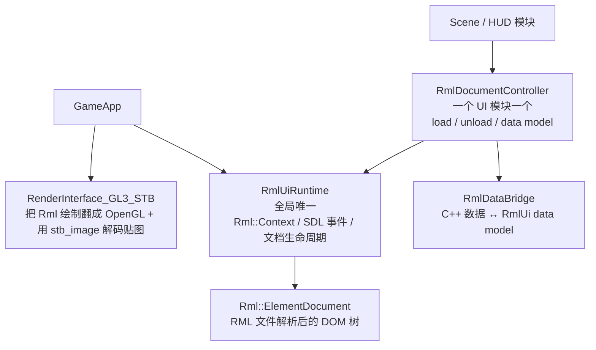

# L03 从自研 UIManager 到 RmlUi

L02 我们把"写入规则"的边界收紧到了 `src/game/domain/`。这一讲反过来看 UI 这一侧：当玩家打开背包、点开商店、走进对话——**屏幕上能呈现的一切都来自哪里？**

如果你回忆上一期 TinyFarm，会想到 `engine::ui::UIManager`——自研的 UI 树、`UIElement` 锚点 / 枢轴、`Normal/Hover/Pressed` 状态机。这套方案在那个项目里完全够用。**但 TinyFarmRPG 把它整套砍掉，换成了 RmlUi**。

本讲只回答两个问题：**为什么要换、接入点在哪里**。RmlUi 自身的 RML/RCSS 语法**完全不在主线展开**——子教程 [`learn/lectures/rmlui/syllabus.md`](../../learn/lectures/rmlui/syllabus.md) 已经把它讲透了。

---

## 🎯 本讲目标

读完之后，你应该能回答：

1. TinyFarm 的自研 UIManager 在面对 JRPG 玩法时，会先在哪里"撑不住"？
2. RmlUi 在"布局"、"事件"、"样式"三个维度上和自研 UIManager 有什么根本差异？
3. `RmlUiRuntime` / `RmlDocumentController` / `RmlDataBridge` / `RenderInterface_GL3_STB` 各自承担什么？
4. RmlUi 怎么复用字体文件与 `stb_image` 解码栈，同时为什么不共享 `ResourceManager / TextureManager` 的纹理缓存？
5. 调试面板为什么继续用 ImGui，没有跟着搬过来？

---

## 👁️ 先看再讲：在项目里看一个 RmlUi 文档

打开 [`ui/rmlui/learn/learn_hello.rml`](../../ui/rmlui/learn/learn_hello.rml)，整篇只有 22 行：

```html
<rml>
<head>
    <link type="text/rcss" href="learn_hello.rcss"/>
</head>
<body>
    <div id="panel">
        <h1>Hello, RmlUi!</h1>
        <p>This is a minimal RmlUi document for learning.</p>
        <div class="row">
            <div class="card">Card A</div>
            <div class="card">Card B</div>
        </div>
        <button id="btn-test">Click Me</button>
    </div>
</body>
</rml>
```

如果你写过任何一点 HTML/CSS，这就是你熟悉的味道——**声明式标记 + 外链样式表**。这正是把它替换上来的根本动因：UI 应该长得像它该有的样子，而不是塞在 C++ 里一行行 `new UIPanel(...)`。

想在运行中看它，可以打开游戏后按 **F5**，在 `Engine Debug Panels` 里勾选 **RmlUi** 面板。这个面板会扫描 `ui/rmlui/` 下的 `.rml` 文件，选择 `ui/rmlui/learn/learn_hello.rml` 后点击 **Load** 就能把学习文档挂到当前 RmlUi runtime。修改 `learn_hello.rcss` 后，再在 `Debug Documents` 列表里点 **Reload**，就能观察到样式重新加载。

这里的 Reload 是**调试文档**入口：它会让 runtime 先加载新文档，成功后替换旧文档，失败时保留旧文档。正式生产 UI 仍由各个 Scene / HUD 的 `RmlDocumentController` 管理生命周期，不在本讲要求你给生产菜单做热重载。

---

## 💡 核心知识点

### 1. 为什么 TinyFarm 的自研 UIManager 在 JRPG 场景下不够用

上一期 [part-17 UI 框架基础](../ref/OpenGL与迷你农场/17-UI%20框架基础.md) 与 [part-18 UI 布局与预设](../ref/OpenGL与迷你农场/18-UI%20布局与预设.md) 讲过自研方案：

- 每个 Scene 一个 `UIManager`。
- `UIElement` 树 + `position_/size_` + anchor / pivot / padding / margin。
- 用 `Normal/Hover/Pressed` 状态机表达交互。
- 输入走 logical mouse 坐标，hit-test 与渲染共享一套坐标。

**这套方案在 TinyFarm 里完全够用**——按钮、面板、对话气泡、几个数值显示，就这么多。

但 JRPG 把 UI 的复杂度抬高了好几个量级：

| 玩法 | 新增 UI 需求 |
| --- | --- |
| 任务系统 | 任务列表、目标进度、奖励展示，需要 **基于数据动态生成列表** |
| 商店系统 | Buy / Sell 双 tab、商品列表、数量编辑、确认对话——多层状态机 |
| 背包菜单 | Inventory / Character / Equipment / Options 四个 tab，每个 tab 不同布局 |
| 战斗界面 | 玩家行动菜单（MainMenu / SkillList / ItemList / TargetSelect）+ HP/MP 条 + 飘字 + 状态图标 |
| 招募对话 | 多选项分支、立绘、角色信息预览 |
| 设置菜单 | 滑块、下拉、开关——常规 form 控件 |

如果继续用自研方案，会**很快遇到三个具体瓶颈**：

- **静态描述能力不足**：每个新菜单都要写一堆 `new UIPanel(...)`、`new UIButton(...)`、手算 padding——程序员被卷进了"美工 + 排版工"的工作。
- **状态绑定靠手抄**：当 HP 从 100 掉到 80，要从 C++ 找到对应 UIElement → `setText("80")` → 通知重绘——每个数值字段都要走一遍。出错也只能在运行时发现。
- **样式无法独立迭代**：换个按钮配色、改个间距，要重编 C++。美术 / 策划无法独立调参。

### 2. RmlUi 解决的三件事



RmlUi 是一个**类浏览器渲染器**——把 HTML/CSS 子集编译进引擎里。它的工程价值具体有三件：

| 维度 | 自研 UIManager | RmlUi |
| --- | --- | --- |
| **布局** | 命令式：C++ 里 `setPosition(...)`、`setSize(...)` | 声明式：RML 标记 + RCSS 样式 + 自动布局（含 flex） |
| **事件** | 状态机硬编码：`if (hovered) sound.play("ui_hover")` | RML 标签上写 `data-event-click="buy"` + C++ 注册 callback |
| **数据** | C++ 持有数值 → 手动 `setText()` 推到 element | C++ 持有数值 → `markDirty("hp")` → RmlUi 自动同步到 `data-text` |

外加两个工程红利：

- **调试文档热重载**：改 RML/RCSS 不用重编 C++；游戏里的 RmlUi Debug Panel 可以对调试加载的文档执行 Reload，`tools/rmlui_tester` 也提供独立验证入口。
- **RmlUi Debugger**：内置 inspector。项目默认配置会启用 debugger 支持，运行中按 F4 可切换可见性，用来点节点看样式 / 看盒模型。

> **结论**：换 RmlUi 不是因为自研 UIManager"不好"，而是 **JRPG 玩法的 UI 复杂度已经超过自研方案的甜区**。继续往自研框架里加 grid、tab、滑块、列表绑定，最后会做出一个"功能比 RmlUi 少、稳定性比 RmlUi 差"的山寨版浏览器引擎。

### 3. 接入层四件套

打开 [`src/engine/ui/rmlui/`](../../src/engine/ui/rmlui)，会看到一组接入文件。**只需要记住四件套的职责分工**：



| 角色 | 文件 | 职责 |
| --- | --- | --- |
| **`RmlUiRuntime`** | [`rml_ui_runtime.*`](../../src/engine/ui/rmlui/rml_ui_runtime.h) | 全局唯一。持有 `Rml::Context`、转发 SDL 事件、按 `owner_scene_id` 加载 / 卸载 / 调试 reload 文档、每帧调用 `update()` |
| **`RmlDocumentController`** | [`rml_document_controller.*`](../../src/engine/ui/rmlui/rml_document_controller.h) | 一个 UI 模块一个。封装"`attach` → `createModel` → `bindEvent` → `load` → `markDirty` → `unload`"的标准流水线 |
| **`RmlDataBridge`** | [`rml_data_bridge.*`](../../src/engine/ui/rmlui/rml_data_bridge.h) | data model 句柄。把 C++ 变量绑定到 RmlUi 的 data binding 系统（`data-text`、`data-class-*` 等） |
| **`RenderInterface_GL3_STB`** | [`render_interface_gl3_stb.*`](../../src/engine/ui/rmlui/render_interface_gl3_stb.h) | RmlUi 的 OpenGL 渲染后端。`LoadTexture()` 用 stb_image 解码、`GenerateTexture()` 上传 GPU |

**`owner_scene_id` 不是单文档槽位**——它是"归属分组标签"。一个 `GameScene` 下可以同时挂多份独立文档（Hotbar、TimeClock、Tooltip、DialogueBox、ScreenFade），全部用同一个 `owner_scene_id`，退出时按 owner 成组回收，避免跨 Scene 泄漏。

### 4. 资源接驳：共享文件与解码栈，不共享所有缓存

RmlUi 没有自己的"字体资源管理器"——它需要项目提供入口。TinyFarmRPG 把这件事接到了和 TinyFarm 一样的字体路径上：

```cpp
// engine/core/game_app.cpp
constexpr char DEFAULT_RMLUI_FONT_PATH[]  = "assets/fonts/VonwaonBitmap-16px.ttf";
constexpr char FALLBACK_RMLUI_FONT_PATH[] = "assets/fonts/LXGWBright-Regular.ttf";

rmlui_runtime_->loadFontFace(DEFAULT_RMLUI_FONT_PATH);
rmlui_runtime_->loadFontFace(FALLBACK_RMLUI_FONT_PATH, /*fallback_face=*/true);
```

> **同一份 TTF 同时被 ImGui 调试面板和 RmlUi 生产 UI 使用**。FreeType / HarfBuzz 的实际解析由各自的库内部完成，但**字体文件本身共用**——避免了"调试用一种字体、游戏用另一种"的视觉割裂。

图像加载要说得更精确一点。`RenderInterface_GL3_STB::LoadTexture()` 内部使用 [stb_image](../../external/) 解码：

```cpp
pixels = stbi_load_from_memory(file_buffer.data(), ..., STBI_rgb_alpha);
```

`stb_image.h` 也是 game 层纹理加载的主路径，所以这里共享的是**解码库与像素格式约定**，不是 `ResourceManager / TextureManager` 的缓存。普通游戏 sprite 走 `ResourceManager::loadTexture()`，RmlUi `` 则由 RmlUi 的 `FileInterface` 读文件，再由 `RenderInterface_GL3_STB` 生成 RmlUi 自己的 texture handle。换句话说：没有第二套图片解码库，但同一张 PNG 如果同时被 sprite 和 RmlUi 使用，仍可能各自拥有自己的 GPU 纹理。

> **特殊情况**：动态生成的图像（如头像预览、地图预览）走 `RmlGeneratedImageRegistry` 注册一个 `generated://...` source，例如 `generated://player-portrait/<scene_id>` 或 `generated://map-preview/<map_name>`。`LoadTexture` 看到这个前缀就跳过文件 IO，直接从 registry 取 CPU-side `DecodedImage`。详深留 L14。

### 5. UI 文件目录约定

打开 [`ui/rmlui/`](../../ui/rmlui)，目录结构清晰反映了 UI 形态：

```
ui/rmlui/
├── theme/        # 共享主题（reset / base / modal / nav / slot_widgets / portrait ...）
├── hud/          # 常驻 HUD（hotbar / time_clock / dialogue_box / item_tooltip / floating_notice ...）
├── scenes/       # 覆盖式弹出场景（title / pause_menu / inventory_menu / shop_menu / battle ...）
├── overlay/      # 全局叠加层（screen_fade）
├── learn/        # 学习示例（rmlui 子教程练习用）
└── tests/        # RmlUi tester 工具的样例文档
```

**theme 的存在是关键**：

- `reset.rcss`：消除 RmlUi 默认样式（类似 CSS reset）。
- `base.rcss`：全局字体大小、颜色、间距。
- `modal.rcss`：所有"覆盖式 Scene"共享的模态背板、淡入淡出。
- `nav.rcss`：菜单项 hover/focus/selected/disabled 样式。
- `slot_widgets.rcss`：背包槽、Hotbar 槽共享的格子样式。

任何具体场景 RML（如 `shop_menu.rml`）只用 `<link>` 引入 theme，再写自己**独有的布局差异**。这样换皮、改主色、调整 modal 阴影只动 theme 一处。

### 6. 为什么调试面板继续用 ImGui

`src/engine/debug/` 与 `src/game/debug/` 下还有大量 ImGui 面板（Battle / Quest / Shop / Inventory / Map / Save / Scheduler ...）。这些**没有**搬到 RmlUi。

理由很务实：

| 维度 | 生产 UI（RmlUi） | 调试 UI（ImGui） |
| --- | --- | --- |
| 目标受众 | 玩家 | 开发者 |
| 视觉要求 | 像素风、一致主题、本地化 | 信息密度优先，丑无所谓 |
| 改动频率 | 美工 / 策划稳定迭代 | 程序加 / 删字段，日产日清 |
| 开发成本 | 写 RML + RCSS + 数据绑定 | 一行 `ImGui::SliderInt(...)` 搞定 |

**ImGui 的即时模式（immediate-mode）对调试面板是最佳匹配**——加一个数值显示就一行 `ImGui::Text("HP: %d", hp)`，不需要文档、绑定、生命周期。**RmlUi 的保留模式（retained-mode）对生产 UI 是最佳匹配**——稳定的视觉、可热重载的样式、数据驱动的列表。

RmlUi 自己的调试入口也放在 ImGui 里：`RmlUiDebugPanel` 提供文档扫描、Load、Hide、Reload、Unload 和 data binding 测试。这听起来有点绕，但边界很清楚——**用 ImGui 调试 RmlUi，用 RmlUi 承载玩家会看到的 UI**。

> **一句话总结**：哪种模式好不是绝对的，取决于你在做什么。**调试面板不应该追求视觉一致**，所以继续 ImGui；**生产 UI 不应该每帧重建**，所以换 RmlUi。

### 7. C++ 与 RML/RCSS 的分工原则

放在 RML/RCSS（**声明式**）：

- DOM 层级、大部分布局尺寸
- `hover / focus / selected / active / disabled` 样式
- `data-for`（列表）、`data-if`（条件显示）、`data-class-*`、`data-style-*`
- 纯视觉动画与过渡

放在 C++（**命令式**）：

- data model 绑定（把 C++ 字段连到 `data-text="hp"`）
- 命令分发与 dispatcher 交互
- 场景切换
- 世界坐标 → 屏幕坐标的锚点定位（FloatingNotice、DialogueBubble）
- 运行时拼装 prompt text / view model entries

**明确禁止的旧模式**（详见 [`docs/engine/ui_framework.md`](../../docs/engine/ui_framework.md) §3.3）：

- 再造一层"命令桥接"替代 `data-event-*`
- 手写文本换行、手动测量 tooltip 尺寸
- 在 C++ 镜像维护一份和 RCSS 重复的几何常量

### 8. 当前输入口径：鼠标优先，导航留到 L05

RmlUi 原生支持 focus 与导航属性，项目的 `ui/rmlui/theme/nav.rcss`、`menu_widgets.rcss` 里也保留了 `tab-index: auto` / `nav-*` 这类样式基础。但 TinyFarmRPG 当前主线菜单仍按**鼠标优先**组织：

- SDL 鼠标 / 键盘事件会先转发给 RmlUi。
- 菜单类上下文中，绑定到 `menu_*` 的键盘扫描码会被 `InputManager` 抑制，不再交给 RmlUi 原生导航重复处理。
- `GameApp` 当前不把 `menu_up/down/left/right/confirm` 这类逻辑动作桥接成 RmlUi 导航。

所以这一讲看到 `data-event-click` 时，先把它理解成**鼠标点击与 RML data event 的边界**。键盘 / 手柄菜单导航的上下文、缓冲与路由，留到 L05 专门讲。

---

## 📋 阅读清单

| 顺序 | 文件 / 章节 | 关注点 |
| :---: | --- | --- |
| 1 | 上一期 [part-17 UI 框架基础](../ref/OpenGL与迷你农场/17-UI%20框架基础.md) + [part-18 UI 布局与预设](../ref/OpenGL与迷你农场/18-UI%20布局与预设.md) | 自研 UIManager 的设计，作为升级前对照基线 |
| 2 | [`docs/engine/ui_framework.md`](../../docs/engine/ui_framework.md) | **本讲核心阅读材料**——RmlUiRuntime / DocumentController / 文档目录组织约定 |
| 3 | [`docs/engine/layout-contract.md`](../../docs/engine/layout-contract.md) | 布局真源、C++ 允许 / 禁止做什么、浮动控件契约 |
| 4 | [`docs/engine/debug_ui.md`](../../docs/engine/debug_ui.md) | F5 / F6 调试面板入口，理解为什么 RmlUi Debug Panel 仍然是 ImGui 面板 |
| 5 | **RmlUi 子教程入口**：[`learn/lectures/rmlui/syllabus.md`](../../learn/lectures/rmlui/syllabus.md) | **前置必修 L01–L06**：文档结构、盒模型、布局、样式、事件、数据绑定。L07–L15 穿插推荐，主线后续讲次会点名 |

> ⚠️ **如果你跳过了 RmlUi 子教程 L01–L06 直接进入这一讲，会在后续 L04/L18 看 `.rml/.rcss` 时反复卡住语法**。强烈建议先把这 6 节走完再继续。

---

## 🔑 源码入口

| 顺序 | 文件 | 你会看到什么 |
| :---: | --- | --- |
| 1 | [`src/engine/ui/rmlui/rml_ui_runtime.h`](../../src/engine/ui/rmlui/rml_ui_runtime.h) | 全局运行时的公共接口——重点看 `loadDocument` / `unloadDocumentsByOwner` / `loadFontFace` |
| 2 | [`src/engine/ui/rmlui/rml_document_controller.h`](../../src/engine/ui/rmlui/rml_document_controller.h) | 文档控制器的"标准生命周期模板"——`attach` / `createModel` / `bindEvent` / `load` / `unload` |
| 3 | [`src/engine/ui/rmlui/render_interface_gl3_stb.cpp`](../../src/engine/ui/rmlui/render_interface_gl3_stb.cpp)（`LoadTexture`） | 看 stb_image 如何被 RmlUi 复用解码 PNG |
| 4 | [`src/engine/ui/rmlui/rml_generated_image_registry.cpp`](../../src/engine/ui/rmlui/rml_generated_image_registry.cpp) | `generated://` 动态图片如何注册、查找与 RAII 释放 |
| 5 | [`src/engine/debug/panels/rmlui_debug_panel.cpp`](../../src/engine/debug/panels/rmlui_debug_panel.cpp) | 游戏内调试面板如何扫描、Load、Reload、Unload RML 文档 |
| 6 | [`src/engine/core/game_app.cpp`](../../src/engine/core/game_app.cpp)（`initRmlUi`） | 字体注册、viewport 同步、render hook 注入的"接入主函数" |
| 7 | [`ui/rmlui/theme/base.rcss`](../../ui/rmlui/theme/base.rcss) | 全局基线样式表，看主题层做什么 |

---

## ❓ 自测问题

1. **布局差异**：上一期 `UIElement` 的 anchor / pivot 与 RCSS 的 flexbox / position 在解决"同一个 UI 在不同分辨率下显示一致"这个问题时，思路根本上有什么不同？
2. **事件差异**：自研 UIManager 的 `Normal/Hover/Pressed` 状态机 vs RmlUi 的 `data-event-click` + RCSS `:hover`。如果一个按钮要在 hover 时变色 + 播放音效，两套方案分别要写在哪里？
3. **资源边界**：RmlUi 图片加载与 game 层 `ResourceManager::loadTexture()` 共享了什么？又没有共享什么？
4. **调试面板搬迁**：假设你想把 `inventory_debug_panel`（目前用 ImGui）也搬到 RmlUi 实现，会遇到哪些不必要的麻烦？
5. **owner_scene_id**：一个 Scene 进入时同时挂了 Hotbar、TimeClock 两份文档，退出时它们怎么被一次性回收？
6. **热重载边界**：为什么 RmlUi Debug Panel 可以安全 reload 自己加载的调试文档，但生产 Scene 仍要通过 `RmlDocumentController` 管理文档生命周期？

---

## 🧪 最小练习

**目标**：在 [`ui/rmlui/learn/`](../../ui/rmlui/learn) 下新建一份最简文档，并通过现有 runtime 接口加载显示。

操作步骤：

1. 复制 [`learn_hello.rml`](../../ui/rmlui/learn/learn_hello.rml) + [`learn_hello.rcss`](../../ui/rmlui/learn/learn_hello.rcss) 一份，重命名为 `my_first.rml` / `my_first.rcss`。
2. 把标题改成 "Hello, my name is &lt;你的名字&gt;"，把 button label 改成 "Greet"。
3. 运行游戏后按 **F5**，打开 `Engine Debug Panels`，勾选 **RmlUi**。
4. 在 RmlUi Debug Panel 的文档下拉或 Path 输入框里选择 / 输入 `ui/rmlui/learn/my_first.rml`，点击 **Load**。
5. 在 RCSS 里把背景色 / 字体色随便改一下，回到 `Debug Documents` 列表点击 **Reload**，确认视觉真的变了。
6. **不要写 C++ 事件绑定**——这一讲只确认文档能渲染。点击按钮无反应是正常的，事件绑定属于 RmlUi 子教程 L05 的内容。

**完成后回答**：你改 RCSS 颜色到生效，**全过程是否需要重编 C++**？

---

## 📌 小结

- TinyFarm 的自研 UIManager 在面对 JRPG 玩法时会先在**静态描述能力 / 状态绑定 / 样式独立迭代**三个维度撑不住。
- RmlUi 用**类浏览器**的"RML 标记 + RCSS 样式 + data binding"取代了"C++ new UIElement + 手算坐标"。
- 接入层四件套：**`RmlUiRuntime` 全局 + `RmlDocumentController` 单模块 + `RmlDataBridge` 数据 + `RenderInterface_GL3_STB` 渲染**。
- 资源接驳：字体走 `loadFontFace`（与 ImGui 共用字体文件），图像走 RmlUi render interface + `stb_image`；动态图片用 `generated://` registry；普通 RmlUi 图片不共享 `ResourceManager` 纹理缓存。
- 当前输入口径是鼠标优先：`data-event-click` 是本讲重点，完整键盘 / 手柄菜单导航留到 L05。
- 调试面板**继续**用 ImGui——不是历史包袱，是即时模式 vs 保留模式的最佳匹配选择。

## 🚀 下节课预告

RmlUi 怎么进来讲完，下一讲（**L04 HUD 与覆盖式 UI 场景的生命周期**）讲它怎么被组织起来。`GameScene` 入场时挂多份常驻 HUD（hotbar / clock / dialogue_box / fade），玩家按 ESC 又叠加 Pause / Inventory / Shop / Battle 等覆盖式 Scene——**显隐切换 vs Scene push/pop** 在什么时候用哪种？这是把 RmlUi 真正用起来的关键决策。
