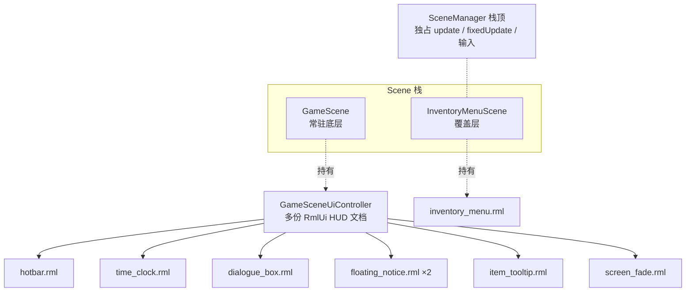
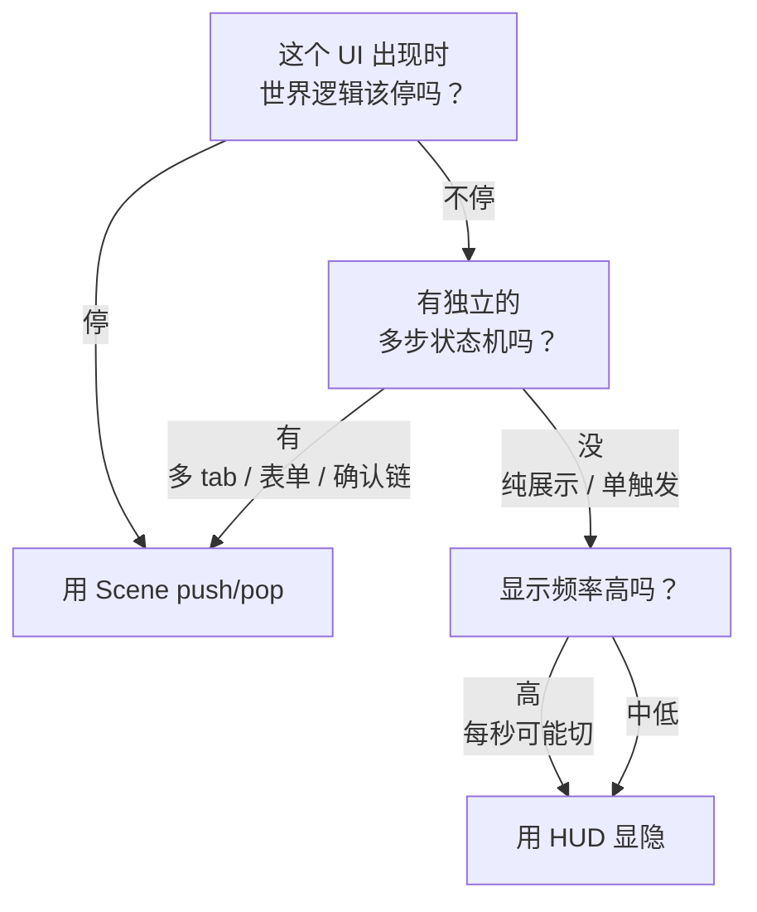
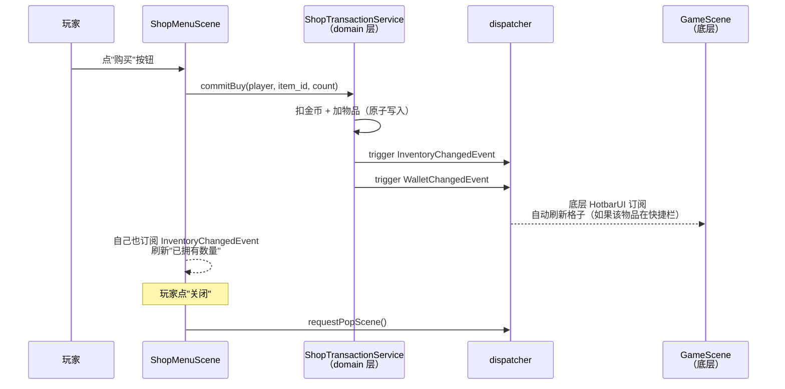

# L04 HUD 与覆盖式 UI 场景的生命周期

L03 我们把 RmlUi 接入到了项目里。这一讲回答一个紧接着的问题：**RmlUi 文档不会自己出现在屏幕上**——它必须被某个 C++ 对象 `load()` 出来、`unload()` 回去。那么"长在屏幕上的所有 UI"分别归谁管？

打开 TinyFarmRPG 玩一会儿，你会看到至少两种截然不同的 UI 形态：

- **常驻 HUD**：左下角的快捷栏、右上角的时钟、底部对话气泡、屏幕中央的提示文字——它们**始终都在**，玩家做什么都不打断。
- **覆盖式弹出**：按 ESC 出来的暂停菜单、按 I 出来的背包、走到商人面前打开的商店——它们**会盖住游戏**，关上之后世界才继续。

这两种形态用了**两套完全不同的机制**：HUD 是 `GameScene` 内部组合的多份独立 RmlUi 文档；覆盖式弹出是 `SceneManager` 栈上的独立 `Scene`。本讲讲清楚它们的边界、什么时候用哪种，以及它们怎么协作。

---

## 🎯 本讲目标

读完之后，你应该能回答：

1. HUD 文档与覆盖式 Scene 的"显隐成本"差在哪？什么时候该用哪种？
2. 打开 `InventoryMenu` 时，`GameScene` 的 `update` 是被暂停还是继续？为什么？
3. `DialogueChoice` 为什么是一个独立 Scene 而不是常驻 HUD？
4. 战斗场景为什么会**隐藏**底层 HUD，而暂停菜单却**保留**它？

---

## 👁️ 先看再讲：在调试面板里看一次 push

跑起来 TinyFarmRPG 进入主世界，然后按下面的顺序操作：

1. 注意 HUD：快捷栏、时钟、提示条都在屏幕边缘显示。
2. 按 `Esc` 打开暂停菜单——**注意 HUD 还在**，暂停菜单半透明叠在上面。
3. 按 `I` 打开背包菜单（或按对应键）——**HUD 依然在**。
4. 找一个剧情战入口让战斗开始——**HUD 整套消失了**，只剩战斗界面。

这就是本讲要解释的现象：**有的覆盖式场景会保留底层 HUD，有的会隐藏**。背后是 `uiCoverage()` 这个一行接口的策略决定。

---

## 🗺️ 关键链路



关键约定：

- **栈顶 Scene 独占 `update` / `fixedUpdate` / 输入**——底层 `GameScene` 在打开覆盖式菜单时被"冻结"。
- **HUD 文档归属底层 `GameScene`**，它的"显隐"由 `uiCoverage()` 决定，**不**随栈顶 Scene 的生命周期销毁。
- **覆盖式 Scene 自己持有自己的 RmlUi 文档**，进入时 `load`、退出时 `unload`。

---

## 💡 核心知识点

### 1. HUD 是 "Scene 内部的多份文档"，不是 Scene

打开 [`src/game/ui/game_scene_ui_controller.h`](../../src/game/ui/game_scene_ui_controller.h)：

```cpp
class GameSceneUiController final {
    // ... ctor / init / update / clean ...

    std::unique_ptr<HotbarUI> hotbar_ui_;
    std::unique_ptr<DialogueBoxView> dialogue_box_;
    std::unique_ptr<DialoguePresentationController> dialogue_controller_;
    std::array<std::unique_ptr<FloatingNoticeView>, 2> floating_notices_;
    std::unique_ptr<ItemTooltipUI> item_tooltip_ui_;
    std::unique_ptr<TimeClockHud> time_clock_hud_;
    std::unique_ptr<RmlScreenFade> rml_screen_fade_;
    // ...
};
```

**`GameSceneUiController` 是 `GameScene` 的成员**，里面挂了 **7 个独立的 HUD 控件**——每个控件**持有一份**自己的 RmlUi 文档，全部用同一个 `owner_scene_id`（`GameScene::instanceId()`）。

关键点：**HUD 不是单独的 Scene**。它们就是"`GameScene` 入场时一次性 `load` 出来的 7 份文档"。退场时由 `RmlUiRuntime::unloadDocumentsByOwner(scene_id)` 一次性回收，完全不需要每个 HUD 写自己的 cleanup。

> **回顾 L03 的 `owner_scene_id`**：它不是"单文档槽位"而是"归属分组标签"——HUD 这种"一个 Scene 同时挂多份"的形态，正是 `owner_scene_id` 设计的核心用途。

### 2. HUD 元素全景

打开 [`ui/rmlui/hud/`](../../ui/rmlui/hud)：

| 文档 | C++ 控制器 | 职责 |
| --- | --- | --- |
| [`hotbar.rml`](../../ui/rmlui/hud/hotbar.rml) | `HotbarUI` | 玩家快捷栏槽位、当前激活高亮 |
| [`time_clock.rml`](../../ui/rmlui/hud/time_clock.rml) | `TimeClockHud` | 右上角昼夜时钟，秒针随 `GameTime` 跑 |
| [`dialogue_box.rml`](../../ui/rmlui/hud/dialogue_box.rml) | `DialogueBoxView` + `DialoguePresentationController` | NPC 对白底部固定栏，逐字打字效果 |
| [`floating_notice.rml`](../../ui/rmlui/hud/floating_notice.rml) | `FloatingNoticeView` ×2 | 世界锚点浮动提示（"已拾取"、"任务进度+1"等），同时挂 2 份避免冲突 |
| [`item_tooltip.rml`](../../ui/rmlui/hud/item_tooltip.rml) | `ItemTooltipUI` | 悬停物品时的描述气泡，定位跟随鼠标 |
| [`game_input_prompt_overlay.rml`](../../ui/rmlui/hud/game_input_prompt_overlay.rml) | overlay prompt bar（在 controller 内直接管） | "[E] 互动 [Esc] 暂停"这类操作提示条 |
| [`overlay/screen_fade.rml`](../../ui/rmlui/overlay/screen_fade.rml) | `RmlScreenFade` | 切图时的淡入淡出黑屏 |

**这些控件全部在 `GameScene::initUI()` 里一次性创建**，它们之间没有从属关系——`HotbarUI` 不知道 `TimeClockHud` 的存在。彼此独立的好处：哪个出了 bug 单独排查，加新 HUD 只是再 `make_unique` 一个。

### 3. 覆盖式 Scene 全景

`SceneManager` 栈上压的 **覆盖式 Scene** 大约有 10 个：

| Scene | RML | 触发方式 |
| --- | --- | --- |
| `PauseMenuScene` | [`pause_menu.rml`](../../ui/rmlui/scenes/pause_menu.rml) | 按 ESC |
| `SaveSlotSelectScene` | [`save_slot_select.rml`](../../ui/rmlui/scenes/save_slot_select.rml) | 暂停菜单 → 保存 |
| `InventoryMenuScene` | [`inventory_menu.rml`](../../ui/rmlui/scenes/inventory_menu.rml) | 按 I（多 tab：背包 / 角色 / 装备 / 任务 / 地图 / 选项） |
| `ShopMenuScene` | [`shop_menu.rml`](../../ui/rmlui/scenes/shop_menu.rml) | 走到商人 NPC + 互动 |
| `QuestOfferScene` | [`quest_offer.rml`](../../ui/rmlui/scenes/quest_offer.rml) | 任务 NPC 接取确认 |
| `RecruitOfferScene` | [`recruit_offer.rml`](../../ui/rmlui/scenes/recruit_offer.rml) | 招募 NPC 入队确认 |
| `DialogueChoiceScene` | [`dialogue_choice.rml`](../../ui/rmlui/scenes/dialogue_choice.rml) | 对白中遇到多选项 |
| `RestDialogScene` | [`rest_dialog.rml`](../../ui/rmlui/scenes/rest_dialog.rml) | 互动床 / 旅馆 |
| `AppearanceCustomizeScene` | [`appearance_customize.rml`](../../ui/rmlui/scenes/appearance_customize.rml) | 衣柜互动换装 |
| `BattleScene` | [`battle.rml`](../../ui/rmlui/scenes/battle.rml) | 遭遇敌人 / 剧情战入口 |

**每个覆盖式 Scene 都是一个完整的 `engine::scene::Scene` 子类**——有自己的 `init` / `update` / `clean`、有自己的 `entt::registry`、有自己的 `RmlDocumentController`、退出时通过 `requestPopScene()` 让 `SceneManager` 把自己弹掉。

### 4. `uiCoverage()`：栈顶决定底层 HUD 是否可见

`SceneUiCoverage` 是个一行 enum：

```cpp
enum class SceneUiCoverage : std::uint8_t {
    Overlay,                // 默认：保留底层 Scene 的 UI 可见
    HideUnderlyingSceneUi   // 全屏：隐藏底层 Scene 的 UI
};
```

每个 Scene 在 `uiCoverage()` 中声明自己的策略：

| Scene | 策略 | 为什么 |
| --- | --- | --- |
| `PauseMenuScene` | `Overlay`（默认） | 暂停菜单只是"叠加一层菜单"，玩家应该能看到自己暂停时的世界画面与 HUD |
| `InventoryMenuScene` | `Overlay`（默认） | 玩家打开背包时，仍能瞥见时钟、对话条等 |
| `BattleScene` | `HideUnderlyingSceneUi` | 战斗界面要独占视觉焦点，HUD（hotbar / clock / 浮动提示）必须隐藏 |
| `DialogueChoiceScene` | `HideUnderlyingSceneUi` | 选项弹窗本身有 modal 背板，HUD 露出来会乱 |
| `QuestOfferScene` / `RecruitOfferScene` | `HideUnderlyingSceneUi` | 同上，进入时是全屏 modal 风格 |
| `AppearanceCustomizeScene` | `HideUnderlyingSceneUi` | 换装界面要看预览，HUD 是干扰 |

实现细节在 [`scene_manager.cpp::syncRmlActiveScene`](../../src/engine/scene/scene_manager.cpp)：

```cpp
// 从栈顶往下找第一个 HideUnderlyingSceneUi 的 Scene
// 那个 Scene 以及它之上的 Scene 的文档可见，更底层的 owner 文档全部隐藏
for (size_t i = stack.size(); i > 0; --i) {
    if (stack[i-1]->uiCoverage() == SceneUiCoverage::HideUnderlyingSceneUi) {
        first_visible_index = i - 1;
        break;
    }
}
```

**`RmlUiRuntime::setVisibleSceneOwners()` 接收这个列表后，按 `owner_scene_id` 批量切换文档可见性**。HUD 不需要被销毁——只是被设为 invisible，开战后回到主世界再变可见。**显隐成本 ≈ 一次 `display` 属性切换**，远低于"销毁文档 / 重建文档"。

### 5. 栈顶独占 update，底层"冻结"

`SceneManager` 对栈的调度规则：

| 接口 | 谁被调用 |
| --- | --- |
| `fixedUpdate()` | 仅栈顶 |
| `update()` | 仅栈顶 |
| `prepareUi()` | 仅栈顶（被覆盖场景传入 `alpha=1.0` 保证 retained UI 不重复插值） |
| `render()` | 整栈（从底到顶叠加） |

这条规则的**直接后果**：

- 玩家按 ESC 打开 `PauseMenuScene`，`GameScene::update` **停止被调用**——农场里的作物不再生长、NPC 不再走动、时间不再前进。
- 暂停菜单本身可以正常 update（动画、按钮 hover）。
- 关闭暂停菜单后 `GameScene` 重新成为栈顶，update 立刻恢复，无缝衔接。

**这就是 Scene 栈相对于"显隐文档"的核心价值**——它**冻结**底层逻辑，而不仅仅是隐藏画面。

### 6. 显隐 vs Scene push/pop 的取舍

知道了两种机制，剩下的就是判断"什么用哪种"。

| 维度 | HUD 显隐切换 | Scene push/pop |
| --- | --- | --- |
| **生命周期成本** | 极低（一次 `display` 切换） | 高（init / clean、文档 load / unload、registry 隔离） |
| **底层是否冻结** | 否（底层 Scene 继续 update） | 是（栈顶独占 update） |
| **状态隔离** | 共享 `GameScene::registry` | 独立 `registry`，独立 `RmlDocumentController` |
| **输入独占** | 否（仍是 `Gameplay` context） | 是（通常 `pushContext(Menu)`） |
| **典型场景** | hotbar、tooltip、对话气泡、提示条 | 暂停菜单、背包、商店、战斗 |

**判断准则**（按优先级）：



具体例子帮助决策：

- ✅ **Tooltip 用 HUD**：玩家鼠标过物品图标的瞬间就要显示，关掉也要立刻——频率高、世界不该停。
- ✅ **背包菜单用 Scene**：玩家打开后会停下来看半分钟、做多步操作（拖、换装、丢弃）——必须冻结世界、必须独占输入。
- ✅ **对话气泡用 HUD**：NPC 说话的时候玩家还能走动看四周（虽然实际操作受限，但表现层不停）。
- ✅ **对话**选项**`DialogueChoiceScene` 用 Scene**：选项是确认链、有 `:focus` 焦点管理、必须独占输入——所以独立成 Scene。**这是为什么对话气泡（展示）与对话选项（交互）分了两套机制**。

### 7. 覆盖式 Scene 怎么"写回"主世界

覆盖式 Scene 不能直接修改主世界的状态——它们的 `registry` 是独立的。**唯一通道是 `dispatcher` 事件**。

典型流程（以"商店买物品"为例）：



**几个关键约定**：

- **覆盖式 Scene 不直接改 `GameScene::registry`** 中的组件——所有写入走 domain service。
- **关闭自己用 `requestPopScene()`**——内部 trigger `PopSceneEvent`，由 `SceneManager` 在 update 末尾统一落地，避免在 update 中途改栈。
- **写回主世界全部走 event**——这条规则在 L02 已经讲过，覆盖式 Scene 是这条规则最大的受益者。

### 8. `GameMode` 在背后协同（详深留 L25）

你可能注意到 `BattleScene` 进入时不仅切了 UI 可见性、push 了输入上下文，**底层的 `GameScene::fixedUpdate` 行为也变了**——`SystemScheduler` 跳过了 farm / NPC wander / 一些 gameplay 系统，但保留了 audio / animation 等帧表现系统。

这是 `GameMode`（Exploration / Battle / Menu）在背后协同。它由 `SystemScheduler` 在固定步开始前查询，决定**栈顶 Scene 是哪种模式 → 哪些系统该跑**。

> 本讲只标记它的存在。**详深留 L25 SystemScheduler 与并行岛**——那一讲会把 `GameMode` / `SchedulerStage` / transition gate 完整收口。

---

## 📋 阅读清单

| 顺序 | 文件 / 章节 | 关注点 |
| :---: | --- | --- |
| 1 | [`docs/game/ui-scenes.md`](../../docs/game/ui-scenes.md) | UI 资源目录约定、覆盖式 Scene 列表、生命周期模板 |
| 2 | [`docs/engine/scenes.md`](../../docs/engine/scenes.md) | Scene 栈调度规则、pending action、`uiCoverage` 语义 |
| 3 | 上一期 [part-07 场景系统](../ref/OpenGL与迷你农场/07-场景系统.md) | Scene 栈的基础（push / pop / replace） |
| 4 | 上一期 [part-29 物品栏与快捷栏](../ref/OpenGL与迷你农场/29-物品栏与快捷栏.md) | HotbarUI 作为常驻 HUD 的原型 |
| 5 | **RmlUi 子教程**：[L09 spritesheet](../../learn/lectures/rmlui/) | HUD 大量用九宫格背景；提前过一遍语法 |

---

## 🔑 源码入口

| 顺序 | 文件 | 你会看到什么 |
| :---: | --- | --- |
| 1 | [`src/engine/scene/scene.h`](../../src/engine/scene/scene.h)（`SceneUiCoverage` 与 `uiCoverage()`） | 两行 enum + 一个虚函数——整套覆盖策略的总开关 |
| 2 | [`src/engine/scene/scene_manager.cpp`](../../src/engine/scene/scene_manager.cpp)（`syncRmlActiveScene`） | 从栈顶向下找第一个 `HideUnderlyingSceneUi`，决定 visible owners 列表 |
| 3 | [`src/game/ui/game_scene_ui_controller.h`](../../src/game/ui/game_scene_ui_controller.h) | **HUD 全景**：一个 controller 持有 7 个独立 HUD 控件 |
| 4 | [`src/game/scene/pause_menu_scene.cpp`](../../src/game/scene/pause_menu_scene.cpp) | 最简覆盖式 Scene 模板：attach controller → load → bind event → pop |
| 5 | [`src/game/scene/inventory_menu_scene.cpp`](../../src/game/scene/inventory_menu_scene.cpp)（`pushContext(Menu)`） | 复杂覆盖式 Scene 样例：tab 架构 + 多 view model |
| 6 | [`src/game/scene/dialogue_choice_scene.cpp`](../../src/game/scene/dialogue_choice_scene.cpp)（`uiCoverage` 返回 `HideUnderlyingSceneUi`） | 与对话气泡（HUD）形成对比的"对话选项独立 Scene"案例 |

---

## ❓ 自测问题

1. **生命周期成本**：玩家在主世界 5 秒内反复打开 / 关闭背包 10 次。如果背包是 HUD 显隐、如果是 Scene push/pop，分别会发生多少次"文档 load / unload"？哪种更便宜？
2. **栈顶冻结**：打开 `InventoryMenuScene` 时，下列功能各是停止还是继续？为什么？
   - 农场作物生长
   - 角色头顶气泡的"逐字打字"动画
   - HUD 时钟指针走动
   - HUD 屏幕淡入淡出（`RmlScreenFade`）
3. **DialogueChoice 独立成 Scene 的理由**：为什么"NPC 说话"是 HUD 而"NPC 让你选回答"是独立 Scene？至少给出两个理由。
4. **`uiCoverage` 决策**：假设要新增一个"剧情过场动画 Scene"，全屏黑边 + 字幕，玩家可以按空格跳过。你会让它返回 `Overlay` 还是 `HideUnderlyingSceneUi`？为什么？
5. **隐藏的输入边界**：覆盖式 Scene 在 `init` 时通常会 `pushContext(InputContextId::Menu)`，退出时 `popContext()`。如果某个新 Scene 忘了 push，会出什么问题？（提示：玩家按 WASD 会发生什么）

---

## 🧪 最小练习

**目标**：直观对比"HUD 显隐切换"与"Scene push/pop"的代码量和延迟。

操作步骤：

1. **方案 A（HUD 显隐）**：在 [`GameSceneUiController`](../../src/game/ui/game_scene_ui_controller.h) 里参照 `floating_notice` 模式临时加一个新 `FloatingNoticeView`，绑定到一个按键（例如 F8）调用 `setText("debug label")` + `setVisible(true)`，再按一次设回 `false`。
2. **方案 B（Scene push/pop）**：写一个最简的 `DebugLabelScene`（参考 `pause_menu_scene` 模板）——`init` 时 `load` 一份 RML 显示一句话，按 ESC 自己 `requestPopScene()` 关掉。
3. **对比**：方案 A 改了几个文件、几行代码？方案 B 改了几个文件、几行代码？哪个反应快？哪个能让 `GameScene::update` 暂停？
4. **完成后回答**：如果这个 debug label 需要"显示一个可编辑文本框 + 提交按钮"，应该选 A 还是 B？

> 练习不强求合入主分支，做完后可以撤销改动。重点是用手感建立"何时该用哪种"的直觉。

---

## 📌 小结

- HUD 文档是 `GameScene` 内部一次性 `load` 的多份 RmlUi 文档，**通过 `owner_scene_id` 分组、随 Scene 入退场统一回收**。
- 覆盖式 Scene 是 `SceneManager` 栈上的独立 `Scene` 子类，**有自己的 registry、自己的输入上下文、自己的 RmlDocumentController**。
- 栈顶 Scene 独占 `update` / `fixedUpdate` / 输入——**底层 `GameScene` 在覆盖时会被冻结**。
- `uiCoverage()` 是一行接口的策略开关：`Overlay`（默认）保留底层 HUD 可见、`HideUnderlyingSceneUi` 隐藏底层 HUD（战斗、对话选项、招募确认走这种）。
- 选择规则：**世界逻辑该停 / 状态机复杂 / 频率不高 → Scene；纯展示 / 频率高 / 不影响逻辑 → HUD**。
- 覆盖式 Scene 不直接改主世界状态，**所有写回走 dispatcher 事件 + domain service**。
- `GameMode`（Exploration / Battle / Menu）在背后协同 SystemScheduler 跳过 / 启用特定系统，详深留 L25。

## 🚀 下节课预告

UI 形态讲完，下一讲（**L05 输入上下文与菜单导航**）回到"玩家怎么操控这些 UI"。Gameplay / Menu / Dialogue / Battle 四种输入上下文如何切换？为什么菜单导航不直接依赖 RmlUi 原生方向键？输入 glyph 是怎么和重绑定联动的？这是 UI 层最后一个、也是最容易被忽视的工程话题。
