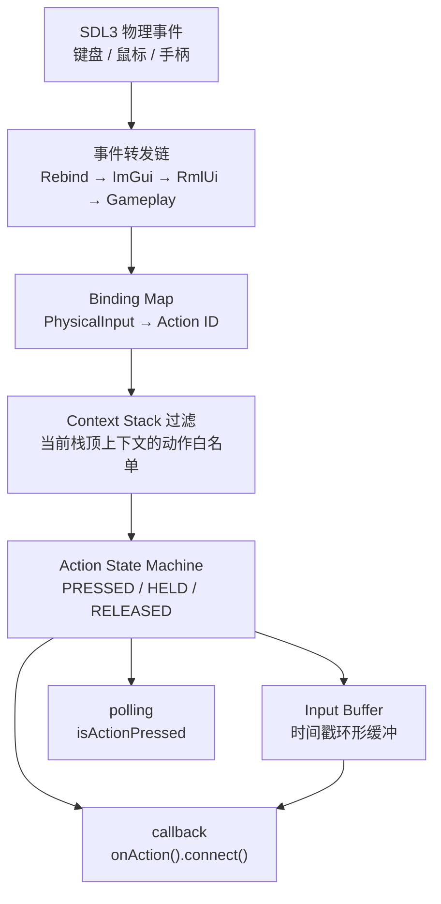
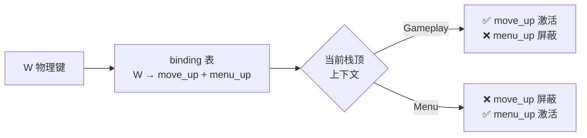
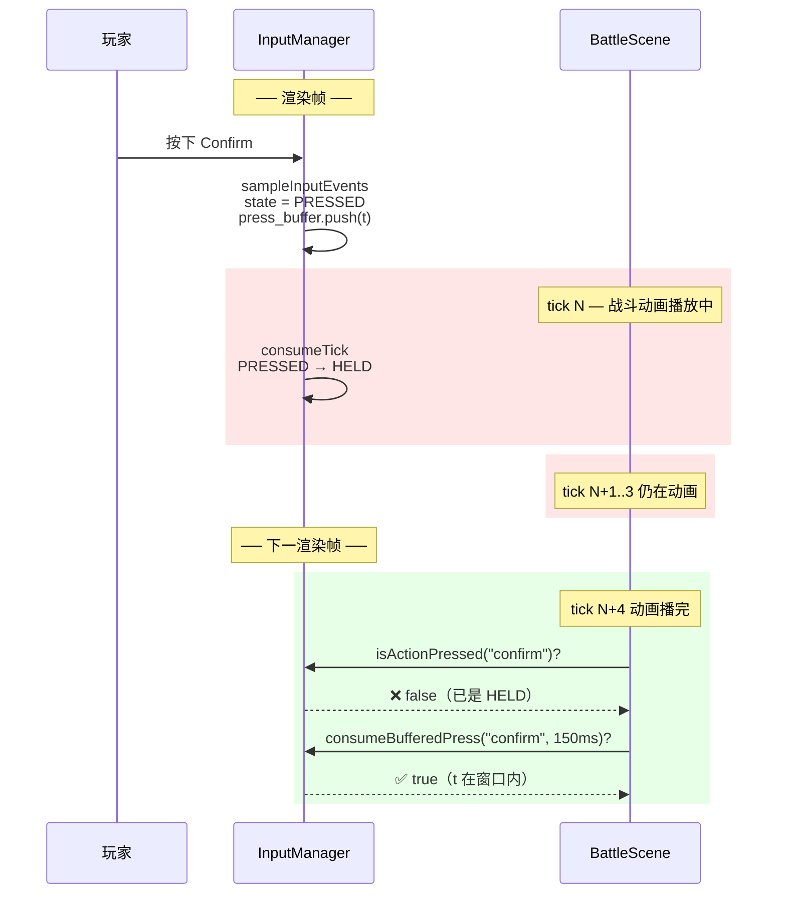
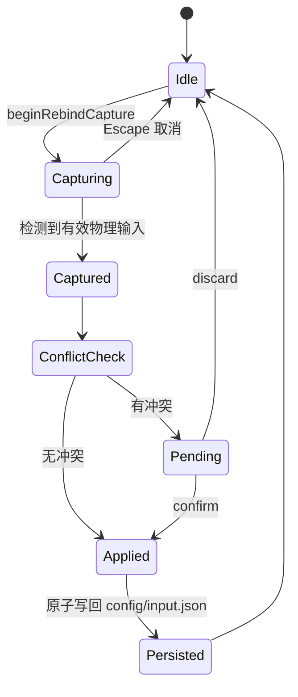
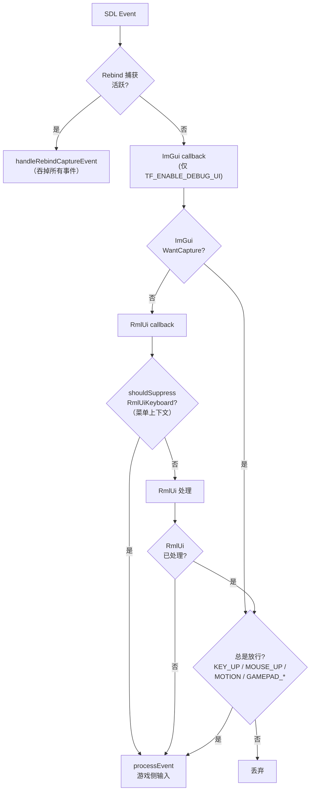
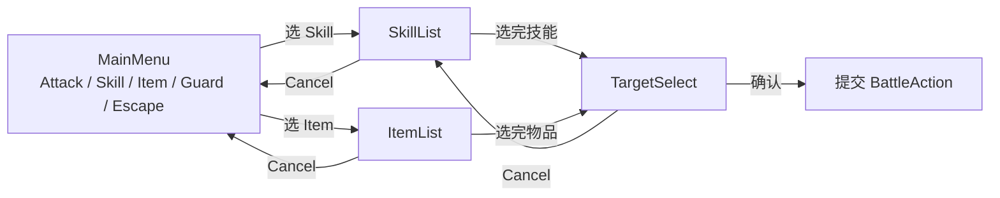

# L05 输入上下文与菜单导航

L04 把 UI 形态拆成"常驻 HUD + 覆盖式 Scene"两套机制。这一讲回到玩家这一端：**当玩家按下方向键，谁应该响应？**

听起来像废话。但真到了 TinyFarmRPG 这个量级，"谁响应方向键"会同时有 4 个候选者：

- 主世界——玩家走路
- 暂停菜单——上下选择菜单项
- 对白选项——左右切选项
- 战斗菜单——上下切技能、左右切目标

**这 4 个候选者不能同时响应**——否则玩家走两步路就会被打开的菜单截走焦点。本讲讲清楚 TinyFarmRPG 怎么用**输入上下文栈**仲裁出"当前该谁吃这个按键"，以及围绕这套机制的几个工程细节：输入缓冲、重绑定、glyph 提示、与 RmlUi / ImGui 的转发顺序。

> **新增的复杂度全部来自 JRPG 玩法**。上一期 TinyFarm 输入需求很简单，连"按一次进菜单暂停"都很少冲突。所以本讲会反复用"上一期没遇到这个问题"作为对照。

---

## 🎯 本讲目标

读完之后，你应该能回答：

1. 打开 `InventoryMenu` 时，方向键应该被谁消费？输入上下文栈是怎么仲裁的？
2. 输入缓冲（Input Buffer）解决的是哪个具体痛点？为什么不能简单"按下时立即处理"？
3. 重绑定按键时，HUD 上的 glyph 图标是怎么自动跟着变的？
4. 为什么战斗菜单要写自己的 `BattleInputRouter`，而不直接靠 RmlUi 的原生方向键导航？

---

## 👁️ 先看再讲：在调试面板里看一次输入

按 `F5` 打开 ImGui 调试面板，进入 `Engine Debug Panels → Input`。然后操作：

1. **不打开任何菜单**，按一下 W——观察面板：`move_up` 与 `menu_up` 各自的状态。两个都在 `PRESSED`。
2. **按 ESC 打开暂停菜单**，再按 W——观察：`move_up` 这次是 `INACTIVE`！只有 `menu_up` 触发。
3. **关闭暂停菜单**回到主世界，再按 W——`move_up` 重新激活，`menu_up` 又被屏蔽。

这就是**输入上下文**在工作——同一个物理 W 键，根据栈顶 Scene 是谁，被翻译成不同的动作语义。

---

## 🗺️ 关键链路



记住一句话：**物理事件 → 动作语义 → 上下文过滤 → 状态机 → 上层消费**。

---

## 💡 核心知识点

### 1. 为什么 TinyFarm 的输入方案在 RPG 场景下不够用

上一期 [part-15 输入系统](../ref/OpenGL与迷你农场/15-输入系统.md) 已经讲过基础：

- `InputManager` 把 SDL 事件翻成 `Action` 状态（PRESSED / HELD / RELEASED / INACTIVE）。
- 配置驱动的按键映射（`config/input.json`）。
- logical mouse 坐标（与 UI letterbox 一致）。

**这套基础在 TinyFarmRPG 完整保留**。本讲讲的所有新东西，都是在它之上加的扩展。

但 RPG 玩法立刻提出了 4 个新问题：

| 新问题 | 上一期遇到吗 | 本讲怎么解 |
| --- | --- | --- |
| W 同时绑 "走路上" 和 "菜单上"——打开菜单后 W 应该走路还是选菜单？ | 没（只有简单暂停菜单） | **输入上下文栈** |
| 战斗动画播放中玩家按了确认——动画结束后能记住吗？ | 没（无回合制战斗） | **Input Buffer** |
| 玩家不喜欢 WASD 想改成方向键——能在游戏里改吗？ | 没 | **Rebind 系统** |
| HUD 上提示 "[E] 互动"——玩家改了 E 键怎么自动更新？切手柄又怎么变图标？ | 没（没 prompt） | **Action Prompt / Glyph** |

接下来逐一拆开。

### 2. 输入上下文栈：动作白名单

打开 [`input_manager.h`](../../src/engine/input/input_manager.h)，会看到一个极小的 enum：

```cpp
enum class InputContextId : std::uint8_t {
    Gameplay,
    Menu,
    Dialogue,
    Battle
};
```

每个 Scene 在 `init()` 时 push 一个上下文，`clean()` 时 pop。约定如下：

| 上下文 | 允许的动作子集 | 谁 push |
| --- | --- | --- |
| `Gameplay` | 移动、primary/secondary action、interact、pause、inventory、hotbar 1-10、prev/next、camera_reset_zoom ... | `GameScene` |
| `Menu` | menu_left / right / up / down、menu_confirm、menu_cancel | `TitleScene` / `PauseMenuScene` / `SaveSlotSelectScene` / `InventoryMenuScene` / `ShopMenuScene` / `RestDialogScene` ... |
| `Dialogue` | 同 Menu | `DialogueChoiceScene` |
| `Battle` | 同 Menu | `BattleScene` |

> **`Menu / Dialogue / Battle` 的允许动作目前相同**，分开命名是为了将来能在不同上下文应用不同输入缓冲、重复策略、行为细节——已经独立成 enum 就不用以后再拆。

**仲裁机制**：



注意 `config/input.json` 里 W 被映射到 **两个** 不同的动作：

```json
"move_up": ["W", "Up", "GamepadDpadUp", "LeftStickUp"],
"menu_up": ["W", "Up", "GamepadDpadUp", "LeftStickUp"]
```

这不是冗余——它让"同一组物理键在不同上下文表达不同语义"成为可能。上下文栈过滤掉不在白名单的动作，整套机制对调用方完全透明。

**push/pop 还顺手做了一件事**：每次切换都会调用 `clearAllInputState()` 清空所有动作状态。**这是为了防止"按住 W 进入菜单 → 在菜单里 W 仍是 HELD 一直触发 menu_up"的卡键 bug**。

### 3. Input Buffer：让"刚好差一帧"的按键不被吞

打开 [`input_buffer.h`](../../src/engine/input/input_buffer.h)——一个 8 槽的环形缓冲。每次动作进入 `PRESSED` 时记录一个时间戳。

**为什么需要它？** 答案在三阶段更新的时序：



**核心矛盾**：`PRESSED` 状态只在 **第一个 fixed tick** 里可见，之后被 `consumeTick()` 推进成 `HELD`。如果系统当前正忙于动画 / 过场 / 状态切换，**真正能"接收"输入的那一 tick 时机已经错过**。

Input Buffer 用一个**时间窗口**解决这个问题：

```cpp
// 大多数场景用 consume（消费后同一次按下不会被重复读取）
if (input_manager.consumeBufferedPress(kConfirmId, 150 /*ms*/)) {
    // 处理玩家"刚才"按下的确认键
}

// 多个系统需要共同检查时用 peek（不消耗记录）
if (input_manager.peekBufferedPress(kConfirmId, 150)) { ... }
```

> **典型用途**：战斗中确认选技能（玩家可能在动画播完前按）、菜单快速连按、对话推进、QTE 时机。**这种"我明明按了但没反应"的体验问题，几乎全部能用 Input Buffer 解决**。

### 4. Action Prompt 与 Glyph：HUD 提示自动跟着按键走

玩家看到屏幕底部 "[E] 互动 [Esc] 暂停" 这种提示，**底下藏着两条解耦逻辑**：

- 提示**该不该显示** 由游戏逻辑决定（站在 NPC 旁边才显示 "[E] 互动"）。
- 提示**显示什么键** 由 `InputManager::getActionPrompt(action_id)` 决定。

```cpp
struct ActionPrompt {
    InputDevice device;       // Keyboard / Mouse / Gamepad
    std::string token;        // "E", "GamepadSouth"
    std::string icon_id;      // "key_e", "gamepad_a"（图标 ID）
    std::string fallback_text;// 无图标时的回退文本
};
```

`getActionPrompt` 自动按 `last_input_device_` 选择：

- 玩家上一次用键盘 → 返回 `key_e` 图标 + "E" 文本。
- 玩家上一次用手柄 → 返回 `gamepad_a` 图标 + "A" 文本。

**HUD 不需要知道当前是哪种设备**——它每帧调一次 `getActionPrompt(kInteractId)`，拿到当前合适的描述，丢给 RmlUi 的 `data-text` 即可。在 TinyFarmRPG 里实现这件事的就是 [`game_input_prompt_overlay.rml`](../../ui/rmlui/hud/game_input_prompt_overlay.rml) + [`GameInputPromptOverlay`](../../src/game/ui/game_input_prompt_overlay.cpp) 控制器。

> **重绑定零适配**：玩家把 `interact` 从 E 改成 F，`getActionPrompt` 下一次查询就直接返回 F——HUD glyph 全自动跟着变，C++ 没有任何"通知 UI 重绑定了"的代码。

### 5. Rebind：原子写回 + 冲突检测

`InputManager::beginRebindCapture(action_id, slot)` 启动一次重绑：



工程关键点：

- **捕获期间所有 SDL 事件被路由到 `handleRebindCaptureEvent()`**，**阻断正常动作分发 + 阻断 ImGui / RmlUi 转发**。否则玩家按"空格"想重绑，结果触发了按钮的 `data-event-click`。
- **冲突检测**：如果新键已被别的动作占用，记录 `PendingRebindConflict`，UI 弹确认窗"是否覆盖原绑定？"
- **原子持久化**：`persistBindings()` 用"临时文件 + rename" 写回 `config/input.json`，失败时从备份恢复。**断电不会留半个文件**。

### 6. 事件转发顺序：Rebind → ImGui → RmlUi → Gameplay

这是 TinyFarmRPG 输入系统**最容易踩坑的地方**。来看完整的流程图：



几条核心规则：

- **Rebind 捕获优先级最高**。捕获期间所有事件都被吞——保护玩家"在 UI 上按按钮想绑空格"不会触发误点击。
- **ImGui 拿走调试键盘**。调试输入框里打字时，键盘事件不会被翻译成 `Action`——这就是"调试 UI 打字时角色不会乱跑"的原理。
- **RmlUi 在菜单上下文有特殊抑制**：绑定到 `menu_*` 的扫描码会被 `shouldSuppressRmlUiKeyboardEvent()` 拦截，**不转发给 RmlUi**——防止"按 W 同时触发 menu_up 和 RmlUi 焦点切换"的双重处理。
- **某些事件总是放行**：`KEY_UP` / `MOUSE_UP` / `MOTION` / `GAMEPAD_*`——即使上游声称已处理，也要继续传给游戏侧，防止"松手没收到 RELEASED"导致动作卡在 HELD。

### 7. 为什么战斗菜单不依赖 RmlUi 原生方向键导航

RmlUi 自带键盘 `Tab`/方向键焦点切换。理论上 BattleScene 可以直接靠它——但 TinyFarmRPG 写了自己的 [`BattleInputRouter`](../../src/game/scene/battle_input_router.cpp)。

这是为什么？

```cpp
class BattleInputRouter::Delegate {
public:
    virtual BattleMenuState battleMenuState() const = 0;
    virtual bool moveBattleMenuCursor(int delta) = 0;
    virtual bool confirmBattleMenu() = 0;
    virtual bool cancelBattleMenu() = 0;
};
```

理由是**战斗菜单不是单层 hover list**——它是 4 层状态机：



**问题点**：

- **多步状态机**：每一步都需要 "记住上一步的选择 + 当前 cursor 位置 + cancel 回退一层" 的语义。RmlUi 焦点系统只管"当前 element"，没有"上一层是 SkillList、按 Cancel 该回 MainMenu"的概念。
- **cursor memory**：玩家上一次选了"火球术"，这回合开始时应该默认聚焦"火球术"而不是列表第一项。这是 JRPG 标配体验，RmlUi 焦点不会自动恢复。
- **方向键 repeat**：玩家长按下方向键，菜单光标应该匀速移动（不是 RmlUi 默认的"一次 down 一次 step"）。`BattleInputRouter` 内部有 `repeat_timer_seconds_` 和 `RepeatDirection` 状态机管这件事。
- **输入缓冲**：动画播放中按确认要被记下来——也只有自己路由才能调 `consumeBufferedPress`。

> **结论**：RmlUi 原生方向键导航对**简单菜单**够用（如标题画面、暂停菜单），但对**多层状态机 + 记忆 + repeat + 缓冲**的战斗菜单不够。所以 TinyFarmRPG 当前阶段把 `menu_*` 动作**抑制给 RmlUi**，由游戏侧自己路由。详深留 **L18 战斗 Action 生成**。

---

## 📋 阅读清单

| 顺序 | 文件 / 章节 | 关注点 |
| :---: | --- | --- |
| 1 | [`docs/engine/input_system.md`](../../docs/engine/input_system.md) | **本讲核心阅读材料**——三阶段更新、Input Buffer、Rebind、转发顺序完整图 |
| 2 | 上一期 [part-15 输入系统](../ref/OpenGL与迷你农场/15-输入系统.md) | TinyFarm 输入系统基础（升级前对照） |
| 3 | [`tests/engine/input/`](../../tests/engine/input) | 9 个测试文件按主题分：context / buffer / glyphs / gamepad / rebind / rmlui_routing |
| 4 | [`tests/game/input_context_scene_stack_test.cpp`](../../tests/game/input_context_scene_stack_test.cpp) | Scene 栈与输入上下文的集成测试 |

---

## 🔑 源码入口

| 顺序 | 文件 | 你会看到什么 |
| :---: | --- | --- |
| 1 | [`src/engine/input/input_manager.h`](../../src/engine/input/input_manager.h) | `pushContext` / `popContext` / `isActionPressed` / `consumeBufferedPress` / `getActionPrompt` 的接口面板 |
| 2 | [`src/engine/input/input_context_registry.h`](../../src/engine/input/input_context_registry.h) | 4 个上下文的允许动作白名单 |
| 3 | [`src/engine/input/input_buffer.h`](../../src/engine/input/input_buffer.h) | 8 槽环形缓冲的极简实现 |
| 4 | [`src/engine/input/input_event_routing.h`](../../src/engine/input/input_event_routing.h) | Rebind → ImGui → RmlUi → Gameplay 的转发顺序代码 |
| 5 | [`config/input.json`](../../config/input.json) | 看 `W` 同时绑到 `move_up` 与 `menu_up` |
| 6 | [`src/game/scene/battle_input_router.h`](../../src/game/scene/battle_input_router.h) | **仅作示例**——多层菜单 + cursor memory + repeat 的对照样本，详深留 L18 |

---

## ❓ 自测问题

1. **上下文仲裁实验**：在主世界按住 W，然后按 ESC 打开暂停菜单——此时角色会不会"继续往上走一秒再停下来"？为什么？（提示：`pushContext` 会做什么副作用？）
2. **Input Buffer 的"窗口长度"**：典型用 100~200ms。如果改成 1 秒会出什么问题？改成 30ms 又会怎样？两种极端的体验代价是什么？
3. **glyph 自动更新**：玩家把 `interact` 从 E 改成 F，HUD 上 "[E] 互动" 是怎么变成 "[F] 互动" 的？整条链路上 C++ 代码动了哪几行？
4. **RmlUi 抑制**：为什么 `KEY_UP` 类事件**总是放行**给游戏侧，即使 RmlUi 声称已处理？反过来如果不放行会出什么 bug？
5. **战斗菜单**：假设你想用 RmlUi 原生方向键导航替换 `BattleInputRouter`。"长按方向键匀速移动光标"这个体验你打算怎么实现？

---

## 🧪 最小练习

**目标**：体验"重绑定 + glyph 自动更新"的端到端链路。

操作步骤：

1. **改 config**：打开 [`config/input.json`](../../config/input.json)，找到 `interact` 动作。
2. **加一个新键**：在 `interact` 的 token 列表里加 `"F"`。
3. **跑起来验证**：进入主世界，按 F 也能触发互动（站在 NPC 前会触发对话）。
4. **看 HUD glyph**：站在可互动对象旁边，观察底部提示条上的 `interact` 图标——它显示的应该仍是 `E`（因为 binding 列表里 E 排在 F 前面，`getActionPrompt` 默认取第一个非手柄 binding）。
5. **改顺序**：把 `"F"` 移到 `interact` token 列表的**第一位**。重启游戏。再去互动——HUD glyph 是否变成 F？
6. **切手柄**：如果有手柄，插上后按一下手柄键。HUD glyph 是否变成手柄图标？

**完成后回答**：从"改 input.json" 到"HUD glyph 显示新图标"，整条链路上**项目代码没动一行**。这是怎么做到的？

---

## 📌 小结

- TinyFarm 的 InputManager 是基础，TinyFarmRPG 在它之上加了 **4 件 RPG 必需扩展**：上下文栈、Input Buffer、Rebind、Action Prompt。
- **输入上下文栈**用动作白名单仲裁"同一物理键在不同 Scene 表达不同语义"，每次 push/pop 自动 `clearAllInputState` 防止卡键。
- **Input Buffer** 用时间戳环形缓冲解决"PRESSED 状态只活一 tick" 的时序问题——动画 / 过场结束后仍能消费玩家"刚才"的输入。
- **Rebind** 提供安全的运行时重绑：捕获期吞掉所有事件、冲突检测、原子写回。
- **Action Prompt + Glyph** 让 HUD 提示自动跟随设备 + 重绑定变化——上层代码完全不感知。
- **事件转发顺序** Rebind → ImGui → RmlUi → Gameplay，每一级都有清晰的"何时放行 / 何时拦截"规则。
- 战斗菜单的多层状态机 + cursor memory + repeat + buffer 超出 RmlUi 原生方向键导航的甜区，所以走自己的 `BattleInputRouter`，详深留 L18。

## 🚀 下节课预告

到此 **Stage II（UI 与输入）完整收尾**。下一讲进入 **Stage III — Lua 内容层**：**L06 Lua 内容层总览**会回答一个反直觉的问题——TinyFarmRPG 大量 NPC 对白、剧情触发、招募对话、地图事件都不是 C++ 写的，而是 Lua 脚本。**为什么不直接写 C++？** Lua 与 C++ 的边界在哪里？`tf.*` API 长什么样？我们下讲见。
