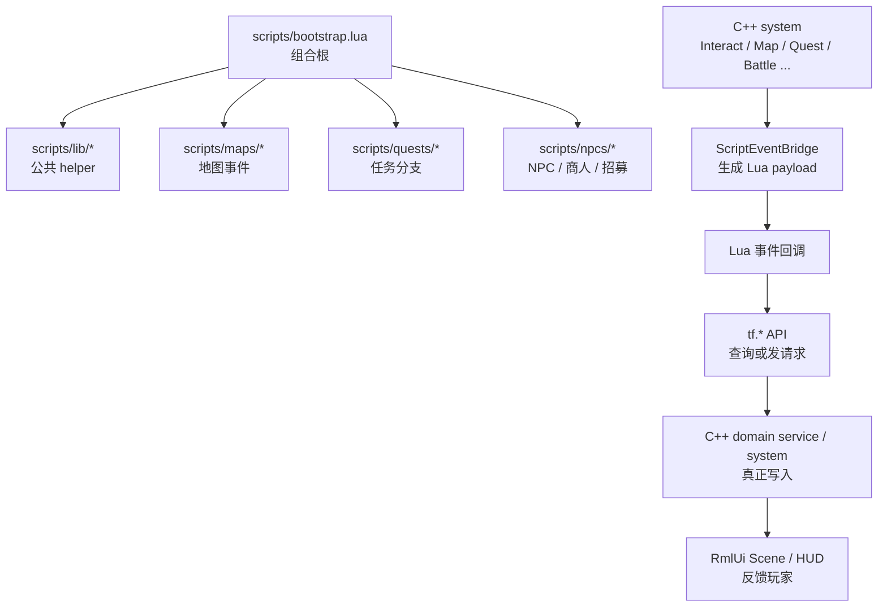
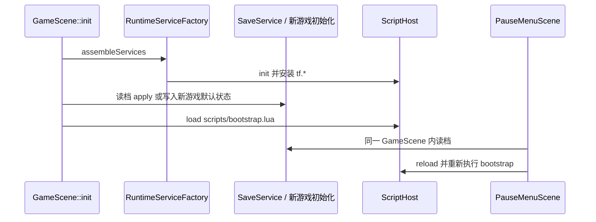
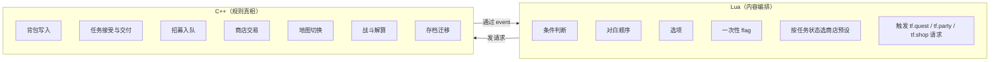

# L06 Lua 内容层总览

到这一讲为止，我们走完了 **Stage I 项目接续** 与 **Stage II UI 与输入**。从本讲开始进入 **Stage III — Lua 内容层**。

你可能会奇怪：**项目都已经有 C++ + ECS + domain service 这套架构了，为什么还要一个 Lua 层？**

直观回答：**因为 C++ 改一句对白要重编译 10 秒**。但更深层的答案，是 TinyFarmRPG 想清晰地把"**规则真相**"与"**内容编排**"分到两个不同抽象层级。

- "拾取物品要不要给经验" 是规则真相——**这种事必须 C++ 守**。
- "村口的老人在第 3 天会说什么、玩家选了 A 选项后给哪种种子、招募小猫之前必须先完成一个任务" 是内容编排——**这种事让 Lua 写**。

本讲讲清楚这条边界，以及围绕它建立的两条核心规约。

> **范围说明**：本讲只讲"Lua 这一层做什么、目录怎么组织、规约是什么"。**C++ 如何用 Sol2 把 API 安全地暴露给 Lua** 留到 L07，**Tiled 与脚本事件桥的接入** 留到 L08。

---

## 🎯 本讲目标

读完之后，你应该能回答：

1. 为什么 `bootstrap.lua` 必须**顶层幂等**？什么样的写法会破坏幂等？
2. `tf.state` 与 Lua module-local 变量在"读档后存活"上有什么差异？
3. 一个新需求"按任务状态决定 NPC 对白"该写 Lua 还是 C++？理由？
4. `tf.*` API 提供了哪些能力？看到 API 列表能不能立刻判断"我的新内容要调哪几个"？

---

## 👁️ 先看再讲：在项目里读一份现成的 NPC 脚本

打开 [`scripts/npcs/greeter.lua`](../../scripts/npcs/greeter.lua)——一个最简单的 NPC，约 30 行：

```lua
local dialogue = tf.script.require("lib.dialogue")

local greeter = {
    actor_id = "npc.greeter",
}

local active = false

tf.event.on("interact", function(evt)
    if evt.dialogue_handled then return end
    if evt.target_actor_id ~= greeter.actor_id and evt.target_name ~= "Greeter" then return end
    if active then return end

    active = true
    if dialogue.start(evt.target, {
        tf.i18n.tr("dialogue.greeter.hi"),
        tf.i18n.tr("dialogue.greeter.bye"),
    }, function() active = false end) then
        evt.dialogue_handled = true
    else
        active = false
    end
end)

return greeter
```

它做了 5 件事：

- 引入 `lib.dialogue` 工具。
- 声明这个 NPC 的稳定身份（`actor_id`）。
- 监听 `interact` 事件，过滤掉不是自己的。
- 通过 `dialogue.start(...)` 推一段两行对白，用 `tf.i18n.tr` 取本地化文案。
- 用 `active` 标志避免重叠触发。

**这就是 Lua 在 TinyFarmRPG 的典型形态——条件判断、调 API、组织内容。没有任何"写背包、改组件、扣血"的逻辑**。

---

## 🗺️ 关键链路



注意箭头方向：**Lua 不直接改状态**。它只**查询**（如 `tf.quest.status`）和**发请求**（如 `tf.command.add_item`），真正的写入仍由 C++ domain service 完成。

还有一个很容易讲错、也最容易制造读档 bug 的时序细节：



也就是说，`bootstrap.lua` 顶层代码看到的是**已经恢复好的存档状态**，或者**已经写入默认值的新游戏状态**。如果玩家在暂停菜单里读档，当前 `GameScene` 不会重建，但 `ScriptHost::reload()` 会清掉旧回调和 module cache，再重新执行 bootstrap。

---

## 💡 核心知识点

### 1. 边界定义：内容编排 vs 规则真相



**判别准则**（按优先级）：

| 你要做的事 | 该写哪里 |
| --- | --- |
| 改背包 / 装备 / 任务状态 / 商店库存 / 角色 HP | **C++**（走 domain service） |
| 把一组对白按"白天 / 晚上 / 雨天"分支 | **Lua** |
| 让某宝箱只能开一次 | **Lua**（`lib.once`） |
| 在"第 3 天 + 完成任务 X" 时让 NPC 说不同的话 | **Lua** |
| 临时生成一套商店库存 | **不允许**——`shops.json` 静态预设里加，Lua 切 `shop_id` |
| 写战斗结算公式 | **C++**（`BattleFormulaEvaluator`） |
| 在战斗胜利后播一段剧情 | **Lua**（`tf.event.on("battle_ended", ...)` 或 `lib.event.on_battle_end`） |
| 玩家踩到某 tile 触发一段对白 | **Lua**（`zone_enter` 事件） |

简记：**写状态、解算规则 → C++；编排顺序、选择路径 → Lua**。

### 2. 为什么不直接用 C++

下面是几个具体场景，说明同一个需求在 Lua 和 C++ 里的体验差异：

#### 场景 A：改一句 NPC 台词

| 路径 | 操作 |
| --- | --- |
| C++ | 改 `dialogue_script.json` 或 source code → 重编 game_lib → 重启游戏 → 测试 |
| Lua | 改 `scripts/npcs/greeter.lua` → 重启游戏 → 测试（**部分情况下甚至不用重启**） |

#### 场景 B：让 NPC 在完成 X 任务后多说一句

| 路径 | 工作量 |
| --- | --- |
| C++ | 在某 system 里加 `if (questLog.isCompleted(quest_id)) { 触发额外对白 }`，加分支 + 重编 |
| Lua | 在 NPC 脚本里 `if tf.quest.status("quest.x") == "completed" then ... end` |

#### 场景 C：一次性彩蛋（首次进入某地图弹提示）

| 路径 | 工作量 |
| --- | --- |
| C++ | 加一个 `FirstEntryComponent`、写 system 监听 map_enter、加 flag 序列化到存档、再写 UI 弹窗 |
| Lua | 一行 `once.run("map.home.first_enter", function() dialogue.show(...) end)` |

**关键洞察**：JRPG 内容的"高频迭代"特性几乎全部集中在 **条件分支、对白文案、剧情触发** 这三件事上。把它们丢给 Lua 后，C++ 工程师可以专心维护 **规则真相 + 性能热路径**，内容创作者（甚至策划）可以独立改剧本而不破坏架构。

### 3. `scripts/` 目录组织

```
scripts/
├── bootstrap.lua              # 组合根，GameScene 状态准备好后加载
├── lib/                       # 公共 helper
│   ├── dialogue.lua           #   多行对话、选项、远离关闭协调
│   ├── event.lua              #   事件注册快捷函数
│   ├── once.lua               #   一次性触发 helper
│   ├── quest.lua              #   quest id → module path 转换
│   ├── recruit_npc.lua        #   招募 NPC 模板
│   ├── state.lua              #   tf.state 薄封装
│   └── time.lua               #   日夜判断
├── maps/                      # 地图专属脚本（home_exterior.lua）
├── npcs/                      # NPC / 商人 / 招募角色（greeter / lyria / tori / merchant）
└── quests/                    # 任务脚本（first_delivery / village_goblin_cleanup）
```

**新增脚本后必须在 `bootstrap.lua` 中 `tf.script.require`**：

```lua
tf.script.require("maps.home_exterior")
tf.script.require("npcs.merchant")
tf.script.require("quests.village_goblin_cleanup")
```

模块路径用点号分隔目录，**不写 `.lua`**。`tf.script.require("npcs.merchant")` 对应 `scripts/npcs/merchant.lua`。

> **加载顺序有讲究**：`lib.dialogue` 必须先于 NPC / quest 脚本加载——它会注册全局 interact 推进器（让玩家按确认键能"推进"对话到下一行）。现有 [`bootstrap.lua`](../../scripts/bootstrap.lua) 已经按这个顺序组织。

### 4. `tf.*` API 能力地图

打开 [`tinyfarm_script_module.cpp`](../../src/game/script/tinyfarm_script_module.cpp)（详深 L07 讲），里面 `tf` 顶层下挂了 15 个只读子命名空间：

| 命名空间 | 能力 | 典型用法 |
| --- | --- | --- |
| `tf.dialogue` | 多行对白、选项弹窗 | `tf.dialogue.show("Hi")` / `tf.dialogue.choice(...)` |
| `tf.quest` | 任务查询、接取、交付 | `tf.quest.status("quest.x")` / `tf.quest.offer(...)` |
| `tf.party` | 招募、休息、查询队伍 | `tf.party.offer_recruit("actor.lyria", ...)` |
| `tf.shop` | 打开商店 | `tf.shop.open("shop.merchant.day")` |
| `tf.battle` | 启动战斗、观察部分战斗事件 | `tf.battle.start("troop.goblin_camp")` / `tf.battle.on_unit_died(fn)` |
| `tf.map` | 传送、查询地图 | `tf.map.warp("home_interior", 96, 128)` |
| `tf.state` | 持久化脚本状态 | `tf.state.set("flag.x", true)` |
| `tf.command` | 发玩家命令（背包 / 宝箱） | `tf.command.add_item("potato_seed", 3)` |
| `tf.time` | 查询原始游戏时间 | `tf.time.hour()` / `tf.time.formatted()` |
| `tf.entity` | 查询实体 | `tf.entity.position(target)` |
| `tf.event` | 注册事件回调 | `tf.event.on("interact", function(evt) ... end)` |
| `tf.callbacks` | 事件注册快捷入口 | `tf.callbacks.on_battle_end(fn)` |
| `tf.i18n` | 文案本地化 | `tf.i18n.tr("dialogue.x.hi")` |
| `tf.player` | 玩家自身查询 | `tf.player.exists()` / `tf.player.gold()` |
| `tf.script` | 脚本系统自身（require） | `tf.script.require("lib.dialogue")` |

日夜判断没有直接挂在 `tf.time` 上，而是由 [`scripts/lib/time.lua`](../../scripts/lib/time.lua) 包成 `time.is_night()` / `time.is_day()`。战斗结束也不在 `tf.battle` 下提供专门的 ended 注册函数；要么直接 `tf.event.on("battle_ended", fn)`，要么通过 `lib.event.on_battle_end(fn)`。

**记住这个地图的捷径**：写新内容前问自己 "我要触发什么"（dialogue / quest / shop / battle / map）、"我要查什么"（time / entity / quest.status / player）、"我要持久化什么"（state / once）。三个问题答出来，对应的 `tf.*` 调用基本就能挑齐。

### 5. 关键规约 ①：脚本顶层必须幂等

打开 [`scripts/bootstrap.lua`](../../scripts/bootstrap.lua)——开头注释点明了最重要的约定：

```lua
-- Keep top-level work idempotent;
-- persistent story state must go through tf.state.
```

意思是：**`bootstrap.lua` 每次进入可玩的 `GameScene` 都会重新执行**——包括玩家从主菜单开始新游戏、从存档读档、退到标题再回来。进入新 `GameScene` 时整个 Lua VM 会被销毁并重建；在同一个 `GameScene` 里通过暂停菜单读档时，`ScriptHost::reload()` 会清空旧回调和 module cache，再重跑 bootstrap。对 Lua 顶层代码来说，结果都一样：所有 module-local 变量回到初始值。

#### 什么写法会破坏幂等？

**❌ 反例 1**：在脚本顶层修改了玩家状态。

```lua
-- 错误：bootstrap.lua 顶层
tf.command.add_item("apple", 5)   -- 每次读档都会再加 5 个！
```

**❌ 反例 2**：在 module-local 变量里存"是否触发过"。

```lua
-- 错误：home_exterior.lua
local has_shown_hint = false      -- 读档后变回 false，提示会再弹一次

tf.event.on("map_enter", function(evt)
    if has_shown_hint then return end
    dialogue.show("Welcome!")
    has_shown_hint = true
end)
```

**✅ 正确写法**：用 `tf.state`（或 `lib.once`）。

```lua
local once = tf.script.require("lib.once")

tf.event.on("map_enter", function(evt)
    once.run("map.home.first_enter", function()
        dialogue.show("Welcome!")
    end)
end)
```

#### 为什么这样设计？

如果 Lua VM 在读档后**不**重建、也不 reload——

- 上一次玩的存档里"按完 NPC A 后激活了一段 listener" → 这次读完全不同的存档，listener 还挂着，触发各种诡异行为。
- VM 状态和存档状态分了两份真相，调试存档时无从对齐。

**重建 VM 或 reload bootstrap** 让脚本与存档状态在每次进入 / 读入游戏时**强制同步**——只要你的剧情状态全部走 `tf.state`，重建或 reload 后 Lua 看到的世界就是存档里的世界。

### 6. 关键规约 ②：持久剧情状态走 `tf.state`

`tf.state` 是 Lua 持久化的唯一通道。打开 [`scripts/lib/state.lua`](../../scripts/lib/state.lua)——这些 export 函数全部代理给 `tf.state.*`：

```lua
function state.get_bool(key, default) return tf.state.get_bool(key, default) end
function state.set(key, value) return tf.state.set(key, value) end
function state.add(key, amount) return tf.state.add(key, amount) end
function state.unset(key) return tf.state.unset(key) end
-- ...
```

**`tf.state` 背后的 C++ 实现** 是一个 `ScriptStateStore`（[`script_state.h`](../../src/game/script/script_state.h)）——本质上是一个 `unordered_map<string, variant<nullptr_t, bool, double, string>>`。这个 map 会被**存档系统**写入 / 读出，作为存档 schema 的一部分（详深 L21）。

`lib.once` 是 `tf.state` 的一个常用包装，专门处理"一次性"语义：

```lua
function once.run(key, fn)
    if once.is_done(key) then return false end
    if state.set(key, true) ~= true then return false end
    if type(fn) == "function" then fn() end
    return true
end
```

**注意它的关键细节**：`set(key, true)` 在调用 `fn` 之前——这是有意的"at-most-once"语义。**即使 `fn` 抛错或失败，下次也不会重试**。这避免了"宝箱开一半 crash 重启又能再开一次"的双发奖励 bug。

### 7. `state` vs `once` 的语义对比

| 维度 | `state` | `once` |
| --- | --- | --- |
| 值类型 | bool / number / string / nil | 仅作为 bool flag 用 |
| 典型场景 | 任意持久状态：访问次数、剧情阶段、玩家选择 | "一次性 hook"：宝箱、首次提示、剧情触发 |
| 触发方式 | `state.set / state.get` | `once.run(key, fn)` 一气呵成 |
| 失败语义 | 由调用方决定 | 内置 at-most-once：先 mark 再执行 |

**典型组合**：用 `state` 保存一个不是"只触发一次"的持久值。

```lua
local state = tf.script.require("lib.state")

local visit_key = "npc.greeter.visit_count"
local visits = state.get_int(visit_key, 0) + 1
state.set(visit_key, visits)
```

这段做了什么——每次触发都把 NPC 访问次数加 1。它不适合 `once.run`，因为我们不是阻止第二次触发，而是在维护一个会继续变化的持久值。

> **边界提醒**：玩家金币不是脚本剧情状态。新游戏初始 300 金由 C++ 在 `GameScene::init()` 的新游戏分支写入 `PlayerWalletComponent`；Lua 侧只保留 `tf.player.gold()` 读取入口，不再提供 `tf.player.set_gold/add_gold`。

### 8. `lib/` 其他 helper 速览

除了 `state.lua` 和 `once.lua`，[`scripts/lib/`](../../scripts/lib) 下还有：

| 文件 | 职责 | 详深何时讲 |
| --- | --- | --- |
| `dialogue.lua` | 多行对话状态机、选项推进、远离关闭协调 | L08 脚本事件桥（dialogue payload） |
| `event.lua` | `on_day_changed` / `on_battle_end` 等事件注册的语法糖 | L08 |
| `quest.lua` | quest id → module path 转换（例：`quest.village.goblin_cleanup` → `quests.village_goblin_cleanup`） | L10 任务系统 |
| `recruit_npc.lua` | 招募 NPC 的"对话 → 选项 → 入队"标准流程 | L12 队伍与招募 |
| `time.lua` | 日夜判断、时间窗口检测 | L11 商店系统（按时间切 shop_id） |

**这些 helper 的存在让 NPC 脚本变得很短**——一个普通 NPC 30 行、一个商人 40 行、一个招募角色 60 行。每个新内容主要工作是"选一组 helper + 串起来"。

---

## 📋 阅读清单

| 顺序 | 文件 / 章节 | 关注点 |
| :---: | --- | --- |
| 1 | [`docs/tutorial/lua-content-authoring.md`](../../docs/tutorial/lua-content-authoring.md) | **本讲核心阅读材料**——能力地图、目录约定、Tiled 接入、常用配方 |
| 2 | [`scripts/bootstrap.lua`](../../scripts/bootstrap.lua) | 组合根本身。注意顶层 require 与事件注册都必须幂等 |
| 3 | [`scripts/lib/state.lua`](../../scripts/lib/state.lua) + [`scripts/lib/once.lua`](../../scripts/lib/once.lua) | **本讲重点**——持久化语义对比 |
| 4 | [`scripts/lib/dialogue.lua`](../../scripts/lib/dialogue.lua) / `event.lua` / `quest.lua` / `recruit_npc.lua` / `time.lua` | helper 集，本讲只通览，详深在后续讲次 |
| 5 | [`scripts/npcs/greeter.lua`](../../scripts/npcs/greeter.lua)（约 30 行） | 最简 NPC 脚本模板 |

---

## 🔑 源码入口

| 顺序 | 文件 | 你会看到什么 |
| :---: | --- | --- |
| 1 | [`src/game/script/script_state.h`](../../src/game/script/script_state.h) | `ScriptStateStore`——`tf.state` 背后的 C++ 实现，约 60 行，本质是个 typed variant map |
| 2 | [`src/game/script/tinyfarm_script_module.cpp`](../../src/game/script/tinyfarm_script_module.cpp)（搜 `// ── tf.`） | 15 个只读子命名空间的注册——只看分块标记，**详深留 L07** |

---

## ❓ 自测问题

1. **幂等性**：把 `tf.command.add_item("apple", 5)` 放在 `bootstrap.lua` 顶层，**不**用 `tf.state` 或 `once` 保护——读 5 次存档会发生什么？
2. **state vs once**：要让 "玩家第一次见到 NPC 时多说一句开场白"——你会用 `state` 还是 `once`？为什么？
3. **该写哪边**：以下需求分别归 Lua 还是 C++？
   - 战斗胜利后给经验值
   - 战斗胜利后播一段剧情对白
   - 玩家走到村口触发"欢迎来到 X 村"提示（只触发一次）
   - 装备攻击力如何转换成战斗伤害
   - 商人在白天卖种子、晚上卖灯笼
   - 玩家选择性别后保存到存档
4. **VM 重建**：如果 `bootstrap.lua` 在读档时**不**被重新加载，会带来哪些可观察的 bug？至少举两个具体场景。

---

## 🧪 最小练习

**目标**：读懂 `state` 与 `once` 的语义差别。

操作步骤：

1. 打开 [`scripts/lib/state.lua`](../../scripts/lib/state.lua)（约 40 行）和 [`scripts/lib/once.lua`](../../scripts/lib/once.lua)（约 30 行）。
2. 列出至少 **3 个**两者在"调用方式"上的差异。
3. 找到 `once.run` 里 `state.set(key, true)` **在 `fn()` 之前** 的那一行——用一句话解释**为什么是这个顺序而不是反过来**。
4. 在 [`scripts/maps/home_exterior.lua`](../../scripts/maps/home_exterior.lua) 找一处 `once.run` 的真实用法，跟踪它的 `key` 在 `bootstrap.lua` 重新加载或 `ScriptHost::reload()` 后如何被"记住"。

**完成后回答**：如果某天需求要求"宝箱开一次后 5 天恢复，又能再开一次"——`once` 还能用吗？应该改用 `state` 怎么实现？

---

## 📌 小结

- TinyFarmRPG 的 Lua 内容层负责"**内容编排**"（对白、剧情、条件分支），C++ 负责"**规则真相**"（写入、解算、存档）。
- `scripts/` 按 `bootstrap.lua` → `lib/` → `maps/` / `npcs/` / `quests/` 组织；新增脚本必须在 `bootstrap.lua` 里 `tf.script.require`。
- `tf.*` 顶层提供 15 个只读子命名空间；内容脚本常用 dialogue / quest / party / shop / battle / map / state / command / time / entity / event / callbacks / i18n / player / script。
- **两条核心规约**：
  - **脚本顶层幂等**——进入新 `GameScene` 会重建 Lua VM；暂停菜单读档会 reload bootstrap；module-local 变量不可作为持久存储。
  - **持久剧情状态走 `tf.state`**——它是 Lua 与存档系统之间的唯一通道。
- `lib.once` 提供"at-most-once"语义包装；`state` 提供任意 typed 持久状态；按"是否需要 hook fn"和"值是否仅作 flag"选择。

## 🚀 下节课预告

本讲讲完了"Lua 这一层做什么"。下一讲（**L07 ScriptHost 与 Sol2 绑定**）会**翻到 C++ 一侧**：`ScriptHost` 怎么嵌入 Lua VM？Sol2 怎么把 `tf.*` API 安全地暴露给脚本？`ScriptEntityHandle` 又是怎么防止 Lua 拿到悬空 entity 的？这是把"Lua 内容层"落地的工程底座。
