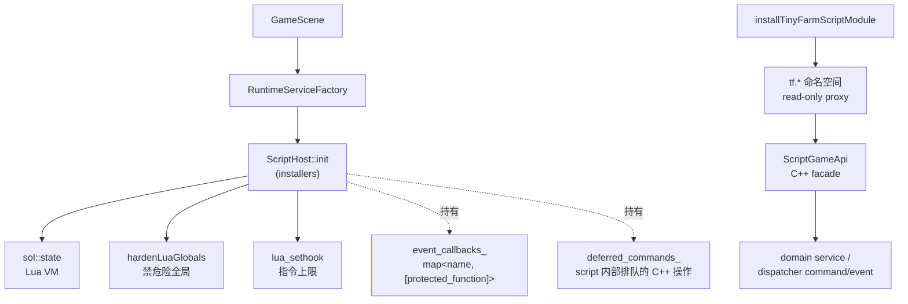
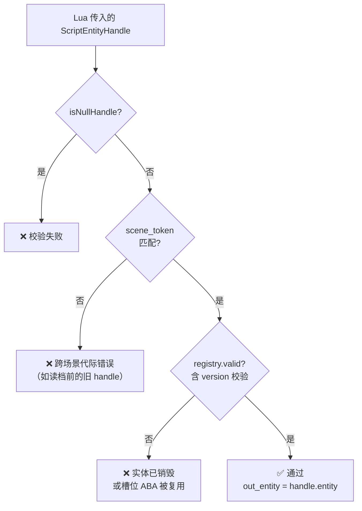
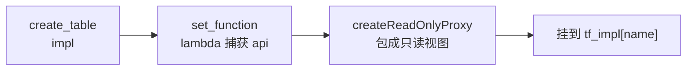
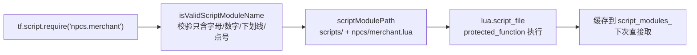

# 第7课 ScriptHost 与 Sol2 绑定

上节课我们把 Lua 内容层从"使用者视角"讲透了——边界、目录、`tf.*` API、幂等规约。但还剩一个反方向的问题没回答：**`tf.dialogue.show(...)` 这种 API 是谁、怎么、在什么时机暴露给 Lua 的？**

这节课翻到 C++ 一侧。看 `ScriptHost` 怎么嵌入 Lua VM、Sol2 怎么把 C++ 函数变成 Lua 可调用对象、`ScriptEntityHandle` 怎么防止脚本拿到已销毁实体、安全沙箱怎么阻止恶意脚本。

> **范围说明**：这节课讲"绑定基础设施 + 暴露 API 的方法论"。**具体每个 `tf.*` 子命名空间提供了什么** 已在 [Lua 内容层总览](06-Lua内容层总览.md) 中列出，**Tiled 与事件桥的接入** 留到 [脚本事件桥与 Tiled 接入](08-脚本事件桥与Tiled接入.md)。

---

## 读完这节课，你应该能回答

1. 如果脚本里保存了一个 entity 然后该 entity 被销毁，会发生什么？`ScriptEntityHandle` 的两层校验是如何工作的？
2. 给 Lua 暴露一个新 API 需要改哪几个文件？最少改 1 个、最多改几个？
3. 脚本里 `error("...")` 抛出后，C++ 侧如何感知与恢复？为什么不会让游戏崩溃？
4. 项目阻止恶意脚本"删文件 / 死循环"的具体技术手段有哪些？

---

## 先看再讲：在调试控制台跑一段脚本

如果项目支持调试控制台，可以试着输入：

```lua
tf.player.gold()
```

你会看到返回值是当前金币数（如 `300`）。这一行简单调用背后发生了 4 件事：

1. Lua 引擎查 `tf.player.gold` 是不是一个可调用值。
2. Sol2 把 lua 栈上的调用翻译成 C++ lambda 调用。
3. lambda 通过 `ScriptGameApi::playerGold()` 查 `PlayerWalletComponent`。
4. Sol2 把 `int` 返回值压回 Lua 栈。

每个 `tf.*` API 都走这条路径。这节课拆开这条路径的每一段。

---

## 关键链路



记住一句话：**ScriptHost 持有 Lua VM + 安全沙箱 + 模块安装器；installer 注册 `tf.*` 命名空间；命名空间内的函数通过 `ScriptGameApi` 走 domain / dispatcher**。

---

## 核心知识点

### 1. `ScriptHost`：Lua VM 的 RAII 宿主 + 软失败模式

打开 [`src/engine/script/script_host.h`](../../src/engine/script/script_host.h)。整个类的关键约定有 5 条：

| 约定 | 意义 |
| --- | --- |
| **两阶段初始化** | 构造器只占资源、`init()` 才打开标准库 + 注册模块。init 失败时进入"未就绪"状态 |
| **软失败模式** | 未就绪时所有公共方法 `ensureReady()` 早退记日志，**不抛异常、不崩溃** |
| **生命周期约束** | `registry_` 引用由 Scene 持有，`ScriptHost` 作为 runtime services 成员**先于 registry 析构** |
| **shutdown 幂等** | 可重复调用，便于场景退出时统一回收 |
| **`scene_token_` 单调递增** | 构造 / init 或 reload 推进 token、shutdown 失效 token，作为"脚本会话代际"标识（详见知识点 3） |

```cpp
class ScriptHost final {
public:
    explicit ScriptHost(entt::registry& registry);
    [[nodiscard]] bool init(entt::dispatcher& dispatcher,
                            const std::vector<ScriptModuleInstaller>& installers = {});
    void shutdown();
    [[nodiscard]] bool loadFile(std::string_view file_path);
    [[nodiscard]] bool exec(std::string_view script);
    [[nodiscard]] bool reload();
    // ... handle / event callback / deferred commands ...
private:
    sol::state lua_;            // RAII 封装的 Lua 虚拟机
    sol::table script_modules_; // tf.script.require 的模块缓存表
    std::uint64_t scene_token_;
    bool ready_{false};
};
```

> **`sol::state` 是关键**——它是 RAII 封装的 `lua_State*`，**析构时自动释放 VM**。这就是 [Lua 内容层总览](06-Lua内容层总览.md) 提到的"每次 `GameScene::init` 重建 Lua VM"在 C++ 一侧的体现：构造新 `ScriptHost` → 旧 `sol::state` 析构 → 全部 Lua 状态丢弃。暂停菜单在同一 `GameScene` 内读档时不会重建 VM，而是调用 `reload()`：清掉事件回调、deferred command、`tf.script.require` 模块缓存，推进 `scene_token_`，再重新执行上次成功 `loadFile()` 的脚本。

### 2. Sol2 是什么：Lua C API 的现代 C++ 封装

Lua 本体是用 C 写的，原生 API 是栈式的（push/pop），用起来很繁琐：

```c
// Lua 原生 C API（演示，项目不这么写）
lua_pushstring(L, "gold");
lua_gettable(L, -2);
int gold = (int)lua_tointeger(L, -1);
lua_pop(L, 1);
```

**Sol2** 是 header-only 的 C++ 封装，自动处理栈操作、类型转换、生命周期：

```cpp
// 用 Sol2
int gold = lua["gold"];   // 一行完成
```

绑定 C++ 函数也一样简单：

```cpp
lua.set_function("greet", []() {
    return std::string("Hello from C++!");
});
```

Lua 一侧立刻可用：

```lua
print(greet())   -- Hello from C++!
```

Sol2 自动做了 3 件事：

- 把 C++ lambda 包成 Lua 可调用的 C function。
- 把 Lua 传入的参数从 Lua 栈取出并转换为 C++ 类型。
- 把 C++ 返回值转换为 Lua 值并压入栈。

**这就是为什么项目里的绑定代码看起来像普通 C++**——读 [`tinyfarm_script_module.cpp`](../../src/game/script/tinyfarm_script_module.cpp) 不需要任何 Lua C API 知识。

### 3. `ScriptEntityHandle`：跨场景代际 + ABA 双层校验

这是本节课最值得讲透的工程细节。先看一个反例：

**❌ 反例**：Lua 直接保存 `entt::entity`

```lua
-- 错误写法
local target = evt.target   -- 实体 ID 8（version 0）
-- ... 后续某处 ...
tf.entity.position(target)  -- 实体可能已经被销毁，或它的槽位被新实体复用！
```

`entt::entity` 是 `uint32_t`，**槽位会被复用**——一个实体死了，下个实体很可能拿到同一个槽位。Lua 拿着"陈旧 id"调任何查询都会出 bug：要么取到错误的实体数据（ABA 问题）、要么遇到 dangling reference。

**✅ 正解**：暴露给 Lua 的不是 raw entity，而是 `ScriptEntityHandle`：

```cpp
struct ScriptEntityHandle {
    entt::entity entity{entt::null};  // 含 version，能区分 ABA
    std::uint64_t scene_token{0};     // 跨场景代际标识
};
```

**两层校验**（[`ScriptHost::validateHandle`](../../src/engine/script/script_host.cpp)）：



**两层各防什么**：

- **scene_token**：防止"读档前缓存的 handle 在新存档里被误用"。`ScriptHost` 构造 / `init` 会拿到当前脚本会话 token，`reload()` 会重新分配 token，`shutdown()` 会把 token 失效为 0；handle 在创建时记下当时的 token。重新 init 或 reload 后，旧 handle 的 token 与当前 token 不匹配，校验失败。
- **`registry.valid(entity)`**：含 EnTT 的 version 字段比对，**能区分 ABA**。同一槽位被销毁后又分配出来，新实体的 version 一定不同，所以旧 handle 仍会校验失败。

**任何 `tf.*` API 接收 handle 时都必须先 `validateHandle`**，绑定层不暴露任何能绕过校验的入口。即使 Lua 试图"伪造一个 handle"，因为 `usertype` 注册时是 `sol::no_constructor`，**Lua 根本无法构造 ScriptEntityHandle**——只能拿到 C++ 派过去的。

### 4. 模块组合：`tf.*` 命名空间的统一注册模式

打开 [`tinyfarm_script_module.cpp`](../../src/game/script/tinyfarm_script_module.cpp) 的 `installTinyFarmScriptModule`，会看到一套机械的注册模板：

```cpp
sol::table tf_impl = lua.create_table();

// ── tf.player ──
sol::table player_impl = lua.create_table();
player_impl.set_function("exists",   [api]() -> bool { return api->playerExists(); });
player_impl.set_function("gold",     [api]() -> int  { return api->playerGold(); });
player_impl.set_function("position", [api]() -> std::tuple<float, float> { return api->playerPosition(); });
tf_impl["player"] = engine::script::createReadOnlyProxy(lua, player_impl, "tf.player");

// ── tf.time ──
sol::table time_impl = lua.create_table();
time_impl.set_function("day",  [api]() -> std::uint32_t { return api->day(); });
// ...
tf_impl["time"] = engine::script::createReadOnlyProxy(lua, time_impl, "tf.time");
```

**模式归纳**：



为什么要 `createReadOnlyProxy`？看一个反例：

```lua
-- 如果不做 read-only 包装
tf.player.gold = function() return 999999 end  -- 改写 API，整个游戏挂掉
```

`createReadOnlyProxy` 用 Lua metatable 把 `__newindex` 拦截掉，让 Lua 脚本**无法覆盖** API 定义。这是脚本安全沙箱的一部分。

**`ScriptGameApi` 是 C++ facade**：所有 lambda 捕获 `api: std::shared_ptr<ScriptGameApi>`，函数体只做一件事——把 Lua 参数翻译成 `api` 的成员调用。**`api` 内部该查询的查询、该发 command / event 的就走 dispatcher；若当前正在 Lua 回调中，还会通过 ScriptHost 的 deferred queue 避免重入**。

**关键约定**：`ScriptGameApi` 不直接承载新玩法规则。只有当操作需要多步原子写入或共享校验时，它才委托给 domain service。其余都是简单的"查 component / 发 command"转译。

### 5. 安全沙箱：脚本能做什么 + 不能做什么

`ScriptHost::init` 里做了三件防御措施：

#### ① 选择性加载标准库

```cpp
lua_.open_libraries(sol::lib::base, sol::lib::math, sol::lib::table, sol::lib::string);
```

**故意没加载**：

| 没加载 | 不加载就阻止了什么 |
| --- | --- |
| `sol::lib::io` | 文件 IO（读 / 写本机文件） |
| `sol::lib::os` | 系统命令（`os.execute("rm -rf /")`） |
| `sol::lib::package` | Lua 原生 `require`（绕过项目白名单 `tf.script.require`） |

#### ② `hardenLuaGlobals`：堵住几个剩余漏洞

```cpp
void ScriptHost::hardenLuaGlobals() {
    lua_["dofile"]   = sol::lua_nil;  // 阻止脚本动态加载任意文件
    lua_["loadfile"] = sol::lua_nil;
    lua_["load"]     = sol::lua_nil;  // 阻止动态编译字节码
    lua_["rawset"]   = sol::lua_nil;  // 阻止绕过 read-only proxy
    lua_["rawget"]   = sol::lua_nil;
    lua_["collectgarbage"] = sol::lua_nil;  // 阻止脚本主动干预 VM GC
    lua_["string"]["dump"] = sol::lua_nil;  // 阻止导出字节码
}
```

#### ③ 指令上限：阻止死循环

```cpp
lua_sethook(lua_.lua_state(), &onInstructionLimitReached,
            LUA_MASKCOUNT, SCRIPT_INSTRUCTION_LIMIT);  // 200000

static void onInstructionLimitReached(lua_State* L, lua_Debug*) {
    luaL_error(L, "ScriptHost: script exceeded instruction limit");
}
```

**实测语义**：Lua VM 每执行约 20 万条 VM 指令会触发一次回调；回调里 `luaL_error` 会被 Sol2 的 `protected_function` 捕获 → 输出错误日志而不是整个游戏挂掉。**写出 `while true do end` 这种死循环不会让游戏卡死**，会被打断并报错。

> **三层防御**总结：
> - 第一层：库不加载 → 根本没有接口。
> - 第二层：危险全局变量 → 设为 nil，覆盖原有。
> - 第三层：指令上限 → 不让脚本永远跑下去。

### 6. 错误处理：`protected_function` 让脚本错误不传染 C++

打开 `script_host.cpp::runResult`：

```cpp
bool ScriptHost::runResult(sol::protected_function_result&& result, std::string_view source) {
    if (!result.valid()) {
        sol::error err = result;
        spdlog::error("ScriptHost[{}]: {}", source, err.what());
        return false;
    }
    return true;
}
```

`sol::protected_function` 是 Sol2 对 Lua `pcall` 的封装——**Lua 脚本里 `error("...")` 抛出后被 Sol2 捕获、转成 C++ 端可读的 `sol::error`**，绝不让异常穿透到 C++ stack 引发 crash。

**这就是为什么上节课反例中"脚本写错"也不会让游戏崩溃**——只会在 spdlog 看到错误日志，C++ 继续往下跑。

**事件回调也一样**——`event_callbacks_` 里存的是 `sol::protected_function`，`emitEvent` 内部循环调用每个回调时用 `runResult` 兜底，**某个 NPC 脚本写错不会拖累其他 NPC 的回调**。

### 7. 模块加载：`tf.script.require` 的白名单实现

Lua 原生 `require` 没加载（前面提到了）。项目自己实现了 `tf.script.require`：



几个安全特性：

- **路径白名单**：只接受 `scripts/` 下的 `.lua` 文件，**模块名只能含字母 / 数字 / 下划线 / 点号**——`tf.script.require("../config/secret")` 会被拒。
- **循环 require 防御**：在执行新脚本前先用 sentinel 占位，循环 require 时返回 sentinel 而不是死循环。
- **失败缓存**：成功后缓存返回值；失败时不缓存，下次还能重试。

### 8. 测试策略：脚本绑定的可测试性

打开 [`tests/engine/script/`](../../tests/engine/script) 与 [`tests/game/`](../../tests/game) 搜 `script_`，有 10+ 个测试文件覆盖：

| 测试文件 | 验证什么 |
| --- | --- |
| `script_host_smoke_test.cpp` | `loadFile` / `exec` 的端到端 |
| `script_host_security_test.cpp` | 标准库白名单、危险全局禁用、指令上限 |
| `script_host_lifecycle_test.cpp` | `shutdown` 幂等、reload 后旧 handle 失效 |
| `script_module_require_test.cpp` | `tf.script.require` 的循环 / 失败 / 缓存 |
| `script_i18n_test.cpp` | `tf.i18n.tr` / `format` |
| `script_quest_flow_test.cpp` | `tf.quest.status` / `offer` / `turn_in` |
| `script_shop_flow_test.cpp` | `tf.shop.open` 触发对应 command |
| `script_recruitment_flow_test.cpp` | `tf.party.offer_recruit` |
| `script_event_bridge_test.cpp` | C++ 事件转 Lua payload（下节课主题） |
| `script_dialogue_helper_test.cpp` | `lib.dialogue` 的状态机 |
| `script_phase2_api_test.cpp` | 综合 API 测试 |

**典型测试模板**（伪代码）：

```cpp
TEST(ScriptHostSmokeTest, LoadAndRunInlineScript) {
    entt::registry registry;
    entt::dispatcher dispatcher;
    // 构造最小 fixture：catalog mock + ScriptHost + installer
    auto host = makeTestScriptHost(registry, dispatcher);

    // 直接 exec 一段内联 Lua，验证副作用（dispatched event / state）
    ASSERT_TRUE(host->exec("tf.dialogue.show('Hi')"));

    // 用 capture 结构监听 DialogueShowEvent
    EXPECT_EQ(captured_show_events.size(), 1u);
    EXPECT_EQ(captured_show_events[0].text, "Hi");
}
```

**关键工程价值**：脚本绑定测试**不需要拉起 GameScene**——构造最小 fixture 即可。这让"新增 API → 立即写测试"的成本极低。

---

## 配合阅读

| 顺序 | 文件 / 章节 | 关注点 |
| :---: | --- | --- |
| 1 | [`docs/tutorial/lua-binding-guide.md`](../../docs/tutorial/lua-binding-guide.md) | **本节课核心阅读材料**——Sol2 三层关系、绑定模式、错误处理、完整数据流 |
| 2 | [Lua 内容层总览](06-Lua内容层总览.md)（上节课） | 内容编排者视角，结合本节课反向理解 |

---

## 从这几个文件开始看

| 顺序 | 文件 | 你会看到什么 |
| :---: | --- | --- |
| 1 | [`src/engine/script/script_host.h`](../../src/engine/script/script_host.h)（~80 行） | ScriptHost 接口面板：两阶段 init、`makeHandle` / `validateHandle`、event callback、deferred command |
| 2 | [`src/engine/script/script_entity_handle.h`](../../src/engine/script/script_entity_handle.h)（~20 行） | 两字段结构 + 两个 helper 函数——校验整个机制的核心数据 |
| 3 | [`src/engine/script/script_host.cpp`](../../src/engine/script/script_host.cpp)（`hardenLuaGlobals` / `validateHandle` / `requireScriptModule`） | 沙箱、句柄校验、模块加载三个安全模块的实现 |
| 4 | [`src/game/script/script_game_api.h`](../../src/game/script/script_game_api.h) | C++ facade 的接口面板——所有 `tf.*` lambda 都委托给它 |
| 5 | [`src/game/script/tinyfarm_script_module.cpp`](../../src/game/script/tinyfarm_script_module.cpp)（按 `// ── tf.*` 分块阅读） | **绑定模板的样板**——15 个只读子命名空间的注册全在这里 |

---

## 检查你的理解

1. **handle 校验**：脚本在第 1 天保存了一个 `npc_handle` 局部变量，玩家睡觉到第 2 天（同一 `GameScene`，不 reload bootstrap）——handle 还能用吗？暂停菜单在同一 `GameScene` 内读档并触发 `ScriptHost::reload()` 后呢？玩家退到标题再读档进同一存档呢？为什么？
2. **加新 API 工作量**：要新增 `tf.weather.is_raining()`，最少改几个文件？最多改几个（包含测试）？
3. **沙箱**：以下脚本在项目里能成功执行吗？为什么？
   - `os.execute("ls /")`
   - `require("io")`
   - `tf.player.gold = 999999`
   - `collectgarbage("stop")`
   - `while true do end`
4. **错误传播**：NPC A 的脚本在 `interact` 回调里写了 `local x = nil + 1`——这次 interact 会发生什么？NPC B 的 interact 回调会被影响吗？

---

## 动手试试

**目标**：给 Lua 加一个 `tf.debug.echo(msg)` 这种最简 API，验证完整数据流。

操作步骤：

1. **加 lambda**：在 [`tinyfarm_script_module.cpp`](../../src/game/script/tinyfarm_script_module.cpp) 的 `installTinyFarmScriptModule` 里，参考 `tf.i18n` 的注册模式加一个新 `tf.debug` 命名空间：
   ```cpp
   sol::table debug_impl = lua.create_table();
   debug_impl.set_function("echo", [](const std::string& msg) {
       spdlog::info("[tf.debug.echo] {}", msg);
   });
   tf_impl["debug"] = engine::script::createReadOnlyProxy(lua, debug_impl, "tf.debug");
   ```
2. **重编测试与游戏目标**：构建项目（用 ninja 加速：`ninja -C build/debug game_tests engine_tests TinyFarmRPG-Darwin`；主程序目标名来自 `CMakeLists.txt` 的 `${PROJECT_NAME}-${CMAKE_SYSTEM_NAME}`）。
3. **在某个 NPC 脚本里调用**：打开 [`scripts/npcs/greeter.lua`](../../scripts/npcs/greeter.lua)，在 `interact` 回调里加一行：
   ```lua
   tf.debug.echo("hello from greeter")
   ```
4. **验证**：跑游戏，去找 NPC 互动——观察 console / spdlog 输出。

**完成后回答**：

- 这个 API 没有用到 `ScriptGameApi`，是不是任何新 API 都可以这样直接 lambda？
- 如果你想让 `tf.debug.echo` 同时 trigger 一个 `DebugEchoEvent`（其他系统订阅），lambda 里怎么改？需要捕获什么？
- 上面新加的 `tf.debug` 命名空间被 `createReadOnlyProxy` 包裹后，Lua 里 `tf.debug = nil` 会发生什么？

---

## 小结

- `ScriptHost` 用 `sol::state` RAII 持有 Lua VM；两阶段 init + 软失败模式让脚本错误不传染 C++。
- `ScriptEntityHandle` 用 **scene_token（跨代际） + entity version（防 ABA）** 双层校验，所有 `tf.*` API 接收 handle 时强制走 `validateHandle`。
- `installTinyFarmScriptModule` 用统一模板注册 `tf.*` 命名空间：`create_table` → `set_function` lambdas → `createReadOnlyProxy` → 挂到 `tf_impl`。
- 安全沙箱三层防御：**选择性加载库**（无 io/os/package） + **`hardenLuaGlobals`**（禁 dofile / loadfile / load / rawset / rawget / collectgarbage / string.dump） + **指令上限**（200000 指令打断死循环）。
- `sol::protected_function` 把 Lua 异常翻译成 C++ 端的 `sol::error`，脚本错误只产生日志，**不会让游戏崩溃**。
- 测试通过最小 fixture（registry + dispatcher + ScriptHost + installer）覆盖几乎所有绑定，**不需要拉起 GameScene**。

---

## 下节课预告

到这节课为止，**Lua 与 C++ 的双向桥已经搭好**：API 安全暴露、句柄安全校验、错误安全捕获。下节课 **[脚本事件桥与 Tiled 接入](08-脚本事件桥与Tiled接入.md)** 讲剩下的最后一块——**地图对象、NPC、区域触发、对话选项怎么把事件递给 Lua？** `scripted_interaction=true` 的 Tiled 字段背后是什么机制？`script_event` / `actor_id` / `script_once_key` 这三个 Tiled 属性各自承担什么？这是把"内容层 + 绑定"真正变成"游戏内可触发剧情"的最后一公里。
