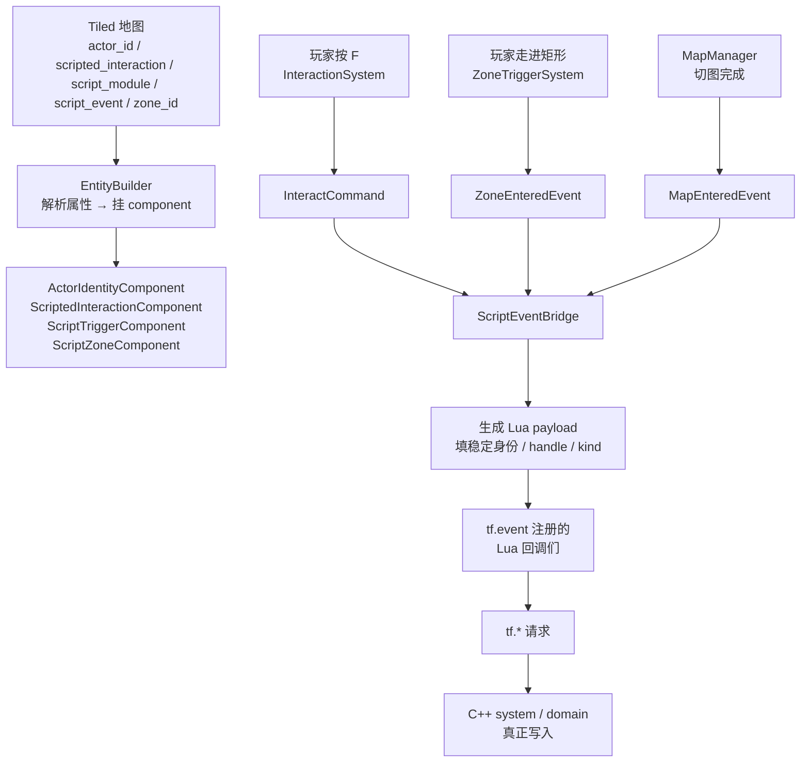
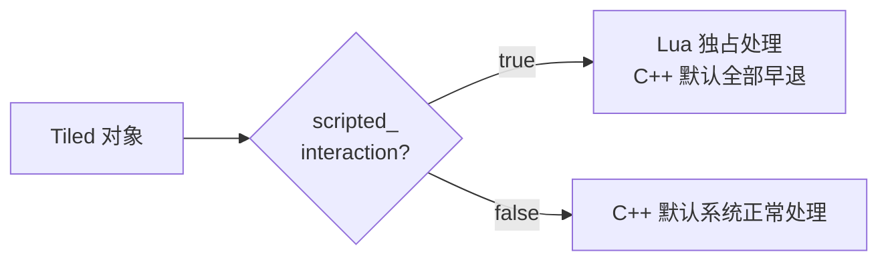
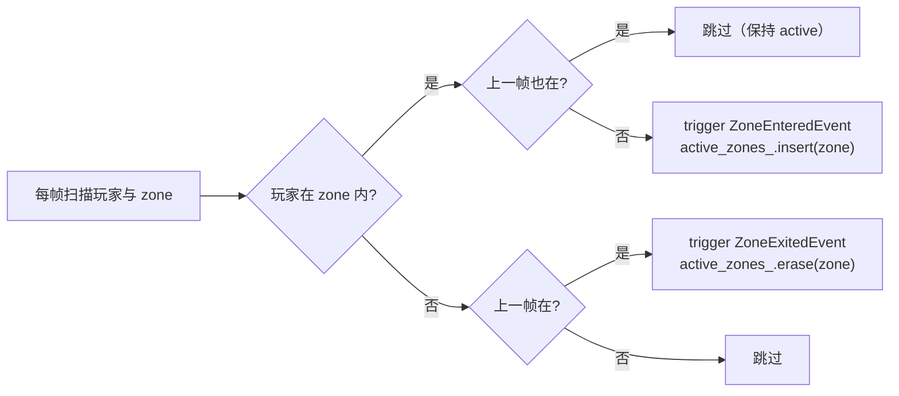
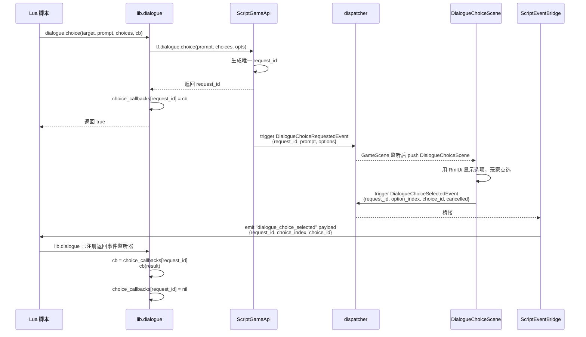
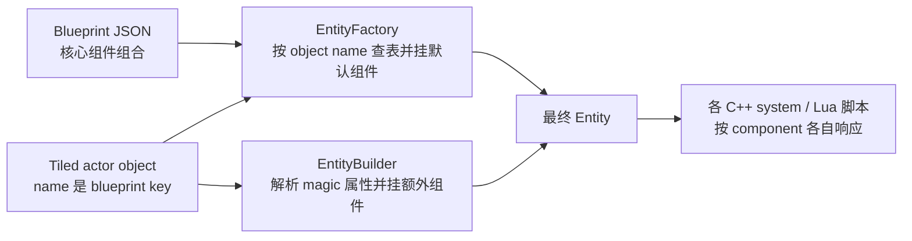

# L08 脚本事件桥与 Tiled 接入

L06 讲了"Lua 写什么内容"，L07 讲了"C++ 怎么把 API 安全暴露给 Lua"。但还剩一块拼图：**Lua 端 `tf.event.on("interact", function(evt) ... end)` 这种回调，C++ 是怎么知道"该把哪条事件递过去"的？**

打开任意一份 NPC 脚本，会看到几乎所有内容都建立在三件事上：

- 监听一个事件名（`interact` / `map_enter` / `zone_enter` / `battle_ended` ...）
- 用 `evt.target_actor_id` / `evt.target_script_event` / `evt.zone_id` 这种**稳定身份字段**判断"这事跟我有关吗"
- 决定要不要 `evt.dialogue_handled = true` 把这次交互"认领"下来

本讲讲清楚这套机制——**C++ system 触发的 typed event 怎么被翻译成 Lua payload、Tiled 地图上那几个 magic 属性怎么把对象交给 Lua 控制、对话选项又怎么完成"Lua 推选项 → C++ 弹场景 → 选择结果回 Lua" 的环形流转**。

---

## 🎯 本讲目标

读完之后，你应该能回答：

1. 一个 Tiled 对象同时配了 `scripted_interaction=true`、`actor_id`（脚本身份）和默认 C++ 交互组件（如 `DialogueComponent`）时，谁优先响应？为什么？
2. 区域触发器（`script_zone`）的 "一次性" 语义是写在 C++ 系统里还是 Lua 里？哪种更合理？
3. `tf.dialogue.choice(...)` 和 `lib.dialogue.choice(...)` 分别负责哪一层？玩家选了第 2 个后，结果怎么找到原 Lua 回调？
4. 写一个新的脚本化 NPC，最少要动几个文件？

---

## 👁️ 先看再讲：拆一个真实的 interact 事件

打开 [`scripts/npcs/greeter.lua`](../../scripts/npcs/greeter.lua)（33 行）。重点看 `interact` 回调里 `evt` 这个 table 上有什么字段——这些字段来自 C++ 通过 `ScriptEventBridge` 递给 Lua 的 payload，以及同一次 `emitEvent()` 内 Lua 回调之间共享 table 后追加的协调标志：

```lua
tf.event.on("interact", function(evt)
    -- evt 里有：
    -- evt.player              : 玩家 ScriptEntityHandle
    -- evt.target              : 被交互目标 ScriptEntityHandle
    -- evt.target_kind         : "npc" / "chest" / "merchant" ...
    -- evt.target_actor_id     : "npc.greeter"（来自 Tiled actor_id）
    -- evt.target_name         : "Greeter"
    -- evt.target_blueprint_id : "npc.greeter"
    -- evt.target_script_module : Tiled script_module 属性
    -- evt.target_script_event : Tiled script_event 属性
    -- evt.target_script_once_key : Tiled script_once_key 属性
    -- evt.map_id              : 当前地图 id
    -- evt.dialogue_handled    : Lua 协调标志；初始通常为 nil，被前一 Lua 回调认领后置 true
    if evt.dialogue_handled then return end
    if evt.target_actor_id ~= "npc.greeter" then return end
    -- ... 认领并处理
    evt.dialogue_handled = true
end)
```

**关键观察**：所有"该不该处理这次交互"的判断**全都基于稳定身份字段**（`actor_id` / `script_event` / `target_kind`），从来不依赖显示名 / 槽位 ID 之类的易变字段。`evt.dialogue_handled` 不是 C++ payload 字段，而是 Lua 侧在共享 table 上形成的协作约定。

---

## 🗺️ 关键链路



记住一句话：**C++ system 触发 typed event → ScriptEventBridge 翻译成 payload table → 所有 `tf.event.on(name, fn)` 注册的回调按注册顺序被调用**。

---

## 💡 核心知识点

### 1. `scripted_interaction=true`：默认 C++ 交互"早退"

打开 [`src/game/component/scripted_interaction_component.h`](../../src/game/component/scripted_interaction_component.h)：

```cpp
struct ScriptedInteractionComponent {};
```

整个 component 是空的——它只是一个**标签**（tag）。但加上这个标签，**项目里所有默认 C++ 交互系统都会主动跳过这个目标**：

```cpp
// dialogue_system.cpp::onInteract（节选）
void DialogueSystem::onInteract(const InteractCommand& event) {
    if (event.target == entt::null || !registry_.valid(event.target)) return;
    if (helpers::isScriptedInteraction(registry_, event.target)) return;   // ← 早退
    if (registry_.all_of<MerchantComponent>(event.target)) return;
    if (registry_.all_of<QuestGiverComponent>(event.target)) return;
    if (registry_.all_of<RecruitableComponent>(event.target)) return;
    // ... 默认对话流程
}
```

**早退规则同时存在于**：

- `DialogueSystem`（默认对话）
- `QuestInteractionSystem`（任务接取）
- `RecruitmentInteractionSystem`（招募对白）
- `ShopInteractionSystem`（商店 greeting）
- `ChestSystem`（默认宝箱奖励）
- `RestSystem`（休息）
- `ClosetInteractionSystem`（换装）

**为什么这样设计？**



如果默认 C++ 系统 **不** 早退，会发生什么？玩家按 F 交互 NPC：

1. **DialogueSystem** 看到 `DialogueComponent` → 弹默认对话气泡。
2. **Lua greeter.lua** 看到 `interact` 事件 → 同时弹一段自定义对话。
3. 两段对话**叠加**显示，文本错乱。

**`scripted_interaction=true` 的语义是"Lua 完全接管这个目标的交互响应"**。设置之后，Tiled 上同时配 `quest_offer_id` / `shop_id` / `dialogue_id` 等默认字段也会让位给 Lua。

> **回到自测题 1**：如果你想让"Tiled NPC 同时走 C++ 任务系统 + Lua 多说一句"——**不要**给它加 `scripted_interaction=true`。让默认 C++ 任务系统处理任务流程，Lua 侧如果还要补充内容，应监听更明确的事件（例如 `quest_accepted` / `quest_completed`）或使用 Notice 通道做轻量提示；不要期待 `evt.dialogue_handled` 反映 C++ 默认系统是否已经处理，因为它只是同一次 Lua `emitEvent()` 内的脚本间协调标志。

### 2. Tiled 属性约定：几个 "magic" 字段

打开 [`src/game/loader/tiled_conventions.h`](../../src/game/loader/tiled_conventions.h)，看到一组 `OBJECT_PROP_*` 常量。Lua 内容最常依赖的是这些字段：

| Tiled 属性 | 解析为 component | 作用 | 例子 |
| --- | --- | --- | --- |
| `actor_id` | `ActorIdentityComponent` | 暴露给 Lua 的稳定身份 | `"npc.greeter"` / `"actor.lyria"` |
| `scripted_interaction=true` | `ScriptedInteractionComponent` | C++ 默认交互早退 | `true` |
| `script_module` | `ScriptTriggerComponent::module_` | 进入 Lua payload，提示脚本模块归属 | `"npcs.greeter"` |
| `script_event` | `ScriptTriggerComponent::event_` | 进入 Lua payload，供脚本过滤 | `"home_exterior.seed_cache"` |
| `script_once_key` | `ScriptTriggerComponent::once_key_` | 一次性触发的 `tf.state` key | `"map.home_exterior.seed_cache.opened"` |
| `zone_id` | `ScriptZoneComponent::zone_id_` | 区域触发器的稳定身份 | `"zone.home.seed_hint"` |

注意：Tiled actor object 的 **`name` 字段是 blueprint 查找 key**，例如 `name="npc.greeter"`；`actor_id` 是脚本看到的实例身份覆盖，不影响 blueprint lookup。项目里没有 `blueprint_id` 这个 Tiled 属性。

还有几个**辅助字段**（详深留 L10–L12）：

- `quest_offer_id` → `QuestGiverComponent`（让 NPC 成为任务发布者，可与 Lua 共存）
- `shop_id` → `MerchantComponent`（让 NPC 成为商人）
- `recruit_actor_id` → `RecruitableComponent`（让 NPC 可招募）

这些辅助字段有优先级和互斥约束：`shop_id` 的交互优先于 `quest_offer_id`；`recruit_actor_id` 不应与商店、任务发布或战斗遭遇字段混在同一个 actor 实例上，否则内容意图会变得模糊，测试也难覆盖。

**为什么字段这么多？** 每个字段对应**一个独立的交互形态**。同一个 NPC 可以是"任务发布者 + Lua 补充提示"，也可以是商人或招募候选；内容层要用字段组合表达清楚交互归属，再由各自系统按 component 响应。

### 3. `ScriptEventBridge`：C++ event → Lua payload 的翻译器

打开 [`src/game/script/script_event_bridge.h`](../../src/game/script/script_event_bridge.h)。整个类只做一件事——**订阅一组 C++ typed event，逐个翻译成 Lua table 后 `host_.emitEvent(...)`**。

订阅列表（按主题分类）：

| 事件大类 | C++ 事件 | Lua 事件名 |
| --- | --- | --- |
| **交互** | `InteractCommand` | `interact` |
| **对话** | `DialogueHideEvent` / `DialogueChoiceSelectedEvent` | `dialogue_closed` / `dialogue_choice_selected` |
| **物品** | `InventoryChanged` / `ItemUsedEvent` | `inventory_changed` / `item_used` |
| **战斗** | `BattleStartedEvent` / `BattleEndedEvent` / `BattleTurnStartedEvent` / `BattleUnitDiedEvent` ... | `battle_started` / `battle_ended` / `battle_turn_started` / `battle_unit_died` ... |
| **地图** | `MapEnteredEvent` / `MapExitedEvent` | `map_enter` / `map_exit` |
| **区域** | `ZoneEnteredEvent` / `ZoneExitedEvent` | `zone_enter` / `zone_exit` |
| **时间** | `DayChangedEvent` / `TimeOfDayChangedEvent` | `day_changed` / `time_of_day_changed` |
| **任务** | `QuestAcceptedEvent` / `QuestCompletedEvent` | `quest_accepted` / `quest_completed` |

**翻译流程**（以 `onInteract` 为例）：

```cpp
void ScriptEventBridge::onInteract(const InteractCommand& event) {
    sol::table payload = host_.luaState().create_table();
    setEventName(payload, "interact");

    // 实体 handle（自动校验过 scene_token / version）
    setEntityHandle(host_, registry_, payload, "player", event.player);
    setEntityHandle(host_, registry_, payload, "target", event.target);

    payload["target_kind"] = std::string{targetKind(registry_, event.target)};

    // 从 ActorIdentityComponent 拷贝 actor_id（稳定身份）
    if (const auto* identity = registry_.try_get<ActorIdentityComponent>(event.target)) {
        setOptionalString(payload, "target_actor_id", identity->actor_id_);
        // ... actor_id_hash / target_blueprint_id
    } else {
        payload["target_actor_id"] = sol::lua_nil;
    }

    // 从 NameComponent 拷贝显示名
    // 从 ScriptTriggerComponent 拷贝 script_module / script_event / script_once_key
    setScriptTriggerFields(registry_, payload, event.target, ...);

    // 发到 Lua
    (void)host_.emitEvent("interact", payload);
}
```

**关键约定**：

- **handle 自动校验**：`setEntityHandle` 内部用 `host_.makeHandle(entity)`，生成的 handle 自带当前 `scene_token`。
- **找不到的字段填 `nil`**：脚本可以安全用 `evt.target_actor_id ~= nil` 判断，不会拿到野指针。
- **稳定身份优先**：payload 里既有 `target_actor_id`（字符串）也有 `target_actor_id_hash`（hash 字符串），脚本两者皆可比较。hash 值以字符串进入 Lua，避免把 64-bit 整数塞进 Lua number 后产生精度问题。
- **`dialogue_handled` 不在这里生成**：`onInteract()` 不会设置它。这个字段来自 Lua 回调共享同一个 payload table 后的协作，常见写法是脚本开头先检查，成功认领后再设为 `true`。

### 4. ZoneTriggerSystem：一次性触发该写在哪？

`script_zone` 是 Tiled 矩形 object 设置 `type="script_zone"` 后变成的"看不见的区域"，玩家走进时触发 `zone_enter` 事件、离开触发 `zone_exit`。

**关键问题**：玩家在区域内**走动会不会每帧重发 `zone_enter`**？答案是**不会**。打开 [`zone_trigger_system.h`](../../src/game/system/zone_trigger_system.h)：

```cpp
class ZoneTriggerSystem final {
    // ...
    std::unordered_set<entt::entity> active_zones_;   // ← 当前正在内的区域集合
};
```

system 每帧做的事：



**这是"边沿触发"语义——只在状态变化（外→内 / 内→外）的那一帧发事件**，停留期间不重放。

**那"全局一次性"（首次进入才弹提示，第二次不弹）写在哪？**

不写在 C++ system 里——`ZoneTriggerSystem` 不知道这个 zone 是"剧情提示型"还是"持续型"。**写在 Lua 里更合理**：

```lua
local once = tf.script.require("lib.once")

tf.event.on("zone_enter", function(evt)
    if evt.zone_id ~= "zone.home.seed_hint" then return end
    once.run("map.home.seed_hint.shown", function()
        dialogue.show("This looks important.", nil, tf.dialogue.CHANNEL_NOTICE)
    end)
end)
```

**为什么 Lua 更合理？**

- "首次提示 / 总是提示 / 每天提示一次" 是**内容编排**决策，不是规则真相。
- C++ 写死会失去灵活性——某些 zone 可能确实需要每次都触发（"进入禁地警告"）。
- `tf.state` 已经提供了通用持久化通道，`lib.once` 一行就完成。

> **回到自测题 2**：边沿触发（一次性进入事件）放在 C++ 系统里、剧情一次性（永久只触发一次）放在 Lua 里——**两个 "一次性" 是不同维度**。

### 5. DialogueChoice：Lua 推 → C++ 弹 → 回 Lua 的环形流转

这里要分清两层 API：

- **低层 API**：`tf.dialogue.choice(prompt, choices, opts)` 只负责向 C++ 请求打开选项窗，并返回非零 `request_id`；失败时返回 `0`。它不保存 Lua callback。
- **常用 helper**：`lib.dialogue.choice(target, prompt, choices, callback)` 会调用低层 API、按目标补 speaker / actor_id，并把 `request_id -> callback` 存在 Lua 表里。内容脚本通常用这一层。

完整链路：



**关键设计点**：

- **`request_id` 是关键**：`lib.dialogue` 用它把"原回调"与"返回事件"对上号。多个并发的 `tf.dialogue.choice` 调用各自有不同 request_id，互不干扰。
- **回调存在 `lib.dialogue` 内部 map**：[`scripts/lib/dialogue.lua`](../../scripts/lib/dialogue.lua) 第 5 行 `local choice_callbacks = {}` ——`request_id` → `function`。`tf.event.on("dialogue_choice_selected", ...)` 内部根据 request_id 取出回调调用。
- **结果带三种 id**：`choice_index`（1-based）/ `choice_zero_index`（0-based）/ `choice_id`（用户自定义字符串如 `"potato"`）。**推荐用 `choice_id` 而不是 index**——增删选项时 index 会错位、`choice_id` 是稳定的。
- **取消也走同一通道**：玩家按 Esc 关闭选项窗 → `DialogueChoiceSelectedEvent{cancelled=true}` → helper callback 收到 `result.cancelled = true`，同时 `result.index` / `result.zero_index` / `result.id` / `result.label` 都是 `nil`。

### 6. Blueprint / EntityFactory 在脚本化实体上的角色

上一期 [part-23](../ref/OpenGL与迷你农场/23-蓝图与实体工厂.md) 讲过 Blueprint——把"角色 / 动物 / 作物"的组件组合从 C++ 类型挪到 JSON。**TinyFarmRPG 完整保留这套机制**，同时让 Tiled 地图实例字段在加载时覆盖或补充组件。

举例：[`actor_blueprint.json`](../../assets/data/actor_blueprint.json) 是顶层 object map。一个普通商人的定义节选大致这样：

```json
{
  "merchant": {
    "name": "Josh",
    "description": "Josh runs the village general store.",
    "sprite": {
      "path": "assets/farm-rpg/Character and Portrait/Character/Pre-made/Josh/Idle.png",
      "src_size": { "width": 32, "height": 32 }
    },
    "animations": {
      "idle": { "...": "..." },
      "walk": { "...": "..." }
    },
    "speed": 20.0
  }
}
```

而在 Tiled 地图上，actor object 用自身 `name` 引用 blueprint；属性再补实例级身份和玩法入口：

| Tiled object 字段 / 属性 | 起作用的层 |
| --- | --- |
| `type="actor"` + `point=true` + `name="merchant"` | EntityBuilder 用 object `name` 查 blueprint，EntityFactory 挂默认组件 |
| `actor_id="merchant.dock_1"` | EntityBuilder 额外挂 `ActorIdentityComponent`（脚本身份） |
| `shop_id="shop.dock.day"` | EntityBuilder 额外挂 `MerchantComponent`（商店身份） |
| `scripted_interaction=true` | EntityBuilder 额外挂 `ScriptedInteractionComponent`（Lua 独占） |

**整套机制的分层非常清晰**：



**详深留 L09**——下一讲讲 catalog 体系时，会把 Blueprint / ItemCatalog / RpgCatalog / AppearanceCatalog 一起讲透。

### 7. 完整新增清单：一个新的脚本化 NPC

为了把所有知识点串起来，做一个具体例子——**新增 NPC `"npc.farmer"`，互动时说一段话**。需要动的文件：

1. **Tiled 地图**：在 `home_exterior.tmj` 加一个 actor object，属性：
   - `type="actor"` + `point=true`
   - `name="npc.farmer"`（object name 是 blueprint key；如果复用已有外观，也可以填已有 key）
   - `actor_id="npc.farmer"`
   - `script_module="npcs.farmer"`（可选，进入 payload，方便排查）
   - `scripted_interaction=true`
2. **Blueprint 配置**（可选，如果已有可复用 blueprint 跳过）：[`actor_blueprint.json`](../../assets/data/actor_blueprint.json) 顶层加一个 `"npc.farmer"` 定义，至少提供 `name`、`sprite`、`animations`。
3. **NPC 脚本**：新建 [`scripts/npcs/farmer.lua`](../../scripts/npcs/)：
   ```lua
   local dialogue = tf.script.require("lib.dialogue")
   tf.event.on("interact", function(evt)
       if evt.dialogue_handled then return end
       if evt.target_actor_id ~= "npc.farmer" then return end
       if dialogue.start(evt.target, {"Howdy!", "Crops looking good today."}) then
           evt.dialogue_handled = true
       end
   end)
   ```
4. **加载脚本**：在 [`scripts/bootstrap.lua`](../../scripts/bootstrap.lua) 加一行 `tf.script.require("npcs.farmer")`。
5. **本地化文本**（如果用 `tf.i18n.tr`）：在 i18n 资源加 key。

**注意：C++ 没动一行**。这就是 Lua 内容层的工程价值。

---

## 📋 阅读清单

| 顺序 | 文件 / 章节 | 关注点 |
| :---: | --- | --- |
| 1 | [`docs/game/interaction_and_dialogue.md`](../../docs/game/interaction_and_dialogue.md) | **本讲核心阅读材料**——`InteractCommand` 总线扩展点、各订阅者优先级 |
| 2 | [`docs/game/blueprints.md`](../../docs/game/blueprints.md) | Blueprint 与脚本化字段的协同 |
| 3 | [`docs/game/map_data_pipeline.md`](../../docs/game/map_data_pipeline.md) | Tiled object `type/name/properties` 到 component 的加载约定 |
| 4 | [`docs/tutorial/lua-content-authoring.md`](../../docs/tutorial/lua-content-authoring.md)（§4 Tiled 接入 + §5 配方） | 完整 Tiled 字段约定 + 8 个常用配方 |
| 5 | 上一期 [part-23 蓝图与实体工厂](../ref/OpenGL与迷你农场/23-蓝图与实体工厂.md) + [part-28 交互与对话](../ref/OpenGL与迷你农场/28-交互与对话.md) | 升级前的基础设施 |

---

## 🔑 源码入口

| 顺序 | 文件 | 你会看到什么 |
| :---: | --- | --- |
| 1 | [`src/game/script/script_event_bridge.h`](../../src/game/script/script_event_bridge.h)（~80 行） | 完整事件订阅清单——19 个 C++ event 各自的桥接函数 |
| 2 | [`src/game/script/script_event_bridge.cpp`](../../src/game/script/script_event_bridge.cpp)（`onInteract` 函数） | payload 翻译模板——稳定身份、handle、kind、script trigger 字段的逐项拷贝 |
| 3 | [`src/game/component/scripted_interaction_component.h`](../../src/game/component/scripted_interaction_component.h) | 一个 1 行的 tag——C++ 默认系统的"早退开关" |
| 4 | [`src/game/component/script_zone_component.h`](../../src/game/component/script_zone_component.h) + [`script_trigger_component.h`](../../src/game/component/script_trigger_component.h) | Tiled magic 字段落到 component 的具体形态 |
| 5 | [`src/game/system/zone_trigger_system.h`](../../src/game/system/zone_trigger_system.h) | `active_zones_` 集合实现"边沿触发" |
| 6 | [`src/game/scene/dialogue_choice_scene.cpp`](../../src/game/scene/dialogue_choice_scene.cpp) | Lua choice 请求 → RmlUi Scene → 选择 event 回 Lua 的环形流转 |
| 7 | [`scripts/maps/home_exterior.lua`](../../scripts/maps/home_exterior.lua) + [`scripts/npcs/greeter.lua`](../../scripts/npcs/greeter.lua) | 最简地图脚本 + NPC 脚本，反复对照即可建立直觉 |

---

## ❓ 自测问题

1. **早退优先级**：一个 Tiled 对象同时配 `scripted_interaction=true` 和 `dialogue_id="default.greeter"`——玩家按 F 时会发生什么？两段对话会不会都出现？
2. **稳定身份**：脚本里为什么不直接用 `evt.target.entity_id` 做判断而要用 `evt.target_actor_id`？entity_id 在什么场景下会失效？
3. **一次性触发**：要实现"每个游戏内日子重置一次的提示"（每天第一次进入区域弹一次），应该用 `once` 还是 `state`？怎么写 key？
4. **DialogueChoice 取消**：玩家按 Esc 关闭选项窗时，`lib.dialogue.choice` 的 callback 收到的 `result` 长什么样？为什么 `index` / `zero_index` / `id` / `label` 应该是 `nil`？
5. **新增 NPC**：要给 `home_exterior` 加一个会随机说三句话之一的 NPC（无任务、无招募），从 Tiled 到 Lua 共要修改 / 新建几个文件？

---

## 🧪 最小练习

**目标**：在 `home_exterior` 加一个新的区域触发点，进入时弹一行 floating notice。

操作步骤：

1. **打开 Tiled 地图**（或直接编辑对应 `.tmj` JSON）：[`assets/maps/home_exterior.tmj`](../../assets/maps/home_exterior.tmj)，加一个矩形 object：
   ```json
   {
     "type": "script_zone",
     "x": 80, "y": 96, "width": 32, "height": 32,
     "properties": [
       { "name": "zone_id", "type": "string", "value": "zone.home.test_hint" }
     ]
   }
   ```
2. **修改脚本**：打开 [`scripts/maps/home_exterior.lua`](../../scripts/maps/home_exterior.lua)，加一个 `zone_enter` 回调：
   ```lua
   tf.event.on("zone_enter", function(evt)
       if evt.zone_id ~= "zone.home.test_hint" then return end
       dialogue.show("Stepped on the test zone!", nil, tf.dialogue.CHANNEL_NOTICE)
   end)
   ```
3. **跑游戏验证**：进入 home_exterior 走到这块区域，确认浮动提示出现。
4. **走出再走回**：观察提示是不是**每次进入**都触发——是的，因为是边沿触发。

**进阶**：

- 把它改成 **只触发一次** 版本（用 `lib.once`）。
- 再改成 **每天第一次进入** 版本（自测题 3 的需求；提示：key 里嵌入 `tf.time.day()`）。

完成后回答：**改"一次性"和"每天一次"，整个过程动了几个 C++ 文件？**

---

## 📌 小结

- **`scripted_interaction=true`** 是一个标签——挂上之后所有默认 C++ 交互系统主动早退，让 Lua 独占处理。
- **Tiled magic 属性**通过 `EntityBuilder` 解析成 component，常用的是 `actor_id`（脚本身份）、`scripted_interaction`（C++ 让位）、`script_module` / `script_event` / `script_once_key`（进入 payload 供脚本过滤）和 `zone_id`（区域身份）。
- **`ScriptEventBridge`** 订阅 19+ 个 C++ typed event，逐个翻译成 Lua table 后 `emitEvent`——payload 总是带稳定身份字段（actor_id / kind / map_id）。
- **`ZoneTriggerSystem`** 用 `active_zones_` 集合实现**边沿触发**（进入 / 离开各一次），"全局一次性 / 每天一次"等剧情语义留给 Lua 用 `tf.state` / `lib.once` 决定。
- **DialogueChoice** 的低层 `tf.dialogue.choice()` 返回 `request_id`，常规脚本用 `lib.dialogue.choice()` 保存 callback 并路由结果；Lua 回调收到 `{ id, label, index, zero_index, cancelled }`，取消时这些选择字段为 `nil`，正常选择时推荐用稳定的 `id` 判断分支。
- **Blueprint + Tiled magic 属性**分工：Blueprint 提供默认组件组合，Tiled actor object 的 `name` 是 blueprint key，属性挂额外组件（脚本身份 / 商店 / 招募）。
- **新增脚本化 NPC** 通常只动 Tiled、`scripts/npcs/xxx.lua`、`bootstrap.lua` 三处——**C++ 不动**。

## 🚀 下节课预告

**Stage III Lua 内容层完整收尾**。从下一讲开始进入 **Stage IV — RPG 数据与探索玩法**。**L09 数据目录全景与 RPG Catalog** 会回答："agora、村庄、装备、敌人、技能"这些 JRPG 静态规则放在哪里？为什么 RPG 数据要拆到 `assets/data/rpg/` 单独的目录？字符串 id 与 hash id 为什么并存？我们下讲见。
