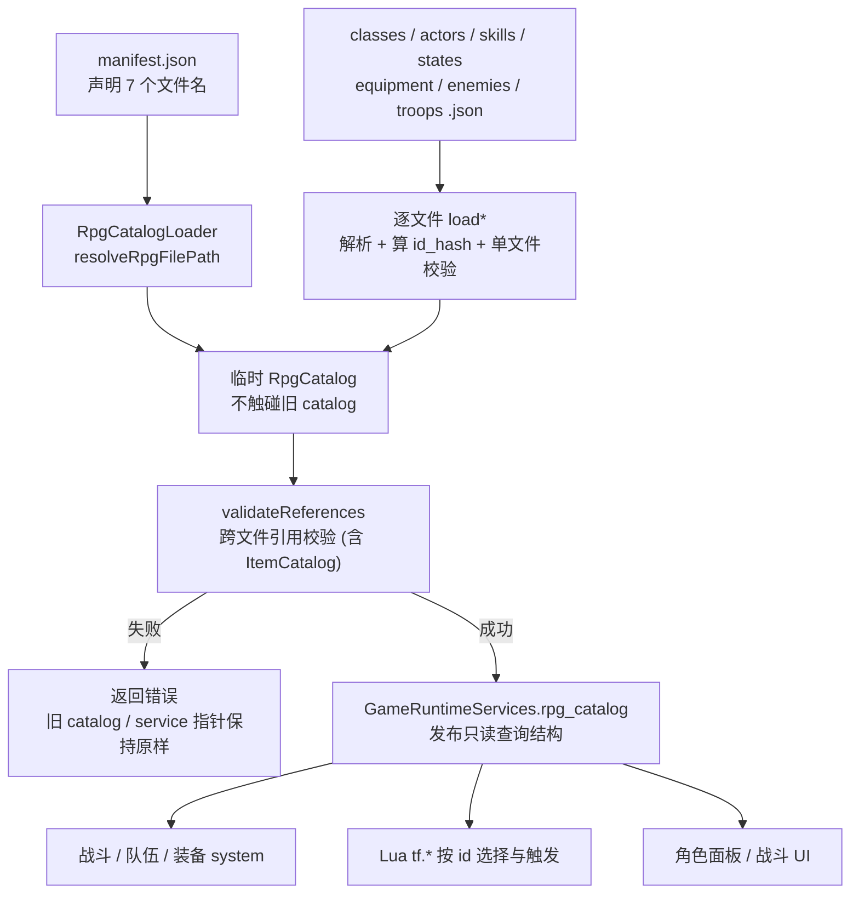
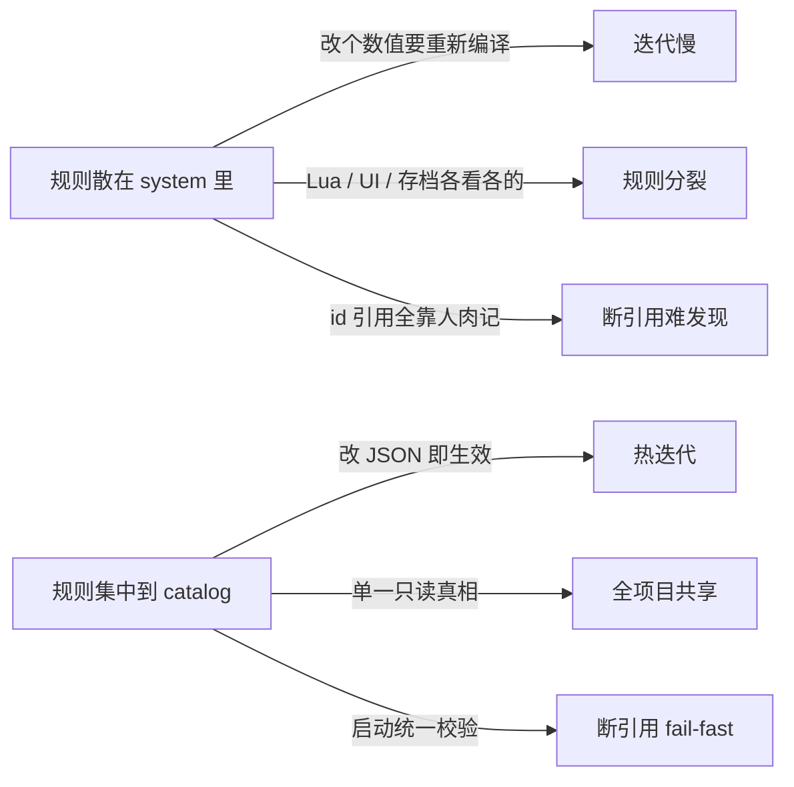
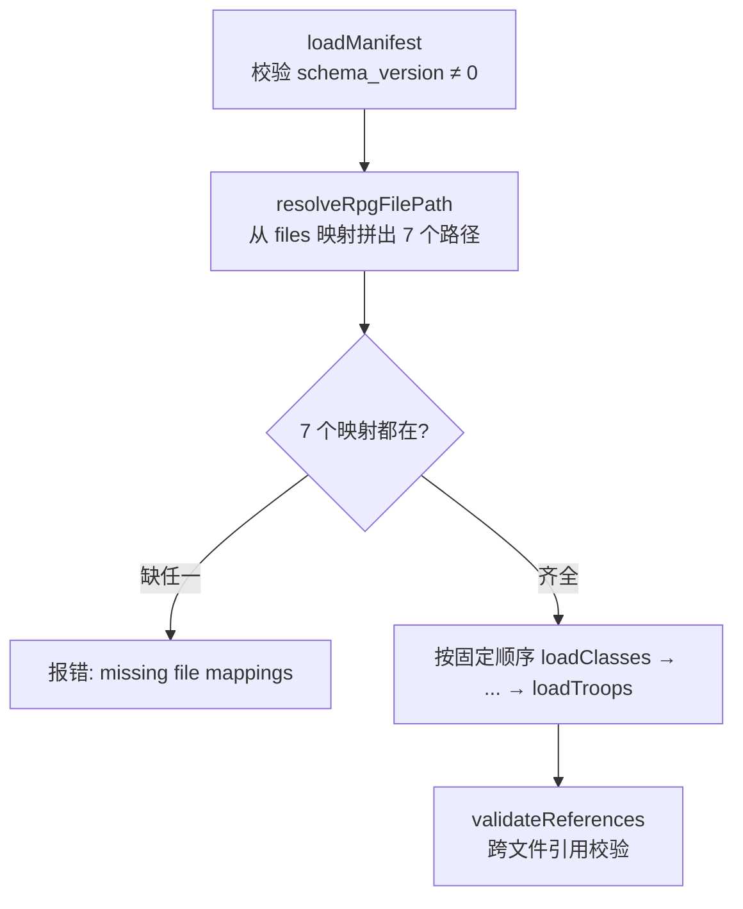
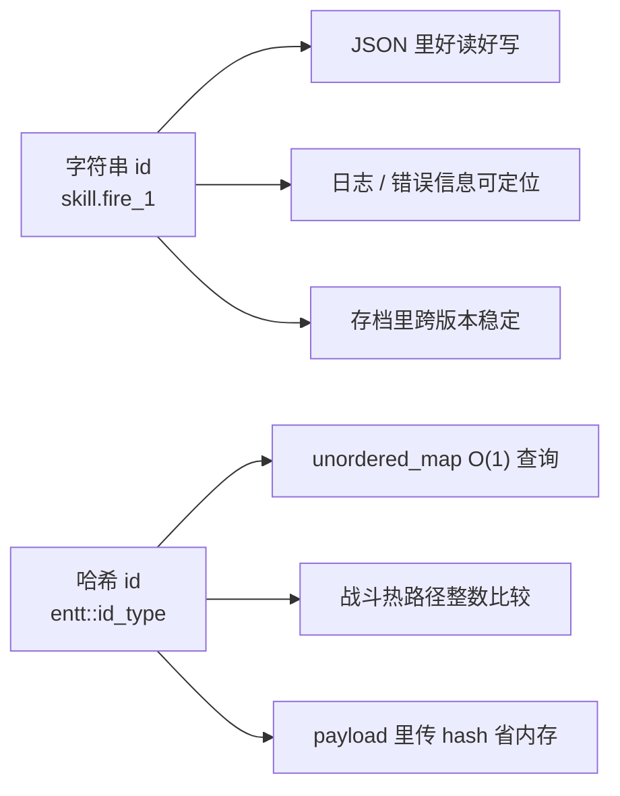
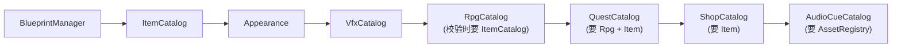

# 第9课 数据目录全景与 RPG Catalog

前面三节课我们把"内容编排"交给了 Lua。但 Lua 脚本里出现的 `tf.battle.start("troop.goblin_pair")`、`tf.quest.accept("...")`、招募对白里引用的 `actor.lyria`——这些 **id 背后的"真相"到底存在哪里**？哥布林有多少血、用什么技能、掉什么东西、长什么样？

答案是：**不在 Lua、不在 C++ 系统、不在某个 system 的成员变量里，而是在 `assets/data/` 下的一堆 JSON 里**，由 C++ catalog 加载成**只读查询结构**。

这正是 [Lua 内容层总览](06-Lua内容层总览.md) 中那条边界的另一半：**Lua 表达内容编排，JSON 表达静态真相，domain service 表达原子写入**。前面讲透了"编排"，这节课讲透"真相"——项目里到底有哪些 catalog、JRPG 规则为什么要单独拆到 `assets/data/rpg/`、几百个 id 之间的引用怎么保证不写错，以及为什么每个 id 都同时以"字符串"和"哈希"两种形态存在。

---

## 读完这节课，你应该能回答

1. 项目里一共有哪几个 catalog？各自管什么？为什么不把这些规则直接写死在 system 里？
2. 一个 actor 引用了不存在的 skill id，校验会在**什么时候**报错？是运行到战斗里才崩，还是更早？
3. 同一个 id（如 `equip_wooden_sword`）为什么会同时出现在 `item_config.json` 和 `equipment.json` 两个文件里？谁负责哪一部分？
4. 为什么每条数据都同时保存 `std::string id_` 和 `entt::id_type id_hash_`？字符串和哈希各自活在哪些场景？
5. 内容加载失败时，为什么旧 catalog 和 `GameRuntimeServices` 里的指针不会暴露半初始化数据？

---

## 先看再讲：RPG 数据目录长什么样

打开 [`assets/data/rpg/`](../../assets/data/rpg/) 目录，一共 8 个文件：

```
assets/data/rpg/
├── manifest.json     ← 入口清单：声明其余 7 个文件叫什么
├── classes.json      ← 职业：基础属性 + 成长曲线
├── actors.json       ← 可玩角色：职业 + 初始技能 + 战斗外观 + 头像
├── skills.json       ← 技能：伤害公式 + 状态效果 + 表现
├── states.json       ← 状态(buff/debuff)：持续回合 + trait
├── equipment.json    ← 装备：槽位 + 属性加成 + 可装备职业
├── enemies.json      ← 敌人：属性 + 行动表 + 掉落
└── troops.json       ← 敌群：哪些敌人 + 站位 + 战斗背景
```

随手打开 [`actors.json`](../../assets/data/rpg/actors.json) 看 `actor.player`：

```json
{
  "id": "actor.player",
  "display_name": "actor.player.name",
  "class_id": "class.swordsman",
  "skill_ids": ["skill.attack", "skill.bash"],
  "battle_visual": { "sprite_blueprint_id": "player", "idle_animation": "idle_left" },
  "portrait": { "path": ".../Premade/1.png", "decorator": "portrait-player", ... }
}
```

**关键观察**：这一条 actor 数据里，藏着 **4 个跨文件引用**——

- `class_id: "class.swordsman"` → 必须在 `classes.json` 里存在
- `skill_ids: [...]` → 每个都必须在 `skills.json` 里存在
- `display_name: "actor.player.name"` → 这是个 **i18n key**，不是直接的显示名（细节留到后续本地化课程）
- `battle_visual.sprite_blueprint_id: "player"` → 指向 blueprint（[脚本事件桥与 Tiled 接入](08-脚本事件桥与Tiled接入.md) 讲过）

整个 RPG 数据就是一张 **id 引用网**。一旦某个 id 写错一个字母，引用就断了。这节课的核心，就是讲清楚这张网怎么被加载、怎么被校验、怎么被高效查询。

---

## 关键链路



记住一句话：**JSON 是真相 → catalog 先装进临时结构并在启动时一次性校验所有引用 → 校验过了才提交给任何系统使用**。这是一道"fail-fast 闸门"——断引用永远在启动时暴露，而不是等你打到那场战斗才崩；失败也不会把半套数据塞进运行时。

---

## 核心知识点

### 1. Catalog 全景：项目的"静态真相"都集中在哪

打开 [`docs/game/data-catalogs.md`](../../docs/game/data-catalogs.md)，能看到全套 catalog 清单。挑最核心的几个：

| Catalog | 源文件 | 管什么 | 主要消费者 |
| --- | --- | --- | --- |
| `ItemCatalog` | `item_config.json` + `icon_config.json` | 物品身份：名字、图标、类别、堆叠上限、使用效果 | 背包 / 快捷栏 / 商店 / 战斗物品 |
| `AppearanceCatalog` | `appearance_catalog.json` | 分层外观部件、profile、slot | `AppearanceSystem` / 换装 / 头像 |
| `RpgCatalog` | `assets/data/rpg/*.json` | JRPG 规则：actor/class/skill/state/equipment/enemy/troop | 队伍 / 装备 / 战斗 / 任务引用 |
| `QuestCatalog` | `quests.json` | 任务 objective / reward | 任务系统 / 任务 UI |
| `ShopCatalog` | `shops.json` | 商店买入条目 / 卖出规则 | 商店交互 / 交易服务 |
| `AudioCueCatalog` | `audio_cues.json` | 场景默认音乐 cue | 场景音频 |
| `VfxCatalog` | `vfx_catalog.json` | 特效语义 id | `PlayVfxCommand` |

还有 blueprint、time/light config、map loading、i18n 等也走同一套"JSON → loader → 只读结构"的模式。

**为什么不直接写死在 system 里？** 三个理由，整套 catalog 设计都围绕它们：



> catalog 解决的不是"能不能写规则"，而是**"规则只有一份、谁都引用它、写错能被自动抓住"**。

### 2. RPG manifest：用一个清单驱动 7 个文件的拆分加载

为什么 JRPG 数据要单独拆成 `assets/data/rpg/` 一个子目录、还要分 7 个文件，而不是塞进一个大 JSON？因为 **actor / class / skill / state / equipment / enemy / troop 是 7 个正交的概念，各自会独立膨胀**。拆开后每个文件都能单独编辑、单独 diff、单独测试。

但拆开就需要一个"目录"。这就是 [`manifest.json`](../../assets/data/rpg/manifest.json)：

```json
{
  "schema_version": 1,
  "content_versions": { "actors": 1, "classes": 1, ... },
  "features": { "quest": false, "shop": false },
  "files": {
    "classes": "classes.json",
    "actors": "actors.json",
    "skills": "skills.json",
    "states": "states.json",
    "equipment": "equipment.json",
    "enemies": "enemies.json",
    "troops": "troops.json"
  }
}
```

加载逻辑在 [`rpg_catalog_loader.cpp`](../../src/game/runtime/rpg_catalog_loader.cpp)，分三步：



**关键设计点**：

- **manifest 只是"间接层"**：代码从不写死 `"actors.json"` 这个文件名，而是查 `manifest.files_["actors"]`。想换文件名只改 manifest。
- **schema_version 必须非零**：`RpgCatalog::loadManifest` 里 `schema_version == 0` 直接拒绝加载——防止加载到一个格式未知的旧档。
- **`files` 必须 7 个全齐**：`loadRpgCatalogFromManifest` 要求 classes / actors / skills / states / equipment / enemies / troops 任一映射都不能缺。这是"宁可起不来，也不要带着残缺数据跑"。
- `content_versions` / `features` 也会被解析进 `manifest_`，目前是内容版本号 / 前瞻开关，留作演化用途。

还有一个关键点：**加载是原子提交的**。`loadRpgCatalogFromManifest` 不会一边加载一边污染传进来的 catalog，而是先创建一个临时对象：

```cpp
game::data::RpgCatalog loaded_catalog{};
// loadManifest + loadClasses/loadActors/.../loadTroops 都写入 loaded_catalog

std::string reference_error{};
if (!loaded_catalog.validateReferences(reference_error, options.item_catalog)) {
    out_error = "RPG reference validation failed: " + reference_error;
    return false;
}

catalog = std::move(loaded_catalog);  // 只有完整成功后才替换外部 catalog
```

每个 RPG 子文件 loader 也遵循同样的思路：先解析到 `parsed_classes` / `parsed_actors` / `parsed_equipment` 这样的临时 map，整文件成功后才 `std::move` 到成员 map。`ItemCatalog` 也先写临时 map，并且拒绝重复 `item id` / `icon id`。所以"fail-fast"不是"失败前可能留下半套数据"，而是**失败不提交**。

### 3. validateReferences：那道"启动时 fail-fast"的闸门

这是本节课最该看懂的一段代码。打开 [`RpgCatalog::validateReferences`](../../src/game/data/rpg_catalog.cpp)，它在**所有 7 个文件加载完之后**，把整张引用网走一遍：

| 检查对象 | 校验内容 | 失败信息样例 |
| --- | --- | --- |
| `enemies` → `skills` | 行动表里每个 `skill_id` 都存在 | `Enemy '...' references missing skill '...'` |
| `enemies` → `items` | 掉落 `item_id` 在 ItemCatalog 里存在 | `Enemy '...' references missing item '...'` |
| `troops` → 背景 / `enemies` | `battle_background_id` 合法、成员 `enemy_id` 存在 | `Troop '...' references missing enemy '...'` |
| `actors` → `classes` / `skills` | `class_id` + 每个 `skill_id` 都存在 | `Actor '...' references missing class/skill '...'` |
| `skills` → `states` | `add_state`/`remove_state` 效果的 `target_id` 存在 | `Skill '...' references missing state '...'` |
| `equipment` → `items` / `classes` / `actors` | item 存在且类别为 equipment、stack=1、无使用效果；可装备职业/角色存在 | `Equipment '...' references missing class '...'` |

**它在什么时候跑？** 看调用链 `loadRpgCatalogFromManifest`：

```cpp
// loadRpgCatalogFromManifest 最后一步
std::string reference_error{};
if (!loaded_catalog.validateReferences(reference_error, options.item_catalog)) {
    out_error = "RPG reference validation failed: " + reference_error;
    return false;   // ← 整个内容加载失败
}

catalog = std::move(loaded_catalog);
```

再往上，`ContentCatalogLoader::ensureRpgCatalog` 也先把 catalog 放在局部 `shared_ptr` 里，只有 `loadRpgCatalogFromManifest` 成功才写入 `services.rpg_catalog`。如果 RPG 引用断了，错误会被 `spdlog::error` 打出来，内容加载阶段直接失败，`GameRuntimeServices` 不会拿到一个半初始化的 `RpgCatalog`。

> **回到自测题 2**：actor 引用了不存在的 skill，**校验在游戏启动、RPG 文件全部加载完、catalog 交给任何系统之前就报错**——不是等你进了战斗菜单点开技能列表才崩。这就是 fail-fast 的价值：断引用永远在最早、最集中、错误信息最清晰（带 actor id + 缺失 skill id）的地方暴露。

这套校验有完整的**反向测试**做安全网。[`tests/game/rpg_catalog_test.cpp`](../../tests/game/rpg_catalog_test.cpp) 里一连串 `ValidateFailsOn...` 用例，每个都故意写一个断引用，断言 `validateReferences` 返回 false 且错误信息里**包含那个写错的 id**：

```cpp
TEST(RpgCatalogTest, ValidateFailsOnMissingActorSkillReference) {
    // actors.json 里 skill_ids: ["skill.missing"]
    EXPECT_FALSE(catalog.validateReferences(error));
    EXPECT_NE(error.find("skill.missing"), std::string::npos);  // 错误信息指向具体 id
}
```

还补了两类"失败边界"测试：

- `LoadFromManifestFailureKeepsExistingCatalogData`：先成功加载完整 manifest，再删掉 `equipment` 映射并重新加载，断言失败后旧 actor / equipment 仍然可查。
- `LoadClassesFailureKeepsExistingCatalogData` 与 `ItemCatalogTest` 的重复 id 用例：单文件解析失败、重复 id 或非法 battle_use 都不会清掉旧数据，也不会留下部分新数据。

### 4. 字符串 id 与 hash id：可读性与性能的并存

打开 [`rpg_data.h`](../../src/game/data/rpg_data.h)，几乎每个结构体都是这个模式：

```cpp
struct SkillData {
    std::string id_{};          // "skill.fire_1"  —— 给人看 / 写日志 / 存档
    entt::id_type id_hash_{};   // 0x9a3f...        —— 给机器查 / 比较 / 当 map key
    // ...
};
```

而 catalog 内部的存储，**全部用 hash 当 key**：

```cpp
std::unordered_map<entt::id_type, SkillData> skills_{};   // key 是 id_hash，不是字符串
```

哈希怎么算的？就一行：

```cpp
entt::id_type RpgCatalog::hashId(std::string_view id) {
    return entt::hashed_string{id.data(), id.size()}.value();
}
```

`findSkill` 提供**两个重载**，字符串版只是先 hash 再走 hash 版：

```cpp
const SkillData* findSkill(std::string_view id) const { return findSkill(hashId(id)); }
const SkillData* findSkill(entt::id_type id_hash) const { /* map.find(id_hash) */ }
```

**为什么要并存？** 两者解决不同问题：



- **字符串的存活范围**：JSON 源文件、spdlog 日志、`validateReferences` 错误信息、存档文件、面向玩家的 i18n key。凡是"人要读、要跨进程稳定"的地方。
- **哈希的存活范围**：运行时的 map 查询、战斗/技能解算里每帧可能跑的比较、事件 payload（[脚本事件桥](08-脚本事件桥与Tiled接入.md) 里的 `target_actor_id_hash`）。凡是"机器要快"的地方。
- **哈希只在加载时算一次**：解析 JSON 时就把 `id_hash_` 填好，运行时再不碰字符串比较。

> 不是"二选一"，而是**"同一个 id 的两副面孔"**——给人看的那副和给机器查的那副，加载时一次性对齐。

### 5. 一个 item id，两个 catalog：equipment ⊗ item_config

这是初学者最容易困惑的一点。打开 [`equipment.json`](../../assets/data/rpg/equipment.json)：

```json
{ "item_id": "equip_wooden_sword", "slot": "weapon",
  "param_bonuses": { "atk": 2 }, "allowed_classes": ["class.swordsman", "class.monk"] }
```

再打开 [`item_config.json`](../../assets/data/item_config.json) 找同一个 id：

```json
{ "id": "equip_wooden_sword", "category": "equipment",
  "icon_id": "equipment/wooden_sword", "stack_limit": 1,
  "display_name": "item.equip_wooden_sword.name" }
```

**同一个 `equip_wooden_sword`，住在两个 catalog 里，各管一个侧面**：

| Catalog | 管这件装备的什么 | 字段 |
| --- | --- | --- |
| `ItemCatalog`（`item_config.json`） | **物品身份**：叫什么、什么图标、能不能堆叠、是不是装备类 | `display_name` / `icon_id` / `category` / `stack_limit` |
| `RpgCatalog`（`equipment.json`） | **战斗/装备语义**：占哪个槽、加多少属性、谁能装 | `slot` / `param_bonuses` / `allowed_classes` |

为什么不合成一个？因为一件装备**在背包里**是个普通物品（要图标、要能放进格子、要能在商店买卖），**穿到身上**才有 RPG 语义。让它共享 item id，背包/商店系统就能像对待任何物品一样对待它，而不必知道"装备"这个概念。

这也解释了 `validateReferences` 里那段对 equipment 的严格校验：装备引用的 item 必须 `category == Equipment`、`stack_limit == 1`、且**没有** `on_use`/`battle_use`——保证两个 catalog 对同一 id 的理解不打架。

**这种跨 catalog 引用，决定了加载顺序不能乱。** 看 `ContentCatalogLoader` 的 `ensure*` 顺序：



**Item 必须在 Rpg 之前、Rpg+Item 必须在 Quest 之前**——因为后者的 `validateReferences` 要拿前者的指针去查引用。

这个顺序还配合了"成功后发布"的提交边界：`ContentCatalogLoader::ensureItemCatalog / ensureRpgCatalog / ensureQuestCatalog / ensureShopCatalog` 都先构造局部 catalog，加载和引用校验通过后才写入 `GameRuntimeServices`。`VfxCatalog` 和 `AudioCueCatalog` 是更温和的内容：加载失败会记录日志并保持指针为空，调用方看到空 catalog 就跳过 catalog 驱动播放。

> **回到自测题 3**：一个 id 出现在两个文件里不是冗余，是**关注点分离**——身份归 ItemCatalog，战斗语义归 RpgCatalog，加载顺序保证后者能校验前者。

### 6. AudioCueCatalog 为什么也要独立，以及 Lua 不伪造第二套规则

[`audio_cues.json`](../../assets/data/audio_cues.json) 很短：

```json
{
  "music_cues": {
    "cue.music.gameplay.default": { "music_id": "scene-bg-music", "loop": true, "fade_in_ms": 200 },
    "cue.music.battle.default":   { "music_id": "music.battle.boss_2", "loop": true }
  },
  "scene_defaults": { "gameplay": "cue.music.gameplay.default", "battle": "cue.music.battle.default" }
}
```

**为什么连"场景放什么背景音乐"这种小事也要独立成 catalog，不直接在场景代码里写 `playMusic("scene-bg-music")`？** 同样是那三个理由的具体化：

- **数据驱动**：换默认 BGM 只改 JSON，不动场景代码、不重编译。
- **可校验**：`AudioCueCatalog::validateReferences` 会拿 `AssetRegistry` 检查 cue 引用的 `music_id` 是否真的注册了资源——写错音乐 id 会在装配期打出明确日志，catalog 不发布，场景侧早退不播放，而不是把错误藏到某个场景里。
- **语义层**：cue 是"语义"（`cue.music.battle.default`），music_id 是"资源"。中间隔一层，将来想给某场景换 cue、或给 cue 加淡入参数，都不碰资源路径。

> 这是整个 catalog 体系的统一哲学——**凡是"会变的内容"和"要校验的引用"，都从代码里抽出来变成可加载、可校验的数据**。

最后回到 [Lua 内容层总览](06-Lua内容层总览.md) 那条边界。**Lua 只"选择和触发"catalog 里的规则，绝不临时伪造第二套**：

```lua
tf.battle.start("troop.goblin_pair")   -- 选一个已存在的 troop id，规则在 troops.json
```

Lua 不会、也不应该在脚本里凭空写一个"哥布林有 200 血、用 skill.bash"——那会造成"脚本里一套数值、JSON 里另一套"的分裂。脚本传 id，C++ 去 catalog 查真相。这就是为什么 catalog 校验能成为安全网：**所有规则只有一个来源**。

---

## 配合阅读

| 顺序 | 文件 / 章节 | 关注点 |
| :---: | --- | --- |
| 1 | [`docs/game/data-catalogs.md`](../../docs/game/data-catalogs.md) | **本节课核心阅读材料**——全套 catalog 清单、引用校验、加载顺序、"新增静态数据放哪"决策表 |
| 2 | [`assets/data/rpg/*.json`](../../assets/data/rpg/) | 7 个 RPG 文件通读一遍，建立"id 引用网"的直觉 |
| 3 | [`docs/game/audio_cue_catalog.md`](../../docs/game/audio_cue_catalog.md) | AudioCueCatalog 作为"小而完整"的 catalog 范例 |
| 4 | [`tools/rpg_importer/README.md`](../../tools/rpg_importer/README.md) | 可选工具阅读：RPG Maker → 项目格式 + 语义 id 别名；不进入运行时加载链路 |

---

## 从这几个文件开始看

| 顺序 | 文件 | 你会看到什么 |
| :---: | --- | --- |
| 1 | [`src/game/data/rpg_data.h`](../../src/game/data/rpg_data.h) | 所有 RPG 结构体定义——注意每个都有 `id_` + `id_hash_` 双字段 |
| 2 | [`src/game/data/rpg_catalog.h`](../../src/game/data/rpg_catalog.h) | catalog 接口：7 个 `load*`、`validateReferences`、`find*` 双重载、hash 键的 map |
| 3 | [`src/game/data/rpg_catalog.cpp`](../../src/game/data/rpg_catalog.cpp)（`validateReferences` + `hashId`） | 跨文件引用校验的全部逻辑 + 一行哈希实现 |
| 4 | [`src/game/runtime/rpg_catalog_loader.cpp`](../../src/game/runtime/rpg_catalog_loader.cpp) | manifest 驱动加载的三步：解析清单 → 拼路径 → 加载并校验 |
| 5 | [`src/game/runtime/content_catalog_loader.cpp`](../../src/game/runtime/content_catalog_loader.cpp) | 全部 catalog 的固定加载顺序（Item→Rpg→Quest→Shop 的依赖原因） |
| 6 | [`src/game/data/item_catalog.cpp`](../../src/game/data/item_catalog.cpp) | `ItemCatalog` 的临时 map 解析、重复 id 拒载和 equipment item 约束 |
| 7 | [`src/game/data/audio_cue_catalog.h`](../../src/game/data/audio_cue_catalog.h) | 一个"麻雀虽小五脏俱全"的 catalog：load + validate + find + 默认 cue |
| 8 | [`tests/game/rpg_catalog_test.cpp`](../../tests/game/rpg_catalog_test.cpp) / [`tests/game/item_catalog_test.cpp`](../../tests/game/item_catalog_test.cpp) | 断引用、缺 manifest 映射、重复 id、失败不污染旧 catalog 的反向用例 |

---

## 检查你的理解

1. **校验时机**：在 `actors.json` 给某 actor 的 `skill_ids` 加一个 `"skill.does_not_exist"`，启动游戏会发生什么？错误信息里会包含哪些信息帮你定位？这个错误是在加载阶段、还是进战斗后才出现？
2. **AudioCue 独立性**：如果把"场景默认音乐"直接 `playMusic("xxx")` 写死在 `GameScene` 里，相比走 `AudioCueCatalog`，会失去哪三样东西（提示：迭代、校验、语义层）？
3. **id 双形态**：`RpgCatalog::findSkill` 有字符串和哈希两个重载。一段战斗解算代码每帧都要查同一个技能，你会缓存哪一种 id？为什么 JSON 和日志里又坚持用字符串？
4. **跨 catalog 引用**：为什么 `equip_wooden_sword` 要同时存在于 `item_config.json` 和 `equipment.json`？如果只保留 `equipment.json`，背包系统会缺哪些信息？
5. **加载顺序**：能不能把 `QuestCatalog` 放到 `RpgCatalog` 之前加载？`validateReferences` 会出什么问题？
6. **失败提交边界**：为什么 `loadRpgCatalogFromManifest` 要先写 `loaded_catalog`，最后才 `catalog = std::move(loaded_catalog)`？这和直接写入传入的 `catalog` 有什么差别？

---

## 动手试试

**目标**：亲手制造一次引用校验失败，观察错误信息精确指向哪里。

1. **改一个引用 id**：打开 [`assets/data/rpg/skills.json`](../../assets/data/rpg/skills.json)，把 `skill.fire_1` 这条技能的 `"id"` 改成 `"skill.fire_typo"`（**只改技能自己的 id，不改引用它的 actor**）。`skill.fire_1` 只被 `actor.lyria` 引用，这样她的 `skill_ids` 就指向了一个不存在的技能。
2. **跑起来看错误**：构建并启动游戏，或直接跑项目资源校验测试：
   ```bash
   ninja -C build/debug game_tests
   ctest --test-dir build/debug -R 'RpgCatalogTest.ProjectAssetsExposeSlimeTroopForMapEncounter' --output-on-failure
   ```
   你会看到类似：
   ```
   RPG reference validation failed: Actor 'actor.lyria' references missing skill 'skill.fire_1'
   ```
   注意它**在内容加载阶段就报错**，错误信息直接给出了"谁引用了谁"。如果你跑的是上面的 CTest，这个用例此时应该失败——这正是我们故意制造的断引用被测试拦住了。
   - **顺便观察校验顺序**：`validateReferences` 是按 enemies → troops → actors → skills → equipment 的顺序走的。如果你改的是同时被敌人和角色引用的 `skill.bash`，先报错的会是 **Enemy** 而不是 Actor——因为 enemy 循环跑在前面。
3. **改回去**：把 id 改回 `skill.fire_1`，确认游戏正常加载。
4. **观察测试视角**：`ProjectAssetsExposeSlimeTroopForMapEncounter` 这个用例会加载**真实** `assets/data/rpg` 资源，它会在断引用时直接失败——这就是 CI 能拦住你"提交一个断引用"的原因。

**进阶**：

- 阅读 [`tools/rpg_importer/README.md`](../../tools/rpg_importer/README.md)。这个离线工具从 RPG Maker 原始 JSON 导入并生成 `validation_report.json` 做**导入期**的基础引用校验——和运行时的 `validateReferences` 是**两道不同的关卡**（导入期 vs 启动期）。想试工具时请输出到临时目录，不要直接覆盖 `assets/data/rpg`。想想：为什么离线导入做一遍校验、运行时还要再做一遍？
- 试着回答：上面 step 1 如果改的是 `enemy.goblin` 掉落的 `item_id`，错误信息会变成什么？（提示：这条校验只在 `ItemCatalog` 被传入时才跑。）

**完成后回答**：整个过程，你改了几个 C++ 文件？（答案应该是 0——这正是数据驱动的意义。）

---

## 小结

- **静态规则集中到 catalog**：项目有 ItemCatalog / AppearanceCatalog / RpgCatalog / QuestCatalog / ShopCatalog / AudioCueCatalog / VfxCatalog 等，统一走"JSON → loader → 只读结构"。理由是热迭代、单一真相、断引用 fail-fast。
- **RPG 数据由 manifest 驱动拆分加载**：`manifest.json` 的 `files` 映射声明 7 个文件名，`RpgCatalogLoader` 间接拼路径加载，最后调 `validateReferences`。
- **加载成功后才发布**：所有 loader 都先写临时对象，完整成功后才替换旧数据或 service 指针；失败不会暴露半初始化 catalog。
- **`validateReferences` 是启动期的引用闸门**：在所有文件加载完、catalog 交给系统之前，把 enemy→skill/item、troop→enemy、actor→class/skill、skill→state、equipment→item/class/actor 全走一遍，错误信息精确到具体 id。一排反向测试守住它。
- **每个 id 双形态并存**：`std::string id_`（人读 / 日志 / 存档）+ `entt::id_type id_hash_`（机器查 / 比较 / map key），加载时算一次哈希，运行时只比整数。
- **一个 item id 跨两个 catalog**：身份归 `ItemCatalog`、战斗语义归 `RpgCatalog`，加载顺序（Item 先于 Rpg、Rpg+Item 先于 Quest）保证后者能校验前者。
- **Lua 只选不造**：脚本传 catalog 里已存在的 id 去触发规则，绝不在脚本里伪造第二套数值——这是校验能成为安全网的前提。

---

## 下节课预告

数据真相打通了，从下节课开始我们用具体玩法把这些 catalog **跑起来**。**[任务系统](10-任务系统.md)** 会把 [领域服务概览](02-领域服务与命令事件边界.md) 留下的"领域服务"模式第一次完整讲透：`QuestCatalog` 的静态目标/奖励、`QuestLogComponent` 的运行时进度、`QuestTurnInService` 的"preflight → 原子写入 → 奖励事件"完整闭环，并看脚本化任务 NPC 与 C++ fallback 如何协作。command → service → event → UI 的回路，下节课见。
