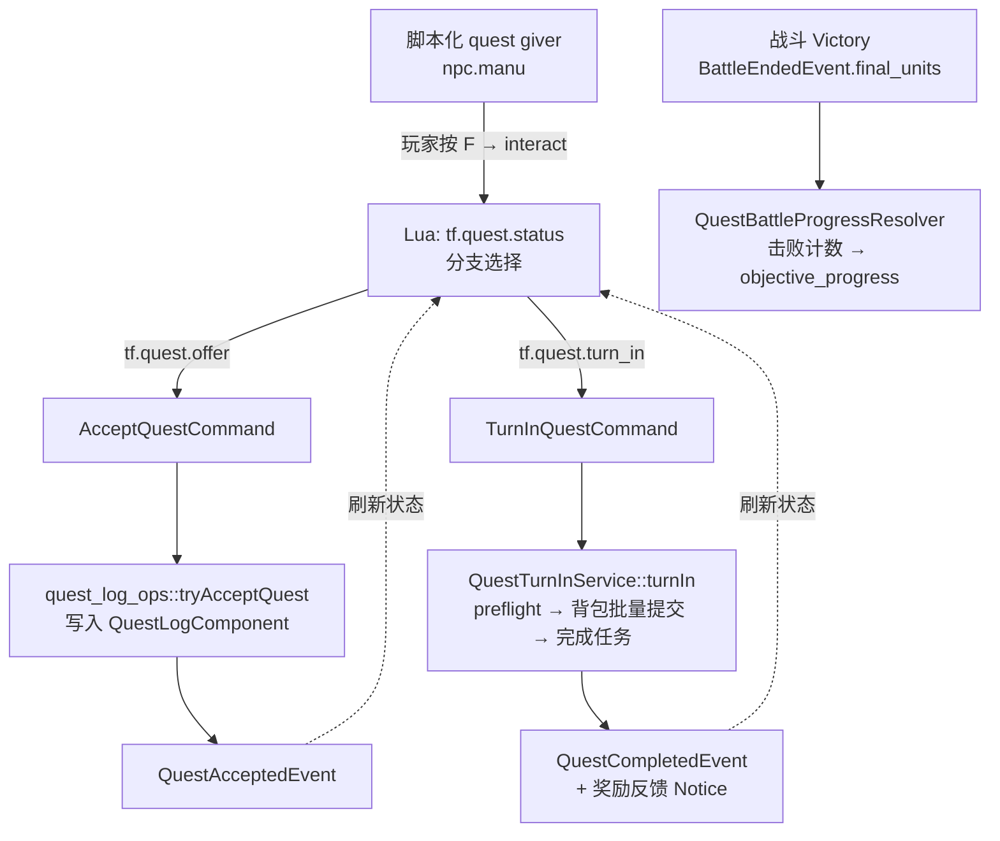
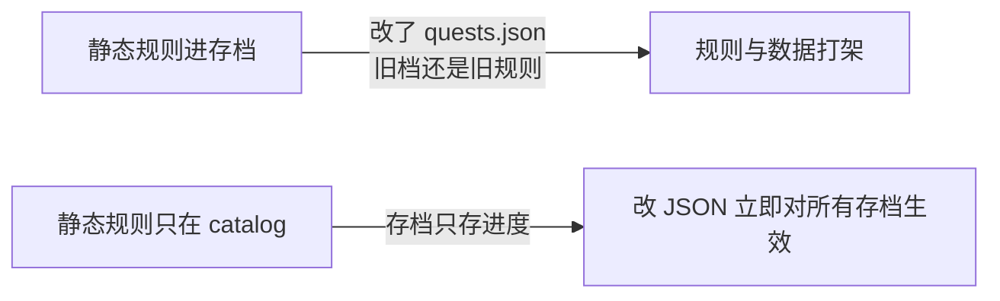
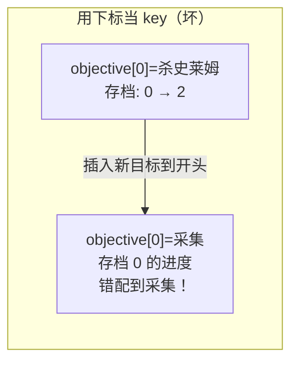
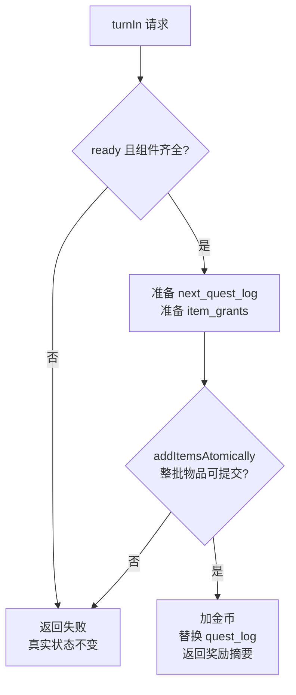
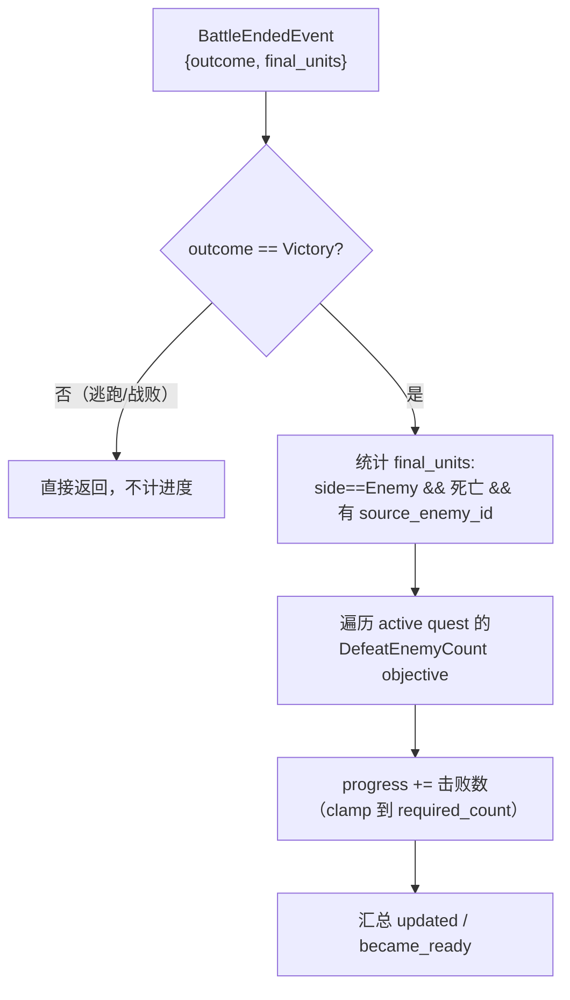
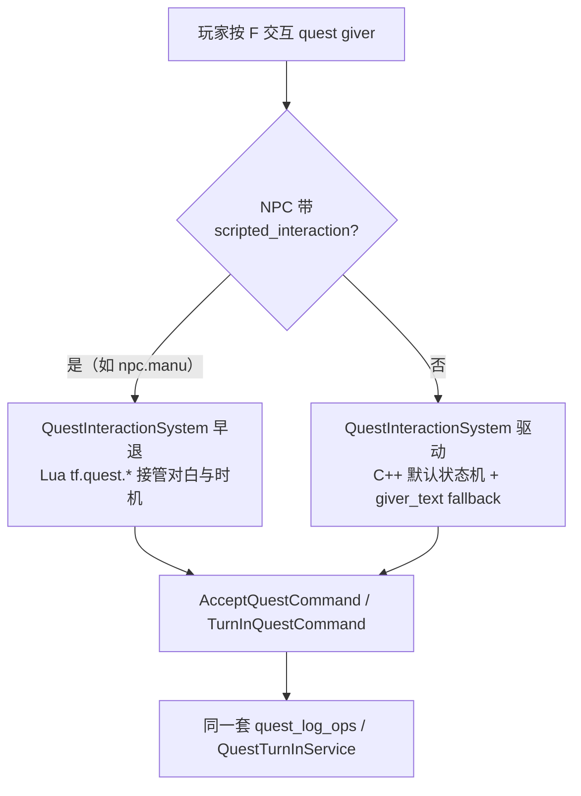

# L10 任务系统（领域服务首次深讲）

L09 把"静态真相"打通了——catalog 里躺着 enemy、item、quest 的规则数据。但数据本身不会动。本讲我们让它**跑起来**：实现一条完整的 JRPG 任务闭环——

> 找 NPC **接任务** → 出门打怪，系统**自动计数** → 回 NPC **交付** → **奖励写回**背包和钱包。

这条线看着简单，却是整个项目的一个缩影。它第一次把 L02 留下的悬念——**"为什么写入操作要集中到领域服务"**——用一个能跑、能测、能调试的真实系统讲透。本讲的主角是 [`QuestTurnInService`](../../src/game/domain/quest_turn_in_service.cpp)：你会看到一个领域服务到底长什么样、它的 **preflight → 原子写入 → 反馈** 三段式如何保证"要么全成功、要么不留痕迹"。看懂这一个，后面 L11 商店、L13 装备的所有服务都是同一个模子。

---

## 🎯 本讲目标

读完之后，你应该能回答：

1. 任务的"静态规则"和"运行时进度"分别存在哪里？为什么必须分开？
2. objective 进度为什么用 `quest_id::objective_id` 这种字符串复合 key，而不是用 objective 在数组里的下标？
3. 玩家交付任务时背包正好满了，会发生什么？奖励会"半发一半"吗？这个检查在代码的哪一步？
4. 同一个任务，能不能既被 Lua 脚本 NPC 触发、又被 C++ 默认流程触发？谁说了算？

---

## 👁️ 先看再讲：把 quests.json 和 NPC 脚本并排看

打开两个文件对照着读，5 分钟就能建立直觉。

**静态规则**——[`assets/data/quests.json`](../../assets/data/quests.json)（整个项目目前就一条任务）：

```json
{
  "id": "quest.village.goblin_cleanup",
  "title": "quest.village.goblin_cleanup.title",        // ← i18n key
  "objectives": [
    { "id": "kill_slimes", "kind": "defeat_enemy_count",
      "enemy_id": "enemy.slime", "required_count": 3 }
  ],
  "rewards": { "gold": 50, "items": [{ "item_id": "potion", "count": 2 }] }
}
```

**内容编排**——[`scripts/quests/village_goblin_cleanup.lua`](../../scripts/quests/village_goblin_cleanup.lua)：

```lua
tf.event.on("interact", function(evt)
    if evt.dialogue_handled or not is_giver(evt) then return end   -- 只认 npc.manu

    local status = tf.quest.status(quest.id)        -- offerable / in_progress / ready_to_turn_in / completed
    if status == "offerable" and tf.quest.is_available(quest.id) then
        handle(evt, { ...offer 对白... }, function() return tf.quest.offer(quest.id, evt.target) end)
    elseif status == "in_progress" then
        local progress = tf.quest.progress(quest.id, quest.objective_id)   -- {current=, required=}
        handle(evt, { ...进度对白... })
    elseif status == "ready_to_turn_in" then
        handle(evt, { ...交付对白... }, function() return tf.quest.turn_in(quest.id, evt.target) end)
    elseif status == "completed" then
        handle(evt, { ...已完成对白... })
    end
end)
```

**关键观察**：这个分工和 L06 那条边界严丝合缝——

- **JSON 只管"规则真相"**：打几只史莱姆、给多少钱、给什么物品。
- **Lua 只管"内容编排"**：按任务状态选哪段对白、什么时候调 `tf.quest.offer` / `tf.quest.turn_in`。
- **真正的状态写入**（接任务、记进度、发奖励）**全在 C++ 的领域服务里**——Lua 只是"请求"，从不自己改数据。

> **先动手**：打开 ImGui 的 **QuestDebugPanel**，点 `Accept` → `Fill`（一键填满进度）→ `Turn In`，观察背包多出 2 个 potion、金币 +50。再点 `Clear` 重来。这条链路你能在面板里反复跑，本讲就是把它背后的每一跳讲清楚。

---

## 🗺️ 关键链路



一句话记住：**Lua 发请求（command）→ 领域服务校验并原子写入 → 事件（event）通告 UI 与脚本**。这正是 L02 画的那个"命令 / 服务 / 事件"三角，本讲第一次落到真实代码上。

---

## 💡 核心知识点

### 1. 静态目录 vs 运行时真相：两个文件，两种生命周期

任务系统把数据切成泾渭分明的两半：

| | 持有者 | 内容 | 进存档吗 | 生命周期 |
| --- | --- | --- | --- | --- |
| **静态目录** | [`QuestCatalog`](../../src/game/data/quest_catalog.h) | 任务定义：objective / reward / 标题 | ❌ 不进（来自 JSON） | 启动加载，只读 |
| **运行时真相** | [`QuestLogComponent`](../../src/game/component/quest_log_component.h)（挂在玩家实体上） | 接了哪些、完成了哪些、各 objective 进度 | ✅ 进存档 | 随玩家存活，可变 |

`QuestLogComponent` 本身极简，就三个容器：

```cpp
struct QuestLogComponent {
    std::vector<std::string> active_quests{};                  // 进行中的 quest id
    std::vector<std::string> completed_quests{};               // 已完成的 quest id
    std::unordered_map<std::string, int> objective_progress{}; // progress key → 当前计数
};
```

**为什么必须分开？** 这是 L09"catalog 不进存档"原则的直接后果：



存档只记"你打到 1/3 了"，不记"这个任务要打 3 只"。后者永远从 catalog 读最新值。你把 `required_count` 从 3 改成 5，所有旧存档立刻按 5 算——因为存档里根本没存那个 3。

注意一个细节：`active_quests` / `completed_quests` 里存的是**字符串 id 而不是 hash**（对照 L09，这里特意选了可读性）。原因正是"要写进存档、要能在调试面板里一眼看懂"——存档和日志是字符串的地盘。

### 2. progress key：为什么是 `quest_id::objective_id` 而不是下标

一个任务可以有多个 objective，每个 objective 的进度怎么存？看 [`quest_data.h`](../../src/game/data/quest_data.h) 里那个被强制使用的 helper：

```cpp
inline constexpr std::string_view kQuestObjectiveProgressKeySeparator = "::";

inline std::string makeQuestObjectiveProgressKey(std::string_view quest_id, std::string_view objective_id) {
    return std::string{quest_id} + "::" + std::string{objective_id};
    // 例： "quest.village.goblin_cleanup::kill_slimes"
}
```

文档里有句硬规定：**禁止业务代码手写字符串拼接，必须走这个 helper**。为什么这么讲究？

**因为 key 一旦不稳定，进度就会错位甚至丢失。** 设想一个反例：用 objective 在数组里的**下标**当 key（`0`、`1`、`2`）。某天你在 `quests.json` 里调整了 objective 的顺序、或在中间插入了一个新目标——



存档里"下标 0 = 已完成 2"突然就指向了另一个 objective，进度静默错位。而 `quest_id::objective_id` 是**内容稳定**的——只要你不改 objective 的 `id` 字段，无论怎么增删排序、怎么改显示文案，进度永远跟对人。

这个复合 key 还顺带支撑了一个清理操作。看 [`quest_log_ops.cpp` 的 `eraseQuestProgress`](../../src/game/domain/quest_log_ops.cpp)：交付完成后要清掉这个任务的所有进度，它靠的就是**前缀匹配** `quest_id::`：

```cpp
const std::string prefix = std::string(quest_id) + "::";
for (auto it = quest_log.objective_progress.begin(); it != quest_log.objective_progress.end();) {
    if (it->first.rfind(prefix, 0) == 0) {   // key 以 "quest_id::" 开头
        it = quest_log.objective_progress.erase(it);
    } else { ++it; }
}
```

> **回到自测题 2**：选这种 schema 是为了**跨版本、跨重排的稳定性**——id 是内容契约，下标是排列顺序。前者你能保证不变，后者随时会变。

### 3. QuestTurnInService：领域服务的样板，逐段拆

这是本讲的核心。打开 [`quest_turn_in_service.cpp` 的 `turnIn`](../../src/game/domain/quest_turn_in_service.cpp)，它就是 L02 那句"preflight → 原子写入 → 反馈"的标准实现。逐段看：

**第 0 段——前置校验（NotReady）**：

```cpp
if (player 无效 || !quest_log_ops::isQuestReadyToTurnIn(quest_log, quest)) {
    return makeFailureResult(QuestTurnInStatus::NotReady, {});
}
```

**第 1 段——preflight（只检查，绝不写入）**。这是整个服务最关键的设计：

```cpp
// 1a. 需要钱包但没有 → 失败，未写任何东西
if (questNeedsWallet(quest) && wallet == nullptr) return MissingWallet;
// 1b. 需要背包但没有 → 失败
if (questNeedsInventory(quest) && inventory == nullptr) return MissingInventory;
```

**第 2 段——准备事务副本（仍然不改真实状态）**。任务状态先写在 `next_quest_log` 这份副本上：

```cpp
QuestLogComponent next_quest_log = quest_log;
quest_log_ops::completeQuest(next_quest_log, quest.id_);
quest_log_ops::eraseQuestProgress(next_quest_log, quest.id_);

std::vector<InventoryItemGrant> item_grants{};
for (const auto& reward_item : quest.rewards_.items_) {
    item_grants.push_back({reward_item.item_id_hash_, reward_item.count_});
}
```

这里看似已经 `completeQuest` 了，其实只是在副本上改。真实的 `quest_log` 此时还保持 active 状态，玩家背包和钱包也还没动。

**第 3 段——背包奖励批量原子写入**。物品奖励不再逐个 `addItem()`，而是交给 [`InventoryDomainService::addItemsAtomically`](../../src/game/domain/inventory_domain_service.cpp)：

```cpp
const auto mutation = inventory_domain_service_.addItemsAtomically(player, item_grants);
if (mutation.accepted != requested_item_count || mutation.rejected != 0) {
    return makeFailureResult(QuestTurnInStatus::InventoryFull, kInventoryFullMessage);
}
```

`addItemsAtomically()` 内部会把 `inventory.slots_` 复制成 `simulated_slots`，在这份副本上模拟整批 grant：任一物品 id 不存在、任一奖励放不下，就整批拒绝，真实背包不变；全部通过时才一次性替换真实槽位并触发一条 `InventoryChanged`。

**第 4 段——最终提交钱包和任务状态**。只有背包奖励已经整批成功，才进入最后提交：

```cpp
if (wallet && quest.rewards_.gold_ > 0) {
    wallet->gold_ += quest.rewards_.gold_;
}
quest_log = std::move(next_quest_log);
```

这就是"奖励是一笔交易"的落点：50 金币 + 2 瓶药水 + active/completed 状态迁移，必须**整笔成功或整笔不发**。如果直接边发边检查，可能出现"金币加了、药水放不下"的半成品状态；现在金币和任务状态都排在背包批量写入之后，失败时没有后续需要回滚。



这套不变量有**一排测试**钉死。看 [`quest_turn_in_service_test.cpp`](../../tests/game/quest_turn_in_service_test.cpp) 的用例名，几乎是把上面每条规则翻译成断言：

| 测试用例名 | 钉死的不变量 |
| --- | --- |
| `FullInventoryBlocksTurnInWithoutMutatingQuestOrRewards` | 背包满 → 任务状态和奖励**都不变** |
| `MissingWalletFailsBeforeMutatingQuestState` | 缺钱包 → 在改任务状态**之前**就失败 |
| `RewardPreflightUsesSingleAccumulatedInventoryCopy` | 多件奖励用**同一份**累加副本一起算容量 |
| `RewardWriteFailureKeepsQuestWalletAndInventoryUnchanged` | 物品写入失败 → quest / wallet / inventory **都不变** |
| `WritesGoldAndItemsWhenRewardsFit` | 放得下时金币和物品都正确写入 |
| `CompletesQuestWithoutRewardsAndClearsOnlyMatchingProgressKeys` | 清进度只清**这个**任务的 key |

> **回到自测题 3**：背包只剩 1 格、奖励是 2 种不同物品时，`addItemsAtomically()` 会在同一份槽位副本上发现整批放不下，返回 `InventoryFull`，**真实背包、钱包、任务状态全部不动**。金币不会先加，奖励也绝不会"半发一半"。

### 4. QuestBattleProgressResolver：进度从哪来——战斗结果

接了任务，进度怎么涨？答案不在任务系统内部，而在**战斗结束的那一刻**。看 [`quest_battle_progress_resolver.cpp`](../../src/game/domain/quest_battle_progress_resolver.cpp) 的 `apply`：



几条关键规则，每条都是有意为之：

- **只在 `Victory` 推进**：逃跑、战败不计数。
- **靠 `source_enemy_id` 计数，不从名字反推**：`final_units` 里每个死掉的敌人单位带一个 `source_enemy_id`（指回 catalog 的 `enemy.slime`）。缺这个字段就**显式跳过**，绝不靠显示名猜——又是"稳定 id 优先"（呼应 L08 / L09）。
- **clamp 到 `required_count`**：打多了不会溢出，进度最多到上限。
- **侦测"刚好满足"的边沿**：`apply` 会比较推进前后的 `isQuestReadyToTurnIn`，把"这场战斗后**刚变成**可交付"的任务单独列进 `became_ready_to_turn_in_quests`——这样 UI 能弹"任务可以交付了！"而不是每场战斗都提示。

这个 resolver 在 L20 战斗结算里会被 `GameScene` 调用，和奖励反馈合并成一条通知。本讲先建立"进度来自战斗 Victory"的因果即可，写回的完整编排留 L20。

### 5. 脚本化任务 NPC vs C++ fallback：谁拿走交互

一个 quest giver NPC，可以走两条路之一：



**关键点**：两条路最终都汇进**同一个领域层**。无论是 Lua 调 `tf.quest.offer`，还是 C++ 默认流程，背后都是 `tryAcceptQuest` / `QuestTurnInService::turnIn`——**规则只有一份**。Lua 和 C++ fallback 的区别只在"对白怎么演、什么时候触发"，不在"接任务这件事的规则"。

那么"谁优先"？看 [`quest-system.md`](../../docs/gameplay/quest-system.md) 的交互优先级：

```
Merchant > QuestGiver > Dialogue NPC > Chest > Rest
```

并且 `DialogueSystem` 检测到 `QuestGiverComponent` 时会主动跳过，避免一次按键被两个系统同时处理。而 `scripted_interaction=true`（L08）会让 `QuestInteractionSystem` 自己也早退，把舞台让给 Lua。

> **回到自测题 4**：同一个**任务**当然可以被两种 NPC 触发——因为规则在 domain，与谁触发无关。但同一个 **NPC 的同一次交互**只会被一条路处理，由 `scripted_interaction` 标签决定：挂了它，Lua 独占；没挂，C++ fallback 接手。

### 6. 任务系统的测试层级：新增玩法的最低安全网

任务系统是观察"一个玩法该怎么分层测试"的好样本。它的测试铺在 4 个层级上：

| 层级 | 测试文件 | 测什么 | 为什么在这一层 |
| --- | --- | --- | --- |
| **数据** | `quest_catalog_test` | 加载、查找、`validateReferences` | 断引用要 fail-fast（L09） |
| **领域** | `inventory_domain_service_test`、`quest_turn_in_service_test`、`quest_battle_progress_resolver_test` | 背包批量原子写入、任务交付原子性、击败计数规则 | **不依赖 UI / 场景**，纯逻辑，跑得快、覆盖失败路径 |
| **系统** | `quest_interaction_system_test` | 接取 / 进度 / 交付 / 重复接取保护 | 验证 command → 状态机的串联 |
| **场景/UI** | `quest_offer_scene_smoke_test`、`quest_tab_content_test` | 弹场景不崩、data model 绑定 | smoke 级，挡低级回归 |
| **脚本 / 存档** | `script_quest_flow_test`、`quest_save_roundtrip_test` | Lua 全流程、存档 roundtrip | 跨层契约 |

**优先级直觉**：新增一个领域服务，**先写 domain test**——它最便宜、最能覆盖"背包满 / 缺组件 / 重复操作"这些失败路径，而这些恰恰是最容易出 bug 的地方。scene smoke 是补充，不是替代。这个判断标准 L26 会再系统讲一遍。

---

## 📋 阅读清单

| 顺序 | 文件 / 章节 | 关注点 |
| :---: | --- | --- |
| 1 | [`docs/gameplay/quest-system.md`](../../docs/gameplay/quest-system.md) | **本讲核心阅读材料**——分层图、progress key 规则、turnIn 执行顺序、交互优先级、扩展指南 |
| 2 | [`assets/data/quests.json`](../../assets/data/quests.json) | 唯一一条任务的完整结构，对照数据模型字段 |
| 3 | [`scripts/quests/village_goblin_cleanup.lua`](../../scripts/quests/village_goblin_cleanup.lua) | 脚本化 quest giver 的标准写法：status 分支 + tf.quest.* |
| 4 | [`tests/game/quest_turn_in_service_test.cpp`](../../tests/game/quest_turn_in_service_test.cpp) | 用测试名反推任务交付必须守住的不变量 |
| 5 | [`tests/game/inventory_domain_service_test.cpp`](../../tests/game/inventory_domain_service_test.cpp) | `addItemsAtomically` 如何保证整批物品要么全进包、要么全拒绝 |
| 6 | [L02 领域服务与命令/事件边界](02-领域服务与命令事件边界.md) | 回看那个"命令 / 服务 / 事件"三角，本讲是它的第一个完整实例 |

---

## 🔑 源码入口

| 顺序 | 文件 | 你会看到什么 |
| :---: | --- | --- |
| 1 | [`src/game/domain/quest_turn_in_service.cpp`](../../src/game/domain/quest_turn_in_service.cpp) | **领域服务样板**——组件 preflight → 背包批量写入 → 钱包和任务状态提交 |
| 2 | [`src/game/domain/quest_log_ops.cpp`](../../src/game/domain/quest_log_ops.cpp) | 无状态操作集：tryAccept / isReady / complete / eraseProgress，全部围绕 progress key |
| 3 | [`src/game/data/quest_data.h`](../../src/game/data/quest_data.h) | 静态数据类型 + `makeQuestObjectiveProgressKey` helper |
| 4 | [`src/game/component/quest_log_component.h`](../../src/game/component/quest_log_component.h) | 运行时真相，三个容器，进存档 |
| 5 | [`src/game/domain/inventory_domain_service.cpp`](../../src/game/domain/inventory_domain_service.cpp) | `addItemsAtomically`：同一份背包副本上模拟整批 reward item，成功后一次性提交 |
| 6 | [`src/game/domain/quest_battle_progress_resolver.cpp`](../../src/game/domain/quest_battle_progress_resolver.cpp) | 战斗 Victory → 击败计数推进进度（铺垫 L20） |
| 7 | [`src/game/scene/quest_offer_scene.cpp`](../../src/game/scene/quest_offer_scene.cpp) | 接取确认弹窗——Lua `tf.quest.offer` 推、玩家确认后回 `AcceptQuestCommand` |
| 8 | [`src/game/system/quest_interaction_system.cpp`](../../src/game/system/quest_interaction_system.cpp) | C++ fallback 状态机 + scripted 早退 |

---

## ❓ 自测问题

1. **静态/运行时分离**：把 `quests.json` 里 `required_count` 从 3 改成 5，一个已经存档、进度为 2/3 的玩家读档后会看到几分之几？为什么存档里没存那个"3"？
2. **progress key**：如果改用 "objective 数组下标" 当 key，下面哪个操作会出问题——(a) 给任务**末尾**追加一个 objective、(b) 在任务**中间插入**一个 objective、(c) 只改某 objective 的显示文案？分别说明。
3. **奖励原子性**：玩家背包只剩 1 格空位，任务奖励是 2 种不同物品各 1 个。`turnIn` 会发生什么？金币（也是奖励的一部分）会先加上吗？哪些测试用例钉死了这个行为？
4. **进度来源**：玩家逃跑成功结束一场打了 3 只史莱姆的战斗，任务进度涨吗？为什么 `QuestBattleProgressResolver` 要靠 `source_enemy_id` 而不是敌人显示名来计数？
5. **触发权**：`npc.manu` 挂了 `scripted_interaction=true`。如果你把这个标签去掉，交互行为会怎么变？任务还能接吗？

---

## 🧪 最小练习

**目标**：给 `quest.village.goblin_cleanup` 加第二个 objective，跑通到交付——**全程不改一行 C++**。

1. **加 objective**：打开 [`assets/data/quests.json`](../../assets/data/quests.json)，在 `objectives` 数组里追加一个目标（`objectives` 本来就是数组，resolver 天然支持多目标）：
   ```json
   { "id": "kill_goblins", "kind": "defeat_enemy_count",
     "enemy_id": "enemy.goblin", "required_count": 2 }
   ```
2. **重启游戏**：现在这条任务要求"打 3 只史莱姆 **且** 2 只哥布林"才能交付。`isQuestReadyToTurnIn` 要求**所有** objective 都满足。
3. **用 QuestDebugPanel 验证**：`Accept` 接任务 → 用 `Progress` 分别推进两个 objective，或直接 `Fill`。观察只推进一个 objective 时 `Turn In` **仍然不可交付**，两个都满了才行。
4. **打真战斗验证**：分别打史莱姆群和哥布林群（troop 在 `assets/data/rpg/troops.json`），确认两个计数各自独立推进。新目标的进度可以在 **Quests 标签页** 看到（注意：Lua 里的进度对白只查了 `kill_slimes` 那一个，所以新目标的实时进度看 UI 标签页 / 调试面板更直观）。

**进阶（理解 Lua/C++ 边界）**：

- 想加一个 **"采集 3 个素材"** 的 objective 行不行？查一下 [`quest_data.h`](../../src/game/data/quest_data.h) 的 `QuestObjectiveKind`——目前**只有** `DefeatEnemyCount`。"采集计数"是一种**新规则**，需要在 C++ 里加一个新的 `QuestObjectiveKind` 枚举值 + 一个对应的 resolver（类比 `QuestBattleProgressResolver`），这**不是** Lua 能编排出来的。想一想：为什么"打怪计数"算规则真相（C++）、而"打完怪说什么话"算内容编排（Lua）？这正是 L06 那条边界的具体落点。

完成后回答：**加一个 `DefeatEnemyCount` 目标改了几个文件？加一个 `CollectItem` 目标又要改几个、分别在哪一层？**

---

## 📌 小结

- **静态 / 运行时分离**：规则在 `QuestCatalog`（JSON，不进存档），进度在玩家实体的 `QuestLogComponent`（进存档）。存档只记"打到几"，"要打几"永远从 catalog 读最新值。
- **progress key = `quest_id::objective_id`**：内容稳定的复合字符串，扛得住 objective 重排和文案变化；下标当 key 会在插入/重排时静默错位。强制走 `makeQuestObjectiveProgressKey` helper。
- **`QuestTurnInService` 是领域服务样板**：NotReady / 缺组件校验 → `next_quest_log` 副本准备 → `InventoryDomainService::addItemsAtomically()` 批量提交 reward item → 钱包和 quest log 最终提交。背包满或物品 id 异常都会整笔拒绝，绝不半发，一排 `..._test` 用例钉死不变量。
- **进度来自战斗 Victory**：`QuestBattleProgressResolver` 只在胜利时按 `source_enemy_id` 统计击败数，clamp 到上限，并侦测"刚变可交付"的边沿。
- **Lua 与 C++ fallback 共用一套规则**：`scripted_interaction` 决定单次交互谁来演，但 accept / turn-in 的规则真相只在 domain 一份。
- **测试分层**：domain test 最该先写（便宜、覆盖失败路径），system / scene smoke / save / script 逐层补充。

## 🚀 下节课预告

任务这个"领域服务样板"立住了，下一讲把**同一个模子**套到另一个核心玩法上。**L11 商店系统**会讲 `ShopCatalog` 的"买入按店隔离、卖出全局共享"、`ShopTransactionService` 的 `previewBuy/commitBuy` 两段式（又是一个 preflight → 原子写入！），以及脚本商人如何按时间和任务状态切换 `shop_id`。你会发现交易和任务交付，本质是同一套思路。下讲见。
