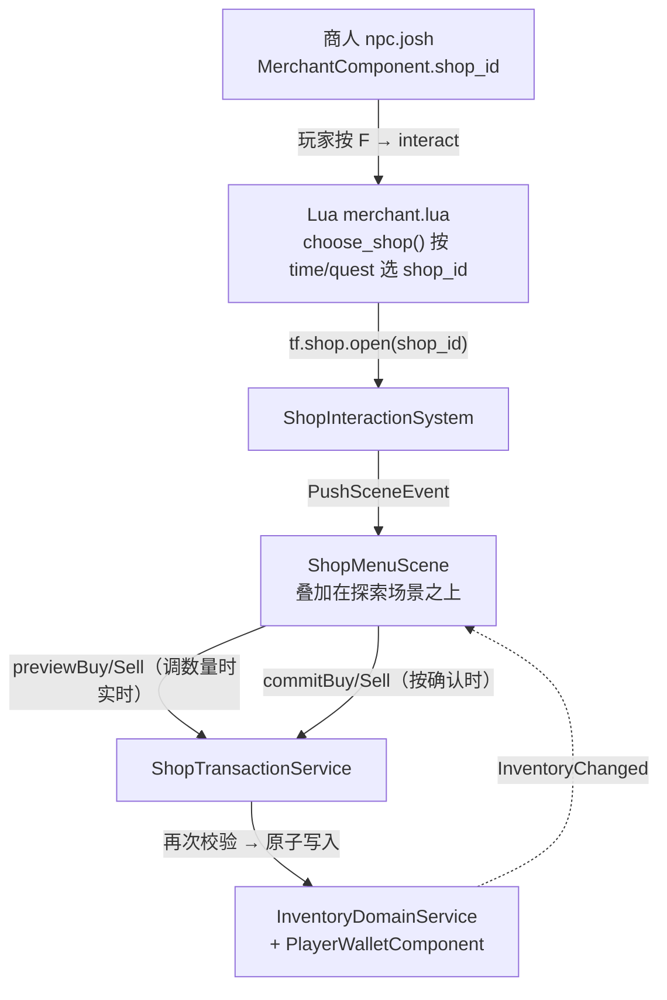
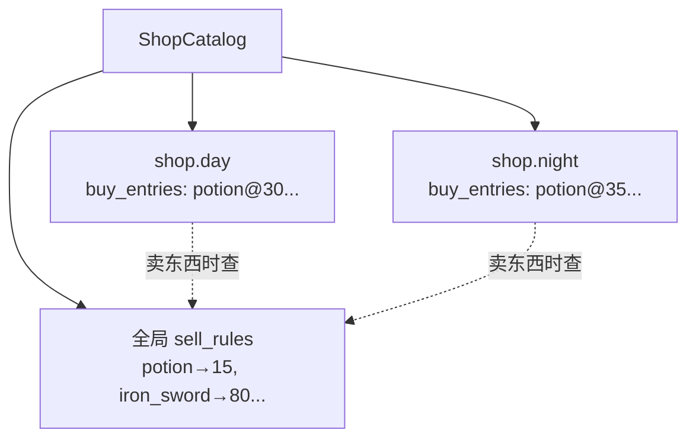
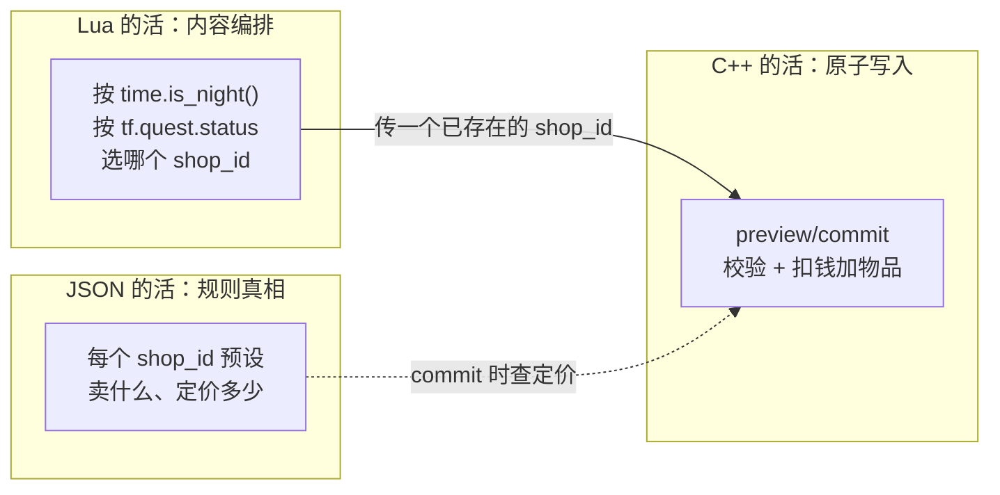

# L11 商店系统

L10 结尾我留了一句话：**交易和任务交付，本质是同一套思路。** 本讲就来兑现它。

任务交付的 `QuestTurnInService` 把"preflight → 原子写入"藏在一个私有的、一次性的 `turnIn` 里。商店要做同一件事，却多一个需求：**玩家在调数量时，UI 要实时显示"这笔花多少钱、买得起吗、背包放得下吗"**。这逼着我们把"那次 preflight"从私有内部步骤**提升成一个公开的、可反复调用的 `preview`**——UI 每帧拿它刷新预览，真正下单时再用 `commit` 重新校验一遍并写入。

于是同一个领域服务模子，在商店这里长出了它最清晰的形态：**preview / commit 两段式**。看懂 `ShopTransactionService`，你就同时理解了"为什么 preview 只读、commit 才写"以及"为什么 commit 还要再校验一次而不能信任刚才的 preview"。

---

## 🎯 本讲目标

读完之后，你应该能回答：

1. 为什么"每家店卖什么"按商店隔离，而"什么能卖、卖多少钱"却是全局一套规则？
2. `preview` 和 `commit` 之间，玩家的金币 / 背包可能已经变了。`commitBuy` 怎么保证不会基于过期的 preview 扣错钱？
3. 一个商人"白天卖 A、夜里卖 B、做完任务卖 C"——这个切换逻辑该写在 Lua 还是 C++？为什么？
4. Buy / Sell 都要输入数量，玩家会不会"卡在数量编辑框里出不来、连取消都按不了"？UI 状态机靠什么避免？

---

## 👁️ 先看再讲：4 个商店预设 + 一段选店脚本

打开 [`assets/data/shops.json`](../../assets/data/shops.json)，注意它有 **4 个 shop 预设**和**一个顶层 `sell_rules`**：

```json
{
  "shops": [
    { "id": "shop.village.general",                  "buy_entries": [ ...完整 fallback 列表... ] },
    { "id": "shop.village.general.day",               "buy_entries": [ ...白天货... ] },
    { "id": "shop.village.general.night",             "buy_entries": [ ...夜里货，potion 涨到 35... ] },
    { "id": "shop.village.general.post_slime_cleanup","buy_entries": [ ...任务后打折货... ] }
  ],
  "sell_rules": [                                      // ← 顶层，不属于任何一家店
    { "item_id": "potion", "sell_price": 15 },
    { "item_id": "equip_iron_sword", "sell_price": 80 }, ...
  ]
}
```

再打开 [`scripts/npcs/merchant.lua`](../../scripts/npcs/merchant.lua) 看商人 Josh 怎么选店：

```lua
local function choose_shop()
    if tf.quest.status(merchant.quest_id) == "completed" then
        return merchant.post_quest_shop_id, { tf.i18n.tr("dialogue.merchant.post_quest") }
    end
    if time.is_night() then
        return merchant.night_shop_id, { tf.i18n.tr("dialogue.merchant.night") }
    end
    return merchant.day_shop_id, { tf.i18n.tr("dialogue.merchant.day") }
end

tf.event.on("interact", function(evt)
    if evt.dialogue_handled or evt.target_actor_id ~= merchant.actor_id then return end
    local shop_id, lines = choose_shop()
    dialogue.start(evt.target, lines, function(interrupted)
        if not interrupted then tf.shop.open(shop_id, evt.target) end   -- ← 把选好的 shop_id 交给 C++
    end)
    evt.dialogue_handled = true
end)
```

**关键观察**——这又是 L06 那条边界，且比任务更直白：

- **Lua 只做一件事：从 4 个**已经定义好的** `shop_id` 里挑一个**（按夜晚、按任务状态）。它不决定每个预设里卖什么、卖多少钱。
- **每个预设卖什么、定价多少，是 `shops.json` 里的规则真相**。
- **交易本身**（扣钱、加物品、校验买得起）由 C++ `ShopTransactionService` 完成，Lua 碰都碰不到。

> **先动手**：打开 **ShopDebugPanel**，下拉选 `shop.village.general.night`，给自己 `Gold Seed` 加点钱，直接 Buy 一个 potion，观察金币扣 35（夜价）而不是 30（日价）。再选 `.day` 预设买，扣 30。同一个交易服务，库存随 `shop_id` 不同——这就是"按店隔离"。

---

## 🗺️ 关键链路



一句话记住：**Lua 选 `shop_id` → C++ push 商店场景 → preview 反复读、commit 一次写**。交易的规则与原子性永远在 `ShopTransactionService` 里。

---

## 💡 核心知识点

### 1. 买入按店隔离，卖出全局共享：两种数据归属

看 [`shop_data.h`](../../src/game/data/shop_data.h)，三个结构体的**归属关系**是设计的核心：

```cpp
struct ShopBuyEntryData { std::string item_id_; int buy_price_; std::optional<int> stock_; };
struct ShopSellRuleData { std::string item_id_; int sell_price_; };
struct ShopData {
    std::string id_;
    std::string title_, greeting_;
    std::vector<ShopBuyEntryData> buy_entries_;   // ← 买入条目，属于这一家店
};
```

`buy_entries_` 是 `ShopData` 的成员——**每家店各有各的进货单**。而 `ShopSellRuleData` **不在任何 `ShopData` 里**，它单独存在 `ShopCatalog` 的一张全局 map 上（`shops.json` 里也是顶层 `sell_rules` 数组）。



**为什么这样切？** 因为买和卖在 JRPG 里是不对称的两件事：

- **买**：每家店进货不同——武器店卖剑、杂货店卖药。所以买入条目天然按店走。
- **卖**：玩家想出手一把铁剑，**走进哪家店都该能卖、卖一个价**。如果让卖价也按店配置，你得在每家店重复写一遍所有物品的回收价，既冗余又容易写出"同一把剑这家收 80、那家收 50"的诡异规则。全局一套 sell_rules 是最省心、最符合直觉的默认。

查询 API 也对称地反映了这点（[`shop_catalog.h`](../../src/game/data/shop_catalog.h)）：`findBuyEntry(shop_id_hash, item_id_hash)` 要传**店 + 物品**两个参数，`findSellRule(item_id_hash)` 只要**物品**一个。

> **回到自测题 1**：进货是店的属性，回收是物品的属性。需要扩展"某店专属高价回收"时，文档的扩展指南也指明做法——给 `ShopData` 加 `sell_entries_`、`findSellRule` 优先查店内规则。但默认全局共享。

### 2. preview / commit 两段式：把 L10 的 preflight 公开化

这是本讲的核心。打开 [`shop_transaction_service.cpp`](../../src/game/domain/shop_transaction_service.cpp)，对照 L10 的 `QuestTurnInService` 看，你会发现是**同一个模子，拆成了两半**：

| | L10 `QuestTurnInService::turnIn` | L11 `ShopTransactionService` |
| --- | --- | --- |
| 校验阶段 | 私有，藏在 `turnIn` 内部 | **公开的 `previewBuy/Sell`**，UI 可反复调 |
| 写入阶段 | 同一函数后半段 | **独立的 `commitBuy/Sell`** |
| 为什么拆 | 一次性交付，不需要预览 | UI 调数量时要**实时**显示价格/能否成交 |

`previewBuy` 是**纯只读**的——它把买入从头校验一遍（玩家有效？有钱包背包？数量合法？店里卖吗？金额计算安全吗？买得起吗？背包放得下吗？），把结果填进 `ShopBuyPreview` 返回，**一个字节都不写**：

```cpp
if (!checkedMultiplyNonNegative(unit_price, quantity, preview.total_price)) {
    preview.failure_reason = ShopTradeFailureReason::InvalidQuantity;
    return preview;
}
preview.can_afford = wallet->gold_ >= preview.total_price;          // 只算，不扣
std::vector<ItemStack> simulated_slots = inventory->slots_;          // 拷贝副本
preview.has_space = simulateAdd(simulated_slots, ...);               // 在副本上模拟
```

`commitBuy` 才写。但**最关键的一行**是它的第一步——它**重新调用 `previewBuy`**：

```cpp
ShopBuyResult ShopTransactionService::commitBuy(...) const {
    const ShopBuyPreview preview = previewBuy(player, shop_id, item_id, quantity);  // ← 重新校验！
    if (!preview.canCommit()) {                                                     // 不满足就拒绝
        return makeBuyResultFromFailure(preview, current_gold);
    }
    const std::array<InventoryItemGrant, 1> grants{InventoryItemGrant{
        .item_id = item_id,
        .count = preview.resolved_quantity,
    }};
    const auto mutation = inventory_domain_service_.addItemsAtomically(player, grants);
    // ...原子 grant 失败则返回失败，金币未动...
    mutable_wallet->gold_ -= preview.total_price;                                   // grant 成功后再扣钱
    return /* 成功 result */;
}
```

三个设计点必须讲透：

**(a) commit 不信任 UI 传来的 preview，自己重新算一遍。** 玩家在 UI 上看到的 preview 是几帧前算的；从那一刻到按下确认，金币可能因为别的途径变少、背包可能被填满。如果 `commit` 直接用旧 preview 扣钱，就会出现"显示买得起、实际扣成负数"的 bug（经典的 TOCTOU——检查时和使用时状态不一致）。**`commit` 内部重新 `preview`，让校验和写入在同一个原子时刻发生**，是堵死这个缝的标准做法。

这条不变量有两个测试名直接钉死——[`shop_transaction_service_test.cpp`](../../tests/game/shop_transaction_service_test.cpp)：

- `BuyCommitFailsWhenStateChangesAfterPreview`
- `SellCommitFailsWhenStateChangesAfterPreview`

它们故意在 preview 之后偷偷改状态，断言 commit 仍能识别并拒绝。

**(b) 买入先做背包原子 grant，成功后再扣钱。** 顺序不是随便排的：`commitBuy` 不直接调 `addItem`，而是把这笔买入包装成 `InventoryItemGrant` 后交给 `InventoryDomainService::addItemsAtomically()`。这个接口先在槽位副本中模拟，全部可放入才一次性替换真实背包；失败时真实背包没动，金币也还没扣。反过来若先扣钱再写背包，写入却失败，玩家就"钱没了、东西没拿到"。Sell 方向是：重新 preview 指定槽位，`removeItem` 成功后再 `gold += total_price`，物品没扣成功就不会凭空加钱。

**(c) 金额计算也走失败路径。** 买入总价、买入后的剩余金币、卖出总价、卖出后的钱包金币都用 checked arithmetic。只要 `unit_price * quantity` 或 `gold +/- total_price` 会溢出，就返回 `InvalidQuantity`，并保持背包 / 钱包不变。对应回归测试直接覆盖这些边界：

- `BuyCommitRejectsOverflowedTotalPriceWithoutMutatingState`
- `SellCommitRejectsOverflowedTotalPriceWithoutMutatingState`
- `SellCommitRejectsOverflowedFinalGoldWithoutMutatingState`
- `BuyCommitRejectsPartialCapacityWithoutMutatingInventoryOrGold`

> **回到自测题 2**：preview 是给 UI 看的"此刻预估"，commit 是权威的"成交校验"。`commit` 重新 `preview` + `canCommit()` 把关，保证扣钱依据的是**下单瞬间**的真实状态，不是几帧前的快照。

### 3. Buy / Sell 的校验阶梯与失败枚举

`preview` 的校验是一级一级往下走的，任一级不过就带着对应的 `ShopTradeFailureReason` 早退。两个方向的阶梯不同：

```mermaid
flowchart TD
    subgraph BUY["previewBuy 阶梯"]
        B1["玩家有效 + 有钱包/背包"] --> B2["数量 > 0<br/>不可堆叠物品不买多个"]
        B2 --> B3["shop_id 存在"] --> B4["item 存在"]
        B4 --> B5["该店有这条 buy_entry<br/>否则 ItemNotSoldHere"]
        B5 --> B6["总价 / 扣后金币可安全计算<br/>否则 InvalidQuantity"]
        B6 --> B7["金币够<br/>否则 InsufficientGold"]
        B7 --> B8["副本模拟放得下<br/>否则 InventoryFull"]
    end
    subgraph SELL["previewSell 阶梯"]
        S1["玩家有效 + 有钱包/背包"] --> S2["数量 > 0"]
        S2 --> S3["item 存在"]
        S3 --> S4["全局 sell_rules 有此物<br/>否则 ItemNotSellable"]
        S4 --> S5["slot_index 有效且该槽确实是此物<br/>否则 SlotMismatch"]
        S5 --> S6["槽内数量够<br/>否则 InsufficientItemCount"]
        S6 --> S7["总价 / 加后金币可安全计算<br/>否则 InvalidQuantity"]
    end
```



Sell 多了两道 Buy 没有的检查——`SlotMismatch` 和 `InsufficientItemCount`，因为**卖东西要从背包的具体某个槽位扣**。`commitSell` 传的是 `slot_index`，保证"预览时看的那个槽"和"提交时扣的那个槽"是同一个；万一两次调用之间这个槽变了（物品被用掉、被移动），重新 preview 会撞上 `SlotMismatch` 而拒绝——又是 (a) 那条 TOCTOU 防线的体现。

失败原因是一个统一的 `ShopTradeFailureReason` 枚举（11 个值），UI 据此显示不同提示文本。注意 `InvalidQuantity` 不只是"数量小于等于 0"，也覆盖不可堆叠物品买多个、以及价格 / 钱包整数溢出这种"输入组合不安全"的情况。这种"用枚举表达失败原因、而不是用 bool / 异常"的做法，让领域服务的每条失败路径都可被测试单独断言（对照 shop_transaction_service_test 的一排 `...FailsWhen...` / `...Rejects...`）。

### 4. 脚本商人按时间/任务选 `shop_id`：内容编排 vs 规则真相

回到开头那段 `merchant.lua`。"白天卖 A、夜里卖 B、任务后卖 C"——**这个切换决策该写哪？答案是 Lua，而且理由值得说清**：



- **"夜里换货"是内容策略**：今天想改成"雨天换货"或"声望高换货"，应该改脚本一行，而不是重编译 C++。把它写进 C++ 等于把"运营策略"焊死进"规则引擎"。
- **每个预设的库存和定价是规则真相**：所以 `shop.village.general.night` 整个预设（包括 potion 涨价到 35）写在 `shops.json` 里。Lua 只是**选中**它，绝不在脚本里临时拼一套库存——那就违反了 L09 说的"不伪造第二套规则"。

这正是 L06 边界在商店上的落点：**Lua 从一组预定义 `shop_id` 里选，C++ 持有交易规则，JSON 持有库存定价**。三者谁都不越界。

### 5. ShopMenuScene：有状态的壳 + 无状态的导航决策

商店 UI 是一个覆盖式场景（`PushSceneEvent` 叠在 `GameScene` 上）。它的输入处理是本讲第二个值得学的模式。看 [`shop_menu_support.h`](../../src/game/ui/shop_menu_support.h)：

场景持有这些"状态"——模式（Buy/Sell）、分类 tab（Consumable/Equipment）、焦点区域：

```cpp
enum class ShopMenuFocusArea { ModeToggle, CategoryTabs, EntryList, Quantity, PrimaryAction };
```

但**焦点怎么跳转的决策逻辑，被抽成了一个纯函数**：

```cpp
ShopMenuNavigationDecision resolveShopMenuNavigation(const ShopMenuNavigationState& state,
                                                     ShopMenuNavigationInput input);
```

它吃一份"当前状态快照 + 一个方向输入"，吐出一个"下一步该怎么动"的决策（`next_focus_area / switch_mode / entry_delta / quantity_delta / confirm_trade`），**自己不持有任何状态**。这样 `ShopMenuScene` 只管"把按键喂给它、按决策更新 UI"，而所有跳转规则可以用 [`shop_menu_navigation_test.cpp`](../../tests/game/shop_menu_navigation_test.cpp) 脱离 RmlUi 单独测——和 L10 的 `quest_log_ops`、后面战斗的菜单模型是同一种"纯逻辑可测"的思路。

那"卡在数量编辑出不来"怎么避免？两点：

1. **数量不是一个模态输入框，而是一个焦点区域**。在 `Quantity` 区域，Left/Right 只是 `quantity_delta`，Down/Confirm 就移到下一区——它从来不"独占"输入。
2. **`menu_cancel` 在任意焦点区域都直接关店**。`ShopMenuScene::onMenuCancelPressed` 全局连着 `onClose()`（pop 回探索），不管你焦点停在哪。

> **回到自测题 4**：因为 quantity 是"焦点区域"而非"模态框"，每个区域都有明确的进/出路径（纯函数保证），加上 cancel 永远能整场退出——玩家不可能被困住。

### 6. 一个诚实的 TODO：`stock_` 字段

你可能注意到 `ShopBuyEntryData` 有个 `std::optional<int> stock_`。但翻遍 `ShopTransactionService`，**没有一处读它**。文档也写明了：

> `ShopCatalog` 会解析并保留 `stock_`，但当前交易服务和 UI 还不会消费、扣减或持久化它。本阶段运行时语义仍是"静态无限库存"。

这是一个**为后续"限量库存"功能预留的 schema 字段**——先把数据形状定下来（解析、存储），功能留到以后做。课程大纲的"后续可扩展方向"里，"限量库存"正是留给学生的练习。这种"schema 先行、功能后补"的做法在未上线项目里很常见，但要诚实标注，别让人以为它已经生效。

---

## 📋 阅读清单

| 顺序 | 文件 / 章节 | 关注点 |
| :---: | --- | --- |
| 1 | [`docs/gameplay/shop-system.md`](../../docs/gameplay/shop-system.md) | **本讲核心阅读材料**——preview/commit 时序、Buy/Sell 校验顺序、失败枚举、UI 状态机 |
| 2 | [`assets/data/shops.json`](../../assets/data/shops.json) | 4 个预设 + 顶层 sell_rules，对照"按店隔离 / 全局共享" |
| 3 | [`scripts/npcs/merchant.lua`](../../scripts/npcs/merchant.lua) | `choose_shop()` 选店 + `tf.shop.open`，对照 L06 边界 |
| 4 | [`tests/game/shop_transaction_service_test.cpp`](../../tests/game/shop_transaction_service_test.cpp) | 用 `...FailsWhenStateChangesAfterPreview`、`...RejectsOverflowed...` 等用例名反推不变量 |
| 5 | [L10 任务系统](10-任务系统.md) | 对照 `QuestTurnInService`——同一个领域服务模子的两种形态 |

---

## 🔑 源码入口

| 顺序 | 文件 | 你会看到什么 |
| :---: | --- | --- |
| 1 | [`src/game/domain/shop_transaction_service.cpp`](../../src/game/domain/shop_transaction_service.cpp) | **本讲核心**——preview 只读校验 + commit 重新校验后原子写入，checked arithmetic 与买入 atomic grant 顺序 |
| 2 | [`src/game/domain/shop_transaction_service.h`](../../src/game/domain/shop_transaction_service.h) | `ShopTradeFailureReason` 枚举、Preview/Result 结构、`canCommit()` |
| 3 | [`src/game/data/shop_data.h`](../../src/game/data/shop_data.h) + [`shop_catalog.h`](../../src/game/data/shop_catalog.h) | 买入按店、卖出全局的数据归属；`findBuyEntry` vs `findSellRule` 的参数差异 |
| 4 | [`src/game/component/merchant_component.h`](../../src/game/component/merchant_component.h) | 实例级 `shop_id_`，由地图属性附加 |
| 5 | [`src/game/ui/shop_menu_support.h`](../../src/game/ui/shop_menu_support.h) | 焦点区域枚举 + 纯函数 `resolveShopMenuNavigation` |
| 6 | [`src/game/system/shop_interaction_system.cpp`](../../src/game/system/shop_interaction_system.cpp) | `InteractCommand` / `tf.shop.open` → push `ShopMenuScene` |

---

## ❓ 自测问题

1. **数据归属**：你要新增一个"只在铁匠铺能用高价回收装备、别处只能原价"的需求。`sell_rules` 全局共享的现状挡路了吗？按扩展指南该怎么改，既保留全局默认又支持店内特例？
2. **TOCTOU**：玩家在商店 UI 上看到"potion 买得起"，但在他按确认前的那几帧里金币被别的途径扣到不够了。`commitBuy` 会扣出负数金币吗？代码哪一步拦住？哪个测试钉死了它？
3. **atomic grant 顺序**：`commitBuy` 为什么是"先 `addItemsAtomically()` 成功，再扣 gold"而不是反过来？如果背包只剩半个可用空间，这个顺序怎样避免"钱没了东西没到"？
4. **边界判断**：把商人改成"下雨天卖雨具"。查一下项目有没有 weather API——如果没有，这个需求当前能不能纯靠 Lua 实现？为什么"夜里换货"可以而"雨天换货"暂时不行？
5. **UI 卡死**：假设有人把 `menu_cancel` 的处理只绑在 `EntryList` 焦点区域。玩家在 `Quantity` 区域时会发生什么？现在的实现为什么不会有这个问题？

---

## 🧪 最小练习

**目标**：给商人加一个"深夜限定（22:00 之后）"库存预设，用 `tf.time` 触发切换——**全程不改 C++**。

1. **加预设**：在 [`assets/data/shops.json`](../../assets/data/shops.json) 的 `shops` 数组里加一个新店，卖点深夜特供的货：
   ```json
   {
     "id": "shop.village.general.deep_night",
     "title": "shop.village.general.deep_night.title",
     "greeting": "shop.village.general.deep_night.greeting",
     "buy_entries": [
       { "item_id": "potion", "buy_price": 50 },
       { "item_id": "equip_iron_sword", "buy_price": 150 }
     ]
   }
   ```
2. **加选店分支**：打开 [`scripts/npcs/merchant.lua`](../../scripts/npcs/merchant.lua)，在 `choose_shop()` **最前面**插一个深夜判断（`tf.time.hour()` 返回当前小时的浮点值，见 [`scripts/lib/time.lua`](../../scripts/lib/time.lua)）：
   ```lua
   if tf.time.hour() >= 22 then
       return "shop.village.general.deep_night", { tf.i18n.tr("dialogue.merchant.deep_night") }
   end
   ```
3. **补文案**：给新增的 i18n key（`shop.*.deep_night.*`、`dialogue.merchant.deep_night`）在 zh-Hans / en-US 都补上（L22 会细讲本地化；这里先照葫芦画瓢）。
4. **验证**：把游戏内时间推到 22:00 之后（用时间相关的调试入口，或在游戏里熬到深夜），和 Josh 交互，确认开的是 `deep_night` 预设、potion 卖 50。再用 `shop_catalog_test` / 启动日志确认新店通过了 `validateReferences`（别忘了 `equip_iron_sword`、`potion` 都得在 ItemCatalog 里——它们在）。

**进阶（理解为什么是 Lua）**：

- 把切换条件从"深夜"改成"完成 `quest.village.goblin_cleanup` **且** 是夜里"——只动 Lua 的 `choose_shop` 组合两个条件即可。体会：组合任意触发条件是**内容编排**，天然属于 Lua。
- 反过来想：如果要做"限量库存"（buy 一次 `stock_` 减一、售罄就不卖），这能纯靠 Lua 吗？为什么不能？（提示：看知识点 6——`stock_` 的扣减和持久化是**规则 + 存档**，得在 C++ 的 `ShopTransactionService` 和存档路径里做。）

完成后回答：**"深夜换货"改了几个文件、都在哪一层？"限量库存"又会动到哪几层？**

---

## 📌 小结

- **买入按店隔离、卖出全局共享**：`buy_entries_` 是 `ShopData` 成员（每家店各自进货），`sell_rules` 是 `ShopCatalog` 的全局 map（走进哪家都能卖、一个价）。`findBuyEntry` 要传店+物品，`findSellRule` 只传物品。
- **preview / commit 两段式**是 L10 领域服务模子的"公开化"版本：`preview` 纯只读、供 UI 实时显示；`commit` **内部重新 preview** 后才原子写入，堵死 TOCTOU。`canCommit()` 把关，金额 checked arithmetic 拒绝溢出，买入通过 `addItemsAtomically()` 原子 grant 成功后才扣金币。
- **校验是分级阶梯**，每级配一个 `ShopTradeFailureReason`；Sell 比 Buy 多 `SlotMismatch` / `InsufficientItemCount`，因为要从具体槽位扣并核对。
- **脚本商人按时间/任务选 `shop_id`**：选店是内容编排（Lua），库存定价是规则真相（JSON），交易是原子写入（C++）——L06 边界的又一次落点。
- **ShopMenuScene** 是有状态的壳 + 无状态的 `resolveShopMenuNavigation` 纯函数；数量是焦点区域而非模态框，`menu_cancel` 全局可退，玩家不会被困。
- **`stock_` 是预留 schema**：解析了但还没消费，运行时仍是无限库存——诚实标注的"先定形状、后补功能"。

## 🚀 下节课预告

到这里，探索侧的"获取"（任务奖励）和"交易"（商店买卖）都闭环了。但玩家还是孤身一人。**L12 队伍与招募**会把单人农场主扩展成 JRPG 队伍：`PartyComponent` / `RecruitableComponent` / `ActorIdentityComponent` 的职责划分、招募 offer 场景与脚本化招募对白、以及"招募成功后地图上那个 NPC 实体该怎么处理"。下讲见。
