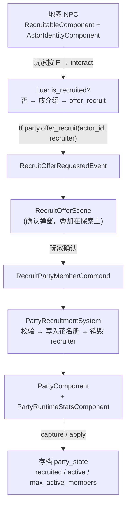
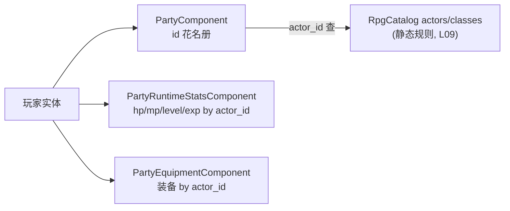
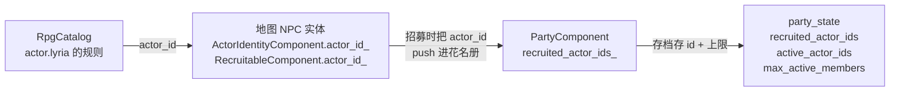
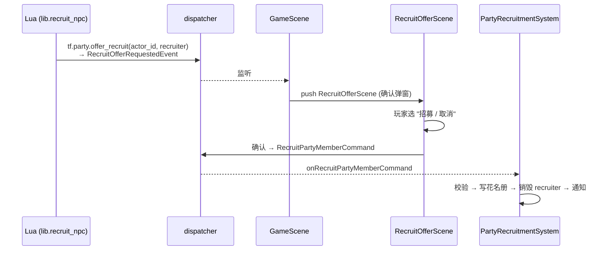
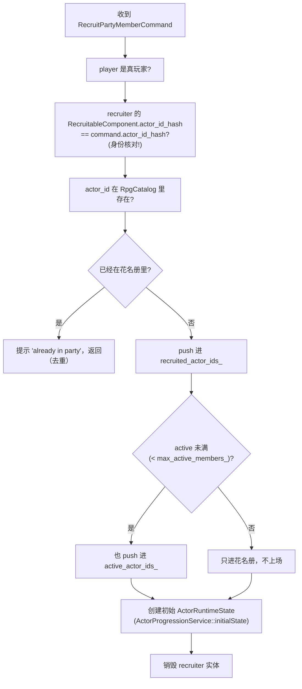
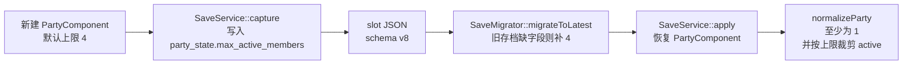

# L12 队伍与招募

任务、商店都闭环了，可主角还是孤身一人。JRPG 的灵魂是**一队人**——所以本讲把单人农场主扩展成可成长的队伍，并接上"在地图里遇到 NPC → 对话 → 招募入队"的流程。

招募流程本身又是一个熟悉的形状：**Lua 请求 → C++ 校验写入**（L10 任务、L11 商店都是这个模子）。但它带来一个全新的、值得想清楚的问题——**一个"队友"到底存在哪里？** 是地图上那个会走动的 NPC 实体吗？招募之后那个实体怎么办？玩家切了地图、读了存档，队友还在不在？

答案会颠覆一点直觉：**队友根本不是一个实体，而是一串 `actor_id` 字符串**。理解了这一点，"招募成功后那个 NPC 为什么要销毁、又为什么不能随手销毁"就全通了。

---

## 🎯 本讲目标

读完之后，你应该能回答：

1. 队伍成员的运行时状态挂在谁身上？为什么不是每个队友一个实体？
2. `PartyComponent` / `RecruitableComponent` / `ActorIdentityComponent` 各管什么？把它们串起来的"纽带"是什么？
3. 招募成功后，地图上那个 NPC 实体为什么不能直接 `destroy()`？正确的清理顺序是什么？
4. 队伍上限默认 4 从哪里来？它如何随存档保存，又如何兼容旧存档？

---

## 👁️ 先看再讲：一行注册一个可招募 NPC

打开 [`scripts/npcs/lyria.lua`](../../scripts/npcs/lyria.lua)——整个脚本就这么短：

```lua
local recruit_npc = tf.script.require("lib.recruit_npc")
assert(recruit_npc.register({
    actor_id = "actor.lyria",
    intro_lines     = function() return { tf.i18n.tr("dialogue.lyria.intro.1"), tf.i18n.tr("dialogue.lyria.intro.2") } end,
    recruited_line  = function() return tf.i18n.tr("dialogue.lyria.recruited") end,
}))
```

[`tori.lua`](../../scripts/npcs/tori.lua) 几乎一模一样，只是换了 actor_id 和文案。**招募 NPC 的全部交互逻辑被抽进了 [`lib.recruit_npc`](../../scripts/lib/recruit_npc.lua)**，每个 NPC 只填三样：身份 id、招募前对白、招募后对白。

再看 `lib.recruit_npc` 的核心——它就是一个状态分支：

```lua
tf.event.on("interact", function(evt)
    if evt.dialogue_handled or evt.target_actor_id ~= actor_id then return end
    if tf.party.is_recruited(actor_id) then
        handle(evt, recruited_lines)              -- 已入队：说招募后的话
        return
    end
    handle(evt, intro_lines, function()
        return tf.party.offer_recruit(actor_id, evt.target)   -- 未入队：放完介绍 → 弹招募确认
    end)
end)
```

**关键观察**：脚本只做两件事——**判断"招了没"（`tf.party.is_recruited`）**、**请求"招募确认"（`tf.party.offer_recruit`）**。它不写"怎么入队、入队上限、初始等级"——那些全是 C++ 的规则真相。又是 L06 那条边界。

> **先动手**：在游戏里找到 Lyria，对话把她招进队。再去找她——这次她说的是 `recruited_line`（招募后那句），而不是介绍词。这个"前后两套对白"的切换，就是 `tf.party.is_recruited` 在起作用。打开 InventoryMenu 的角色页，能看到她已经在队伍里。

---

## 🗺️ 关键链路



一句话记住：**Lua 请求招募确认 → 玩家在 Scene 里确认 → command 进 C++ → `PartyRecruitmentSystem` 校验并写入花名册**。和任务接取、商店交易是同一条"请求 / 确认 / 校验写入"骨架。

---

## 💡 核心知识点

### 1. 队友住在哪：一串字符串，不是一个实体

这是本讲最反直觉、也最关键的一点。看 [`party_component.h`](../../src/game/component/party_component.h)：

```cpp
struct PartyComponent {
    std::vector<std::string> recruited_actor_ids_{ "actor.player" };  // 已招募的全员花名册
    std::vector<std::string> active_actor_ids_{ "actor.player" };     // 当前参战阵容
    std::size_t max_active_members_{game::defs::kDefaultMaxActivePartyMembers}; // 参战上限
};
```

队伍就是**两个字符串列表 + 一个上限字段**：`recruited`（招过的所有人）、`active`（这次带谁上场）和 `max_active_members_`（最多几个人上场）。**没有"队友实体"这种东西**——Lyria 入队后，不是在玩家身边生成一个 Lyria 实体跟着跑，而是 `"actor.lyria"` 这个字符串被 push 进了 `recruited_actor_ids_`。

为什么这么设计？文档点明了原因：

> 这些状态都挂在玩家实体上，**因为队友不一定在当前地图中有独立实体**。

想想就明白：你招了 Lyria，然后切到另一张地图。Lyria 在新地图上并没有一个 NPC 实体（她又不是这张图的居民）。如果"队友 = 实体"，切图时她就消失了。所以队友的真相必须是**与地图实体解耦的、挂在玩家身上的数据**——一串 id + 几张按 id 索引的状态表：



`actor_id` 是查询一切的 key：用它去 `RpgCatalog` 查职业技能（静态规则）、去 `PartyRuntimeStatsComponent` 查当前 HP/MP（运行时真相，L13 细讲）、去 `PartyEquipmentComponent` 查穿了什么。这正是 L09"字符串 id 是人读、跨进程稳定的地盘"的又一次兑现——存档存的就是这些字符串 id。

注意 `recruited`/`active` 都默认包含 `"actor.player"`（[`party_ids.h`](../../src/game/defs/party_ids.h) 里 `kDefaultPlayerActorId = "actor.player"`），而且 `PartyRecruitmentSystem` 每次写入前都会 `ensureDefaultPartyActor`——**玩家永远在队里**，这是不变量，不靠数据正确性保证。同一个头文件里还集中定义了 `kDefaultMaxActivePartyMembers = 4`：它只决定新建队伍的初始上限；读档后，真实值以存档里的 `party_state.max_active_members` 为准。

### 2. 三个组件的职责划分，与那条贯穿的纽带

招募涉及三个组件，初学容易混。它们其实分工极清晰：

| 组件 | 挂在哪 | 管什么 | 生命周期 |
| --- | --- | --- | --- |
| [`ActorIdentityComponent`](../../src/game/component/actor_identity_component.h) | **地图 NPC 实体** | 给这个实体一个**稳定的脚本可寻址身份**（`actor_id_` + `blueprint_id_`） | 随地图实体存活 |
| [`RecruitableComponent`](../../src/game/component/recruitable_component.h) | **地图 NPC 实体** | 标记"这个 NPC 可招募"，记下他对应哪个 `actor_id` | 随地图实体存活（招募后实体销毁） |
| [`PartyComponent`](../../src/game/component/party_component.h) | **玩家实体** | 队伍花名册（一串 `actor_id`） | 随玩家存活，进存档 |

三者看似分散，其实被**同一个 `actor_id` 字符串**串成一条线：



`actor_id`（如 `"actor.lyria"`）就是这条线的"身份证号"：catalog 用它定义规则、地图实体用 `ActorIdentityComponent` 对外**广播**这个身份（让 Lua 能用 `evt.target_actor_id` 认出"这是 Lyria"，而不依赖易变的实体 handle 或显示名——呼应 L08）、招募时把它存进花名册、存档时序列化它、读档时再用它回 catalog 查语义。

> **回到自测题 2**：`ActorIdentityComponent` 的作用是**给一个活着的地图实体挂上稳定 actor_id**，让脚本和招募系统能稳定寻址它。而队友被招募后地图实体会销毁、队友以 `actor_id` 字符串的形态活在花名册里——所以真正"在两种形态下都存在"的不是这个组件，而是它承载的那个 **`actor_id` 身份**。玩家是唯一一个既是可控地图实体、又是花名册成员的 actor，在他身上两种形态同时成立。

### 3. 招募事件流：又一个"请求 / 确认 / 校验写入"

把招募拆成事件流，你会发现它和任务接取（L10）骨架完全一致，只是多了一个"玩家确认"环节：



两个 payload 的字段几乎一样（[`commands_recruit.h`](../../src/game/defs/commands_recruit.h) / [`events_recruit.h`](../../src/game/defs/events_recruit.h)）：

```cpp
struct RecruitOfferRequestedEvent { entt::entity player, recruiter; entt::id_type actor_id_hash; std::string actor_id; };
struct RecruitPartyMemberCommand  { entt::entity player, recruiter; entt::id_type actor_id_hash; std::string actor_id; };
```

**为什么中间要插一个 `RecruitOfferScene` 确认？** 因为招募是个**重大且不可轻易撤销**的决定（占一个队伍位、影响战斗）。和商店买卖一样，把"请求"和"真正写入"之间隔一个玩家显式确认，是覆盖式 Scene（L04）的典型用途。Lua 只负责把请求和 recruiter 递进去，**确认 UI 与写入都在 C++**。

### 4. PartyRecruitmentSystem：入队写入的校验清单

打开 [`party_recruitment_system.cpp`](../../src/game/system/party_recruitment_system.cpp) 的 `onRecruitPartyMemberCommand`，它是又一个领域写入的样板，逐项校验后才动数据：



几个值得记的点：

- **身份核对**：命令里带了 `recruiter` 实体和 `actor_id_hash`，系统会校验"这个 recruiter 实体的 `RecruitableComponent` 确实对应这个 actor_id"——防止伪造或错配（又是稳定 id 的价值）。
- **去重**：已在花名册里就只弹提示、不重复入队。
- **active 满则只进花名册**：超过 `max_active_members_` 时，新人进 `recruited` 但不进 `active`——招到了，但要玩家手动换上场。
- **入队即建状态**：`ActorProgressionService::initialState` 按 actor 的初始等级/职业算出初始 HP/MP/经验，写进 `PartyRuntimeStatsComponent`（L13 细讲）。

### 5. 销毁 recruiter：为什么不能"直接删"

入队成功后，地图上那个 Lyria NPC 就没用了——留着会让玩家重复招募、或看到"已经在队里的人还站在原地"。所以要销毁它。但**不能随手 `registry_.destroy(recruiter)`**。看 `removeRecruiterFromMap` 的清理顺序：

```cpp
void PartyRecruitmentSystem::removeRecruiterFromMap(entt::entity recruiter) {
    if (recruiter == entt::null || !registry_.valid(recruiter)) return;
    if (!registry_.all_of<RecruitableComponent>(recruiter)) return;

    helpers::emitDialogueHide(dispatcher_, DialogueChannel::Conversation, recruiter); // 1. 先收掉绑在它身上的对话
    helpers::emitDialogueHide(dispatcher_, NOTIFICATION_CHANNEL, recruiter);
    if (spatial_index_manager_ && spatial_index_manager_->isInitialized()) {
        spatial_index_manager_->removeColliderEntity(recruiter);                       // 2. 先从空间索引移除碰撞体
    }
    registry_.destroy(recruiter);                                                      // 3. 最后才销毁
}
```

**为什么不能直接删？** 因为这个实体被别处"引用"着：

- **对话系统**可能正显示一段绑定到 recruiter 的对白（招募前的介绍词）。若直接销毁，对话框还指着一个已死实体 → 悬垂引用。所以**先 `emitDialogueHide` 让对话主动收尾**。
- **空间索引**（碰撞检测用的网格）里登记着这个 recruiter 的碰撞体。直接销毁会在索引里留下指向死实体的脏条目 → 下次查询崩或撞空气。所以**先 `removeColliderEntity`**。
- 顺序是反的：**先解除所有外部引用，最后才 `destroy`**。

还有一层**时机**：销毁发生在整个入队流程的**最后一步**——recruiter 在确认弹窗（`RecruitOfferScene` 需要它当对话对象）和入队写入期间都还活着，确认成功、花名册写好了才销毁。

> **回到自测题 3**：销毁队友的地图实体**不会丢失队友**——队友的真相是花名册里的 `actor_id` 字符串（知识点 1），与这个实体无关。但销毁必须**按"先解引用、后销毁"的顺序**：先收对话、再出空间索引、最后 destroy，否则留下悬垂引用。

### 6. 队伍上限：是数据，也是一段存档 schema

回到 `max_active_members_`。它是 `PartyComponent` 的一个**成员字段**，默认值集中在 `game::defs::kDefaultMaxActivePartyMembers`（当前为 4）——**不是**散落在逻辑里的 `#define` 或魔法数字。这个区别很重要：

- 它是**运行时数据**：每个 `PartyComponent` 实例带自己的上限，可以在创建时按难度/剧情设不同值。
- 它**进存档**：当前 `party_state` 保存 `recruited_actor_ids`、`active_actor_ids` 和 `max_active_members`，意味着"队伍上限"是可以随存档变化的状态，而非编译期常量。
- 系统逻辑里所有"满没满"的判断都读这个字段（`party.active_actor_ids_.size() < party.max_active_members_`），改一处即可全局生效。



为什么要把它放进 schema？想象一个剧情：前期只能带 2 人，通关某段主线后升到 4 人。如果只把"默认 4"写在代码里，读档就会把玩家解锁后的上限冲掉；而现在它随 `party_state.max_active_members` 保存，读档恢复的是玩家那份队伍状态。

当前存档 schema 是 **v8**。v7 以及更早的存档里没有 `max_active_members`，所以 `SaveMigrator::migrateV7ToV8()` 会在 `party_state` 中补默认 4；如果存档里意外出现 0，`normalizePartyState()` / `SaveService::normalizeParty()` 会把它收敛到至少 1，避免"active 永远装不下任何人"这种坏状态。

当前它还没有从 JSON 配置加载（默认值集中在 `party_ids.h`），但**形态上它已经是数据而非硬编码**——想做成配置驱动，只需在初始化或剧情解锁时给这个字段赋值，无需改任何判断逻辑。

> **回到自测题 4**：4 是 `game::defs::kDefaultMaxActivePartyMembers` 给新建队伍的默认值；真正的运行时上限在 `PartyComponent::max_active_members_`，并写入 `party_state.max_active_members`。判断满员读字段，所以扩展成配置驱动或剧情解锁几乎零成本。

顺带收个尾：知识点 0 那个 `lib.recruit_npc` 把"招募 NPC 的交互状态机"抽成了一行 `register({...})`——这正是 L06/L08 内容层的价值：新增一个可招募角色，Lua 侧只是再 `register` 一次，C++ 一行不动。

---

## 📋 阅读清单

| 顺序 | 文件 / 章节 | 关注点 |
| :---: | --- | --- |
| 1 | [`docs/gameplay/party-equipment-rest-recruitment.md`](../../docs/gameplay/party-equipment-rest-recruitment.md)（招募 + 核心状态章节） | **本讲核心阅读材料**——四个组件、招募流程图、"新增可招募角色"步骤 |
| 2 | [`scripts/npcs/lyria.lua`](../../scripts/npcs/lyria.lua) + [`scripts/lib/recruit_npc.lua`](../../scripts/lib/recruit_npc.lua) | 招募 NPC 的最简写法 + 共享状态机 |
| 3 | [`src/game/component/party_component.h`](../../src/game/component/party_component.h) + [`src/game/defs/party_ids.h`](../../src/game/defs/party_ids.h) | 队伍真相只是两个 id 列表 + 一个上限；默认玩家与默认上限集中定义 |
| 4 | [`src/game/save/save_data.h`](../../src/game/save/save_data.h) + [`src/game/save/save_migrator.cpp`](../../src/game/save/save_migrator.cpp) | `party_state.max_active_members`、schema v8 和旧存档迁移 |
| 5 | [L08 脚本事件桥与 Tiled 接入](08-脚本事件桥与Tiled接入.md) | 回看 `actor_id` 作为稳定脚本身份的来历 |

---

## 🔑 源码入口

| 顺序 | 文件 | 你会看到什么 |
| :---: | --- | --- |
| 1 | [`src/game/system/party_recruitment_system.cpp`](../../src/game/system/party_recruitment_system.cpp) | **本讲核心**——入队校验清单 + `removeRecruiterFromMap` 的"先解引用后销毁" |
| 2 | [`src/game/component/party_component.h`](../../src/game/component/party_component.h) + [`recruitable_component.h`](../../src/game/component/recruitable_component.h) + [`actor_identity_component.h`](../../src/game/component/actor_identity_component.h) | 三个组件的字段，对照职责表 |
| 3 | [`src/game/defs/commands_recruit.h`](../../src/game/defs/commands_recruit.h) + [`events_recruit.h`](../../src/game/defs/events_recruit.h) | 招募 command / event 的字段（player / recruiter / actor_id） |
| 4 | [`src/game/scene/recruit_offer_scene.cpp`](../../src/game/scene/recruit_offer_scene.cpp) | 确认弹窗 Scene：event → push → 确认 → command |
| 5 | [`src/game/system/recruitment_interaction_system.cpp`](../../src/game/system/recruitment_interaction_system.cpp) | 非脚本 fallback（对照 scripted 路径如何早退） |
| 6 | [`src/game/save/save_service.cpp`](../../src/game/save/save_service.cpp) + [`src/game/save/save_data.cpp`](../../src/game/save/save_data.cpp) + [`src/game/save/save_migrator.cpp`](../../src/game/save/save_migrator.cpp) | 队伍状态捕获 / 恢复、`max_active_members` 序列化和 v7→v8 迁移 |

---

## ❓ 自测问题

1. **队友的家**：你招了 Lyria 后切到另一张她不居住的地图。她为什么没"消失"？如果队友是"地图实体"会出什么问题？
2. **三组件**：`ActorIdentityComponent` 和 `RecruitableComponent` 都挂在地图 NPC 上、都带 `actor_id`，它们能合并成一个吗？分开有什么好处？（提示：不是所有有身份的 NPC 都可招募。）
3. **销毁顺序**：把 `removeRecruiterFromMap` 改成第一行直接 `registry_.destroy(recruiter)`，可能出现哪两类 bug？分别和哪个外部系统的引用有关？
4. **时机**：recruiter 实体能不能在玩家"确认招募"**之前**就销毁？为什么 `RecruitOfferScene` 期间它必须还活着？
5. **上限**：要做一个"剧情前期队伍上限 2、后期解锁到 4"的需求，你会改哪里？需要动判断逻辑吗？为什么读档后不应该回到默认 4？
6. **迁移**：旧 v7 存档没有 `party_state.max_active_members`。迁移到当前版本后，这个字段应该是什么值？如果有人手改成 0，系统为什么还要把它收敛到至少 1？

---

## 🧪 最小练习

**目标**：给 Lyria 加一段"招募后才说的支线对白"，验证 `is_recruited` 的状态切换——**全程不改 C++**。

1. **把单行招募后对白换成多行支线**：打开 [`scripts/npcs/lyria.lua`](../../scripts/npcs/lyria.lua)，把 `recruited_line`（单行）改成 `recruited_lines`（多行，`lib.recruit_npc` 两者都支持，见其第 48 行 `recruited_lines or recruited_line`）：
   ```lua
   recruited_lines = function()
       return {
           tf.i18n.tr("dialogue.lyria.recruited"),
           tf.i18n.tr("dialogue.lyria.sidequest.hint"),   -- ← 新增的招募后支线提示
       }
   end,
   ```
2. **补文案**：给新 key `dialogue.lyria.sidequest.hint` 在 zh-Hans / en-US 都补上（L22 细讲本地化）。
3. **验证状态切换**：进游戏，**招募前**和 Lyria 对话 → 听到的是 `intro` 介绍词；**招募后**再对话 → 听到 `recruited` + 新增的支线提示。这就是 `tf.party.is_recruited(actor_id)` 在分支。

**进阶（理解 helper 的坑）**：

- 想做"招募后**第一次**对话才提示支线，之后恢复普通问候"——需要用 `tf.state`（L06 的持久化）记一次性 flag。但**注意一个坑**：`lib.recruit_npc` 在 `register` 时会调用一次你的 lines 函数做校验（`valid_lines`），所以**不要把 `tf.state.set(...)` 写进 lines 函数里**——否则 bootstrap 加载脚本时就把 flag 置上了。想清楚：这种"一次性副作用"应该放在哪个时机才安全？
- 思考：为什么"招募后说什么"是 Lua 的活，而"招募后队伍上限 +1"得是 C++ 的活？

完成后回答：**加这段支线对白改了几个文件、都在哪一层？**

---

## 📌 小结

- **队友是字符串不是实体**：`PartyComponent` 用两个 `actor_id` 列表（`recruited` / `active`）+ 一个上限表达队伍，挂在玩家身上。因为"队友不一定在当前地图有实体"，把真相与地图实体解耦，切图/读档都不丢人。
- **`actor_id` 是贯穿一切的纽带**：catalog 规则、地图实体身份（`ActorIdentityComponent`）、可招募标记（`RecruitableComponent`）、花名册、存档，全用同一个字符串 id 串起来。
- **招募是又一个"请求/确认/校验写入"**：Lua `offer_recruit` → `RecruitOfferRequestedEvent` → `RecruitOfferScene` 确认 → `RecruitPartyMemberCommand` → `PartyRecruitmentSystem` 校验（身份核对 + 去重）后写花名册、建初始状态。
- **销毁 recruiter 要"先解引用后销毁"**：先 `emitDialogueHide` 收对话、再出空间索引、最后 `destroy`；且只在确认入队后销毁。销毁实体不丢队友——队友活在花名册字符串里。
- **队伍上限是数据**：`max_active_members_` 是进存档的运行时字段，新建默认来自 `kDefaultMaxActivePartyMembers`（4），当前通过 `party_state.max_active_members` 进入 schema v8；判断满员读字段，改成配置驱动或剧情解锁几乎零成本。
- **`lib.recruit_npc`** 把招募 NPC 的状态机抽成一行 `register`，新增角色 C++ 一行不动。

## 🚀 下节课预告

队伍有了，可他们现在还只是花名册上的名字。**L13 装备、成长与休息**会给他们"血肉"：actor / class / equipment 三层属性如何合成战斗单位、`EquipmentDomainService` 怎么原子地换装、`ActorProgressionService` 怎么用经验推导等级、`PartyRestService` 怎么恢复 HP/MP。还会埋下一个为战斗服务的关键设计——**装备不直接改战斗单位，入场时才解析快照**。下讲见。
