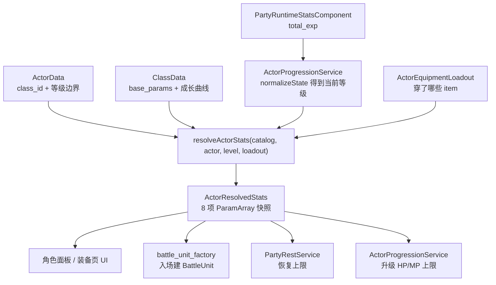
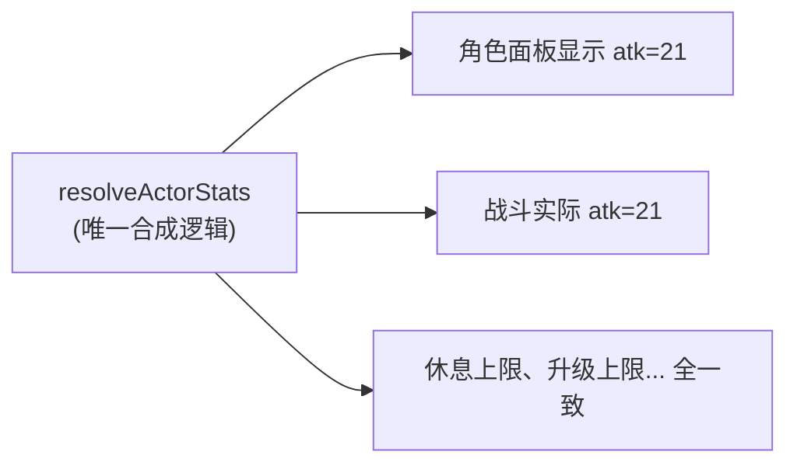
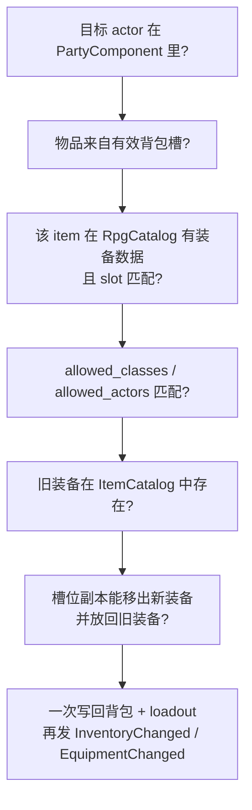

# L13 装备、成长与休息

L12 把队友招进了花名册，但他们现在只是几个 `actor_id` 字符串——没有攻击力、没有血量、升不了级、伤了也不会回。本讲给他们"血肉"：**装备、职业、等级、经验如何共同算出一个角色的战斗属性，休息又如何把 HP/MP 补回来**。

这一讲有一个贯穿始终的主角：[`resolveActorStats`](../../src/game/battle/actor_stats_resolver.cpp)——一个**纯函数**，输入"哪个 actor、几级、穿了什么装备"，输出"这个角色此刻的 8 项战斗属性"。它看似不起眼，却是整个 RPG 数值系统的**唯一真相点**：角色面板上的攻击力、战斗里实际打出的伤害、休息能回多少血、升级 HP 上限涨多少——**全都问它要答案**。理解了"为什么所有人都查同一个函数"，你就理解了本讲最重要的一个工程决策，也顺带看懂了它埋给 L16 战斗的伏笔：**装备从不"进入"战斗单位，入场时只拍一张属性快照**。

---

## 🎯 本讲目标

读完之后，你应该能回答：

1. 装备一把武器后，"角色面板"上的攻击力是从哪算出来的？战斗里实际用的又是哪个数？两者为什么必然一致？
2. 一个角色的属性，由 actor、class、equipment 三者怎么合成？谁提供基础值、谁随等级长、谁是固定加成？
3. 升一级后 HP 上限涨了，当前 HP 会被补满吗？这个策略写在哪？
4. 休息恢复为什么是"打开对话框预览 → 确认才生效"的显式调用，而不是在 `update()` 里每帧检测？

---

## 👁️ 先看再讲：换把武器，看攻击力跳变

进游戏打开 InventoryMenu，切到 **Equipment 标签页**，给玩家装上 `equip_wooden_sword`（攻击 +2）。再切到 **Character 标签页**，看攻击力数值涨了 2。脱下来，又掉回去。

这个再普通不过的交互，背后是本讲的核心事实：

- **Character 面板的攻击力**来自 [`inventory_menu_character_panel.cpp`](../../src/game/scene/inventory_menu_character_panel.cpp) 调用 `resolveActorStats`。
- **Equipment 标签页的属性预览**来自 [`equipment_tab_content.cpp`](../../src/game/ui/equipment_tab_content.cpp) 调用 `resolveActorStats`。
- **真打起来的攻击力**来自 [`battle_unit_factory.cpp`](../../src/game/battle/battle_unit_factory.cpp) 调用 `resolveActorStats`。

**同一个函数，同一套输入，同一个结果**——所以你在面板上看到的攻击力，和你在战斗里打出的攻击力，**不可能对不上**。这不是靠"小心地把两处逻辑写一致"维持的，而是因为根本只有一处逻辑。本讲的最小练习，就是利用这一点：改一个装备数值，验证面板和战斗同步跳变。

---

## 🗺️ 关键链路



记住这张图的形状：**一切需要"角色属性"的地方，都汇聚到 `resolveActorStats` 这一个点**。它不持有状态、不写数据，只做纯计算——给它 actor + level + loadout，还你一份 `ParamArray`。

---

## 💡 核心知识点

### 1. 属性合成顺序：class 基础/曲线 → + 装备 → 下限保护

打开 [`actor_stats_resolver.cpp`](../../src/game/battle/actor_stats_resolver.cpp)，`resolveActorStats` 三步走，顺序就是合成顺序：

```cpp
result.params = baseParamsForActor(catalog, actor, level);  // 1. class 基础值 + 按等级走曲线
applyEquipmentBonuses(catalog, loadout, result.params);     // 2. 叠加装备固定加成
clampMinimumStats(result.params);                           // 3. 每项至少为 1
```

**第 1 步的细节值得看清**——属性的"基础"其实来自**职业（class）而非 actor 本身**：

```cpp
params = klass->base_params_;                  // 先全盘取 class 的 8 项基础值
if (klass->has_param_curves_) {
    for (每个 param i) {
        if (curve[i].configured_)
            params[i] = interpolateParamCurve(curve[i], level, max_level);  // 配了曲线的项，按等级插值覆盖
    }
}
```

所以三者的分工是：

| 来源 | 提供什么 |
| --- | --- |
| `ActorData`（actor） | `class_id`（用哪个职业）+ `initial_level_`/`max_level_`（曲线的等级定义域） |
| `ClassData`（class） | `base_params_`（无曲线项的取值）+ 每项可选的**成长曲线**（有曲线项按等级插值） |
| `EquipmentData`（装备） | 每件装备的 `param_bonuses_`，**固定加法**叠加 |

成长曲线把等级 `level` 映射成 `[level_1, level_max]` 之间的插值，`shape`（Linear / Early / Late）决定快慢节奏（Early 前期猛涨、Late 后期才起飞）。这就是 L09 里 `classes.json` 那些 `param_curves` 字段的用武之地。

> **回到自测题 2**：actor 只说"我是剑士、等级范围 1–99"，真正的基础数值和成长曲线都在 **class**；装备是最后那层**固定加成**。这也解释了为什么 L09 的 `equipment.json` 里装备只写 `param_bonuses`——它就是这一步的加数。

### 2. 一个纯函数，六个消费者：数值一致性的根本保证

`resolveActorStats` 被谁调用？全项目数一数：

```
battle_unit_factory.cpp          ← 战斗入场建单位
inventory_menu_character_panel   ← 角色面板
equipment_tab_content.cpp        ← 装备页摘要 / 预览
actor_progression_service.cpp    ← 升级算 HP/MP 上限
party_rest_service.cpp           ← 休息算恢复上限
item_use_system.cpp              ← 用药时算 HP 上限
```

**六个消费者，零份重复逻辑。** 任何需要"这个角色 8 项属性是多少"的地方，都不自己算，而是调这一个纯函数。这带来一个几乎免费的强保证：



> **回到自测题 1**：面板攻击力和战斗攻击力都来自 `resolveActorStats(catalog, actor, level, loadout)`——**同一个函数**。它们一致不是因为有人小心同步了两处代码，而是因为压根只有一处。这正是把"属性合成"抽成无依赖纯函数的工程价值：消灭"显示和实战对不上"这类经典 RPG bug 的滋生土壤。

### 3. `total_exp` 是等级真源，`level` 只是缓存

看 [`party_runtime_stats_component.h`](../../src/game/component/party_runtime_stats_component.h) 的 `ActorRuntimeState`：

```cpp
struct ActorRuntimeState { int current_hp; int current_mp; int level; int total_exp; };
```

`level` 和 `total_exp` 都存了，看似冗余。但 [`actor_progression_service.cpp`](../../src/game/domain/actor_progression_service.cpp) 立了一条铁规矩：**`total_exp` 是等级的唯一真源，`level` 只是缓存**。`normalizeState` 每次都从经验重新推导等级：

```cpp
state.total_exp = std::clamp(state.total_exp, min_exp, max_exp);
state.level = levelForExp(catalog, actor, state.total_exp);   // ← 从经验反推等级，不信任存进来的 level
// 再用 resolveActorStats(level) 把 current_hp/mp clamp 到当前上限内
```

**为什么这样？** 因为如果信任存档里的 `level`，一旦经验曲线（`classes.json` 的 `exp_curve`）被调整、或存档里的 level 和 exp 因 bug 不一致，就会出现"经验够了但等级没涨"或反之。让经验当唯一真源、等级随时可重算，存档就只需老实存 `total_exp`，读档时 `normalizeState` 自动对齐——这和 L10 任务"存进度不存规则"、L09"存 id 不存语义"是同一种思路：**存最小事实，其余推导**。测试 `NormalizeUsesTotalExpAsLevelSource` 钉死了这条。

Equipment 标签页也遵守这条规则。`EquipmentTabContent::makeActorSummary` 会先从 `PartyRuntimeStatsComponent` 找到当前 actor 的运行时状态，经 `ActorProgressionService::normalizeState` 得到当前等级，再把这个等级交给 `resolveActorStats`。只有运行时状态不存在时，它才回退到 `initialState`。所以装备页顶部的 Lv/HP/MP/ATK/DEF 摘要不会停在 `ActorData::initial_level_`，而是跟角色真实经验同步。

### 4. 升级时 current HP 加"上限增量"，而不是补满

自测题 3 是个容易想当然的点。看 `grantExperience` 里升级那一刻的处理：

```cpp
if (grant.leveledUp()) {
    state.current_hp += grant.hp_max_delta;   // 当前 HP 加上"上限涨了多少"
    state.current_mp += grant.mp_max_delta;
}
state.current_hp = std::clamp(state.current_hp, 0, new_max_hp);
```

**策略是：升级时，当前 HP 增加的量 = HP 上限增加的量，而不是回满。** 举例：你 30/50 血时升级，新上限变 60（涨了 10），那么你变成 **40/60**——保留了原来"缺的 20 点"，只把多出来的 10 点上限同步补进当前值。

这是经典 JRPG 手感：升级不等于免费全恢复（那会让"休息/药水"失去意义），但也不会因为上限变高反而显得"更残血"。测试 `GrantsExperienceLevelsUpAndAddsMaxStatDelta` 验证了这个 delta 行为。

注意区分两条路径：**升级（`grantExperience`，leveledUp 时）才 += delta**；而**读档规范化（`normalizeState`）只 clamp、不加 delta**——后者是"把状态对齐到当前上限"，前者才是"成长那一下的奖励"。两者都用 `resolveActorStats` 取上限，所以上限值永远一致。

### 5. EquipmentDomainService：又一个 preflight → 原子写入

换装也是写入操作，所以它同样集中在领域服务里。看 [`equipment_domain_service.h`](../../src/game/domain/equipment_domain_service.h) 的入口：

```cpp
EquipmentMutationResult equipItem(player, actor_id, inventory_slot_index, target_slot);
EquipmentMutationResult unequipItem(player, actor_id, slot, preferred_inventory_slot = -1);
```

`equipItem` 要协调三方——把物品从**背包槽位**取出、放进 **actor 的 loadout**、把换下来的旧装备**塞回背包**。它现在不是先调 `InventoryDomainService::removeItem` 再调 `addItem` 的分段提交，而是在 `EquipmentDomainService` 内拿一份 `InventoryComponent::slots_` 副本预演最终背包形态，确认整笔能成后才一次写回背包和 loadout。



最后两条尤其体现原子性：替换 / 卸下的旧装备如果连 `ItemCatalog` 都不认识，提交前直接失败；旧装备如果回不到背包，也失败。测试 `UnequipItemFailsWhenInventoryIsFullAndKeepsLoadout` 和 `EquipItemFailsWhenReplacedEquipmentIsUnknownAndKeepsState` 钉死了这点：**失败时背包和 loadout 都保持原样**，绝不会出现"装备脱了、东西却凭空消失"的半成品状态。这和 L10 任务交付的 `addItemsAtomically`、L11 商店的 preview/commit 是同一个模子——**先确认整笔能成，再动手**。

换装成功后，事件顺序也有讲究：service 先写成最终背包和最终 loadout，再发 `InventoryChanged` 和 `EquipmentChanged`。也就是说，UI 在任一事件里刷新时看到的都已经是完整状态；角色面板、装备页最终都会**重新调 `resolveActorStats`** 刷新显示——回到知识点 2 的闭环。

### 6. PartyRestService：显式事务调用，与"装备不进战斗单位"的收束

休息恢复是本讲最后一块。看 [`party_rest_service.h`](../../src/game/domain/party_rest_service.h)，它是两个**静态方法**：

```cpp
RestRecoveryPreview  previewActivePartyRecovery(registry, player, catalog, hours);  // 只算，不写
PartyRestApplyResult applyActivePartyRecovery(registry, player, catalog, hours);    // 确认后写回
```

又是 **preview / apply 两段式**（和 L11 商店 preview/commit 同构）：玩家在 `RestDialogScene` 里拖动"休息几小时"，UI 实时用 `previewActivePartyRecovery` 显示"每个队员能回多少"；点确认才由 `RestSystem` 调 `applyActivePartyRecovery` 写回 `PartyRuntimeStatsComponent`，如果运行时状态确实变化，再由 `RestSystem` 发 `PartyRuntimeStatsChanged`。

**为什么不在 `system::update()` 里每帧检测休息？** 因为休息是一个**离散的、玩家显式触发的事务**，不是一个持续状态：

- 它有明确的"预览—确认"两拍，preview 要能反复调而不产生副作用——这天然是 service 方法，不是 update 轮询。
- 放进 update 意味着每帧问"玩家在休息吗"，既浪费又要在 system 里塞一个"是否正在休息"的状态机。
- 显式 service 调用让"恢复"这件事**有据可查、可单测**——测试 `ThreeHoursRecoversThirtyPercentAndPreviewMatchesApply` 直接断言 preview 和 apply 结果一致，`TenHoursFullyRecoversAndRevivesZeroHpActor` 验证满恢复能救活 0 血队员。

> **回到自测题 4**：休息是事务不是状态，preview/apply 的形态决定了它该是显式 service 调用。这和 L02 那句"领域服务集中写入"、L11 的 preview/commit 一脉相承。

最后收束本讲埋给 L16 的伏笔。注意 `resolveActorStats` 返回的是一个 `ActorResolvedStats` **值**（一份 `ParamArray` 拷贝），`battle_unit_factory` 拿它构造 `BattleUnit`。这意味着——

**装备从不"进入"战斗单位。战斗入场时，`resolveActorStats` 拍下一张属性快照，BattleUnit 用快照里的数字开打。** 战斗中你既改不了装备（在打仗呢），快照也不会因外部变化而变。战斗结束后，只有 HP/MP/经验的 delta 写回 `PartyRuntimeStatsComponent`，装备始终只在"探索态"被 `EquipmentDomainService` 管理。这个"探索态持有真相、战斗态消费快照"的分离，是 L16 战斗领域核心能脱离 ECS/UI 独立测试的前提——下两讲会反复用到。

---

## 📋 阅读清单

| 顺序 | 文件 / 章节 | 关注点 |
| :---: | --- | --- |
| 1 | [`docs/gameplay/party-equipment-rest-recruitment.md`](../../docs/gameplay/party-equipment-rest-recruitment.md)（角色成长 / 装备 / 休息章节） | **本讲核心阅读材料**——三个服务的职责、存档关系、stat 合成 |
| 2 | [`assets/data/rpg/equipment.json`](../../assets/data/rpg/equipment.json) + [`classes.json`](../../assets/data/rpg/classes.json) | 装备 `param_bonuses` 与职业 `base_params`/`param_curves`——合成的两个数据源 |
| 3 | [`tests/game/actor_progression_service_test.cpp`](../../tests/game/actor_progression_service_test.cpp) | 用例名反推等级/经验/升级 delta 的不变量 |
| 4 | [`tests/game/equipment_domain_service_test.cpp`](../../tests/game/equipment_domain_service_test.cpp) | 装备事务失败不变更、事件顺序与未知旧装备的回归测试 |
| 5 | [L11 商店系统](11-商店系统.md) | 对照 preview/commit——休息、换装都是同一个事务模子 |

---

## 🔑 源码入口

| 顺序 | 文件 | 你会看到什么 |
| :---: | --- | --- |
| 1 | [`src/game/battle/actor_stats_resolver.cpp`](../../src/game/battle/actor_stats_resolver.cpp) | **本讲核心**——class 基础/曲线 → 装备加成 → 下限的三步合成，纯函数 |
| 2 | [`src/game/domain/actor_progression_service.cpp`](../../src/game/domain/actor_progression_service.cpp) | 经验曲线、`levelForExp` 反推、`normalizeState`、升级 += delta |
| 3 | [`src/game/domain/equipment_domain_service.cpp`](../../src/game/domain/equipment_domain_service.cpp) | 换装的槽位副本预演、一次提交与事件顺序 |
| 4 | [`src/game/domain/party_rest_service.h`](../../src/game/domain/party_rest_service.h) | 休息的 preview/apply 两段式与恢复预览结构 |
| 5 | [`src/game/component/party_runtime_stats_component.h`](../../src/game/component/party_runtime_stats_component.h) + [`party_equipment_component.h`](../../src/game/component/party_equipment_component.h) | 按 actor_id 索引的运行时状态与装备 loadout |
| 6 | [`src/game/scene/inventory_menu_character_panel.cpp`](../../src/game/scene/inventory_menu_character_panel.cpp) + [`src/game/ui/equipment_tab_content.cpp`](../../src/game/ui/equipment_tab_content.cpp) | UI 如何消费 `resolveActorStats` |

---

## ❓ 自测问题

1. **一致性**：你想给角色面板加一行"暴击率"显示，数据要从哪来才能保证和战斗里实际暴击率一致？如果你新写一个函数单独给面板算暴击，会埋下什么隐患？
2. **合成来源**：两个 actor 引用同一个 class、同一等级、都没穿装备，他们的 8 项属性会一样吗？如果想让"同职业不同角色"有差异，按当前数据模型该从哪里入手？
3. **经验真源**：手动把存档里某 actor 的 `level` 改成 99 但 `total_exp` 不变，读档后他是几级？为什么？
4. **升级回血**：角色 10/50 血时连升两级，每级 HP 上限各 +8。升级后他是多少血？写出计算过程。
5. **事务 vs 轮询**：如果把休息恢复改成"站在篝火旁每秒回 5 点 HP"的持续效果，它还适合做成 `previewActivePartyRecovery`/`applyActivePartyRecovery` 吗？这种新需求更像哪一层的东西？
6. **装备事务**：为什么 `EquipmentDomainService` 要先预演最终背包，再写回 loadout 后才发事件？如果先发 `InventoryChanged`、后改 loadout，装备页可能看到什么中间状态？

---

## 🧪 最小练习

**目标**：改一个装备的属性，验证"角色面板"和"战斗实际数值"同步变化——亲手验证知识点 2。

1. **提高装备加成**：打开 [`assets/data/rpg/equipment.json`](../../assets/data/rpg/equipment.json)，把 `equip_wooden_sword` 的 `param_bonuses` 改大，比如 `atk` 从 2 改成 `12`。
2. **看面板**：进游戏，给玩家装上 wooden sword，打开 Character 标签页，记下攻击力数值（应比未装备时高 12）。
3. **看战斗**：发起一场战斗（用 EnemyEncounter 或 BattleDebugPanel），观察该角色的攻击属性 / 实际伤害——它反映的攻击力**应与面板完全一致**。
4. **解释为什么**：两处数字都来自 `resolveActorStats`，所以改一个数据源（equipment.json）会让所有消费者同步变化。你**没有**改任何 C++。

**进阶**：

- 给 `equip_wooden_sword` 的 `param_bonuses` 加一项 `mhp: 100`（HP 上限 +100）。装备后观察 Character 面板的 HP 上限变化。再思考：装备这件武器**不会**让当前 HP 立刻 +100（对照知识点 4——只有"升级"那条路径会 += delta，换装只是改变上限；面板 / 战斗读取时会用规范化快照把当前 HP clamp 到新上限内，但不会主动把组件里的当前 HP 填满）。验证一下：满血时装上是不是没回血、残血时装上当前 HP 是否不变只是上限变高？
- 想一想：如果要做"装备耐久度，每场战斗 -1，归零自动卸下"，这能纯靠 `equipment.json` 配置吗？耐久这个**运行时状态**该存哪、由谁扣减？（提示：它不是静态规则，得进 `PartyEquipmentComponent` 之类的运行时组件 + 一个领域服务/系统，并接入存档。）

完成后回答：**改一个装备数值，面板和战斗为什么必然一致？你改了几个 C++ 文件？**

---

## 📌 小结

- **`resolveActorStats` 是属性合成的唯一真相点**：class 基础值/成长曲线（按等级）→ 叠加装备固定加成 → 下限保护。纯函数，无状态。
- **六个消费者共用它**（面板、装备页、战斗入场、升级、休息、用药），所以"显示数值"和"实战数值"必然一致——靠的是单一逻辑而非人工同步。
- **`total_exp` 是等级真源，`level` 是缓存**：`normalizeState` 从经验反推等级、把 HP/MP clamp 到当前上限。存最小事实、其余推导（呼应 L09/L10）。
- **升级时 current HP += 上限增量**（不是回满）；换装/读档只 clamp 不填充。两条路径都用 `resolveActorStats` 取上限。
- **`EquipmentDomainService` 是又一个 preflight → 原子写入**：换装先在背包槽位副本中预演，成功后一次写回 `InventoryComponent::slots_` 与 `PartyEquipmentComponent`，再发 `InventoryChanged` / `EquipmentChanged`；失败时两边都不变。
- **`PartyRestService` 是 preview/apply 显式事务**（同构 L11 商店），不在 update 轮询——因为休息是离散事件不是持续状态；`PartyRuntimeStatsChanged` 由确认路径上的 `RestSystem` 在状态变化后派发。
- **关键设计**：装备从不进入 `BattleUnit`，战斗入场只用 `resolveActorStats` 拍属性快照。探索态持有真相、战斗态消费快照——这是 L16 战斗核心可独立测试的前提。

## 🚀 下节课预告

探索侧的 JRPG 玩法到这里基本闭合了：任务、商店、队伍、装备、成长、休息全部就位。但还差一件事——**这些角色长什么样？** 战斗里那些 side-view 精灵不能是黑盒。**L14 分层角色外观与头像**会讲 `AppearanceCatalog`、分层 sprite 的组合、换装外观的预计算缓存，以及给战斗和 UI 用的头像生成。这是进入 Stage V 战斗前的最后一块拼图。下讲见。
