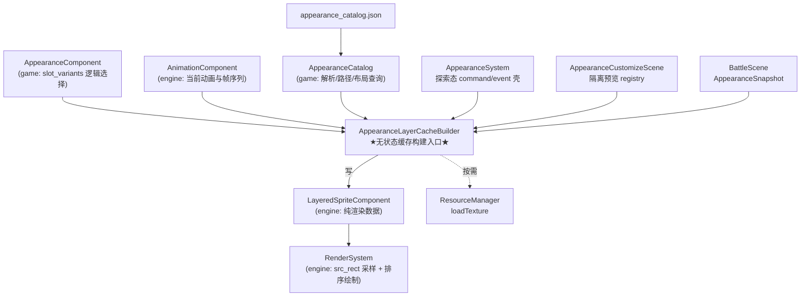
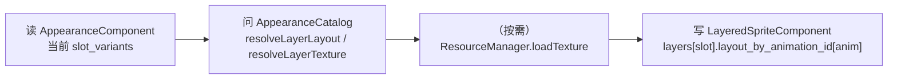
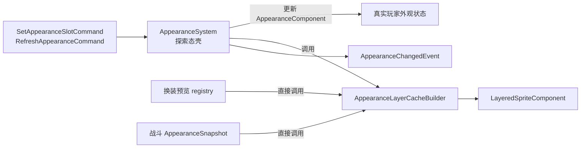
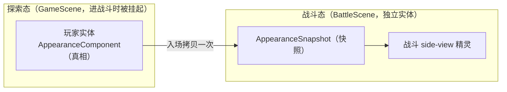
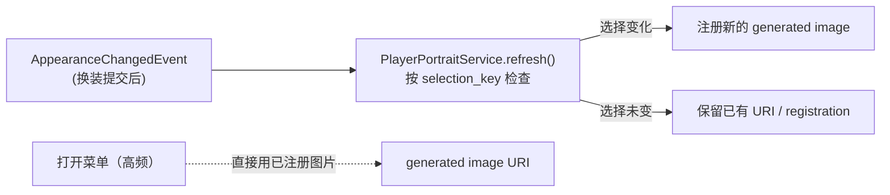
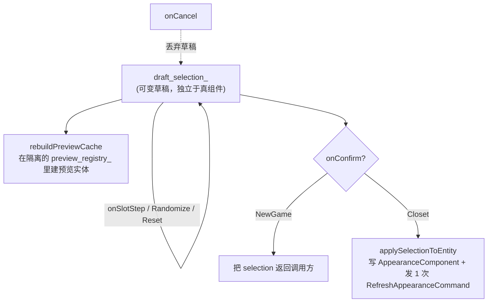

# 第14节课 · 分层角色外观与头像

探索侧的 JRPG 玩法到[上节课](13-装备成长与休息.md)全闭环了：任务、商店、队伍、装备、成长、休息。但还有一件事悬而未决——**这些角色到底长什么样？** 尤其是马上要进入的战斗：side-view 战斗里那些精灵不能是"凭空冒出来的图"，否则后续讲战斗表现时它就是个黑盒。

所以这节课把"外观"这件事讲透：怎么把一个角色从"一张固定 sprite"升级成**皮肤 / 眼睛 / 服装 / 头发 / 饰品 / 武器分层可组合、可运行时换装、还能生成头像**的系统。你会看到三个反复出现的主题在这里又一次合奏——**预计算（热路径只做采样）、engine/game 分层（引擎不懂"发型"只懂纹理）、以及"探索态持真相、战斗态拍快照"**（正是[上节课](13-装备成长与休息.md)那个设计的外观版）。

---

## 读完这节课，你应该能回答

1. 一个分层角色的最终画面，从 `appearance_catalog.json` 到屏幕像素，中间经过哪些层？哪段代码负责把 game 外观选择翻译成 engine 渲染缓存？
2. 为什么外观布局要在"换装时"预计算，而不是每帧渲染时现算？
3. 战斗里的角色外观，为什么要从探索侧 `AppearanceComponent` **拷一份快照**，而不是直接读它？
4. 打开菜单看到的角色头像，是每次打开都重画的吗？怎么做到不重画？

---

## 先看再讲：拆开 appearance_catalog.json 的"层"

打开 [`assets/data/appearance_catalog.json`](../../assets/data/appearance_catalog.json) 顶部，几个字段就定义了整套外观模型：

```json
{
  "layer_order":        ["skin", "eyes", "clothes", "hair", "acc", "weapon"],   // 渲染层序（靠前=在下）
  "runtime_switchable_slots": ["skin", "eyes", "clothes", "hair", "acc"],        // 可手动换的槽（weapon 由动作决定）
  "gender_variants":    ["male", "female"],
  "default_profile":    "player_default",
  "slot_dirs":          { "skin": "Skins", "hair": "Hair's", ... },              // 槽 → 素材目录
  "profiles":           { "player_default": { "gender": "male", "slots": {...} } }, // 命名预设
  "slot_variants":      { "hair": ["Standard/Brown", "Standard/Black", ...] }     // 每槽的可选部件
}
```

一个角色 = **按 `layer_order` 从下往上叠的若干层**，每层从对应槽的 `slot_variants` 里选一个部件。`profiles` 是命名好的整套搭配（启动用 `default_profile`），`slot_variants` 是每个槽的"衣柜"。

再看运行时状态——[`appearance_component.h`](../../src/game/component/appearance_component.h)，game 层只记"现在每个槽选了啥"：

```cpp
struct AppearanceComponent {
    std::string profile_id_;
    std::string gender_{"male"};
    std::unordered_map<std::string, std::string> slot_variants_;  // slot → variant，如 "hair" → "Lyria/Brown"
    bool dirty_{true};
};
```

**关键观察**：`AppearanceComponent` 里**没有一个纹理 id、没有一个像素坐标**——它纯粹是"逻辑选择"。怎么把"hair = Lyria/Brown"变成屏幕上正确位置的像素，是后面那条链路的事。

> **先动手**：进游戏打开衣柜（换装界面），左右切换 hair / clothes，看角色实时变样。你切的就是 `slot_variants_` 里的值；每切一次，背后有一次"预计算"把新选择翻译成可渲染的布局。这节课就讲这次翻译。

---

## 关键链路



记住这张图的两个要点：**`AppearanceLayerCacheBuilder` 是把 game 外观选择翻译成 engine 渲染缓存的无状态入口**。探索态的 `AppearanceSystem` 会调用它，换装预览和战斗表现也会直接复用它，所以战斗场景不需要再实例化一套 `AppearanceSystem`。另一个要点是 **`RenderSystem` 对"发型""服装"这些概念一无所知**，它只认 `LayeredSpriteComponent` 里的纹理 id 和帧布局。

---

## 核心知识点

### 1. engine/game 分层：引擎不懂"发型"，只懂纹理与帧

这是整套设计的地基。对比两个组件就懂了：

| | `AppearanceComponent`（game） | `LayeredSpriteComponent`（engine） |
| --- | --- | --- |
| 内容 | `slot_variants_`：`"hair" → "Lyria/Brown"` | `layers_`：每层一个 `texture_id_` + 帧布局 |
| 语义 | "选了什么部件"（逻辑） | "从哪张图的哪个矩形采样"（像素） |
| 依赖 | 依赖 `AppearanceCatalog`、外观目录 | **零游戏依赖**，纯渲染数据 |

看 [`layered_sprite_component.h`](../../src/engine/component/layered_sprite_component.h) 的 `LayeredAnimationLayout`——它是 `RenderSystem` 的唯一数据源，里面全是 `texture_id_ / direction_block_index_ / frame_width_ / source_frame_index_by_runtime_frame_` 这类纯几何/索引字段，**没有一个字符串叫 "hair"**。

**为什么这么分？** 因为渲染是引擎的通用能力，不该知道"农场 RPG 有发型这种东西"。引擎只提供"分层 sprite + 按布局采样"的机制；"皮肤在最下、武器在最上"这种**游戏内容知识**全留在 game 层。这正是项目文档反复强调的 engine/game 分层——换个游戏，`LayeredSpriteComponent` 原样复用，只重写 game 层的 catalog 和 system。

### 2. AppearanceLayerCacheBuilder：可复用的桥；AppearanceSystem 是探索态壳

game 的"逻辑选择"怎么变成 engine 的"渲染数据"？核心在 [`appearance_layer_cache_builder.cpp`](../../src/game/system/appearance_layer_cache_builder.cpp) 的 `AppearanceLayerCacheBuilder::rebuild()`。它干三件事：



对每个槽、每个动画，它向 catalog 问清楚"这层用哪张纹理、在图集的哪个方向块、每方向几帧、运行时第 N 帧对应源图第几列"，把这些**全部算好**塞进 `LayeredSpriteComponent`。算完之后，这个实体的渲染数据就齐了。

那 [`appearance_system.cpp`](../../src/game/system/appearance_system.cpp) 做什么？它是探索态的 command / event 壳：监听 `SetAppearanceSlotCommand` / `RefreshAppearanceCommand`，校验可切换槽和变体，更新玩家 `AppearanceComponent`，然后调用 `AppearanceLayerCacheBuilder::rebuild()`，最后派发 `AppearanceChangedEvent`。这个事件会通知头像服务等 UI 旁路刷新。



这个拆分很重要：`RenderSystem` 从不反向调用 game 层；战斗和换装预览也不需要重复订阅全局 dispatcher。探索、预览、战斗三条路径复用同一个无状态构建器，只是入口不同。这种单向依赖让外观系统可以被独立测试（`appearance_system_test.cpp`、`appearance_layered_direction_mapping_test.cpp`），也让战斗场景可以只消费快照。

### 3. 预计算：换装时算一次，渲染帧只做数学采样

这是本节课第一个核心工程决策，也是 `layered-appearance.md` 列的头号原则——**预计算优先**。

`AppearanceLayerCacheBuilder::rebuild()` 算出的 `layout_by_animation_id_` 是一张**缓存**。之后每一帧，`RenderSystem` 拿到当前 `animation_id` 和 `frame_index`，只做几步纯算术就得到采样矩形：

```
source_frame_index = source_frame_index_by_runtime_frame[current_frame_index]   // 查表
atlas_column = direction_block_index × frames_per_direction + source_frame_index // 乘加
src_rect = (atlas_column × frame_width, 0, frame_width, frame_height)            // 算矩形
```

**没有字符串查找、没有 catalog 查询、没有文件路径解析、没有纹理加载**——全是查表和乘加。

**为什么必须这样？** 想想渲染的频率：每帧 × 每个分层角色 × 每一层。如果把"hair = Lyria/Brown 对应哪张图的哪个矩形"这种解析放进每帧的渲染循环，就要在热路径里反复做字符串拼接、map 查找、甚至触发纹理加载——帧率会被吃掉。而**换装是极低频事件**（玩家偶尔点一下），把昂贵的解析挪到换装那一刻算一次、缓存起来，渲染帧只享受结果。这是"把计算从高频路径挪到低频路径"的经典优化。

> **回到问题 2**：每帧现算的问题是把昂贵的语义解析塞进了最热的渲染循环；预计算把它移到低频的换装时刻，渲染只剩查表+乘加。

### 4. 战斗外观快照：探索态持真相，战斗态拍快照

终于到了为 side-view 战斗扫清黑盒的关键设计。看 [`battle_scene_entry.cpp`](../../src/game/scene/battle_scene_entry.cpp) 的 `capturePlayerBattleAppearance`：

```cpp
std::optional<AppearanceSnapshot> capturePlayerBattleAppearance(entt::registry& registry) {
    const auto* appearance = registry.try_get<game::component::AppearanceComponent>(player);
    if (!appearance) return std::nullopt;
    AppearanceSnapshot snapshot{};
    snapshot.profile_id    = appearance->profile_id_;     // ← 拷贝
    snapshot.gender        = appearance->gender_;          // ← 拷贝
    snapshot.slot_variants = appearance->slot_variants_;   // ← 拷贝
    snapshot.valid = true;
    return snapshot;
}
```

进战斗时，把玩家 `AppearanceComponent` 的内容**复制**成一个 `AppearanceSnapshot`，挂到战斗单位的 seed 上（`seed.appearance = *player_appearance`）。战斗里的 side-view 精灵会把这份快照临时转成战斗 registry 里的 `AppearanceComponent`，再直接调用 `AppearanceLayerCacheBuilder::rebuild()` 重建 `LayeredSpriteComponent`。注意：战斗场景不会实例化第二套 `AppearanceSystem`，所以不会重复订阅探索侧 dispatcher。

**为什么要拷快照而不直接读 `AppearanceComponent`？** 这和[上节课](13-装备成长与休息.md)的属性快照是**同一个哲学**：



- 进战斗后，持有 `AppearanceComponent` 的探索实体在**被挂起的 `GameScene`** 里；战斗单位是**另一批独立实体**。让战斗每帧反向去读探索实体的组件，是危险的跨场景耦合。
- 快照让战斗**自包含**：它拿到一份不可变的外观数据，自己建精灵、自己测试，完全不依赖探索侧此刻的状态。
- 这与[上节课](13-装备成长与休息.md)"装备不进 BattleUnit、入场 `resolveActorStats` 拍属性快照"是**完全一致的模式**——属性拍快照、外观也拍快照。**探索态持真相、战斗态消费快照**是这个项目的一条主架构脉络。

> **回到问题 3**：因为战斗单位和探索实体分属两个场景的两批实体，快照让战斗自包含、可独立测试，且与"属性快照"同构——这是项目把"探索/战斗"解耦的统一做法。

### 5. 头像生成与缓存：打开菜单不重画

角色头像（菜单里那张脸）也从分层外观生成。看 [`appearance_portrait_builder.h`](../../src/game/ui/appearance_portrait_builder.h)——它能生成几种尺寸：

```cpp
enum class PortraitImageKind { Standard64, Standard64Linear, Battle48 };  // 注意有 Battle48
```

注意头像有自己的 `portrait_layer_order`（catalog 里和 sprite 的 `layer_order` 不同，还多了 "ears"）——头像是**正面脸部**的层序，和走动精灵的层序不是一回事。

那"打开菜单会不会每次都重画整张头像"？答案是**不会**，靠两层边界：

1. **`AppearancePortraitBuilder` 内部缓存解码后的层**（`decoded_layer_cache_`：path → DecodedImage）——同一张层纹理只解码一次。
2. **`PlayerPortraitService` 只在初始化或 `AppearanceChangedEvent` 到来时尝试 refresh**。看 [`player_portrait_service.h`](../../src/game/ui/player_portrait_service.h)：平时菜单打开/关闭，直接用已注册的 generated image（通过 RmlUi 的 `RmlGeneratedImageRegistry`）。如果一次事件对应的外观选择没有变，`refresh()` 会保留已有 URI / registration，不会替换已经注册的图片。



> **回到问题 4**：头像不是每次打开菜单重画的。连续打开 / 关闭菜单不会触发 `AppearanceChangedEvent`，菜单只是复用 `PlayerPortraitService` 已经注册好的 generated image；builder 还缓存了解码层。又是知识点 3 的"高频路径不做昂贵活"。

### 6. 换装 UI：草稿选择 + 隔离预览，确认才提交

最后看换装界面 [`appearance_customize_scene.h`](../../src/game/scene/appearance_customize_scene.h)。它有两个 Mode：

- **NewGame**：开新档时捏脸，确认后把选择**返回给调用方**（`SceneFactory`）。
- **Closet**：游戏内衣柜，确认后写回当前玩家实体。

它的数据流是又一个"先预览、确认才落地"的形态：



三个值得记的设计：

- **草稿与真相分离**：编辑的是 `AppearanceSelection draft_selection_`（[`appearance_customize_types.h`](../../src/game/scene/appearance_customize_types.h) 里的纯数据），不是直接改玩家的 `AppearanceComponent`。取消就丢草稿，真组件毫发无伤——和[商店系统](11-商店系统.md)/[装备成长与休息](13-装备成长与休息.md)的 preview/commit 同构。
- **隔离预览世界**：Scene 自带一个 `preview_registry_` + `preview_entity_` + 独立的 animation/render system，在一个**迷你 ECS 世界**里渲染预览角色，直接用 `AppearanceLayerCacheBuilder` 重建预览缓存，完全不碰真实游戏世界。
- **批量写 + 单次刷新**：确认时 `applySelectionToEntity` 把整套选择写进组件后，**只发一次** `RefreshAppearanceCommand`——触发探索态 `AppearanceSystem` 调用一次 `AppearanceLayerCacheBuilder`，而不是每个槽改一次就重建一次。

而 `stepAppearanceSlot` / `randomizeSelection` / `resetSelectionToProfile` 这些都是 `appearance_customize_types.h` 里的**纯函数**（操作 `AppearanceSelection`），可脱离 UI 单测——又是项目反复出现的"有状态的 Scene 壳 + 无状态的纯逻辑"模式（对照[商店系统](11-商店系统.md)的 `resolveShopMenuNavigation`、[任务系统](10-任务系统.md)的 `quest_log_ops`）。

---

## 阅读清单

| 顺序 | 文件 / 章节 | 关注点 |
| :---: | --- | --- |
| 1 | [`docs/gameplay/layered-appearance.md`](../../docs/gameplay/layered-appearance.md) | **本节课核心阅读材料**——分层架构、图集模型、预计算数据流、方向解析、预加载策略 |
| 2 | [`assets/data/appearance_catalog.json`](../../assets/data/appearance_catalog.json) | layer_order / slot_dirs / profiles / slot_variants 的真实结构 |
| 3 | [装备、成长与休息](13-装备成长与休息.md) | 对照属性快照——外观快照是同一个"探索持真相、战斗拍快照"模式 |

---

## 源码入口

| 顺序 | 文件 | 你会看到什么 |
| :---: | --- | --- |
| 1 | [`src/game/system/appearance_layer_cache_builder.cpp`](../../src/game/system/appearance_layer_cache_builder.cpp) + [`appearance_system.cpp`](../../src/game/system/appearance_system.cpp) | **本节课核心**——无状态 cache builder 负责读 game / catalog / animation 并写 engine 组件；`AppearanceSystem` 是探索态 command / event 壳 |
| 2 | [`src/game/component/appearance_component.h`](../../src/game/component/appearance_component.h) + [`src/engine/component/layered_sprite_component.h`](../../src/engine/component/layered_sprite_component.h) | game 逻辑选择 vs engine 纯渲染数据的对照 |
| 3 | [`src/game/data/appearance_catalog.h`](../../src/game/data/appearance_catalog.h) | `resolveLayerLayout` / `resolveLayerTexture` / 预加载路径收集 |
| 4 | [`src/game/scene/battle_scene_entry.cpp`](../../src/game/scene/battle_scene_entry.cpp)（`capturePlayerBattleAppearance`） | 战斗外观快照的拷贝点 |
| 5 | [`src/game/ui/appearance_portrait_builder.h`](../../src/game/ui/appearance_portrait_builder.h) + [`player_portrait_service.h`](../../src/game/ui/player_portrait_service.h) | 头像生成 + 解码缓存 + generated image registration 稳定性 |
| 6 | [`src/game/scene/appearance_customize_scene.h`](../../src/game/scene/appearance_customize_scene.h) + [`appearance_customize_types.h`](../../src/game/scene/appearance_customize_types.h) | 草稿选择、隔离预览、确认提交 + 纯函数 ops |

---

## 检查你的理解

1. **分层边界**：`RenderSystem` 画一个分层角色时，它知道这个角色"穿了 Lyria/Brown 头发"吗？它实际依赖的是什么数据？这个边界对"换一个完全不同的游戏复用引擎"有什么意义？
2. **预计算**：把帧索引映射（`source_frame_index_by_runtime_frame_`）改成每帧渲染时现算，功能上对不对？性能上会出什么问题？为什么换装时算就没问题？
3. **快照**：战斗中如果玩家外观能被某技能临时改变（比如"变身"），你会改快照、还是回头改探索侧 `AppearanceComponent`？为什么？
4. **头像缓存**：连续打开/关闭菜单 10 次、中间不换装，`AppearancePortraitBuilder::build` 会不会因为菜单打开而反复调用？是什么机制让菜单不必每次重建头像？
5. **草稿提交**：换装界面里 `applySelectionToEntity` 为什么在批量写完所有槽后只发**一次** `RefreshAppearanceCommand`，而不是每改一个槽发一次？

---

## 动手试试

**目标**：给某个槽加一个新的部件变体，在换装界面里切到它——**不改 C++**。

1. **加一个变体**：打开 [`assets/data/appearance_catalog.json`](../../assets/data/appearance_catalog.json)，在某个 `runtime_switchable_slot`（如 `hair`）的 `slot_variants` 列表里，加入一个**该槽素材目录下已存在、但当前没被列出**的部件变体（变体名要能按 `slot_dirs` + `action_dirs` 解析到真实纹理路径——先去对应素材目录确认文件存在）。
2. **进衣柜切换**：进游戏打开换装界面，左右切到新加的变体，观察角色和头像实时更新。
3. **理解按需加载**：注意 catalog 每槽只预加载前 3 个变体（`kRuntimeVariantPreloadLimitPerSlot = 3`）。如果你的新变体排在第 4 个之后，切到它时会触发一次 `ResourceManager.loadTexture` 按需加载——第一次切可能有极短的加载，之后就缓存了。

**进阶**：

- 想加一个**全新的槽**（比如 "cape" 披风），而不只是已有槽的新变体——需要动哪几处？（提示：`layer_order`、`slot_dirs`、`portrait_layer_order`、可能还有 `runtime_switchable_slots`，以及素材目录。想清楚为什么"加变体"是纯数据、而"加新槽"要碰更多配置：新槽改变了**渲染层序**这个结构。）
- 思考：如果要让"装备的武器"自动反映到角色外观的 weapon 层（穿上铁剑，走路精灵手里就拿铁剑），这会怎样连接[上节课](13-装备成长与休息.md)的装备系统和这节课的 weapon 槽？（注意 catalog 里 `weapon` 不在 `runtime_switchable_slots` —— 它"由动作自动决定"，这给这个联动留了什么口子？）

完成后回答：**加一个新变体改了几个文件？加一个新槽又要改几处、为什么更多？**

---

## 小结

- **分层外观把"一张 sprite"拆成按 `layer_order` 叠的多层**，每层从槽的 `slot_variants` 选部件；`profiles` 是命名搭配，`AppearanceComponent` 只存"选了什么"的逻辑状态。
- **engine/game 严格分层**：game 懂"发型/服装"，engine 的 `LayeredSpriteComponent` 只懂"纹理 id + 帧布局"；`AppearanceLayerCacheBuilder` 是可复用的缓存构建入口，`RenderSystem` 对游戏概念无感。
- **预计算优先**：`AppearanceLayerCacheBuilder::rebuild()` 在换装、预览或战斗入场这种低频时刻把布局算好缓存，渲染帧只做查表+乘加，不在热路径解析语义/加载纹理。
- **战斗外观拍快照**：`capturePlayerBattleAppearance` 入场拷贝 `AppearanceComponent` 成 `AppearanceSnapshot`，战斗单位自包含——与[上节课](13-装备成长与休息.md)属性快照同一哲学：探索态持真相、战斗态消费快照。
- **头像缓存两级**：builder 缓存解码层，`PlayerPortraitService` 只在初始化或 `AppearanceChangedEvent` 尝试刷新；相同外观事件保留已有 generated image registration，打开菜单不重画。
- **换装 UI**：草稿选择 + 隔离 preview 世界 + 确认才 `applySelectionToEntity`（批量写、单次 `RefreshAppearanceCommand`）；步进/随机/重置都是可单测的纯函数。

---

到这里，**Stage IV 探索侧 JRPG 玩法全部闭合**：数据 catalog、任务、商店、队伍、装备成长休息、分层外观。角色有了规则、有了状态、有了样子——万事俱备。

下节课进入 **Stage V 回合制战斗**。第一站是探索↔战斗的过渡：敌人遭遇、区域触发、Lua 剧情战如何汇入同一个战斗入口，`EnterBattleCommand` / `BattleEndedEvent` 的契约，以及首次登场的 `GameMode`（Exploration / Battle / PauseOverlay / Cutscene）——你会看到它当前其实还没被翻转，过渡靠的是场景栈。我们正式开打。下节课见。
