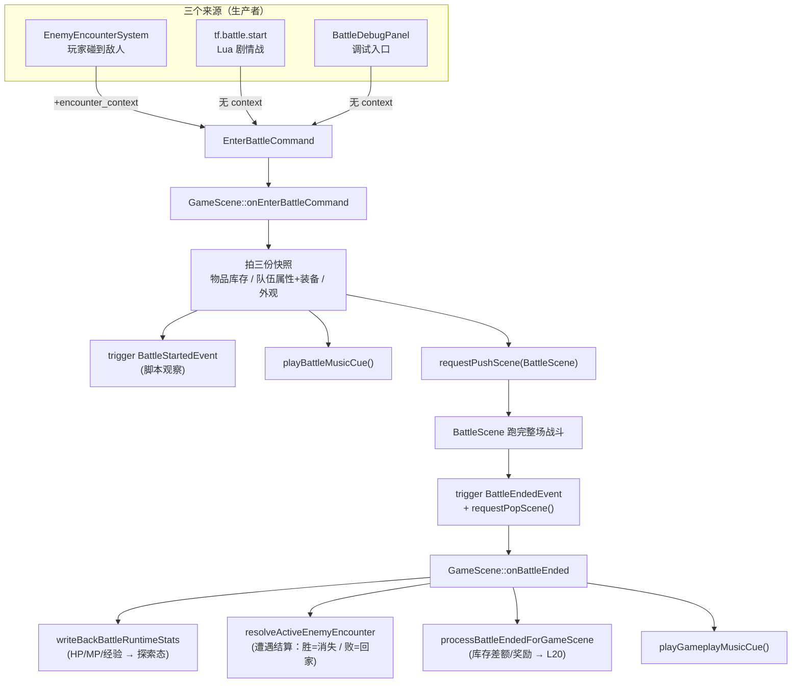

# L15 探索↔战斗的过渡 — 遭遇、剧情战与 GameMode

L14 把探索侧全部闭合了：角色有规则、有状态、有样子。现在要把这群角色**送进战斗，再接回探索**。

但"进战斗"这件事有三个完全不同的来源：玩家走路撞上一只地图上的敌人、Lua 剧本主动 `tf.battle.start` 起一场剧情战、调试面板点一下 "Start Battle"。本讲的核心问题是：**这三条来源凭什么汇进同一个入口？战斗打完又凭什么干净地回到探索——而且回去时"该变的变了"（敌人没了 / 回了家、物品快照对上了、音乐换回来了）？**

这一讲是 Stage V 的"桥"：进战斗的契约（`EnterBattleCommand`）、出战斗的契约（`BattleEndedEvent`）、遭遇结算的非对称（胜利 vs 非胜利），以及第一次登场的 `GameMode`——这里有个**要诚实交代的点**：当前代码里探索↔战斗的切换**不是靠翻 GameMode**，而是靠场景栈 push 一个覆盖式 `BattleScene`。我们会把这件事看清楚，而不是照着"枚举名字"想当然。

---

## 🎯 本讲目标

读完之后，你应该能回答：

1. 区域遭遇、Lua 剧情战、调试面板这三种来源，为什么能共用同一个 `EnterBattleCommand`？它们的差别浓缩在哪个字段里？
2. `onEnterBattleCommand` 在 push 战斗场景之前，到底"拍"了哪几份快照？为什么是快照而不是引用？
3. 当前代码里，探索↔战斗的切换究竟由什么驱动？`GameMode` 在其中扮演什么角色——是"开关"还是"词汇表"？
4. 一场**遭遇战**，胜利和战败之后地图上那个敌人实体分别会怎样？`respawn_on_map_reload` 改变了什么？

---

## 👁️ 先看再讲：点一下 "Start Battle"

进游戏，打开 Battle 调试面板，选一个 troop，点 **Start Battle**。你会看到：屏幕被战斗场景盖住、背景音乐切成战斗曲、回合菜单弹出来。

这颗按钮的代码只有两行关键（[`battle_debug_panel.cpp:195`](../../src/game/debug/battle_debug_panel.cpp)）：

```cpp
if (ImGui::Button("Start Battle")) {
    ensureDebugBattlePotion(registry_, dispatcher_, player);
    dispatcher_.trigger(game::defs::EnterBattleCommand{
        .troop_id = selected_troop_id_});      // ← 只填了 troop_id，没有 encounter_context
}
```

记住这个画面。调试面板、Lua 剧情战、玩家撞上敌人——**最后都收敛到 `dispatcher_.trigger(EnterBattleCommand{...})` 这一行**。区别只在于：调试面板和剧情战不带 `encounter_context`，而地图遭遇带。本讲就讲这条命令从被触发到打完回家的全程。

> **顺手对比**：注意调试面板这条只填了 `troop_id`，玩家方 `actor_ids` 留空。等会你会看到，留空时 `GameScene` 会自动用"当前队伍"装配玩家方——这正是 L13 队伍快照接上来的地方。

---

## 🗺️ 关键链路



一句话：**三个来源 → 一条命令 → 入口拍快照 + push 场景 → 战斗 → 一个结束事件 + pop 场景 → 出口写回**。

---

## 💡 核心知识点

### 1. 一条命令，三个来源：差别只在 `encounter_context`

[`commands_battle.h`](../../src/game/defs/commands_battle.h) 里的 `EnterBattleCommand` 是**唯一**的"进战斗"命令：

```cpp
struct EnterBattleCommand {
    std::vector<std::string> actor_ids{};                  // 玩家方 actor id；空→工厂用默认队伍
    std::string troop_id{};                                // 敌方 troop id；空→工厂选默认敌群
    std::string battle_background_id{};                    // 可选背景；空→按 map/troop/default 解析
    std::vector<game::battle::BattleUnit> player_units{};  // 可选：已预构建的玩家单位
    std::vector<game::battle::BattleUnit> enemy_units{};   // 可选：已预构建的敌方单位
    std::optional<EnemyEncounterBattleContext> encounter_context{};  // ★ 地图遭遇才有，手动/剧情战为空
};
```

它的设计很"宽"：既能只给 `troop_id` 让工厂去 catalog 里装配（调试面板、剧情战、普通遭遇都走这条），也能直接塞预构建好的 `player_units / enemy_units`（绕过装配）。**为什么三个来源能共用？** 因为"装配单位 → 拍快照 → push 场景"这套动作和来源无关；真正随来源不同的，只有**结束时怎么收尾**——而这块差异被完整封装进了 `encounter_context` 这个 optional：

- `EnemyEncounterSystem` 触发时会填 `encounter_context`（带上是哪个敌人实体、哪张图、encounter_id、是否重生、原始位置）。
- `tf.battle.start`（[`script_game_api.cpp` `battleStart`](../../src/game/script/script_game_api.cpp)）和调试面板**不填**——所以剧情战/调试战打完不会去地图上"消灭"谁。

这就是自测题 1 的答案：**同一条命令，靠 `encounter_context` 在与否区分"有地图后果的遭遇战"和"无地图后果的剧情/调试战"。**

### 2. 入口做的事 = 拍三份快照 + 一次广播 + 一次 push

`GameScene::onEnterBattleCommand`（[`game_scene.cpp:823`](../../src/game/scene/game_scene.cpp)）的主干，去掉防御分支后是这样：

```cpp
// ① 防重入：已有未结算遭遇时，拒绝新的遭遇请求
if (cmd.encounter_context && active_encounter_context_) { releaseEnemyEncounterEntryFailure(...); return; }

// ② 装配玩家/敌方单位（预构建优先，否则从 catalog 建）
//    units 空 → buildBattleUnitsFromCatalog(actor_ids 解析 + troop_id + 当前队伍状态)

// ③ 快照一：战斗内物品库存（战斗用副本，不动真实背包）
const auto initial_item_stocks = collectPlayerItemStocks(registry_);

// ④ 快照二/三：外观 + 队伍属性/装备，喂给表现层
presentation_options.sprite_seeds       = buildBattleSpriteSeeds(units, capturePlayerBattleAppearance(registry_)); // L14
populateBattlePartyState(registry_, ...);   // actor_runtime_states + actor_equipment                              // L13
presentation_options.battle_background_id = resolveBattleBackgroundId(cmd, services_.get(), units);

// ⑤ 记住结算上下文 + 音乐 + 广播 + push
active_encounter_context_ = cmd.encounter_context;
playBattleMusicCue();
context_.getDispatcher().trigger(game::defs::BattleStartedEvent{...});       // 脚本观察事件
requestPushScene(std::make_unique<game::scene::BattleScene>(...));
```

三个"快照"在这里集中登场，全部是**拷贝而非引用**——这正是 L13（属性/装备）和 L14（外观）反复强调的"探索态持真相、战斗态消费快照"。战斗内 HP 掉了、药水用了、不会即时改探索态；要等结束事件回来才写回。注释里还有一句关键设计：`GameScene 负责将 command 适配为 battle factory 的输入结构，保持 battle 层不依赖 defs::EnterBattleCommand`——**战斗领域层对"谁发起的战斗"一无所知**，这是 L16 战斗核心能脱离 ECS/UI 单测的前提。

还有个值得单拎的小函数 `resolveBattleBackgroundId`：背景 id 走一条**回退链**——命令显式指定 → 当前地图的 `battle_background_id` → troop 自带的背景 → 兜底 `"Grassland"`。这种"由近及远找默认值"的链式回退，在项目里到处都是，值得记住这个写法。

### 3. ★ 过渡的真正机制是场景栈，不是翻 `GameMode`

这是本讲最该看清、也最容易想当然的一点。

`game_mode.h` 确实定义了四个模式：

```cpp
enum class GameMode { Exploration, Battle, PauseOverlay, Cutscene };
```

而且它**真的接进了调度器**——`GameScene::fixedUpdate` 每帧把它喂给 scheduler，`system_scheduler.cpp` 也按 mode 用 `build_profile(mode)` 算出"这个模式跑哪些 stage"：

```cpp
scheduler_->tick({ .mode = game_mode_, /* ... */ });   // game_scene.cpp:409
```

**但是**——在整个仓库里搜 `setGameMode`，你只会找到它的**定义**，找不到任何**调用者**：

```cpp
void GameScene::setGameMode(GameMode mode) { game_mode_ = mode; }   // 没人调它
```

也就是说：**当前代码路径里 `game_mode_` 恒为 `Exploration`，从没被翻到 `Battle`。** 那战斗时到底发生了什么切换？答案在文档里写得很直白（[`turn-based-battle.md`](../../docs/gameplay/turn-based-battle.md)）：

> **场景栈切换**：战斗通过 push/pop 叠加在探索场景之上，结束后直接恢复探索。

`BattleScene` 是一个**独立场景**，拥有自己的战斗专用 ECS registry、自己的输入上下文、自己的更新循环。它被 push 到 `GameScene` 之上，盖住后者。所以"探索行为 vs 战斗行为"的切换，**今天是靠场景栈实现的**，外加进出战斗时的一次音乐 cue 切换（`playBattleMusicCue` ↔ `playGameplayMusicCue`）。

那 `GameMode` 是什么？它是**调度器的"模式词汇表"**——它定义了"如果将来要按模式裁剪 / 并行系统，每个模式各跑哪些 stage"，机制已经就位、已接进 `tick`，只是当前没人去翻这个开关。**它的 profile 选择与并行细节是 L25 的主题。** 本讲你只需要把"概念上存在的东西"和"当前真正走的路径"分清楚：别因为枚举里有个 `Battle`，就以为进战斗是靠 `game_mode_ = Battle` 驱动的。

> 这也重述了自测题 2：当前的"时机点"不是"翻 mode"，而是"何时 push / pop BattleScene"——恰好就是 `onEnterBattleCommand`（push）与 `onBattleEnded`（pop）。

### 4. 出口契约：`BattleEndedEvent` 带回结果，`GameScene` 负责写回

战斗打完，`BattleScene` 自己 `trigger(BattleEndedEvent{...})` 然后 `requestPopScene()` 退场。[`events_battle.h`](../../src/game/defs/events_battle.h) 的出口契约：

```cpp
struct BattleEndedEvent {
    game::battle::BattleOutcome outcome{};                          // Victory / Defeat / Escaped / Ongoing
    std::vector<game::battle::BattleUnit> final_units{};            // 结束时的完整单位状态副本
    std::unordered_map<entt::id_type, int> remaining_item_stocks{}; // 战斗内剩余道具库存
    std::optional<game::battle::BattleRewardSummary> reward_summary{}; // Victory 时的奖励摘要（避免写回时重 roll）
};
```

`GameScene::onBattleEnded`（[`game_scene.cpp:983`](../../src/game/scene/game_scene.cpp)）按固定顺序收尾：

```cpp
writeBackBattleRuntimeStats(registry_, services_.get(), evt.final_units);  // HP/MP/经验 → 探索态真相（L13）
resolveActiveEnemyEncounter(evt);                                          // 遭遇结算（见 §5）
processBattleEndedForGameScene(...);                                       // 库存差额 + 胜利奖励（L20 细讲）
// 然后按 outcome 切回探索音乐
```

注意这里只是"建立框架"：写回的**顺序为什么是这样**（背包先于任务进度等）、奖励怎么落地，是 **L20** 的主题。本讲你只要记住：出战斗也是**一个事件 + 一次 pop**，对称于进战斗的"一条命令 + 一次 push"。

### 5. 遭遇结算的非对称：胜利=敌人消失，非胜利=回家+冷却

`resolveActiveEnemyEncounter`（[`game_scene.cpp:1058`](../../src/game/scene/game_scene.cpp)）是遭遇战独有的收尾。第一行就体现了 §1 的设计：

```cpp
if (!active_encounter_context_) { return; }   // 剧情战/调试战没有 context → 直接返回，不碰地图
```

剩下的逻辑泾渭分明：

- **胜利**：把那只敌人实体真正"抹掉"——`encounter->defeated_ = true`，从空间索引移除碰撞体，挂 `NeedRemoveTag` 让它销毁。并且按 `respawn_on_map_reload` 决定**重载这张图时它还在不在**：
  ```cpp
  if (context.respawn_on_map_reload) map_state->persistent.defeated_encounters.erase(context.encounter_id);   // 会重生
  else                               map_state->persistent.defeated_encounters.insert(context.encounter_id);  // 永久消失
  ```
- **战败 / 逃跑**：敌人**不消失**，而是"回家"——`engaged_ = false`、设冷却 `cooldown_timer_`、传送回 `home_position`、清速度、重置 wander 的 home/target/phase。于是它走回原处，你有一小段冷却时间不会立刻又被它撞上。

为什么要这种非对称？因为"胜利消灭敌人"是 JRPG 的常识，而"战败就被永久卡住"是糟糕体验——给个冷却让玩家喘口气重整旗鼓。这里还藏着两个闸门：`engaged_` 标志（一旦某遭遇 `engaged_`，`EnemyEncounterSystem` 的 `hasEngagedEncounter` 会让其它遭遇全部早退，防止"同时触发两场战斗"）；以及入口失败时的 `releaseEnemyEncounterEntryFailure`（装配失败就解除 `engaged_` 并加冷却，避免敌人卡死）。

### 6. 遭遇是怎么"配"出来的：Tiled 属性 + 互斥规则

遭遇战的源头在地图。一个 Tiled `actor` 对象，挂几个属性就成了遭遇点（约定见 [`tiled_conventions.h`](../../src/game/loader/tiled_conventions.h)，真实例子见 `town.tmj` 的 slime）：

```jsonc
{ "type": "actor", "name": "slime", "point": true, "x": 508, "y": 296,
  "properties": [
    { "name": "battle_troop_id",       "type": "string", "value": "troop.slime" },
    { "name": "encounter_id",          "type": "int",    "value": 1001 },   // 必须 >0，且同图内唯一
    { "name": "respawn_on_map_reload", "type": "bool",   "value": false }   // 缺省 true
  ] }
```

`EntityBuilder`（[`entity_builder.cpp:426`](../../src/game/loader/entity_builder.cpp)）把它翻译成 `EnemyEncounterComponent` 时有几条硬规则，全是"一个 actor 只能有一个角色"的体现：

- `battle_troop_id` 与 `shop_id / quest_offer_id / recruit_actor_id` **互斥**——同时声明会 warn 并忽略战斗入口（你不能让一个 NPC 既是商人又是遭遇怪）。
- `encounter_id` 必须 `>0` 且**同图唯一**，重复的会退化成普通 actor。
- 若 `respawn_on_map_reload=false` 且该 encounter 已在 `defeated_encounters` 里 → **这个实体压根不会被 spawn**（呼应 §5 的永久消失）。

运行时由 `EnemyEncounterSystem`（[`enemy_encounter_system.cpp`](../../src/game/system/enemy_encounter_system.cpp)）每帧做空间查询：玩家碰撞体（带一点 `TOUCH_PADDING`）碰到合法遭遇目标，就校验 troop 在 `RpgCatalog` 里存在（不存在则 warn + 加冷却跳过），置 `engaged_`，填好 `encounter_context` 发命令。这条"**数据（Tiled）→ 组件 → 系统 → 命令**"的链路，和 L08 交互约定是同一个套路。

---

## 📋 阅读清单

| 资源 | 为什么读 |
| --- | --- |
| [`docs/gameplay/turn-based-battle.md`](../../docs/gameplay/turn-based-battle.md)（概述 / 架构分层 / 命令与事件 / 完整战斗流程） | 战斗系统全景；本讲对应"入口 + 场景栈切换 + 命令/事件"章节 |
| L13《装备、成长与休息》 | 入口处 `populateBattlePartyState` 拍的就是 L13 的属性/装备快照 |
| L14《分层角色外观与头像》 | 入口处 `capturePlayerBattleAppearance` 拍的就是 L14 的外观快照 |
| L08《脚本事件桥与 Tiled 接入》 | "Tiled 属性 → 组件 → 系统"是同一套约定；遭遇点也遵循"一个 actor 一个角色" |
| 上一套 part-07 场景系统 | `BattleScene` 是覆盖式场景，回顾 push/pop 与场景栈 |

---

## 🔑 源码入口

| 文件 | 看什么 |
| --- | --- |
| [`src/game/scene/game_scene.cpp`](../../src/game/scene/game_scene.cpp) | `onEnterBattleCommand`（入口拍快照+push）、`onBattleEnded`（出口写回）、`resolveActiveEnemyEncounter`（遭遇结算非对称）——**本讲主入口** |
| [`src/game/defs/commands_battle.h`](../../src/game/defs/commands_battle.h) + [`events_battle.h`](../../src/game/defs/events_battle.h) | 进/出战斗的两个契约：`EnterBattleCommand` 与 `BattleEndedEvent`/`BattleStartedEvent` |
| [`src/game/system/enemy_encounter_system.cpp`](../../src/game/system/enemy_encounter_system.cpp) | 玩家碰撞检测 → 校验 troop → `engaged_` → 发命令；`engaged_` 闸门 |
| [`src/game/loader/entity_builder.cpp`](../../src/game/loader/entity_builder.cpp) + [`tiled_conventions.h`](../../src/game/loader/tiled_conventions.h) | 遭遇点怎么从 Tiled 属性配出来 + 互斥/唯一/已击败跳过规则 |
| [`src/game/runtime/game_mode.h`](../../src/game/runtime/game_mode.h) + [`system_scheduler.cpp`](../../src/game/runtime/system_scheduler.cpp) | `GameMode` 枚举与 `build_profile`——"模式词汇表"，注意 `setGameMode` 当前无人调用（深入留 L25） |

---

## ❓ 自测问题

1. 区域遭遇、`tf.battle.start` 剧情战、调试面板这三种进战斗的来源，差别浓缩在 `EnterBattleCommand` 的哪个字段？为什么这个差别足以决定"打完要不要动地图"？
2. 当前代码里，探索↔战斗的切换到底由什么驱动？`GameMode` 已经接进调度器了，为什么说战斗"不是靠翻 mode"进入的？这给 L21 存档"该捕获哪个 mode"留下了什么思考题？
3. 一场遭遇战，胜利和战败之后地图上那个敌人实体分别会怎样？`respawn_on_map_reload` 在 `true` / `false` 两种取值下，重载地图时敌人在不在？
4. 入口处 `onEnterBattleCommand` 为什么要把物品库存、队伍属性、外观都**拷贝**成快照，而不是让战斗场景直接读探索态组件？（提示：战斗里 HP 会变、药水会用、外观要锁定。）

---

## 🧪 最小练习

**目标**：在 `home_exterior`（或任一户外图）加一个遭遇点，走过去进战斗，胜负任一结束后能回到探索。

1. **配一个遭遇点**：打开 [`assets/maps/home_exterior.tmj`](../../assets/maps/home_exterior.tmj)，在某个对象层里加一个 `point` 型、`type:"actor"` 的对象，挂上属性（可直接参照 `town.tmj` 里 slime 的写法）：
   - `battle_troop_id` = 一个真实 troop id（`troops.json` 里有 `troop.slime` / `troop.goblin_pair` / `troop.gnome_pair`）
   - `encounter_id` = 一个该图内没用过的正整数（如 `2001`）
   - `respawn_on_map_reload` = `true`（先观察"可重生"行为）
2. **撞上去**：进游戏走到该点，玩家碰撞体一接触就该进 `BattleScene`，音乐切成战斗曲。
3. **打完观察**：胜利后那只敌人从地图消失；战败/逃跑后它回到原位并有一小段冷却。
4. **验证重生**：胜利后切出这张图再回来（触发地图重载），因为 `respawn_on_map_reload=true`，敌人**又出现了**。把它改成 `false` 再来一次，胜利后重载它**不再出现**——你就观察到了 `defeated_encounters` 的持久化效果。

**容易踩的坑**：别在同一个 actor 上同时写 `battle_troop_id` 和 `shop_id`/`quest_offer_id`/`recruit_actor_id`——`EntityBuilder` 会 warn 并忽略战斗入口（一个 actor 只能有一个角色）。`encounter_id` 也别和同图已有的撞号。

**进阶**：不改地图也能验证入口——用 Battle 调试面板的 "Start Battle" 直接发 `EnterBattleCommand`。对比它和遭遇战在"打完之后"的差别：调试战没有 `encounter_context`，所以 `resolveActiveEnemyEncounter` 第一行就返回了，地图上什么都不会被改。想清楚：**为什么这是"对的"行为？**

---

## 📌 小结

- **一条命令收敛三个来源**：区域遭遇、Lua 剧情战、调试面板都触发同一个 `EnterBattleCommand`；差别浓缩在 `encounter_context` 这个 optional——有它才有"动地图"的结算后果。
- **入口 = 拍三份快照 + 广播 + push**：`onEnterBattleCommand` 拷贝物品库存、队伍属性/装备（L13）、外观（L14）成快照，发 `BattleStartedEvent`，push 覆盖式 `BattleScene`；battle 层刻意不依赖 `EnterBattleCommand`。
- **过渡靠场景栈，不靠翻 GameMode**：`GameMode` 枚举与 per-mode 调度 profile 已就位、已接进 `scheduler.tick`，但 `setGameMode` 当前无人调用，`game_mode_` 恒为 `Exploration`；探索↔战斗实际由 push/pop `BattleScene` + 音乐切换完成。GameMode 是调度器的"模式词汇表"，profile 选择细节留 L25。
- **出口 = 一个事件 + pop**：`BattleEndedEvent` 带回 outcome/final_units/库存/奖励摘要，`GameScene::onBattleEnded` 写回（顺序与奖励细节留 L20）。
- **遭遇结算非对称**：胜利则敌人销毁（并按 `respawn_on_map_reload` 决定是否永久消失），非胜利则回家 + 冷却；剧情战无 context，结算直接早退。
- **遭遇点是数据配出来的**：Tiled 的 `battle_troop_id`/`encounter_id`/`respawn_on_map_reload` 经 `EntityBuilder` 成组件，受"一个 actor 一个角色 + encounter_id 唯一 + 已击败跳过"规则约束。

## 🚀 下节课预告

入口和场景栈讲清楚了，但战斗"里面"还是个黑盒——回合怎么排序？谁先动？怎么判胜负？

下一讲 **L16 回合制战斗领域核心**：先彻底不看 UI，单独把战斗规则的**纯逻辑层**讲透——`TurnCore`（速度排序、行动推进、死亡跳过、胜负判定）、`BattleSession`（表现层进入战斗逻辑的唯一入口）、`BattleUnit` 与入场快照/出场写回的关系，以及 `ActorStatsResolver` 怎么把 actor + class + equipment 合成战斗属性。你会看到为什么"战斗核心不依赖 ECS/UI"是它能被干净单测的根本原因。下讲见。
