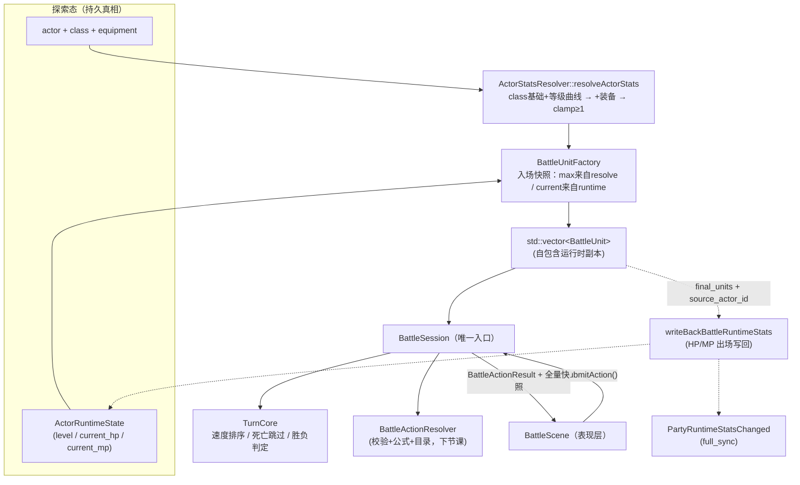

# 第16节课 · 回合制战斗领域核心

[上节课](15-探索与战斗的过渡.md)把战斗的"入口/出口"讲清楚了：一条 `EnterBattleCommand` 进去，一个 `BattleEndedEvent` 出来，中间 push 一个 `BattleScene`。但战斗"**里面**"还是个黑盒——谁先动？打完一个怎么轮到下一个？有人死了怎么办？什么时候算赢？玩家和敌人那一身攻防血量，到底从哪儿算出来的？

这节课撬开这个黑盒，而且**刻意先不看 UI**。我们要把战斗规则的**纯逻辑层**单独拎出来看：`TurnCore`（回合顺序与胜负）、`BattleSession`（表现层进战斗逻辑的唯一入口）、`BattleUnit`（运行时单位副本）、`ActorStatsResolver`（属性合成）。

有一个贯穿整节课的设计判断你要先记住：**这一层代码一行都不碰 ECS registry、不碰 dispatcher、不碰 Scene、不碰 RmlUi**。它只认 `BattleUnit` 这种朴素的 C++ 结构。为什么要这么"洁癖"？因为这样它才能被**纯单元测试**（不开窗口、不渲染就能验证规则），也才能在将来被搬走复用。这节课我们就靠"跑测试"来观察它。

---

## 读完这节课，你应该能回答

1. 一个单位在轮到它之前就被打死了，`TurnCore` 怎么处理？这个"死亡跳过"是写在某一段特判里，还是结构性地分散在几处？
2. 战斗里改了 HP，为什么不会立刻同步回探索态的角色？谁负责回写、什么时机、靠什么字段对上号？
3. 为什么说 `BattleSession` 是"唯一入口"？如果让 UI 直接调 `TurnCore::advanceTurn()` 会出什么问题？
4. 玩家单位入场时那一身 `attack`/`max_hp` 是怎么算出来的？敌人和玩家走的是同一套算法吗？

---

## 先看再讲：不开游戏，先跑测试

战斗核心最好的"可观察入口"不是游戏画面，而是**单元测试**——因为它能在没有窗口、没有渲染、没有 ECS 的情况下跑起来，这件事本身就是"核心层不依赖 UI"的铁证。

```bash
# 构建并跑回合核心测试（项目用 ninja）
ninja -C build/debug game_tests
ctest --test-dir build/debug -R TurnCoreTest --output-on-failure
```

[`tests/game/battle/turn_core_test.cpp`](../../tests/game/battle/turn_core_test.cpp) 里六个 case，正好对应 `TurnCore` 的关键职责：

| 测试 | 验证什么 |
| --- | --- |
| `SortsBySpeedAndKeepsStableTieOrder` | 按 speed 降序、同速保持加入顺序 |
| `SkipsDefeatedUnitsWhenAdvancing` | 推进时跳过 hp≤0 的单位 |
| `EvaluatesOutcomeFromAliveSides` | 按双方存活情况判 Victory/Defeat/Ongoing |
| `TracksRoundIndexWhenTurnOrderWraps` | 行动顺序绕一圈时轮次 +1 |
| `EmitsRoundHooksOnWrap` | 跨轮时触发 round 回调 |
| `ForcedEscapeOutcomeSurvivesRefreshAndAdvance` | `forceOutcome(Escaped)` 后 `refresh()` / `advanceTurn()` 不会把终局重算回 Ongoing |

这些测试构造的全是裸 `BattleUnit` 向量，**没有一行 `entt::registry`、没有一个 `Scene`**。这节课就讲清楚：被它们验证的那套规则，是怎么写出来的。

---

## 关键链路



一句话：**探索态 → 合成属性 → 入场快照成 `BattleUnit` → 喂给 `BattleSession`（内含 `TurnCore`）→ 表现层只通过 `submitAction` 介入 → 打完按 `source_actor_id` 写回探索态，并在 HP/MP 变化时发 full_sync 通知**。

---

## 核心知识点

### 1. 核心层的"洁癖"：不依赖 ECS / UI

打开 [`turn_core.h`](../../src/game/battle/turn_core.h)，看它 include 了什么——`battle_types.h` 加几个标准库，**没有 entt、没有引擎头**。类注释写得明明白白：

> `TurnCore` 持有可变单位列表，并刻意与 UI、ECS、dispatcher、场景栈代码解耦。

文档也把这条列为核心设计原则：「**领域逻辑与表现分离**：`TurnCore` / `BattleSession` / `BattleActionResolver` 不依赖 ECS UI。」

这不是"碰巧没用到"，而是**有意为之的边界**。好处有三：

- **可测**：先看再讲那五个测试就是证据——不开游戏、纯 C++ 结构就能验证回合规则。回合逻辑是最容易出边界 bug 的地方（死亡、空场、同速、绕圈），把它关在能单测的盒子里，是把 bug 挡在外面的最便宜方式。
- **可移植**：这层不知道"屏幕""精灵""输入"的存在，理论上能搬到一个命令行战斗模拟器里跑。
- **职责清晰**：表现层（`BattleScene`）只管"画"和"收输入"，规则真相只在 battle 层。两边谁也别想越界改对方的状态。

记住这条洁癖，下面三点都是它的推论。

### 2. `TurnCore`：速度排序 + 死亡跳过 + 胜负判定的纯核心

`TurnCore`（[`turn_core.cpp`](../../src/game/battle/turn_core.cpp)）就干三件事：

**① 速度排序（稳定）**。构造时 `buildTurnOrder` 用 `std::stable_sort` 按 `speed` 降序排：

```cpp
std::stable_sort(indices.begin(), indices.end(), [this](std::size_t lhs, std::size_t rhs) {
    return units_[lhs].speed > units_[rhs].speed;   // 只比 speed；同速时 stable_sort 保持原始加入顺序
});
```

用 `stable_sort` 而非 `sort` 是个有意的决定：**同速单位保持加入顺序**，结果可预测、可测试（对应 `SortsBySpeedAndKeepsStableTieOrder`）。

**② 死亡跳过——结构性的，不是特判**。这是问题 1 的答案，也是最值得品的设计。"跳过死人"不是某个 `if (dead) skip` 分支，而是**分散在三个地方协同保证**的：

```cpp
// advanceTurn(): 循环找下一个存活者，跳过死的
for (std::size_t offset = 0; offset < order_size; ++offset) {
    current_turn_index_ = (current_turn_index_ + 1) % order_size;
    if (isAlive(turn_order_[current_turn_index_])) { /* ...处理跨轮... */ return true; }
}
// alignCurrentActor(): 每次 refresh 后把当前指针对齐到存活者
// currentActorId(): 当前指向的单位若已死，直接返回 nullopt
```

所以一个单位"在自己回合前被打死"根本不需要特殊处理：它的 hp 被 resolver 改成 ≤0 后，下一次 `advanceTurn`/`refresh` 自然就跳过它，`currentActorId()` 也不会再把它交出去。**把"死亡"建模成 `hp<=0` 这一个事实，让跳过逻辑在多个查询点统一生效**，比到处写特判健壮得多。

**③ 胜负判定**。`evaluateOutcome` 只看两个布尔：

```cpp
if (has_alive_player && has_alive_enemy) outcome_ = Ongoing;
else if (has_alive_player)               outcome_ = Victory;
else                                     outcome_ = Defeat;   // 玩家全灭即 Defeat（含两边同归于尽）
```

注意 `Escaped` **不在这里**——逃跑不是按存活判的，而是由 resolver 调 `forceOutcome(BattleOutcome::Escaped)` 外部强制覆盖。这是个干净的分工：HP 结算走 `evaluateOutcome`，非 HP 结算（逃跑）走 `forceOutcome`。

这里还有一层容易漏掉的护栏：`forceOutcome` 会留下 `forced_outcome_` 标记。后续即使表现层或 resolver 又触发 `refresh()` / `advanceTurn()`，`TurnCore` 也会先尊重这个强制终局，不会因为双方还活着就把 `Escaped` 重算回 `Ongoing`。这正是新增测试 `ForcedEscapeOutcomeSurvivesRefreshAndAdvance` 要锁住的行为。

### 3. `BattleSession`：表现层进战斗逻辑的唯一入口

`BattleScene` **从不直接碰 `TurnCore`**。它只跟 `BattleSession` 说话，而且核心动作只有一个——`submitAction`。看它有多薄（[`battle_session.cpp`](../../src/game/battle/battle_session.cpp)）：

```cpp
BattleActionResult BattleSession::submitAction(const BattleAction& action) {
    BattleActionResult result = resolver_.resolve(action, turn_core_, runtime_state_); // ① 校验+应用+推进
    rebuildActiveUnitStates();   // ② 重建状态 HUD 缓存
    fillSnapshot(result);        // ③ 附上全量快照
    return result;
}
```

`BattleSession` 持有 `TurnCore` + `BattleActionResolver` + `BattleRuntimeState`（道具库存副本、状态等）+ 快照缓存。除 `submitAction` 外它对外全是**只读视图**（`units()`、`currentActorId()`、`outcome()`、`snapshot()`…）。

这就是问题 3 的答案：**所有的状态变更必须经过 `submitAction` → resolver**。如果让 UI 直接调 `TurnCore::advanceTurn()`，就会绕过 resolver 那一整套——技能/物品的目录查表、MP/道具消耗、命中与伤害公式、状态效果写入、以及行动后的快照重建。结果就是"回合推进了，但没人扣 MP、没人算伤害、UI 也拿不到新快照"。把唯一入口收口到 `submitAction`，等于强制规定"**每一次状态变更都必须走完 校验→应用→快照 这条链**"。resolver 内部怎么算，是下节课的事；这里你只需要记住这道门。

### 4. `BattleUnit`：自包含运行时副本 + 入场快照 / 出场写回

[`battle_types.h`](../../src/game/battle/battle_types.h) 里的 `BattleUnit` 是战斗内的运行时单位。它有个刻意的设计——**不分玩家/敌人子类**：

```cpp
struct BattleUnit {
    BattleUnitId id{0};
    BattleSide side{BattleSide::Player};
    int hp, max_hp, mp, max_mp, attack, defense, magic_attack, magic_defense, speed, luck;
    std::vector<std::string> skill_ids{};
    std::optional<std::string> source_actor_id{};   // ← 玩家：对应持久 actor id（回写纽带）
    std::optional<std::string> source_enemy_id{};   // ← 敌人：对应 catalog enemy id
    [[nodiscard]] bool isAlive() const { return hp > 0; }
};
```

双方共用一个结构，于是排序、目标选择、公式、快照序列化全都**一套路径走到底**，不用为玩家和敌人各写一遍。

而它和持久 actor 的关系，正是[上节课](15-探索与战斗的过渡.md)说的"探索态持真相、战斗态消费快照"的落地：

- **入场快照**：`BattleUnitFactory`（[`battle_unit_factory.cpp`](../../src/game/battle/battle_unit_factory.cpp)）建玩家单位时，`max_hp/attack/...` 来自 `resolveActorStats`（见 §5），而**当前** HP/MP 从探索态的运行时状态拷来：
  ```cpp
  const int current_hp = std::clamp(actor_state.current_hp, 0, max_hp);   // 当前血来自探索态
  // ... BattleUnit{ .hp = current_hp, .max_hp = max_hp, ..., .source_actor_id = actor->id_ }
  ```
- **出场写回**：战斗里 HP 掉了**不会**即时改探索态。等 `BattleEndedEvent` 回来，`GameScene::onBattleEnded` 调 `writeBackBattleRuntimeStats`，它遍历 `final_units`，只挑 `side==Player && source_actor_id` 的，按 `source_actor_id` 找到持久 runtime state 再写回。
- **写回后通知**：如果 HP/MP 真的变化，`GameScene` 随后触发 `PartyRuntimeStatsChanged{full_sync=true}`。这让队伍 HUD、状态面板、存档前的运行时视图都能按同一条队伍统计事件刷新，而不是只悄悄改数据。

这就是问题 2 的完整答案：**改 HP 的是战斗内的 `BattleUnit` 副本；回写的是 `writeBackBattleRuntimeStats`；时机是战斗结束事件；对上号靠 `source_actor_id`；写回后靠 `PartyRuntimeStatsChanged` 通知外层刷新。** 敌人没有 `source_actor_id`，所以它们的死活不写回任何持久数据——打完就没了。

### 5. `ActorStatsResolver`：actor + class + equipment 合成战斗属性的唯一点

玩家单位入场那一身属性，**只在一个地方**算出来——`resolveActorStats`（[`actor_stats_resolver.cpp`](../../src/game/battle/actor_stats_resolver.cpp)），三步固定顺序：

```cpp
result.params = baseParamsForActor(catalog, actor, level);  // ① class 基础值，有曲线则按等级插值
applyEquipmentBonuses(catalog, loadout, result.params);     // ② 叠加每件装备的 param_bonuses
clampMinimumStats(result.params);                           // ③ 每项下限钳到 ≥1
```

这正是[装备成长课](13-装备成长与休息.md)讲过的"唯一真相点"在**战斗入场**的应用：角色面板、战斗单位、休息恢复……谁要算属性都调它，绝不各算一套。合成顺序也有讲究——**先基础、再装备、最后钳下限**：装备的负修正可能把某项压到 0 甚至负，最后那道 `clamp(…, 1)` 兜住底线。

而敌人**不走这条**。看工厂里敌人分支：属性直接取 `enemy->params_`（catalog 里写死的 flat 值），没有 class、没有等级曲线、没有装备合成，而且 `hp = max_hp` **满血入场**：

```cpp
// 敌人：catalog flat params，满血满蓝
const int max_hp = clampPositiveStat(paramValue(enemy->params_, ParamIndex::Mhp));
// ... BattleUnit{ .hp = max_hp, .max_hp = max_hp, .mp = max_mp, ..., .source_enemy_id = ... }
```

所以问题 4 的答案：**玩家属性 = class 基础(按等级插值) + 装备，再钳下限；敌人属性 = catalog 直接写好的 flat 值满血入场。** 两者算法不同，但最终都落进同一个 `BattleUnit` 结构，往后一视同仁。

---

## 阅读清单

| 资源 | 为什么读 |
| --- | --- |
| [`docs/gameplay/turn-based-battle.md`](../../docs/gameplay/turn-based-battle.md)（核心设计原则 / 架构分层 / 回合驱动原理） | 官方视角的核心层边界与回合规则，与本课交叉印证 |
| [装备、成长与休息](13-装备成长与休息.md) | `resolveActorStats` 是那里讲的"唯一真相点"，本节课是它在战斗入场的应用 |
| [探索↔战斗的过渡](15-探索与战斗的过渡.md) | 入场快照（`populateBattlePartyState`）与出场写回的来龙去脉 |
| [`tests/game/battle/turn_core_test.cpp`](../../tests/game/battle/turn_core_test.cpp) | 纯逻辑测试本身就是"核心不依赖 UI"的证明；动手练习的素材 |

---

## 源码入口

| 文件 | 看什么 |
| --- | --- |
| [`src/game/battle/turn_core.h`](../../src/game/battle/turn_core.h) / [`.cpp`](../../src/game/battle/turn_core.cpp) | 速度排序、`advanceTurn` 死亡跳过、`evaluateOutcome` 判胜负、`forceOutcome` 逃跑与强制终局保持——**本节课主入口** |
| [`src/game/battle/battle_session.h`](../../src/game/battle/battle_session.h) / [`.cpp`](../../src/game/battle/battle_session.cpp) | 唯一入口 `submitAction`（resolve→重建状态→快照）；只读视图 vs 唯一变更点 |
| [`src/game/battle/battle_types.h`](../../src/game/battle/battle_types.h) | `BattleUnit`（自包含、`source_actor_id` 纽带）、`BattleAction`、`BattleOutcome` |
| [`src/game/battle/actor_stats_resolver.cpp`](../../src/game/battle/actor_stats_resolver.cpp) | 属性合成三步：基础(等级曲线)→装备→钳下限；玩家走它、敌人不走 |
| [`src/game/battle/battle_unit_factory.h`](../../src/game/battle/battle_unit_factory.h) / [`.cpp`](../../src/game/battle/battle_unit_factory.cpp) | 入场快照怎么拼：玩家 max 来自 resolve / current 来自 runtime；敌人 flat 满血 |
| [`src/game/scene/game_scene.cpp`](../../src/game/scene/game_scene.cpp) | `onBattleEnded` 如何写回 HP/MP，并在变化时触发 `PartyRuntimeStatsChanged{full_sync=true}` |

---

## 检查你的理解

1. "死亡跳过"在 `TurnCore` 里是写在哪一段特判里的？请指出参与保证它的三个函数，并说明为什么"把死亡建模成 `hp<=0`"比到处写 `if (dead)` 更健壮。
2. 战斗里玩家被打到 1 滴血，这时强退游戏（不触发 `BattleEndedEvent`），探索态的角色 HP 会是多少？为什么？正常打完时谁、在何时、靠什么字段把血写回去？
3. 假设有人图省事，让 `BattleScene` 直接调 `turn_core_.advanceTurn()` 来"跳过当前回合"，会绕过哪些本该发生的事？
4. `Escaped` 为什么不在 `evaluateOutcome` 里判定，而要用 `forceOutcome` 外部覆盖？这反映了什么分工？
5. `forceOutcome(Escaped)` 后为什么还要防住后续 `refresh()` / `advanceTurn()`？如果没有 `forced_outcome_`，成功逃跑可能被哪类状态重算覆盖？
6. `writeBackBattleRuntimeStats` 已经改了探索态 HP/MP，为什么还要触发 `PartyRuntimeStatsChanged{full_sync=true}`？

---

## 动手试试

**目标**：通过测试反推核心规则，再亲手加一个 case。

1. **跑起来**：
   ```bash
   ninja -C build/debug game_tests
   ctest --test-dir build/debug -R TurnCoreTest --output-on-failure
   ```
2. **反向推导**：挑 `SkipsDefeatedUnitsWhenAdvancing` 这个 case，逐行读它，**反推它构造了哪些前提**——几个单位、各自 speed 和 side、谁的 hp 被设成 0、期望 `advanceTurn` 后 `currentActorId()` 落在谁身上。把"测试为什么这么写"讲给自己听。
3. **加一个 case**：仿照写一个新测试 `BothSidesWipedCountsAsDefeat`——构造"玩家和敌人同时全灭"，断言 `outcome() == BattleOutcome::Defeat`（回看 §2 的 `evaluateOutcome`：没有存活玩家就是 Defeat，哪怕敌人也死光了）。跑通它。

**进阶**：不碰 `actor_stats_resolver.cpp` 一行代码，只改 `equipment.json` 里某件装备的 `param_bonuses`，想清楚它会怎样改变玩家 `BattleUnit` 入场的 `attack`——以及为什么敌人的 `attack` 完全不受影响（提示：§5 两条不同的算法路径）。

---

## 小结

- **核心层刻意不依赖 ECS/UI**：`TurnCore`/`BattleSession`/`BattleAction` 只认朴素 C++ 结构，因而可纯单测、可移植、职责清晰——这是本节课所有设计的总纲。
- **`TurnCore` 三件事**：`stable_sort` 按 speed 降序（同速保序）、死亡跳过（结构性分散在 `advanceTurn`/`alignCurrentActor`/`currentActorId`，靠 `hp<=0` 统一生效）、`evaluateOutcome` 按存活判胜负；逃跑用 `forceOutcome` 外部覆盖，并由 `forced_outcome_` 防止后续刷新把终局重算掉。
- **`BattleSession` 是唯一入口**：`submitAction` = resolver 校验应用 → 重建状态 → 全量快照；对外其余皆只读。UI 直调 `TurnCore` 会绕过校验/消耗/公式/状态/快照。
- **`BattleUnit` 自包含**：玩家/敌人共用一个结构；入场时 max 属性来自合成、current 来自探索态快照；出场靠 `writeBackBattleRuntimeStats` 按 `source_actor_id` 写回，HP/MP 变化后发 `PartyRuntimeStatsChanged{full_sync=true}`，敌人无此字段故不写回。
- **`resolveActorStats` 是属性合成唯一点**：基础(等级曲线)→装备→钳≥1；玩家走它、敌人用 catalog flat 值满血入场。

---

回合怎么排、谁是入口、属性怎么来——这些"骨架"清楚了。但 `submitAction` 里那句 `resolver_.resolve(...)` 还是一团黑：一次"用火球术打最左边那只史莱姆"到底怎么从一个 `BattleAction` 变成"扣 8 点 MP、造成 23 点伤害、附加灼烧 3 回合"？

下节课把 Attack / Skill / Item / Guard / Escape 统一建模，讲透 `BattleActionResolver` 与 `BattleFormulaEvaluator` 的分工、普通攻击的 `damage` 为什么按实际扣血而不是理论伤害汇报、技能/物品/状态的目录驱动、战斗物品用的是运行时副本（结束才写回真实背包）、状态回合数如何递减，以及未来持续伤害最自然的扩展点。下节课见。
