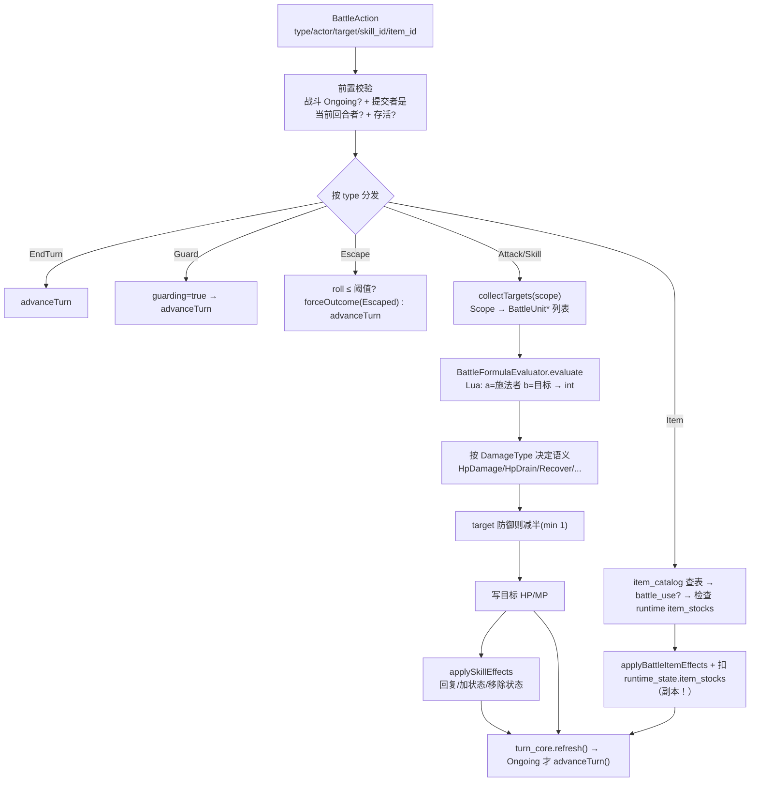

# L17 战斗动作解析

L16 把战斗骨架讲清楚了，但留了个黑盒——`BattleSession::submitAction` 里那句 `resolver_.resolve(action, turn_core, runtime_state)`。一次"用火球术打最左边那只史莱姆"，到底怎么从一个轻飘飘的 `BattleAction`（只带了"我要放 skill.fire_1，目标是它"）变成实打实的"扣 4 点 MP、过一次命中判定、按公式算出伤害、写进对方 HP、可能再附个状态、最后推进回合"？

本讲就拆这条结算链。核心是**两层分工**：`BattleActionResolver` 负责**编排规则**（校验、目标、消耗、状态、防御、逃跑），`BattleFormulaEvaluator` 负责**算数值**（把一个 Lua 公式字符串 + 攻防双方 → 一个整数）。围绕它你还会再看到几条贯穿全课的主线：**catalog 驱动**（技能/物品/状态全是数据）、**运行时副本**（战斗里动的库存和状态都不碰探索态真相）、以及 **"校验在前、写入在后、未命中也消耗"** 的结算纪律。

---

## 🎯 本讲目标

读完之后，你应该能回答：

1. 一个"群体攻击"技能，scope 和 target 在数据上分别怎么表达？resolver 怎么把"打全体"翻成一串具体目标？
2. 战斗中用掉一瓶药水，扣的是哪份库存？如果接着逃跑成功，真实背包到底少不少这瓶药？谁、何时决定？
3. `BattleActionResolver` 和 `BattleFormulaEvaluator` 各管什么？为什么算伤害的部分要单独拆成一个类？
4. 放技能没打中（miss），MP 扣不扣？回合推不推进？为什么是这个设计？

---

## 👁️ 先看再讲：测试名就是规则规格书

和 L16 一样，最好的观察入口是测试——[`tests/game/battle/battle_action_resolver_test.cpp`](../../tests/game/battle/battle_action_resolver_test.cpp) 里 19 个 case，几乎**每个 case 名就是一条规则**：

```bash
cmake --build build/debug --target game_tests
ctest --test-dir build/debug -R BattleActionResolverTest --output-on-failure
```

挑几个读名字就懂的：

| 测试名 | 它锁定的规则 |
| --- | --- |
| `AttackAppliesDamageAndAdvancesTurn` | 普攻：造成伤害并推进回合 |
| `SkillConsumesMpAndRejectsWhenInsufficient` | 技能扣 MP，不够则拒绝 |
| `SkillAllEnemiesScopeTargetsAllAliveEnemies` | scope=全体敌 → 命中所有存活敌人 |
| `SkillSelfScopeUsesActorAsTarget` | scope=自身 → 忽略显式目标，打自己 |
| `ItemConsumesStockAndRecoversHp` | 道具扣库存并回血 |
| `ItemRejectsWithoutStockOrValidTargetAndDoesNotConsume` | 库存不足时拒绝且**不扣** |
| `GuardReducesIncomingDamage` | 防御减半伤害 |
| `EscapeSuccessEndsBattle` / `EscapeFailureAdvancesTurn` | 逃跑成功终局 / 失败推进回合 |

这 19 个 case 全部用裸 `BattleUnit` 数组构造，**不开 BattleScene**。本讲讲的就是：被它们逐条钉死的这套规则，resolver 是怎么实现的。

---

## 🗺️ 关键链路



一句话：**前置校验 → 按 type 分发 → (收集目标→公式求值→按 DamageType 写入→附加效果) → 刷新胜负 → 推进回合**；公式只负责算数，库存只动副本。

---

## 💡 核心知识点

### 1. 两层分工：Resolver 编排规则，Evaluator 只算数

`resolve()` 这条链上，**伤害的具体数字 resolver 自己一个都不算**——它把公式甩给 `BattleFormulaEvaluator`：

```cpp
int evaluated_damage = 0;
std::string eval_error{};
const bool eval_ok = formula_evaluator_.evaluate(skill->damage_, *actor, *target, evaluated_damage, eval_error);
const int base_value = eval_ok ? evaluated_damage : 0;
```

`BattleFormulaEvaluator`（[`battle_formula_evaluator.h`](../../src/game/battle/battle_formula_evaluator.h)）是个极小的 Lua 求值器：每次 `evaluate` 前把施法者绑成表 `a`、目标绑成表 `b`，暴露 `hp/mp/mhp/mmp/atk/def/mat/mdf/agi/luk`，然后跑一句像 `a.atk - b.def / 2` 的表达式，返回截断到 int 的结果。**它完全不懂 scope、不懂 MP 消耗、不懂目标合法性**——它只认"两个单位 + 一个公式 → 一个数"。

这就是自测题 3 的答案：**Resolver = 规则编排（校验、目标、消耗、状态、防御、逃跑），Evaluator = 纯算术。** 为什么算伤害要单拆一个类？文档说得直接：

> `BattleFormulaEvaluator` 每次 evaluate 之前要刷新 Lua 表 `a` 和 `b`，把整个流程封装起来比直接在 Resolver 里用 sol 更易读，也方便单测公式不依赖整个 Resolver。

连普通攻击都走这个求值器（`evaluate("a.atk", ...)`，失败才回退到 `actor->attack`）——这给"把默认普攻公式也改成数据驱动"留好了口子。

### 2. 统一前置校验，再按 type 分发

`resolve()`（[`battle_action_resolver.cpp`](../../src/game/battle/battle_action_resolver.cpp)）开头是三道**所有动作共享**的闸门，然后才 `switch`：

```cpp
if (turn_core.outcome() != BattleOutcome::Ongoing)  { /* 战斗已结束 */ return result; }
const auto current_actor = turn_core.currentActorId();
if (!current_actor || *current_actor != action.actor_id) { /* 不是你的回合 */ return result; }
BattleUnit* actor = turn_core.findUnitMutable(action.actor_id);
if (!actor || !actor->isAlive()) { /* 行动者没了 */ return result; }
switch (action.type) { /* Attack / Skill / Item / Guard / Escape / EndTurn */ }
```

这三道闸门是 L16"唯一入口"在 resolver 内部的延续——**无论谁提交什么动作，都先确认"战斗还在打、确实轮到你、你还活着"**。`EndTurn / Guard / Escape` 不需要目标：前两者直接交回合，`Escape` 投骰子决定 `forceOutcome(Escaped)` 还是推进回合（呼应 L16 说的"逃跑走 forceOutcome 而非 evaluateOutcome"）。

### 3. scope → 目标列表

`Scope`（[`rpg_types.h`](../../src/game/data/rpg_types.h)）只有六个值：

```cpp
enum class Scope : std::uint8_t { None, OneEnemy, AllEnemies, OneAlly, AllAllies, Self };
```

`collectTargets / collectSkillTargets` 的职责就是把这个枚举翻译成一串 `BattleUnit*`。这是自测题 1 的答案：**"群体攻击" = 技能数据里 `scope: "all_enemies"`**；resolver 见到 `AllEnemies` 就收集**所有存活敌人**（对应测试 `SkillAllEnemiesScopeTargetsAllAliveEnemies`），此时 `action.target_id` 被忽略。反过来 `Self` 直接拿 actor 自己、`OneEnemy/OneAlly` 才需要显式 `target_id`。把"打谁"从"打多少"里分离出去——**scope 管范围、formula 管数值、damage.type 管语义**，三件事互不纠缠。

### 4. catalog 驱动 + DamageType 决定"一个数的语义"

技能、物品、状态**全是数据**。`skills.json` 里一条技能长这样：

```jsonc
{ "id": "skill.bash", "scope": "one_enemy", "mp_cost": 3,
  "damage": { "type": "hp_damage", "formula": "..." },
  "effects": [ { "type": "add_state", "target_id": "state.stun" } ] }   // 主伤害 + 附加状态
```

公式算出来的 `base_value` 只是个数；**这个数是伤害、是吸血、是回复，由 `damage_.type` 决定**：

```cpp
switch (skill->damage_.type) {
    case DamageType::HpDamage: case DamageType::HpDrain: /* 扣目标 HP；Drain 再回施法者 HP */ break;
    case DamageType::MpDamage: case DamageType::MpDrain: /* 扣目标 MP；Drain 再回施法者 MP */ break;
    case DamageType::HpRecover: /* 加目标 HP */ break;
    case DamageType::MpRecover: /* 加目标 MP */ break;
    case DamageType::None:      /* 无主效果，只靠 effects */ break;
}
```

所以一条"治疗术"和一条"火球术"在代码里走的是**同一条公式管线**，只是 `type` 不同（`hp_recover` vs `hp_damage`）。`skill.poison_spit` 更极端——`damage.type: "none"`，主效果为空，全靠 `effects` 里的 `add_state` 上毒。**加新技能基本是写 JSON，而不是写 C++**，这正是 catalog 驱动的价值。

### 5. 运行时副本：物品扣的是拷贝，不碰探索态背包

战斗里用道具，扣的**不是**真实背包，而是入场时复制出的那份库存副本。看 Item 分支里那行注释级别的设计声明：

```cpp
// 这里修改的是进入战斗时复制出的库存，不直接写回探索场景的 InventoryComponent。
stock_it->second -= consume;
if (stock_it->second <= 0) { runtime_state.item_stocks.erase(stock_it); }
```

`runtime_state.item_stocks` 是 L15 入口处 `collectPlayerItemStocks` 拷进来、由 `BattleSessionOptions` 注入的副本。战斗全程只动它；打完，剩余库存随 `BattleEndedEvent::remaining_item_stocks` 带回探索态，由 `GameScene` 做差额写回（**L20 细讲**）。

这就是自测题 2 的完整答案：**用药水扣的是副本；逃跑成功也照样保留这次扣减（副本已经少了一瓶）；真实背包要等战斗结束、按 `remaining_item_stocks` 算差额才更新。** 这条"战斗内动副本、结束才原子写回"的纪律，和 L10 任务交付、L13 装备、L16 属性快照是同一个哲学——**探索态的真相只在一个时刻、以一种方式被改写**。

注意 Item 分支的校验顺序也是"先验后扣"：库存不足 / 没有 `battle_use` / 目标非法时**直接拒绝且不扣**（测试 `ItemRejectsWithoutStockOrValidTargetAndDoesNotConsume` 钉死了这条）。

### 6. 消耗与命中的顺序；状态在 round hook 结算（以及 DoT 的诚实交代）

几个容易被忽略但很关键的时序决定：

- **MP 在命中判定之前扣**。技能分支先扣 MP，再投命中骰；没打中（miss）仍然消耗 MP 并推进回合：
  ```cpp
  actor->mp = std::max(0, actor->mp - skill->mp_cost_);   // 先扣 MP
  if (nextPercentRoll() > clampPercent(skill->success_rate_)) { result.missed = true; (void)turn_core.advanceTurn(); return result; }  // 未命中也消耗回合
  ```
  这是自测题 4 的答案：**miss 照样扣 MP、照样过回合**——把"挥空也是一次行动"建模进去，避免"反复试探零成本"。
- **防御减半**。目标处于 `guarding` 时伤害 `max(1, damage/2)`（保底 1，不会把有伤害的攻击减成 0）。
- **状态的回合计数在 round hook 递减**。技能用 `AddState` 加状态（几率门控，时长取 `state.min_turns_`），写进 `runtime_state` 而**不进 BattleUnit 快照**。它的递减发生在**轮次边界**——`BattleSession` 构造时给 `TurnCore` 装的 round hook 里：

  ```cpp
  turn_core_.setRoundHooks([this](std::uint32_t) {
      for (auto& [unit_id, state] : runtime_state_.units) {
          state.guarding = false;                      // 防御只保到下一轮
          for (auto it = state.state_turns_left.begin(); it != state.state_turns_left.end();) {
              --it->second;                            // 每过一轮，状态时长 -1
              if (it->second <= 0) it = state.state_turns_left.erase(it); else ++it;
          }
      }
  }, {});
  ```

  **诚实交代（这点和很多 JRPG 直觉不同）**：当前实现里状态**只是"限时命名标记"**——它有 `priority/min_turns/max_turns/traits`，会在 round hook 里按轮递减、在状态 HUD 上按 priority 排序显示，但**并没有"中毒每回合扣血"这类持续伤害（DoT）**。`state.poison` 的 `traits` 目前是空的，`traits_` 字段在战斗层根本没被消费。所以自测题"持续伤害何时结算"的准确回答是：**目前没有 DoT；状态计数在 round hook（轮次边界）统一递减，而那里正是将来要加 DoT 时最自然的挂载点**（文档"扩展点"一节也把"扩展回合开始/结束 hook"列为状态系统的下一步）。把"现状"和"扩展点"分清楚，比硬讲一个还不存在的机制更有价值。

---

## 📋 阅读清单

| 资源 | 为什么读 |
| --- | --- |
| [`docs/game/battle-internals.md`](../../docs/game/battle-internals.md)（七 Resolver / 五 submitAction trace / 十三 扩展点） | 实现者视角的规则真相与扩展指南；与 L16 的 `turn-based-battle.md` 交叉阅读 |
| L16《回合制战斗领域核心》 | `submitAction` 是本讲 `resolve` 的上游；refresh/advance 的语义在那讲 |
| [`assets/data/rpg/skills.json`](../../assets/data/rpg/skills.json) + [`states.json`](../../assets/data/rpg/states.json) | 技能/状态是数据；对照 scope / damage.type / effects 字段读 |
| [`tests/game/battle/battle_action_resolver_test.cpp`](../../tests/game/battle/battle_action_resolver_test.cpp) | 19 个 case = resolver 行为规格书；最小练习的素材 |

---

## 🔑 源码入口

| 文件 | 看什么 |
| --- | --- |
| [`src/game/battle/battle_action_resolver.cpp`](../../src/game/battle/battle_action_resolver.cpp) | `resolve` 前置校验 + 六种 type 分发；MP/库存消耗顺序；`applySkillEffects`/`applyBattleItemEffects`——**本讲主入口** |
| [`src/game/battle/battle_formula_evaluator.h`](../../src/game/battle/battle_formula_evaluator.h) / `.cpp` | Lua `a`/`b` 表绑定、公式求值；为什么单独成类 |
| [`src/game/data/rpg_types.h`](../../src/game/data/rpg_types.h) | `Scope` / `DamageType` / `EffectType` / `TraitType` 枚举——动作语义的数据词汇 |
| [`src/game/data/rpg_data.h`](../../src/game/data/rpg_data.h) | `SkillData`（scope/mp_cost/success_rate/repeats/damage/effects）、`StateData`、`EffectData` 字段 |
| [`assets/data/rpg/skills.json`](../../assets/data/rpg/skills.json) | `skill.bash`(带 add_state) / `skill.fire_1`(无 effects) / `skill.poison_spit`(damage.none + add_state) 三种范式 |

---

## ❓ 自测问题

1. 把 `skill.bash` 从单体改成"打全体敌人"，你只需要改 JSON 里哪个字段？改完后 resolver 内部 `collectSkillTargets` 的行为有什么不同？显式 `target_id` 还起作用吗？
2. 战斗中喝掉最后一瓶药水后逃跑成功。这一刻：(a) `runtime_state.item_stocks` 里这瓶还在吗？(b) 探索态真实背包里这瓶还在吗？(c) 真正决定背包增减的是谁、在什么时机？
3. `BattleFormulaEvaluator` 为什么不直接塞进 `BattleActionResolver`、而要单独成类？它对 scope / MP / 目标合法性知道多少？
4. 放技能 miss 了，MP 和回合分别怎样？如果反过来设计成"miss 不扣 MP、不消耗回合"，会带来什么可被玩家滥用的后果？

---

## 🧪 最小练习

**目标**：给一个技能加一个状态效果，用测试验证整条结算链——**不开游戏、不写 C++**。

1. **改数据**：打开 [`skills.json`](../../assets/data/rpg/skills.json)，给 `skill.fire_1`（它现在 `effects: []`）加一条附加状态效果，让它在造成火伤的同时上一个已有状态：
   ```jsonc
   "effects": [ { "type": "add_state", "target_id": "state.poison" } ]
   ```
2. **跑测试**：参照 `SkillAppliesDamageAndAddsStateFromCatalog` 这个现成 case 的写法（它就是"技能造成伤害 + 从 catalog 加状态"的标准断言），确认你能解释它如何构造 actor/target、如何断言 `result.damage > 0` 且 `result.states_added` 含新状态。
3. **观察时序**：想清楚——这个状态被加到了 `runtime_state` 而不是 `BattleUnit`；它会在**哪一刻**开始递减？（提示：§6 的 round hook。）

**进阶**：照 `docs/game/battle-internals.md` 第十三节"新增一个技能效果（如溅射伤害）"的三步，设计（不必完整实现）一个"主目标全额、相邻目标半额"的溅射技能——你需要在 `applySkillEffects` 里二次 `collectSkillTargets` 并重新调公式。再想一步：如果要让 `state.poison` 真的"每回合扣 1 滴血"，你会把这段逻辑加在哪里、为什么是那里？（回看 §6 对 DoT 扩展点的交代。）

---

## 📌 小结

- **两层分工**：`BattleActionResolver` 编排规则（校验/目标/消耗/状态/防御/逃跑），`BattleFormulaEvaluator` 只把"两个单位 + 公式字符串"算成一个 int；后者单拆成类是为了刷新 `a`/`b` 表与独立单测。
- **统一前置校验 + 按 type 分发**：先确认"Ongoing + 当前回合者 + 存活"，再 `switch`；EndTurn/Guard/Escape 无目标，Escape 用 `forceOutcome`。
- **scope 管范围、formula 管数值、damage.type 管语义**：三者解耦；"群体攻击"= `scope: all_enemies`，All*/Self 忽略显式 target。
- **catalog 驱动**：技能/物品/状态全是数据，加内容基本是写 JSON；一个公式结果由 `DamageType` 决定是伤害/吸收/回复。
- **运行时副本**：道具扣 `runtime_state.item_stocks` 副本、不碰探索态背包；剩余库存随 `BattleEndedEvent` 带回、L20 才原子写回。
- **结算纪律**：MP 先于命中扣（miss 也消耗）、防御减半保底 1、状态在 round hook 按轮递减；当前**无 DoT**，round hook 是其天然扩展点。

## 🚀 下节课预告

到这里，"一个 `BattleAction` 怎么被结算"已经透明了。但 `BattleAction` 本身是**谁造出来的**？

下一讲 **L18 战斗 Action 生成（玩家菜单 + 敌方 AI）**：把"玩家点菜单选技能/目标"和"敌人自动决策"统一看作**同一个抽象——`BattleAction` 的生产者**。玩家侧讲 `FlowState`/`MenuState` 双层状态机、菜单导航与 cursor memory、为什么不用 RmlUi 原生方向键导航；AI 侧讲 `BattleAiPlanner` 怎么按 rating 选技、按 scope 选目标、怎么用固定 seed 做确定性回归测试。两者最终都吐出一个 `BattleAction`，汇进本讲这条解算管线。下讲见。
