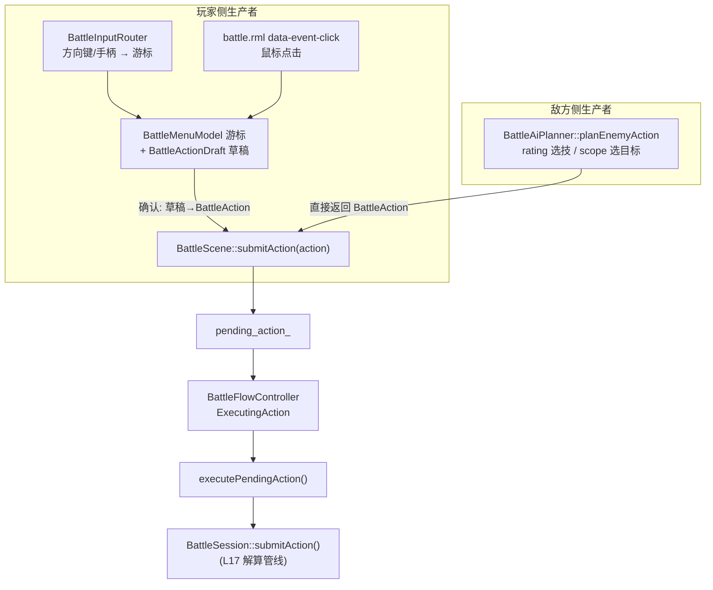

# L18 战斗 Action 生成（玩家菜单 + 敌方 AI）

L17 讲透了"一个 `BattleAction` 怎么被结算"，但留了个根本问题：**这个 `BattleAction` 是谁造出来的？**

答案有两个来源：**玩家**在菜单里一步步选"攻击 → 火球术 → 那只史莱姆"，和**敌人**每回合自动决策。本讲的关键视角是——**把这两者看成同一个抽象：`BattleAction` 的生产者**。它们路径天差地别（一个是多层菜单 + 键鼠输入 + 光标记忆，一个是纯函数按 rating 挑技能），但**终点完全一样**：吐出一个 `BattleAction`，塞进 `pending_action_`，汇进 L17 那条解算管线。

> ⚠️ 本讲负载较重（玩家菜单 + AI 双侧）。建议这样消化：先抓住"对称视角"这条主线（§1），再分两次读——先把玩家侧的双层状态机 + 光标（§2-4）吃透，再单独看 AI Planner（§5-6）。两侧的共性已被 §1 压扁，剩下的都是各自的差异细节。

---

## 🎯 本讲目标

读完之后，你应该能回答：

1. 把"玩家菜单"和"敌方 AI"看作同一个 action 生产者，它们共享的接口契约到底是什么？汇流点在哪一行代码？
2. 玩家选一个行动要穿过 PartyCommand→ActorCommand→SkillList→TargetSelect 好几层。这套流程为什么需要 `FlowState` 和 `MenuState` **两层**状态机，而不是一层？
3. 战斗菜单为什么不直接用 RmlUi 原生的方向键 focus 导航，而要自己写一套 `BattleInputRouter` + 光标模型？cursor memory 在目标已死时怎么处理？
4. 敌方 AI 怎么决定"放哪个技能、打谁"？把某敌人某技能的 `rating` 调高会发生什么？

---

## 👁️ 先看再讲：AI 是一组可确定性回归的纯函数

玩家菜单要进游戏点；但 AI 这一侧，最好的观察入口又是测试——因为 `BattleAiPlanner` 是**纯函数 + 可注入随机源**，能确定性复现：

```bash
cmake --build build/debug --target game_tests
ctest --test-dir build/debug -R BattleAiPlannerTest --output-on-failure
```

[`battle_ai_planner_test.cpp`](../../tests/game/battle/battle_ai_planner_test.cpp) 八个 case，名字就是 AI 的全部行为规格：

| 测试名 | 锁定的 AI 规则 |
| --- | --- |
| `ChoosesHighestRatedExecutableSkillAndRandomAliveEnemy` | 选 **rating 最高**且能用的技能 |
| `OneEnemySkillRandomizesTargetAmongAliveOpponents` | 单体攻击在存活敌人里**随机**选 |
| `OneAllyRecoveryTargetsMostInjuredAllyInsteadOfSelf` | 治疗选**最缺血**的队友 |
| `AllAlliesMpRecoveryUsesMpDeficitInsteadOfHp` | 回 MP 技按 MP 缺口选目标 |
| `SelfRecoveryFromDamageTypeFallsBackWhenAlreadyFull` | 自疗但满血 → 放弃，走 fallback |
| `FallbackAttackRandomizesTargetAmongAliveOpponents` | 无可用技能 → 普攻随机目标 |
| `FallsBackToEndTurnWhenNoOpponentsAreAlive` | 没活敌人 → EndTurn 兜底 |

玩家侧也有可单测的纯逻辑核——`resolveCursorMemoryDefaultIndex`（光标记忆落点）。本讲就讲：这两个生产者各自怎么造出一个 `BattleAction`。

---

## 🗺️ 关键链路



一句话：**两个生产者，殊途同归到 `submitAction(action)` → `pending_action_` → `session_.submitAction()`**。Flow controller 根本不关心是谁造的。

---

## 💡 核心知识点

### 1. 对称视角：两个生产者，一个汇流点

`beginCurrentTurnFlow()`（[`battle_scene.cpp:701`](../../src/game/scene/battle_scene.cpp)）是分叉口——它看当前行动者是敌是友，走不同生产路径：

```cpp
emitBattleTurnStarted(*actor);
if (actor->side == game::battle::BattleSide::Enemy) {
    submitAction(buildEnemyAction(*actor));   // AI 路径：planner 直接产出 BattleAction
    return;
}
flow_controller_.waitForInput();              // 玩家路径：进菜单，等玩家慢慢拼
enterInputMenu();
```

两条路径再不同，最终都流进同一个 `BattleScene::submitAction`：

```cpp
void BattleScene::submitAction(game::battle::BattleAction action) {
    pending_action_ = std::move(action);          // ← 唯一汇流点
    leaveInputMenu();
    flow_controller_.beginExecutingAction();
}
```

这就是自测题 1 的答案：**两个生产者共享的契约就是"产出一个 `BattleAction` 交给 `submitAction`"**；汇流点是 `pending_action_ = std::move(action)` 这一行。之后 `BattleFlowController` 进入 `ExecutingAction`，调 `executePendingAction()` → `session_.submitAction(*pending_action_)`（注意：这里有两个同名 `submitAction`——**场景的**那个只是"暂存意图"，**会话的**那个才是 L17 的真结算）。把"谁产出"和"怎么结算"彻底解耦，正是这套设计的价值。

### 2. 玩家侧：FlowState × MenuState 双层状态机

玩家选一个行动要穿过好几层菜单，所以需要**两层**状态机分管两件不同的事（[`battle_scene_state.h`](../../src/game/scene/battle_scene_state.h)）：

```cpp
enum class BattleFlowState {   // ① 战斗整体流程：单帧推进
    WaitingForInput, ExecutingAction, AnimatingResult,
    CheckVictory, VictoryFlow, NextTurn, BattleEnd
};
enum class BattleMenuState {   // ② 菜单内部上下文：只在 WaitingForInput 内部活动
    None, PartyCommand, ActorCommand, SkillList, ItemList, TargetSelect
};
```

为什么要两层（自测题 2）？因为它们的**生命周期和职责不同**：

- `BattleFlowState` 管"这一帧战斗该干嘛"——等输入？执行动作？播结果？判胜负？它是**整场战斗**的节拍器，敌我回合都走它。
- `BattleMenuState` 只在 `FlowState == WaitingForInput` **内部**才有意义——它管"玩家现在站在哪一层菜单"。敌方回合根本不进菜单，这层状态对 AI 不存在。

把它们揉成一层会立刻爆炸：你得在同一个枚举里同时表达"正在播放伤害动画"和"正在选技能列表第 3 项"这种正交的状态。分两层，各管各的。

而玩家在菜单里**逐步拼装**的中间产物，是 `BattleActionDraft`：

```cpp
struct BattleActionDraft {
    BattleActionType pending_type{...};            // 选了"攻击/技能/道具"
    std::optional<std::string> selected_skill_id;  // 选了哪个技能
    std::optional<std::string> selected_item_id;   // 选了哪个道具
    std::optional<BattleUnitId> selected_target_id;// 选了哪个目标
    bool requires_target_selection{false};
};
```

每深入一层菜单就往草稿里填一个字段；到 TargetSelect 确认时，`switch (action_draft_.pending_type)` 把草稿翻译成最终的 `BattleAction` 再 `submitAction`。**菜单导航 = 逐步填一张草稿**——这个心智模型能让整套菜单逻辑瞬间清晰。

### 3. 玩家侧：键鼠双路径，且不走 RmlUi 原生导航

战斗菜单同时支持两种操作，但它们**操纵的是同一个状态**（`BattleMenuModel` 的游标 + `action_draft_`）：

- **鼠标**：`battle.rml` 里 `data-event-click="actor_command_select(command.entry_index)"` 直接把点击送到处理函数。
- **键盘 / 手柄**：方向键不走 RmlUi，而是经 `BattleInputRouter`——它监听 `menu_up/down/left/right/confirm/cancel` 这些**输入动作**（L05 的输入上下文），转成游标移动，还自带按键重复（`RepeatDirection` + 计时器）：

```cpp
class BattleInputRouter::Delegate {        // 路由器只认这四个语义
    virtual BattleMenuState battleMenuState() const = 0;
    virtual bool moveBattleMenuCursor(int delta) = 0;
    virtual bool confirmBattleMenu() = 0;
    virtual bool cancelBattleMenu() = 0;
};
```

**为什么不用 RmlUi 原生方向键 focus 导航**（自测题 3）？因为战斗菜单的需求是 RmlUi 原生 focus 模型表达不了的：多层菜单的 cancel 要"弹回上一层"而不是"丢焦点"、每层要**记住上次光标位置**（cursor memory）、TargetSelect 时光标要联动高亮战场上的精灵和敌方 HP 条。这些是"游戏菜单语义"，不是"网页 tab 顺序"。所以项目自己持有光标状态，再**程序化地把焦点同步给 RmlUi**——`BattleMenuModel::focus_dirty` 标志正是为此：状态变了置脏，下一帧把 DOM 焦点对齐到当前光标项。RmlUi 在这里只当"渲染器 + 鼠标命中测试"，导航主权在游戏侧。

### 4. 玩家侧：cursor memory 与 cancel/back

"记住玩家上次选的格子"听起来贴心，但藏着边界情况，于是被收敛成一个**纯函数** `resolveCursorMemoryDefaultIndex`（[`battle_cursor_memory.h`](../../src/game/scene/battle_cursor_memory.h)）：

```cpp
int resolveCursorMemoryDefaultIndex(int remembered_index,
                                    const std::vector<bool>& enabled,
                                    int fallback_index,
                                    bool cursor_memory_enabled) {
    if (!cursor_memory_enabled) return fallback_index;                 // 开关关 → 默认位
    if (remembered_index < 0 || remembered_index >= enabled.size())    // 记的位置越界（列表变短了）
        return fallback_index;
    if (!enabled[remembered_index]) return fallback_index;             // 记的位置now禁用（如目标已死/MP不够）
    return remembered_index;                                            // 否则落回记忆位
}
```

这就是自测题 3 后半的答案：**记住的目标若已死、或对应项已禁用、或列表缩短到越界，就安全回退到 fallback**，绝不把光标停在一个非法格子上。把这个判断抽成无副作用的纯函数，4 行就能覆盖所有边界、还能单测——actor command / skill list / item list / target select 四个菜单层全调它（`battle_scene.cpp` 里能看到四处调用点）。cancel/back 则由 `BattleMenuState` 的层级回退表达：在 SkillList 按 cancel 回 ActorCommand，而不是退出整个菜单。

### 5. AI 侧：按 rating 选技、按 scope 选目标、按缺口选治疗

敌方生产者是 `BattleAiPlanner::planEnemyAction`（[`battle_ai_planner.cpp`](../../src/game/battle/battle_ai_planner.cpp)），纯静态函数。它的选技算法很直白——**遍历敌人的 `actions` 表，挑 rating 最高且当前能用的那条**：

```cpp
for (const auto& enemy_action : enemy.actions_) {
    const auto* skill = rpg_catalog.findSkill(enemy_action.skill_id_);
    if (!skill || skill->scope_ == Scope::None || actor.mp < skill->mp_cost_) continue;  // 滤掉不可用
    const auto planned_action = buildSkillAction(actor, *skill, units, rng);
    if (!planned_action) continue;                                    // 滤掉没合法目标的
    if (!best_planned_action || enemy_action.rating_ > best_rating) { // 取 rating 最高
        best_planned_action = planned_action;
        best_rating = enemy_action.rating_;
    }
}
```

注意比较用的是 `>` 而非 `>=`——**rating 相同时保留先遇到的**（配置表里靠前的优先）。选完技能，目标由 `buildSkillAction` 按 `scope_` 决定，这里 AI 比玩家"聪明"一点：

- `OneEnemy` → 在存活对手里**随机**挑（避免老打第一个）。
- `OneAlly` → 若是治疗技（`detectRecoveryIntent`：`damage.type` 是 HpRecover/MpRecover，或 effects 含 RecoverHp/MpRecover），挑**最缺血/最缺蓝**的队友；否则挑 HP 最低的。
- `AllEnemies / AllAllies / Self` → 不需要单一目标，但会检查"有没有合法对象"（如自疗已满血就放弃这条，回退）。

这套"恢复意图检测 + 按缺口选目标"让敌方法师不会对着满血队友放治疗。哪些来自配置、哪些是硬编码？**rating、skill_id、scope 来自 catalog 数据**（`enemies.json` 的 actions + `skills.json` 的 scope）；**"随机选敌 / 选最缺血友军 / 满血放弃"这套决策策略是硬编码在 planner 里的**。

### 6. AI 侧：fallback 兜底与确定性回归

`planEnemyAction` 任何一步走不通（没目录、没 `source_enemy_id`、没可用技能），都回退到 `planFallbackAction`——一次随机目标的普攻；连活敌人都没有就 `EndTurn`。`buildEnemyAction`（场景侧）层层设防，每个缺失分支都 warn + fallback，保证 AI **永远能产出一个合法 `BattleAction`**，不会卡住回合。

为什么 AI 这么好测（自测题 4 的回归策略）？因为两个 planner 函数都接受 `std::mt19937*` 随机源参数——测试注入固定 seed，随机就变确定，于是"rating 选择""目标随机""恢复优先"全都能写成稳定断言。**改了 AI 配置或逻辑后，最小回归就是跑 `BattleAiPlannerTest` 那 8 个 case**：它们用裸 `BattleUnit` 数组 + 固定 seed，不开 BattleScene，几毫秒覆盖全部决策分支。

---

## 📋 阅读清单

| 资源 | 为什么读 |
| --- | --- |
| [`ui/rmlui/scenes/battle.rml`](../../ui/rmlui/scenes/battle.rml) + `battle.rcss` | 看 `data-model`/`data-for`/`data-event-click` 怎么把菜单数据和鼠标路径绑上去 |
| [`learn/lectures/rmlui/L14-jrpg-battle.md`](../../learn/lectures/rmlui/L14-jrpg-battle.md) | RmlUi 子教程对应实战课：战斗 UI 的数据绑定与 focus 同步细节 |
| L05《输入上下文与菜单导航》 | `BattleInputRouter` 监听的 menu_* 动作、为什么不用原生导航的上游背景 |
| L17《战斗动作解析》 | 两个生产者的下游：`BattleAction` 产出后怎么被 resolver 结算 |
| [`tests/game/battle/battle_ai_planner_test.cpp`](../../tests/game/battle/battle_ai_planner_test.cpp) | AI 行为规格书；最小练习/回归素材 |

---

## 🔑 源码入口

| 文件 | 看什么 |
| --- | --- |
| [`src/game/scene/battle_scene.cpp`](../../src/game/scene/battle_scene.cpp) | `beginCurrentTurnFlow`(分叉)、`submitAction`(汇流)、草稿→action 转换、四处 cursor memory 调用——**玩家侧主入口** |
| [`src/game/scene/battle_scene_state.h`](../../src/game/scene/battle_scene_state.h) | `BattleFlowState` / `BattleMenuState` / `BattleActionDraft`——双层状态机与草稿 |
| [`src/game/scene/battle_input_router.h`](../../src/game/scene/battle_input_router.h) + [`battle_cursor_memory.h`](../../src/game/scene/battle_cursor_memory.h) | 方向输入→游标的 Delegate 契约；cursor memory 纯函数 |
| [`src/game/scene/battle_flow_controller.h`](../../src/game/scene/battle_flow_controller.h) + [`battle_menu_model.h`](../../src/game/scene/battle_menu_model.h) | FlowState 推进的 Delegate；菜单 RmlUi 数据模型与 `focus_dirty` |
| [`src/game/battle/battle_ai_planner.cpp`](../../src/game/battle/battle_ai_planner.cpp) | rating 选技、scope 选目标、`detectRecoveryIntent`、fallback——**AI 侧主入口** |

---

## ❓ 自测问题

1. 玩家在菜单里选完和敌方 AI 决策完，产出物最终都汇到哪一行代码？为什么说"场景的 `submitAction`"和"会话的 `submitAction`"是两回事？
2. 如果硬要把 `BattleFlowState` 和 `BattleMenuState` 合成一层枚举，你会遇到什么具体的表达困境？举一个"两个正交状态"的例子。
3. cursor memory 记住的目标在本回合开始前已经死了，光标会停在哪？这个判断写在哪个函数、为什么要做成纯函数？
4. `enemy.gnome` 的 actions 里 `skill.attack` rating=5、`skill.poison_spit` rating=3。把 poison_spit 的 rating 改成 5（与 attack 并列），gnome 会更常放毒吗？为什么？要让它真的偏好放毒，rating 该怎么填？

---

## 🧪 最小练习

**目标**：改一个数字，观察 AI 选技偏好的变化——**只改 JSON**。

1. **定位配置**：打开 [`assets/data/rpg/enemies.json`](../../assets/data/rpg/enemies.json)，找到 `enemy.gnome` 的 `actions`：`skill.attack`(rating 5) 与 `skill.poison_spit`(rating 3)。
2. **改 rating**：把 `skill.poison_spit` 的 rating 改成 **6**（必须 **> 5**，不能只改成 5——回看 §5：planner 用 `>` 比较，并列时保留先出现的 `skill.attack`）。
3. **验证**：
   - **测试法**：参照 `ChoosesHighestRatedExecutableSkillAndRandomAliveEnemy` 写/改一个断言——构造一个 gnome，给够 MP，断言 `planEnemyAction` 返回的 `skill_id == "skill.poison_spit"`。注入固定 seed 保证可复现。
   - **观察法**：进游戏跟 gnome 开打，注意它现在更常上毒（前提是 MP 够）。
4. **想清楚边界**：如果 gnome 的 MP 不够放 poison_spit 了，AI 会怎样？（提示：§5 的 `actor.mp < skill->mp_cost_` 过滤 + §6 的 fallback。）

**进阶**：给 `enemy.gnome` 的 actions 加一条治疗技（如 `skill.heal_1`，scope=one_ally）并给高 rating。打一场让 gnome 掉点血的队友在场，观察它是去治疗还是攻击——并解释 `detectRecoveryIntent` + `chooseRecoveryTarget` 是怎么让它"只在有人受伤时才治疗"的。

---

## 📌 小结

- **对称视角**：玩家菜单与敌方 AI 是同一抽象——`BattleAction` 生产者；契约是"产出 action 交给 `BattleScene::submitAction`"，汇流于 `pending_action_`，再统一进 `session_.submitAction()`（L17）。
- **双层状态机**：`BattleFlowState` 管整场战斗节拍（敌我共用），`BattleMenuState` 只在等输入时管玩家在哪层菜单；`BattleActionDraft` 是逐层填写的行动草稿，确认时翻译成 `BattleAction`。
- **键鼠双路径、不走原生导航**：鼠标走 `data-event-click`，方向键走 `BattleInputRouter`→游标；多层 cancel、cursor memory、目标高亮等游戏菜单语义 RmlUi 原生 focus 表达不了，故游戏侧持有光标、`focus_dirty` 程序化同步焦点。
- **cursor memory 是纯函数**：`resolveCursorMemoryDefaultIndex` 处理"开关关/越界/已禁用"三类边界，统一回退 fallback，四个菜单层共用、可单测。
- **AI = rating 选技 + scope 选目标 + 恢复意图**：rating/skill/scope 来自 catalog 数据，"随机选敌/选最缺血友军/满血放弃/fallback"是硬编码策略；纯函数 + 注入 seed → 8 个 case 确定性回归。

## 🚀 下节课预告

action 怎么产生、怎么结算都清楚了——但战斗到现在还是一堆数字在跳。该让它**好看**了。

下一讲 **L19 战斗表现与动画导演**：side-view 精灵（复用 L14 的分层外观 + 战斗 anchor）、`BattleActionPresentationPlan`（把领域结果翻成可播放的步骤序列）、`BattleAnimationDirector`（把步骤翻成动画/音效/特效请求）、伤害飘字与敌方 HP 条的状态机，以及"表现只消费快照、不改规则真相"如何呼应 L16。VFX 命令讲到"提交即返"，后端留 L23。下讲见。
