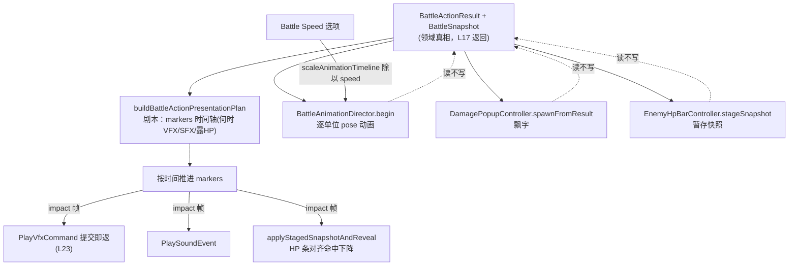

# L19 战斗表现与动画导演

action 怎么产生（L18）、怎么结算（L17）都清楚了。但到现在为止，战斗还是"一堆数字在后台跳"——你提交一个攻击，HP 瞬间就变了，没有前冲、没有命中顿帧、没有飘字、没有特效。本讲讲的就是**"看起来"的那一层**：精灵怎么动、伤害怎么飘、敌人 HP 条怎么掉、胜利演出怎么放。

但比"怎么画"更重要的是一条贯穿全讲的**铁律**——**表现层只单向消费领域返回的结果快照，绝不反过来改规则真相**。这是 L16"领域核心不依赖 UI"的镜像：那讲说"领域不知道 UI 存在"，这讲说"UI 只读领域、不写领域"。两句话合起来，就是战斗逻辑和战斗表现之间那道干净的墙。VFX 的具体后端不在本讲展开——你只需要知道发一个 `PlayVfxCommand` 是"提交即返"，机制留 L23。

---

## 🎯 本讲目标

读完之后，你应该能回答：

1. "表现层快照"和"领域真相"分别在何时被读、被写？如果表现层把自己的显示值当成真相去用，会出什么 bug？
2. 战斗速度倍率（Battle Speed 选项）作用在哪一层？为什么是缩放动画时间轴，而不是直接缩放 `dt`？
3. 伤害飘字和敌方 HP 条都有 "Off" 开关。在一段演出正在播的中途把它关掉，已经在屏幕上的视图怎么收尾？
4. 一个 `BattleActionResult` 是怎么变成"精灵前冲 + 命中帧放特效 + 飘字 + HP 条下降"这一整套编排的？中间隔了几层？

---

## 👁️ 先看再讲：把 Battle Speed 拉到 3×

进游戏打一场，先正常看一次攻击的"演出"：施法者前冲、命中那一帧目标抖一下、伤害数字飘起来、敌人 HP 条平滑下降。

然后打开 Options，把 **Battle Speed** 从 1× 调到 **3×**，再打一次。你会看到——**整套演出明显变快了，但伤害数字一模一样、胜负走向一模一样**。

这个对比就是本讲的核心：**战斗速度只加速了"表现"，没碰"逻辑"**。如果它是粗暴地缩放 `dt`，那连随机数、状态计时都会跟着变，伤害数字就可能不同了。它没有——因为速度只除在动画时间轴的那些 `*_seconds` 字段上。本讲就讲清楚：领域那个 `BattleActionResult` 是怎么被一层层翻译成画面的，而这层翻译又怎么做到"快慢随你调、真相纹丝不动"。

---

## 🗺️ 关键链路



一句话：**领域结果是唯一真相源，表现层四个消费者（导演 / 飘字 / HP 条 / 特效）全是单向读它**，再各自按时间轴把它演出来。

---

## 💡 核心知识点

### 1. 铁律：表现只消费快照，不碰真相

整条表现链上，没有任何一个控制器会去改 `BattleSession` 里的数据。它们的输入永远是 `BattleActionResult`（行动结果）或 `BattleSnapshot`（全量快照）——都是 L17 `submitAction` 返回的**只读副本**。

最能说明问题的是"真相值 vs 显示值"的分离。看敌方 HP 条状态（[`battle_enemy_hp_bar_controller.h`](../../src/game/scene/battle_enemy_hp_bar_controller.h)）：

```cpp
struct BattleEnemyHpBarState {
    float target_ratio{1.0f};    ///< 真实 HP 比例（来自快照，这是真相）
    float display_ratio{1.0f};   ///< 绘制用比例，平滑追随 target_ratio（这是表现）
};
```

`target_ratio` 直接来自快照，是真相；`display_ratio` 以 `ratio_lerp_speed` 每帧朝它逼近，是"看起来在掉血"的那个平滑动画。胜利演出里的金币/经验 count-up 也是同一套（`BattleVictoryCountValue{ int target; int display; }`）——目标值立刻知道，显示值慢慢数上去。

这就是自测题 1 的答案：**真相在 `submitAction` 那一刻就写定了（领域侧），表现层只在之后逐帧读它、生成滞后的显示值。** 如果谁图省事把 `display_ratio` 当成真实 HP 去做判定（比如"display 到 0 就判死"），就会和领域的真实 HP 错位——动画还没播完，逻辑上可能早死了，或反之。**显示值永远不能回流当真相**，这道墙不能破。

### 2. 两层翻译：先写剧本（Plan），再让演员演（Director）

从一个 `BattleActionResult` 到满屏演出，中间隔着**两层**（自测题 4）：

**第一层——剧本** `buildBattleActionPresentationPlan`（[`battle_action_presentation_plan.h`](../../src/game/scene/battle_action_presentation_plan.h)）把结果翻成一条**带时间戳的标记序列**：

```cpp
struct BattlePresentationMarker {
    BattlePresentationMarkerType type;  // TargetVfx / TargetSfx / EnemyHpReveal
    float time_seconds;                 // 在时间轴的哪一刻触发
    std::optional<BattleUnitId> target_id;
    engine::vfx::PlayVfxCommand vfx_command;   // 到点就提交的特效命令
    engine::utils::PlaySoundEvent sound_event;
};
struct BattleActionPresentationPlan {
    float duration_seconds, impact_time_seconds, recovery_time_seconds, ...;
    std::vector<BattlePresentationMarker> markers;   // "第 0.22 秒放火球特效 + 音效 + 露 HP 条"
};
```

剧本是纯数据——"几点几秒该发生什么"，不含任何播放逻辑。

**第二层——演员** `BattleAnimationDirector`（[`battle_animation_director.h`](../../src/game/scene/battle_animation_director.h)）按 motion_style（WeaponAttack / Cast / Guard / Escape / Simple）把结果演成**逐单位的 pose**：

```cpp
struct BattleAnimationPose {
    glm::vec2 offset;          // 相对阵型锚点的位移（前冲/后撤/受击抖动）
    float scale_multiplier, rotation_radians;
    engine::utils::FColor color_multiplier;   // 受击泛红等
};
std::optional<BattleAnimationPose> poseFor(BattleUnitId) const;   // 每帧问导演："这个单位现在该摆什么 pose"
```

战斗场景每帧推进剧本（到点的 marker 就提交 `PlayVfxCommand`/音效、或 `applyStagedSnapshotAndReveal` 让 HP 条下降）和导演（`update(dt)` 后用 `poseFor` 取 pose 去画）。**剧本管"何时"、导演管"怎么动"**，两者都只读 result。VFX 那一步——marker 里的 `PlayVfxCommand` 提交出去就返回，特效后端怎么渲染是 L23 的事。

### 3. side-view 精灵 = L14 外观快照 + anchor + 导演 pose

战斗里那些 side-view 精灵不是新画的——它们**复用 L14 的分层外观**。L15 入场时 `capturePlayerBattleAppearance` 拍下的 `AppearanceSnapshot` 经 `buildBattleSpriteSeeds` 变成战斗精灵的图层，渲染走的还是 L14 那套 `LayeredSprite`。

战斗表现把"位置"拆成两部分：

```cpp
struct BattlePresentationUnitAnchor {
    glm::vec2 base_screen_position;   ///< 阵型坐标，不含任何演出偏移
    bool alive_after;
};
```

`BattlePresentationUnitAnchor`（[`battle_presentation_unit_anchor.h`](../../src/game/scene/battle_presentation_unit_anchor.h)）是单位"站位"的**静止锚点**；导演的 `BattleAnimationPose.offset` 则是叠在锚点之上的**临时位移**。画一个单位 = 锚点位置 + 导演 pose 偏移。这样"它站哪儿"（阵型）和"它正在做什么动作"（前冲/受击）彻底解耦——动画播完，pose 归零，精灵自然回到锚点，不需要"记住原位再还原"。这也是为什么外观要在 L14 之前讲：side-view 精灵不是黑盒，它就是 L14 的外观系统 + 战斗专用 anchor。

### 4. Battle Speed 缩的是时间轴，不是 dt

先看再讲那个"3× 变快但数字不变"，实现就一行——`scaleAnimationTimeline`（[`battle_animation_director.h`](../../src/game/scene/battle_animation_director.h)）：

```cpp
/// speed > 0 时各 *_seconds 字段除以 speed；speed == 1 等价 no-op；非位移/枚举字段不变。
void scaleAnimationTimeline(BattleAnimationTimelineConfig& config, float speed) noexcept;
```

战斗场景在为每个动作构建时间轴配置时调它（[`battle_scene.cpp`](../../src/game/scene/battle_scene.cpp) 的 `animationConfigForPlan`）：

```cpp
config.duration_seconds   = plan.duration_seconds;
config.impact_time_seconds = plan.impact_time_seconds;
scaleAnimationTimeline(config, battle_animation_speed_);   // 速度只除在这些时长上
```

`battle_animation_speed_` 来自用户设置（`user_settings.h` 里取值 1.0/1.5/2.0/3.0），通过设置变更事件实时更新。

这是自测题 2 的答案：**速度只缩放动画时间轴里的那些时长字段。** 为什么不直接缩 `dt`？因为 `dt` 是整个战斗场景的逻辑时钟——缩它会一并加速飘字、HP 条平滑、甚至将来任何吃 `dt` 的逻辑，难以预测，也可能影响确定性。而玩家想要的只是"动作演得快点"，**伤害、命中、胜负这些真相必须和速度无关**。把速度限制在"动画时长"这一个明确的旋钮上，既满足需求，又守住了那道墙。

### 5. 飘字与 HP 条：消费 result，对齐命中，且能优雅关掉

飘字和 HP 条都是"读 result → 生成短生命周期视图"的典型消费者，但有两个细节值得品。

**对齐命中帧**。HP 条不是结算瞬间就掉——而是先 `stageSnapshot` 暂存真相快照，等剧本推进到 impact marker 那一刻才 `applyStagedSnapshotAndReveal`，让血条**正好在视觉命中的那帧**开始下降（[`battle_scene.cpp`](../../src/game/scene/battle_scene.cpp) 的调度循环）。飘字同理，按 `impact_time_seconds` 延迟弹出。**真相早就定了，但表现要等"看起来打中"的那一刻才兑现。**

**优雅关掉**（自测题 3）。两个控制器都有 `setEnabled`，且都明确处理了"播放中途关掉"：

- 飘字：禁用时 `spawnFromResult` **不再入列新条目，但已在播的按原时间轴自然消亡**——不强行清空，免得画面突兀截断。
- HP 条：禁用时 reveal/highlight 不再抬高 alpha，`update()` 把已显示的条按 `fade_seconds` **淡出**到消失；而且切到禁用时要**立即清掉 reveal 计时器和 highlight**，否则 `update()` 会因为"还有 reveal 时间 / 仍被高亮"把 alpha 一直顶在 1，关了等于没关。

这两段"关闭语义"是很多人会漏的边界——开关不只是"别画新的"，还得管好"正在画的怎么收场"。开关本身来自 Options（`show_damage_popup` / `show_enemy_hp_bar`，见 L22 用户设置）。

### 6. 胜利演出：又一个纯逻辑、可单测的控制器

胜利结算的那段"金币哗啦啦数上去、弹出掉落和升级"由 `BattleVictoryFlowController`（[`battle_victory_flow_controller.h`](../../src/game/scene/battle_victory_flow_controller.h)）驱动，阶段是 `Inactive → Intro → Rewards → WaitConfirm`。它和前面所有控制器共享同一种气质——**纯逻辑、不依赖渲染、对外只给只读 `snapshot()`**：

```cpp
void begin(const BattleRewardSummary& reward_summary, PartyExperienceGrantResult experience_preview = {});
void update(float delta_time_seconds);   // 推进阶段 + count-up 数字动画
void confirm();                          // 演出中→加速到等待确认；等待确认时→结束
[[nodiscard]] BattleVictoryFlowSnapshot snapshot() const;
```

它消费的 `BattleRewardSummary` 来自 `BattleRewardResolver`（**L20 细讲**）——注意它只拿来"演出展示"，真正把金币/经验写回探索态是 L20 的结算阶段。又一次"表现只读、不写真相"。因为是纯逻辑，它能像 L16 的 `TurnCore` 一样脱离场景单测：喂一个 reward summary，断言数字 count-up 到目标值、确认后 `finished()`。

---

## 📋 阅读清单

| 资源 | 为什么读 |
| --- | --- |
| [`ui/rmlui/theme/battle_enemy_icons.rcss`](../../ui/rmlui/theme/battle_enemy_icons.rcss) + [`battle_state_icons.rcss`](../../ui/rmlui/theme/battle_state_icons.rcss) | 敌方图标 / 状态图标的样式；表现层 RmlUi 侧的呈现 |
| L16《回合制战斗领域核心》 | "领域不依赖 UI"；本讲是它的镜像"UI 不写领域" |
| L14《分层角色外观与头像》 | side-view 精灵复用的就是 L14 的 `LayeredSprite` + 外观快照 |
| L15《探索↔战斗的过渡》 | 入场 `capturePlayerBattleAppearance` → `buildBattleSpriteSeeds` 的来龙去脉 |
| L22《本地化与用户设置》（预读） | Battle Speed / Damage Popups / Enemy HP Bar 三个 Options 的真源 |

---

## 🔑 源码入口

| 文件 | 看什么 |
| --- | --- |
| [`src/game/scene/battle_action_presentation_plan.h`](../../src/game/scene/battle_action_presentation_plan.h) | 剧本层：`BattlePresentationMarker` 时间轴、`buildBattleActionPresentationPlan`——**本讲主入口** |
| [`src/game/scene/battle_animation_director.h`](../../src/game/scene/battle_animation_director.h) | 演员层：`BattleAnimationPose`、`poseFor`、`scaleAnimationTimeline`（Battle Speed） |
| [`src/game/scene/battle_damage_popup_controller.h`](../../src/game/scene/battle_damage_popup_controller.h) | 飘字：`spawnFromResult`、`setEnabled` 的关闭语义、impact 延迟 |
| [`src/game/scene/battle_enemy_hp_bar_controller.h`](../../src/game/scene/battle_enemy_hp_bar_controller.h) | HP 条：`target_ratio` vs `display_ratio`、`stageSnapshot`/`applyStagedSnapshotAndReveal`、淡出 |
| [`src/game/scene/battle_victory_flow_controller.h`](../../src/game/scene/battle_victory_flow_controller.h) | 胜利演出：纯逻辑 count-up、阶段机、只读 `snapshot()` |

---

## ❓ 自测问题

1. 敌方 HP 条的 `target_ratio` 和 `display_ratio` 分别在什么时候被写？如果某段判定逻辑误用 `display_ratio` 当真实血量，会观察到什么错位现象？
2. 把 Battle Speed 调到 2×，一次攻击的伤害数字会变吗？为什么？如果改成"缩放战斗场景的 `dt`"，又会有什么副作用？
3. 一段攻击演出（飘字正飘、HP 条正掉）播到一半，玩家在 Options 里关掉 Damage Popups 和 Enemy HP Bar，这两个视图各自会怎么收尾？HP 条控制器为什么必须在禁用瞬间清掉 reveal 计时器和 highlight？
4. 从 `BattleActionResult` 到"精灵前冲 + 命中帧特效 + 飘字 + HP 下降"，中间隔了"剧本"和"演员"两层。各自的职责边界是什么？为什么 HP 条要等到 impact marker 才下降，而不是结算瞬间？

---

## 🧪 最小练习

**目标**：改一个时长，亲手感受"表现时间轴"和"逻辑真相"的分离。

1. **找时间轴字段**：打开 [`battle_animation_director.h`](../../src/game/scene/battle_animation_director.h) 的 `BattleAnimationTimelineConfig`，挑一个 `*_seconds` 字段——比如 `attack_duration_seconds{0.72f}` 或 `weapon_lunge_seconds{0.14f}`。
2. **翻倍**：把它的默认值翻倍（如 `attack_duration_seconds` 改成 `1.44f`），重新构建。
3. **观察**：进游戏打一场普攻，注意整体节奏变慢了，但**伤害数字、命中与否、胜负完全不变**——你只动了"演出时长"，没动任何真相。
4. **再叠加 Battle Speed**：把 Options 的 Battle Speed 调到 2×，看你翻倍的那个时长又被 `scaleAnimationTimeline` 除回来一半。想清楚：**默认时长（数据）× 用户速度（÷speed）= 实际播放时长**，这两个旋钮叠在一起、但都只作用于表现层。

**进阶**：在 `BattleDamagePopupController` 里给某类飘字（如 `Critical`）改一个明显不同的颜色或时长（看 `battleDamagePopupColor` 和 `*_duration_seconds`），打一场验证。再想：如果你想加一种"治疗数字从下往上飘绿字"的新 popup kind，需要碰哪几处？（提示：`BattleDamagePopupKind` 枚举 + 颜色函数 + `spawnFromResult` 的分类逻辑——全在表现层，碰不到领域。）

---

## 📌 小结

- **铁律：表现只消费快照、不碰真相**。所有控制器输入都是 L17 返回的 `BattleActionResult`/`BattleSnapshot` 只读副本；`target_ratio`/`display_ratio`、count-up `target`/`display` 都是"真相 vs 显示"的分离，显示值绝不回流当真相。
- **两层翻译**：`buildBattleActionPresentationPlan` 写"剧本"（带时间戳的 marker 序列，何时 VFX/SFX/露 HP），`BattleAnimationDirector` 当"演员"（按 motion_style 出逐单位 pose）；剧本管何时、导演管怎么动。
- **side-view 精灵复用 L14**：外观快照 + `LayeredSprite` 渲染；位置 = 静止 `BattlePresentationUnitAnchor` + 导演临时 pose offset，动作与站位解耦。
- **Battle Speed 缩时间轴非 dt**：`scaleAnimationTimeline` 只把 `*_seconds` 除以 speed，伤害/命中/胜负与速度无关；缩 dt 会污染逻辑与确定性。
- **飘字/HP 条**：消费 result、按 impact 帧对齐命中（`stageSnapshot`→`applyStagedSnapshotAndReveal`）；Options 关闭时优雅收尾（飘字自然消亡、HP 条淡出并清 reveal/highlight）。
- **胜利演出**：`BattleVictoryFlowController` 纯逻辑 count-up、阶段机、只读 snapshot，消费 reward summary 仅作展示，写回真相是 L20。

## 🚀 下节课预告

战斗好看了，但打完那一下——金币、掉落、经验、任务进度，怎么从战斗场景**回到探索态**？

下一讲 **L20 战斗结算、奖励与探索态写回**：`BattleRewardResolver` 怎么聚合金币/掉落/经验，`BattleEndedEvent` 回到 `GameScene` 后的**固定写回顺序**（背包 → 钱包 → 任务进度 → 角色成长），失败/逃跑/胜利三类 outcome 的不同处理，以及战斗内物品副本如何与真实背包合并——L17 那条"运行时副本、结束才原子写回"的主线，在这一讲收口。Stage V 战斗闭环就此完成。下讲见。
