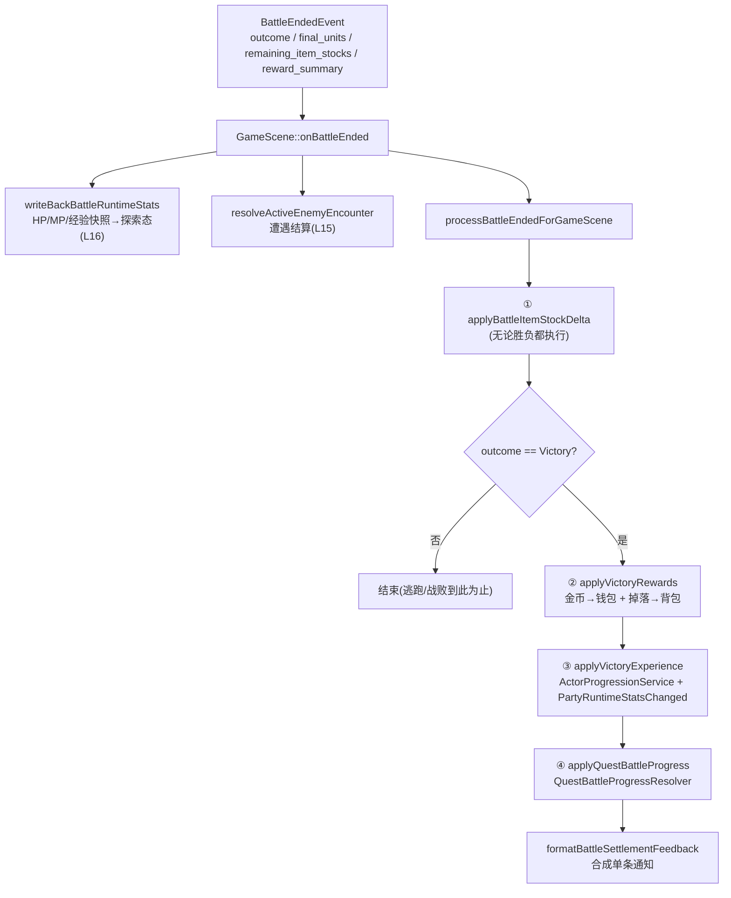

# L20 战斗结算、奖励与探索态写回

战斗能进（L15）、有规则（L16-L17）、能产生 action（L18）、还好看（L19）。但打完那一下——金币、掉落、经验、任务进度——怎么从战斗场景**落地回探索态**？这是 Stage V 的最后一块拼图，也是几条老主线的**收口处**：

- L17 那条"战斗内动的是物品副本、结束才原子写回"——在本讲终于兑现写回。
- L13 的 `ActorProgressionService`、L10 的任务 progress key——在本讲被战斗结果驱动。
- L16 的"单位带 `source_actor_id`/`source_enemy_id` 纽带"——在本讲用来把战斗结果映射回探索态真相。

读完本讲，你会看到一个设计良好的结算流程长什么样：**纯逻辑聚合奖励 → 固定顺序原子写回 → 按 outcome 分流 → 汇成一条反馈**。

---

## 🎯 本讲目标

读完之后，你应该能回答：

1. 战斗结束的写回为什么有一个**固定顺序**（物品库存 → 金币掉落 → 经验 → 任务）？把任务推进提到背包写回之前会出什么问题？
2. 战斗**胜利**、**逃跑**、**战败**三种结局，在"物品消耗结算"和"奖励发放"上分别怎么处理？哪些步骤是三者共有的？
3. 战斗里打怪升了级，HP/MP 上限变了——这个变化**什么时候**、**通过什么**反馈给探索态 UI？满级时又会怎样？
4. 战斗里喝掉的药水和捡到的掉落，最终是怎么和真实背包合并的？谁保证这步是原子的？

---

## 👁️ 先看再讲：结算的规格写在测试里

结算写回不依赖渲染，所以又是一组可确定性验证的测试。两个文件正好覆盖两侧：

```bash
cmake --build build/debug --target game_tests
ctest --test-dir build/debug -R "GameSceneBattleRewardWriteback|QuestBattleProgressResolver" --output-on-failure
```

[`game_scene_battle_reward_writeback_test.cpp`](../../tests/game/game_scene_battle_reward_writeback_test.cpp) 的八个 case 名，几乎逐条就是本讲的规则：

| 测试名 | 锁定的规则 |
| --- | --- |
| `VictoryWritesBackDeltaRewardsAndNotification` | 胜利：写回奖励 + 弹通知 |
| `VictoryWritesExperienceAndLevelUpResult` | 胜利：写经验、产出升级结果 |
| `DefeatOnlyWritesBackBattleItemDelta` | **战败：只结算物品消耗，不发奖励** |
| `EscapedOnlyWritesBackBattleItemDelta` | **逃跑：同上，只结算物品消耗** |
| `MaxLevelExperienceDoesNotEmitRuntimeStatsChanged` | 满级吃经验：不发状态变更事件 |
| `VictoryReportsRejectedDropsWhenInventoryIsFull` | 背包满：掉落入包失败要报告 |
| `VictoryCombinesRewardAndQuestProgressIntoSingleNotification` | 奖励 + 任务推进合成**一条**通知 |

光读这几个名字，自测题 2、3 的答案就呼之欲出了。本讲就讲这套规则背后的实现。

---

## 🗺️ 关键链路



一句话：**`BattleEndedEvent` 回到 `GameScene`，按"物品消耗 → 奖励 → 经验 → 任务"固定顺序写回，非胜利在物品消耗后即止，最后汇成一条反馈。**

---

## 💡 核心知识点

### 1. `BattleRewardResolver`：纯逻辑聚合，且只在胜利时

奖励的"算"和"写"是分开的。**算**由 `BattleRewardResolver`（[`battle_reward_resolver.cpp`](../../src/game/battle/battle_reward_resolver.cpp)）负责——纯逻辑，只读 `final_units`，吐一个 `BattleRewardSummary`：

```cpp
BattleRewardSummary BattleRewardResolver::resolve(BattleOutcome outcome,
                                                  const std::vector<BattleUnit>& final_units,
                                                  const RpgCatalog& rpg_catalog) {
    BattleRewardSummary summary{};
    if (outcome != BattleOutcome::Victory) return summary;   // 非胜利 → 空奖励

    for (const auto& unit : final_units) {
        if (unit.side != BattleSide::Enemy || unit.isAlive() || !unit.source_enemy_id) continue;  // 只数"死掉的敌人"
        const auto* enemy = rpg_catalog.findEnemy(*unit.source_enemy_id);
        if (!enemy) continue;
        summary.gold_total += enemy->gold_reward_;
        summary.exp_total  += enemy->exp_reward_;
        for (const auto& drop : enemy->drops_) {
            if (nextDropRoll() >= drop.chance_) continue;     // 掉落概率判定
            appendItemDrop(summary, drop.item_id_);
        }
    }
    return summary;
}
```

金币/经验/掉落全部来自**被击败敌人**的 `EnemyData`（catalog 驱动，呼应 L9）。关键细节：**掉落 roll 只发生一次**——在 `BattleScene` 里 resolve 出 summary，既喂给 L19 的胜利演出做预览展示，又**塞进 `BattleEndedEvent::reward_summary` 带回写回阶段**，于是写回时直接用这份已定的 summary，绝不重新 roll（`events_battle.h` 里那句注释"避免写回阶段重复 roll 掉落"正是此意）。算一次、演一次、写一次，三处同一份真相。

### 2. 运行时副本的收口：`applyBattleItemStockDelta`

L17 反复强调"战斗内动的是 `item_stocks` 副本，不碰真实背包"。这笔账在 `applyBattleItemStockDelta`（[`game_scene_battle_settlement.cpp`](../../src/game/scene/game_scene_battle_settlement.cpp)）结清——用**差额**算出净消耗：

```cpp
std::unordered_map<entt::id_type, int> deltas{};
for (const auto& [item_id, count] : remaining_item_stocks)              deltas[item_id] += count;   // 战斗结束剩多少
for (const auto& [item_id, count] : active_battle_initial_item_stocks)  deltas[item_id] -= count;   // 入场时有多少
// delta < 0 → 净消耗 → removeItem；delta > 0 → 净增加 → addItem（都经 InventoryDomainService）
```

`remaining`（战斗带回）减 `initial`（入场快照），负数就是这场战斗净喝掉的药水，正数就是净获得的——再分别走 `InventoryDomainService::removeItem/addItem`**原子地**落到真实背包（自测题 4）。这一步是 L17 那条主线的终点：**探索态背包只在这一刻、以差额的方式、经领域服务被改写一次**。注意它**无论胜负都执行**——哪怕你战败了，战斗中喝掉的药水也得真扣掉。

### 3. 固定写回顺序，且非胜利提前止步

`processBattleEndedForGameScene` 的主干就是一串**有序**调用：

```cpp
applyBattleItemStockDelta(...);                  // ① 物品消耗差额（总是执行）
if (evt.outcome != BattleOutcome::Victory) return;   // ← 非胜利到此为止

const auto reward_result     = applyVictoryRewards(...);      // ② 金币→钱包 + 掉落→背包
const auto experience_result = applyVictoryExperience(...);   // ③ 经验→角色成长
const auto quest_result      = applyQuestBattleProgress(...); // ④ 任务进度
// 然后 formatBattleSettlementFeedback(reward, experience, quest) → 一条通知
```

> 注意真实顺序是 **物品消耗 → 奖励(金币+掉落) → 经验 → 任务**——经验在任务之前（和某些直觉相反）。

为什么是这个顺序（自测题 1）？核心是**背包相关的写入必须先于其余步骤完成**：

- ①物品差额必须最先——它要把战斗副本的消耗 reconcile 回真实背包，**之后②的掉落 `addItem` 才是叠在一个干净、已结清的背包上**。若顺序反过来，掉落可能加到一个还没扣除消耗的"虚高"背包里，在背包接近满时引发本不该发生的 rejected。
- ④任务推进和最后的反馈通知放在最后，是因为它们要基于**已经提交完的**背包/钱包/经验状态来生成一致的结算摘要。每一步都返回一个结果结构（`BattleRewardWritebackResult` / `PartyExperienceGrantResult` / `QuestBattleProgressSummary`），最后一起喂给 `formatBattleSettlementFeedback` 汇成单条通知——顺序错了，通知里看到的就是中间态。

### 4. 三类 outcome：Victory 全套，Defeat/Escaped 只结物品

三种结局走的是**同一个函数**，靠 `outcome` 那道 `if` 分流（自测题 2）：

- **Victory**：①②③④全套——结物品消耗、发金币掉落、给经验、推任务。
- **Escaped（逃跑成功）/ Defeat（战败）**：**只执行①** `applyBattleItemStockDelta`，然后 `return`。没有奖励、没有经验、没有任务推进。

这就是为什么测试里 `DefeatOnlyWritesBackBattleItemDelta` 和 `EscapedOnlyWritesBackBattleItemDelta` 是分开却内容对称的两个 case——它们钉死了"逃跑和战败在写回上等价：都只清算你战斗中消耗的物品"。三者的**共有步骤**只有①物品差额，因为无论结局如何，你喝掉的药水都该真扣。（逃跑和战败在战斗内部、地图侧的差别——比如敌人是否回家——是 L15 `resolveActiveEnemyEncounter` 管的；本讲只看背包/奖励侧。）

### 5. 经验、升级与 UI 反馈：commit 在写回、展示分两处

经验写回由 `applyVictoryExperience` 调 `ActorProgressionService::grantExperience`（L13 那个领域服务）完成，它返回带升级信息的结果：

```cpp
struct ActorExperienceGrant {
    int old_level, new_level;
    int hp_max_delta, mp_max_delta;            // 升级带来的 HP/MP 上限变化
    [[nodiscard]] bool leveledUp() const { return new_level > old_level; }
};
// PartyExperienceGrantResult.runtime_state_changed → 真的改了运行时状态时为 true
```

升级反馈给 UI 的链路（自测题 3）：grantExperience 写完后，**若 `runtime_state_changed`**，就 `dispatcher.trigger(PartyRuntimeStatsChanged{ .full_sync = true })`——探索态 UI 收到后全量刷新角色面板。而 `formatLevelUpStatText` 把 HP/MP 上限变化拼进那条结算通知。注意 `MaxLevelExperienceDoesNotEmitRuntimeStatsChanged` 这个测试：**满级再吃经验，runtime_state 没变，就不发事件**——避免无意义的 UI 刷新。

这里还藏着一个 L19 的呼应：升级的"展示"其实有**两处**——L19 胜利演出里的 count-up 是 **preview**（纯表现、不提交），本讲的 `grantExperience` + `PartyRuntimeStatsChanged` 才是 **commit**（真改探索态 + 真刷 UI）。演出先让你"看到"会升级，写回阶段才真正"生效"，再次印证"表现只读、写回才是真相"。

---

## 📋 阅读清单

| 资源 | 为什么读 |
| --- | --- |
| [`tests/game/game_scene_battle_reward_writeback_test.cpp`](../../tests/game/game_scene_battle_reward_writeback_test.cpp) | 八个 case = 写回规则规格书；先看再讲与练习素材 |
| [`tests/game/quest_battle_progress_resolver_test.cpp`](../../tests/game/quest_battle_progress_resolver_test.cpp) | 任务推进的胜利/非胜利/跳过/真实数据四类断言 |
| L17《战斗动作解析》 | "运行时副本结束才写回"的上游；本讲 ① 是它的收口 |
| L13《装备、成长与休息》 | `ActorProgressionService::grantExperience` 与升级 HP 补满策略 |
| L10《任务系统》 | objective progress key（`quest_id::objective_id`）在本讲被战斗结果推进 |

---

## 🔑 源码入口

| 文件 | 看什么 |
| --- | --- |
| [`src/game/scene/game_scene_battle_settlement.cpp`](../../src/game/scene/game_scene_battle_settlement.cpp) | `processBattleEndedForGameScene` 固定顺序 + `applyBattleItemStockDelta` 差额——**本讲主入口** |
| [`src/game/battle/battle_reward_resolver.cpp`](../../src/game/battle/battle_reward_resolver.cpp) | Victory-only 聚合金币/经验/掉落；掉落 roll 一次 |
| [`src/game/domain/quest_battle_progress_resolver.cpp`](../../src/game/domain/quest_battle_progress_resolver.cpp) | 按击败计数推进 DefeatEnemyCount objective，标记 ready |
| [`src/game/scene/game_scene_reward_feedback.h`](../../src/game/scene/game_scene_reward_feedback.h) | `BattleRewardWritebackResult`、`formatBattleSettlementFeedback` 合成单条反馈 |
| [`src/game/domain/actor_progression_service.h`](../../src/game/domain/actor_progression_service.h) | `grantExperience`、`ActorExperienceGrant`、`runtime_state_changed` |

---

## ❓ 自测问题

1. 写回的真实顺序是"物品消耗 → 金币掉落 → 经验 → 任务"。为什么物品消耗差额必须排在掉落入包之前？如果反过来，在背包接近满时会观察到什么异常？
2. 逃跑成功和战败，在 `processBattleEndedForGameScene` 里走到哪一步就返回了？它们和胜利**共有**哪一步、为什么这一步对三种结局都必须执行？
3. 打怪升级后 HP 上限 +10。这个变化通过哪个事件、在什么条件下通知 UI？为什么满级吃经验时这个事件不会发？L19 胜利演出里看到的"升级"和本讲的写回是什么关系？
4. 掉落的 roll 发生在哪一层、发生几次？为什么要把 roll 结果放进 `BattleEndedEvent` 带回，而不是在写回阶段重新 roll？

---

## 🧪 最小练习

**目标**：让一场战斗胜利后掉落一件新物品，全链路验证"结算 → 背包 → UI 通知"。

1. **加掉落**：打开 [`assets/data/rpg/enemies.json`](../../assets/data/rpg/enemies.json)，找到 `enemy.slime`（它现在 `drops: []`），给它加一条掉落（参照 `enemy.goblin` 的 `material_stone` 写法）：
   ```jsonc
   "drops": [ { "item_id": "material_stone", "chance": 1.0 } ]   // chance 设 1.0 保证必掉，方便验证
   ```
   （`item_id` 必须是 `item_config.json` 里真实存在的物品，`material_stone` 即是。）
2. **打一场**：和 slime 开战并取胜（用 L15 的调试面板或地图遭遇）。
3. **全链路验证**：
   - **背包**：胜利后打开背包，确认多了一个 material_stone。
   - **通知**：注意战斗结束那条结算通知里列出了这件掉落（`formatBattleSettlementFeedback` 的产物）。
   - **测试法**：参照 `VictoryWritesBackDeltaRewardsAndNotification` 写个断言版本，确定性验证 drop 进了 `BattleRewardWritebackResult::item_results`。
4. **试边界**：把背包塞满再打，观察 `VictoryReportsRejectedDropsWhenInventoryIsFull` 描述的情形——掉落 `addItem` 的 `accepted` < `count`，通知如何报告 rejected。

**进阶**：给某 quest 的 `DefeatEnemyCount` objective 配成数 slime（`enemy_id` 指向 slime），接了任务后打 slime，验证胜利后任务进度 +1 且（够数时）变为可交付——对照 `QuestBattleProgressResolverTest` 的 `VictoryAggregatesKillsUpdatesProgressAndMarksReadyQuests`。想清楚这条链怎么从"战斗 final_units"一路推到"任务 objective_progress"。

---

## 📌 小结

- **算与写分离**：`BattleRewardResolver` 纯逻辑聚合金币/经验/掉落（仅 Victory、源自死敌的 `EnemyData`）；掉落只 roll 一次，经 `BattleEndedEvent::reward_summary` 带回，演出与写回共用同一份。
- **运行时副本收口**：`applyBattleItemStockDelta` 用 `remaining − initial` 差额，经 `InventoryDomainService` 原子 remove/add 落到真实背包——L17 主线的终点，且无论胜负都执行。
- **固定写回顺序**：物品消耗 → 金币掉落 → 经验 → 任务 → 单条反馈；背包写入先行，保证掉落叠在已结清的背包上、任务/通知基于一致的提交后状态。
- **三类 outcome 分流**：同一函数靠 `outcome` 判断——Victory 全套，Escaped/Defeat 只结物品消耗即返；共有步骤只有物品差额。
- **升级反馈分两处**：`grantExperience` 写回真相，`runtime_state_changed` 时发 `PartyRuntimeStatsChanged{full_sync}` 刷 UI（满级不发）；L19 演出是 preview、本讲写回是 commit。

至此 **Stage V 回合制战斗闭环全部完成**：进入（L15）→ 核心（L16）→ 解算（L17）→ 生产 action（L18）→ 表现（L19）→ 结算写回（L20）。一场战斗从触发到落地探索态，每一环都讲透了。

## 🚀 下节课预告

战斗、探索、任务、商店、队伍——所有这些状态，怎么**存下来、读回来**，还要能扛住未来加新字段？

进入 **Stage VI 工程化收尾**。下一讲 **L21 存档系统与 Schema 迁移**：把存档当作"全项目最大的一次原子写入"来讲——`SaveService` 的组件序列化与原子替换、存档涵盖哪些状态（玩家/背包/队伍/任务/商店/世界/`tf.state`）、新增组件时的存档接入 checklist、`SaveMigrator` 与 schema 版本号在"未上线项目可重置"前提下的取舍，以及后台异步保存。下讲见。
