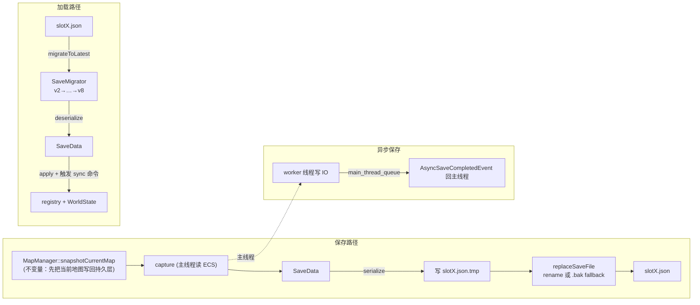

# 第21节课 · 存档系统与 Schema 迁移

Stage V 把战斗闭环讲完了。现在进入 **Stage VI 工程化收尾**——让这个长大的项目"扛得住"。第一站是存档。

战斗、探索、背包、队伍、任务、商店、世界、甚至 Lua 的剧情 flag……所有这些状态，怎么**存下来、读回来**，还要能在你不断加新功能时不崩？这节课的核心视角是：**把存档当成"全项目最大的一次原子写入"**——它要么完整地落盘，要么干脆不动旧档，绝不留下半个损坏的存档。

围绕这个视角，这节课讲六件事：存档涵盖哪些状态、原子替换怎么做、迁移链怎么把旧档升到新版、坏 JSON 如何被拒绝、新增组件时存档的接入 checklist、以及后台异步保存。还有一条贯穿的取舍——**项目未上线，开发期可以直接删档重来，但一旦 bump schema，仍要走迁移的流程**，这道边界这节课会说清楚。

---

## 读完这节课，你应该能回答

1. "原子替换"在文件系统层面具体怎么做？为什么不能直接往原存档文件里写？
2. schema 从 v7 升到 v8，旧档加载时会发生什么？什么情况下必须写迁移代码、什么情况下可以省？
3. 给一个新功能加一个新组件，要让它进存档，接入点有哪几处？
4. 坏类型的 JSON 字段为什么要在 deserialize / migrator / slot summary 阶段显式拒绝？
5. 异步保存时，"抓取游戏状态"和"写文件"分别在哪个线程做？为什么必须这样分？

---

## 先看再讲：打开一个存档文件

存一次档（暂停菜单 → 保存到某个槽），然后用编辑器打开 `saves/slot0.json`。你会看到一棵清清楚楚的状态树：

```jsonc
{
  "schema_version": 8,            // ← 版本号，迁移和拒载都看它
  "timestamp": "...",
  "game_time": { "day": 3, "hour": 9.5, ... },
  "player": { "map_name": "home_exterior", "position": {...}, "inventory": {...}, "gold": 120 },
  "quest_state":  { "active_quests": [...], "completed_quests": [...], "objective_progress": {...} },
  "party_state":  { "recruited_actor_ids": [...], "active_actor_ids": [...], "max_active_members": 4 },
  "equipment_state": { "loadouts": {...} },
  "party_runtime_state": { "actor_states": { "actor.lyria": { "current_hp": 38, "level": 4, "total_exp": 210 } } },
  "combat_state": { "defeated_encounters": [...], ... },
  "script_state": { ... }         // ← Lua tf.state：剧情 flag、一次性宝箱
}
```

这棵树就是**整个项目某一刻的全状态快照**。注意几个呼应前面课程的字段：`party_runtime_state` 里 `total_exp` 是等级真源（[装备成长课](13-装备成长与休息.md)）；`script_state` 是 Lua `tf.state`（[Lua 内容层总览](06-Lua内容层总览.md)）。这节课就讲这棵树怎么被安全地写下去、读回来、以及版本演进时怎么升级。

> 顺手观察：保存的一瞬间，`saves/` 目录里会闪过一个 `slot0.json.tmp`——这就是原子替换的临时文件。下面 §2 讲它为什么存在。

---

## 关键链路



一句话：**保存 = snapshot 当前地图 → 主线程 capture → 写 .tmp → replaceSaveFile；加载 = 迁移到最新 → deserialize → apply + 发 sync 命令**。

---

## 核心知识点

### 1. 存档 = 全项目状态快照，`SaveData` 只管格式

存档涵盖的范围由 `save_data.h` 的 `json_keys` 一目了然——schema v8 当前的状态块：`quest_state`、`skill_state`、`appearance_state`、`party_state`、`equipment_state`、`party_runtime_state`、`combat_state`、`script_state`，外加玩家/时间/世界。`party_state` 里包含 `recruited_actor_ids`、`active_actor_ids` 和队伍上限 `max_active_members`。

关键设计：`SaveData` 是个**纯数据结构，只关心"格式与版本"，完全不碰 ECS / 系统 / 地图加载**。它和真实游戏状态之间隔着两个翻译函数：

- `capture()`：从 `registry` / `WorldState` 读出当前状态 → 填进 `SaveData`。
- `apply()`：把 `SaveData` 写回 `registry` / `WorldState`。

这层隔离的价值是：**序列化格式的演进（schema）和游戏内部表示（ECS 组件）解耦**。组件怎么改是游戏的事，`SaveData` 只负责"长成 JSON 该有的样子"。几个值得记的字段语义：`party_runtime_state.actor_states` 存 `current_hp/current_mp/level/total_exp`，读档时 **`total_exp` 是等级真源、`level` 按 actor 曲线重新推导**（[装备成长课](13-装备成长与休息.md)）；`script_state` 存 Lua `tf.state` 的 JSON 基元，承载一次性宝箱、剧情 flag 等内容层状态（[Lua 内容层总览](06-Lua内容层总览.md)）。

### 2. 原子替换：写临时文件，再 rename 覆盖

存档最怕"写到一半崩溃"——留下一个半截 JSON，下次读档直接解析失败、存档尽毁。`writeSaveFile`（[`save_service.cpp`](../../src/game/save/save_service.cpp)）用经典的**临时文件 + 原子重命名**根治这个问题：

```cpp
auto tmp_path = file_path; tmp_path += ".tmp";
{
    std::ofstream out(tmp_path, std::ios::binary | std::ios::trunc);
    out << json.dump(2);
    out.flush();
    if (!out.good()) { out_error = "..."; return false; }   // 写 .tmp 失败，真档纹丝不动
}
if (!replaceSaveFile(tmp_path, file_path, out_error)) {      // 原子替换或 .bak fallback
    return false;
}
```

这是问题 1 的答案：**完整内容先写进 `slotX.json.tmp`，确认写成功后，再用 `rename` 一步把它覆盖到 `slotX.json`。** 文件系统层面 `rename` 是原子的——任何时刻 `slotX.json` 要么是**完整的旧档**、要么是**完整的新档**，永远不会是"写了一半"的状态。如果直接往原文件写，写到一半断电，真档就成了垃圾。代价只是多一个临时文件和一次 rename，换来的是"存档永不半写"的强保证。

这里的 fallback 也要保护旧档：`replaceSaveFile()` 会先尝试 `rename(tmp, target)`；如果平台不允许覆盖已存在目标，它会把旧档移到 `slotX.json.bak`，再把 `.tmp` 改名为真档。第二次 rename 若失败，会尝试把 `.bak` 恢复回 `slotX.json`。所以兜底策略不是"删掉旧档再试一次"，而是**尽量让旧档在失败路径上还有恢复机会**。

### 3. 关键不变量：保存前必须 snapshot 当前地图

有个容易漏的正确性要求：**保存前必须先 `MapManager::snapshotCurrentMap()`**。原因（doc 说得很直接）：

- 玩家当前所在地图的动态实体（作物、资源点、宝箱等）是**运行时 ECS 实体**。
- 它们得先被写回 `WorldState` 的持久层快照，`capture()` 才能统一抓到。
- 跳过这一步，存档就只存了"玩家数据"，**丢掉"当前地图刚发生的变化"**——你刚砍倒的树、刚开的宝箱，读档后又回来了。

这是"快照式持久化"的典型陷阱：运行时实体和持久层是两份数据，保存前必须先把运行时的合并回持久层。记住这条，是因为它不会报错——它只会**静默丢状态**，最难查。

### 4. 迁移链：每步只管 N→N+1，串起来升任意旧档

读档前，`migrateToLatest`（[`save_migrator.cpp`](../../src/game/save/save_migrator.cpp)）先把旧 JSON **就地升级**到当前版本，再交给 `deserialize`。它是一条**顺序累积的迁移链**：

```cpp
std::uint32_t schema_version = 0;
if (!json.contains(KEY_SCHEMA_VERSION) ||
    !readUnsignedJsonValue(json[KEY_SCHEMA_VERSION], schema_version, KEY_SCHEMA_VERSION, out_error)) {
    return false;
}
if (schema_version == 0u)                 { out_error = "missing schema_version"; return false; }
if (schema_version > SAVE_SCHEMA_VERSION) { out_error = "unsupported schema_version"; return false; }

if (schema_version >= 2u && schema_version < 4u) { normalizeLatestFields(json); json[KEY_SCHEMA_VERSION] = 4u; }
if (json[KEY_SCHEMA_VERSION] == 4u) { migrateV4ToV5(json, out_error); }   // 每个小函数只管一步
if (json[KEY_SCHEMA_VERSION] == 5u) { migrateV5ToV6(json, out_error); }
if (json[KEY_SCHEMA_VERSION] == 6u) { migrateV6ToV7(json, out_error); }
if (json[KEY_SCHEMA_VERSION] == 7u) { migrateV7ToV8(json, out_error); }
// 到这里 == SAVE_SCHEMA_VERSION，迁移完成
```

精髓是：**每个 `migrateVNToVN+1` 只懂"从 N 到 N+1"这一步**，链式调用就能把任意中间版本一路升到最新。一个 v4 的旧档会依次流过 v4→v5→v6→v7→v8。两道护栏也很关键：`schema_version == 0`（缺失）拒载、`> SAVE_SCHEMA_VERSION`（来自未来的版本）拒载——**宁可拒绝，也不误读成更坏的状态**。注意链条从 v2 起步，更早的版本不支持——这正是"未上线项目可重置"的边界：只维护一个近期版本窗口，太老的直接弃。

这是问题 2 的答案：v7 升 v8，`migrateV7ToV8` 会跑，给 `party_state.max_active_members` 补默认 4，再 deserialize。**什么时候必须写迁移代码？** 当 schema 变化是**破坏性**的（字段改名、删除、结构重组）——旧档的 JSON 形状对不上新 `deserialize`，必须用迁移函数把它转换过来。**什么时候能省？** 当变化是**纯加性**的——只新增一个带合理默认值的字段，`deserialize` 用默认值读不到就取默认，旧档照样能加载；本项目仍倾向 bump schema，把"版本号"和"格式"保持对应。

### 5. 反序列化护栏：类型错就是坏档，不让异常漏出来

存档是玩家最不该被"半信半疑"处理的文件。`deserialize()`、`migrateToLatest()` 和 `tryReadSlotSummary()` 现在都走显式 typed read helper：先判断 JSON 字段是不是期望类型、是不是越界，再写进 C++ 字段；如果不对，返回 `false` 并填 `out_error`。例如 `schema_version: "8"`、`game_time.day: "three"`、`player.position.x: "left"` 都会被当作坏档拒绝，而不是让 `nlohmann::json::value<T>()` 抛异常穿透出来。

这里有个小但实用的口径：JSON 里手写的 `1` 常会被库表示成 signed integer，所以"unsigned 字段"接受**非负整数**，但拒绝负数、浮点、字符串和越界值。这样既不误伤正常手写档，也不放过真正不安全的形状。slot 摘要也是同一套思路：`tryReadSlotSummary()` 只读 `schema_version / game_time.day / timestamp`，但这几个字段类型不对时也会返回失败。

顺带看 UI 决策：`SaveSlotSelectScene` 遇到 invalid slot 时，**Load 模式禁用按钮**，因为坏档不该让玩家点进去；**Save 模式仍允许覆盖**，因为覆盖坏档正是恢复这个槽位的办法。这是"读坏档要保守，写新档要给出口"。

### 6. 新增组件接入存档的 checklist

把一个新组件纳入存档，接入点是固定的几处（问题 3）：

1. **格式**：在 `save_data.h` 给 `SaveData` 加字段 + 在 `json_keys` 加键名。
2. **序列化**：在 `save_data.cpp` 的 `serialize` / `deserialize` 里加这个字段的读写；`deserialize` 使用现有 typed read helper 给默认值并返回错误，而不是直接依赖 `json.value<T>()`。
3. **抓取**：在 `save_service.cpp` 的 `capture()` 里从 ECS / WorldState 读出来填进 `SaveData`。
4. **应用**：在 `apply()` 里写回 ECS，**并触发必要的 sync 命令**——`apply` 不只是填组件，还要发 `InventorySyncCommand` / `RefreshAppearanceCommand` / `HotbarSyncCommand` 之类，让 HUD/UI 跟着刷新（这和[战斗结算课](20-战斗结算与探索态写回.md)写回后发 `PartyRuntimeStatsChanged` 是同一个道理：改了真相要通知表现）。
5. **版本**：破坏性改动则 bump `SAVE_SCHEMA_VERSION` 并加一个 `migrateV8ToV9` 步骤；纯加性字段也可以 bump，以保持版本号和格式对应。
6. **地图实体**：若新组件挂在地图动态实体上，确认它进了 `snapshotCurrentMap`（§3）。

`apply()` 末尾这串命令值得一看（[`save_service.cpp`](../../src/game/save/save_service.cpp)）：

```cpp
dispatcher.trigger(game::defs::RefreshAppearanceCommand{player});
dispatcher.trigger(game::defs::InventorySyncCommand{player});
dispatcher.trigger(game::defs::HotbarSyncCommand{player, true});
dispatcher.trigger(game::defs::HotbarActivateCommand{player, hotbar->active_slot_index_});
```

漏发 sync 命令是新手接入存档最常见的 bug：组件数据其实读对了，但 UI 还停在旧值——因为没人通知它刷新。

### 7. 后台异步保存：主线程抓取，worker 写盘

存档文件可能不小，写盘是 IO 阻塞操作——放主线程会卡帧。`saveToFileAsync`（[`save_service.cpp`](../../src/game/save/save_service.cpp)）把它拆成两段（问题 4）：

```cpp
if (!save_in_progress_.compare_exchange_strong(expected, true, ...)) { /* 已在保存，拒绝重入 */ }
map_manager_.snapshotCurrentMap();               // ① 当前地图先写回 WorldState
SaveData data = capture(out_error);              // ② 主线程同步抓快照（必须在主线程读 ECS）
async_save_thread_.emplace([this, data = std::move(data), ...]() mutable {
    const bool success = writeSaveFile(data, file_path, write_error);   // ③ worker 线程写 IO
    main_thread_queue->enqueue([...]{ dispatcher->enqueue<AsyncSaveCompletedEvent>(...); }); // ④ 完成回主线程
    save_in_progress_.store(false, ...);
});
```

为什么必须这样分？**`capture()` 读 ECS registry，必须在主线程同步做**——registry 不是线程安全的，worker 线程碰它就是数据竞争。而 `SaveData` 是一份纯数据副本，`std::move` 进 worker 线程后，写盘就和主线程彻底无关了。完成后，worker **不能直接碰 dispatcher**，而是把"完成事件"塞进 `main_thread_queue`，由主线程取出再派发 `AsyncSaveCompletedEvent`。`PauseMenuScene` 订阅这个事件，成功就显示保存完成，失败就显示错误；不是每帧轮询一个结果对象。`save_in_progress_` 这个 atomic 标志防止重入（保存中再点保存会被拒）。这套"主线程抓数据、worker 干 IO、命令队列回主线程"正是后续异步课程异步管线的预演。

顺带一提槽位摘要：存档槽选择界面不会去全量加载每个档，而是用 `tryReadSlotSummary` 只读出 `SlotSummary{ day, timestamp }` 两个字段来显示——读个标题不必读整本书。摘要读取失败时，Load 模式把槽位置灰，Save 模式允许覆盖。

---

## 阅读清单

| 资源 | 为什么读 |
| --- | --- |
| [`docs/game/save_and_flow.md`](../../docs/game/save_and_flow.md) | 存档全景：数据闭环图、snapshot 不变量、typed read 与排错 checklist——本节课的权威底稿 |
| [`docs/tutorial/multi-thread/09-background-save-io.md`](../../docs/tutorial/multi-thread/09-background-save-io.md) | 后台异步保存的多线程细节（主线程抓取 / worker 写盘 / 主线程队列回派完成事件） |
| [装备、成长与休息](13-装备成长与休息.md) | `party_runtime_state` 里 `total_exp` 作为等级真源的来历 |
| [Lua 内容层总览](06-Lua内容层总览.md) | `script_state` 就是 `tf.state`，为什么剧情 flag 要进存档 |

---

## 源码入口

| 文件 | 看什么 |
| --- | --- |
| [`src/game/save/save_service.cpp`](../../src/game/save/save_service.cpp) | `writeSaveFile` / `replaceSaveFile`、`capture`/`apply`、`saveToFileAsync`——**本节课主入口** |
| [`src/game/save/save_data.h`](../../src/game/save/save_data.h) / `.cpp` | `SAVE_SCHEMA_VERSION`、`json_keys`、`SaveData` 结构、`serialize`/`deserialize` 与 typed read helper |
| [`src/game/save/save_migrator.cpp`](../../src/game/save/save_migrator.cpp) | `migrateToLatest` 迁移链、`migrateVNToVN+1` 步骤、版本与类型护栏 |
| [`src/game/save/save_slot_summary.h`](../../src/game/save/save_slot_summary.h) / `.cpp` | `SlotSummary{day,timestamp}`、`tryReadSlotSummary` 轻量读取 |
| [`src/game/scene/save_slot_select_scene.cpp`](../../src/game/scene/save_slot_select_scene.cpp) | 槽位选择 UI 如何用摘要而非全量加载 |

---

## 检查你的理解

1. 用一句话说清"临时文件 + rename"为什么能保证存档永不半写。如果某平台 `rename` 在目标已存在时会失败，代码怎么兜底？
2. schema 从 v7 升 v8，`migrateToLatest` 里发生了什么？现在你想给某组件加一个带默认值的新字段——必须写迁移函数吗？如果改成把某字段改名，又必须吗？
3. 加一个新组件进存档，从"格式"到"应用"一共要碰哪几处？为什么 `apply()` 光把数据写回组件还不够、还得发 sync 命令？
4. 异步保存为什么 `capture()` 在主线程做、`writeSaveFile()` 在 worker 线程做？如果把 `capture()` 也丢进 worker 线程会出什么问题？
5. 手动把存档里的 `game_time.day` 改成字符串、或把 `schema_version` 改成 `"8"`，现在会在哪个阶段被拒绝？Load 模式和 Save 模式里的 invalid slot 为什么处理不同？

---

## 动手试试

**目标**：给某组件加一个新字段，bump schema 并写最简迁移，验证旧档能加载。

1. **加字段**：选一个已进存档的结构（如 `PlayerSaveData`），加一个新字段，比如 `int play_time_seconds{0};`。在 `save_data.h` 的相应 `json_keys` 加键名，在 `save_data.cpp` 的 `serialize`/`deserialize` 里读写它；`deserialize` 使用已有 typed read helper 给默认值和错误信息。
2. **接 capture/apply**：在 `capture()` 里填值（先填 0 也行），在 `apply()` 里读回。
3. **bump + 迁移**：把 `SAVE_SCHEMA_VERSION` 从 8 改成 9；在 `save_migrator.cpp` 加一个 `migrateV8ToV9`。如果新字段是加性的，可以只在迁移中补默认值并设置 `json[KEY_SCHEMA_VERSION] = 9u`，再在 `migrateToLatest` 链尾接上 `if (json[KEY_SCHEMA_VERSION] == 8u) migrateV8ToV9(...)`。
4. **验证旧档**：拿一个**改动前存的 v8 旧档**（或手动把某存档的 `schema_version` 改回 8）去加载——确认它顺利升到 v9、新字段取默认值 0、游戏正常进。
5. **补测试**：仿照 `SaveDataPhase4Test.DeserializeRejectsInvalidScalarTypesWithoutThrowing` 加一个非法类型用例，确认新字段给字符串时会返回错误而不是抛异常。
6. **想清楚**：既然新字段是加性的、deserialize 有默认值，这个 `migrateV8ToV9` 可能很薄。那它存在的意义是什么？（提示：让"版本号"和"格式"始终对应，未来真要做破坏性迁移时链条不断档。）

**进阶**：故意把一个存档的 `schema_version` 改成 `999`（伪造未来版本），加载它，观察 `migrateToLatest` 的"拒载未来版本"护栏如何报错——并解释为什么"拒绝加载"比"尽力读"更安全。

---

## 小结

- **存档 = 全项目状态快照**：schema v8 涵盖 quest/skill/appearance/party/equipment/party_runtime/combat/script_state；`party_state.max_active_members` 保存队伍上限；`SaveData` 只管格式，`capture`/`apply` 在它与 ECS 之间翻译；`total_exp` 是等级真源、`script_state` 即 `tf.state`。
- **原子替换**：写 `.tmp` → `rename` 覆盖，真档永远非旧即新；目标平台不能覆盖 rename 时走 `.bak` 备份和失败恢复；直接写原文件会在崩溃时尽毁存档。
- **不变量**：保存前必须 `snapshotCurrentMap`，否则静默丢当前地图的动态实体变化。
- **迁移与类型护栏**：`migrateToLatest` 顺序累积、每步只管 N→N+1；缺失/未来版本一律拒载；scalar 类型和范围显式校验；加性字段可靠 deserialize 默认值省迁移，破坏性改动必须写迁移 + bump。
- **接入 checklist**：SaveData 字段+键 → serialize/deserialize typed read → capture → apply（含发 sync 命令）→ (破坏性则 bump+迁移) → (地图实体则 snapshot 覆盖)。
- **异步保存**：主线程 `capture`（读 ECS 不可上 worker）、worker 写 IO、`main_thread_queue` 回派 `AsyncSaveCompletedEvent`、`save_in_progress_` 防重入；后续异步管线的预演。

---

存档解决了"状态怎么跨会话存活"。但还有一类状态**不该进存档、要跨所有存档共享**——用户偏好（语言、战斗速度、各种开关）。

下节课讲本地化、用户设置与 UI 文案管线：把 i18n 与用户偏好作为一组"跨场景全局服务"讲清楚——`LocalizationService` 的 manifest/fallback/`tr`、RmlUi `data-i18n` 静态绑定 vs C++ ViewModel 动态文案 vs Lua `tf.i18n` 三条路径、`UserSettingsService` 作为偏好唯一真源、以及"偏好为什么不入存档、要跨 save slot 共享"的设计取舍。下节课见。
