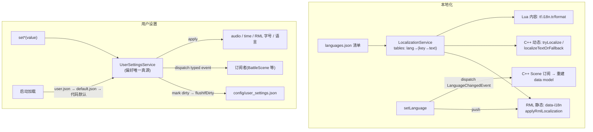

# L22 本地化、用户设置与 UI 文案管线

L21 解决了"游戏状态怎么跨会话存活"。但有一类状态**恰恰不该进存档**——用户偏好：语言、音量、战斗速度、各种开关。你换一个存档槽，难道还要重新调一遍语言和音量？显然不该。这类状态要**跨所有 save slot 共享**，所以它走另一条路。

本讲把两件事作为一组"**跨场景全局服务**"一起讲：**本地化（i18n）**和**用户设置**。它们的共同点是——都是不属于任何单个 Scene、却作用于所有 Scene 的全局能力，都通过 RmlUi 文档生效，新增 Scene 时几乎零额外接入。本地化侧你会看到三条文案路径（RML 静态 / C++ 动态 / Lua 内容）如何统一到一个 `LocalizationService`；设置侧你会看到 `UserSettingsService` 如何当"偏好唯一真源"，以及"偏好不入存档"这个有意为之的设计。

---

## 🎯 本讲目标

读完之后，你应该能回答：

1. RML 文件里 `data-i18n="title.start"` 旁边还写着一句英文 `Start`——这句"冗余"的 fallback 文本有什么实际价值？
2. 用户偏好"不入存档、放 `config/`"是随手为之还是有意设计？如果反过来把偏好塞进每个存档，会带来什么后果？
3. 切换语言的那一刻，已经加载的 RmlUi 文档和正在运行的 C++ ViewModel **各自**是怎么被通知更新的？两条路一样吗？
4. 新增一个 Scene，要让它支持 i18n 和字号联动，最少要做哪几件事？

---

## 👁️ 先看再讲：切一次语言，再翻一下存档目录

进游戏，打开 Options，把语言从 English 切到简体中文。整个 UI 的文案——标题按钮、菜单项、战斗提示——**瞬间全变**。

然后做两个对照观察：

1. 打开 `assets/i18n/`，里面就三个文件：`languages.json`（清单）、`en-US.json`、`zh-Hans.json`。后两个是**扁平 JSON**——`{ "title.start": "Start" }` / `{ "title.start": "开始" }`。一个 key、两种语言，如此而已。
2. 打开 `saves/slot0.json`（L21 那个存档），翻遍它——**找不到语言、音量、战斗速度**。它们不在存档里，而在 `config/user_settings.json`。

这两个观察就是本讲的两条主线：**文案是数据（key → 各语言字符串），偏好是跨档共享的全局配置（在 `config/` 而非 `saves/`）**。下面拆开讲。

---

## 🗺️ 关键链路



一句话：**文案统一从 `LocalizationService` 取，三条路径（RML/C++/Lua）共用同一张表；偏好统一从 `UserSettingsService` 改，每次 set 都 apply + 派发 typed 事件 + 落 `config/`。**

---

## 💡 核心知识点

### 1. `LocalizationService`：扁平表 + fallback 链

[`localization_service.h`](../../src/game/runtime/localization_service.h) 的模型极简：每种语言是一张扁平的 `key → 字符串` 表，`languages.json` 是清单（含 `fallback` 语言和每种语言的 `tag/native_name/file`）。对外只有两个取值入口：

```cpp
std::string tr(std::string_view key) const;                                          // 取译文
std::string format(std::string_view key, const std::unordered_map<...>& args) const; // 取译文 + 占位符替换
```

关键是**缺失 key 的 fallback 链**：当前语言查不到 → 回退语言（`en-US`）查 → 还查不到就返回 `!key!` 这个醒目的哨兵字符串。你在 L18 见过的 `!battle.turn.none!` 就是这么来的——它故意丑，好让漏翻的 key 在界面上一眼可见，而不是静默显示空白。`tr` 还会对缺失 key「warn once」，避免日志刷屏。

### 2. 三条文案路径，一个真源

项目里有三处产生文案，但都走同一个 `LocalizationService`：

- **RML 静态文本**：在标签上标 `data-i18n="key"`（标题用 `data-i18n-title`）。[`rml_localization_applier.cpp`](../../src/game/ui/rml_localization_applier.cpp) 的 `applyRmlLocalization` 用 `QuerySelectorAll("[data-i18n]")` 找出所有这类元素，把文本替换成 `tr(key)`：
  ```html
  <button data-event-click="start" data-i18n="title.start">Start</button>
  ```
  注意那句内嵌的英文 `Start`——这是自测题 1 的答案：**RML 里保留英文 fallback 有三重价值**：① `applyRmlLocalization` 还没跑、或 key 缺失时，界面有可读的默认文本而非空白；② 读 RML 源码时一眼能看懂这个按钮是干嘛的（自带文档）；③ 它是优雅降级的兜底。key 是"应该显示什么"的引用，内嵌英文是"退一万步显示什么"的保险。

- **C++ 动态文本**：C++ Scene 给 RmlUi data model 拼动态文案时，用 [`localized_text.h`](../../src/game/ui/localized_text.h) 的 helper——`tryLocalize`（按 key 取，取不到返回原文）、`localizeTextOrFallback(key, fallback)`、`formatTextOrFallback(key, args, fallback)`。它们都**容忍 `localization == nullptr`**（直接返回 fallback），所以脱离本地化服务也能跑、也好测。

- **Lua 内容文案**：[`tinyfarm_script_module.cpp`](../../src/game/script/tinyfarm_script_module.cpp) 暴露 `tf.i18n.tr(key)` 和 `tf.i18n.format(key, args)`，底层就是同一个 `LocalizationService`，规则与 C++ 完全一致（L06 的内容脚本写对白用它）。

三条路径、一张表——**绝不让任何一处自己硬编码第二套文案**。

### 3. 切换语言：RML 被 push、C++ ViewModel 被 pull

切语言时，静态和动态文案走**两套不同的通知机制**（自测题 3）。看 `setLanguage`（[`user_settings_service.cpp`](../../src/game/runtime/user_settings_service.cpp)）：

```cpp
void UserSettingsService::setLanguage(std::string_view language_tag) {
    // ... 解析 + 去重 ...
    applyLanguage();                                                  // ① 切表 + 重渲文本渲染器 + push 所有 RML 文档
    dispatcher_.trigger(game::defs::LanguageChangedEvent{...});       // ② 派发事件给 C++ 订阅者
}
```

- **RML 静态文档 = push**：`applyLanguage` 内部调 `applyRmlLocalizationToAllDocuments`，遍历**所有已加载文档**重跑一遍 `applyRmlLocalization`，把每个 `[data-i18n]` 的文本就地刷新。服务主动推。
- **C++ ViewModel = pull**：动态文案不在 DOM 里、服务推不到，于是改用事件——`setLanguage` 派发 `LanguageChangedEvent`，订阅它的 Scene（title / battle / inventory / pause / appearance… 一大票）在回调里**重建自己的 data model 文案并标脏**。服务发广播、各 Scene 自己拉。

为什么两套？因为两类文案的"存放位置"不同：静态文案在 RML 文档里、能被统一遍历改写；动态文案在 C++ 对象里、只有它自己知道怎么重算。一个推、一个拉，各取所需。（`applyLanguage` 还会 `text_renderer_.setDefaultLanguage`，让字形整形/字体回退也跟着切。）

### 4. `UserSettingsService`：偏好的唯一真源

所有偏好的读写都收口到 `UserSettingsService`（[`user_settings_service.h`](../../src/game/runtime/user_settings_service.h)）。每个 setter 都是同一套四步动作——**clamp 写值 → apply 到子系统 → 派发 typed 事件 → 标脏**：

```cpp
void UserSettingsService::setMusicVolume(float value) {
    settings_.music_volume = std::clamp(value, 0.0f, 1.0f);  // 写值（带 clamp）
    applyAudio();                                            // 立即作用到 AudioPlayer
    dirty_ = true;                                           // 标脏，等 flush
}
```

每一项偏好都有一个**专属的 typed 事件**（[`options_events.h`](../../src/game/defs/options_events.h)）：`BattleAnimationSpeedChangedEvent` / `DamagePopupVisibilityChangedEvent` / `EnemyHpBarVisibilityChangedEvent` / `CursorMemoryChangedEvent` / `UiFontScaleChangedEvent` / `LanguageChangedEvent`。订阅者各取所需——这正是 L19 `BattleScene` 实时拿到新战斗速度、L18/L19 那四项 Options（Battle Speed / Damage Popups / Enemy HP Bar / Cursor Memory）实时生效的来源。`PauseMenu` 和 `Inventory→Options` 两套菜单虽是不同入口，但都只是这个唯一真源的"遥控器"，绝不各存一份偏好。

### 5. 三级 fallback 持久化，且偏好不入存档

`UserSettingsService` 的持久化是**三级 fallback**（header 注释写得很清楚）：

- 启动加载：优先读 `config/user_settings.json`（runtime 写入位置，**不进 repo**）→ 缺失则读 `config/user_settings.default.json`（出厂模板，**进 repo**）→ 两者都缺则用代码内默认值。
- `flushIfDirty()` 只在 `dirty_` 为 true 时把当前值写回 `config/user_settings.json`。

这套 default（进 repo）vs user（runtime 生成）的分离，和很多工具的"默认配置 + 用户覆盖"一个套路：仓库里只放一份干净模板，玩家的个性化改动写到不进版本控制的 user 文件。

而最关键的设计是自测题 2：**偏好放 `config/` 而非 `saves/`，是有意为之**。偏好是"玩家这个人"的属性，不是"某一局游戏"的属性——你调好的语言、音量、战斗速度，应该**跨所有存档槽一致**。如果反过来把偏好塞进每个存档，后果很割裂：读档 A 是中文小音量、读档 B 突然变英文大音量，同一个玩家在不同档之间偏好乱跳，每开新档还得重调一遍。把"玩家偏好"和"游戏进度"分到两个文件，是这条体验的根。

### 6. 字号 class 管线：建好了、但当前固定 Normal

字号联动是个"管线已就位、开关暂关"的典型。`UiFontScale`（Small/Normal/Large）通过 `uiFontScaleClassName` 映射到 body 上的 CSS class——`tf-font-small/normal/large`，由 `applyUiFontScale` 调 `applyBodyFontScaleClassToAllDocuments` 挂到所有文档：

```cpp
void UserSettingsService::applyUiFontScale() {
    rml_runtime_.applyBodyFontScaleClassToAllDocuments(uiFontScaleClassName(settings_.ui_font_scale));
}
```

整套管线（枚举 → setter → 事件 → body class → RCSS 按 class 缩放）都是完整、可用的。**但**当前 Options 把它**固定在 Normal**——`OptionsTabContent::onActivated` 每次打开就 `setUiFontScale(Normal)`，没暴露字号选择器。为什么建好了却不开？因为字号在多语言下的排版（中英文行高、按钮溢出）还需要打磨，先固定 Normal 保证不出排版事故；而**保留整条 body class 管线**意味着将来要重新开启，只需在 Options 暴露选择器，底层零改动。

这也回答了自测题 4——**新增一个 Scene 接 i18n + 字号，几乎零额外接入**：静态文案标 `data-i18n` 即可（语言切换时被全局遍历刷新）；动态文案订阅 `LanguageChangedEvent` 重建 data model；字号 class 由 `applyBodyFontScaleClassToAllDocuments` 自动覆盖到所有文档。因为本地化和字号都是**遍历所有文档**的全局服务，新 Scene 只要是标准 RmlUi 文档，就自动被纳入，不用单独登记。

---

## 📋 阅读清单

| 资源 | 为什么读 |
| --- | --- |
| [`docs/game/localization.md`](../../docs/game/localization.md) | 本地化全景：数据文件、运行时链路、三条文案路径、缺失 key 表现、新增语言/key |
| [`docs/gameplay/options-and-user-settings.md`](../../docs/gameplay/options-and-user-settings.md) | 用户设置全景：唯一真源、持久化策略、各 Options 作用点 |
| L21《存档系统与 Schema 迁移》 | 对照：游戏进度入存档(`saves/`)，玩家偏好不入存档(`config/`) |
| L18《战斗 Action 生成》 / L19《战斗表现》 | 四项 Options（Battle Speed / Popups / HP Bar / Cursor Memory）的实际作用点 |
| 子教程 RmlUi L04 styling | rem/字号章节，理解 body font class 管线的 RCSS 侧 |

---

## 🔑 源码入口

| 文件 | 看什么 |
| --- | --- |
| [`src/game/runtime/localization_service.h`](../../src/game/runtime/localization_service.h) | `tr`/`format`、fallback 链、manifest 加载——**i18n 主入口** |
| [`src/game/runtime/user_settings_service.h`](../../src/game/runtime/user_settings_service.h) / `.cpp` | 唯一真源、set*(写值+apply+事件+dirty)、三级 fallback 加载、`applyLanguage`——**设置主入口** |
| [`src/game/runtime/user_settings.h`](../../src/game/runtime/user_settings.h) | `UserSettings` POD、`UiFontScale`、`uiFontScaleClassName`、normalize/clamp |
| [`src/game/defs/options_events.h`](../../src/game/defs/options_events.h) | 六个 typed change 事件（含 `LanguageChangedEvent`） |
| [`src/game/ui/rml_localization_applier.cpp`](../../src/game/ui/rml_localization_applier.cpp) + [`localized_text.h`](../../src/game/ui/localized_text.h) | RML 静态 `data-i18n` 应用 + C++ `tryLocalize`/`localizeTextOrFallback` |

---

## ❓ 自测问题

1. RML 里 `data-i18n="common.load">Load</button>` 的内嵌 `Load` 在什么情况下会真的显示给玩家？列出至少两种，说明它为什么不是冗余。
2. 假设有人把语言和音量改成"每个存档槽各存一份"。描述玩家在三个存档间切换时会体验到什么，以及这为什么比"跨档共享"差。
3. 把语言从中文切到英文，标题界面的静态按钮文字和战斗界面正在显示的动态单位名，分别通过什么机制被刷新？为什么不能用同一种机制覆盖两者？
4. `config/user_settings.default.json` 和 `config/user_settings.json` 各自的角色是什么？哪个进 repo、哪个不进？玩家第一次启动（user 文件还不存在）时读哪个？

---

## 🧪 最小练习

**目标**：给某个 Scene 加一句新文案，中英文都补齐，切换语言验证。

1. **加 key**：选一个文案，比如给标题界面加一行副标题。先在 [`assets/i18n/en-US.json`](../../assets/i18n/en-US.json) 和 [`assets/i18n/zh-Hans.json`](../../assets/i18n/zh-Hans.json) **都**加上同一个 key：
   ```jsonc
   // en-US.json:  "title.subtitle": "A Tiny Farm RPG"
   // zh-Hans.json: "title.subtitle": "迷你农场 RPG"
   ```
   （两边都要加——只加一边，另一种语言会走 fallback 链显示英文或 `!title.subtitle!`。）
2. **用 key**：在 [`title.rml`](../../ui/rmlui/scenes/title.rml) 里加一个元素挂上 `data-i18n="title.subtitle"`，内嵌一句英文 fallback：
   ```html
   <div class="title-subtitle" data-i18n="title.subtitle">A Tiny Farm RPG</div>
   ```
3. **切换验证**：进游戏，在 Options 切 English ↔ 简体中文，看这行副标题跟着变——你刚走通了"manifest → LocalizationService → applyRmlLocalization"整条静态文案链。
4. **试缺失**：故意把 `zh-Hans.json` 里那条删掉，切到中文，观察它**回退显示英文**（fallback 链）；再把 en-US 那条也删掉，看它显示 `!title.subtitle!` 哨兵。理解 fallback 的两级。

**进阶**：给一个 **C++ 动态文案**（而非 RML 静态）也加一个 key，用 `localizeTextOrFallback` 取它，并让所在 Scene 订阅 `LanguageChangedEvent` 在切换时重建——对比它和 RML 静态路径在"切换时如何刷新"上的差别（push vs pull）。

---

## 📌 小结

- **本地化 = 扁平表 + fallback 链**：每语言一张 `key→文本` 表，缺失走 `当前→fallback(en-US)→!key!`；`tr`/`format` 是唯一取值入口。
- **三条文案路径一个真源**：RML `data-i18n`（静态、内嵌英文 fallback 有三重价值）、C++ `tryLocalize`/`localizeTextOrFallback`（动态、容 null）、Lua `tf.i18n`（内容、规则一致）。
- **切语言两套机制**：RML 静态文档被 `applyRmlLocalizationToAllDocuments` **push**，C++ ViewModel 靠订阅 `LanguageChangedEvent` **pull**——存放位置不同决定通知方式不同。
- **`UserSettingsService` 唯一真源**：set* = clamp 写值 + apply 子系统 + 派发 typed 事件 + 标脏；六个 typed 事件让订阅者实时生效；PauseMenu / Options 都只是它的遥控器。
- **三级 fallback 持久化 + 不入存档**：`user_settings.json`(runtime,不进 repo) → `default.json`(模板,进 repo) → 代码默认；偏好放 `config/` 而非 `saves/`，跨所有存档槽共享——有意为之。
- **字号 class 管线建好但固定 Normal**：`tf-font-*` body class 全链可用，Options 当前固定 Normal、保留管线以便将来一键开启；i18n 与字号都是遍历所有文档的全局服务，新 Scene 几乎零接入。

## 🚀 下节课预告

文案和偏好这两组全局服务收尾了。下一个工程化专题，是让战斗和地图事件"炸起来"的那层——特效。

下一讲 **L23 Effekseer 与 VFX 管线**：第三方特效库怎么通过**抽象后端**接入引擎、而不污染游戏逻辑——`VfxBackend` / `EffekseerBackend` / `NullVfxBackend` 的抽象层次、`VfxService` 的请求队列与帧同步、World/Overlay 双通道渲染、`PlayVfxCommand` 与 `VfxBridgeSystem` 在战斗/地图/UI 的触发点（终于补上 L19 那个"提交即返"背后的机制）。下讲见。
