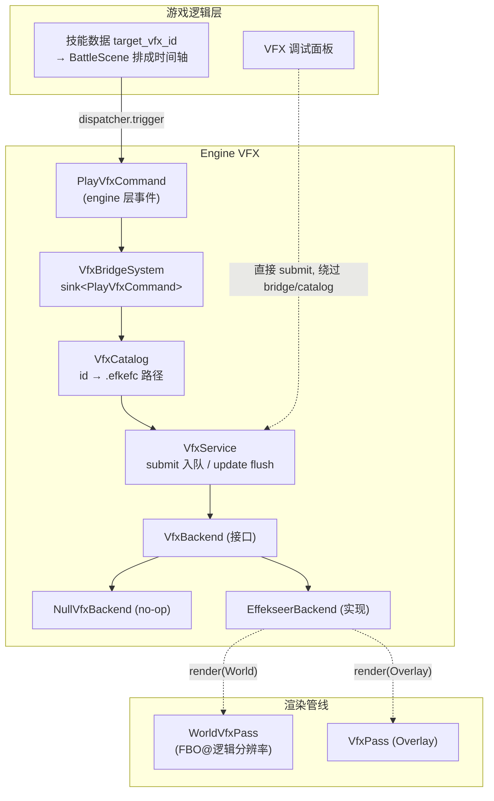
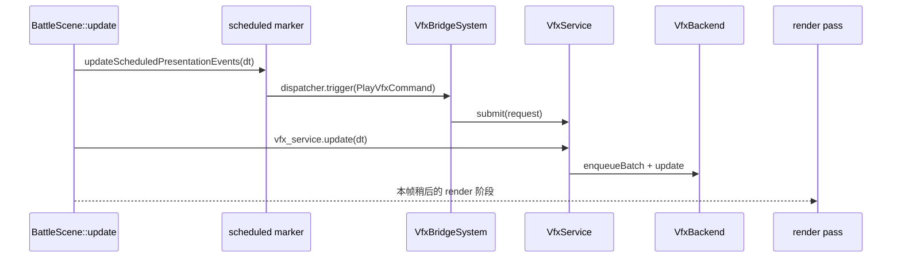

# 第23节课 · Effekseer 与 VFX 管线

[战斗表现课](19-战斗表现与动画导演.md)讲战斗表现时留了个尾巴：技能命中那一下火光、雷击，`BattleScene` 只是"提交即返"——发个命令就接着演下一步，没说那团火到底**怎么真的画到屏幕上**。这节课补上这块。

核心张力是这样的：Effekseer 是个庞大的第三方粒子库，自带渲染器、资源加载器、一大堆 OpenGL 调用，还有自己的坐标系约定（Y-up）和帧基时间模型。但你的**游戏逻辑——战斗、地图、UI——绝不应该知道"Effekseer"这四个字**。怎么做到？答案是一个纯抽象接口 `VfxBackend` 把整个库关进引擎的一个角落，游戏侧的调用面只剩 `PlayVfxCommand` / `VfxService` 这一层。当前 gameplay 真正接线的是战斗表现；地图和 UI 还没有内置触发点，但以后也应该复用同一条命令链，而不是直接碰 Effekseer。这是"插件式后端"的范本：同一套接口，挂 Effekseer 实现就有特效，挂 Null 实现就静默无特效，上层一行代码都不用改。

---

## 读完这节课，你应该能回答

1. 把 `EffekseerBackend` 整个换成 `NullVfxBackend`，项目里**谁会报错**？答案可能和直觉相反。
2. 同一个特效走 World 通道和 Overlay 通道，在**相机跟随、场景合成、后处理**上分别有什么不同？什么时候该用哪个？
3. 战斗里一次技能特效，从 `TargetVfx` marker 到"画到屏幕"，要经过几跳？它会在同一帧 flush，还是等下一次 `VfxService::update()`？
4. 游戏逻辑想播一个特效，为什么**不能也不需要**直接 `#include <Effekseer.h>`？

---

## 先看再讲：调试面板里切两个通道

进游戏，按 `F5` → `Engine Debug Panels` → `VFX` 面板。它会列出 `assets/vfx/` 下所有 `.efkefc` 文件，让你选**通道（World/Overlay）、位置、缩放**，然后单次触发。

做两个对照观察：

1. 选一个特效，先用 **Overlay** 通道触发一次，再用 **World** 通道触发一次。然后用 WASD 移动相机——**World 通道的特效跟着世界一起移动**（它在场景里有个世界坐标），**Overlay 通道的特效钉在屏幕上不动**（它在屏幕空间）。
2. 进一场战斗，放一个火系技能。命中时那团火光，就是 `battle.fire_one_1` 走 **Overlay** 通道画出来的。

这两个观察对应本节课两条线：**调试面板是"裸提交"**（浏览原始文件直接播），**战斗是"catalog id 驱动"**（技能数据里写一个 id，引擎查表换路径再播）。下面把整条链路拆开。

---

## 关键链路



一句话：**gameplay 走 `PlayVfxCommand → Bridge → Catalog → Service`（id 驱动），调试面板直接 `submit`（绕过 catalog）；Service 把请求排队，每帧 flush 给唯一的 `VfxBackend` 接口，背后是 Effekseer 还是 Null 上层不关心。**

---

## 核心知识点

### 1. 抽象后端：把 Effekseer 关进一个角落

[`vfx_backend.h`](../../src/engine/vfx/vfx_backend.h) 是一个**纯虚接口**，只有 5 个方法：

```cpp
class VfxBackend {
public:
    virtual void enqueueBatch(std::span<const VfxPlayRequest> requests) = 0;
    virtual void update(float delta_time_seconds) = 0;
    virtual void render(const VfxRenderContext& context) = 0;
    virtual std::uint32_t getLastDrawCallCount() const = 0;
    virtual std::uint32_t getLastInstanceCount() const = 0;
};
```

整个项目里，`#include <Effekseer.h>` **只出现在 [`effekseer_backend.h`/`.cpp`](../../src/engine/vfx/effekseer_backend.cpp) 两个文件**。隔离还有两道：① CMake 的 `ENABLE_EFFEKSEER` 选项会决定是否设置 `TF_ENABLE_EFFEKSEER`，关掉它就不配置依赖、不链接 Effekseer，也不编译 `effekseer_backend.cpp`；② [`effekseer_backend_factory.h`](../../src/engine/vfx/effekseer_backend_factory.h) 只暴露一个 `createEffekseerBackend()` 返回 `unique_ptr<VfxBackend>`，**装配代码拿到的是基类指针，根本不需要 include Effekseer 头文件**。

这就是问题 4 的答案：如果游戏逻辑直接 `#include <Effekseer.h>`，那么这个库的编译依赖、GL 状态细节、Y-up 坐标系约定、帧基时间模型……会全部泄漏到游戏层，换库或关库就要动一片代码。抽象后端 = 一道防火墙，把这些脏细节摁在引擎角落。

### 2. `NullVfxBackend`：替换后"谁都不报错"才是成功

问题 1 的答案出人意料——**没有任何人报错**。[`null_vfx_backend.cpp`](../../src/engine/vfx/null_vfx_backend.cpp) 里所有方法都是空实现，统计接口返回 0。把它换上去，`VfxService`、`VfxBridgeSystem`、战斗表现层、两个渲染 pass 全都照常调用同一套接口——它们只认 `VfxBackend`，不认具体实现。唯一可见的区别：`render()` 是 no-op（屏幕上没有粒子）、`getLastDrawCallCount/InstanceCount` 返回 0、特效**静默消失**。游戏逻辑、存档、战斗结算一切照旧。

这正是抽象成功的标志，项目里有**双重 fallback** 兜底（[`runtime_service_factory.cpp`](../../src/game/runtime/runtime_service_factory.cpp) 的 `initVfxService`，下面是节选）：

```cpp
backend = engine::vfx::createEffekseerBackend();
#ifdef TF_ENABLE_EFFEKSEER
if (!backend) {
    spdlog::warn("EffekseerBackend 初始化失败，将回退到 NullVfxBackend。");
}
#else
spdlog::info("Effekseer VFX 后端未启用，将使用 NullVfxBackend。");
#endif
if (!backend) {
    backend = std::make_unique<engine::vfx::NullVfxBackend>();
}
services.vfx_service = std::make_unique<engine::vfx::VfxService>(std::move(backend));
```

`ENABLE_EFFEKSEER=OFF` 时，工厂会返回 `nullptr`，运行时自然落到 `NullVfxBackend`；即使调用者忘了兜底，`VfxService` 构造函数收到 `nullptr` 时**还会再兜一次**底。测试侧也吃这个红利：[`tests/shared/recording_vfx_backend.h`](../../tests/shared/recording_vfx_backend.h) 是同一接口的另一个替身——`RecordingVfxBackend` 不渲染，只**记录每次调用的次数和参数**供断言。可降级、可替换、可测，全来自这个接口。

### 3. `VfxService`：请求队列与帧同步

[`vfx_service.cpp`](../../src/engine/vfx/vfx_service.cpp) 是游戏逻辑和后端之间的缓冲层，关键在它**不立即执行**：

```cpp
void VfxService::submit(const VfxPlayRequest& request) {
    pending_requests_.push_back(request);          // 只入队，不执行
}

void VfxService::update(float delta_time_seconds) {
    if (!pending_requests_.empty()) {
        backend_->enqueueBatch(pending_requests_); // 每帧一次性 flush
        pending_requests_.clear();
    }
    backend_->update(delta_time_seconds);          // 再推进后端模拟
}
```

为什么要排队？因为提交可能来自任意时刻、任意来源（战斗演出回调、调试面板、未来的地图事件）。`VfxService` 把它们**收敛到"每帧一个固定 flush 点"**：先批量入队后端，再推进一帧模拟，顺序可控、和后端的时间推进解耦。调用时机很明确——`GameScene::update` 和 `BattleScene::update` 各自驱动 `vfx_service_->update(dt)`。

这里有个容易讲错的小点：`submit()` 之后**不是必然等到下一帧**。如果提交发生在本次 Scene update 的 `vfx_service_->update(dt)` 之前，这批请求会在同一次 update 被 flush，并可在随后 render 阶段画出来；如果提交发生在这个 flush 点之后，就会等到下一次 `VfxService::update()`。所以要记住的是"固定 flush 点"，不是固定延后一帧。

### 4. World vs Overlay：双通道的取舍

`VfxChannel`（[`vfx_types.h`](../../src/engine/vfx/vfx_types.h)）只有两个值，但决定了特效"长在世界里"还是"贴在屏幕上"（问题 2）：

| | **World 通道** | **Overlay 通道** |
| --- | --- | --- |
| 渲染目标 | 逻辑分辨率 FBO，**composite 之前** | 默认帧缓冲，**composite 之后、UI 之前** |
| VP 矩阵 | 相机 VP（`current_view_proj_`）→ **跟相机移动** | `glm::ortho` 屏幕空间 → **钉屏幕** |
| 合成方式 | 加色合成 `base + worldVfx.rgb` | 直接叠在画面上 |
| 受光照/Bloom | 不参与泛光（在 bloom 之后渲染） | 完全不受后处理影响 |
| 适合 | 世界里的 additive 特效（火焰、能量波） | UI 类、命中闪光、技能图标光效 |

实现上是**单 Effekseer Manager + Layer** 方案（[`effekseer_backend.cpp`](../../src/engine/vfx/effekseer_backend.cpp)）：播放时 `SetLayer(handle, 0/1)`，渲染时 `DrawParameter.CameraCullingMask = 1 << layer`，每次 `render()` 只画目标通道的粒子——避免维护两个独立 Manager 的开销。

有个**坑**值得记住：World 通道用的是**加色合成**，alpha-blend 类资源放进去会发灰发亮、不对劲。所以战斗里的命中特效一律走 Overlay——`makeTargetVfxCommand` 把 `channel` **硬编码成 `Overlay`**（见知识点 6）。这也是为什么"先看再讲"里要用调试面板才能观察 World 通道：gameplay 路径当前不走它。

### 5. `PlayVfxCommand → Bridge → Catalog`：id 驱动的播放链

gameplay 播特效的标准链路是事件驱动的。`PlayVfxCommand`（注意它定义在 **engine 层 [`vfx_types.h`](../../src/engine/vfx/vfx_types.h)，不在 `src/game/defs/`**）只带 `effect_id` + 位置/z/scale/loop/channel。[`vfx_bridge_system.cpp`](../../src/engine/vfx/vfx_bridge_system.cpp) 连在 `dispatcher.sink<PlayVfxCommand>()` 上，收到后做三道校验再转交：

```cpp
void VfxBridgeSystem::onPlayVfxCommand(const PlayVfxCommand& command) {
    if (!vfx_catalog_) { /* warn + 早退 */ return; }
    if (command.effect_id == kInvalidVfxEffectId) { return; }
    const auto* effect_path = vfx_catalog_->findEffectPath(command.effect_id);
    if (!effect_path) { /* warn: id 未配置 */ return; }
    // 拼 VfxPlayRequest（把 id 换成路径）→ submit
    vfx_service_.submit(request);
}
```

[`VfxCatalog`](../../src/engine/vfx/vfx_catalog.cpp) 从 [`vfx_catalog.json`](../../assets/data/vfx_catalog.json) 加载 `id → .efkefc 路径`（key 经 `entt::hashed_string` 哈希，`O(1)` 查找），当前 5 条（`battle.fire_one_1`、`battle.hit_physical`、`battle.thunder_one_1`、`battle.heal_all_1`、`laser01`）。它加载时先写临时 map，`effects` 形态校验成功后才替换旧表；如果一次 reload 读到坏 JSON / 缺少 `effects`，旧映射会保留，不会把正在运行的 catalog 清空。

**两种提交路径的分工要说清楚**（问题 4）：

- **gameplay = 经 dispatcher + bridge + catalog**：id 驱动，稳定，无效 id / 缺路径都安全早退 + warn，绝不崩。
- **调试面板 = 直接 `vfx_service_->submit()`**：浏览裸 `.efkefc` 文件，**绕过 catalog 和 bridge**，方便美术/程序快速试效果。

还有一个诚实的现状：**目前 `PlayVfxCommand` 的唯一 gameplay 发射者是战斗表现层**。`dispatcher` 是开放的，地图事件、UI 以后都可以 `trigger(PlayVfxCommand{...})`，但当前没有 Lua `tf.vfx` 绑定、也没有地图/UI 内置发射点——大纲里提到的多来源播放，真实口径应是：落地的是战斗，其余是**已就位但未接线的扩展点**。

### 6. 补上战斗表现的"提交即返"：战斗特效的完整一跳

现在把[战斗表现课](19-战斗表现与动画导演.md)那个尾巴接上（问题 3）。技能数据里写 `target_vfx_id`（[`skills.json`](../../assets/data/rpg/skills.json) 里 `skill.attack` 挂 `battle.hit_physical`、火球挂 `battle.fire_one_1`），加载时预算成 `SkillPresentation.target_vfx_id_hash_` 存好。战斗里一次行动的演出流程是：

1. **排时间轴**：`buildBattleActionPresentationPlan`（[`battle_action_presentation_plan.cpp`](../../src/game/scene/battle_action_presentation_plan.cpp)）看到 hash 有效，就加一个 `TargetVfx` marker，`makeTargetVfxCommand(hash, 命中位置, scale)` 拼出 `PlayVfxCommand`（`channel = Overlay`），marker 带一个 `time_seconds` 触发时刻。
2. **挂上倒计时**：`schedulePresentationEvent` 把它推进 `scheduled_presentation_events_`，带 `remaining_seconds`。
3. **到点触发**：[`battle_scene.cpp`](../../src/game/scene/battle_scene.cpp) 的 `updateScheduledPresentationEvents` 每帧倒数，到时间就 `context_.getDispatcher().trigger<Payload>(...)`——对 `PlayVfxCommand` 这一支，正是[战斗表现课](19-战斗表现与动画导演.md)说的**"提交即返"**：触发后**立刻返回**接着演下一步，根本不等特效画完。

之后就接回知识点 5 的链路：`Bridge → catalog → service.submit`（入队）→ `service.update` flush → backend `enqueueBatch + update` → 渲染 pass `render` 画出。注意 `BattleScene::update` 的顺序是 `updateScheduledPresentationEvents(delta_time)` 先触发 marker，然后才调用 `vfx_service_->update(delta_time)`；所以战斗 marker 到点时，通常会在**同一次 BattleScene update** 被 flush，并在随后 render 阶段有机会画出来。若将来某个地图/UI 发射点发生在 `vfx_service_->update` 之后，那条请求才会等到下一次 update。也就是说，从"提交"到"看见"不是固定要等到下一帧，但仍然经约 7 跳对象（marker → dispatcher → bridge → catalog → service 队列 → backend → render pass）。



这种彻底的解耦，就是 fire-and-forget 的代价与收益：发射者只关心"我把请求交出去了"，不关心后端是否加载资源、何时 flush、哪一个 render pass 画出来。

顺带回应[数据目录课](09-数据目录与RPG-Catalog.md)：`TargetVfx` 和 `TargetSfx` 是**同一条 plan 上的兄弟 marker**，挂在同一时间轴上 co-schedule。所谓 AudioCue↔VFX "联动"，不是硬绑定，而是**共用一条演出时间轴**——同一拍上一个发声音、一个发特效。

---

## 阅读清单

| 资源 | 为什么读 |
| --- | --- |
| [`docs/engine/vfx_and_effekseer.md`](../../docs/engine/vfx_and_effekseer.md) | VFX 全景：三层抽象、Effekseer 接入原理、双通道渲染管线、完整数据流时序图、CMake 开关 |
| [战斗表现与动画导演](19-战斗表现与动画导演.md) | "提交即返"的提出方——本节课补上它背后的 command→bridge→service→render 机制 |
| [数据目录与 RPG Catalog](09-数据目录与RPG-Catalog.md) | catalog 驱动的同源思想、AudioCue↔VFX 联动的由来 |
| [`assets/data/vfx_catalog.json`](../../assets/data/vfx_catalog.json) | `id → .efkefc 路径`映射，5 条现有特效，练习的改动起点 |

---

## 源码入口

| 文件 | 看什么 |
| --- | --- |
| [`src/engine/vfx/vfx_types.h`](../../src/engine/vfx/vfx_types.h) | `PlayVfxCommand`/`VfxPlayRequest`/`VfxRenderContext`/`VfxChannel`——**注意都在 engine 层，非 `game/defs`** |
| [`src/engine/vfx/vfx_backend.h`](../../src/engine/vfx/vfx_backend.h) + [`null_vfx_backend.h`](../../src/engine/vfx/null_vfx_backend.h) | 5 方法纯接口 + 空实现——抽象边界本身 |
| [`src/engine/vfx/vfx_service.cpp`](../../src/engine/vfx/vfx_service.cpp) + [`vfx_bridge_system.cpp`](../../src/engine/vfx/vfx_bridge_system.cpp) + [`vfx_catalog.cpp`](../../src/engine/vfx/vfx_catalog.cpp) | 队列/帧同步 + `dispatcher → catalog → service` 转交与校验；catalog 失败重载保留旧表 |
| [`src/engine/vfx/effekseer_backend.cpp`](../../src/engine/vfx/effekseer_backend.cpp) + [`effekseer_backend_factory.cpp`](../../src/engine/vfx/effekseer_backend_factory.cpp) | Effekseer 实现、工厂回退：Y-down↔Y-up 坐标适配、单 Manager+Layer 双通道、特效缓存 |
| [`CMakeLists.txt`](../../CMakeLists.txt) + [`src/CMakeLists.txt`](../../src/CMakeLists.txt) | `ENABLE_EFFEKSEER` 如何映射到 `TF_ENABLE_EFFEKSEER`，以及关闭时不编译真实后端 |
| [`src/game/scene/battle_action_presentation_plan.cpp`](../../src/game/scene/battle_action_presentation_plan.cpp) + [`battle_scene.cpp`](../../src/game/scene/battle_scene.cpp) | `TargetVfx` marker、`makeTargetVfxCommand`、`updateScheduledPresentationEvents` 的"提交即返" |

---

## 检查你的理解

1. 把 `initVfxService` 里的 `createEffekseerBackend()` 强制返回 `nullptr`，游戏还能跑吗？哪些行为变了、哪些**完全没变**？为什么这恰恰说明抽象设计成功？
2. 一个"火焰持续燃烧、应该待在世界里跟着角色走"的特效，和一个"技能命中时屏幕一闪"的特效，分别该用哪个通道？说出至少两个判断依据（相机跟随 / 合成方式 / 是否受后处理）。
3. 战斗里放一个 `battle.fire_one_1`，从 plan 里的 `TargetVfx` marker 到屏幕上出现火光，数一数依次经过哪些对象；再解释为什么它可能同一次 `BattleScene::update` 就 flush，而不是固定至少等 1 帧。
4. 调试面板播特效和战斗播特效，走的是同一条链路吗？差在哪一段？哪一条会被 `VfxCatalog` 的 id 校验拦住、哪一条不会？

---

## 动手试试

**目标**：给某战斗动作挂一个不同的 VFX id，并对比 World/Overlay 两种通道的视觉差。

1. **换 id（走通 catalog 链）**：打开 [`assets/data/rpg/skills.json`](../../assets/data/rpg/skills.json)，找物理攻击技能（`target_vfx_id` 现在是 `battle.hit_physical`），把它改成另一个已有 id，比如 `battle.thunder_one_1`。进战斗放这招，看命中特效从打击变成雷击——你刚走通了"catalog id → 预算 hash → `TargetVfx` marker → `PlayVfxCommand` → bridge 查表 → 画面"整条链。
2. **通道对比（用调试面板）**：因为战斗硬编码 Overlay，要观察 World 得用调试面板。`F5` → `VFX` 面板，选同一个 `.efkefc`：先 **Overlay** 触发一次，再 **World** 触发一次，然后用 WASD 移动相机——**World 的特效跟着世界走，Overlay 钉在屏幕上**。这就是问题 2 的实感。
3. **试错（看 bridge 的安全早退）**：把某技能 `target_vfx_id` 改成一个 catalog 里**没有**的字符串（如 `battle.does_not_exist`），放招。观察：控制台打出 `effect_id=... 未在 VfxCatalog 中配置` 的 warn，**特效不出现、但战斗照常进行**——`VfxBridgeSystem` 缺路径时安全早退，绝不让一个错 id 拖垮战斗。
4. **进阶（加一跳 catalog）**：在 [`vfx_catalog.json`](../../assets/data/vfx_catalog.json) 的 `effects` 里加一条 `"battle.my_test": "assets/vfx/00_Basic/Laser01.efkefc"`，再把某技能 `target_vfx_id` 指向 `battle.my_test`，验证你新增的 catalog 条目被正确解析、播放。

---

## 小结

- **抽象后端是防火墙**：`VfxBackend` 是 5 方法纯接口，Effekseer 头文件只在 `effekseer_backend.*`；`TF_ENABLE_EFFEKSEER` 编译宏 + `createEffekseerBackend` 工厂双重隔离，游戏逻辑零依赖具体特效库。
- **`NullVfxBackend` 替换后谁都不报错**——这正是抽象成功的标志：接口照旧、特效静默消失。双重 fallback（工厂 + Service 构造）+ `RecordingVfxBackend` 测试替身都吃这份红利（可降级、可替换、可测）。
- **`VfxService` 收敛提交点**：`submit` 只入队，`update` 每帧一次性 flush 给后端再推进模拟，把任意来源的提交收敛到固定节奏。
- **World vs Overlay**：World 进 FBO / 相机 VP / 加色合成 / 跟相机 / 不泛光，Overlay 屏幕空间 / composite 之后 / 不受光照相机；单 Manager + Layer + `CameraCullingMask` 路由。alpha-blend 资源走 Overlay，所以战斗命中特效硬编码 Overlay。
- **id 驱动的播放链**：`PlayVfxCommand`（engine 层）→ `VfxBridgeSystem` → `VfxCatalog`（id→路径）→ `VfxService` 是 gameplay 的稳定链；调试面板直接 `submit` 绕过 catalog；地图/UI 是开放但当前未接线的扩展点（无 Lua `tf.vfx`）。
- **补上战斗表现的"提交即返"**：战斗 VFX 是 plan 时间轴上的 `TargetVfx` marker，到点 `dispatcher.trigger` "提交即返"，再经 bridge/service/render；是否同帧可见取决于提交点相对 `VfxService::update()` 的位置。与 SFX co-schedule = AudioCue↔VFX 联动（共用一条演出时间轴，非硬绑定）。

---

特效收尾了。接下来两节课是项目里两块硬核的**多线程工程实践**，先从切图说起。

下节课讲异步地图预加载与主线程命令队列：从一张地图切到另一张地图时，为什么不卡顿？秘诀是把重活搬到 worker 线程——I/O、JSON 解析、图片 CPU 解码都在后台做；但 OpenGL 有"只能在主线程上传 GPU"的铁律，于是引入**主线程命令队列**负责 GPU 上传，再用 **generation 失效**防止"玩家又跑回原图"时过期的加载结果污染新状态。我们会看 `MapManager` 的异步状态机怎么把这些拼起来。多线程基础原理外链子教程，主线只讲"项目里怎么用"。下节课见。
