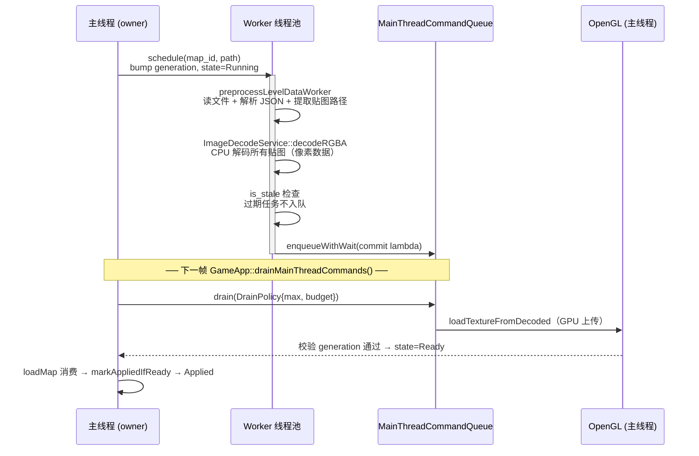

# L24 异步地图预加载与主线程命令队列

上一套教程里，切地图是**同步**的：读文件、解析 JSON、解码图片、上传 GPU——全挤在切图那一帧里干完。地图一大、贴图一多，你就能肉眼看到明显的冻帧卡顿。本讲讲项目怎么把这件事**异步化**，让切图延迟接近于零。

思路听起来简单："丢给后台线程"——但有一条铁律挡在路上：**OpenGL 的 GPU 调用只能在持有 context 的主线程执行**。所以不能把整个切图扔给 worker，得做"两段式"：worker 线程干能干的活（文件 I/O、JSON 解析、图片 CPU 解码），干完把"GPU 上传"这一步打包成命令投递给主线程，主线程每帧 drain 一小批执行。再加一个 **generation 版本号**，防止"玩家又跑回原图"时过期的后台结果污染新状态。多线程的基础原理（有界队列、线程池、条件变量、原子）外链子教程，主线只讲项目里这套预加载管线怎么拼起来。

---

## 🎯 本讲目标

读完之后，你应该能回答：

1. 切地图的三个耗时步骤里，哪些能丢给 worker 线程、哪个**必须**留在主线程？划这条线的硬约束是什么？
2. "generation 版本号"防的到底是哪个 bug？玩家"又跑回原图"时，已经在后台跑的任务结果怎么被安全丢弃？
3. 为什么 `AsyncPreloadPipeline` 的任务表**不加锁**也线程安全？"owner thread 契约"是什么？
4. 析构 pipeline 时为什么必须"先 bump generation、再等 worker 退出"？为什么 pipeline 侧 map 条目可以先清掉？

---

## 👁️ 先看再讲：看三行日志跨越两个线程、隔着一帧

打开 [`assets/data/map_loading_config.json`](../../assets/data/map_loading_config.json)，确认 `preload.mode: "all"`、`preload.async_enabled: true`、`log_timings: true`（默认就是）。`all` 会在启动装配时触发 `preloadAllMaps()`；如果改成 `neighbors`，则只在当前地图加载后预热邻接地图和触发器目标。跑游戏，走过一个地图传送点触发切图，盯着控制台：

```
AsyncPreloadPipeline::schedule: submit map_id=..., worker_queue_depth=..., command_queue_depth=...
AsyncPreloadPipeline::schedule: worker done map_id=..., queued_ms=.., preprocess_ms=.., decode_ms=..
AsyncPreloadPipeline::schedule: commit done map_id=..., texture_count=.., commit_ms=..
```

三行日志正好是三段接力：**submit**（主线程提交任务）→ **worker done**（后台线程读完文件、解析完 JSON、解码完贴图）→ **commit done**（主线程把贴图上传到 GPU）。

关键观察两点：① `worker done` 和 `commit done` 通常**不在同一帧**——worker 把上传命令投进队列后，要等主线程**下一次 drain** 才执行；② `preprocess_ms` + `decode_ms` 这两段重活，全发生在 worker 线程，主线程那一帧几乎没被它们拖住。这个"跨线程、跨帧的接力"就是本讲的主角。

---

## 🗺️ 关键链路



一句话：**worker 干 I/O 与 CPU 解码 → 把 GPU 上传打包成命令投递主线程队列 → 主线程每帧 drain 执行上传 → 状态翻到 Ready；全程用 generation 版本号保证过期结果被丢弃。**

---

## 💡 核心知识点

### 1. 两段式：能后台做的提前做，必须主线程的压到最短

切图的三个耗时步骤里，能不能搬到后台，由一条硬约束决定：

| 步骤 | 能否后台线程 | 原因 |
| --- | --- | --- |
| 文件 I/O + JSON 解析 | ✅ | 磁盘读取 + 字符串处理，与 GPU 无关 |
| 图像 CPU 解码（像素格式转换）| ✅ | 纯内存密集，不碰 OpenGL |
| **GPU 纹理上传** | ❌ **必须主线程** | OpenGL context 绑在主线程，GPU 调用只能在主线程 |

这就是自测题 1 的答案——**OpenGL context 的主线程绑定**划了这条线。前两步由两个**纯函数式**的 worker 步骤完成：[`LevelPreprocessService::preprocessLevel`](../../src/engine/loader/level_preprocess_service.cpp)（走 Tiled JSON cache、解析 tileset / imagelayer、产出去重后的 `texture_paths`）和 [`ImageDecodeService::decodeRGBA`](../../src/engine/resource/image_decode_service.cpp)（`stb_image` 解码成 RGBA 像素）。worker 实际调的 `LevelLoader::preprocessLevelDataWorker` 只是前者的薄包装——而且**同步 `loadLevel` 路径也走同一个 preprocess**，一份代码两条路径复用。

有个细节值得记：`decodeRGBA` 里 `stbi_load` 被一把 `stbImageMutex` 全局锁包住——`stb_image` 不保证线程安全，多 worker 时解码会被串行化。当前 `async_worker_count=1`，这把锁是给"将来多 worker"上的保险。

配置读取本身也是一条护栏：[`MapLoadingSettings::loadFromFile`](../../src/game/world/map_loading_settings.cpp) 用无异常 `json::parse(..., false)` 和 typed helper 读取配置。坏 JSON、字段类型不符会保留代码默认值，超大的无符号数会先 clamp 再转换；测试会锁住默认资产里的 `preload.mode="all"` 和这些解析边界。

### 2. `MainThreadCommandQueue`：把 GPU 活儿"预约"回主线程

worker 不能碰 GPU，于是把"上传命令"——一个 `std::function<void()>`——塞进 [`MainThreadCommandQueue`](../../src/engine/async/main_thread_command_queue.cpp)。它的几个设计点：

- **owner thread 限定**：构造时捕获 `owner_thread_id_`，`drain()` 只能在 owner 线程调用，否则 `warn` 早退。
- **每帧限额 drain**：主线程 [`GameApp::drainMainThreadCommands()`](../../src/engine/core/game_app.cpp) 用 `DrainPolicy{max_commands, time_budget}` 执行一批——**有数量上限和时间预算**，避免一帧里 drain 太多命令反而造成卡顿；`budget_hit` 后剩余命令留到下一帧。
- **入队背压**：`enqueueWithWait` 带超时，队满时阻塞到上限（`async_command_wait_ms`），仍满则返回 `false`。

这套队列是**通用基础设施**，不只服务于切图——L21 的后台存档同样用它把"写盘后的收尾"调度回主线程（[`save_service.cpp`](../../src/game/save/save_service.cpp) 也取 `getMainThreadCommandQueue()`）。"把活儿调度回主线程"是个反复出现的模式。

### 3. 任务状态机：NotScheduled → Running → Ready → Applied

每个地图任务的状态存在一个 `std::atomic<MapPreloadTaskState>` 里（worker 写、主线程读，无锁同步）：

| 状态 | 含义 |
| --- | --- |
| `NotScheduled` | 未调度，或被 `clearTasks()` 重置 |
| `Running` | worker 执行中，或上传命令已入队但还没 drain 执行 |
| `Ready` | GPU 上传完成，可以安全切图 |
| `Failed` | I/O / 解码 / 上传任意一步失败 |
| `Applied` | `loadMap()` 已消费此结果，地图已切换 |

[`schedule()`](../../src/game/world/async_preload_pipeline.cpp) 干三件事：bump generation → `store(Running)` → 提交 worker lambda。worker 跑完 preprocess + decode 后会再查一次 stale，只有仍然不过期才把 commit lambda 投进主线程队列；commit lambda 在主线程 drain 时执行 `loadTextureFromDecoded`（GPU 上传），成功则 `store(Ready)`。`loadMap` 消费 Ready 后由 `markAppliedIfReady` 置 Applied。`isAsyncReadyState = Ready || Applied`——两者都算"可以快速切图"。

### 4. Generation 版本号：防止过期结果污染（核心安全机制）

这是整个设计里最关键的一环（自测题 2）。**问题场景**：

- `t0`：调度地图 A（generation=1），worker 开始在后台跑。
- `t1`：玩家掉头跑回原图 / 重新调度，`clearTasks()` 把 generation `fetch_add(1)` 抬到 2，状态重置。
- `t2`：那个**旧 worker** 终于跑完，想写 `state=Ready`——如果直接写，就**污染了新状态**（一个早已作废的任务把自己的结果盖了上去）。

**解法**：worker lambda **按值捕获** `generation=1`，每次写状态前先 `is_stale()` 比对：

```cpp
const auto is_stale = [shared_state, generation] {
    return !shared_state ||
           shared_state->generation.load(std::memory_order_acquire) != generation;
};
// worker 里：preprocess 后、每解码一张贴图前、解码后入队前、commit 前后都查一次
if (is_stale()) { return; }   // 自己捕获的 1 ≠ 当前的 2 → 静默退出
```

防的本质是 **ABA 问题**：同一个 `map_id` 槽位被复用，旧任务的迟到结果不能盖新任务。现在 worker 在入队主线程命令前也会查一次 stale，避免把已经过期的 no-op 命令塞进队列；commit lambda 在 GPU 上传**前后各 check 一次** generation，双保险。测试 `RescheduleSameMapDropsStaleGenerationWork`（[`async_preload_pipeline_test.cpp`](../../tests/game/world/async_preload_pipeline_test.cpp)）就专门验证这条。

### 5. Owner thread 契约：用"调用约定"换"无锁"

注意 `async_preload_tasks_` 这张任务表（`unordered_map`）**本身不加锁**。凭什么线程安全（自测题 3）？因为所有公共 API（`schedule` / `getTaskState` / `markAppliedIfReady` / `clearTasks` / `setLoadingSettings`）开头都调 `ensureOwnerThread`——**只有 owner（主）线程能增删改这张表**；worker 线程从不碰它，只通过 `shared_ptr<AsyncPreloadTaskState>` 读写那两个 atomic 字段。

```cpp
bool AsyncPreloadPipeline::ensureOwnerThread(std::string_view api_name) const {
    if (std::this_thread::get_id() == owner_thread_id_) { return true; }
    spdlog::warn("AsyncPreloadPipeline::{} called from non-owner thread", api_name);
    return false;   // 违约：早退，不执行
}
```

这是常见的并发设计取舍——**与其给容器加锁，不如规定"这个容器只准一个线程碰"**，用约定换掉锁开销，`ensureOwnerThread` 在违约时 warn 帮你抓误用。`shared_ptr` 在这里还有妙用：即便主线程 `clearTasks()` 把 map 条目删了，worker 捕获的 `shared_ptr` 仍持有控制块，generation 不匹配后安全退出——**绝不访问已释放内存**。

### 6. 析构安全顺序，以及"提前预热"才是不卡的真因

`~AsyncPreloadPipeline()` 调 `clearTasksImpl`，安全点是刚性的（自测题 4）：

```cpp
// ① 先 bump 所有 generation：让飞行中的 worker 下次 is_stale() 检查就 return
for (auto& [_, task] : async_preload_tasks_) {
    task.shared->generation.fetch_add(1, std::memory_order_acq_rel);
    task.shared->state.store(MapPreloadTaskState::NotScheduled, ...);
}
async_preload_tasks_.clear();          // ② 释放 pipeline 侧 shared_ptr（worker 自己那份还在）
if (preload_thread_pool_) {
    preload_thread_pool_->stop();      // ③ stop + join，等所有 worker 真正退出
    preload_thread_pool_.reset();
}
```

严格要求是：**先 bump generation（让 worker 尽早短路）、再 stop + join（等 worker 退出）**。pipeline 侧的 `shared_ptr` 可以在 join 前随 map 条目一起释放，因为 worker / command lambda 自己捕获了另一份 `shared_ptr`，不会访问已释放的 map 容器；但 worker lambda 还按裸指针捕获了 `resource_manager` 和 `main_thread_queue`（它们指向 `Context` 子系统）。如果不 join 就让 `Context` 继续析构，worker 可能在子系统销毁后还访问这些指针 → 悬空引用崩溃。测试 `DestroyPipelineWhileTaskRunningExitsSafely` 守这条。

最后一块拼图——**为什么这套设计真能"不卡"**：`waitForAsyncPreloadReady` 只给极小预算（`async_wait_budget_ms=3`），而且 **MapManager 自己从不 drain**（只有 `GameApp` 每帧 drain）。所以正确用法是**提前预热**——`preloadAllMaps` 或 `preloadRelatedMaps`（邻接 + 触发器目标）在你到达传送点**之前的若干帧**就把任务调度出去；等你真正 `loadMap` 时，commit 命令早已在前几帧被 drain 完，状态已是 Ready/Applied，直接走快路径。要是同一帧又 schedule 又 load，命令还没被 drain，就会超时**降级回同步加载**。**预热的前置性，才是"不卡"的真正来源**，异步管线只是把预热的成本挪到了后台。

---

## 📋 阅读清单

| 资源 | 为什么读 |
| --- | --- |
| [`docs/game/async_preload_pipeline.md`](../../docs/game/async_preload_pipeline.md) | 管线全景：状态机、generation 时序图、线程安全总览、析构顺序、配置字段、排错 |
| [`docs/game/map_manager.md`](../../docs/game/map_manager.md) | MapManager 怎么把预加载/快照/离线推进编排成一次"切图事务" |
| 多线程子教程 [`README`](../../docs/tutorial/multi-thread/README.md) + 03 有界队列 / 05 主线程命令队列 / 06 异步管线 / 07 线程安全实践 | 基础原理（本讲用到的队列、命令队列、管线、owner 约定都在这里展开） |
| 上一套 part-21 地图数据管线 + part-25 地图管理器 | 升级前的**同步**基线，对照看异步化改了什么 |
| [`assets/data/map_loading_config.json`](../../assets/data/map_loading_config.json) | 配置：`preload.mode` 默认 `all`、异步开关、worker 数、队列容量、等待预算、计时日志 |

---

## 🔑 源码入口

| 文件 | 看什么 |
| --- | --- |
| [`src/game/world/async_preload_pipeline.h`](../../src/game/world/async_preload_pipeline.h) / [`.cpp`](../../src/game/world/async_preload_pipeline.cpp) | **本讲主角**：状态机、generation、owner 契约、worker lambda、析构顺序 |
| [`src/game/world/map_loading_settings.h`](../../src/game/world/map_loading_settings.h) / [`.cpp`](../../src/game/world/map_loading_settings.cpp) | `preload.mode` 与异步参数的 typed 读取、坏配置默认值、超大数 clamp |
| [`src/engine/async/main_thread_command_queue.cpp`](../../src/engine/async/main_thread_command_queue.cpp) | owner 限定 drain、`DrainPolicy`（数量+时间预算）、入队背压 |
| [`src/engine/async/thread_pool.h`](../../src/engine/async/thread_pool.h) + [`work_queue.h`](../../src/engine/async/work_queue.h) | worker 池 + 有界 MPMC 队列（原理外链子教程） |
| [`src/engine/loader/level_preprocess_service.cpp`](../../src/engine/loader/level_preprocess_service.cpp) + [`image_decode_service.cpp`](../../src/engine/resource/image_decode_service.cpp) | 两个"可后台"的纯函数式 worker 步骤 |
| [`src/game/world/map_manager.cpp`](../../src/game/world/map_manager.cpp) | `preloadMap` / `waitForAsyncPreloadReady` / `loadMap` 怎么消费状态、何时降级同步 |
| [`tests/game/map_loading_settings_test.cpp`](../../tests/game/map_loading_settings_test.cpp) | 默认配置、坏 JSON、字段类型与超大数 clamp 的测试护栏 |

---

## ❓ 自测问题

1. 切地图的三步（I/O+解析 / CPU 解码 / GPU 上传）里，哪些在 worker、哪个必须主线程？是什么硬约束划的这条线？硬把 GPU 上传也丢给 worker 会发生什么？
2. 画出"调度地图 A → 玩家掉头取消 → 旧 worker 才完成"的时间线，说明没有 generation 会污染什么。generation 比对发生在 worker 的哪几个检查点？
3. `async_preload_tasks_` 这张表不加锁，凭什么线程安全？如果有人从 worker 线程调 `getTaskState`，会发生什么？
4. 析构 pipeline 时把"join worker"放到"bump generation"之前（甚至忘了 join），可能出什么事？把 worker 捕获的 `resource_manager` 当成裸指针来推理。
5. `map_loading_config.json` 写坏、或把 `async_worker_count` 写成超大数时，`MapLoadingSettings` 应该怎样处理？为什么默认资产要锁住 `preload.mode="all"`？

---

## 🧪 最小练习

**目标**：给 worker 的预处理步骤加日志，亲眼看到 worker / 主线程的时序接力。

1. **确认配置**：[`map_loading_config.json`](../../assets/data/map_loading_config.json) 里 `preload.mode: "all"`、`preload.async_enabled: true`、`log_timings: true`（默认即是）。
2. **加日志**：在 [`LevelPreprocessService::preprocessLevel`](../../src/engine/loader/level_preprocess_service.cpp) 开头加一行打印 `level_path` 和当前线程 id（`std::this_thread::get_id()`），结尾再加一行打印解析出的 `texture_paths.size()`。用 `ninja` 重新构建。
3. **跑切图**：走过一个传送点，看控制台。你会发现 preprocess 的日志打在**某个 worker 线程 id** 上，而 `commit done` 打在**主线程**，且两者之间隔了至少一帧。
4. **画时序**：把这几行日志按 `主线程 schedule → worker preprocess → worker decode →（跨帧）主线程 drain/GPU 上传 → Ready` 画成泳道图，明确标出哪段在 worker、哪段在主线程、哪里跨了帧边界。
5. **（进阶）**：把 `async_worker_count` 改成 2，再切几张图，观察 `decode_ms`——结合知识点 1 的 `stbImageMutex`，想想为什么多 worker 也不会让单张图的解码真正并行起来。

---

## 📌 小结

- **两段式异步**：I/O + JSON 解析 + 图片 CPU 解码丢给 worker，GPU 纹理上传**必须**留主线程（OpenGL context 绑主线程）——这条硬约束决定了整个架构。
- **`MainThreadCommandQueue` 把 GPU 活儿预约回主线程**：owner 限定 drain、`DrainPolicy` 限额（数量+时间预算）、入队背压；是通用设施，L21 后台存档也用它。
- **配置也是安全边界**：默认 `preload.mode="all"` 保证启动期预热；配置解析用无异常 parse、typed helper 和 clamp，坏配置只回退默认，不拖垮启动。
- **状态机 NotScheduled→Running→Ready→Applied**：状态用 atomic 无锁同步；worker 写、主线程读；`Ready||Applied` 才算可快速切图。
- **generation 版本号防过期污染**：worker 按值捕获 generation，写状态前 `is_stale()` 比对；`clearTasks`/重调都 `fetch_add(1)` 让飞行中的旧 worker 失效——防的是 map_id 槽位复用的 ABA。
- **owner thread 契约换无锁**：任务表只准主线程碰（`ensureOwnerThread`），worker 只碰 `shared_ptr` 里的 atomic；`shared_ptr` 保证条目被删后 worker 仍能安全退出。
- **析构顺序 + 提前预热**：先 bump generation 再 join worker，避免 worker 在 Context 析构后访问悬空裸指针；而"不卡"的真正来源是**提前若干帧预热**，同帧 schedule+load 会超时降级同步。

## 🚀 下节课预告

本讲是项目里第一个并发模式——异步预加载。下一讲是第二个。

下一讲 **L25 SystemScheduler 与并行岛**：上一套教程里 gameplay 系统是"固定顺序挨个 update"的，本讲把它升级成**可观察、可裁剪、可并行**的调度器——用每个系统声明的"资源读写"自动推导出哪些系统能并行成一个 wave，哪些必须排队；顺便收口我们在 L04 / L15 反复提到却一直没展开的 `GameMode`（Exploration / Battle / PauseOverlay / Cutscene 怎么影响调度），还能用 `tools/scheduler_dot_dump` 把调度图导成 DOT 可视化排查。下讲见。
