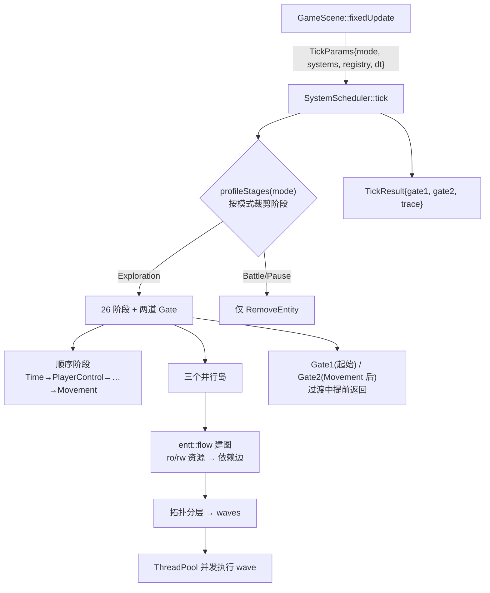

# L25 SystemScheduler 与并行岛

上一套教程里，`GameScene` 的 gameplay 系统是"挨个 `new`、固定顺序 `update`"的——清晰，但僵硬：系统之间谁依赖谁藏在调用顺序里看不见，互不相干的系统也只能一个接一个串行跑。本讲讲项目怎么把它升级成一个**声明式、可观察、可裁剪、可并行**的调度器 `SystemScheduler`。

它干四件事：① 用 26 个 `SchedulerStage` 钉死系统的执行顺序（少数 stage 是复合入口，会顺序调用多个系统）；② 按 `GameMode` 裁剪这一帧要跑哪些阶段；③ 把数据**无冲突**的系统抽成"并行岛"，用 `entt::flow` 从每个系统声明的"读写哪些资源"自动推导出哪些能并行；④ 地图过渡期用两道 Gate 提前终止 tick，避免在"半个地图"上跑逻辑。本讲也终于把 L04 / L15 反复提到却一直没展开的 `GameMode` 收口。并行的底层原理（线程池、依赖图、拓扑分层）外链多线程子教程，主线只讲项目这套调度器怎么搭、怎么看。

---

## 🎯 本讲目标

读完之后，你应该能回答：

1. 为什么光凭每个系统"声明自己读写哪些资源"，就足以**自动**推导出哪些系统能并行？声明漏了会出什么事？
2. `GameMode` 从 Exploration 切到 Battle，调度器内部具体做什么？（以及一个反转：这个切换在当前项目里**真的会发生吗**？）
3. 三个并行岛里的 worker 系统凭什么能并发跑而不打架？保证线程安全的"四件套"是什么？为什么还要在构建层启用 `ENTT_USE_ATOMIC`？
4. 哪些系统"绝不该进并行岛"？为什么 `Movement`、`ScriptCommands` 这类必须独占主线程？

---

## 👁️ 先看再讲：导出一张调度图，看三个系统为什么能并排

构建并运行 `scheduler_dot_dump` 工具，它把 **post-gate 并行岛**导成一张 graphviz DOT：

```bash
ninja scheduler_dot_dump          # 在你的 build 目录构建该 target
./scheduler_dot_dump post_gate.dot
```

打开 `post_gate.dot`（或 `dot -Tpng post_gate.dot -o post_gate.png` 渲染），你会看到三个 box 节点——`SpatialIndex`、`CameraFollow`、`Animation`——**彼此之间没有任何连线**。没有连线，意味着 `entt::flow` 根据它们声明的读写资源**推不出任何依赖边**，于是三者落进同一个 wave，可以并行执行。

再按 `F6` 打开 **Game Debug Panels → Scheduler**，能实时看到当前 `GameMode`、Gate 是否触发、最新一帧阶段耗时和近期 avg/max。注意：Debug Panel **不显示 wave 拓扑**；wave 结构要看 `scheduler_dot_dump` 导出的 DOT，或读 `ParallelWaveScheduler::waves()` 相关测试。这张"没有边的图"就是本讲的核心命题：**依赖不是写在代码顺序里，而是从资源声明里算出来的**。

---

## 🗺️ 关键链路



一句话：**tick 先按 GameMode 裁剪要跑的阶段；多数阶段顺序执行，三段无冲突的抽成并行岛由 `entt::flow` 从资源声明推导 wave 并发跑；地图过渡期两道 Gate 提前终止。**

---

## 💡 核心知识点

### 1. 从"直接 new + 顺序 update"到声明式调度器

升级前的痛点：系统逐个 `new`、固定顺序 `update`，依赖关系全藏在"谁先谁后"里，既不可观察、也无法并行。现在 `SystemScheduler` 换了套组织方式：

- **调度器不拥有系统**：所有系统由 `GameSystemBundle` 持有，通过 `TickParams` 引用传入；`tick()` 本身是 `const`、无状态，只有并行设施用 `mutable` 惰性初始化。
- **26 个 `SchedulerStage` 定义顺序**：enum 仅作身份标识，真正的运行顺序由 `StageDecl` 数组定；多数阶段只调用一个系统的 `update`，少数阶段是为了保持调度观测粒度而合并的复合入口。
- **没有 System 基类**：每个系统是独立具体类、无继承，调度器靠 `StageDecl` 里的函数指针分发；每次调用前都 `if (systems.xxx_system)` 空指针保护，允许某些配置下部分系统缺席。
- **不是所有系统都归它管**：`Render` / `Light` / `YSort` / `Audio` 由 `GameScene` 在 `render()` / frame update 等别处直接调用，不进 scheduler tick；但 `FarmSystem` 当前会在 `ItemUse` stage 里跟 `ItemUseSystem` 顺序执行，所以它是 tick 路径的一部分，只是没有单独的 `SchedulerStage`。

复合 stage 现在有三处最容易误读：`ItemUse` 先跑 `ItemUseSystem` 再跑 `FarmSystem`；`Dialogue` 先跑 `DialogueSystem` 再跑 `ScriptedDialogueLifecycleSystem`；`QuestInteraction` 会串起任务、招募、队伍招募和商店交互几个系统。`SchedulerStage` 的名字因此更像"调度槽位"：它服务于顺序、Gate、profile 和 profiler 记录，不等于永远一对一映射到一个 C++ system 类。

### 2. 资源读写声明 → `entt::flow` → 并行 wave（核心机制）

这是自测题 1，也是整讲的技术核心。每个并行任务用 [`SystemTaskDecl`](../../src/engine/system/system_task_decl.h) 声明自己**读哪些、写哪些**资源：

```cpp
struct SystemTaskDecl {
    std::string name;
    ExecutionPolicy policy;             // MainThreadOnly | WorkerEligible
    std::function<void(DeferredCommands&, TaskEventBuffer&)> run;
    std::vector<entt::id_type> ro_resources;   // 只读
    std::vector<entt::id_type> rw_resources;   // 读写
    bool sync_point;
};
```

资源是一个 `entt::id_type`——要么是 `hashed_string` 命名的逻辑域（`"spatial_index"_hs` / `"camera"_hs` / `"game_time"_hs` / `"npc_wander_domain"_hs`…），要么是某个组件的 `entt::type_hash<Component>::value()`。[`ParallelWaveScheduler::buildGraph`](../../src/engine/system/parallel_wave_scheduler.cpp) 把这些喂给 `entt::flow`：

```cpp
entt::flow builder;
for (...) {
    builder.bind(index);
    builder.ro(ro_resources...);   // 声明只读访问
    builder.rw(rw_resources...);   // 声明读写访问
}
matrix_ = builder.graph();         // flow 按冲突规则自动连依赖边
```

**冲突规则**：对同一个资源，写（rw）与之前的任意访问（读或写）冲突 → 连一条依赖边；读（ro）只与之前的写冲突；**读-读不冲突**。`extractWaves` 再对这张依赖图做拓扑分层（Kahn 算法、按入度）：入度为 0 的进 wave 0，移除后更新后继入度，再取入度 0 的进 wave 1……**同一 wave 内彼此无依赖，可并行**；若检测到环（`scheduled != vertex_count`）则 `valid_=false`。

举例——mid-stage 岛三个系统的真实声明：`DayNight`（ro `game_time`/`world_state`，rw `global_lighting_state`）、`NPCWander`（rw `npc_wander_domain`）、`AnimalBehavior`（rw `animal_behavior_domain`）。三者的读写集合**互不相交**，flow 推不出任何边，于是合成一个 3 宽的 wave。

**关键洞察：声明就是契约，调度器盲信它**。如果某系统实际写了 `spatial_index` 却忘了在 `rw_resources` 里声明，flow 就以为它和别人无冲突、把它和真正写 `spatial_index` 的系统塞进同一 wave 并行跑 → **数据竞争 / UB**。声明的正确性全靠程序员守，编译器和调度器都不替你检查。测试 `NoDependenciesShareSingleWave` 和 `WriteReadDependencySplitsWaves`（[`parallel_wave_scheduler_test.cpp`](../../tests/engine/system/parallel_wave_scheduler_test.cpp)）正反验证这条推导。

### 3. 三个并行岛：把固定链路里互不相干的段并起来

26 个阶段大多是顺序依赖的（`Time → PlayerControl → … → Movement → …`），但其中三段内部无冲突，被抽成并行岛：

| 并行岛 | 系统 | 为什么能并行 |
| --- | --- | --- |
| 岛 1 中段 | `DayNight` / `NPCWander` / `AnimalBehavior` | 各写各的域（光照 / NPC / 动物），读写不交 |
| 岛 2 移动前 | `ActionSound` / `State` | 各写各的组件（ActionSound / StateDirty） |
| 岛 3 后门控 | `SpatialIndex` / `CameraFollow` / `Animation` | 各写各的（空间索引 / 相机 / 动画组件） |

三个岛各自惰性建一个 `ParallelWaveScheduler`，共用一个名为 `"SystemSchedulerParallel"` 的 `ThreadPool`。一个 wave **真正并行**的条件是：`thread_pool != nullptr && 整个 wave 都是 WorkerEligible && wave.size() > 1`——否则 inline 顺序跑。当前实现假设任务图运行期静态不变，所以三个 scheduler 长期缓存、没有 invalidate 机制。

### 4. 并行安全四件套 + EnTT 构建前提

worker 线程不能随便碰 `registry` / `dispatcher`，否则 EnTT 的非线程安全操作会炸（自测题 3）。代码层靠四个机制兜住：

1. **Registry storage 预热**：每个岛执行前，主线程先调 `prepare_*_parallel_island_registry()` 强制初始化 EnTT 的惰性 component storage，避免 worker 首次访问触发隐式创建导致竞态。
2. **`DeferredCommands`**：worker 不直接改 registry，把"建/删实体、增/删组件"推进线程安全队列，wave 结束后**主线程** `drain(registry)` 统一落地。
3. **`TaskEventBuffer`**：worker 不直接 `trigger` dispatcher，把事件推进线程安全 buffer，wave 结束后主线程 `flushTo(dispatcher)`。而且 `drain` 一定在 `flush` 之前（测试 `DeferredDrainHappensBeforeTaskEventFlush` 守这个顺序）。
4. **`ParallelIslandContext`**：并行 lambda 必须可拷贝（`std::function`），不能捕获 `TickParams&`，于是调度器用 `mutable` 成员传上下文指针，执行完立即清空。

还有一个**构建层前提**：项目在顶层 `CMakeLists.txt` 全局定义了 `ENTT_USE_ATOMIC`。它不会把整个 registry 变成"随便怎么并发都安全"，但会让 EnTT 文档要求的内部共享静态状态走 atomic 路径；资源声明、storage 预热、deferred drain 和事件缓冲仍然是并行岛正确性的主体。

还有一道**降级保险**：如果 `ParallelWaveScheduler::valid()` 返回 `false`（图坏了或没线程池），整个岛自动降级为主线程顺序执行，功能不受影响（测试 `SubmitFailureFallsBackToInlineExecution`）。**并行是优化，不是正确性前提**——这是这套设计敢用的底气。

### 5. 两道 Gate：地图过渡期提前终止 tick

`RemoveEntity` 永远第一个跑（所有模式都排首位，测试 `RemoveEntityIsFirstStageForAllModes`）。然后是两道门：

- **Gate 1（tick 起始）**：若进 tick 时过渡已经在进行（上一帧触发的），只跑 `TransitionUpdatePre` + `LightTogglePre`，提前返回（`gate1_triggered`）。
- **Gate 2（`Movement` 之后）**：若玩家本帧通过移动触发了新的地图切换，跳过 `SpatialIndex` / `CameraFollow` / `Animation` / `Pickup` / `Interaction` 等后续阶段，提前返回（`gate2_triggered`）。

为什么要 Gate：过渡中地图实体正在卸载 / 重建，继续跑玩家移动、NPC AI、拾取检测，会在"半个地图"上操作实体 → 逻辑错乱。Gate 把这些一刀切掉，`TickResult` 把 `gate1`/`gate2` 标志带回去供观察。三个测试 `Gate1...` / `Gate2...` / `NormalPathReachesPostGameplayStages` 覆盖三态。

### 6. GameMode 裁剪：设计已就位，但运行时当前休眠

自测题 2，也是 L04 / L15 那个 `GameMode` 的收口。`profileStages(mode)` 按模式返回不同的阶段列表：

| GameMode | 跑哪些阶段 |
| --- | --- |
| `Exploration` | 全 26 阶段（受 Gate 裁剪） |
| `Battle` / `PauseOverlay` | **仅 `RemoveEntity`**（桩） |
| `Cutscene` | `RemoveEntity → Time → DayNight → TransitionUpdatePost → LightTogglePost` |

非 Exploration 模式直接顺序跑该列表，**不触发并行岛、不查 Gate**。所以"切到 Battle"的**设计动作** = 调度器每 tick 只跑 `RemoveEntity`，gameplay 全停。

**但这里有个必须诚实说明的反转**（呼应 L15）：`game_mode_` 默认 `Exploration`，而它的 setter `setGameMode` **当前没有任何调用者**——运行时 `game_mode_` 永远是 `Exploration`。真正的探索↔战斗切换走的是 **Scene 栈**（L15 push `BattleScene`、L04 覆盖式场景）：`BattleScene` 一压栈，`GameScene::fixedUpdate` 就不再被调用，它的 scheduler 自然 idle，根本不需要翻 mode。

那这套 GameMode 裁剪是死代码吗？**不是**——它被单元测试覆盖（`system_scheduler_profile_test` / `invariant_test`），`SchedulerDebugPanel` 也读 `game_mode_` 来显示当前模式。它是**就位、但当前由测试驱动**的基础设施：哪天想把战斗改成"原地不切场景、只翻 mode 复用同一个 scheduler"，`profileStages` 已经准备好了。这就是 GameMode 的完整收口——**枚举真实存在、裁剪逻辑真实可用、但 live 路径暂时另走 Scene 栈**。

---

## 📋 阅读清单

| 资源 | 为什么读 |
| --- | --- |
| [`docs/game/system_scheduler.md`](../../docs/game/system_scheduler.md) | 调度器全景：26 阶段表、Gate 时序图、三并行岛资源声明、安全四件套、惰性初始化 |
| [`docs/engine/loop_timing_contract.md`](../../docs/engine/loop_timing_contract.md) | fixed/render 循环拆分契约：fixedUpdate 固定步、tick 在哪跑、dispatcher 刷新时机 |
| 上一套 part-26 游戏场景与系统编排 | 升级前"直接 new + 顺序 update"的基线，对照看声明式调度改了什么 |
| 多线程子教程 10 ECS 并行调度 + 13 entt 多线程与调度器 | 并行 wave / `entt::flow` / 线程池的底层原理 |
| [`tests/engine/system/parallel_wave_scheduler_test.cpp`](../../tests/engine/system/parallel_wave_scheduler_test.cpp) | 用最小例子正反验证 wave 推导 / 降级 / drain 顺序 / DOT |

---

## 🔑 源码入口

| 文件 | 看什么 |
| --- | --- |
| [`src/game/runtime/system_scheduler.h`](../../src/game/runtime/system_scheduler.h) / [`.cpp`](../../src/game/runtime/system_scheduler.cpp) | **主角**：26 阶段、`profileStages`、两 Gate、三岛装配、资源常量、安全四件套 |
| [`src/engine/system/parallel_wave_scheduler.cpp`](../../src/engine/system/parallel_wave_scheduler.cpp) | `entt::flow` 建图 + 拓扑分 wave + 并行/inline 执行 + `dumpDot` |
| [`src/engine/system/system_task_decl.h`](../../src/engine/system/system_task_decl.h) | `SystemTaskDecl`：name / policy / run / ro / rw / sync_point |
| [`src/game/runtime/game_mode.h`](../../src/game/runtime/game_mode.h) | 四个 `GameMode`（Exploration / Battle / PauseOverlay / Cutscene） |
| [`tools/scheduler_dot_dump/main.cpp`](../../tools/scheduler_dot_dump/main.cpp) | 导出 post-gate 岛 DOT 的小工具（只导 post-gate） |

---

## ❓ 自测问题

1. "资源读写声明足以推导并行 wave"背后的冲突规则是什么（rw / ro 怎么组合算冲突）？如果一个系统实际写了某资源却漏声明 `rw`，会发生什么？用 `entt::flow` 的视角解释。
2. 把 `GameMode` 切到 Battle，`profileStages` 返回什么、tick 怎么退化？再答：当前项目里这个切换真的会在运行时发生吗？如果不会，战斗时 `GameScene` 的 scheduler 为什么自然就停了？
3. 一个并行岛里的 worker 想"删一个实体"和"发一个事件"，它能直接动 `registry` / `dispatcher` 吗？这两件事分别走哪条安全通道、在什么时机、由哪个线程落地？`ENTT_USE_ATOMIC` 解决的是哪一层问题、又不负责哪一层同步？
4. 给你 `Movement` 和 `SpatialIndex` 两个系统，为什么 `Movement` 不在任何并行岛、`SpatialIndex` 却可以？从"它读写什么、谁依赖它的结果"角度论证。

---

## 🧪 最小练习

**目标**：导出调度图，读出并行 wave 结构，再亲手制造一条依赖看 wave 怎么裂开。

1. **构建工具**：`ninja scheduler_dot_dump`（在你的 build 目录构建该 target）。
2. **导出**：`./scheduler_dot_dump post_gate.dot`，得到 post-gate 并行岛的 DOT。**注意**：这个工具只导 post-gate 岛——源码里只有 `dumpPostGateParallelIslandDot` 被暴露。
3. **看图**：`dot -Tpng post_gate.dot -o post_gate.png` 渲染，或直接读文本。你会看到 `SpatialIndex` / `CameraFollow` / `Animation` 三个 box **彼此无边**——资源声明不冲突，落进同一个 wave 并行。这就是唯一的一层 wave（深度 1、宽度 3）。
4. **制造一条依赖**：在 post-gate 任务声明里（[`system_scheduler.cpp`](../../src/game/runtime/system_scheduler.cpp) 约 320–360 行，带 `ParallelIsland::PostGate` 的那几条），给 `Animation` 的 `rw_resources` 加上 `RESOURCE_SPATIAL_INDEX`——伪造一个它与 `SpatialIndex` 的写-写冲突。重建工具、重新导出，观察 DOT 里**多出一条边**、wave 从 1 个裂成 2 个（`Animation` 被推到第二 wave）。理解"声明改一处，并行结构跟着变"。**改完记得还原。**

---

## 📌 小结

- **从顺序 update 到声明式调度**：`SystemScheduler` 不拥有系统（`GameSystemBundle` 持有）、`tick()` 是 const；26 个 `SchedulerStage` 定义顺序，无 System 基类、靠函数指针分发 + 空指针保护。
- **资源声明 → `entt::flow` → wave**：每个任务声明 `ro`/`rw` 资源，flow 按"写与任意访问冲突、读读不冲突"连依赖边，拓扑分层成 wave，同 wave 可并行。**声明是契约，漏声明 = 数据竞争**。
- **三个并行岛**：中段 / 移动前 / 后门控，各自把无冲突系统并起来；真正并行需 `thread_pool && 全 WorkerEligible && size>1`，否则 inline。
- **安全四件套 + 构建前提**：storage 预热、`DeferredCommands`（drain）、`TaskEventBuffer`（flush，且 drain 先于 flush）、`ParallelIslandContext`，外加全局 `ENTT_USE_ATOMIC`；`valid()` 失败整岛降级主线程——并行是优化不是正确性前提。
- **两道 Gate**：`RemoveEntity` 永远先跑；Gate1 起始查过渡、Gate2 Movement 后查过渡，过渡中提前返回，避免在"半个地图"上跑逻辑。
- **GameMode 收口**：`profileStages` 按模式裁剪阶段（Battle 仅 RemoveEntity）——但 `setGameMode` 当前无调用者，runtime 恒为 Exploration，真正切换靠 Scene 栈；这套裁剪是就位、被测试驱动、随时可启用的基础设施。

## 🚀 下节课预告

调度器是工程化主体的最后一块。下一讲收官。

下一讲 **L26 调试、测试与课程收尾**：把 TinyFarmRPG 的"工程化保护网"汇总成一张地图——调试面板全景（Battle / Quest / Shop / Inventory / Map / Save / Scheduler / RmlUi / VFX）、测试层级与选择标准（domain test / system test / scene smoke / source guard）、工具链（`visual_tester` / `rmlui_tester` / `battle_tester` / `scheduler_dot_dump` / `rpg_importer`），以及最实用的一份 checklist：**给一个新玩法，你该先写哪一层测试**。读完这讲，你就能在 TinyFarmRPG 上独立加玩法、加内容、加 UI，而不把工程改散。课程到此收官。
