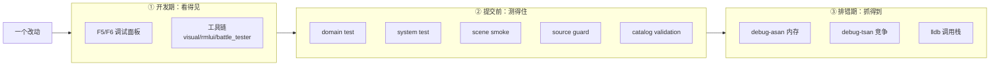

# L26 调试、测试与课程收尾

走到这里，TinyFarmRPG 的玩法和工程模块都拆完了。最后一讲不引入任何新系统，而是把贯穿全程那张**工程化保护网**显式画出来——调试面板、测试层级、工具链、sanitizer——并交给你一份最实用的判断力：**面对一个新需求，该在哪一层下手观察、在哪一层补测试，才能让项目继续长大而不腐烂**。

这也是整门课的收官。从 L00 的项目全局地图，到这一讲的"如何安全地继续改"，我们想留给你的不是某一个系统的实现，而是一套"加东西时不把工程改散"的工作方式。

---

## 🎯 本讲目标

读完之后，你应该能回答：

1. 给一个新领域服务补测试，你会先写 domain / system / scene smoke 哪一层？为什么这个顺序不是随意的？
2. 一个 UI 改动怎么被自动化测试拦住低级回归？哪些 UI 问题 smoke **测不出来**、只能靠人工 checklist？
3. "source guard"测试是什么？它守的是编译器**管不了**的哪一类规则？
4. 项目继续长大，最可能"先腐烂"的是哪一类模块？这套保护网在哪里提前设了防？

---

## 👁️ 先看再讲：按 F5 / F6，看见你学过的每个系统

进游戏，按 `F5` 弹出 **Engine 调试面板**、`F6` 弹出 **Game 调试面板**。扫一眼面板列表你会发现一件事：这门课学过的几乎每个系统，都有一块对应的面板——背包、商店、任务、战斗、地图、存档、调度器、VFX、RmlUi、空间索引、输入、事件流……

这不是巧合：**可观察性是和功能一起长出来的**。随手在 Inventory 面板加减一个物品，看 HUD 实时变（这正是 L02 我们用过的 `inventory_debug_panel`）；在 Scheduler 面板看每个阶段的耗时（L25 的 profiler）；在 Dispatcher Trace 面板看 command/event 实时流过。这种"开发期就能直接看见、甚至直接改内部状态"的能力，就是这张保护网的第一层。

---

## 🗺️ 关键链路

一句话：**一个改动要穿过三道网——开发期用面板/工具肉眼看，提交前用分层 GoogleTest 测，排错期用 sanitizer + 调试器抓。**

---

## 💡 核心知识点

### 1. 调试面板全景：可观察性和功能一起长

调试面板分两类，用功能键切换可见性（由 [`DebugUIManager`](../../src/engine/debug/debug_ui_manager.h) 按 `PanelCategory` 管理）：

- **Game 面板（F6）**：`battle` / `quest` / `shop` / `inventory` / `map_inspector` / `player` / `game_time` / `save_load` / `scheduler`(+profiler) / `blueprint_inspector`——几乎是这门课每个玩法系统的"仪表盘"。
- **Engine 面板（F5）**：`audio` / `dispatcher_trace` / `game_state` / `gl_renderer` / `input` / `res_mgr` / `rmlui` / `scene` / `spatial_index` / `text_renderer` / `time` / `vfx`。

设计哲学是：**每加一个领域服务/系统，顺手配一块面板**。`dispatcher_trace` 面板尤其值得记——它把 command/event 三角（L02）的实时流量摊开给你看，是排查"事件发了没、谁订阅了"的利器。

### 2. 测试金字塔：四层，各管一段

项目的 GoogleTest 套件分两个可执行（`engine_tests` / `game_tests`，经 `gtest_add_tests` 注册给 `ctest` 发现），内部按层次组织：

| 层 | 测什么 | 例子 | 成本 |
| --- | --- | --- | --- |
| **domain test** | 领域服务的纯规则：preflight + 原子写入 + **失败路径** | `inventory_domain_service_test` / `quest_turn_in_service_test` / `shop_transaction_service_test`(14 例) | 最低（无场景） |
| **system test** | 系统在 registry 上的流程级行为（多组件协作、事件流） | `npc_animal_parallel_domain_test` | 中 |
| **scene smoke** | 一个 Scene 能否**启动、渲染基本结构、关键交互不崩** | `battle_scene_smoke_test` / `shop_menu_scene_smoke_test` / `quest_offer_scene_smoke_test` | 最高（装全家桶） |
| **source guard** | 编译器管不了的架构规则（见知识点 4） | `localization_source_guard_test` | 低（读文本） |

外加 **catalog validation**（`rpg_catalog_test` / `quest_catalog_test` / `shop_catalog_test`…）守 catalog 的引用完整性——L09 那些"故意改坏一个 id 让校验失败"的反向案例就在这层。

**关于 scene smoke 的边界**（自测题 2 后半）：smoke 只验"装得起来、不崩、关键绑定在"，它**测不出视觉正确性**——tooltip 靠近边缘有没有翻转、拖拽手感、hover 高亮好不好看、fade 时长对不对，这些感知层面的东西 smoke 一概看不见，只能靠 `docs/testing/ui-regression-checklist.md` 的人工清单 + `rmlui_tester` 肉眼过。配套的 `rmlui_architecture_regression_test` / `menu_hover_focus_sync_test` / `ui_layout_integration_test` 能拦住"文档加载/绑定/几何"这类结构回归，但拦不住"好不好看"。

### 3. 为什么"领域服务先写 domain test"

自测题 1。关键是**构造一条失败路径的成本**：

- domain test 最便宜——纯函数式、不启动场景/UI、毫秒级、一两行 setup 就能造出"背包满了""钱不够""装了无效装备"这种失败前置条件。
- scene smoke 最贵——要先把 RmlUi 文档、registry、一整套服务都装起来，才够得着同一条失败路径。

领域服务的价值就是**规则真相**，而规则真相最该被 domain test 钉死，尤其是失败路径（preflight 拒绝 + 状态不被破坏）。所以顺序是：**先 domain 锁规则（失败路径优先）→ 必要时 system 测流程串联 → 最后 scene smoke 兜"能开不崩"**。倒过来写又慢又测不准。这正是 L02 / L10 那句"领域服务的失败路径测试是新增玩法的最低安全网"的落地。

### 4. source guard：把架构规则写成会失败的测试

自测题 3。编译器能保证语法和类型，但保证不了这类**架构约定**：别在标了"无异常"的文件里写 `throw`、别在 RML 之外硬编码 UI 文案、渲染分层别被绕过。这些规矩靠 code review 反复唠叨——而人会忘。

source guard 把它们**固化成测试**：[`localization_source_guard_test`](../../tests/game/localization_source_guard_test.cpp) 这类测试用 `PROJECT_SOURCE_DIR` 把源码当**文本**读进来，用 `regex` 找违规，报 `SourceViolation{文件, 行, 文本}`。例子：`resource_manager_no_exceptions_test`（禁 `throw`/`try`）、`localization_source_guard_test`（禁硬编码文案）、`render_system_layered_source_test`（分层不变量）。本质上是"把 review 里的规矩变成一条会红的测试"——人会忘，测试不会。项目长大后，这类 guard 是防腐烂的关键。

### 5. 工具链：补上"自动化测不到的那一半"

五个工具（`docs/testing/tools.md`），都针对"需要肉眼看或离线生成、GoogleTest 够不着"的场景：

| 工具 | 干什么 | 什么时候用 |
| --- | --- | --- |
| `visual_tester` | 打开 engine 视觉测试场景 | 渲染管线 / AutoTile 缝隙 / VFX / 相机肉眼确认 |
| `rmlui_tester` | 独立开 `.rml` 文档、热重载 | 调样式/布局，不想启动整局游戏 |
| `battle_tester` | 指定 actor/troop/背景直开战斗 | 验新 enemy/skill 数据、战斗手感、结算 |
| `scheduler_dot_dump` | 导 post-gate 并行岛 DOT | 改了并行声明后查依赖图（L25 用过） |
| `rpg_importer` | 离线把 RPGMaker JSON 转 catalog | 批量导入 RPG 数据，产 validation_report |

边界很清楚：**逻辑规则优先 GoogleTest；视觉/手感用工具人工确认并在回归清单记录**。工具不替代测试，只补测不到的那一半。

### 6. 排错三件套，以及项目长大时哪里先烂

排错靠三个 CMake 预设（`docs/tutorial/debugging.md`）：`debug-asan`（内存：越界 / use-after-free / 泄漏）、`debug-tsan`（数据竞争——**L24 异步预加载、L25 并行岛这类并发代码尤其需要**）、`lldb`（交互式调用栈）。崩溃时 asan/tsan 报告自带文件名和行号，是最有价值的定位线索。

自测题 4——**最可能先腐烂的，是并发代码和跨层契约**：

- **并发**（L24 / L25）：bug 偶发、难复现、肉眼读不出来。防御 = 定期 `tsan` 跑 + 显式机制（owner-thread 契约、generation 版本号、资源读写声明）把"不能这么做"写进代码结构。
- **跨层契约**（领域服务边界、UI 文案分离、资源声明正确性）：靠"人记得"维持，人会忘。防御 = `source guard` 把规矩固化成测试。

这张网不是一次建好的，而是**每加一个功能，顺手补上对应的面板 / 测试 / guard**——这就是项目能持续长大的根。

> **一个诚实的现状**：项目当前**没有提交 CI 配置**（仓库里没有 `.github/workflows`）。`engine_tests` / `game_tests` 经 `gtest_add_tests` 注册、`ctest` 可一键全跑，是**为门禁设计**的安全网，但真正接到 GitHub Actions 这类 CI 还留待落地。所以自测题 2 里"被 CI 拦住"，当下的实义是"**提交前本地 `ctest` 全绿**"。

---

## 📋 阅读清单

| 资源 | 为什么读 |
| --- | --- |
| [`docs/testing/tools.md`](../../docs/testing/tools.md) | 五个工具的用途 / 构建 / 适用场景 / 自动化对应 |
| [`docs/testing/ui-regression-checklist.md`](../../docs/testing/ui-regression-checklist.md) | UI 人工回归清单 + 配套自动化回归测试（smoke 测不到的视觉项） |
| [`docs/tutorial/debugging.md`](../../docs/tutorial/debugging.md) | CMake 预设、ASan / TSan、LLDB、崩溃信息收集模板 |
| 回看 L02 / L10（领域服务失败路径）+ L09（catalog 校验） | 本讲测试层级的具体来源 |
| `tests/` 各层抽样 | `inventory_domain_service_test`(domain) / `*_scene_smoke_test`(scene) / `*_source_test`(guard) |

---

## 🔑 源码入口

| 文件 | 看什么 |
| --- | --- |
| [`src/game/debug/`](../../src/game/debug/) + [`src/engine/debug/panels/`](../../src/engine/debug/panels/) | 两类调试面板（F6 Game / F5 Engine） |
| [`src/engine/debug/debug_ui_manager.h`](../../src/engine/debug/debug_ui_manager.h) | `PanelCategory` 与面板可见性管理 |
| [`tools/`](../../tools/) | 五个验证工具入口 |
| [`tests/game/inventory_domain_service_test.cpp`](../../tests/game/inventory_domain_service_test.cpp) | domain 测试范例（失败路径） |
| [`tests/game/localization_source_guard_test.cpp`](../../tests/game/localization_source_guard_test.cpp) | source guard 范例（源码文本断言） |

---

## ❓ 自测问题

1. 给一个新领域服务补测试，domain / system / scene smoke 你先写哪层？用"构造一条失败路径的成本"来论证这个顺序。
2. 一个 UI 改动，哪些回归能被 scene smoke / source guard / regression 测试自动拦下？哪些（像 tooltip 边缘翻转、拖拽手感、fade 时长）只能靠人工 checklist？为什么后者测不进 smoke？
3. source guard 测试和普通单测有什么本质不同？举一个"编译器和普通单测都管不了、只能靠 source guard 守"的规则。
4. 项目再长两年，你赌哪个模块先腐烂？给出你的防御方案（用本讲学过的网里至少两件）。

---

## 🧪 最小练习

**目标**：给一个领域服务补一条失败路径测试，本地跑绿。

1. **选服务**：比如 `ShopTransactionService`（[`shop_transaction_service_test.cpp`](../../tests/game/shop_transaction_service_test.cpp) 已有 14 个 case 可仿写）或 `InventoryDomainService`。
2. **找未覆盖的失败路径**：例如"背包满时 `commitBuy` 应失败且**不扣钱**""卖出数量超过持有应被拒"。
3. **写 TEST**：仿照现有 case——构造服务 + 触发该路径 + `EXPECT` 失败返回 + `EXPECT` 状态未被破坏（钱包/背包没变）。**失败路径测的不只是"返回 false"，更是"状态没被写坏"**。
4. **本地跑绿**：`ninja game_tests` 构建，`ctest -R ShopTransaction`（或直接跑可执行）确认全绿。
5. **提交**。（注：项目当前没提交 CI 配置，"绿"指本地 `ctest` 全过；接 GitHub Actions 留作后续扩展。）

---

## 📌 小结

- **可观察性和功能一起长**：F5 Engine / F6 Game 调试面板覆盖几乎每个系统；`dispatcher_trace` 看事件流、`scheduler` 看耗时——开发期就能看见内部状态。
- **测试金字塔四层**：domain（纯规则、失败路径，最便宜先写）→ system（流程）→ scene smoke（能开不崩，测不出视觉）→ source guard（架构规则固化成测试）；外加 catalog validation 守引用完整性。
- **领域服务先写 domain test**：失败路径在 domain 层一行 setup 就能造，scene 层要装全家桶才够得着——成本决定顺序。
- **source guard 守编译器管不了的约定**：读源码文本 + regex 找违规，把"别 throw / 别硬编码文案 / 别绕分层"变成会红的测试。
- **工具链补测不到的一半**：visual/rmlui/battle_tester 看画面手感、scheduler_dot_dump 看图、rpg_importer 离线导入——逻辑优先测试，视觉手感用工具。
- **防腐靠持续补网 + sanitizer**：并发代码（L24/L25）和跨层契约最易腐烂，用 tsan + 显式机制 + source guard 提前设防；CI 尚未接入，当前门禁是本地 `ctest` 全绿。

## 🎓 课程收官

27 讲到此走完。回看整条路线：**L00–L02** 建项目心智地图 → **L03–L05** RmlUi / HUD / 输入 → **L06–L08** Lua 内容层 → **L09–L14** 探索侧 JRPG 闭环 → **L15–L20** 回合制战斗 → **L21–L26** 工程化收尾。

但真正想留给你的不是这 27 个系统，而是贯穿全程、反复出现的几条**脊柱**：

- **领域服务集中写入** = 规则真相只有一个入口（L02/L10/L11/L13）。
- **command / event / service 三角** = 请求、校验、通告各归其位。
- **探索态持真相、战斗态消费快照；表现只读快照、不碰真相**（L13/L14/L16/L19）。
- **数据驱动 catalog + Lua 编排内容** = 规则写 JSON、编排写 Lua、热路径写 C++（L06/L09）。
- **可观察性与测试和功能一起长** = 每加一块功能，顺手补面板、补测试、补 guard（本讲）。

带着这几条脊柱，你已经能在 TinyFarmRPG 上独立增加一个新玩法、新内容、新 UI，并让这个工程继续长大而不散架。这，就是这门课真正想教会你的事。课程到此结束——去加点你自己的东西吧。
