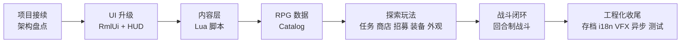

# TinyFarmRPG 课程大纲草案

> 课程定位：承接上一套「OpenGL 与迷你农场」教程，从已经完成的 TinyFarm 农场项目出发，讲解如何在不推倒重来的前提下，把一个 2D 农场经营 Demo 扩展成具备剧情、任务、商店、队伍、装备与回合制战斗闭环的 JRPG 教学项目。

## 课程原则

- **不从零开始**：默认学生已经完成或理解上一套 TinyFarm 教程，具备 C++20、ECS、Scene、Tiled、OpenGL 渲染、资源系统、存档和基础 UI 的上下文。
  - 上一套课程的文字教程目录： `lecture_plans/ref/OpenGL与迷你农场`，其中大纲为 `lecture_plans/ref/OpenGL与迷你农场/lecture_outline.md`
  - 上一套课程的代码目录： `lecture_plans/ref/TinyFarm`
- **架构优先**：以模块边界、数据流、事件流、系统拆分、调试方法为主，不逐行讲实现细节。
- **代码细节留阅读清单**：每讲只挑关键类、关键数据结构和关键流程讲透，其余通过文档、源码入口和练习引导学生自读。
- **聚焦新增能力**：上一套已经覆盖的知识点只在需要建立上下文时快速回顾，不重复展开。
- **面向可扩展项目**：强调 engine/game 分层、领域服务、脚本内容层、数据目录和测试，让学生理解如何让小型项目继续长大。
- **先看再讲**：架构类讲次尽量提供可观察的运行或调试入口，避免"纯架构图"过载。
- **外链子教程**：RmlUi、多线程这两块本身已有独立子教程（`learn/lectures/rmlui/`、`docs/tutorial/multi-thread/`），主线只讲"项目里如何用"，原理细节外链。

## 单讲模板

每讲按以下顺序组织（可酌情合并「小结/预告」）：

1. **本讲目标** — 一句话说清"读完之后你能做什么"。
2. **关键链路（可选）** — 一张 mermaid 小图，说明本讲跨模块的数据流或事件流。
3. **核心知识点** — 3-6 条，每条围绕一个具体决策点（"为什么这样做"，而不仅是"做了什么"）。
4. **阅读清单** — 项目内 docs + 上一套相关章节 + 子教程外链。
5. **源码入口** — 3-5 个文件，按"读这几个就能动手改"的优先级排列。
6. **自测问题** — 3-4 个开放问题，学生能口头回答即视为理解。
7. **最小练习** — 30-60 分钟工作量的小改动或观察任务。
8. **小结与下节预告** — 一两句话。

- 教程正文落地时按此模板展开；本大纲为节省篇幅，对每讲只给出"目标 / 关键链路 / 知识点 / 阅读清单 / 源码入口 / 自测问题 / 最小练习 / 小结预告"八块的精简形式。
- 撰写教程时可以随时参考上一期教程中的内容（上一期的大部分示意图使用的是图片，本期改成mermaid图）

## 先修与配套子教程

本套不是从零开始。开始 L00 之前请确认以下先修条件已就位：

| 资源 | 角色 | 范围 |
| --- | --- | --- |
| 上一套「OpenGL 与迷你农场」教程 | **完整先修** | intro + part-01..part-33 全部；本套不重讲基础 |
| RmlUi 子教程 `learn/lectures/rmlui/` L01-L06 | **前置必修** | 文档结构、盒模型、布局、样式、事件、数据绑定基础 |
| RmlUi 子教程 `learn/lectures/rmlui/` L07-L15 | **穿插推荐** | 自定义元素、动画、JRPG 实战；主线对应讲次会在阅读清单点名 |
| 多线程子教程 `docs/tutorial/multi-thread/` | **穿插推荐** | 主线 L21 / L24 / L25 会指明配套章节 |

具体穿插推荐分布：

- **L03 RmlUi 接入** — 假设已读完子教程 L01-L06；本讲只讲项目接入，不重复语法。
- **L04 HUD 与覆盖式场景** — 配套子教程 L09 spritesheet（HUD 大量用九宫格）。
- **L18 战斗 Action 生成** — 配套子教程 L14 jrpg-battle。
- **L19 战斗表现** — 配套子教程 L10 animation。
- **L21 存档** — 配套多线程子教程 09-background-save-io。
- **L22 本地化与字号** — 配套子教程 L04 styling 的 rem/字号章节。
- **L24 异步预加载** — 配套多线程子教程 03 / 05 / 06 / 07。
- **L25 SystemScheduler 并行** — 配套多线程子教程 10 / 13。

若未读 RmlUi 子教程基础部分直接进入 L03，会因为 RML/RCSS 语法陌生而难以跟上。建议讲师在 L00 末尾再次提醒学生检查先修。

## 与上一套教程的衔接

上一套「OpenGL 与迷你农场」共 1 intro + 33 个 part（part-01..part-33）。本套对其的处理方式如下表，便于学生定位先修知识：

> 注：表中 `part-NN` 编号对应上一套教程目录 `lecture_plans/ref/OpenGL与迷你农场/` 下的文件名序号（`00-开篇.md` = intro 开篇 = part-00，`NN-*.md` = part-NN，NN ∈ 01..33）。上一套大纲文件 `lecture_outline.md` 中的 L 标号（含 L03A/L03B 附加课）是教学口径，对应关系为：L00 = part-00（intro），L01..L03 = part-01..03，L03A = part-04，L03B = part-05，L04..L30 = part-06..32，L31 = part-33。

| 上一套章节 | 在本套的处理 |
| --- | --- |
| intro 开篇 / part-01 构建与运行 | **L00 对齐**：用本项目目标、运行方式和学习路径承接上一套开篇 |
| part-02 游戏架构设计 | **L01 回顾**：作为新架构地图的对照基线 |
| part-03 入口到第一帧 / part-04 测试 / part-05 Debug UI | 略过 |
| part-06 事件系统 | **L02 回顾**：事件总线与命令的边界 |
| part-07 场景系统 | **L04 回顾**：覆盖式场景在原 Scene 栈上的扩展 |
| part-08 ECS 落地 | **L01/L02 回顾**：声明式装配 vs 直接 new 系统 |
| part-09–12 2D 渲染管线 | 略过（L19 表现层与 L23 VFX 会消费但不重讲） |
| part-13 资源系统 | 略过；L22 / L24 会用到 |
| part-14 字体与文本 | **L03/L22 回顾**：RmlUi 字体接入与字号策略 |
| part-15 输入系统 | **L05 升级**：输入上下文与菜单导航 |
| part-16 音频系统 | 略过；L09 讲 `AudioCueCatalog` 作为数据驱动包装 |
| part-17 UI 框架基础 / part-18 UI 布局与预设 | **L03/L04 替换**：自研 UIManager → RmlUi |
| part-19 空间索引 / part-20 碰撞解析 | 略过 |
| part-21 地图数据管线 / part-22 关卡载入与实体建造 | **L24 升级**：异步化与 generation 失效 |
| part-23 蓝图与实体工厂 | **L08 扩展**：脚本化实体与 Blueprint 字段约定 |
| part-24 世界状态 | 略过 |
| part-25 地图管理器 | **L24 升级**：异步状态机与主线程命令队列 |
| part-26 游戏场景与系统编排 | **L01/L25 替换**：runtime/service/factory + SystemScheduler |
| part-27 玩家控制与相机 | 略过 |
| part-28 交互与对话 | **L08 升级**：脚本事件桥 + DialogueChoice |
| part-29 物品栏与快捷栏 | **L04 回顾**：HUD 元素生命周期 |
| part-30 物品使用与农场循环 | 略过 |
| part-31 游戏时间与昼夜 | 略过 |
| part-32 存档与流程收尾 | **L21 升级**：domain service 集中写入 + schema 迁移 |
| part-33 收尾 | 略过 |

## 总体路线

## 阶段总览

| 阶段 | 建议讲次 | 核心主题 | 产出 |
| --- | --- | --- | --- |
| I. 项目接续与架构基础 | L00-L02 | intro 开篇、游戏架构设计、领域服务概览 | 建立新项目心智模型 |
| II. 生产 UI 与输入升级 | L03-L05 | RmlUi 接入、HUD 与覆盖式场景、输入上下文 | 替换自研 UI 的设计路线 |
| III. Lua 内容层 | L06-L08 | ScriptHost、Sol2 绑定、脚本事件桥 | NPC/地图/剧情可脚本化 |
| IV. RPG 数据与探索玩法 | L09-L14 | Catalog、任务、商店、队伍、装备成长、分层外观 | JRPG 探索侧闭环 |
| V. 回合制战斗 | L15-L20 | 战斗入口、领域核心、动作解析、Action 生成、表现、结算 | 最小可玩的战斗闭环 |
| VI. 工程化收尾 | L21-L26 | 存档迁移、本地化与设置、VFX、异步预加载、并行调度、测试调试 | 项目级质量收尾 |

总计 **27 讲**。

## 逐讲大纲

---

### Stage I — 项目接续与架构基础

#### L00: intro 开篇

**目标**：用一讲时间说明 TinyFarmRPG 是什么、从上一套 TinyFarm 继承了什么、本套课程会新增哪些 RPG 能力。

**知识点**：
- 课程定位：在 TinyFarm 的农场经营底座上，扩展剧情、任务、商店、队伍、装备与回合制战斗。
- TinyFarm 已有能力盘点 + TinyFarmRPG 新增目标的对照地图。
- 学习路径：先建立项目全局地图，再按 UI、脚本、玩法数据、战斗、工程化收尾逐层拆开。
- 课程阅读方式：架构图、关键链路、阅读清单、源码入口、自测问题。
- 项目目录速览：`src/engine` vs `src/game`、`assets/data`、`scripts/`、`ui/rmlui/`。
- **先修条件 checklist**（与大纲"先修与配套子教程"小节对齐）：
  - 上一套「OpenGL 与迷你农场」教程：intro + part-01..part-33（**完整先修**）
  - RmlUi 子教程 L01-L06：文档结构 / 盒模型 / 布局 / 样式 / 事件 / 数据绑定（**前置必修**，否则 L03 会卡 RML/RCSS 语法）
  - RmlUi 子教程 L07-L15 与多线程子教程：**穿插推荐**，主线对应讲次会在阅读清单点名

**阅读清单**：
- `docs/overview.md`
- 上一套 intro 开篇
- 上一套 part-01 构建与运行

**源码入口**：
- `src/game/game_entry.*`
- `src/engine/core/*`

**自测问题**：
1. TinyFarmRPG 相对 TinyFarm 主要多了哪 5 个玩法系统？
2. 为什么这一次不推倒重来？把"在旧底座上扩"作为前提带来了哪些约束？
3. 本套课程为什么把架构、UI、脚本、玩法数据和战斗拆成几个阶段讲？

**最小练习**：跑通项目，浏览 `docs/overview.md`，对照本讲的阶段总览写下你最想先拆开的 3 个系统。

**小结与下节预告**：本讲建立全局地图，下一讲对齐上一套 part-02，从"游戏架构设计"角度看 TinyFarmRPG 如何继续长大。

---

#### L01: 游戏架构设计

**目标**：对照上一套 part-02，理解 TinyFarmRPG 的 engine/game 分层、运行时装配和模块边界如何承载更复杂的 RPG 系统。

**知识点**：
- 上一套 TinyFarm 的基础架构回顾：Application、Scene、ECS、事件、资源与 UI 的基本分层。
- TinyFarmRPG 的新架构地图：engine 稳定底座、game 玩法层、domain 规则层、script 内容层。
- `GameRuntimeAssembler`、`RuntimeServiceFactory`、`SystemFactory`、`SystemBundle` 的职责分工。
- `ContentCatalogLoader` 和 `RpgCatalogLoader` 如何集中加载内容数据。
- `ServiceLookup` 如何避免场景层到处传递零散指针（与上一套 part-26 中"手动传 Context 引用"对比）。
- Blueprint / EntityFactory 在新项目中的位置（详深留 L08）。
- 为什么功能变多后需要从"直接 new 系统"升级到声明式装配。

**阅读清单**：
- 上一套 part-02 游戏架构设计
- `docs/game/runtime-assembly.md`
- `docs/game/game_scene.md`
- 上一套 part-26 游戏场景初始化与系统编排

**源码入口**：
- `src/game/runtime/game_runtime_assembler.*`
- `src/game/runtime/runtime_service_factory.*`
- `src/game/runtime/system_factory.*`
- `src/game/runtime/service_lookup.h`
- `src/game/factory/blueprint_manager.*`

**自测问题**：
1. 如果你要新增一个"天气系统"，需要在哪几个文件里登记？登记顺序为什么是这样？
2. `ServiceLookup` 解决了上一套教程中哪个具体痛点？
3. 为什么 catalog 加载要在 service 创建之前？

**最小练习**：找出一个现有 service（如 `LocalizationService`），逆向追出它的"被谁注册 / 被谁拿到 / 被谁用"三条链路。

**小结与下节预告**：装配讲完"东西怎么进来"，下一讲讲"东西怎么写回去"——领域服务为什么集中写入。

---

#### L02: 领域服务概览与命令/事件边界

**目标**：建立"写入操作集中到领域服务"的直觉印象，记住这是后续所有玩法讲次的共同模式，**不展开**单个服务的实现细节（留到 L10/L11/L13）。

**知识点**：
- ECS 系统、UI、Lua、存档都可能触发玩法状态变化，必须统一规则入口。
- 领域服务的共同模式：preflight 校验 → 原子写入 → 反馈事件。
- command / event / domain service 的三角分工：请求由 command 进入，规则由 service 校验写入，结果由 event 通告 UI 与脚本。
- `src/game/domain/` 全景：Inventory / Equipment / Quest / Shop / PartyRest / ActorProgression / QuestBattleProgress 的存在意义。
- 领域服务与测试：每个服务都有一组失败路径测试，这是新增玩法的最低安全网。

**阅读清单**：
- `docs/game/domain-services.md`（领域服务核心阅读材料：本层做什么、谁调、怎么新增）
- `docs/game/runtime-assembly.md`（领域服务的装配章节）
- 上一套 part-06 事件系统 + part-08 ECS 在本项目中的落地

**源码入口**：
- `src/game/domain/inventory_domain_service.*`（**仅作为模板**通览一遍）
- `src/game/defs/commands_*.h`
- `src/game/defs/events_*.h`

> 提示（先看再讲）：开讲前打开 `inventory_debug_panel`，做一次加/减物品观察 `InventoryChangedEvent` 触发，再回头看 service 内部如何"preflight → 写入 → 事件"。

**自测问题**：
1. "把状态写入集中到领域服务"解决了哪些以前散在 system 里的具体问题？
2. command 与 event 各自承担什么？为什么不直接 system → system 调用？
3. preflight 与原子写入失败回退在 `InventoryDomainService` 里是如何体现的？

**最小练习**：选一个领域服务，画出它的"入口 command → preflight → 写入 → 事件 → 订阅者"完整图。

**小结与下节预告**：架构基础到此完成，下一阶段进入 UI 升级——为什么砍掉自研 UI 换 RmlUi。

---

### Stage II — 生产 UI 与输入升级

#### L03: 从自研 UIManager 到 RmlUi

**目标**：理解为什么项目从上一套自研 UI 系统升级到 RmlUi，以及接入点在哪里。**RmlUi 自身的 RML/RCSS 语法不在主线展开，外链到子教程**。

**知识点**：
- 为什么换 RmlUi：声明式 UI、热重载、CSS 风格样式、内置数据绑定的工程价值。
- 接入层：`RmlUiRuntime`、`RmlDocumentController`、`RmlDataBridge`、OpenGL render interface 与现有渲染管线的关系。
- 资源系统与 RmlUi 的接驳：图像加载、字体加载、热重载。
- UI 文件目录约定：`ui/rmlui/theme`、`ui/rmlui/hud`、`ui/rmlui/scenes`、`ui/rmlui/overlay`、`ui/rmlui/learn`。
- 何时绕过 RmlUi 直接用 ImGui（调试面板）。

**阅读清单**：
- `docs/engine/ui_framework.md`
- `docs/engine/layout-contract.md`
- **RmlUi 语法子教程入口**：`learn/lectures/rmlui/syllabus.md`（L01-L11 基础与视觉，L12-L15 JRPG 实战）
- 上一套 part-17 UI 框架基础 + part-18 UI 布局与预设（作为对照基线）

**源码入口**：
- `src/engine/ui/*`（重点：runtime、data bridge、document controller）
- `ui/rmlui/theme/*.rcss`

**自测问题**：
1. 自研 UIManager 与 RmlUi 在"布局"和"事件"上的根本差异是什么？
2. RmlUi 怎么共享上一套的字体与图片资源系统，而不重复一套加载？
3. 调试面板为什么不一起搬到 RmlUi？

**最小练习**：在 `ui/rmlui/learn/` 下新建一个最简文档（一句话 + 按钮），通过现有 runtime 接口加载并显示。

**小结与下节预告**：本讲讲 RmlUi 怎么进来，下一讲讲 UI 文件怎么组织成"常驻 HUD + 覆盖式 Scene"两种形态。

---

#### L04: HUD 与覆盖式 UI 场景的生命周期

**目标**：讲清楚 HUD（常驻）与 Inventory/Shop/Quest/Recruit/Battle 等弹出场景（覆盖式）这两种 UI 形态如何并存，以及它们与 `GameScene`、`SceneManager` 的关系。

**知识点**：
- HUD 文档生命周期：随 `GameScene` 入场创建、退场销毁；被覆盖时文档可继续保留或被 owner 可见性策略隐藏。
- 覆盖式 Scene 复用：底层探索场景保持 `prepareUi` / `render` 冻结快照，栈顶菜单独占 `fixedUpdate` / `update` 与输入。
- 文档显隐 vs Scene push/pop 的取舍。
- HUD 元素全景：`hotbar`、`dialogue_box`、`item_tooltip`、`time_clock`、`floating_notice`、`game_overlay`、`game_input_prompt_overlay`、`screen_fade`、玩家头像生成图。
- 覆盖式 Scene 全景：Pause、Save、Inventory、Shop、QuestOffer、RecruitOffer、DialogueChoice、Rest、AppearanceCustomize、Battle。
- UI 场景如何通过 event 请求关闭、提交交易或写回状态。
- `GameMode` 是 scheduler 接口线索；当前覆盖式 UI 冻结主要由 Scene 栈规则完成，详深与真实联动留 L25 复核。

**阅读清单**：
- `docs/game/ui-scenes.md`
- `docs/engine/scenes.md`
- `docs/game/game_scene.md`
- 上一套 part-07 场景系统 + part-29 物品栏与快捷栏

**源码入口**：
- `src/game/scene/*_scene.*`
- `src/game/ui/*`（HUD 控制器）
- `ui/rmlui/hud/*.rml`
- `ui/rmlui/scenes/*.rml`

**自测问题**：
1. HUD 文档与覆盖式 Scene 的"显隐成本"差在哪？什么时候该用哪种？
2. 打开 InventoryMenu 时，`GameScene` 的 update 是被暂停还是继续？为什么？
3. `DialogueChoice` 为什么是一个独立 Scene 而不是 HUD？

**最小练习**：在 HUD 里临时加一个 floating debug label，对比"显隐切换"与"push/pop scene"的代码量与延迟。

**小结与下节预告**：UI 形态讲完，下一讲讲玩家怎么操控它们——输入上下文。

---

#### L05: 输入上下文与菜单导航

**目标**：解释新增菜单、对话、战斗后，输入系统为何必须支持上下文、缓冲与 UI 路由。

**知识点**：
- Gameplay / Menu / Dialogue / Battle 输入上下文及切换规则。
- action binding、Action Prompt / glyph 元数据、重绑定、输入缓冲。
- RmlUi / ImGui / Gameplay 的事件转发顺序。
- 为什么 Battle 菜单不直接依赖 RmlUi 原生方向键导航，而要走自己的菜单模型（铺垫 L18）。

**阅读清单**：
- `docs/engine/input_system.md`
- `tests/engine/input/*`
- `tests/game/input_context_scene_stack_test.cpp`
- 上一套 part-15 输入系统（作为升级前对照）

**源码入口**：
- `src/engine/input/*`
- `src/game/scene/battle_input_router.*`（仅作示例，详深在 L18）

**自测问题**：
1. 在打开 Inventory 的同时，方向键应该被谁消费？输入上下文是怎么仲裁的？
2. 重绑定时，HUD prompt 文本和 glyph 元数据是怎么同步更新的？
3. 为什么 RmlUi 原生方向键导航不够用？

**最小练习**：把 HUD prompt 条正在显示的 Gameplay action 绑到一个新按键，验证 HUD prompt 文本和 Input Debug 中的 glyph 元数据跟着变。

**小结与下节预告**：UI/输入完成，下一阶段进入内容层——Lua 写剧情。

---

### Stage III — Lua 内容层

#### L06: Lua 内容层总览

**目标**：建立"Lua 写内容，C++ 守规则"的核心边界，理解 `scripts/` 目录组织，**并掌握脚本顶层幂等与 `tf.state` 持久化两条核心规约**。

**知识点**：
- `scripts/bootstrap.lua` 作为内容组合根。
- `scripts/lib`、`scripts/maps`、`scripts/npcs`、`scripts/quests` 的目录约定。
- `tf.*` API 能力地图：dialogue、quest、party、shop、battle、map、state、command、time、entity、event、callbacks、i18n、player、script。
- **关键规约**：
  - 脚本顶层幂等：读档或重进 `GameScene` 会重新加载 `bootstrap.lua`。
  - 持久状态走 `tf.state` 或 `lib.once`，不要依赖 Lua module-local 变量。
- 何时该写 Lua、何时该写 C++：内容编排 vs 规则真相的判别准则。

**阅读清单**：
- `docs/tutorial/lua-content-authoring.md`
- `scripts/bootstrap.lua`
- `scripts/lib/state.lua`、`scripts/lib/once.lua`（本讲重点：持久化语义对比）
- `scripts/lib/` 下还有 `dialogue.lua` / `event.lua` / `quest.lua` / `recruit_npc.lua` / `time.lua`，是共享脚本工具集，后续 L08-L12 用到时再深入

**源码入口**：
- `src/game/script/script_state.h`
- `src/game/script/tinyfarm_script_module.*`（仅看模块组织，绑定细节留 L07）

**自测问题**：
1. 为什么 `bootstrap.lua` 必须幂等？什么样的写法会破坏幂等？
2. `tf.state` 与 module-local 变量在"读档后存活"上有什么差异？
3. 一个新需求"按任务状态决定 NPC 对白"该写 Lua 还是 C++？理由？

**最小练习**：在 `scripts/lib` 下读 `state.lua` 与 `once.lua`，列出两者的语义差别。

**小结与下节预告**：本讲建立边界，下一讲讲 C++ 怎么把 API 安全暴露给 Lua。

---

#### L07: ScriptHost 与 Sol2 绑定

**目标**：讲解 C++ 如何嵌入 Lua，并把安全、稳定的 API 暴露给内容脚本。

**知识点**：
- `ScriptHost` 生命周期、reload 代际、模块加载、错误处理与日志。
- `ScriptEntityHandle`：脚本侧不要直接保存裸 ECS 实体，句柄校验机制。
- Sol2 绑定工具、模块安装、`tf.*` 命名空间组织。
- 安全边界：脚本不能写文件、不能执行系统命令、不能直接改 ECS。
- 与 C++ 测试的边界：`tests/engine/script/*` 怎么测宿主安全 / 生命周期，`tests/game/script_*` 怎么测游戏绑定。

**阅读清单**：
- `docs/tutorial/lua-binding-guide.md`

**源码入口**：
- `src/engine/script/*`
- `src/game/script/script_game_api.*`
- `src/game/script/tinyfarm_script_module.*`
- `tests/engine/script/*`、`tests/game/script_*`

**自测问题**：
1. 如果脚本里保存了一个 entity 然后该 entity 被销毁，会发生什么？
2. 给 Lua 暴露一个新 API 需要改哪几个文件？
3. 脚本里 `error("...")` 抛出后，C++ 侧如何感知与恢复？

**最小练习**：在 `tinyfarm_script_module` 里加一个最简单的 `tf.debug.echo(msg)` API，并在某 NPC 对白里调用。

**小结与下节预告**：API 通了，下一讲讲 Tiled 地图与 NPC 怎么把事件递到 Lua。

---

#### L08: 脚本事件桥与 Tiled 接入

**目标**：解释地图对象、NPC、区域触发器、对话选项如何把事件交给 Lua 认领，并讲清 Blueprint / EntityFactory 在脚本化实体上的角色。

**知识点**：
- `scripted_interaction=true` 的含义与默认 C++ 交互早退规则。
- Tiled actor object 约定：`name` 是 blueprint key；`actor_id` 是 Lua 稳定身份；`scripted_interaction`、`script_module`、`script_event`、`script_once_key`、`zone_id` 进入脚本化交互 / 区域触发链路。
- `ScriptEventBridge` 如何生成 interact / map / zone / battle payload。
- `DialogueChoiceScene` 与脚本选项的对接（`tf.dialogue.choice` 返回 request_id；`lib.dialogue.choice` 保存 callback；选择 / 取消事件回到 Lua）。
- 典型用例：一次性宝箱、首次进图提示、剧情传送、剧情战入口、招募 NPC 隐藏。
- Blueprint / EntityFactory：blueprint 默认组件与 Tiled 实例属性如何分工。

**阅读清单**：
- `docs/game/interaction_and_dialogue.md`
- `docs/game/blueprints.md`
- `docs/game/map_data_pipeline.md`
- 上一套 part-23 蓝图与实体工厂 + part-28 交互与对话

**源码入口**：
- `src/game/script/script_event_bridge.*`
- `src/game/component/script_*`
- `src/game/system/zone_trigger_system.*`
- `src/game/scene/dialogue_choice_scene.*`
- `scripts/maps/home_exterior.lua`、`scripts/npcs/greeter.lua`

**自测问题**：
1. 一个 Tiled 对象同时配 `scripted_interaction=true`、`actor_id` 和默认 C++ 交互组件时，谁优先？为什么？
2. 区域触发的"一次性"是怎么实现的？放在哪一层最合理？
3. DialogueChoice 选择 / 取消回 Lua 时，`lib.dialogue.choice` 怎么用 `request_id` 找回原 callback？

**最小练习**：在 `home_exterior.lua` 里加一个新的区域触发点，进入时弹一行 floating notice。

**小结与下节预告**：内容层完成，下一阶段进入 RPG 数据 catalog。

---

### Stage IV — RPG 数据与探索玩法

#### L09: 数据目录全景与 RPG Catalog

**目标**：讲清楚为什么 JRPG 规则要集中到 JSON catalog，以及项目里所有 catalog 的整体地图（不只是 RPG）。

**知识点**：
- 项目所有 catalog 一览：`ItemCatalog`、`AppearanceCatalog`、`AudioCueCatalog`、`QuestCatalog`、`ShopCatalog`、`RpgCatalog`，分别管什么。
- `assets/data/rpg/manifest.json` 与 actors / classes / skills / states / equipment / enemies / troops。
- `RpgCatalog` 的拆分加载和引用校验。
- catalog 加载的提交边界：临时 catalog / 临时 map 成功后才发布，失败不污染旧数据。
- 字符串 id 与 hash id 的并存理由（性能 vs 可读性）。
- Lua 只选择和触发规则，不临时伪造第二套规则。
- catalog 校验工具和测试：运行时 catalog validation 测试为主，`tools/rpg_importer` 是离线导入辅助。

**阅读清单**：
- `docs/game/data-catalogs.md`
- `docs/game/audio_cue_catalog.md`
- `assets/data/rpg/*.json`
- `tools/rpg_importer/README.md`（可选，理解离线导入边界）

**源码入口**：
- `src/game/data/rpg_catalog.*`
- `src/game/data/rpg_data.h`
- `src/game/runtime/rpg_catalog_loader.cpp`
- `src/game/runtime/content_catalog_loader.cpp`
- `src/game/data/audio_cue_catalog.*`
- `tests/game/rpg_catalog_test.cpp`、`tests/game/item_catalog_test.cpp`、`tests/game/quest_catalog_test.cpp`、`tests/game/shop_catalog_test.cpp`（catalog 引用校验失败和失败不污染旧数据的反向案例）

**自测问题**：
1. 一个新的 skill id 漏在 actor catalog 里被引用，校验会在何时报错？
2. 为什么 `AudioCueCatalog` 也要独立成 catalog，而不是直接由 system 写死？
3. 字符串 id 和 hash id 的存活范围分别在哪？
4. 为什么 RPG manifest loader 要先写临时 catalog，最后才替换外部 catalog？

**最小练习**：手动改一个真实 RPG JSON 引用 id，运行 catalog validation 测试观察错误位置；`rpg_importer` 只作为进阶阅读的离线导入工具。

**小结与下节预告**：数据通了，下一讲用任务系统把"领域服务"模式完整跑一遍。

---

#### L10: 任务系统（领域服务首次深讲）

**目标**：实现"接任务 → 战斗计数 → 回 NPC 交付 → 奖励写回"的最小闭环，借此把 L02 留下的领域服务模式讲透。

**知识点**：
- `QuestCatalog` 与 `QuestLogComponent` 的静态 / 运行时分离。
- objective progress key 规则与 `QuestBattleProgressResolver` 如何从战斗结果推进任务（铺垫 L20）。
- `QuestTurnInService` 的 preflight、`InventoryDomainService::addItemsAtomically()` 批量奖励提交与奖励事件回流，作为**领域服务的样板**详细拆解。
- 脚本化任务 NPC 与 C++ fallback 的协作。
- 任务系统的测试层级：domain test（service）、system test（流程）、scene smoke（UI）。

**阅读清单**：
- `docs/gameplay/quest-system.md`
- `assets/data/quests.json`
- `tests/game/quest_*`

**源码入口**：
- `src/game/domain/quest_turn_in_service.*`
- `src/game/domain/inventory_domain_service.*`
- `src/game/domain/quest_log_ops.*`
- `src/game/scene/quest_offer_scene.*`
- `scripts/quests/*.lua`

**自测问题**：
1. objective progress key 为什么选这种 schema？换成 "objective index" 会有什么问题？
2. 交付时背包满了怎么办？preflight 在哪一步检测？
3. 同一个任务可以同时被 Lua 与 C++ NPC 触发吗？谁拿走优先权？

**最小练习**：给 `village_goblin_cleanup` 加一个新的 `DefeatEnemyCount` objective（如"击败 2 只哥布林"），跑通到交付；采集类 objective 作为进阶思考，需要新增 C++ objective kind / resolver。

**小结与下节预告**：任务样板写完，下一讲把同一套模式套到商店。

---

#### L11: 商店系统

**目标**：理解 JRPG 商店的静态库存、买卖规则、交易原子性与 UI 状态机。

**知识点**：
- `ShopCatalog`：买入条目按商店隔离，卖出规则全局共享。
- `MerchantComponent` 与地图实例属性。
- `previewBuy/commitBuy`、`previewSell/commitSell` 与 `ShopTransactionService` 的原子性：commit 重新 preview，买入通过 `InventoryDomainService::addItemsAtomically()` 原子 grant，金额溢出拒绝提交。
- 脚本商人按日夜和任务状态选择 `shop_id`（呼应 L06 的内容/规则边界）。
- ShopMenuScene 的 Buy/Sell、列表、数量、确认状态机。

**阅读清单**：
- `docs/gameplay/shop-system.md`
- `assets/data/shops.json`
- `scripts/npcs/merchant.lua`

**源码入口**：
- `src/game/domain/shop_transaction_service.*`
- `src/game/domain/inventory_domain_service.*`
- `src/game/scene/shop_menu_scene.*`
- `src/game/scene/shop_trade_list_builder.*`

**自测问题**：
1. preview 与 commit 之间允许哪些状态变化？冲突如何处理？
2. 一个商人按"夜晚"切换库存，这逻辑该写 Lua 还是 C++？为什么？
3. Buy/Sell 都要数字输入，UI 状态机怎么避免"卡在数量编辑"导致无法取消？

**最小练习**：给 `merchant.lua` 加一个新的 `shop_id` 分支——例如"深夜限定（22:00 之后）"或"完成某任务后解锁"，用 `tf.time` / `tf.quest.status` 触发切换，验证库存随之变化。（注：项目内尚无 weather API，请勿挑"雨天"作为切换条件。）

**小结与下节预告**：交易闭环完成，下一讲把单人玩家扩成 JRPG 队伍。

---

#### L12: 队伍与招募

**目标**：把单人农场主扩展为 JRPG 队伍，并接入 NPC 招募流程。

**知识点**：
- `PartyComponent`、`RecruitableComponent`、`ActorIdentityComponent` 的职责划分。
- 招募 offer 场景与脚本化招募对白。
- 已招募角色的地图隐藏或去重。
- 招募事件流：脚本请求 → C++ 校验 → 入队事件 → UI / 存档同步。
- 队伍上限作为运行时存档字段：默认值、`party_state.max_active_members` 与 schema v8 迁移。

**阅读清单**：
- `docs/gameplay/party-equipment-rest-recruitment.md`（招募章节）

**源码入口**：
- `src/game/system/party_recruitment_system.*`
- `src/game/system/recruitment_interaction_system.*`
- `src/game/scene/recruit_offer_scene.*`
- `scripts/npcs/lyria.lua`、`scripts/npcs/tori.lua`

**自测问题**：
1. 招募成功后，地图上的原 NPC 实体为什么不能直接删？该怎么处理？
2. `ActorIdentityComponent` 与 `RecruitableComponent` 都带 `actor_id`，为什么仍要分开？真正跨越"地图 NPC"和"队伍成员"两种形态的是什么？
3. 队伍上限默认 4 是硬编码常量、配置值还是运行时存档字段？读档和旧存档迁移如何处理？

**最小练习**：在 `lyria.lua` 里加一个"招募后才能触发的支线对白"，验证状态切换。

**小结与下节预告**：队伍有了，下一讲讲他们的装备、成长与休息。

---

#### L13: 装备、成长与休息

**目标**：讲解装备、职业、等级、经验、属性如何共同决定战斗单位；并完成休息恢复，把队伍持久状态闭合。

**知识点**：
- actor / class / equipment 的属性来源与合成顺序。
- `EquipmentDomainService` 的装备校验、背包槽位副本预演、背包 + loadout 一次提交与事件顺序。
- `ActorProgressionService` 的经验、等级、属性规范化。
- `PartyRestService` 如何预览并写回队伍 HP/MP 恢复，`RestSystem` 如何在状态变化后派发同步事件。
- InventoryMenu 中 Character / Equipment tab 的数据来源，尤其 Equipment 页摘要如何从当前 `total_exp` 推导等级。
- **关键设计**：装备系统不直接改战斗单位，战斗入场时通过 `actor_stats_resolver` 解析快照（铺垫 L16）。

**阅读清单**：
- `docs/gameplay/party-equipment-rest-recruitment.md`（装备/休息章节）

**源码入口**：
- `src/game/domain/equipment_domain_service.*`
- `src/game/domain/actor_progression_service.*`
- `src/game/domain/party_rest_service.*`
- `src/game/ui/equipment_tab_content.*`
- `src/game/scene/inventory_menu_character_panel.*`
- `src/game/scene/rest_dialog_scene.*`

**自测问题**：
1. 装备一件武器后，"角色面板"上的攻击力是从哪里读出来的？战斗内呢？
2. 升级一次后，HP 上限增加，"当前 HP"应该跟着补满吗？这种策略在哪里实现？
3. 休息恢复为什么不在 system::update 里循环检测，而是显式 service 调用？

**最小练习**：把某件装备的属性提高，验证角色面板与战斗实际数值一致。

**小结与下节预告**：探索侧玩法基本闭合，下一讲处理"角色长什么样"，为战斗 side-view 做准备。

---

#### L14: 分层角色外观与头像

**目标**：讲解如何把角色从单一 sprite 升级为可组合、可换装、可生成头像的外观系统。**外观放在战斗之前讲，让 side-view 战斗精灵不再是黑盒。**

**知识点**：
- `AppearanceCatalog`、profile、slot、gender、layer order。
- `AppearanceLayerCacheBuilder` 如何把 Game 层 `AppearanceComponent` 预计算成 Engine 层 `LayeredSpriteComponent`，以及 `AppearanceSystem` 作为探索态 command/event 壳的分工。
- 预计算布局缓存，渲染帧内只做采样。
- 战斗外观快照、`AppearanceLayerCacheBuilder` 复用与 portrait builder / `PlayerPortraitService`（直接给 L19 用）。
- 换装 UI（`AppearanceCustomizeScene`）的数据流。

**阅读清单**：
- `docs/gameplay/layered-appearance.md`
- `assets/data/appearance_catalog.json`

**源码入口**：
- `src/game/system/appearance_layer_cache_builder.*`
- `src/game/system/appearance_system.*`
- `src/game/ui/appearance_portrait_builder.*`
- `src/game/ui/player_portrait_service.*`
- `src/game/scene/appearance_customize_scene.*`

**自测问题**：
1. 为什么外观布局要预计算？放在每帧 sample 会有什么问题？
2. 战斗侧的"外观快照"为什么需要独立于探索侧的 AppearanceComponent？
3. `PlayerPortraitService` 怎么让连续打开菜单时复用已注册头像，而不是每次都重画整张图？

**最小练习**：在 `appearance_catalog.json` 里给已有槽加一个新部件变体，并在换装 UI 中切换观察。

**小结与下节预告**：探索侧全部完成，下一阶段进入战斗，第一站是"探索↔战斗过渡"。

---

### Stage V — 回合制战斗

#### L15: 探索↔战斗的过渡 — 遭遇、剧情战与 GameMode

**目标**：连接探索地图与战斗场景，让敌人遭遇、Lua 区域脚本触发的剧情战和调试入口都能进入同一个战斗入口；首次引入 `GameMode` 的概念。

**知识点**：
- `EnemyEncounterComponent` 与地图对象配置。
- `EnterBattleCommand` / `BattleStartedEvent` / `BattleEndedEvent` 的契约。
- `GameScene` 如何防止嵌套战斗、push `BattleScene`，并在结束后写回探索态（先讲框架，结算细节留 L20）。
- Lua `tf.battle.start(troop_id, opts)` 的适用场景与限制。
- `GameMode`：Exploration / Battle / PauseOverlay / Cutscene 作为 SystemScheduler profile 词汇表；当前探索↔战斗实际靠场景栈 push/pop，详深留 L25。

**阅读清单**：
- `docs/gameplay/turn-based-battle.md`（入口章节）
- `docs/game/system_scheduler.md`（GameMode profile 边界）

**源码入口**：
- `src/game/system/enemy_encounter_system.*`
- `src/game/scene/game_scene.cpp`
- `src/game/defs/commands_battle.h`
- `src/game/defs/events_battle.h`
- `src/game/script/script_game_api.cpp`
- `src/game/debug/battle_debug_panel.cpp`
- `src/game/runtime/game_mode.h`
- `src/game/scene/game_scene_battle_settlement.*`（仅入口部分）

**自测问题**：
1. 区域遭遇与剧情战进入战斗的差别在哪？为什么共用同一个 `EnterBattleCommand`？
2. 当前探索↔战斗由什么驱动？为什么 `GameMode::Battle` 目前不是进入战斗的开关？
3. `BattleStartedEvent.actor_ids` 为什么要回传实际参战 actor ids，而不是直接照抄原始 command？

**最小练习**：在 `home_exterior` 地图（或任一户外地图）加一个 `EnemyEncounterComponent` 触发点，走过去后能进入 `BattleScene`，胜负任一结束后能写回探索态。

**小结与下节预告**：入口建立，下一讲深入战斗领域核心。

---

#### L16: 回合制战斗领域核心

**目标**：先不看 UI，单独讲清楚战斗规则的纯逻辑层。

**知识点**：
- `TurnCore`：速度排序、行动推进、死亡跳过、胜负判定；`Escaped` 通过 `forceOutcome` 强制进入终局，并保持到后续 `refresh()` / `advanceTurn()`。
- `BattleSession`：表现层进入战斗逻辑的唯一入口，会话级状态。
- `BattleUnit` 与战斗运行时状态（与持久 actor 的关系：入场快照、出场写回；HP/MP 写回后触发 `PartyRuntimeStatsChanged{full_sync=true}`）。
- `ActorStatsResolver` 如何把 actor + class + equipment 合成战斗属性。
- 为什么战斗核心不依赖 ECS UI（便于单元测试与可移植）。

**阅读清单**：
- `docs/gameplay/turn-based-battle.md`（核心层章节）
- `tests/game/battle/turn_core_test.cpp`

**源码入口**：
- `src/game/battle/turn_core.*`
- `src/game/battle/battle_session.*`
- `src/game/battle/battle_unit_factory.*`
- `src/game/battle/actor_stats_resolver.*`
- `src/game/scene/game_scene.cpp`（只看 `onBattleEnded` 的 HP/MP 写回与队伍统计刷新事件）

**自测问题**：
1. 一个角色在自己回合开始前死亡，应该如何处理？写在 `TurnCore` 哪几处协作逻辑里？
2. 战斗内修改 HP 不会立刻同步回角色，谁负责回写？什么时机？靠什么字段对上 actor？
3. 为什么 `BattleSession` 是"唯一入口"？让 UI 直接调 `TurnCore` 会出什么问题？
4. `Escaped` 为什么不走 `evaluateOutcome`？成功逃跑后为什么还要防住后续 `refresh()` / `advanceTurn()` 的重算？
5. HP/MP 已写回探索态后，为什么还要额外触发 `PartyRuntimeStatsChanged{full_sync=true}`？

**最小练习**：跑 `turn_core_test.cpp`，挑一个 case 反向推出测试构造的全部前提；再仿照新增一个 `BothSidesWipedCountsAsDefeat` 测试，锁住双方同归于尽时玩家方失败的规则。

**小结与下节预告**：核心规则讲完，下一讲讲玩家与 AI 动作如何被解析。

---

#### L17: 战斗动作解析

**目标**：讲解 Attack / Skill / Item / Guard / Escape 如何被统一建模和结算。

**知识点**：
- `BattleAction`、scope、target、resource cost。
- `BattleActionResolver` 与 `BattleFormulaEvaluator` 的分工。
- 技能、物品、状态、恢复、伤害的 catalog 驱动。
- 战斗物品使用的是运行时副本，结束后再写回真实背包（呼应 L10/L13 的"原子写入"主线）。
- 状态效果（state）的回合计数、当前无 DoT 的实现边界，以及后续持续伤害扩展点。

**阅读清单**：
- `docs/game/battle-internals.md`（领域核心的"实现者视角"；与 L16 阅读清单的 `turn-based-battle.md` 交叉阅读）
- `tests/game/battle/battle_action_resolver_test.cpp`

**源码入口**：
- `src/game/battle/battle_action_resolver.*`
- `src/game/battle/battle_formula_evaluator.*`
- `src/game/battle/battle_session.*`
- `src/game/data/rpg_catalog_skills.cpp`
- `src/game/data/rpg_catalog_states.cpp`

**自测问题**：
1. 同一个 "群体攻击" 技能，scope 与 target 在数据上怎么表达？
2. 战斗中物品被消耗后中途逃跑，背包的扣减规则如何决定？
3. 当前状态回合数在 turn order 里何时递减？如果未来要加持续伤害，为什么这个时机是自然扩展点？

**最小练习**：给某技能加一个新的状态效果，跑测试验证伤害链路。

**小结与下节预告**：解算讲完，下一讲讲玩家菜单与敌方 AI 这两个 action 的"生产者"。

---

#### L18: 战斗 Action 生成（玩家菜单 + 敌方 AI）

> ⚠️ 本讲负载较重（玩家菜单 + AI 双侧）。建议讲师以"对称视角：两者都是 `BattleAction` 生产者"为主线压缩共性、详深各自差异；学生可在听完后分两次消化（先玩家菜单状态机，再 AI Planner）。

**目标**：把"玩家通过菜单选 action"和"AI 自动产生 action"统一作为"action 生产者"讲，理解战斗 UI 如何把玩家输入转换成合法 `BattleAction`，以及敌方如何按 troop 配置自动决策。

**知识点**：
- **玩家侧**：
  - `FlowState`（战斗整体流程）与 `MenuState`（菜单内部状态）的双层状态机。
  - MainMenu、SkillList、ItemList、TargetSelect 之间的迁移规则。
  - 鼠标点击与键盘 / 手柄菜单导航双路径。
  - RmlUi data model 与程序化 focus 同步。
  - cursor memory、cancel/back 规则（"记住玩家上次选的格子"）。
  - 为什么不用 RmlUi 原生方向键导航（呼应 L05）。
- **AI 侧**：
  - `BattleAiPlanner`：按 rating 选技、scope 选目标、恢复意图检测。
  - AI 与 troop 配置的关系：哪些行为来自配置、哪些来自硬编码。
  - AI 测试策略：用 deterministic seed 跑回归。
- **对称视角**：两者最终都输出 `BattleAction` 进入 L17 的解算管线。

**阅读清单**：
- `ui/rmlui/scenes/battle.rml` + `battle.rcss`
- `learn/lectures/rmlui/L14-jrpg-battle.md`（RmlUi 子教程的对应实战课）

**源码入口**：
- `src/game/scene/battle_scene.*`
- `src/game/scene/battle_input_router.*`
- `src/game/scene/battle_menu_model.*`
- `src/game/scene/battle_flow_controller.*`
- `src/game/scene/battle_cursor_memory.h`
- `src/game/battle/battle_ai_planner.*`

**自测问题**：
1. 把"玩家菜单"和"敌方 AI"看作同一个抽象的 action 生产者，它们的接口契约是什么？
2. cursor memory 跨回合保存有哪些边界情况（如选过的目标已死）？
3. AI 配置改动后，怎么用最少的测试覆盖回归？

**最小练习**：把某敌人的"rating"配置改高，观察 AI 选技偏好的变化。

**小结与下节预告**：action 怎么产生讲完，下一讲讲战斗"看起来"的部分。

---

#### L19: 战斗表现与动画导演

**目标**：把战斗"看起来"的部分集中讲清——side-view 精灵、动作播放、飘字、HP 条。**本讲只讲"消费表现服务"，外观系统已在 L14 讲过，VFX 命令的接口讲到"提交即可"，VFX 后端在 L23 详深。**

**知识点**：
- side-view 精灵复用 L14 的 LayeredSprite + 战斗专用 anchor。
- `BattleActionPresentationPlan`：从领域结果生成可播放的步骤序列。
- `BattleAnimationDirector`：把步骤序列翻成具体的动画/音效/特效请求。
- 伤害飘字与敌方 HP 条的状态机（受 Options 中 "Damage Popups / Enemy HP Bar" 开关影响）。
- 表现只消费 session 返回的结果快照，不修改规则真相（呼应 L16 的"领域不依赖 UI"）。
- 与 VFX 的接口：`PlayVfxCommand` 提交即返，背后机制留 L23。

**阅读清单**：
- `ui/rmlui/theme/battle_enemy_icons.rcss`、`battle_state_icons.rcss`

**源码入口**：
- `src/game/scene/battle_action_presentation_plan.*`
- `src/game/scene/battle_animation_director.*`
- `src/game/scene/battle_damage_popup_controller.*`
- `src/game/scene/battle_enemy_hp_bar_controller.*`
- `src/game/scene/battle_victory_flow_controller.*`

**自测问题**：
1. "表现层快照"和"领域真相"分别在何时被读/写？错位会导致什么 bug？
2. 战斗速度倍率（Battle Speed Option）作用在哪一层？为什么不直接缩放 dt？
3. 飘字与 HP 条都有 "Off" 开关，关掉时已经在播的视图怎么收尾？

**最小练习**：把 `BattleAnimationDirector` 中某个动作步骤的时长翻倍，观察整体节奏变化。

**小结与下节预告**：表现讲完，下一讲收尾战斗——奖励与写回。

---

#### L20: 战斗结算、奖励与探索态写回

**目标**：完成战斗闭环，理解胜利奖励、任务进度、库存消耗如何回到 GameScene。

**知识点**：
- `BattleRewardResolver`：金币、掉落、经验。
- `BattleEndedEvent` 与 GameScene 结算流程。
- 写回顺序：背包 → 钱包 → 任务进度（`QuestBattleProgressResolver`）→ 角色成长（`ActorProgressionService`）。
- 失败、逃跑、胜利三类 outcome 的不同处理。
- 战斗中物品副本如何与真实背包合并（呼应 L17）。

**阅读清单**：
- `tests/game/game_scene_battle_reward_writeback_test.cpp`
- `tests/game/quest_battle_progress_resolver_test.cpp`

**源码入口**：
- `src/game/battle/battle_reward_resolver.*`
- `src/game/domain/quest_battle_progress_resolver.*`
- `src/game/scene/game_scene_battle_settlement.*`
- `src/game/scene/game_scene_reward_feedback.*`

**自测问题**：
1. 写回顺序为什么是"背包先于任务进度"？反过来会发生什么？
2. 逃跑成功与战败在"消耗"和"奖励"上的差别？
3. 等级提升的属性变化什么时候反馈给 UI？

**最小练习**：让某战斗胜利后掉落一件新物品，全链路验证从结算到背包再到 UI 显示。

**小结与下节预告**：战斗闭环完成。进入 Stage VI，先收尾存档。

---

### Stage VI — 工程化收尾

#### L21: 存档系统与 Schema 迁移

**目标**：把存档作为"全项目最大的原子写入"讲一遍，并解释 schema 演化在未上线项目中的取舍。

**知识点**：
- `SaveService` 的写入流程：组件序列化、原子替换、错误恢复。
- 存档涵盖哪些状态：玩家、背包、队伍、任务、商店、世界、脚本状态（`tf.state`）。
- 新增组件 / 服务时，存档需要修改的接入点（checklist）。
- `SaveMigrator` 与 schema 版本号：项目"无需向后兼容"的边界——开发阶段可重置，但 schema bump 仍要走流程。
- save slot 概述与 `SaveSlotSummary` 的快照字段。
- 后台异步保存（呼应 L24 的异步管线）。

**阅读清单**：
- `docs/game/save_and_flow.md`
- `docs/tutorial/multi-thread/09-background-save-io.md`
- 上一套 part-32 存档与流程收尾（作为升级前对照）

**源码入口**：
- `src/game/save/save_service.*`
- `src/game/save/save_migrator.*`
- `src/game/save/save_data.*`
- `src/game/scene/save_slot_select_scene.*`

**自测问题**：
1. "原子替换"在文件系统层面是怎么做的？为什么不能直接写原文件？
2. Schema 从 v6 升 v7 时，旧档加载会发生什么？是否需要写迁移代码？什么前提下可以省略？
3. 给新功能加一个新组件，存档接入点 checklist 有几项？

**最小练习**：给已有某组件加一个新字段，bump schema 并写最简单的迁移，验证旧档可加载。

**小结与下节预告**：存档收口，下一讲收尾"全局服务"另一大件——本地化与设置。

---

#### L22: 本地化、用户设置与 UI 文案管线

**目标**：把 i18n 与用户偏好作为一组"跨场景全局服务"讲清楚，覆盖 RmlUi 静态文案、C++ 动态文案与 Lua 内容文案三条路径，并理解偏好设置的持久化策略。

**知识点**：
- **本地化**：
  - `LocalizationService`：manifest 加载、fallback、`tr` / `format` 入口。
  - RmlUi `data-i18n` / `data-i18n-title` 静态绑定与 `applyRmlLocalization` 时机。
  - C++ ViewModel helper：`tryLocalize` / `localizeTextOrFallback` / `formatTextOrFallback`。
  - Lua 内容文案：`tf.i18n`，规则与 C++ 一致。
  - `LanguageChangedEvent`：动态文本如何刷新。
- **用户设置**：
  - `UserSettingsService` 作为"偏好唯一真源"，PauseMenu / Inventory→Options 两套菜单的协作。
  - 持久化策略：`config/user_settings.default.json`（进 repo）vs `config/user_settings.json`（runtime 写，不进 repo）。
  - 四项 Options（Battle Speed / Damage Popups / Enemy HP Bar / Cursor Memory）的作用点。
  - UI 字号固定 Normal 的当前策略与 body class 管线的保留理由。
  - 偏好**不**入存档：跨 save slot 共享。
- **跨系统协作**：本地化与字号 class 都通过 RmlUi 文档作用，新增 Scene 时需要的最小接入。

**阅读清单**：
- `docs/game/localization.md`
- `docs/gameplay/options-and-user-settings.md`

**源码入口**：
- `src/game/runtime/localization_service.*`
- `src/game/runtime/user_settings_service.*`
- `src/game/runtime/user_settings.*`
- `src/game/defs/options_events.h`
- `src/game/ui/options_tab_content.*`

**自测问题**：
1. RML 中保留英文 fallback 文本有什么实际价值？
2. 偏好"不入存档"是个偶然选择还是有意为之？反过来设计会带来什么后果？
3. 切换语言时，已加载的 RmlUi 文档与运行中的 C++ ViewModel 各自如何被通知？
4. 新增一个 Scene，要让它支持 i18n 与字号联动，最少要做哪些事？

**最小练习**：给某 Scene 加一个新文案 key，在 zh-Hans / en-US 都补齐，切换语言验证。

**小结与下节预告**：全局服务收尾，下一讲讲 VFX 这个"插件式后端"如何接入。

---

#### L23: Effekseer 与 VFX 管线

**目标**：让学生理解第三方特效库如何通过抽象后端接入引擎，而不是污染游戏逻辑。

**知识点**：
- `VfxBackend`、`EffekseerBackend`、`NullVfxBackend` 的抽象层次。
- `VfxService` 请求队列与帧同步。
- World / Overlay 双通道渲染。
- `PlayVfxCommand` 和 `VfxBridgeSystem` 在战斗、地图事件、UI 里的触发点。
- AudioCue 与 VFX 的联动（呼应 L09）。

**阅读清单**：
- `docs/engine/vfx_and_effekseer.md`
- `assets/data/vfx_catalog.json`

**源码入口**：
- `src/engine/vfx/vfx_types.h`（`PlayVfxCommand` 定义所在；注意 VFX command 在 engine 层，不在 `src/game/defs/`）
- `src/engine/vfx/vfx_service.*` + `src/engine/vfx/vfx_bridge_system.*`
- `src/engine/vfx/effekseer_backend.*` / `src/engine/vfx/null_vfx_backend.*`

**自测问题**：
1. 把 `EffekseerBackend` 换成 `NullVfxBackend` 之后，谁会立即报错？谁不会？
2. World 通道与 Overlay 通道的取舍：受光照、深度、相机的影响分别如何？
3. 战斗里发起一次 VFX，从 command 到画面，经过几跳？

**最小练习**：给某战斗动作挂一个不同的 VFX id，验证 World/Overlay 两种通道的视觉差。

**小结与下节预告**：VFX 完成，下一讲讲项目里另一大块工程实践——异步预加载。

---

#### L24: 异步地图预加载与主线程命令队列

**目标**：讲解项目如何用多线程减少切图卡顿，同时遵守 OpenGL 主线程限制。**多线程基础原理外链子教程**。

**知识点**：
- Worker 线程做 I/O、JSON 解析、图片 CPU 解码。
- 主线程命令队列负责 GPU 上传。
- generation 防止过期结果污染。
- owner thread 契约、析构安全顺序。
- 与 `MapManager` 状态机的对接。

**阅读清单**：
- `docs/game/async_preload_pipeline.md`
- `docs/game/map_manager.md`
- 上一套 part-21 地图数据管线 + part-25 地图管理器
- **多线程子教程入口**：`docs/tutorial/multi-thread/README.md`（建议先读 03 / 05 / 06 / 07）

**源码入口**：
- `src/engine/async/*`
- `src/engine/loader/level_preprocess_service.*`
- `src/engine/resource/image_decode_service.*`
- `src/game/world/*`

**自测问题**：
1. "generation 失效"的具体场景是什么？没有它会出现哪个 bug？
2. 哪些资源类型可以在 worker 线程完成解码？哪些必须在主线程上传？
3. 切图取消（如玩家又跑回原图）时，已下发的命令如何被丢弃？

**最小练习**：在 `level_preprocess_service` 加日志，跑一次切图，画出 worker / 主线程的时序。

**小结与下节预告**：异步基础完成，下一讲讲 SystemScheduler 的并行化。

---

#### L25: SystemScheduler 与并行岛

**目标**：把上一套 GameScene 中的固定顺序系统更新，升级为可观察、可裁剪、可并行的调度器。同时把 L04 / L15 提到的 `GameMode` 收口。

**知识点**：
- `SchedulerStage`、`GameMode`、transition gate 的完整模型。
- `ParallelWaveScheduler` 与 `SystemTaskDecl`。
- 用资源读写声明推导并行 wave。
- 哪些系统适合并行，哪些必须顺序执行。
- DOT 调度图导出与可视化排查。

**阅读清单**：
- `docs/game/system_scheduler.md`
- `docs/engine/loop_timing_contract.md`（`SchedulerStage` / `GameMode` / transition gate 的契约说明）
- 上一套 part-26 游戏场景与系统编排（升级前对照）
- **并行调度原理外链**：`docs/tutorial/multi-thread/10-ecs-parallel-scheduling.md`、`13-entt-multithreading-and-scheduler.md`

> 提示（先看再讲）：先用 `tools/scheduler_dot_dump` 导出 DOT 调度图，或打开 Scheduler Debug Panel 实时观察 wave 划分，再回头看声明式装配如何生成它。

**源码入口**：
- `src/game/runtime/system_scheduler.*`
- `src/game/runtime/game_mode.h`
- `src/engine/system/parallel_wave_scheduler.*`
- `tools/scheduler_dot_dump`

**自测问题**：
1. 为什么"资源读写声明"足以推导并行 wave？声明错了会发生什么？
2. `GameMode` 从 Exploration 切到 Battle，scheduler 内部的具体动作是什么？
3. 哪些系统在你的判断下应该"绝不并行"？理由？

**最小练习**：用 `scheduler_dot_dump` 导出当前调度图，找出最深的并行 wave。

**小结与下节预告**：工程化主体完成，下一讲做收尾——调试、测试与扩展方向。

---

#### L26: 调试、测试与课程收尾

**目标**：总结 TinyFarmRPG 的工程化保护网，让学生知道如何继续扩展而不把项目改散。

**知识点**：
- 调试面板全景：Battle / Quest / Shop / Inventory / Map / Save / Scheduler / RmlUi / VFX。
- 测试层级与选择标准：domain test、system test、scene smoke、source guard。
- 工具链：`visual_tester`、`rmlui_tester`、`battle_tester`、`scheduler_dot_dump`、`rpg_importer`。
- Catalog validation、脚本测试、UI smoke 在 CI 里的作用。
- **如何为新增玩法选择测试层级**（实操 checklist）。

**阅读清单**：
- `docs/testing/tools.md`
- `docs/testing/ui-regression-checklist.md`
- `docs/tutorial/debugging.md`

**源码入口**：
- `src/game/debug/*`
- `src/engine/debug/*`
- `tools/*`
- `tests/`（按层级抽查示例）

**自测问题**：
1. 给一个新的领域服务补测试，你会选 domain / system / scene 哪一层先写？为什么？
2. UI 改动如何被 CI 拦住低级回归？哪些场景不适合 smoke？
3. 项目继续长大，最可能"先腐烂"的模块是哪个？该怎么提前防御？

**最小练习**：选一个领域服务，给它补一条失败路径测试，提交并确认 CI 通过。

**小结**：到此你已经能在 TinyFarmRPG 上独立增加新玩法、新内容、新 UI，并保持工程不腐烂。课程结束。

---

## 推荐综合作业（跨讲次）

每讲已含"最小练习"，下表为**跨讲次综合作业**，要求学生能口头解释"为什么这样组织"——这是架构课的核心。

| 作业 | 对应讲次 | 内容 | 自查要点 |
| --- | --- | --- | --- |
| 新增一个脚本化 NPC | L06-L08 | 在 Tiled 标记 `scripted_interaction=true`，用 Lua 写多段对白和一次性状态 | 能解释 `tf.state` 与 module-local 变量的区别 |
| 新增一个任务 | L09-L10 | 写 `quests.json` objective/reward，并用 Lua 编写 NPC 分支 | 能画出 command → service → event → UI 的回路 |
| 新增一个商店预设 | L11 | 添加 `shop_id`，让商人在不同任务状态下切换库存 | 能解释为什么"按时间切换"的逻辑该在 Lua 而非 C++ |
| 新增一个可招募角色 | L12-L13 | 配置 actor/class/equipment，写招募对白，验证入队和装备页 | 能解释装备如何影响战斗属性而不直接改 BattleUnit |
| 新增一个外观部件 | L14 | 扩展 `appearance_catalog.json` 并在换装界面与战斗 side-view 同时验证 | 能解释为什么外观布局要预计算 |
| 新增一场剧情战 | L15-L20 | 配置 troop、技能、敌人，并由 Lua 区域触发战斗 | 能解释胜利写回的顺序为什么是固定的 |
| 为新增组件接入存档 | L21 | 给前面作业里新增的组件补齐序列化与 schema bump | 能列出"新增组件接入存档"的最小 checklist |
| 增加一种语言并接入 Scene | L22 | 加一个语言文件，给某 Scene 补齐 i18n key，切换验证 | 能解释 RmlUi 静态绑定与 ViewModel 动态文案的差异 |
| 新增一个 VFX 播放点 | L23 | 配置 `vfx_catalog.json`，通过 command 在战斗或地图事件中播放 | 能解释 World/Overlay 两条通道的差别 |
| 为一个领域服务补测试 | L26 | 选择 Quest/Shop/Equipment 任一服务补充失败路径测试 | 能解释 domain test 比 scene smoke 更值得先写的理由 |

## 备选与外链章节

如果课程容量允许，可以追加以下专题；如果容量紧张，则作为番外或阅读材料：

- **RmlUi 专项课**：完整子教程见 `learn/lectures/rmlui/syllabus.md`，主线 L03 只讲项目接入，语法基础由该子教程承担。
- **多线程专项课**：完整子教程见 `docs/tutorial/multi-thread/`，主线 L24-L25 只讲项目里实际用到的两个模式（异步 preload + 并行 wave）。
- **可选深入**：本地化的字体回退与混排（已超出 L22 容量）、Save schema 迁移的复杂 case（v3→v7 历史路径）、RmlUi 自定义 element 的实战。

## 后续可扩展方向

课程结束后，学生可以在已有底座上独立扩展以下方向，全部不需要改动 engine 层即可完成：

- **更多 objective 类型**：在 `QuestCatalog` 中扩展非战斗目标（如"采集 N 个材料"、"在地点 X 停留")。
- **限量库存**：让 `ShopCatalog` 的条目带 `stock` 字段，售出后递减、按天补货。
- **状态系统**：扩展 `RpgCatalog` 中的 state 数据，加入更多 buff/debuff 与持续效果。
- **剧情过场**：用 Lua + DialogueChoice 拼接多步分支剧情，作为新地图入场动画。
- **地图事件链**：在 Tiled 区域触发器与 `tf.state` 配合下做出"按顺序触发的多段事件"。
- **更多语言**：参照 `LocalizationService` manifest 加一种语言并完成 Scene 接入。

## 课程节奏

主线 **27 讲**：

- L00-L02 用来建立项目续作心智模型：开篇介绍、游戏架构设计、领域服务边界。
- L03-L05 解决 UI 与输入，HUD 与覆盖式场景分开讲，输入上下文单独成讲。
- L06-L08 完成 Lua 内容层。
- L09-L14 完成探索侧 JRPG 玩法闭环，**L14 外观放在战斗前**作为 side-view 的前置依赖。
- L15-L20 集中讲回合制战斗，L18 把"玩家菜单 + 敌方 AI"作为对称的 action 生产者合并讲。
- L21-L26 工程化收尾：存档、本地化与设置、VFX、异步、调度、测试调试。
