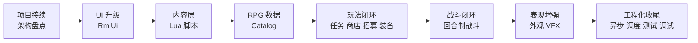

# TinyFarmRPG 课程大纲草案

> 课程定位：承接上一套「OpenGL 与迷你农场」教程，从已经完成的 TinyFarm 农场项目出发，讲解如何在不推倒重来的前提下，把一个 2D 农场经营 Demo 扩展成具备剧情、任务、商店、队伍、装备与回合制战斗闭环的 JRPG 教学项目。

## 课程原则

- **不从零开始**：默认学生已经完成或理解上一套 TinyFarm 教程，具备 C++20、ECS、Scene、Tiled、OpenGL 渲染、资源系统、存档和基础 UI 的上下文。
- **架构优先**：以模块边界、数据流、事件流、系统拆分、调试方法为主，不逐行讲实现细节。
- **代码细节留阅读清单**：每讲只挑关键类、关键数据结构和关键流程讲透，其余通过文档、源码入口和练习引导学生自读。
- **聚焦新增能力**：上一套已经覆盖的知识点只在需要建立上下文时快速回顾，不重复展开。
- **面向可扩展项目**：强调 engine/game 分层、领域服务、脚本内容层、数据目录和测试，让学生理解如何让小型项目继续长大。

## 与上一套教程的衔接

上一套「OpenGL 与迷你农场」已经覆盖：

- CMake 构建、项目运行、资源组织、GoogleTest 基础。
- engine/game 分层、Scene 栈、EnTT ECS、dispatcher 事件系统。
- OpenGL 2D 渲染、SpriteBatch、Y-sort、灯光、泛光、后处理。
- ResourceManager、FreeType/HarfBuzz 文本、MiniAudio 音频。
- 原自研 UIManager、基础 UI 布局、九宫格、UI 预设。
- 空间索引、碰撞解析、玩家移动、相机跟随。
- Tiled 地图加载、EntityBuilder、蓝图、MapManager、WorldState。
- 农场玩法：背包、快捷栏、物品使用、耕种、作物、昼夜、存档。

本套教程只在必要时用一讲或一小节回顾这些内容，主体放在 TinyFarmRPG 新增的架构和玩法闭环上。

## 总体路线

## 阶段总览

| 阶段 | 建议讲次 | 核心主题 | 产出 |
| --- | --- | --- | --- |
| I. 项目接续与架构升级 | L01-L03 | 从 TinyFarm 到 TinyFarmRPG、运行时装配、领域服务 | 建立新项目心智模型 |
| II. 生产 UI 与输入升级 | L04-L06 | RmlUi 接入、覆盖式场景、输入上下文 | 替换自研 UI 的设计路线 |
| III. Lua 内容层 | L07-L09 | ScriptHost、Sol2 绑定、脚本化交互 | NPC/地图/剧情可脚本化 |
| IV. RPG 数据与核心玩法 | L10-L15 | Catalog、任务、商店、队伍、装备、角色成长 | JRPG 探索侧闭环 |
| V. 回合制战斗 | L16-L20 | 战斗领域层、菜单状态机、AI、奖励写回 | 最小可玩的战斗闭环 |
| VI. 表现、性能与工程化 | L21-L25 | 分层外观、VFX、异步预加载、并行调度、测试调试 | 项目级质量收尾 |

## 逐讲大纲

### L01: 从 TinyFarm 到 TinyFarmRPG

**目标**：让学生理解本期不是新项目，而是在上一期代码之上做一次大规模扩展。

**知识点**：
- TinyFarm 已有能力盘点：农场、背包、地图、昼夜、存档、基础交互。
- TinyFarmRPG 新增目标：脚本内容层、RmlUi、JRPG 数据、任务、商店、队伍、装备、战斗。
- 大型增量开发的第一步：先识别可复用底座，再决定新增模块落点。
- 课程阅读方式：架构图、关键链路、阅读清单、源码入口。

**阅读清单**：
- `docs/overview.md`
- 上一套课程目录：`OpenGL 与迷你农场` 的 part-02、part-07、part-08、part-26、part-32

### L02: 新的运行时装配与模块边界

**目标**：理解 `GameScene` 不再直接承担所有组装职责，而是通过 runtime/service/factory 分层组织复杂系统。

**知识点**：
- `GameRuntimeAssembler`、`RuntimeServiceFactory`、`SystemFactory`、`SystemBundle` 的职责。
- `ContentCatalogLoader` 和 `RpgCatalogLoader` 如何集中加载内容数据。
- `ServiceLookup` 如何避免场景层到处传递零散指针。
- 为什么功能变多后需要从“直接 new 系统”升级到声明式装配。

**源码入口**：
- `src/game/runtime/game_runtime_assembler.*`
- `src/game/runtime/runtime_service_factory.*`
- `src/game/runtime/system_factory.*`
- `src/game/runtime/service_lookup.h`

### L03: 领域服务与命令/事件边界

**目标**：解释为什么背包、装备、任务、商店等写入操作要集中到领域服务。

**知识点**：
- ECS 系统、UI、Lua、存档都可能触发玩法状态变化，必须统一规则入口。
- `InventoryDomainService`、`EquipmentDomainService`、`QuestTurnInService`、`ShopTransactionService` 的共同模式。
- command/event 与 domain service 的分工：请求、校验、写入、反馈。
- 原子写入与 preflight 思路。

**源码入口**：
- `src/game/domain/*`
- `src/game/defs/commands_*.h`
- `src/game/defs/events_*.h`

### L04: 从自研 UIManager 到 RmlUi

**目标**：理解为什么项目从上一套自研 UI 系统升级到 RmlUi，以及接入点在哪里。

**知识点**：
- RML/RCSS 与传统 C++ UI 对象树的区别。
- `RmlUiRuntime`、`RmlDocumentController`、`RmlDataBridge`、OpenGL render interface。
- UI 文件目录：`ui/rmlui/theme`、`ui/rmlui/hud`、`ui/rmlui/scenes`、`ui/rmlui/overlay`。
- RmlUi 与现有渲染管线、资源系统、字体系统的关系。

**阅读清单**：
- `docs/engine/ui_framework.md`
- `docs/engine/layout-contract.md`
- `learn/lectures/rmlui/syllabus.md`

### L05: 覆盖式 UI 场景设计

**目标**：讲清楚 Inventory/Shop/Quest/Recruit/Battle 等界面为什么以 Scene 叠加，而不是塞进 GameScene。

**知识点**：
- Scene 栈复用：底层探索场景保持渲染，栈顶菜单独占 update。
- 弹出场景与 HUD 文档的生命周期管理。
- Pause、Save、Inventory、Shop、QuestOffer、RecruitOffer、Battle 的共同形态。
- UI 场景如何通过 event 请求关闭、提交交易或写回状态。

**源码入口**：
- `src/game/scene/*_scene.*`
- `ui/rmlui/scenes/*.rml`
- `ui/rmlui/scenes/*.rcss`

### L06: 输入上下文与菜单导航

**目标**：解释新增菜单、对话、战斗后，输入系统为何必须支持上下文、缓冲与 UI 路由。

**知识点**：
- Gameplay/Menu/Dialogue/Battle 输入上下文。
- action binding、输入 glyph、重绑定、输入缓冲。
- RmlUi/ImGui/Gameplay 的事件转发顺序。
- 为什么 Battle 菜单不直接依赖 RmlUi 原生方向键导航。

**阅读清单**：
- `docs/engine/input_system.md`
- `tests/engine/input/*`
- `tests/game/input_context_scene_stack_test.cpp`

### L07: Lua 内容层总览

**目标**：建立“Lua 写内容，C++ 守规则”的核心边界。

**知识点**：
- `scripts/bootstrap.lua` 作为内容组合根。
- `scripts/lib`、`scripts/maps`、`scripts/npcs`、`scripts/quests` 的目录约定。
- `tf.*` API 能力地图：dialogue、quest、party、shop、battle、map、state、command。
- 脚本顶层幂等、持久状态走 `tf.state`。

**阅读清单**：
- `docs/tutorial/lua-content-authoring.md`
- `scripts/bootstrap.lua`
- `scripts/npcs/*.lua`
- `scripts/quests/*.lua`

### L08: ScriptHost 与 Sol2 绑定

**目标**：讲解 C++ 如何嵌入 Lua，并把安全、稳定的 API 暴露给内容脚本。

**知识点**：
- `ScriptHost` 生命周期、模块加载、错误处理。
- `ScriptEntityHandle`：脚本侧不要直接保存裸 ECS 实体。
- Sol2 绑定工具、模块安装、API 命名空间。
- 安全边界：脚本不能写文件、不能执行系统命令、不能直接改 ECS。

**源码入口**：
- `src/engine/script/*`
- `src/game/script/tinyfarm_script_module.*`
- `src/game/script/script_game_api.*`

### L09: 脚本事件桥与 Tiled 接入

**目标**：解释地图对象、NPC、区域触发器如何把事件交给 Lua 认领。

**知识点**：
- `scripted_interaction=true` 的含义。
- Tiled 属性：`actor_id`、`script_event`、`script_once_key`、`zone_id`。
- `ScriptEventBridge` 如何生成 interact/map/zone/battle payload。
- 一次性宝箱、首次进图提示、剧情传送、剧情战入口。

**源码入口**：
- `src/game/script/script_event_bridge.*`
- `src/game/component/script_*`
- `src/game/system/zone_trigger_system.*`
- `scripts/maps/home_exterior.lua`

### L10: RPG Catalog 与静态规则数据

**目标**：讲清楚 JRPG 规则为什么要集中到 JSON catalog，而不是写死在代码或 Lua 里。

**知识点**：
- `assets/data/rpg/manifest.json` 与 actors/classes/skills/states/equipment/enemies/troops。
- `RpgCatalog` 的拆分加载和引用校验。
- 字符串 id 与 hash id 的并存理由。
- Lua 只选择和触发规则，不临时伪造第二套规则。

**源码入口**：
- `src/game/data/rpg_catalog.*`
- `src/game/data/rpg_data.h`
- `assets/data/rpg/*.json`

### L11: 任务系统

**目标**：实现并理解“接任务 -> 战斗计数 -> 回 NPC 交付 -> 奖励写回”的最小闭环。

**知识点**：
- `QuestCatalog` 与 `QuestLogComponent` 的静态/运行时分离。
- objective progress key 规则。
- `QuestBattleProgressResolver` 如何从战斗结果推进任务。
- `QuestTurnInService` 的 preflight 和奖励写回。
- 脚本化任务 NPC 与 C++ fallback 的关系。

**阅读清单**：
- `docs/gameplay/quest-system.md`
- `assets/data/quests.json`
- `tests/game/quest_*`

### L12: 商店系统

**目标**：理解 JRPG 商店的静态库存、买卖规则、交易原子性与 UI 状态机。

**知识点**：
- `ShopCatalog`：买入条目按商店隔离，卖出规则全局共享。
- `MerchantComponent` 与地图实例属性。
- `previewBuy/commitBuy`、`previewSell/commitSell`。
- 脚本商人按日夜和任务状态选择 `shop_id`。
- ShopMenuScene 的 Buy/Sell、列表、数量、确认状态。

**阅读清单**：
- `docs/gameplay/shop-system.md`
- `assets/data/shops.json`
- `scripts/npcs/merchant.lua`

### L13: 队伍、招募与休息

**目标**：把单人农场主扩展为 JRPG 队伍，并接入 NPC 招募与休息恢复。

**知识点**：
- `PartyComponent`、`RecruitableComponent`、`ActorIdentityComponent`。
- 招募 offer 场景与脚本化招募对白。
- 已招募角色的地图隐藏或去重。
- `PartyRestService` 如何处理队伍恢复。

**源码入口**：
- `src/game/system/party_recruitment_system.*`
- `src/game/system/recruitment_interaction_system.*`
- `src/game/scene/recruit_offer_scene.*`
- `scripts/npcs/lyria.lua`
- `scripts/npcs/tori.lua`

### L14: 装备与角色成长

**目标**：讲解装备、职业、等级、经验和角色属性如何共同影响战斗单位。

**知识点**：
- actor/class/equipment 的属性来源。
- `EquipmentDomainService` 的装备校验与写入。
- `ActorProgressionService` 的经验、等级、属性规范化。
- InventoryMenu 中 Character/Equipment tab 的数据来源。
- 装备系统如何避免直接改战斗单位，转而在入场时解析快照。

**源码入口**：
- `src/game/domain/equipment_domain_service.*`
- `src/game/domain/actor_progression_service.*`
- `src/game/ui/equipment_tab_content.*`
- `src/game/scene/inventory_menu_character_panel.*`

### L15: 地图遭遇、剧情战与探索侧战斗入口

**目标**：连接探索地图与战斗场景，让敌人遭遇、区域触发和 Lua 剧情战都能进入同一个战斗入口。

**知识点**：
- `EnemyEncounterComponent` 与地图对象配置。
- `BattleStartCommand` / `BattleEndedEvent`。
- `GameScene` 如何 push `BattleScene`，并在结束后写回探索态。
- Lua `tf.battle.start(troop_id, opts)` 的适用场景。

**源码入口**：
- `src/game/system/enemy_encounter_system.*`
- `src/game/defs/commands_battle.h`
- `src/game/defs/events_battle.h`
- `src/game/scene/game_scene_battle_settlement.*`

### L16: 回合制战斗领域核心

**目标**：先不看 UI，单独讲清楚战斗规则的纯逻辑层。

**知识点**：
- `TurnCore`：速度排序、行动推进、死亡跳过、胜负判定。
- `BattleSession`：表现层进入战斗逻辑的唯一入口。
- `BattleUnit` 与战斗运行时状态。
- 为什么战斗核心不依赖 ECS UI。

**阅读清单**：
- `docs/gameplay/turn-based-battle.md`
- `src/game/battle/turn_core.*`
- `src/game/battle/battle_session.*`
- `tests/game/battle/turn_core_test.cpp`

### L17: 战斗动作解析

**目标**：讲解 Attack/Skill/Item/Guard/Escape 如何被统一建模和结算。

**知识点**：
- `BattleAction`、scope、target、resource cost。
- `BattleActionResolver` 与 `BattleFormulaEvaluator`。
- 技能、物品、状态、恢复、伤害的 catalog 驱动。
- 战斗物品使用的是运行时副本，结束后再写回真实背包。

**源码入口**：
- `src/game/battle/battle_action_resolver.*`
- `src/game/battle/battle_formula_evaluator.*`
- `src/game/data/rpg_catalog_skills.cpp`
- `tests/game/battle/battle_action_resolver_test.cpp`

### L18: BattleScene 菜单状态机

**目标**：理解战斗 UI 如何把玩家输入转换成合法 `BattleAction`。

**知识点**：
- `FlowState` 与 `MenuState` 的双层状态机。
- MainMenu、SkillList、ItemList、TargetSelect。
- 鼠标点击与键盘/手柄菜单导航双路径。
- RmlUi data model 与程序化 focus 同步。
- cursor memory、cancel/back 规则。

**源码入口**：
- `src/game/scene/battle_scene.*`
- `src/game/scene/battle_input_router.*`
- `src/game/scene/battle_menu_model.*`
- `ui/rmlui/scenes/battle.rml`

### L19: 敌方 AI 与战斗表现

**目标**：讲解敌方行动规划和 side-view 战斗表现如何与领域层解耦。

**知识点**：
- `BattleAiPlanner`：按 rating 选技、scope 选目标、恢复意图检测。
- side-view 精灵、站位、战斗专用 registry。
- 伤害飘字、敌方 HP 条、动作展示计划。
- 表现只消费 session 返回的结果快照，不修改规则真相。

**源码入口**：
- `src/game/battle/battle_ai_planner.*`
- `src/game/scene/battle_action_presentation_plan.*`
- `src/game/scene/battle_animation_director.*`
- `src/game/scene/battle_damage_popup_controller.*`
- `src/game/scene/battle_enemy_hp_bar_controller.*`

### L20: 战斗结算、奖励与探索态写回

**目标**：完成战斗闭环，理解胜利奖励、任务进度、库存消耗如何回到 GameScene。

**知识点**：
- `BattleRewardResolver`：金币、掉落、经验。
- `BattleEndedEvent` 与 GameScene 结算。
- 背包/钱包/任务/角色成长的写回顺序。
- 失败、逃跑、胜利三类 outcome 的不同处理。

**源码入口**：
- `src/game/battle/battle_reward_resolver.*`
- `src/game/scene/game_scene_battle_settlement.*`
- `tests/game/game_scene_battle_reward_writeback_test.cpp`
- `tests/game/quest_battle_progress_resolver_test.cpp`

### L21: 分层角色外观与头像

**目标**：讲解如何把角色从单一 sprite 升级为可组合、可换装、可生成头像的外观系统。

**知识点**：
- `AppearanceCatalog`、profile、slot、gender、layer order。
- Game 层 `AppearanceComponent` 到 Engine 层 `LayeredSpriteComponent` 的桥接。
- 预计算布局缓存，渲染帧内只做采样。
- 战斗外观快照与 portrait builder。

**阅读清单**：
- `docs/gameplay/layered-appearance.md`
- `assets/data/appearance_catalog.json`
- `src/game/system/appearance_system.*`
- `src/game/ui/appearance_portrait_builder.*`

### L22: Effekseer 与 VFX 管线

**目标**：让学生理解第三方特效库如何通过抽象后端接入引擎，而不是污染游戏逻辑。

**知识点**：
- `VfxBackend`、`EffekseerBackend`、`NullVfxBackend`。
- `VfxService` 请求队列与帧同步。
- World/Overlay 双通道渲染。
- `PlayVfxCommand` 和 `VfxBridgeSystem`。

**阅读清单**：
- `docs/engine/vfx_and_effekseer.md`
- `assets/data/vfx_catalog.json`
- `src/engine/vfx/*`

### L23: 异步地图预加载与主线程命令队列

**目标**：讲解项目如何用多线程减少切图卡顿，同时遵守 OpenGL 主线程限制。

**知识点**：
- Worker 线程做 I/O、JSON 解析、图片 CPU 解码。
- 主线程命令队列负责 GPU 上传。
- generation 防止过期结果污染。
- owner thread 契约、析构安全顺序。

**阅读清单**：
- `docs/game/async_preload_pipeline.md`
- `src/engine/async/*`
- `src/engine/loader/level_preprocess_service.*`
- `src/engine/resource/image_decode_service.*`

### L24: SystemScheduler 与并行岛

**目标**：把上一套 GameScene 中的固定顺序系统更新，升级为可观察、可裁剪、可并行的调度器。

**知识点**：
- `SchedulerStage`、`GameMode`、transition gate。
- `ParallelWaveScheduler` 与 `SystemTaskDecl`。
- 用资源读写声明推导并行 wave。
- 哪些系统适合并行，哪些必须顺序执行。

**阅读清单**：
- `docs/game/system_scheduler.md`
- `src/game/runtime/system_scheduler.*`
- `src/engine/system/parallel_wave_scheduler.*`
- `tools/scheduler_dot_dump`

### L25: 调试、测试与课程收尾

**目标**：总结 TinyFarmRPG 的工程化保护网，让学生知道如何继续扩展而不把项目改散。

**知识点**：
- Battle/Quest/Shop/Scheduler/RmlUi/VFX 调试面板。
- Catalog validation、脚本测试、UI smoke、battle tester。
- Save migrator 与用户设置。
- 如何为新增玩法选择测试层级：domain test、system test、scene smoke、source guard。
- 后续可扩展方向：更多 objective 类型、限量库存、状态系统、剧情过场、地图事件链。

**源码入口**：
- `src/game/debug/*`
- `tests/game/script_*`
- `tests/game/battle/*`
- `tests/game/rmlui_architecture_regression_test.cpp`
- `docs/testing/*`

## 推荐作业设计

| 作业 | 对应讲次 | 内容 |
| --- | --- | --- |
| 新增一个脚本化 NPC | L07-L09 | 在 Tiled 标记 `scripted_interaction=true`，用 Lua 写多段对白和一次性状态 |
| 新增一个任务 | L10-L11 | 写 `quests.json` objective/reward，并用 Lua 编写 NPC 分支 |
| 新增一个商店预设 | L12 | 添加 `shop_id`，让商人在不同任务状态下切换库存 |
| 新增一个可招募角色 | L13-L14 | 配置 actor/class/equipment，写招募对白，验证入队和装备页 |
| 新增一场剧情战 | L15-L20 | 配置 troop、技能、敌人，并由 Lua 区域触发战斗 |
| 新增一个外观部件 | L21 | 扩展 `appearance_catalog.json` 并在换装界面验证 |
| 新增一个 VFX 播放点 | L22 | 配置 `vfx_catalog.json`，通过 command 在战斗或地图事件中播放 |
| 为一个领域服务补测试 | L25 | 选择 Quest/Shop/Equipment 任一服务补充失败路径测试 |

## 备选章节

如果课程容量允许，可以追加以下专题；如果容量紧张，则作为番外或阅读材料：

- 本地化与 UI 文案：`LocalizationService`、RmlUi 文本替换、i18n key parity。
- Options 与用户设置：全局偏好、音量、战斗动画速度、UI 字号策略。
- Save schema 迁移：`SaveMigrator`、schema v7、向后兼容和未上线项目的取舍。
- RmlUi 专项课：可引用 `learn/lectures/rmlui`，不在主线重复讲完整 RmlUi 基础。
- 多线程专项课：可引用 `docs/tutorial/multi-thread`，主线只讲项目中用到的模式。

## 首轮课程长度建议

建议主线控制在 **25 讲** 左右：

- L01-L03 用来建立项目续作心智模型。
- L04-L09 解决 UI 与内容层，这是本期最关键的架构差异。
- L10-L15 完成探索侧 JRPG 玩法闭环。
- L16-L20 集中讲回合制战斗，避免战斗内容分散到各处。
- L21-L25 做表现增强与工程化收尾。

如果要压缩到 18-20 讲，可合并：

- L02 + L03：运行时装配与领域服务。
- L05 + L06：覆盖式 UI 与输入上下文。
- L13 + L14：队伍、招募、装备与成长。
- L19 + L20：战斗表现、AI 与结算。
- L23 + L24：异步预加载与并行调度。
