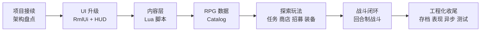

# TinyFarmRPG 课程大纲草案

> 课程定位：承接上一套「OpenGL 与迷你农场」教程，从已经完成的 TinyFarm 农场项目出发，讲解如何在不推倒重来的前提下，把一个 2D 农场经营 Demo 扩展成具备剧情、任务、商店、队伍、装备与回合制战斗闭环的 JRPG 教学项目。

## 课程原则

- **不从零开始**：默认学生已经完成或理解上一套 TinyFarm 教程，具备 C++20、ECS、Scene、Tiled、OpenGL 渲染、资源系统、存档和基础 UI 的上下文。
- **架构优先**：以模块边界、数据流、事件流、系统拆分、调试方法为主，不逐行讲实现细节。
- **代码细节留阅读清单**：每讲只挑关键类、关键数据结构和关键流程讲透，其余通过文档、源码入口和练习引导学生自读。
- **聚焦新增能力**：上一套已经覆盖的知识点只在需要建立上下文时快速回顾，不重复展开。
- **面向可扩展项目**：强调 engine/game 分层、领域服务、脚本内容层、数据目录和测试，让学生理解如何让小型项目继续长大。
- **先看再讲**：架构类讲次尽量在开头给可运行的演示或调试视角，避免"纯架构图"过载。
- **外链子教程**：RmlUi、多线程这两块本身已有独立子教程（`learn/lectures/rmlui/`、`docs/tutorial/multi-thread/`），主线只讲"项目里如何用"，原理细节外链。

## 与上一套教程的衔接

上一套「OpenGL 与迷你农场」已经覆盖：

- CMake 构建、项目运行、资源组织、GoogleTest 基础。
- engine/game 分层、Scene 栈、EnTT ECS、dispatcher 事件系统。
- OpenGL 2D 渲染、SpriteBatch、Y-sort、灯光、泛光、后处理。
- ResourceManager、FreeType/HarfBuzz 文本、MiniAudio 音频。
- 原自研 UIManager、基础 UI 布局、九宫格、UI 预设。
- 空间索引、碰撞解析、玩家移动、相机跟随。
- Tiled 地图加载、EntityBuilder、蓝图、MapManager、WorldState。
- 农场玩法：背包、快捷栏、物品使用、耕种、作物、昼夜、存档。

本套教程只在必要时用一讲或一小节回顾这些内容，主体放在 TinyFarmRPG 新增的架构和玩法闭环上。

> 上一套课程的具体章节号在引用前需核对（教程入口：https://cppgamedev.top/courses/opengl-tiny-farm ；源码：https://github.com/WispSnow/TinyFarm ），写明 `partXX` 时请用最终发布的章节编号。

## 总体路线

## 阶段总览

| 阶段 | 建议讲次 | 核心主题 | 产出 |
| --- | --- | --- | --- |
| I. 项目接续与架构基础 | L01-L03 | 项目演示与盘点、运行时装配、领域服务概览 | 建立新项目心智模型 |
| II. 生产 UI 与输入升级 | L04-L06 | RmlUi 接入、HUD 与覆盖式场景、输入上下文 | 替换自研 UI 的设计路线 |
| III. Lua 内容层 | L07-L09 | ScriptHost、Sol2 绑定、脚本事件桥 | NPC/地图/剧情可脚本化 |
| IV. RPG 数据与探索玩法 | L10-L15 | Catalog、任务、商店、队伍、装备成长、剧情战入口 | JRPG 探索侧闭环 |
| V. 回合制战斗 | L16-L21 | 战斗领域层、动作解析、菜单状态机、AI、表现、结算 | 最小可玩的战斗闭环 |
| VI. 工程化收尾 | L22-L27 | 存档迁移、分层外观、VFX、异步预加载、并行调度、测试调试 | 项目级质量收尾 |

总计 **27 讲**（备选 22 讲压缩方案见末节）。

## 逐讲大纲

> 每讲采用统一三段式：**知识点 / 阅读清单 / 源码入口**。架构类讲次额外提供"开课演示"建议，避免开篇过抽象。

---

### Stage I — 项目接续与架构基础

#### L01: 从 TinyFarm 到 TinyFarmRPG — 项目演示与盘点

**目标**：让学生在第一节课就跑起完整 demo，并对照上一期 TinyFarm 看见"加了什么"，再回到架构地图。

**开课演示**：现场启动 TinyFarmRPG → 进游戏 → 触发一次对话 → 打开背包 → 与商人交易 → 接任务 → 触发一场遭遇战 → 胜利结算。学生看到的所有新元素都会在后续讲次中拆开。

**知识点**：
- TinyFarm 已有能力盘点：农场、背包、地图、昼夜、存档、基础交互。
- TinyFarmRPG 新增目标：RmlUi、脚本内容层、JRPG 数据、任务、商店、队伍、装备、战斗、分层外观、VFX、异步预加载。
- 大型增量开发的第一步：先识别可复用底座，再决定新增模块落点。
- 课程阅读方式：架构图、关键链路、阅读清单、源码入口。
- 项目目录结构速览：`src/engine` vs `src/game`、`assets/data`、`scripts/`、`ui/rmlui/`。

**阅读清单**：
- `docs/overview.md`
- 上一套课程关键章节（章节号需对照课程入口确认）

**源码入口**：
- `src/game/game_entry.*`
- `src/engine/core/*`

---

#### L02: 新的运行时装配与模块边界

**目标**：理解 `GameScene` 不再直接承担所有组装职责，而是通过 runtime/service/factory 分层组织复杂系统。

**开课演示**：在 `GameRuntimeAssembler` 设断点，观察 catalogs / services / systems 的注册顺序。

**知识点**：
- `GameRuntimeAssembler`、`RuntimeServiceFactory`、`SystemFactory`、`SystemBundle` 的职责分工。
- `ContentCatalogLoader` 和 `RpgCatalogLoader` 如何集中加载内容数据。
- `ServiceLookup` 如何避免场景层到处传递零散指针（与上一套教程中"手动传 Context 引用"对比）。
- Blueprint / EntityFactory 在新项目中的位置（详深留到 L09）。
- 为什么功能变多后需要从"直接 new 系统"升级到声明式装配。

**阅读清单**：
- `docs/game/runtime-assembly.md`
- `docs/game/game_scene.md`

**源码入口**：
- `src/game/runtime/game_runtime_assembler.*`
- `src/game/runtime/runtime_service_factory.*`
- `src/game/runtime/system_factory.*`
- `src/game/runtime/service_lookup.h`
- `src/game/factory/blueprint_manager.*`

---

#### L03: 领域服务概览与命令/事件边界

**目标**：让学生先建立"写入操作集中到领域服务"的直觉印象，记住这是后续所有玩法讲次的共同模式，**不展开**单个服务的实现细节（留到 L11/L12/L14 各自的讲次里再深讲）。

**知识点**：
- ECS 系统、UI、Lua、存档都可能触发玩法状态变化，必须统一规则入口。
- 领域服务的共同模式：preflight 校验 → 原子写入 → 反馈事件。
- command / event 与 domain service 的三角分工：请求由 command 进入，规则由 service 校验写入，结果由 event 通告 UI 与脚本。
- `src/game/domain/` 全景：Inventory / Equipment / Quest / Shop / PartyRest / ActorProgression / QuestBattleProgress 的存在意义。具体实现各自留到对应讲次。
- 领域服务与测试：每个服务都有一组失败路径测试，这是新增玩法的最低安全网。

**阅读清单**：
- `docs/game/runtime-assembly.md`（领域服务章节）

**源码入口**：
- `src/game/domain/inventory_domain_service.*`（**仅作为模板**通览一遍）
- `src/game/defs/commands_*.h`
- `src/game/defs/events_*.h`

---

### Stage II — 生产 UI 与输入升级

#### L04: 从自研 UIManager 到 RmlUi

**目标**：理解为什么项目从上一套自研 UI 系统升级到 RmlUi，以及接入点在哪里。**RmlUi 自身的 RML/RCSS 语法不在主线展开，外链到子教程**。

**知识点**：
- 为什么换 RmlUi：声明式 UI、热重载、CSS 风格样式、内置数据绑定的工程价值。
- 接入层：`RmlUiRuntime`、`RmlDocumentController`、`RmlDataBridge`、OpenGL render interface 与现有渲染管线的关系。
- 资源系统与 RmlUi 的接驳：图像加载、字体加载、热重载。
- UI 文件目录约定：`ui/rmlui/theme`、`ui/rmlui/hud`、`ui/rmlui/scenes`、`ui/rmlui/overlay`、`ui/rmlui/learn`。
- 何时绕过 RmlUi 直接用 ImGui（调试面板）。

**阅读清单**：
- `docs/engine/ui_framework.md`
- `docs/engine/layout-contract.md`
- **RmlUi 语法子教程入口**：`learn/lectures/rmlui/syllabus.md`（L01-L11 基础与视觉，L12-L15 JRPG 实战）

**源码入口**：
- `src/engine/ui/*`（重点：runtime、data bridge、document controller）
- `ui/rmlui/theme/*.rcss`

---

#### L05: HUD 与覆盖式 UI 场景的生命周期

**目标**：讲清楚 HUD（常驻）与 Inventory/Shop/Quest/Recruit/Battle 等弹出场景（覆盖式）这两种 UI 形态如何并存，以及它们与 `GameScene`、`SceneManager` 的关系。

**知识点**：
- HUD 文档生命周期：随 `GameScene` 入场创建、退场销毁，update 永不被覆盖式场景剥夺。
- 覆盖式 Scene 复用：底层探索场景保持渲染，栈顶菜单独占 update 与输入。
- 文档显隐 vs Scene push/pop 的取舍。
- HUD 元素全景：`hotbar`、`dialogue_box`、`item_tooltip`、`time_clock`、`floating_notice`、`game_input_prompt_overlay`。
- 覆盖式 Scene 全景：Pause、Save、Inventory、Shop、QuestOffer、RecruitOffer、DialogueChoice、Rest、AppearanceCustomize、Battle。
- UI 场景如何通过 event 请求关闭、提交交易或写回状态。
- `GameMode` 在 UI 调度中的隐藏作用（详深留到 L26）。

**阅读清单**：
- `docs/game/ui-scenes.md`
- `docs/engine/scenes.md`

**源码入口**：
- `src/game/scene/*_scene.*`
- `src/game/ui/*`（HUD 控制器）
- `ui/rmlui/hud/*.rml`
- `ui/rmlui/scenes/*.rml`

---

#### L06: 输入上下文与菜单导航

**目标**：解释新增菜单、对话、战斗后，输入系统为何必须支持上下文、缓冲与 UI 路由。

**知识点**：
- Gameplay / Menu / Dialogue / Battle 输入上下文及切换规则。
- action binding、输入 glyph、重绑定、输入缓冲。
- RmlUi / ImGui / Gameplay 的事件转发顺序。
- 为什么 Battle 菜单不直接依赖 RmlUi 原生方向键导航，而要走自己的菜单模型（铺垫 L18）。

**阅读清单**：
- `docs/engine/input_system.md`
- `tests/engine/input/*`
- `tests/game/input_context_scene_stack_test.cpp`

**源码入口**：
- `src/engine/input/*`
- `src/game/scene/battle_input_router.*`（仅作示例，详深在 L18）

---

### Stage III — Lua 内容层

#### L07: Lua 内容层总览

**目标**：建立"Lua 写内容，C++ 守规则"的核心边界，理解 `scripts/` 目录组织。

**知识点**：
- `scripts/bootstrap.lua` 作为内容组合根。
- `scripts/lib`、`scripts/maps`、`scripts/npcs`、`scripts/quests` 的目录约定。
- `tf.*` API 能力地图：dialogue、quest、party、shop、battle、map、state、command、time、entity、event。
- **关键规约**（应当出现在目标里，而不是埋在知识点中）：
  - 脚本顶层幂等：读档或重进 `GameScene` 会重新加载 `bootstrap.lua`。
  - 持久状态走 `tf.state` 或 `lib.once`，不要依赖 Lua module-local 变量。
- 何时该写 Lua、何时该写 C++：内容编排 vs 规则真相的判别准则。

**阅读清单**：
- `docs/tutorial/lua-content-authoring.md`
- `scripts/bootstrap.lua`
- `scripts/lib/state.lua`、`scripts/lib/once.lua`

**源码入口**：
- `src/game/script/script_state.h`
- `src/game/script/tinyfarm_script_module.*`（仅看模块组织，绑定细节留 L08）

---

#### L08: ScriptHost 与 Sol2 绑定

**目标**：讲解 C++ 如何嵌入 Lua，并把安全、稳定的 API 暴露给内容脚本。

**知识点**：
- `ScriptHost` 生命周期、模块加载、错误处理与日志。
- `ScriptEntityHandle`：脚本侧不要直接保存裸 ECS 实体，句柄校验机制。
- Sol2 绑定工具、模块安装、`tf.*` 命名空间组织。
- 安全边界：脚本不能写文件、不能执行系统命令、不能直接改 ECS。
- 与 C++ 测试的边界：`tests/game/script_*` 怎么测脚本绑定。

**阅读清单**：
- `docs/tutorial/lua-binding-guide.md`

**源码入口**：
- `src/engine/script/*`
- `src/game/script/script_game_api.*`
- `src/game/script/tinyfarm_script_module.*`

---

#### L09: 脚本事件桥与 Tiled 接入

**目标**：解释地图对象、NPC、区域触发器、对话选项如何把事件交给 Lua 认领，并讲清 Blueprint / EntityFactory 在脚本化实体上的角色。

**知识点**：
- `scripted_interaction=true` 的含义与默认 C++ 交互早退规则。
- Tiled 属性约定：`actor_id`、`script_event`、`script_once_key`、`zone_id`。
- `ScriptEventBridge` 如何生成 interact / map / zone / battle payload。
- `DialogueChoiceScene` 与脚本选项的对接（Lua 推选项 → C++ 弹场景 → 选择事件回到 Lua）。
- 典型用例：一次性宝箱、首次进图提示、剧情传送、剧情战入口、招募 NPC 隐藏。
- Blueprint / EntityFactory：脚本化 NPC 与商人在 blueprint 中怎么标注。

**阅读清单**：
- `docs/game/interaction_and_dialogue.md`
- `docs/game/blueprints.md`

**源码入口**：
- `src/game/script/script_event_bridge.*`
- `src/game/component/script_*`
- `src/game/system/zone_trigger_system.*`
- `src/game/scene/dialogue_choice_scene.*`
- `scripts/maps/home_exterior.lua`、`scripts/npcs/greeter.lua`

---

### Stage IV — RPG 数据与探索玩法

#### L10: 数据目录全景与 RPG Catalog

**目标**：讲清楚为什么 JRPG 规则要集中到 JSON catalog，以及项目里所有 catalog 的整体地图（不只是 RPG）。

**知识点**：
- 项目所有 catalog 一览：`ItemCatalog`、`AppearanceCatalog`、`AudioCueCatalog`、`QuestCatalog`、`ShopCatalog`、`RpgCatalog`，分别管什么。
- `assets/data/rpg/manifest.json` 与 actors / classes / skills / states / equipment / enemies / troops。
- `RpgCatalog` 的拆分加载和引用校验。
- 字符串 id 与 hash id 的并存理由（性能 vs 可读性）。
- Lua 只选择和触发规则，不临时伪造第二套规则。
- catalog 校验工具：`tools/rpg_importer`、catalog validation 测试。

**阅读清单**：
- `docs/game/data-catalogs.md`
- `assets/data/rpg/*.json`

**源码入口**：
- `src/game/data/rpg_catalog.*`
- `src/game/data/rpg_data.h`
- `src/game/data/audio_cue_catalog.*`

---

#### L11: 任务系统（领域服务首次深讲）

**目标**：实现"接任务 → 战斗计数 → 回 NPC 交付 → 奖励写回"的最小闭环，借此把 L03 留下的领域服务模式讲透。

**知识点**：
- `QuestCatalog` 与 `QuestLogComponent` 的静态 / 运行时分离。
- objective progress key 规则与 `QuestBattleProgressResolver` 如何从战斗结果推进任务（铺垫 L21）。
- `QuestTurnInService` 的 preflight、原子写入与奖励事件回流，作为**领域服务的样板**详细拆解。
- 脚本化任务 NPC 与 C++ fallback 的协作。
- 任务系统的测试层级：domain test（service）、system test（流程）、scene smoke（UI）。

**阅读清单**：
- `docs/gameplay/quest-system.md`
- `assets/data/quests.json`
- `tests/game/quest_*`

**源码入口**：
- `src/game/domain/quest_turn_in_service.*`
- `src/game/domain/quest_log_ops.*`
- `src/game/scene/quest_offer_scene.*`
- `scripts/quests/*.lua`

---

#### L12: 商店系统

**目标**：理解 JRPG 商店的静态库存、买卖规则、交易原子性与 UI 状态机。

**知识点**：
- `ShopCatalog`：买入条目按商店隔离，卖出规则全局共享。
- `MerchantComponent` 与地图实例属性。
- `previewBuy/commitBuy`、`previewSell/commitSell` 与 `ShopTransactionService` 的原子性。
- 脚本商人按日夜和任务状态选择 `shop_id`（呼应 L07 的内容/规则边界）。
- ShopMenuScene 的 Buy/Sell、列表、数量、确认状态机。

**阅读清单**：
- `docs/gameplay/shop-system.md`
- `assets/data/shops.json`
- `scripts/npcs/merchant.lua`

**源码入口**：
- `src/game/domain/shop_transaction_service.*`
- `src/game/scene/shop_menu_scene.*`
- `src/game/scene/shop_trade_list_builder.*`

---

#### L13: 队伍与招募

**目标**：把单人农场主扩展为 JRPG 队伍，并接入 NPC 招募流程。

**知识点**：
- `PartyComponent`、`RecruitableComponent`、`ActorIdentityComponent` 的职责划分。
- 招募 offer 场景与脚本化招募对白。
- 已招募角色的地图隐藏或去重。
- 招募事件流：脚本请求 → C++ 校验 → 入队事件 → UI / 存档同步。

**阅读清单**：
- `docs/gameplay/party-equipment-rest-recruitment.md`（招募章节）

**源码入口**：
- `src/game/system/party_recruitment_system.*`
- `src/game/system/recruitment_interaction_system.*`
- `src/game/scene/recruit_offer_scene.*`
- `scripts/npcs/lyria.lua`、`scripts/npcs/tori.lua`

---

#### L14: 装备、成长与休息

**目标**：讲解装备、职业、等级、经验、属性如何共同决定战斗单位；并完成休息恢复，把队伍持久状态闭合。

**知识点**：
- actor / class / equipment 的属性来源与合成顺序。
- `EquipmentDomainService` 的装备校验与写入。
- `ActorProgressionService` 的经验、等级、属性规范化。
- `PartyRestService` 如何处理队伍恢复（HP/MP/状态清除）。
- InventoryMenu 中 Character / Equipment tab 的数据来源。
- **关键设计**：装备系统不直接改战斗单位，战斗入场时通过 `actor_stats_resolver` 解析快照（铺垫 L16/L17）。

**阅读清单**：
- `docs/gameplay/party-equipment-rest-recruitment.md`（装备/休息章节）

**源码入口**：
- `src/game/domain/equipment_domain_service.*`
- `src/game/domain/actor_progression_service.*`
- `src/game/domain/party_rest_service.*`
- `src/game/ui/equipment_tab_content.*`
- `src/game/scene/inventory_menu_character_panel.*`
- `src/game/scene/rest_dialog_scene.*`

---

#### L15: 探索↔战斗的过渡 — 遭遇、剧情战与 GameMode

**目标**：连接探索地图与战斗场景，让敌人遭遇、区域触发和 Lua 剧情战都能进入同一个战斗入口；首次引入 `GameMode` 的概念。

**知识点**：
- `EnemyEncounterComponent` 与地图对象配置。
- `BattleStartCommand` / `BattleEndedEvent` 的契约。
- `GameScene` 如何 push `BattleScene`，并在结束后写回探索态（先讲框架，结算细节留 L21）。
- Lua `tf.battle.start(troop_id, opts)` 的适用场景与限制。
- `GameMode`：Exploration / Battle / Menu 切换如何影响 SystemScheduler、Audio、Input（详深留 L26）。

**阅读清单**：
- `docs/gameplay/turn-based-battle.md`（入口章节）

**源码入口**：
- `src/game/system/enemy_encounter_system.*`
- `src/game/defs/commands_battle.h`
- `src/game/defs/events_battle.h`
- `src/game/runtime/game_mode.h`
- `src/game/scene/game_scene_battle_settlement.*`（仅入口部分）

---

### Stage V — 回合制战斗

#### L16: 回合制战斗领域核心

**目标**：先不看 UI，单独讲清楚战斗规则的纯逻辑层。

**知识点**：
- `TurnCore`：速度排序、行动推进、死亡跳过、胜负判定。
- `BattleSession`：表现层进入战斗逻辑的唯一入口，会话级状态。
- `BattleUnit` 与战斗运行时状态（与持久 actor 的关系：入场快照、出场写回）。
- `ActorStatsResolver` 如何把 actor + class + equipment 合成战斗属性。
- 为什么战斗核心不依赖 ECS UI（便于单元测试与可移植）。

**阅读清单**：
- `docs/gameplay/turn-based-battle.md`（核心层章节）
- `tests/game/battle/turn_core_test.cpp`

**源码入口**：
- `src/game/battle/turn_core.*`
- `src/game/battle/battle_session.*`
- `src/game/battle/battle_unit_factory.*`
- `src/game/battle/actor_stats_resolver.*`

---

#### L17: 战斗动作解析

**目标**：讲解 Attack / Skill / Item / Guard / Escape 如何被统一建模和结算。

**知识点**：
- `BattleAction`、scope、target、resource cost。
- `BattleActionResolver` 与 `BattleFormulaEvaluator` 的分工。
- 技能、物品、状态、恢复、伤害的 catalog 驱动。
- 战斗物品使用的是运行时副本，结束后再写回真实背包（呼应 L11/L14 的"原子写入"主线）。
- 状态效果（state）与持续伤害的处理。

**阅读清单**：
- `tests/game/battle/battle_action_resolver_test.cpp`

**源码入口**：
- `src/game/battle/battle_action_resolver.*`
- `src/game/battle/battle_formula_evaluator.*`
- `src/game/data/rpg_catalog_skills.cpp`
- `src/game/data/rpg_catalog_states.cpp`

---

#### L18: BattleScene 菜单状态机

**目标**：理解战斗 UI 如何把玩家输入转换成合法 `BattleAction`。

**知识点**：
- `FlowState`（战斗整体流程）与 `MenuState`（菜单内部状态）的双层状态机。
- MainMenu、SkillList、ItemList、TargetSelect 之间的迁移规则。
- 鼠标点击与键盘 / 手柄菜单导航双路径。
- RmlUi data model 与程序化 focus 同步。
- cursor memory、cancel/back 规则（"记住玩家上次选的格子"）。
- 为什么不用 RmlUi 原生方向键导航（呼应 L06）。

**阅读清单**：
- `ui/rmlui/scenes/battle.rml` + `battle.rcss`
- `learn/lectures/rmlui/L14-jrpg-battle.md`（RmlUi 子教程的对应实战课）

**源码入口**：
- `src/game/scene/battle_scene.*`
- `src/game/scene/battle_input_router.*`
- `src/game/scene/battle_menu_model.*`
- `src/game/scene/battle_flow_controller.*`
- `src/game/scene/battle_cursor_memory.h`

---

#### L19: 敌方 AI 与意图

**目标**：讲解敌方行动规划如何与领域层解耦。

**知识点**：
- `BattleAiPlanner`：按 rating 选技、scope 选目标、恢复意图检测。
- 敌方意图与玩家可见性（部分游戏会让玩家预读敌方意图，本项目的取舍）。
- AI 与 troop 配置的关系：哪些行为来自配置、哪些来自硬编码。
- AI 测试策略：用 deterministic seed 跑回归。

**阅读清单**：
- 战斗 AI 相关测试（如 `tests/game/battle/*ai*` 若存在）

**源码入口**：
- `src/game/battle/battle_ai_planner.*`

---

#### L20: 战斗表现与动画导演

**目标**：把战斗"看起来"的部分集中讲清——side-view 精灵、动作播放、飘字、HP 条。

**知识点**：
- side-view 精灵、站位、战斗专用 registry。
- `BattleActionPresentationPlan`：从领域结果生成可播放的步骤序列。
- `BattleAnimationDirector`：把步骤序列翻成具体的动画/音效/特效请求。
- 伤害飘字与敌方 HP 条的状态机。
- 表现只消费 session 返回的结果快照，不修改规则真相（呼应 L16 的"领域不依赖 UI"）。
- 与 VFX 的接口（详深留 L24）。

**阅读清单**：
- `ui/rmlui/theme/battle_enemy_icons.rcss`、`battle_state_icons.rcss`

**源码入口**：
- `src/game/scene/battle_action_presentation_plan.*`
- `src/game/scene/battle_animation_director.*`
- `src/game/scene/battle_damage_popup_controller.*`
- `src/game/scene/battle_enemy_hp_bar_controller.*`
- `src/game/scene/battle_victory_flow_controller.*`

---

#### L21: 战斗结算、奖励与探索态写回

**目标**：完成战斗闭环，理解胜利奖励、任务进度、库存消耗如何回到 GameScene。

**知识点**：
- `BattleRewardResolver`：金币、掉落、经验。
- `BattleEndedEvent` 与 GameScene 结算流程。
- 写回顺序：背包 → 钱包 → 任务进度（`QuestBattleProgressResolver`）→ 角色成长（`ActorProgressionService`）。
- 失败、逃跑、胜利三类 outcome 的不同处理。
- 战斗中物品副本如何与真实背包合并（呼应 L17）。

**阅读清单**：
- `tests/game/game_scene_battle_reward_writeback_test.cpp`
- `tests/game/quest_battle_progress_resolver_test.cpp`

**源码入口**：
- `src/game/battle/battle_reward_resolver.*`
- `src/game/domain/quest_battle_progress_resolver.*`
- `src/game/scene/game_scene_battle_settlement.*`
- `src/game/scene/game_scene_reward_feedback.*`

---

### Stage VI — 工程化收尾

#### L22: 存档系统与 Schema 迁移

**目标**：把存档作为"全项目最大的原子写入"讲一遍，并解释 schema 演化在未上线项目中的取舍。

**知识点**：
- `SaveService` 的写入流程：组件序列化、原子替换、错误恢复。
- 存档涵盖哪些状态：玩家、背包、队伍、任务、商店、世界、脚本状态（`tf.state`）。
- 新增组件 / 服务时，存档需要修改的接入点（checklist）。
- `SaveMigrator` 与 schema 版本号：项目"无需向后兼容"的边界——开发阶段可重置，但 schema bump 仍要走流程。
- save slot 概述与 `SaveSlotSummary` 的快照字段。
- 后台异步保存（呼应 L25 的异步管线）。

**阅读清单**：
- `docs/game/save_and_flow.md`
- `docs/tutorial/multi-thread/09-background-save-io.md`

**源码入口**：
- `src/game/save/save_service.*`
- `src/game/save/save_migrator.*`
- `src/game/save/save_data.*`
- `src/game/scene/save_slot_select_scene.*`

---

#### L23: 分层角色外观与头像

**目标**：讲解如何把角色从单一 sprite 升级为可组合、可换装、可生成头像的外观系统。

**知识点**：
- `AppearanceCatalog`、profile、slot、gender、layer order。
- Game 层 `AppearanceComponent` 到 Engine 层 `LayeredSpriteComponent` 的桥接。
- 预计算布局缓存，渲染帧内只做采样。
- 战斗外观快照与 portrait builder。
- 换装 UI（`AppearanceCustomizeScene`）的数据流。

**阅读清单**：
- `docs/gameplay/layered-appearance.md`
- `assets/data/appearance_catalog.json`

**源码入口**：
- `src/game/system/appearance_system.*`
- `src/game/ui/appearance_portrait_builder.*`
- `src/game/scene/appearance_customize_scene.*`

---

#### L24: Effekseer 与 VFX 管线

**目标**：让学生理解第三方特效库如何通过抽象后端接入引擎，而不是污染游戏逻辑。

**知识点**：
- `VfxBackend`、`EffekseerBackend`、`NullVfxBackend` 的抽象层次。
- `VfxService` 请求队列与帧同步。
- World / Overlay 双通道渲染。
- `PlayVfxCommand` 和 `VfxBridgeSystem` 在战斗、地图事件、UI 里的触发点。
- AudioCue 与 VFX 的联动（呼应 L10）。

**阅读清单**：
- `docs/engine/vfx_and_effekseer.md`
- `assets/data/vfx_catalog.json`

**源码入口**：
- `src/engine/vfx/*`
- `src/game/defs/commands_*.h`（VFX 相关）

---

#### L25: 异步地图预加载与主线程命令队列

**目标**：讲解项目如何用多线程减少切图卡顿，同时遵守 OpenGL 主线程限制。**多线程基础原理外链子教程**。

**知识点**：
- Worker 线程做 I/O、JSON 解析、图片 CPU 解码。
- 主线程命令队列负责 GPU 上传。
- generation 防止过期结果污染。
- owner thread 契约、析构安全顺序。
- 与 `MapManager` 状态机的对接。

**阅读清单**：
- `docs/game/async_preload_pipeline.md`
- `docs/game/map_manager.md`
- **多线程子教程入口**：`docs/tutorial/multi-thread/README.md`（建议先读 03 / 05 / 06 / 07）

**源码入口**：
- `src/engine/async/*`
- `src/engine/loader/level_preprocess_service.*`
- `src/engine/resource/image_decode_service.*`
- `src/game/world/*`

---

#### L26: SystemScheduler 与并行岛

**目标**：把上一套 GameScene 中的固定顺序系统更新，升级为可观察、可裁剪、可并行的调度器。同时把 L05 / L15 提到的 `GameMode` 收口。

**知识点**：
- `SchedulerStage`、`GameMode`、transition gate 的完整模型。
- `ParallelWaveScheduler` 与 `SystemTaskDecl`。
- 用资源读写声明推导并行 wave。
- 哪些系统适合并行，哪些必须顺序执行。
- DOT 调度图导出与可视化排查。

**阅读清单**：
- `docs/game/system_scheduler.md`
- **并行调度原理外链**：`docs/tutorial/multi-thread/10-ecs-parallel-scheduling.md`、`13-entt-multithreading-and-scheduler.md`

**源码入口**：
- `src/game/runtime/system_scheduler.*`
- `src/game/runtime/game_mode.h`
- `src/engine/system/parallel_wave_scheduler.*`
- `tools/scheduler_dot_dump`

---

#### L27: 调试、测试与课程收尾

**目标**：总结 TinyFarmRPG 的工程化保护网，让学生知道如何继续扩展而不把项目改散。

**知识点**：
- 调试面板全景：Battle / Quest / Shop / Inventory / Map / Save / Scheduler / RmlUi / VFX。
- 测试层级与选择标准：domain test、system test、scene smoke、source guard。
- 工具链：`visual_tester`、`rmlui_tester`、`battle_tester`、`scheduler_dot_dump`、`rpg_importer`。
- Catalog validation、脚本测试、UI smoke 在 CI 里的作用。
- **如何为新增玩法选择测试层级**（实操 checklist）。
- 后续可扩展方向：更多 objective 类型、限量库存、状态系统、剧情过场、地图事件链、本地化、Options。

**阅读清单**：
- `docs/testing/tools.md`
- `docs/testing/ui-regression-checklist.md`
- `docs/tutorial/debugging.md`

**源码入口**：
- `src/game/debug/*`
- `src/engine/debug/*`
- `tools/*`
- `tests/`（按层级抽查示例）

---

## 推荐作业设计

每个作业除了"做出来"，还要求学生能口头解释**为什么这样组织**——这是架构课的核心。

| 作业 | 对应讲次 | 内容 | 自查要点 |
| --- | --- | --- | --- |
| 新增一个脚本化 NPC | L07-L09 | 在 Tiled 标记 `scripted_interaction=true`，用 Lua 写多段对白和一次性状态 | 能解释 `tf.state` 与 module-local 变量的区别 |
| 新增一个任务 | L10-L11 | 写 `quests.json` objective/reward，并用 Lua 编写 NPC 分支 | 能画出 command → service → event → UI 的回路 |
| 新增一个商店预设 | L12 | 添加 `shop_id`，让商人在不同任务状态下切换库存 | 能解释为什么"按时间切换"的逻辑该在 Lua 而非 C++ |
| 新增一个可招募角色 | L13-L14 | 配置 actor/class/equipment，写招募对白，验证入队和装备页 | 能解释装备如何影响战斗属性而不直接改 BattleUnit |
| 新增一场剧情战 | L15-L21 | 配置 troop、技能、敌人，并由 Lua 区域触发战斗 | 能解释胜利写回的顺序为什么是固定的 |
| 为新增组件接入存档 | L22 | 给上一个作业里新增的组件补齐序列化与 schema bump | 能列出"新增组件接入存档"的最小 checklist |
| 新增一个外观部件 | L23 | 扩展 `appearance_catalog.json` 并在换装界面验证 | 能解释为什么外观布局要预计算 |
| 新增一个 VFX 播放点 | L24 | 配置 `vfx_catalog.json`，通过 command 在战斗或地图事件中播放 | 能解释 World/Overlay 两条通道的差别 |
| 为一个领域服务补测试 | L27 | 选择 Quest/Shop/Equipment 任一服务补充失败路径测试 | 能解释 domain test 比 scene smoke 更值得先写的理由 |

## 备选与外链章节

如果课程容量允许，可以追加以下专题；如果容量紧张，则作为番外或阅读材料：

- **本地化与 UI 文案**：`LocalizationService`、RmlUi 文本替换、i18n key parity。
- **Options 与用户设置**：全局偏好、音量、战斗动画速度、UI 字号策略。参考 `docs/gameplay/options-and-user-settings.md`。
- **RmlUi 专项课**：完整子教程见 `learn/lectures/rmlui/syllabus.md`，主线 L04 只讲项目接入，语法基础由该子教程承担。
- **多线程专项课**：完整子教程见 `docs/tutorial/multi-thread/`，主线 L25-L26 只讲项目里实际用到的两个模式（异步 preload + 并行 wave）。

## 首轮课程长度建议

主线 **27 讲**：

- L01-L03 用来建立项目续作心智模型（含开篇 demo 实跑，避免架构空转）。
- L04-L06 解决 UI 与输入，HUD 与覆盖式场景分开讲，输入上下文单独成讲。
- L07-L09 完成 Lua 内容层，脚本事件桥承担 Tiled 接入和 DialogueChoice。
- L10-L15 完成探索侧 JRPG 玩法闭环，L15 收尾"探索↔战斗"过渡。
- L16-L21 集中讲回合制战斗，AI 与表现分讲，结算独立成讲。
- L22-L27 工程化收尾：存档独立成讲，异步与调度借助子教程外链。

如果要压缩到 **22 讲**，建议按以下方案合并（保留所有主题，但牺牲深度）：

- **L02 + L03** → 运行时装配与领域服务概览。
- **L05 + L06** → 覆盖式 UI、HUD 与输入上下文。
- **L13 + L14** → 队伍、招募、装备、成长与休息（一讲爆容量，可接受但学生需提前预习）。
- **L18 + L19** → BattleScene 菜单状态机与敌方 AI（**注意：不要合并 L19+L20+L21，会爆**）。
- **L25 + L26** → 异步预加载与并行调度（更要依赖外链子教程）。

如果要压缩到 **18 讲以下**，建议直接砍 Stage VI 中的某些主题（如 VFX、外观）作为选修，而不是继续合并。
