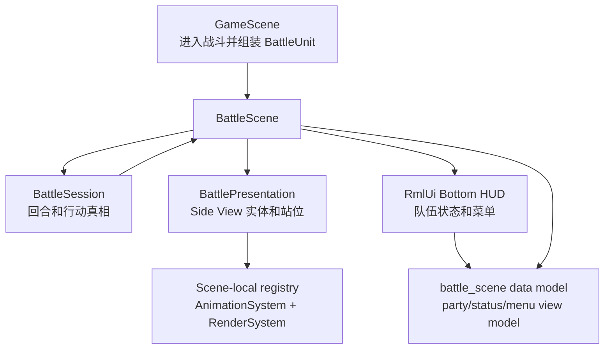
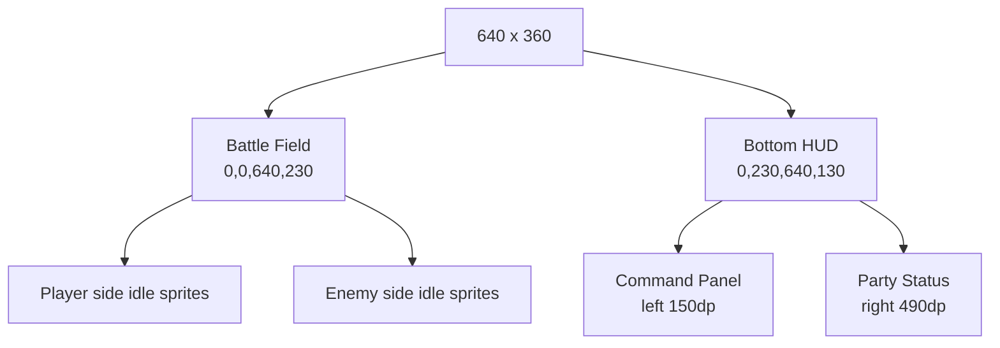

# Battle Side View 表现与底部 HUD 重构计划

## 背景

当前战斗系统的领域层和菜单闭环已经具备可继续扩展的基础：

- `BattleScene` 已接入场景栈、`InputContext::Battle`、`FlowState + MenuState`。
- `BattleSession` / `BattleActionResolver` / `TurnCore` 已负责回合、行动提交、伤害恢复和胜负判定。
- 技能、物品、目标选择已经通过 RmlUi data model 接入。
- `BattleUnit` 已携带 `portrait`，玩家 actor 已能从 `assets/data/rpg/actors.json` 映射到头像。

但表现层仍偏“调试面板式”：

- 战场区域没有 Side View 站位和角色 idle 动画。
- 单位状态仍聚合在 `units_text_` 一行文本里。
- 战斗 UI 使用居中 modal panel，视觉上不像 RPG Maker Side View。
- 当前按钮样式复用 `tf-button-secondary`，它会使用 UI 图集九宫格按钮；本次目标要求按钮保持朴素文字样式，不使用素材按钮图片。

本计划只处理战斗场景的表现和 UI 结构重构，不改变战斗领域规则。

## 目标

1. 将 `BattleScene` 改为 RPG Maker Side View 风格：
   - 玩家队伍站在左侧或右侧一列，敌方站在相对侧。
   - 战场角色使用侧面 `idle_right` / `idle_left` 动画即可。
   - 角色站位稳定，可支持最多 4 名玩家和多名敌人。

2. 下方 UI 展示队伍状态：
   - 每名玩家角色显示头像、名称、HP、MP。
   - HP / MP 使用朴素进度条和数字。
   - 当前行动者高亮。

3. 菜单保持可玩闭环：
   - 复用现有 `MainMenu / SkillList / ItemList / TargetSelect` 状态机。
   - 朴素文字按钮，不使用 `tf-button-primary` / `tf-button-secondary` 的九宫格按钮图。
   - 鼠标点击继续走 RML `data-event-click`。
   - 键盘 / 手柄继续由 `BattleScene` 自主管理光标和 `Focus(true)`。

4. 为后续战斗动画、技能特效、伤害数字预留边界：
   - 本阶段只播放 idle 动画。
   - 攻击位移、受击闪烁、伤害数字和 Effekseer 技能特效仅保留接口位置，不在首期实现。

## 非目标

- 不实现完整战斗动作动画。
- 不实现 RPG Maker 复杂窗口皮肤。
- 不使用素材中的按钮图片。
- 不重做 `BattleSession` / `BattleActionResolver` 的战斗规则。
- 不引入新的长期兼容层；项目未上线，数据格式可按更优方案调整。
- 不做敌人头像状态栏；敌人的 HP 可在目标选择和战场名字板中展示，完整敌方 UI 留给后续。

## 设计总览



建议把本次重构拆成两个表现边界：

- `BattlePresentation`：负责战场实体、侧面 idle 动画、站位、选中/当前行动者视觉标记。
- `BattleHudViewModel`：负责 RmlUi 下方面板绑定，包括头像、HP/MP、菜单条目和提示文本。

`BattleScene` 继续是编排层，负责把 `BattleSession` 快照同步到这两个边界。

## 核心决策

### 1. BattleScene 需要真正渲染战场区域

当前 `BattleScene` 主要加载 RML 文档，自身不渲染战斗实体。Side View 需要让 `BattleScene::render()` 绘制一个覆盖探索场景的战场：

- 先用 `Renderer::drawFilledRect()` 画纯色或简单渐变感的背景区域，遮住底层探索画面。
- 再用 scene-local `registry_` 绘制战斗单位实体。
- 下方 HUD 仍交给 RmlUi，在 renderer 的 RmlUi pass 中显示。

首期背景保持朴素：深色战场底 + 地面线，不新增背景图资源。

### 2. 战斗表现实体使用 scene-local registry

`BattleScene` 继承自 `Scene`，已拥有独立 `registry_`。建议战斗表现实体只存在于这个 registry：

- 不复用 `GameScene` 中的地图实体。
- 不写入存档。
- 战斗结束时随 `BattleScene::clean()` 释放。

需要的组件：

- `TransformComponent`
- `SpriteComponent`
- `AnimationComponent`
- `RenderComponent`
- 可选 `LayeredSpriteComponent`
- 新增轻量组件 `BattleSpriteComponent` 或同等结构，用于记录 `BattleUnitId`、阵营、槽位、选中状态。

### 3. 侧面动画来源优先使用 map actor blueprint

玩家方角色已经有 `ActorData::map_actor_id_`，可通过 `BlueprintManager` 找到地图 actor 的 idle 动画：

- 玩家方：`source_actor_id -> ActorData::map_actor_id_ -> ActorBlueprint::animations_`
- 默认动画：玩家朝敌人方向，使用 `idle_right`；若站位反向则用 `idle_left`
- `idle_left` 当前通常不是独立资源，而是 `blueprint_manager.cpp` 根据 `direction: ["down", "up", "right"]` 自动从 `idle_right` 镜像生成的动画 key
- 敌方：优先从 `EnemyData` 增加 `battle_visual` 字段；首期测试 troop 中出现的敌人必须有明确视觉配置

建议为敌人数据补最小视觉字段：

```json
{
  "id": "enemy.slime",
  "display_name": "Slime",
  "battle_visual": {
    "sprite_blueprint_id": "slime",
    "idle_animation": "idle_left",
    "scale": 1.25
  }
}
```

如果 `EnemyData` 当前不适合直接引用 actor blueprint，也可以新增独立 `battle_visuals.json`，但首选把战斗视觉引用放在 RPG 敌人数据附近，便于 troop 配置和战斗调试。

当前数据里 `actor_blueprint.json` 已有 `slime` blueprint，但 `enemy.goblin`、`enemy.gnome` 没有对应 blueprint。Stage 2 不应让正式触发的 troop 静默显示 debug 方块：

- `enemy.slime` 可先显式映射到 `sprite_blueprint_id = "slime"`。
- `enemy.goblin` / `enemy.gnome` 要么补 blueprint/视觉资源，要么把默认测试 troop 暂时切到有视觉配置的敌人。
- fallback placeholder 只允许作为开发期兜底，并必须记录 warning；不能作为验收画面。

### 4. 可切换外观的玩家需要复制外观快照

主角支持衣服、头发、武器等分层外观。Side View 战斗里应尽量保持当前外观：

- `GameScene::onEnterBattleCommand()` 在 `requestPushScene(BattleScene)` 前读取玩家当前 `AppearanceComponent` 快照。
- 快照通过单独的表现构造参数传入 `BattleScene`，例如 `std::vector<BattleSpriteSeed>` 或 `unordered_map<source_actor_id, AppearanceSnapshot>`。
- 不把外观快照写入 `BattleSessionOptions`。该结构只保留 `rpg_catalog` / `item_catalog` / `item_stocks` 这类领域依赖。
- 不把外观快照写入 `BattleUnit`。`BattleUnit` 继续保持战斗领域快照，不承载外观层数据。
- `BattlePresentation` 创建玩家实体时附加 `AppearanceComponent + LayeredSpriteComponent`，再调用无状态外观构建逻辑生成 layer cache。
- 若快照缺失，则回退到 actor blueprint / appearance catalog 默认 profile。

注意：首期只要求 idle 侧面动画，不需要战斗中实时换装。换装发生在探索场景时，下一次进入战斗再同步即可。

不要在 `BattleScene` 内再实例化一个绑定同一 `context_.getDispatcher()` 的 `AppearanceSystem`。`AppearanceSystem` 构造时会监听 `SetAppearanceSlotCommand` / `RefreshAppearanceCommand`；探索 scene 和战斗 scene 若各自挂一个系统，会出现跨 registry 的静默 no-op，甚至在 entity 数值碰撞时产生不确定行为。Stage 3 应先抽出：

```cpp
class AppearanceLayerCacheBuilder {
public:
    static void rebuild(entt::registry& registry,
                        entt::entity entity,
                        const game::data::AppearanceCatalog& catalog,
                        engine::resource::ResourceManager* resource_manager);
};
```

然后 `AppearanceSystem` 和 `BattlePresentation` 都调用该无状态构建器。

### 5. RmlUi 下方面板不使用按钮图

当前 `tf-button-secondary` 会使用 `decorator: ninepatch(...)`，不符合“朴素文字按钮”要求。战斗 UI 应新增自己的 RCSS 类：

- `.battle-text-button`
- `.battle-command-button`
- `.battle-list-button`
- `.battle-target-button`

样式只使用：

- `background-color`
- `border: 1dp #xxxxxx`
- `color`
- `:focus` / `:hover` 的颜色和边框变化

不使用：

- `decorator: image(...)`
- `decorator: ninepatch(...)`
- UI button spritesheet 区域

头像可以继续用 `@spritesheet` / `decorator: image(...)`，因为头像是角色素材，不是按钮图片。

头像 spritesheet 不建议在 `battle.rcss` 和 `recruit_offer.rcss` 各复制一份。首期应抽到共享文件，例如 `ui/rmlui/theme/portrait.rcss`：

- `battle.rml` 和 `recruit_offer.rml` 都引用该主题文件。
- 共享 `portrait-player` / `portrait-lyria` / `portrait-tori` 的 spritesheet 定义。
- 后续角色增加时只扩展一处。

### 6. 场景栈、快照时机和输入闸口

`SceneManager` 当前只 update / fixedUpdate 栈顶 scene；`BattleScene` push 之后，底层 `GameScene` 逻辑冻结，但 render 仍会按 scene stack 叠加绘制。因此：

- 外观快照必须在 `GameScene::onEnterBattleCommand()` 里、`requestPushScene()` 前同步采集。
- `BattleScene::render()` 必须先绘制全屏或至少上方战场区域的填充背景，避免底层探索画面透出。
- Stage 1 重构 HUD 时必须保留当前 `actions_enabled_` 输入闸口；`ExecutingAction` / `AnimatingResult` / `BattleEnd` 期间菜单不可提交。
- `RESULT_HOLD_SECONDS` 的结果展示节奏可以保留，但显示位置从旧 modal 文本迁移到战场日志或 HUD 日志区。
- `menu_cancel` 的层级返回语义必须保持：`TargetSelect -> 来源菜单`，`SkillList/ItemList -> MainMenu`，`MainMenu` 吃掉输入。
- 进入/退出战斗的淡入淡出建议作为 Stage 5 polish 接入已有 `RmlScreenFade` 路径；不要阻塞 Stage 1/2 的可玩闭环。

## 数据和 ViewModel 调整

### BattleVisualRef 解析结果

建议新增一个小型表现引用作为 `BattlePresentation` 内部解析结果，避免把 UI 和渲染所需信息散落在 `BattleScene`：

```cpp
struct BattleVisualRef {
    std::string blueprint_id{};
    std::string idle_animation{"idle_right"};
    float scale{1.0f};
};
```

首期落点固定为 `BattlePresentation` 内部，用 `source_actor_id/source_enemy_id` 动态解析，不写入 `BattleUnit`。如果后续需要战斗中途存档续盘，再新增独立可序列化表现快照，而不是把外观字段混入领域单位。

### BattleSpriteSeed 与 AppearanceSnapshot

外观和表现资源不进入 `BattleSessionOptions` / `BattleUnit`，由 `BattleScene` 单独接收表现种子：

```cpp
struct AppearanceSnapshot {
    std::string profile_id{};
    std::string gender{"male"};
    std::unordered_map<std::string, std::string> slot_variants{};
    bool valid{false};
};

struct BattleSpriteSeed {
    game::battle::BattleUnitId unit_id{0};
    std::string source_actor_id{};
    std::string source_enemy_id{};
    std::optional<AppearanceSnapshot> appearance{};
};
```

构造顺序：

1. `GameScene` 构造 `BattleUnit`。
2. `GameScene` 根据 `BattleUnit::source_actor_id` / `source_enemy_id` 组装 `BattleSpriteSeed`。
3. `GameScene` 将 `units + session_options + sprite_seeds` 一起传给 `BattleScene`。
4. `BattleScene` 将 `sprite_seeds` 交给 `BattlePresentation`，领域层不感知表现数据。

### PartyStatusViewModel

下方面板需要新增队伍状态数组：

```cpp
struct PartyStatusViewModel {
    int unit_id{0};
    Rml::String name{};
    Rml::String hp_text{};
    Rml::String mp_text{};
    Rml::String hp_ratio_width{"0%"};
    Rml::String mp_ratio_width{"0%"};
    bool hp_low{false};
    bool active{false};
    bool ko{false};
    bool portrait_player{false};
    bool portrait_lyria{false};
    bool portrait_tori{false};
};
```

说明：

- 头像首期可沿用 `recruit_offer` 的 class 开关方式，覆盖 Alex / Lyria / Tori。
- 后续若角色数量增加，再升级为通用 portrait atlas 注册或 RmlUi image binding。
- `hp_ratio_width` / `mp_ratio_width` 用于嵌套 div 血条的 `data-style-width`，值为 `"73%"` 这类字符串。

### BattleSpriteViewModel

战场实体可以不走 RML 绑定，但 `BattleScene` 需要维护单位到表现实体的映射：

```cpp
struct BattleSpriteEntry {
    BattleUnitId unit_id{0};
    entt::entity entity{entt::null};
    BattleSide side{BattleSide::Player};
    int slot_index{0};
};
```

`refreshView()` 更新 HP/MP 文本；`refreshPresentation()` 更新：

- 是否 KO
- 当前行动者高亮
- 目标选择高亮
- 敌人/队友是否可选

## UI 布局

目标逻辑分辨率仍按 640x360dp 设计。



建议首期布局：

- 战场区域：`top 0dp`，`height 230dp`
- 下方 HUD：`top 230dp`，`height 130dp`
- 命令区：下方面板左侧，显示主菜单或当前子菜单
- 状态区：下方面板右侧，横向展示 1-4 名玩家

RML 结构建议：

```xml
<body class="tf-screen-root tf-nav-root" data-model="battle_scene">
    <div id="battle-hud">
        <div id="battle-command-panel">
            <!-- main/list/target 三种菜单继续用 data-if 切换 -->
        </div>
        <div id="battle-party-panel">
            <div data-for="member : party_status" class="battle-party-card">
                <div class="battle-portrait"></div>
                <div class="battle-party-name">{{ member.name }}</div>
                <div class="battle-bar battle-hp-bar">
                    <div class="battle-bar-fill battle-hp-fill"
                         data-style-width="member.hp_ratio_width"></div>
                </div>
                <div class="battle-party-hp">{{ member.hp_text }}</div>
                <div class="battle-bar battle-mp-bar">
                    <div class="battle-bar-fill battle-mp-fill"
                         data-style-width="member.mp_ratio_width"></div>
                </div>
                <div class="battle-party-mp">{{ member.mp_text }}</div>
            </div>
        </div>
    </div>
</body>
```

不使用 `<progress>` 作为首期 HP/MP 条。虽然 learn 页面里已有 `<progress fill>` 示例，但生产战斗 HUD 更稳的方案是嵌套 `div + data-style-width`，完全不依赖 progress fill decorator 或图集资源，且更符合朴素条形 UI 的目标。

RCSS 注意事项：

- 文件开头保留 `body, div, h1, h2, h3, h4, p, hr, span { display: block; }`。
- `border` 使用 `border: 1dp #xxxxxx;`，不要写 `solid`。
- 绝对定位填满父级时显式写 `width` / `height`，不要依赖 `left + right`。
- 所有可聚焦文字按钮保留 `tab-index: auto` 和 `nav-*`。
- 不使用 `tf-button-secondary`，避免引入按钮贴图。
- `battle.rml` 不引用 `tf-button-primary` / `tf-button-secondary` class。

## 阶段拆分

### Stage 1: BattleScene 布局重构和 HUD ViewModel

目标：

- 把现有 `battle.rml` 从居中 modal panel 改为全屏 battle UI。
- 新增 `party_status` data model。
- 删除 `units_text_` 字段和绑定，不保留半成品状态文本；状态真相改由 `party_status` 与目标/日志区域表达。
- 新增朴素文字按钮样式。
- 抽出 `ui/rmlui/theme/portrait.rcss`，让 battle / recruit 共享头像 spritesheet 定义。
- 保留 `actions_enabled_` 输入闸口和 `RESULT_HOLD_SECONDS` 结果展示节奏。
- 保留 `menu_cancel` 的层级返回语义。

交付：

- 下方 HUD 固定显示命令区和玩家状态区。
- 角色头像、HP、MP 数字和嵌套 div 条形图可随 `BattleSession` 快照刷新。
- 现有菜单点击、键盘、手柄闭环不回退。
- `SkillList` / `ItemList` / `TargetSelect` 均可通过 cancel 返回上一级。
- 行动执行和结果展示期间按钮不可提交。

建议测试：

- `BattleSceneSmokeTest` 增加 `party_status`、`battle-bar-fill`、`data-style-width`、plain text button 断言。
- `RcssDefinesBattlePlainButtons` 断言 `battle.rcss` 不含 `decorator: ninepatch` 和按钮 spritesheet。
- `BattleRmlUsesPlainButtons` 断言 `battle.rml` 不含 `tf-button-primary` / `tf-button-secondary`。
- `BattleRmlUsesSharedPortraitTheme` 断言 `battle.rml` 引用 `../theme/portrait.rcss`。
- 保留 `solid` 不出现的 RCSS 回归断言。

### Stage 2: Side View 表现实体生成

目标：

- 新增 `BattlePresentation` 或 `BattleScene` 内部 helper，按 `BattleUnit` 创建战斗表现实体。
- 玩家方从 actor blueprint 解析 `idle_right` / `idle_left` 动画。
- 敌方接入最小 `battle_visual`；验收用 troop 中的敌人必须都有明确视觉资源。
- `BattleScene::update()` 推进 scene-local `AnimationSystem`。
- `BattleScene::render()` override 空基类实现，先全屏填充背景，再绘制战场表现实体。

交付：

- 进入战斗后能看到双方单位站在战场上并播放侧面 idle。
- 玩家/敌人站位按队伍数量稳定分布。
- KO 单位可降透明、变暗或隐藏，首期选择一种即可。
- 默认测试战斗不出现 debug placeholder。
- 底层探索画面不会从战斗场景空白区域透出。

建议测试：

- `battle_presentation_source_test` 断言存在 `idle_right` / `idle_left` 解析路径。
- `battle_scene_smoke_test` 断言 `BattleScene::render` 使用 `Renderer::drawFilledRect` 和 `RenderSystem::render`。
- `battle_scene_smoke_test` 断言 `BattleScene` 头文件声明 `render(float interpolation_alpha) override`。
- 手动用 ninja 构建并在游戏内触发战斗截图验证。

### Stage 3: 外观快照接入

目标：

- `GameScene::onEnterBattleCommand()` 进入战斗时采集玩家当前 `AppearanceComponent`。
- 为 `BattleScene` 提供独立 `BattleSpriteSeed` / `AppearanceSnapshot`，不污染 `BattleSessionOptions` 或 `BattleUnit`。
- 创建玩家战斗表现实体时附加分层外观组件。
- 抽取 `AppearanceLayerCacheBuilder` 无状态构建器，避免 `BattleScene` 直接实例化第二个 `AppearanceSystem`。

交付：

- 主角在战斗中的衣服、头发、武器层与探索场景当前外观一致。
- Lyria / Tori 等非分层预制角色仍使用自己的 side idle。
- `GameScene` 在 `requestPushScene()` 前完成快照采集；战斗压栈后底层 `GameScene` 冻结，不再影响本场外观。

建议测试：

- 外观快照数据结构单测。
- 玩家换装后进入战斗，表现实体包含 `LayeredSpriteComponent`。
- 缺少 appearance catalog 时回退到普通 blueprint sprite，不崩溃。
- `AppearanceSystem` 仍只由探索 runtime 装配，不在 `BattleScene` 中创建。

### Stage 4: 目标选择和行动反馈的视觉强化

目标：

- `TargetSelect` 时在战场单位上显示选中框或脚底高亮。
- 当前行动者在战场和下方 HUD 同步高亮。
- 行动执行期间保留现有 `RESULT_HOLD_SECONDS` 文本反馈，但把文案放在战场上方或 HUD 日志区。

交付：

- 键盘/手柄移动目标时，战场高亮跟随。
- 鼠标点击目标列表时，高亮与提交目标一致。
- KO、不可选目标、当前行动者三种状态在视觉上可区分。

建议测试：

- `populateTargetEntries` 后 `refreshPresentation` 能找到目标实体。
- 取消目标选择后高亮回到动作来源菜单或清空。

### Stage 5: 文档、调试和回归收尾

目标：

- 更新 `docs/gameplay/turn-based-battle.md`，记录 Side View 表现层边界。
- 给 debug panel 加最小信息：表现实体数量、当前 actor、目标 cursor、外观 fallback 数。
- 补齐 UI 架构回归，防止战斗 RML 回退到直接 `loadRmlDocument()` 或图片按钮。
- 评估并接入已有 `RmlScreenFade` 的战斗进入/退出短淡入淡出；如果实现成本高，可作为后续 polish 拆出，但需要在文档中记录当前为即时切换。

交付：

- 文档说明战斗领域层、表现层、RmlUi HUD 的职责分工。
- `ninja` 构建通过。
- 相关单测通过。
- 若启用淡入淡出，进入和退出战斗的输入闸口必须覆盖过渡期，避免重复提交战斗请求或重复弹栈。

## 关键实现顺序

1. 先做 HUD ViewModel 和 RML/RCSS 重排，确保菜单闭环不破。
2. 补齐默认测试 troop 的敌人视觉配置，至少保证验收路径不会走 placeholder。
3. 再做 Side View 实体生成和 BattleScene 渲染，先使用普通 blueprint sprite。
4. 抽出 `AppearanceLayerCacheBuilder`，再接入玩家外观快照。
5. 最后补目标高亮、当前行动者高亮、淡入淡出评估和文档。

原因：

- HUD 和菜单是玩家可操作闭环，应该先稳定。
- Side View 动画可以独立验证，不需要同时解决头像和外观。
- 外观快照涉及 `GameScene`、数据传递和分层渲染，适合在基础表现稳定后接入。

## 验收标准

- 战斗进入后，画面上方是 Side View 战场，下方是命令和队伍状态 HUD。
- 玩家角色和敌人显示侧面 idle 动画。
- 下方玩家卡片显示头像、HP、MP 数字和嵌套 div 条形图。
- HP 降低后条形图跟随变化，低 HP 有清晰状态。
- 当前行动者在 HUD 和战场中都有高亮。
- 主菜单、技能、物品、目标选择仍可用鼠标、键盘、手柄操作。
- 战斗按钮为纯文字样式，不使用素材按钮图片或 `tf-button-secondary`。
- RmlUi 无 `solid` border、无位图字体 italic、无绝对定位隐式拉伸问题。
- `ninja` 构建通过，相关 battle / rmlui 回归测试通过。

## 风险和处理

### RmlUi 头像通用化

当前 RmlUi 头像多用 class 开关绑定固定 spritesheet。角色增加后这会变笨。

处理：

- 首期只覆盖 Alex / Lyria / Tori。
- 后续抽 `PortraitSpriteRegistry` 或 data-driven RCSS 生成，不阻塞 Side View 首版。

### 战斗场景渲染会覆盖底层探索画面

SceneManager 会叠加渲染整个 scene stack。`BattleScene` 必须主动画满战场背景，否则探索画面会从空白区域透出。

处理：

- `BattleScene::render()` 先画全屏或至少战场区域的填充背景。
- HUD 区由 RmlUi 背景色遮住。

### 外观系统和战斗 registry 的关系

`AppearanceSystem` 当前绑定一个 registry 和 dispatcher。战斗场景有自己的 registry。

处理：

- 不在 `BattleScene` 内创建第二个 `AppearanceSystem`。
- 抽出无状态 `AppearanceLayerCacheBuilder`，让探索和战斗共享分层贴图解析和 layer cache 构建逻辑。
- `AppearanceSystem` 继续负责响应探索侧换装命令；战斗侧只在创建表现实体时同步构建一次。

### 敌人视觉数据不足

`EnemyData` 当前主要是战斗数值和行动，不一定有 sprite 视觉字段。

处理：

- 给敌人数据补 `battle_visual`，优先引用现有 `slime` blueprint。
- `enemy.goblin` / `enemy.gnome` 这类无 blueprint 的敌人必须补视觉配置，或暂时不进入默认验收 troop。
- debug placeholder 只用于开发期兜底，并在日志中 warning；验收路径不允许出现 placeholder。

## 后续扩展预留

- 攻击动作：从 idle 切到 step-forward / attack / return。
- 受击动作：闪白、震动、短暂停顿。
- 伤害数字：战场实体上方浮动文本。
- 技能特效：按 `BattleActionResult` 和技能 id 触发 Effekseer overlay。
- 敌方状态条：目标选择时显示敌方 HP 估算或完整 HP 条。
- 战斗背景：按地图、troop 或 encounter 配置切换背景资源。
