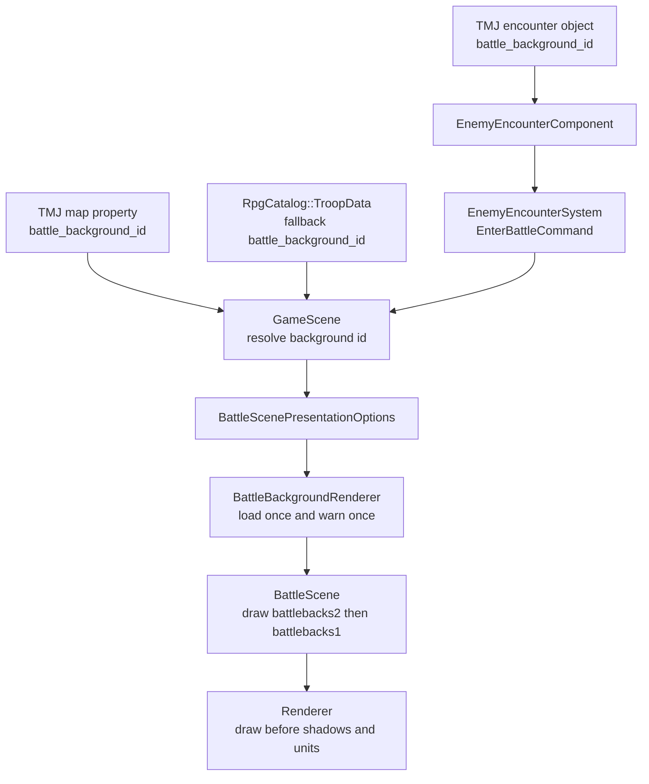

# 战斗背景图开发计划

## 结论

`battle_background_id` 应以 **TMJ 地图/遭遇实例** 为主，`assets/data/rpg/troops.json` 只作为无地图上下文时的默认兜底。

原因：

- 战斗背景表达的是发生地点，例如草地、洞窟、室内、雪地；同一个 `troop.slime` 后续可能出现在不同地图。
- 地图遭遇已经由 TMJ actor object 通过 `battle_troop_id + encounter_id` 驱动，背景跟随同一个实例数据流最自然。
- `troops.json` 更适合描述敌群编成、站位和特殊固定战斗的默认表现，不适合作为所有遭遇的唯一背景来源。

字段命名统一为 `battle_background_id`，保持项目已有 `battle_troop_id / quest_offer_id / encounter_once` 的 snake_case 风格；不采用 `battlebackground_id`。

## 实现思路

先实现约定式资源解析，不额外引入背景 catalog：

- `battle_background_id = "Grassland"`
- 远景层：`assets/textures/BattleBg/battlebacks2/Grassland.png`
- 地面层：`assets/textures/BattleBg/battlebacks1/Grassland.png`

背景解析优先级：

```text
EnterBattleCommand 显式指定
-> TMJ 遭遇 actor object 的 battle_background_id
-> TMJ map properties 的 battle_background_id
-> TroopData 的 battle_background_id
-> 开发期默认 Grassland
-> 缺资源时回退纯色背景
```

整体数据流：



背景是表现层数据，不写入 `BattleSessionOptions`、`BattleUnit` 或 `BattleActionResolver`，避免污染战斗领域逻辑。

## 关键约束

- `MAP_PROP_BATTLE_BACKGROUND_ID` 放在 `src/game/loader/tiled_conventions.h`，不要放入 engine 层；battle 背景是游戏业务概念，不是通用 Tiled 语义。
- `MapInfo::battle_background_id` 使用 `std::optional<std::string>`，表达“地图是否覆盖默认背景”；`EnterBattleCommand::battle_background_id` 和 `TroopData::battle_background_id_` 继续使用空字符串约定。
- `battle_background_id` 只允许 `[A-Za-z0-9_]+`。空值表示未配置；非空非法值直接 warn 并忽略，拒绝 `/`、`\`、`.` 和 `..` 上跳。
- 纹理 id 必须区分双层，例如用 `battlebg1:<id>` 和 `battlebg2:<id>` 作为 hash key，避免同名 `Grassland` 撞到同一个 `TextureHandle`。
- 背景只画战场区域，不画 HUD 区域：
  - `battlebacks2` cover 到 `[0, 0, logical_size.x, BATTLEFIELD_HEIGHT]`。
  - `battlebacks1` 底边对齐 `y = BATTLEFIELD_HEIGHT`，按宽度 cover 后向上展开，不能穿过 HUD。
- 背景加载在 `initPresentation()` 或等价初始化阶段完成；缺资源只 warn once，render 阶段只检查 cached valid flag，不每帧重新 load 或刷日志。
- `BattleScene` 当前 `renderer.setAmbient(1, 1, 1)` 保持不变；第一阶段不让战斗背景受探索地图 ambient / 昼夜色调影响。

## 需要新增的文件

- `src/game/scene/battle_background.h`
  - 定义 `BattleBackgroundLayer` / `BattleBackgroundRenderer` 等轻量结构。
  - 提供 `isValidBattleBackgroundId(id)`。
  - 提供 `makeBattleBackgroundLayer(id, layer)`，按固定目录生成路径和带层前缀的纹理 id。
  - 提供 cover / bottom-anchor 计算 helper。

- `src/game/scene/battle_background.cpp`
  - 实现 id 校验、双层路径解析、纹理加载、纹理尺寸读取和绘制矩形计算。
  - `BattleBackgroundRenderer` 持有两层是否有效的状态，初始化阶段一次性加载，渲染阶段静默跳过无效层。

- 可选：`tests/game/battle/battle_background_test.cpp`
  - 测试 id 校验、路径生成、双层 texture id 区分、cover / bottom-anchor 矩形计算。

## 需要修改的文件

- `src/game/defs/commands.h`
  - `EnterBattleCommand` 增加 `std::string battle_background_id`。
  - 不在本阶段主动拆 `commands_battle.h`；若后续处理现有 `TODO(FND-010)`，需把 `EnterBattleCommand`、`EnemyEncounterBattleContext` 和背景字段一起迁移。

- `src/game/data/rpg_data.h`
  - `TroopData` 增加 `std::string battle_background_id_`。

- `src/game/data/rpg_catalog.cpp`
  - `loadTroops()` 解析 troop 可选字段 `battle_background_id`。
  - `validateReferences()` 对非空背景 id 使用 `[A-Za-z0-9_]+` 校验。

- `src/game/world/world_state.h`
  - `MapInfo` 增加 `std::optional<std::string> battle_background_id`。

- `src/game/world/map_manager.cpp`
  - 解析 TMJ map properties 的 `battle_background_id`，非法值 warn 后忽略。

- `src/game/loader/tiled_conventions.h`
  - 新增 `ACTOR_PROP_BATTLE_BACKGROUND_ID`。
  - 新增 `MAP_PROP_BATTLE_BACKGROUND_ID`。

- `src/game/loader/entity_builder.cpp`
  - 解析 encounter actor object 上的可选 `battle_background_id`，非法值 warn 后忽略。
  - 写入 `EnemyEncounterComponent`。

- `src/game/component/enemy_encounter_component.h`
  - 增加 `std::string battle_background_id_`。

- `src/game/system/enemy_encounter_system.cpp`
  - 发布 `EnterBattleCommand` 时携带 encounter 级背景 id。

- `src/game/scene/game_scene.cpp`
  - 在 `onEnterBattleCommand()` 中按优先级解析最终背景 id。
  - 写入 `BattleScenePresentationOptions`。

- `src/game/scene/battle_scene_types.h`
  - `BattleScenePresentationOptions` 增加 `std::string battle_background_id`。

- `src/game/scene/battle_scene.h`
  - 持有 `BattleBackgroundRenderer`。

- `src/game/scene/battle_scene.cpp`
  - 初始化阶段加载背景。
  - `renderBattlefieldBackground()` 先绘制背景双层，再绘制纯色分隔线、阴影、选中条和角色。
  - 背景双层都无效时保留当前纯色底。

- `tools/battle_tester`
  - CLI 可选增加 `--battle-background Grassland`。
  - 默认使用 `Grassland`，便于截图测试。

- `assets/data/rpg/troops.json`
  - 可给测试 troop 加默认 `battle_background_id: "Grassland"`，但它不是主配置来源。

- `assets/maps/*.tmj`
  - 推荐先在 `town.tmj` map properties 添加 `battle_background_id: "Grassland"`。
  - 若某个敌人实例需要特殊背景，再在该 actor object 上覆盖。

- `docs/game/map_data_pipeline.md`
  - 补充 TMJ map property 与 encounter actor property 的配置说明。

## 实现步骤

1. 固化数据契约
   - 统一字段名为 `battle_background_id`。
   - id 是逻辑名，不带目录和扩展名。
   - id 校验使用 `[A-Za-z0-9_]+`，拒绝路径分隔符、点号和 `..`。

2. 扩展数据入口
   - `EnterBattleCommand` 增加显式背景字段。
   - `TroopData` 增加 troop 默认背景字段。
   - `EnemyEncounterComponent` 增加 encounter 实例背景字段。
   - `MapInfo` 增加 `std::optional<std::string> battle_background_id`。

3. 接入 TMJ 解析
   - 在 game 层 Tiled conventions 定义 `MAP_PROP_BATTLE_BACKGROUND_ID` 和 `ACTOR_PROP_BATTLE_BACKGROUND_ID`。
   - `MapManager` 读取 map properties 的 `battle_background_id`。
   - `EntityBuilder` 读取 actor object properties 的 `battle_background_id`。
   - `EnemyEncounterSystem` 把 encounter 实例字段带入 `EnterBattleCommand`。

4. 接入 troop fallback
   - `RpgCatalog::loadTroops()` 解析 troop 可选 `battle_background_id`。
   - `validateReferences()` 对 troop 背景 id 做同一套合法性校验；第一阶段不强校验图片存在。

5. 在 `GameScene` 解析最终背景
   - 优先使用 command 显式值。
   - 地图遭遇时优先使用 encounter object 值，其次该 map 的默认值。
   - 找不到地图值时使用 troop 默认值。
   - 全部为空时使用开发期默认 `Grassland`。

6. 实现 `BattleBackgroundRenderer`
   - 根据 id 生成两层路径和带层前缀的稳定 texture id。
   - 初始化阶段使用 `ResourceManager::loadTexture()` 加载两层图片。
   - 读取纹理尺寸，缓存绘制所需源矩形和有效标记。
   - 单层缺失时绘制另一层；双层都缺失时设置为空背景状态，只 warn once。

7. 修改 `BattleScene` 渲染
   - 先画当前纯色底作为 fallback。
   - 在 `[0, 0, logical_size.x, BATTLEFIELD_HEIGHT]` 内绘制 `battlebacks2`。
   - 绘制底边锚定到 `BATTLEFIELD_HEIGHT` 的 `battlebacks1`。
   - 在背景之后绘制战场底部线、角色阴影、选中条和战斗精灵。

8. 更新测试数据
   - `town.tmj` 添加 map 默认 `battle_background_id: "Grassland"`。
   - `troops.json` 可选添加 troop 默认值，用于 `battle_tester` 和无地图入口。
   - 保持现有 `assets/textures/BattleBg/battlebacks1/Grassland.png` 与 `battlebacks2/Grassland.png` 作为首个测试资源。

9. 补充验证
   - 单测背景 helper 的 id 校验、路径解析、texture id 区分和矩形计算。
   - 单测/源码 smoke 覆盖 `EnterBattleCommand`、`EnemyEncounterSystem`、`BattleScenePresentationOptions` 的字段接线。
   - 构建 `ninja -C build game_tests`。
   - 运行 `battle_tester` 或从 `town.tmj` 触发 slime 遭遇，确认草地背景双层显示，角色阴影在 `battlebacks1` 之上、HUD 之下。
   - 故意配置不存在的 `battle_background_id`，确认只 warn once，回退纯色底且不崩溃。

## 待办清单

- [ ] 字段名统一为 `battle_background_id`。
- [ ] `EnterBattleCommand` 增加背景字段。
- [ ] `TroopData` 与 `RpgCatalog::loadTroops()` 支持 troop 默认背景。
- [ ] 背景 id 校验限定为 `[A-Za-z0-9_]+`。
- [ ] `MapInfo` 使用 `std::optional<std::string> battle_background_id`。
- [ ] `MapManager` 支持 TMJ map 默认背景。
- [ ] game 层 Tiled conventions 增加 map / actor 背景属性常量。
- [ ] `EnemyEncounterComponent`、`EntityBuilder`、`EnemyEncounterSystem` 支持 encounter 实例背景。
- [ ] `GameScene::onEnterBattleCommand()` 实现最终背景优先级解析。
- [ ] 新增 `BattleBackgroundRenderer`，封装双层路径、纹理 id、加载状态和绘制矩形。
- [ ] `BattleScene` 在战场区域内绘制 `battlebacks2` 和底部锚定的 `battlebacks1`。
- [ ] 背景缺资源时 warn once，render 阶段静默回退。
- [ ] `town.tmj` 添加 `Grassland` 测试配置。
- [ ] `troops.json` 添加可选 troop fallback 测试配置。
- [ ] `battle_tester` 支持默认背景或 CLI 覆盖。
- [ ] 补充 tests / smoke，覆盖背景数据流接线。
- [ ] 更新 `docs/game/map_data_pipeline.md`。
- [ ] 执行 `ninja -C build game_tests`。
- [ ] 人工截图确认正常背景与缺失背景两个 case。

## 风险与边界

- 第一阶段不做独立背景 catalog；若后续需要标题、色调、滚动速度、视差参数，再升级为 `assets/data/rpg/battle_backgrounds.json`。
- 第一阶段不做动态天气、昼夜色调或地图截图作为背景。
- 第一阶段不让背景受探索地图 ambient / 昼夜色调影响，保持战斗表现为固定全亮贴图。
- 背景图缺失不能阻塞进入战斗，只记录一次日志并回退纯色底。
- 背景属于表现层，不参与存档战斗状态；若未来支持战斗中断保存，再只保存 resolved id。

## 待确认

暂无阻塞问题。默认按上述约束推进。
