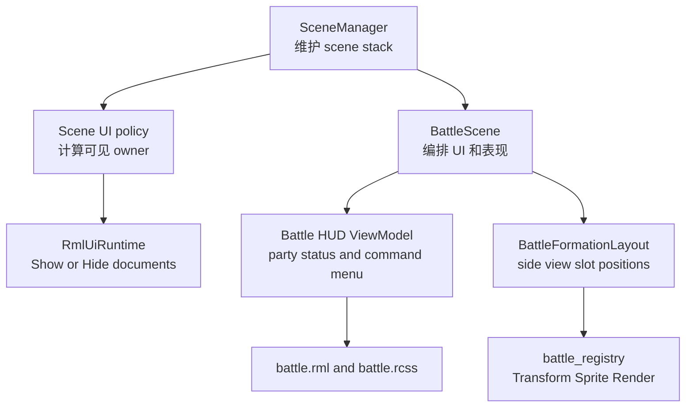

# Battle Scene UI 布局与 Side View 站位重构方案

## 背景

当前截图暴露的是战斗表现层的布局和 scene 叠加策略问题，不需要改动 `BattleSession`、`BattleActionResolver`、`TurnCore` 等战斗领域规则。

项目当前逻辑分辨率为 640x360dp。`BattleScene` 已经有独立 RmlUi 文档、菜单状态机、战斗表现 registry 和 Side View idle 精灵，但现有布局仍偏临时调试版：

- `SceneManager` 会渲染整个 scene stack，后台 `GameScene` 的 RmlUi 文档只被设为不可交互，没有被隐藏。
- `ui/rmlui/scenes/battle.rcss` 把底部 HUD 固定为 `top: 230dp; height: 130dp`，同时 command panel 和 party panel 平分宽度，无法容纳 4 名角色。
- 角色状态卡片内部大量使用 absolute 定位，头像、名称、HP/MP 文本和条形图缺少稳定的横向布局关系。
- `BattleScene::initPresentation()` 中双方角色使用固定 x 坐标和线性 y 间距，画面会像竖直排队。

## 目标

- 战斗场景作为全屏覆盖 scene 时，隐藏探索场景的时钟 HUD、菜单按钮、快捷栏和其他探索 UI。
- 底部战斗 HUD 在 640x360dp 内完全可见，不再被屏幕下沿裁切。
- 左侧预留最多 4 名玩家角色状态卡，每张卡内头像在左、名称和 HP/MP 在右，布局不重叠。
- Actions 区域压缩并右对齐，按钮网格与键盘/手柄光标列数保持一致。
- 战场角色采用轻微斜向队列，形成类似 RPGMaker Side View 的空间透视感。
- 保留现有 `FlowState + MenuState`、RML 点击事件和 scene 级输入管理。

## 非目标

- 不重做战斗规则、技能结算、道具结算、敌方 AI。
- 不实现完整攻击位移、受击闪烁、伤害数字或技能特效。
- 不引入兼容旧战斗 HUD 的分支；项目未上线，可直接替换当前表现结构。
- 不把探索 HUD 的隐藏逻辑硬编码在 `BattleScene` 对 `GameSceneUiController` 的直接访问上。

## 现状诊断

| 截图问题 | 直接原因 | 推荐修复边界 |
|---|---|---|
| 时钟 UI 和菜单 UI 仍显示 | `RmlUiRuntime::applyInteractionPolicy()` 只设置后台文档 `pointer-events:none`，不调用 `Hide()` | 在 scene 层增加 UI 可见性策略，由 `SceneManager` 统一控制后台 RmlUi 文档显示 |
| 下方 UI 超出屏幕 | Actions 按钮实际换成 2 列 3 行，但 `#battle-actions` 只有 76dp 高；command panel 宽 302dp，party 区域过窄 | 重新划分 HUD 尺寸，Actions 右侧窄面板固定 2 列，party 区域优先 |
| 主角头像异常且和条重叠 | `.battle-portrait` / `.battle-party-name` 使用 absolute，卡片未建立明确的内部行列结构 | RML 增加头像列和状态列，RCSS 改为 flex/固定列宽，尽量减少 absolute |
| Actions 横向空间太大 | `#battle-command-panel` 宽 302dp，占据半屏；`#battle-party-panel` 只剩 302dp | command panel 缩到约 184dp 并靠右，party panel 扩到约 432dp |
| 战场角色竖直排列 | 玩家和敌人分别使用固定 `x=454/186`，只按 index 改 y | 抽出 formation layout helper，按 index 同时偏移 x/y，并按 y 排序 |

## 总体设计



核心思路是把问题拆成两个稳定边界：

- Scene stack UI 可见性由引擎层统一处理，解决所有全屏覆盖 scene 的后台 HUD 泄漏问题。
- Battle scene 自己只负责战斗 HUD 和战场站位，不关心探索 UI 的生命周期。

## 阶段一：隐藏后台探索 UI

### 方案

在 `engine::scene::Scene` 增加一个轻量 UI 覆盖策略，例如：

```cpp
enum class SceneUiCoverage {
    Overlay,
    HideUnderlyingSceneUi
};
```

- `Scene` 默认返回 `Overlay`，保持 PauseMenu、QuestOffer、RecruitOffer 等覆盖式 UI 的现有视觉行为。
- `BattleScene` 返回 `HideUnderlyingSceneUi`。
- `SceneManager::syncRmlActiveScene()` 扩展为同步交互 owner 和可见 owner：
  - 找到栈顶向下第一个 `HideUnderlyingSceneUi` scene。
  - 只显示该 scene 到栈顶之间的 RmlUi 文档。
  - owner 为 `0` 的全局文档按现有规则继续显示，除非后续明确引入全局覆盖策略。
  - 当前 `time_clock.rml`、`game_overlay.rml`、`hotbar.rml` 都由 `GameSceneUiController` 使用 `scene_instance_id_` 创建，不是 owner `0` 的全局文档；因此 BattleScene 成为全屏覆盖 scene 后，它们会作为后台 GameScene 文档被隐藏。
  - owner `0` 主要保留给无 scene owner 的全局或调试文档；本次不要把普通探索 HUD 改成 owner `0`。
- `RmlUiRuntime` 增加按 owner 显示/隐藏文档的接口，例如 `setVisibleSceneOwners(...)`。
- `applyInteractionPolicy()` 继续只处理交互权限，不混入显示策略。

### 涉及文件

- `src/engine/scene/scene.h`
- `src/engine/scene/scene.cpp`
- `src/engine/scene/scene_manager.h`
- `src/engine/scene/scene_manager.cpp`
- `src/engine/ui/rmlui/rml_ui_runtime.h`
- `src/engine/ui/rmlui/rml_ui_runtime.cpp`
- `src/game/scene/battle_scene.h`

### 验收

- 进入战斗后不显示 `ui/rmlui/hud/time_clock.rml`。
- 进入战斗后不显示 `ui/rmlui/hud/game_overlay.rml` 的右上角菜单按钮。
- 如果战斗前快捷栏处于显示状态，进入战斗后也应隐藏；战斗结束 pop 后恢复原状态。
- PauseMenu 等普通 overlay scene 不因本次改动被强制隐藏底层 UI。

## 阶段二：底部 HUD / 头像 / Actions 联动重写

本阶段应作为一次联动改动提交：`battle.rml`、`battle.rcss`、`PartyStatusViewModel`、`MAIN_ACTION_COLUMNS` 和相关 smoke 测试需要同步更新。不要先改 ViewModel 再延后改 RML，也不要先改 RCSS 再延后同步 C++ 光标列数。

### 推荐尺寸

以 640x360dp 为基准：

| 区域 | 建议位置 |
|---|---|
| 战场区域 | `0,0,640,230` |
| 底部 HUD | `0,230,640,130` |
| party panel | `8,8,432,114`，相对 HUD |
| command panel | `448,8,184,114`，相对 HUD |

现有 `230 + 130 == 360` 已经是正确的垂直总量，截图中的裁切来自 HUD 内部布局和 Actions 高度不足，不需要靠 2dp 平移解决。上述数值不是最终美术参数，但要满足两个硬约束：

- `battlefield_height + hud_height == 360`
- `party_panel_width` 可容纳 4 张状态卡

### Party 区域

4 人布局建议：

- 卡片宽度：102dp。
- 卡片间距：4dp。
- 卡片高度：104dp 到 112dp。
- 头像列：32dp 到 36dp。
- 状态列：剩余宽度显示名称、HP 文本、HP 条、MP 文本、MP 条。

RML 结构从当前“卡片内所有元素平铺”改为显式左右列：

```xml
<div class="battle-party-card" data-for="member : party_status">
    <div class="battle-party-main">
        <div class="battle-portrait" data-style-decorator="member.portrait_decorator"></div>
        <div class="battle-party-stats">
            <div class="battle-party-name">{{ member.name }}</div>
            <div class="battle-stat-label">HP {{ member.hp_text }}</div>
            <div class="battle-stat-bar">
                <div class="battle-stat-fill battle-hp-fill" data-style-width="member.hp_ratio_percent"></div>
            </div>
            <div class="battle-stat-label">MP {{ member.mp_text }}</div>
            <div class="battle-stat-bar">
                <div class="battle-stat-fill battle-mp-fill" data-style-width="member.mp_ratio_percent"></div>
            </div>
        </div>
    </div>
</div>
```

RCSS 重点：

- `.battle-party-card` 使用 `display: block` 或 `display: flex`，并设置固定尺寸。
- `.battle-party-main` 使用 `display: flex; flex-direction: row;`。
- `.battle-portrait` 不再 absolute 定位。
- `.battle-party-name` 不再 absolute 定位。
- HP/MP 文本和条形图在状态列内顺序布局。

### Actions 区域

Actions 不再占半屏。推荐：

- command panel 宽度约 184dp。
- main actions 固定 2 列 3 行。
- 按钮宽度约 84dp，高度 18dp 到 20dp。
- `MAIN_ACTION_COLUMNS` 从 3 改为 2，保证方向键移动和视觉列数一致。
- `#battle-main-actions` 高度至少容纳 3 行按钮。
- `#battle-list-menu` / `#battle-target-menu` 复用右侧窄面板，一屏显示 3 到 4 项，长列表后续再接滚动。
- `#battle-menu-hint` 放在 actions 区域内部第一行，不要再和 turn/result 横向竞争空间。

当前 `battle.rcss` 中 `98dp * 3 + gap 4dp * 2 == 302dp` 过于贴边，RmlUi 加上边框和内部度量后容易折成 2 列，导致第三行溢出。新布局应主动承认 2 列，并把高度预算留够。

### 涉及文件

- `ui/rmlui/scenes/battle.rml`
- `ui/rmlui/scenes/battle.rcss`
- `src/game/scene/battle_scene.h`
- `src/game/scene/battle_scene.cpp`

### 验收

- 640x360dp 下，所有 party card、Actions 按钮、hint 文本都在屏幕内。
- 4 名玩家角色时，party card 不覆盖 command panel。
- Actions 位于右侧，左侧有完整 4 人信息区域。
- `Attack / Skill / Item / Guard / Escape / End Turn` 显示为 2 列 3 行，方向键上下移动以 2 列为准。

### 头像数据和卡片内部布局

#### 方案

当前 `PartyStatusViewModel` 使用 `portrait_player / portrait_lyria / portrait_tori` 三个 bool。这个方式能跑 MVP，但不利于后续增加第 4 名角色。

建议改为：

```cpp
struct PartyStatusViewModel {
    int unit_id{0};
    Rml::String name{};
    Rml::String hp_text{};
    Rml::String mp_text{};
    Rml::String hp_ratio_percent{"0%"};
    Rml::String mp_ratio_percent{"0%"};
    Rml::String portrait_decorator{"none"};
    bool active{false};
    bool ko{false};
};
```

头像 decorator 生成优先级：

- 优先使用 `BattleUnit::portrait` 或 `source_actor_id` 映射到 `ui/rmlui/theme/portrait.rcss` 中的 sprite。
- `data-style-decorator` 绑定值必须是完整 RCSS 表达式，例如 `image(portrait-player)`，不是裸 sprite 名称。
- 无头像资源时返回 `none`，并显示统一 fallback 背景，不要让头像元素和文本重叠。
- 短期可继续维护 `actor.player / actor.lyria / actor.tori` 的共享 spritesheet 名称，但对第 4 名角色需要只扩展 `portrait.rcss` 和映射 helper，不再新增多个 bool。

RCSS 中保留 `.battle-portrait` 的固定尺寸和背景框：

- `width: 32dp; height: 32dp`
- `decorator: none` 作为默认值
- 使用 `data-style-decorator="member.portrait_decorator"` 覆盖

### 验收

- 主角头像可见。
- 头像在卡片左侧，HP/MP 文本与条形图在右侧。
- HP/MP 条不会覆盖头像或名称。
- 未配置头像的角色显示空头像框或默认头像，而不是布局塌陷。

### 压缩并右对齐 command panel

#### 方案

把底部 HUD 从“party 和 command 各占半屏”改为“party 优先，command 靠右”。

推荐 RCSS：

```css
#battle-party-panel {
    position: absolute;
    left: 8dp;
    top: 8dp;
    width: 432dp;
    height: 114dp;
}

#battle-command-panel {
    position: absolute;
    left: 448dp;
    top: 8dp;
    width: 184dp;
    height: 114dp;
}
```

注意 RmlUi 不支持 `left + right` 隐式拉伸，所以右对齐不要写成 `right: 8dp`。直接使用 `left: 448dp; width: 184dp`，并在注释或测试中绑定到 640dp 逻辑宽度。

`turn_text` 和 `result_text` 建议在 command panel 顶部变成紧凑两行：

- 第一行：当前行动者。
- 第二行：上一行动结果，必要时截断。
- Actions 标题和 hint 再往下排，避免把按钮挤出 HUD。

### 验收

- command panel 最右边距为 8dp 左右。
- party panel 到 command panel 之间有明确间隔。
- 长 `Result: Skill dealt 38 dmg` 不会把按钮向下顶出屏幕。

## 阶段三：战场 Side View 透视站位

### 方案

把当前 `BattleScene::initPresentation()` 中的临时站位计算抽出为匿名命名空间里的纯函数。暂时不要预先创建独立 `.h/.cpp`；如果后续站位规则扩展到动画位移、阵型配置或视觉测试，再移动成 `BattleFormationLayout`。

推荐结构：

```cpp
struct BattleFormationSlot {
    glm::vec2 screen_position{0.0F};
    float scale{1.0F};
    float depth{0.0F};
    glm::vec2 shadow_size{56.0F, 4.0F};
};
```

布局规则：

- 玩家在右侧，整体从左上到右下或从右上到左下形成轻微斜线。
- 敌人在左侧，采用相反方向的轻微斜线。
- 每个 slot 同时调整 x 和 y，不能只调整 y。
- `depth` 继续用屏幕 y，靠下的角色覆盖靠上的角色。
- shadow 与 selection marker 分开处理：
  - shadow：每个存活角色脚底都画一个短影子，用来替换当前两条长水平地面线。
  - selection marker：保留现有“仅 current actor / target 显示”的逻辑，只把位置改为跟随新的 `screen_position`。

一个可用的初始参数：

| 阵营 | base | step | 说明 |
|---|---|---|---|
| Player | `x=478, y=84` | `x=-18, y=28` | 越靠下越略向左，模拟队列纵深 |
| Enemy | `x=166, y=88` | `x=18, y=30` | 越靠下越略向右，保持面向玩家 |

为了支持 1 到 4 人都自然居中，可先计算居中偏移：

```cpp
const float centered = static_cast<float>(index) - (static_cast<float>(count) - 1.0F) * 0.5F;
```

然后用 `base + centered * step` 得到位置。最终 y 需要限制在战场区域内，避免脚底 marker 进入 HUD。

### 涉及文件

- `src/game/scene/battle_scene.cpp`

### 验收

- 同阵营角色不再共用同一个 x 坐标。
- 4 名玩家从上到下形成轻微斜线，仍全部位于战场区域。
- 目标选择和当前行动者高亮出现在对应角色脚底。
- 每个角色有独立 shadow，两条长水平地面线被移除。
- 敌人和玩家 depth 排序仍按 y 正确遮挡。

## 测试与验证

### 静态回归测试

补充或更新：

- `tests/game/battle/battle_scene_smoke_test.cpp`
  - 用源码 grep 断言 `MAIN_ACTION_COLUMNS = 2`，不要写成运行期断言。
  - 断言 RML 使用 `battle-party-main` 和 `data-style-decorator="member.portrait_decorator"`。
  - 删除 `data-class-portrait-player` / `portrait_lyria` / `portrait_tori` 相关断言，避免继续绑定旧 bool ViewModel。
  - 断言 RCSS 中 command panel 宽度不再是 302dp。
  - 断言站位计算不再只使用固定玩家/敌人 x 坐标。
- `tests/game/rmlui_architecture_regression_test.cpp`
  - 保留 Battle 不使用 `tf-button-primary` / `tf-button-secondary` / `ninepatch` 的约束。
  - 增加 Battle HUD 不使用 `<progress>`，继续使用 div fill width。
- `tests/engine/scene/scene_manager_safety_test.cpp`
  - 增加 source-level 断言，确认 `SceneUiCoverage` 或等价策略存在。
  - 确认 `syncRmlActiveScene()` 同步 active scene 之外，也同步可见 owner。
- `tests/engine/ui/rmlui_runtime_access_test.cpp`
  - 增加 runtime header/source 断言，确认存在按 owner show/hide 文档的接口。

### 手动视觉验证

使用 ninja 构建：

```bash
ninja -C build
```

运行相关测试：

```bash
ctest --test-dir build -R "battle|rmlui|scene_manager|ui_layout" --output-on-failure
```

游戏内截图检查：

- 进入战斗，确认左上角时钟和右上角菜单按钮消失。
- 640x360dp 或 1280x720 窗口下，底部 HUD 没有任何元素超出屏幕。
- 队伍人数分别为 1、2、4 时，卡片布局稳定。
- 选择 Attack 后进入 target menu，战场目标高亮位置正确。
- 战斗结束 pop 后，探索 HUD 恢复。

## 推荐实施顺序

1. 先做 scene UI 可见性策略，解决探索 HUD 泄漏。
2. 一次性重写 `battle.rml` / `battle.rcss` / `PartyStatusViewModel` / `MAIN_ACTION_COLUMNS`，让底部 HUD、头像和 Actions 在 640x360dp 内自洽。
3. 抽出匿名 namespace formation helper，改战场站位、角色 shadow 和脚底 selection marker。
4. 同步更新 smoke/regression 测试。
5. ninja 构建并进行截图验证。

## 风险和注意事项

- RmlUi 的 `position: absolute` 不支持 `left + right` 自动拉伸；所有右对齐面板都要显式写 `left` 和 `width`。
- RmlUi 默认 `display` 是 `inline`，新增 wrapper class 时必须在 RCSS 中明确 `display`。
- 后台文档 `Hide()` 后，pop scene 时必须恢复 `Show()`；该逻辑应由 `SceneManager` 统一触发，避免单个 scene 忘记恢复。
- Battle 输入仍由 scene 级 input listener 管理，不依赖 RmlUi 原生方向键导航；视觉列数变化时必须同步 C++ 光标步长。
- 头像长期应从 actor portrait 数据驱动。短期即使继续使用共享 `portrait.rcss`，也要避免每新增角色就在 view model 增加一个 bool。
- 本次只处理表现层，不要把 UI 需要的头像、站位、外观快照字段塞回 `BattleUnit` 的领域真相里。
