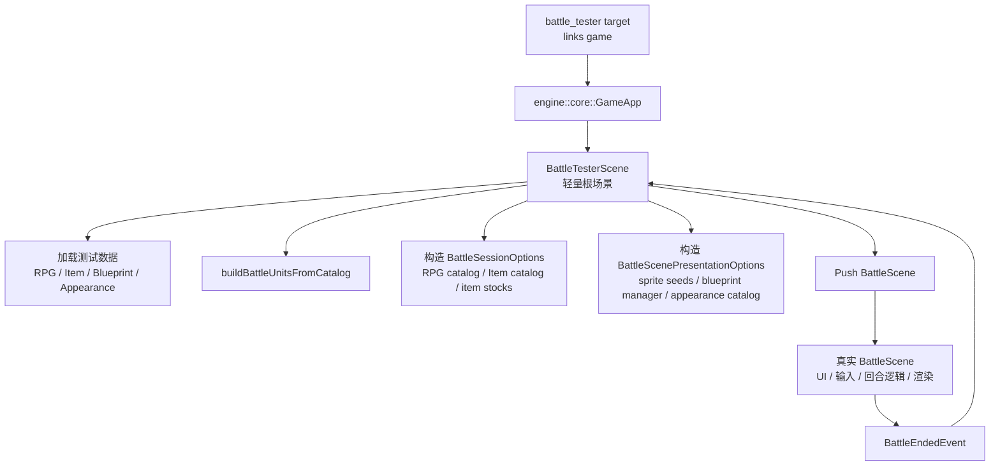

# Battle Tester 工具开发计划

## 目标

新增一个专用测试程序 `tools/battle_tester`，运行后绕过标题、地图、时钟、菜单等主流程 UI，直接进入真实的 `BattleScene`。它用于后续战斗 UI 和回合逻辑优化后的快速人工截图检查，也为后续自动截图/回放测试预留入口。

结论：可行，难度不高。现有 `GameApp::registerSceneSetup()`、`tools/rmlui_tester`、`tools/visual_tester` 已经提供了工具程序启动范式；真正需要控制的是战斗数据装配和资源生命周期。

## 设计原则

- 复用生产 `game::scene::BattleScene`，不另写一套简化战斗 UI。
- 工具只负责构造默认 fixture：RPG catalog、Item catalog、BlueprintManager、AppearanceCatalog、敌我单位、初始道具库存、表现种子。
- 不依赖 `GameScene` 和地图 ECS 世界，避免为了进入战斗而启动农场地图、日夜 UI、暂停菜单等无关系统。
- RPG catalog 的 manifest 解析和 classes/actors/skills/states/enemies/troops 装配逻辑必须复用 runtime helper，避免在工具里复制 `GameRuntimeAssembler` 的加载序列。
- 默认配置必须稳定，启动后 1-2 秒内直接看到战斗画面。
- 第一版保留人工截图检查；截图自动化和 UI 热重载作为后续增强。

## 架构方案



## 新增文件与改动范围

- `tools/battle_tester/main.cpp`
  - 创建 `GameApp`。
  - 解析轻量 CLI 参数。
  - 注册初始场景 setup，push `BattleTesterScene`。

- `tools/battle_tester/battle_tester_scene.h`
- `tools/battle_tester/battle_tester_scene.cpp`
  - 作为根场景持有测试资源，确保传给 `BattleScene` 的 catalog/manager 指针生命周期有效。
  - 在类注释中写明不变量：`BattleTesterScene` 必须位于 scene stack 底部，并在 `BattleScene` 存活期间保持不销毁、不重建。
  - 在 `init()` 中加载数据并推入 `BattleScene`。
  - 监听 `BattleEndedEvent`，记录结果；第一版可保持根场景存活并支持重新开始。

- `src/game/runtime/rpg_catalog_loader.h`
- `src/game/runtime/rpg_catalog_loader.cpp`
  - 从 `GameRuntimeAssembler` 中提取 RPG manifest 装配 helper。
  - helper 负责 `loadManifest()`、解析 manifest 文件映射、逐个 `loadClasses/loadActors/loadSkills/loadStates/loadEnemies/loadTroops()`、以及 `validateReferences()`。
  - `GameRuntimeAssembler` 和 `battle_tester` 共同调用该 helper，避免两处加载路径漂移。

- `tools/CMakeLists.txt`
  - 新增 `battle_tester` target，链接 `game`，对齐 `scheduler_dot_dump` 的依赖方式；虽然入口仍使用 `engine::core::GameApp`，但工具直接使用 game 层类型。
  - include `${PROJECT_SOURCE_DIR}/src` 和 `tools/battle_tester`。
  - 调用 `setup_asset_copy(battle_tester)`、`setup_ui_copy(battle_tester)`、`setup_config_copy(battle_tester)`、`setup_script_copy(battle_tester)`、`setup_windows_dll_copy(battle_tester)`。

- `tests/game/battle/...`
  - 优先用构建级验证确认 `battle_tester` target 存在并可构建。
  - 若需要防止工具被静默移除，只加少量稳定断言，不做脆弱的源码字符串匹配。
  - 不把 UI 截图检查写成单元测试；截图检查先保留为人工流程。

## 默认测试配置

第一版默认值：

- 玩家方 actor：
  - `actor.player`
  - `actor.lyria`
  - `actor.tori`
- 敌方 troop：
  - 默认 `troop.goblin_pair`，也可用 CLI 切换到 `troop.slime` 或 `troop.gnome_pair`。
- 初始战斗道具：
  - `potion = 5`
- 数据路径：
  - `assets/data/rpg/manifest.json`
  - `assets/data/icon_config.json`
  - `assets/data/item_config.json`
  - `assets/data/actor_blueprint.json`
  - `assets/data/appearance_catalog.json`

若资源加载失败，工具应输出明确错误并保持窗口退出干净，不进入半初始化战斗。
若 CLI 指定了不存在的 actor/troop，`buildBattleUnitsFromCatalog()` 返回失败时必须将 `out_error` 写入 `spdlog::error`，然后 fail-fast 退出根场景，不能 push 空 `BattleScene`。

## CLI 范围

MVP 只实现少量稳定参数：

```bash
./build/tools/battle_tester
./build/tools/battle_tester --troop troop.slime
./build/tools/battle_tester --actors actor.player,actor.lyria,actor.tori --troop troop.goblin_pair
```

建议参数：

- `--actors <id,id,id>`：覆盖默认玩家 actor。
- `--troop <id>`：覆盖默认敌方 troop。
- `--potion-count <n>`：覆盖默认 potion 库存。

暂不做复杂 JSON fixture。等战斗系统进入更多场景后，再考虑 `--fixture assets/data/battle_fixtures/*.json`。

## 表现种子策略

- 单位列表用 `buildBattleUnitsFromCatalog()` 构造，确保属性、技能、敌方行动和 rewards 都来自现有 RPG 数据。
- `BattleScenePresentationOptions::sprite_seeds` 根据 `BattleUnit::source_actor_id` / `source_enemy_id` 生成。
- 敌人复用 RPG enemy 的 `battle_visual` 配置。
- 玩家角色优先使用 actor 对应蓝图；若后续需要换装预览，再为 player 构造 `AppearanceSnapshot`。
- `blueprint_manager` 和 `appearance_catalog` 都由 `BattleTesterScene` 持有，作为非拥有指针传入 `BattleScene`。

## 实施步骤

1. 新建 `tools/battle_tester` 目录和 CMake target。
2. 实现 `BattleTesterConfig` 与最小 CLI 解析。
3. 提取并复用 RPG catalog 装配 helper：
   - 新增共享 helper 承接 `GameRuntimeAssembler` 中 `ensureRpgCatalog()` 的 manifest 装配段。
   - `GameRuntimeAssembler` 改为调用 helper，行为保持一致。
   - `battle_tester` 调用同一个 helper，不自行拼装 manifest 引用文件路径。
4. 实现测试工具的数据加载：
   - 加载 `ItemCatalog`。
   - 通过共享 helper 加载并校验 `RpgCatalog`。
   - 加载 `BlueprintManager` 与 `AppearanceCatalog`。
5. 实现 `BattleTesterScene`：
   - 持有 catalogs/managers。
   - 保证自身在 `BattleScene` 存活期间不 pop、不重建，维持 raw pointer 生命周期。
   - 构造 `BattleUnitBuildOptions`。
   - 若 actor/troop 参数非法或单位构造失败，记录 `out_error` 并退出，不 push 空战斗。
   - 构造 `BattleSessionOptions` 和 `BattleScenePresentationOptions`。
   - push 真实 `BattleScene`。
   - 验证 `BattleScene` 在没有 `GameScene` 衬底时的渲染表现；必要时让 `BattleTesterScene::render()` 绘制纯色清屏背景，避免底层空白或残留 GL 状态影响截图。
6. 处理战斗结束：
   - 监听 `BattleEndedEvent`。
   - 第一版记录胜负和 rewards 到日志。
   - 保持根场景，不崩溃；后续可加 `R` 重新开始。
7. 添加验证：
   - `ninja -C build battle_tester` 作为主要检查。
   - 可选新增稳定 smoke test，只断言工具 target/关键 helper 未被移除，不做大段源码文本匹配。
8. 构建和人工验证：
   - `ninja -C build battle_tester`
   - `./build/tools/battle_tester`
   - 截图检查战斗区、HUD、Actions、菜单流、技能/物品/目标选择。

## 验收标准

- `ninja -C build battle_tester` 成功。
- 运行 `./build/tools/battle_tester` 后直接进入战斗场景，没有地图、时钟 UI、菜单 UI。
- 默认 3 名玩家角色和 1 组敌人显示正常。
- 角色头像、HP/MP、Actions 菜单、技能/物品/目标选择能按真实 `BattleScene` 逻辑交互。
- `potion` 在 Item 菜单中可见且库存为默认值。
- 非法 `--actors` / `--troop` 参数会输出明确错误并干净退出，不进入空战斗。
- 战斗结束后工具不会访问已释放资源或崩溃。
- 若新增 smoke test，则 `./build/tests/game_tests` 对应测试通过。

## 后续增强

- `--fixture <path>`：从 JSON 加载多组战斗 fixture。
- `--auto-screenshot <path>`：启动后等待若干帧自动截图。
- `--replay <path>`：自动输入 Attack/Skill/Item/Guard 等动作，覆盖菜单状态。
- RmlUi 热重载：监听 `ui/rmlui/scenes/battle.rml` / `battle.rcss`，快速刷新 UI。
- 多分辨率截图：窗口尺寸参数化，固定输出 desktop/mobile/窄屏检查图。

## 风险与边界

- 该工具绕过 `GameScene`，因此不会覆盖地图遭遇、战斗结算写回地图、任务推进等集成路径；这些仍应由集成测试或实际游戏流程验证。
- 第一版截图检查是人工流程，不能自动判断 UI 是否重叠。
- 若后续需要完整玩家换装状态，应新增 fixture 或复用存档装配，而不是把 `GameScene` 的 ECS 初始化塞进此工具。
