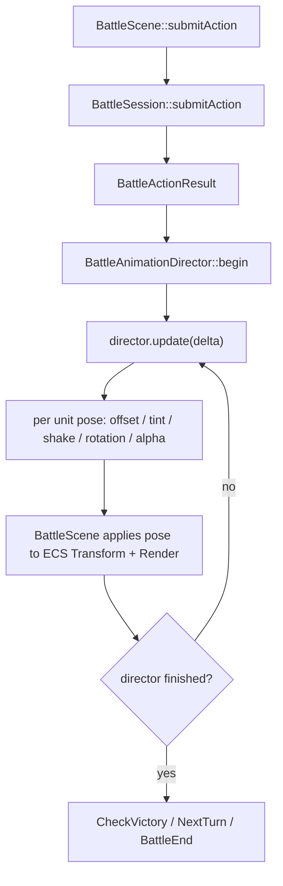

# 1.2 攻击/受击演出开发计划

## 目标

把当前 `BattleScene::FlowState::AnimatingResult` 的固定 `0.20s` 占位计时替换为可扩展的战斗演出时间轴。

第一阶段只做不依赖新美术资源的程序化表现：

- 行动者攻击时向目标方向前踏 / 轻微 hop，命中后回到阵型点。
- 目标受击时红色 flash + 横向 shake。
- 目标 HP 归零时倒下：旋转、下沉、透明度淡出。
- 技能 / 道具 / 防御 / 逃跑使用较短的 caster pulse 或 hold，不阻塞后续接 Effekseer。

不修改 `BattleSession`、`BattleActionResolver`、`BattleUnit` 等领域结算逻辑；演出只消费 `BattleActionResult` 和战斗精灵阵型信息。

## 实现思路

新增 `BattleAnimationDirector`，由它把 `BattleActionResult` 转换成一段时间轴。`BattleScene` 在行动结算后启动 director，在 `AnimatingResult` 阶段等待 director 完成，而不是等待固定计时。

核心原则：

- `BattleSpriteComponent::screen_position` 继续表示阵型基准点，不直接被 tween 改写。
- Director 输出 `BattleAnimationPose`：`offset`、`scale_multiplier`、`rotation`、`color_multiplier`、`alpha_multiplier` 等表现层覆盖值。
- `syncPresentationTransforms()` 使用 `base_screen_position + pose.offset` 写入 `TransformComponent`；`refreshPresentation()` 合成原本的当前行动者 / 目标高亮色与 pose tint。
- KO 姿态需要持久化：director 结束后，被击倒单位仍保持倒下 / 低透明状态，避免下一帧被 `refreshPresentation()` 恢复成灰色站姿。
- `session_.submitAction()` 返回后、`battle_animation_director_.begin(...)` 之前采集 sprite snapshot。`target_defeated` 等结果字段必须来自结算后 result；阵型坐标来自 `BattleSpriteComponent::screen_position`，不会因 submit 改变。
- Phase 1 写 `TransformComponent` 时继续令 `previous_position_ = position_`，不使用 RenderSystem 的子 tick 插值。Director 已经按 `delta_time` 推进 tween，这样可避免 director 插值和 `glm::mix` 双重平滑导致拖影或位置滞后。
- 第一阶段不引入新配置文件；时长、幅度先用局部常量，等后续技能演出资源成型后再数据驱动。

## 需要新增的文件

- `src/game/scene/battle_animation_director.h`
  - 定义 `BattleAnimationDirector`、`BattleAnimationPose`、`BattleAnimationSpriteSnapshot`、`BattleAnimationTimelineConfig`。
- `src/game/scene/battle_animation_director.cpp`
  - 实现 action result 到 timeline 的转换、缓动函数、pose 查询和完成状态。
- `tests/game/battle/battle_animation_director_test.cpp`
  - 纯数学 / 时间轴测试，不依赖渲染器。

需要修改：

- `src/CMakeLists.txt`
  - 加入新的 director 源文件。
- `tests/CMakeLists.txt`
  - 加入新的 director 测试。
- `src/game/scene/battle_scene.h/.cpp`
  - 持有 director，替换 `animation_timer_` 主流程，应用 pose 到战斗 ECS。
- `tests/game/battle/battle_scene_smoke_test.cpp`
  - 补充状态机不再依赖固定 `RESULT_HOLD_SECONDS` 的回归检查。

## 时间轴设计

### 普通攻击

- `0.00s - 0.08s`：windup，行动者轻微后压。
- `0.08s - 0.22s`：向目标方向前踏，位移按目标距离计算并 clamp，避免跨过目标。
- `0.22s`：impact frame，目标 flash / shake 开始。
- `0.22s - 0.42s`：行动者返回阵型点。
- `0.22s - 0.52s`：目标受击红闪和横向 shake 衰减。
- `0.36s - 0.72s`：若 `target_defeated`，目标倒下并淡出。

### 技能 / 道具

- 第一阶段不做专属粒子。
- caster 做短 pulse / hover，target 在 impact 时复用受击 flash / shake 或恢复 tint。
- `BattleActionResult.target_id` 为空的 AllEnemies / AllAllies / 全体道具，在第一阶段降级为 caster pulse + 短 hold，不从 snapshot 按阵营反推受击目标，避免聚合伤害值误导成逐目标 hit。等 `BattleActionResult` 有 per-target effects 后再补全 AOE 反馈。
- 后续 Effekseer / SFX 接入点：director 在 impact frame 产生一次 `BattleVisualEvent`，由 `BattleScene` 或 VFX / Audio service 消费。
- 第一阶段不接音效，避免把命中音效路径硬编码进 director；`BattleVisualEvent` 后续同时承载 VFX 和 SFX 请求。

### 防御 / 逃跑 / 跳过

- Guard：行动者短暂下压 + 蓝白 tint。
- Escape：行动者向屏幕外方向轻移；失败则回到阵型点，成功则交给现有结算流程。
- EndTurn：保留短 hold，不做强表现；后续若移除 debug 动作，此路径可一起删除。

## 实现步骤

1. 新建 `BattleAnimationDirector`
   - 用 RAII 风格保存当前 timeline 状态，`begin()` 会清空 transient 演出并构建新演出。
   - 同一场战斗内 `begin()` 不清空已存在的 persistent KO pose；新战斗初始化、`BattleScene::clean()` 或 director `reset()` 时必须清空 persistent pose。
   - 提供 `begin(...)`、`reset()`、`update(delta_time)`、`finished()`、`poseFor(unit_id)`、`persistentPoseFor(unit_id)`。
   - 时间输入统一 clamp，避免单帧大 delta 跳出非法状态。

2. 定义战斗精灵快照
   - `BattleScene` 在启动演出前收集 `unit_id -> base_screen_position / side / alive_after / target_defeated`。
   - 采集时机固定为 `session_.submitAction()` 返回后、`battle_animation_director_.begin(...)` 之前。
   - Director 不直接访问 `entt::registry`，便于单测和后续复用。

3. 接入 `BattleScene` 状态机
   - `ExecutingAction` 结算出 `last_action_result_` 后调用 `battle_animation_director_.begin(...)`。
   - `AnimatingResult` 阶段调用 `update(delta_time)`，直到 `finished()` 后进入 `CheckVictory`。
   - 删除 `animation_timer_` 及 header 字段，避免固定占位和 director 双重计时。

4. 应用 pose 到 ECS
   - `syncPresentationTransforms()` 合成阵型点、director offset、persistent KO pose。
   - `TransformComponent::position_` 和 `previous_position_` 写成相同值，由 director 自己提供平滑。
   - `refreshPresentation()` 合成原有高亮、受击 flash、KO alpha。
   - 渲染深度跟随当前屏幕 y，行动者前踏时不会错误压到别人后面。

5. 实现普通攻击演出
   - actor 位移方向取 `target_position - actor_position`，长度按距离比例并 clamp。
   - actor 与 target 重合、自身目标或没有有效目标坐标时跳过前踏，只做 caster pulse，避免零向量 normalize 产生 NaN。
   - hop 使用 `sin(pi * t)`，只影响 y offset，不改变最终回位。
   - 目标 shake 使用交替符号 + 衰减曲线，结束后 offset 必须回到 0。

6. 实现受击和 KO
   - 命中且 `damage > 0` / `hp_recovered > 0` / `states_added` 时触发 target feedback。
   - 伤害目标使用红 tint；恢复目标后续可改为绿色 tint。
   - `target_defeated` 时写入 persistent KO pose：旋转约 90 度，alpha 降低，下沉少量像素。

7. 补充测试
   - Director 单测覆盖普通攻击 timeline：actor 前踏、impact 后返回、结束时 offset 为 0。
   - Director 单测覆盖受击：target shake / tint 在 impact 后出现并衰减。
   - Director 单测覆盖 KO：结束后 persistent pose 存在。
   - Director 单测覆盖 `reset()` 后 persistent pose 被清空。
   - Smoke 测试以源文件回归检查为主：确认 `BattleScene` 持有 `battle_animation_director_`、`AnimatingResult` 查询 `finished()`，并且 `RESULT_HOLD_SECONDS` 不再出现。

8. 手动验证
   - `battle_tester` 中选择 Attack，确认玩家和敌人双方攻击都前踏、受击、回位自然。
   - 击杀敌人时确认倒下淡出，战斗结束前不会突然恢复站姿。
   - 确认 HUD / 背景 / 阴影渲染顺序不受影响。

## 待办清单

- [x] 新增 `BattleAnimationDirector` 头 / 源文件。
- [x] 新增 director 时间轴单测。
- [x] Director `reset()` 清空 persistent KO pose，`begin()` 只清空 transient 演出。
- [x] `BattleScene` 持有并启动 director。
- [x] `AnimatingResult` 改为等待 director 完成。
- [x] 删除 `animation_timer_` / `RESULT_HOLD_SECONDS` 固定占位。
- [x] `syncPresentationTransforms()` 应用 per-unit offset / rotation / scale。
- [x] `refreshPresentation()` 应用 flash / tint / alpha。
- [x] 普通攻击实现前踏、hop、返回。
- [x] 受击实现红闪和横向 shake。
- [x] KO 实现倒下、下沉和淡出，并保持持久姿态。
- [x] AllEnemies / AllAllies 等无单目标 result 第一阶段降级为 caster pulse。
- [x] Guard / Escape / EndTurn 实现最小 pulse / hold。
- [x] 更新 `src/CMakeLists.txt` 与 `tests/CMakeLists.txt`。
- [x] 更新 `BattleSceneSmokeTest`。
- [x] 运行 `ninja -C build game_tests`。
- [x] 运行 `ninja -C build battle_tester`。
- [ ] 手动截图或录屏确认攻击 / 受击 / KO 演出。

## 风险与边界

- 当前 `BattleActionResult` 只有单个 `target_id` 和聚合伤害值；多目标、多段 repeat 的逐 hit 演出留到后续，不在第一阶段解决。
- 对 `target_id == std::nullopt` 的 AOE / 全体效果，第一阶段不按 side 猜测目标，只播放施放者 pulse；这是有意降级，等 result 支持 per-target effects 后再扩展。
- 现有 `BattleScene` 的战斗精灵组件定义在 `.cpp` 内，接入 director 时可先保持局部结构，避免为了计划外复用而扩大头文件暴露面。
- 若 layered sprite 的 pivot 与普通 sprite 不一致，KO 旋转可能需要按实际截图微调 pivot 或下沉量。
- 第一阶段不接 Effekseer 或音效；只预留 impact event 设计口子，不创建未使用的 VFX / SFX 管线。

## 需要确认的问题

暂无必须阻塞的问题。若后续希望更贴近 RPG Maker，可再决定普通攻击是否要区分“近战前踏”和“远程原地施放”。
