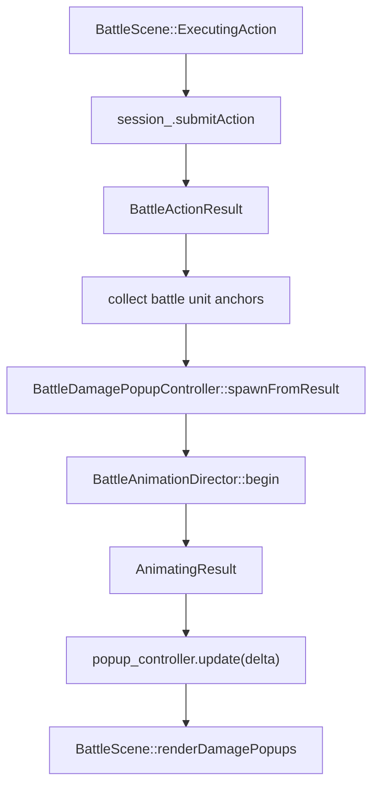

# 1.3 伤害数字飘字开发计划

## 目标

为战斗场景补充 RPG Maker 风格的 DamagePopup，在攻击 / 技能 / 道具结算后显示短暂飘字：

- 红字：HP 伤害。
- 绿字：HP 恢复。
- 蓝字：MP 变化。
- 灰字：`Miss` / 无效反馈。
- 黄字：`Critical!` 提示。

第一阶段只做不依赖新美术资源的程序化文字飘字。飘字属于表现层，不修改 `BattleSession`、`BattleActionResolver`、`BattleUnit` 的结算结构。

## 实现思路

新增 `BattleDamagePopupController`，负责把 `BattleActionResult` + 战斗表现层单位锚点转换成一组短生命周期 popup，并在每帧推进延迟、位置、透明度和缩放。

`BattleScene` 在 `session_.submitAction()` 返回后、`battle_animation_director_.begin(...)` 前生成 popup。这个时机和 1.2 演出一致：结果字段已经可用，角色阵型坐标仍可从 `BattleSpriteComponent::screen_position` 读取。

渲染采用 `engine::render::TextRenderer`，而不是 RmlUi 动态 DOM：

- 飘字锚点来自战斗角色的 formation screen position。popup 不跟随攻击 hop、受击 shake 或 KO 下沉旋转；即使目标被击倒，数字仍从原阵型头顶飘出。
- `BattleDamagePopup` 保存 screen position，渲染时再通过当前 `Camera::screenToWorld()` 转换为世界坐标。这样未来加入相机 shake 时，popup 仍保持在逻辑屏幕锚点附近，不会因为保存旧 world position 而额外抖动。
- 绘制顺序放在战斗角色 / 阴影之后、RmlUi HUD 之前。
- 文字样式通过 `TextRenderOverrides` 控制颜色、阴影和缩放，不新增纹理资源。
- 现有管线中 `TextRenderer` 写入 scene pass，不写 emissive pass；当前 bloom 只处理 emissive，因此伤害数字不会被 bloom 拉糊。若以后 scene pass 也参与 bloom，再考虑迁移到 overlay text API。

第一阶段对 `BattleActionResult::target_id == std::nullopt` 的全体技能 / 全体道具不按阵营猜测多个目标。当前 result 只有聚合数值，没有 per-target effects；因此先降级为施放者附近的聚合 popup，等后续 `BattleActionResult` 支持逐目标结果后再扩展。

与 1.2 演出的命中帧对齐是第一阶段的必要设计，而不是后续 fallback。当前 `BattleAnimationDirector` 的受击反馈从约 `0.22s` 开始，因此 popup 生成后先进入 `delay_seconds` hold，直到 impact delay 到达才开始上飘和淡出。未来如果 director 暴露 `BattleVisualEvent` / impact query，可把 delay 替换为事件触发。

## 需要新增的文件

- `src/game/scene/battle_damage_popup_controller.h`
  - 定义 `BattleDamagePopupController`、`BattleDamagePopup`、`BattleDamagePopupKind`、`BattleDamagePopupLayoutConfig`、`BattleDamagePopupTimingConfig`。
- `src/game/scene/battle_damage_popup_controller.cpp`
  - 实现 popup 生成、动画更新、过期清理、格式化与颜色策略。
- `src/game/scene/battle_presentation_unit_anchor.h`
  - 定义共享的战斗表现层单位锚点结构，字段等价于当前 `BattleAnimationSpriteSnapshot`：`unit_id`、`side`、`base_screen_position`、`alive_after`。
- `tests/game/battle/battle_damage_popup_controller_test.cpp`
  - 纯逻辑测试，不依赖 OpenGL / RmlUi。

需要修改：

- `src/CMakeLists.txt`
  - 加入 controller 源文件。
- `tests/CMakeLists.txt`
  - 加入 controller 测试。
- `src/game/scene/battle_animation_director.h/.cpp`
  - 轻度重构：使用共享 `BattlePresentationUnitAnchor`，避免 animation director 和 damage popup 各自定义重复快照。
- `src/game/scene/battle_scene.h/.cpp`
  - 持有 controller，结算后 spawn，update/render 阶段绘制。
- `tests/game/battle/battle_scene_smoke_test.cpp`
  - 补充 BattleScene 接线回归检查。

## Popup 数据结构

`BattleDamagePopup` 建议只保存表现层必要数据：

- `text`：显示字符串，例如 `24`、`+18`、`Miss`、`Critical!`。
- `kind`：决定默认颜色和动画风格。
- `base_screen_position`：生成时的屏幕锚点。
- `offset`：随时间变化的屏幕偏移。
- `delay_seconds`：命中前等待时间；延迟结束后才开始播放 popup 动画。
- `elapsed_seconds` / `duration_seconds`：生命周期。
- `alpha` / `scale`：渲染态。
- `lane_index`：同一帧多个 popup 的横向错位，避免重叠。

Controller 不持有 `entt::registry`、`Context`、`TextRenderer` 或 `Camera`。它只输出待绘制的 popup 状态，便于单测。

`BattleDamagePopupKind` 用枚举区分 `HpDamage` / `HpRecover` / `MpRecover` / `Miss` / `Critical`。颜色、默认时长、默认阴影、默认 scale 建议用 free function 或局部 helper 映射，不把样式 switch 混进 `update()` 主流程。

时长、偏移、impact delay、字体大小等调参值集中放在 `.cpp` 顶部匿名 namespace，或收进 `BattleDamagePopupLayoutConfig` / `BattleDamagePopupTimingConfig`。第一阶段不新增 JSON。

## 动画设计

### 普通伤害

- 默认 `delay_seconds` 约 `0.22s`，与现有受击 feedback 起点对齐。
- 总时长约 `0.85s`。
- `0.00s - 0.12s`：轻微放大，制造命中感。
- `0.12s - 0.65s`：向上飘动，使用 ease-out。
- `0.55s - 0.85s`：alpha 衰减到 0。

### 恢复 / MP

- 总时长略短，约 `0.75s`。
- 恢复数字带 `+` 前缀。
- 颜色分别为绿色 / 蓝色，动画幅度比伤害小。

### Miss / Critical

- `Miss` 使用灰白色，轻微横向漂移，delay 与 impact frame 对齐。
- `Critical!` 使用黄色，先在 impact frame 弹出再快速淡出。
- 若同一结果既 critical 又有伤害，先 spawn `Critical!`，伤害数字的 `delay_seconds` 在 impact delay 基础上再增加约 `0.10s - 0.15s`。
- `lane_index` 只作为同时刻多 popup 的兜底错位，例如 HP 和 MP 同时恢复；不要用并排错位代替 Critical 与伤害数字的先后关系。

## 实现步骤

1. 新建 `BattleDamagePopupController`
   - 提供 `spawnFromResult(result, unit_anchors)`、`update(delta_time)`、`clear()`、`activePopups()`。
   - `update()` 内部移除过期 popup，避免 `BattleScene` 管理生命周期。
   - `delta_time` 做上限 clamp，防止单帧卡顿导致动画参数异常。
   - `delay_seconds` 是一等状态：延迟期间 popup 可存在于 `activePopups()` 中，但 alpha 为 0 或 `visible == false`，不推进上飘动画。

2. 抽出表现层单位锚点
   - 新增 `BattlePresentationUnitAnchor`，替代 `BattleAnimationSpriteSnapshot` 的重复定义。
   - `BattleScene` 只采集 formation screen position，不采集 director pose 后的位置。
   - 明确 popup 不跟随 hop、shake、KO 下沉或旋转；这是为了让伤害数字稳定表达“命中位置”，而不是依附尸体或临时位移。
   - target popup 锚点建议在角色阵型点上方，例如 `base_screen_position + glm::vec2{0, -52}`；具体偏移先用局部常量。

3. 从 `BattleActionResult` 生成 popup
   - `status == Rejected` 不生成 popup。
   - `missed == true` 且有明确 target 时生成 `Miss`。
   - `damage > 0` 生成 HP 伤害数字。
   - `hp_recovered > 0` 生成 `+N` HP 恢复数字。
   - `mp_recovered > 0` 生成 `+N` MP 恢复数字。
   - `mp_spent > 0` 第一阶段不默认生成 popup，避免施法消耗和目标反馈混在一起；若后续需要，可在 actor 附近显示蓝色 `-N MP`。
   - `critical == true` 生成 `Critical!`，伤害数字稍晚出现。
   - `states_added` / `states_removed` 第一阶段不生成 popup；状态变化更适合后续战斗日志和状态图标专项。

4. 处理无明确 target 的结果
   - `target_id` 存在时，popup 锚定目标。
   - `target_id` 不存在但有数值反馈时，popup 锚定 actor，文本用聚合值。
   - 文档和测试明确这是临时降级策略；后续 per-target result 出现后再改为逐目标 popup。

5. 接入 `BattleScene` 更新流程
   - `clean()` / `onExit()` 时调用 `popup_controller.clear()`。
   - `update()` 或 `runStateMachine()` 每帧调用 `popup_controller.update(delta_time)`。
   - 在 `ExecutingAction` 结算后立即 `spawnFromResult()`，再启动 action/hit animation director；popup 通过自身 `delay_seconds` 与 impact frame 对齐。
   - 普通 attack、敌方 attack、伤害技能第一阶段都使用现有 hit feedback 起点附近的默认 delay；Critical 与数字使用 stagger delay。

6. 接入渲染
   - `BattleScene::render()` 中在 `battle_render_system_.renderPrepared(...)` 后调用 `renderDamagePopups()`。
   - `renderDamagePopups()` 使用 `context_.getTextRenderer()` 和默认字体 `engine::resource::defaults::UI_DEFAULT_FONT_ID`。
   - popup 字号第一阶段固定为 `20px`，必须在 `initPresentation()` 同步预加载；不要等第一次 popup 出现时按需加载，避免首次飘字卡顿。
   - `clean()` 不主动卸载 popup 字体，因为默认字体属于共享资源。
   - 绘制前用 `TextRenderer::getTextSize()` 做居中对齐，位置由 `camera.screenToWorld(popup.screen_position)` 转换。
   - 使用 `TextRenderOverrides` 设置颜色、阴影、glyph scale 和 alpha；颜色 alpha 保持适度，不使用 emissive。

7. 补充测试
   - Controller 单测覆盖 HP 伤害 popup 文本 / kind / 锚点。
   - Controller 单测覆盖 HP 恢复、MP 恢复、Miss、Critical。
   - Controller 单测覆盖 delay 期间不显示、不上飘，delay 后开始动画。
   - Controller 单测覆盖 Critical 先出现、伤害数字延迟约 `0.10s - 0.15s`。
   - Controller 单测覆盖 update 后 y 上飘、alpha 衰减。
   - Controller 单测覆盖 `duration_seconds` 结束后 `activePopups()` 变空，避免生命周期累积回归。
   - Controller 单测覆盖无 target 的聚合降级策略。
   - Smoke 测试检查 `BattleScene` 持有 `BattleDamagePopupController`、结算后调用 `spawnFromResult()`、render 中调用 `renderDamagePopups()`。

8. 手动验证
   - `battle_tester` 中普通攻击命中时，目标上方出现红色伤害数字，随时间上飘并淡出。
   - 治疗技能 / 道具出现绿色 `+N`。
   - MP 恢复出现蓝色 `+N`。
   - Miss / Critical 测试数据能显示对应文字。
   - 确认 popup 在角色和背景之上、HUD 之下，不遮挡菜单操作。

## 待办清单

- [ ] 新增 `BattleDamagePopupController` 头 / 源文件。
- [ ] 新增 `BattleDamagePopupKind`、`BattleDamagePopup`、`BattleDamagePopupLayoutConfig`、`BattleDamagePopupTimingConfig`。
- [ ] 抽出共享 `BattlePresentationUnitAnchor`，并让 animation director / damage popup 复用。
- [ ] 实现 `spawnFromResult()` 的 HP 伤害 / HP 恢复 / MP 恢复 / Miss / Critical 生成规则。
- [ ] 实现 `delay_seconds`，默认与 1.2 impact frame 对齐。
- [ ] 实现 Critical 与伤害数字的 stagger delay。
- [ ] 实现无明确 target 时的 actor 聚合 popup 降级策略。
- [ ] 实现 popup update、ease-out 上飘、alpha 衰减、过期清理。
- [ ] `BattleScene` 持有 popup controller。
- [ ] `BattleScene` 在 action 结算后生成 popup。
- [ ] `BattleScene` 每帧更新 popup。
- [ ] `BattleScene::renderDamagePopups()` 使用 `TextRenderer` 绘制 popup。
- [ ] `initPresentation()` 同步预加载 popup 字号字体，`clean()` 不主动卸载。
- [ ] 更新 `src/CMakeLists.txt` 与 `tests/CMakeLists.txt`。
- [ ] 新增 controller 单测。
- [ ] 更新 `BattleSceneSmokeTest`。
- [ ] 运行 `ninja -C build game_tests`。
- [ ] 运行 `ninja -C build battle_tester`。
- [ ] 手动截图或录屏确认伤害 / 恢复 / Miss / Critical 飘字效果。

## 风险与边界

- 当前 `BattleActionResult` 只有单个 `target_id` 和聚合数值；多目标、多段 hit、吸收 / 弱点 / 抵抗等逐目标文字不在第一阶段解决。
- 无明确 target 的 actor 聚合 popup 是为未来 per-target result 预留的降级路径；以当前结算结构，第一阶段主要触发面仍是单目标结果。
- 状态变化不使用 damage popup 表达，后续交给战斗日志、状态图标或专门的状态提示。
- `TextRenderer` 的 `getTextSize()` 会参与居中，若每帧频繁生成大量不同字符串，布局缓存压力会上升。第一阶段 popup 数量很少，可接受；后续若有多段技能可考虑缓存数字尺寸。
- Popup 绘制不参与 `RenderSystem` y-sort，而是作为战场上层反馈统一画在角色之后。这符合伤害数字语义；不要用它表达实体遮挡关系。
- 第一阶段不新增音效或 Effekseer 事件；如果后续需要与 impact frame 精准同步，可让 `BattleAnimationDirector` 发出 visual event 后再触发 popup。

## 需要确认的问题

暂无阻塞问题。后续如果希望飘字完全贴近 RPG Maker，需要再决定是否使用数字贴图，而不是字体渲染。
