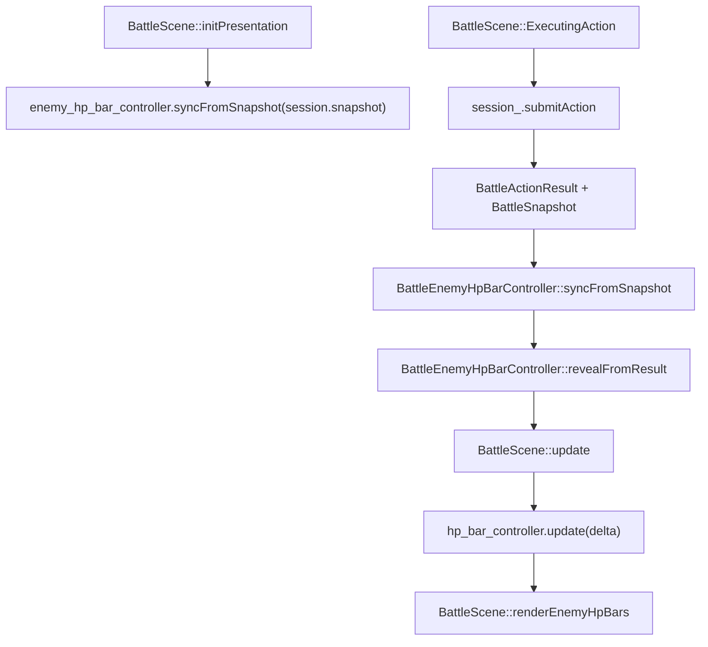

# 1.4 敌方 HP 条开发计划

## 目标

为战斗场景补充敌方 mini HP bar，让玩家能在攻击后快速判断敌人剩余血量。

第一阶段只做敌方血条，不改变 `BattleSession`、`BattleActionResolver`、`BattleUnit` 的领域数据结构。HP 条属于战斗表现层，渲染在战斗角色之上、伤害飘字之下、RmlUi HUD 之下。

默认行为采用“首次产生可见反馈后显示，数秒后淡出”的 RPG 常见方案：

- 敌方受到伤害、被治疗、被选为目标时显示 HP 条。
- HP 条显示约 `3s`，之后淡出。
- 目标选择阶段被光标指向的敌人持续显示并高亮。
- 离开目标选择后，仅因光标扫过而显示的 HP 条立即开始淡出；真正受击触发的 HP 条继续按 `3s` 倒计时。
- KO 敌人的 HP 条在短暂显示空条后淡出，不常驻。

后续如果需要调试或更接近某些 JRPG 的信息透明度，可再加 `Always` 模式；第一阶段先不引入 JSON 配置。

## 实现思路

新增 `BattleEnemyHpBarController`，它只保存每个敌方单位的表现层状态：

- 当前 HP / Max HP 快照。
- 当前显示比例 `display_ratio`，用于血条宽度平滑追随真实血量。
- 目标比例 `target_ratio`，来自 `BattleUnit::hp / max_hp`。
- `ratio_change_delay_seconds_remaining`，用于让血条扣减与 1.2 命中帧、1.3 飘字出现时机对齐。
- `visible_seconds_remaining`，只记录真实受击 / 回复 reveal 的显示倒计时。
- `highlighted`，只记录目标选择阶段的强制显示，不刷新 reveal 倒计时。

Controller 不持有 `entt::registry`、`Context`、`Camera`、`Renderer`。它接收纯数据快照，输出可绘制的 HP bar 状态，便于单测。

`BattleScene` 负责三件事：

1. 战斗表现初始化完成后先同步一次 `session_.snapshot()`，保证第一次目标选择时敌方 HP 比例已经初始化。
2. 在结算后、目标选择变化时通知 controller 哪些敌人需要显示。
3. 在 render 阶段收集敌方 `BattleSpriteComponent::screen_position` 与 `SpriteComponent::size_ / pivot_`，把 controller 输出的状态转换成屏幕矩形，再用 `engine::render::Renderer::drawFilledRect()` 绘制。

## 需要新增的文件

- `src/game/scene/battle_enemy_hp_bar_controller.h`
  - 定义 `BattleEnemyHpBarController`、`BattleEnemyHpBarState`、`BattleEnemyHpBarConfig`。
- `src/game/scene/battle_enemy_hp_bar_controller.cpp`
  - 实现敌方快照同步、显示触发、比例平滑、自动隐藏和过期清理。
- `tests/game/battle/battle_enemy_hp_bar_controller_test.cpp`
  - 纯逻辑单测，不依赖 OpenGL / RmlUi。

需要修改：

- `src/CMakeLists.txt`
  - 加入 controller 源文件。
- `tests/CMakeLists.txt`
  - 加入 controller 测试。
- `src/game/scene/battle_scene_types.h`
  - 在 `BattleScenePresentationOptions` 挂载 `BattleEnemyHpBarConfig enemy_hp_bar_config{}`，第一阶段只用默认值，不接 JSON。
- `src/game/scene/battle_scene.h/.cpp`
  - 持有 controller，初始化同步 snapshot，结算后 reveal，update 中推进，render 中绘制。
- `tests/game/battle/battle_scene_smoke_test.cpp`
  - 补充 BattleScene 接线回归检查。

## 数据结构

`BattleEnemyHpBarConfig` 建议字段：

- `glm::vec2 size{52.0f, 5.0f}`：血条主体尺寸。
- `float border_thickness{1.0f}`：外框厚度。
- `float above_sprite_margin{6.0f}`：血条与敌方精灵顶部之间的屏幕间距。
- `float reveal_seconds{3.0f}`：真实行动反馈触发后的显示时长。
- `float fade_seconds{0.35f}`：隐藏前淡出时长。
- `float ratio_lerp_speed{10.0f}`：显示比例追随真实比例的速度。
- `float change_delay_seconds{0.22f}`：血量比例开始变化前的延迟，对齐 `BattleDamagePopupTimingConfig::impact_delay_seconds`。

`BattleEnemyHpBarState` 建议字段：

- `unit_id`：敌方单位 ID。
- `hp` / `max_hp`：最近同步的血量。
- `target_ratio`：真实血量比例，范围 `[0, 1]`。
- `display_ratio`：绘制用比例，平滑靠近 `target_ratio`。
- `ratio_change_delay_seconds_remaining`：血量变化后到 impact frame 前的等待时间。
- `visible_seconds_remaining`：受击 / 回复 reveal 的剩余显示时间。
- `highlighted`：目标选择阶段是否高亮。
- `alpha`：绘制透明度。
- `initialized`：首次同步标记；首次同步直接令 `display_ratio = target_ratio`，不做平滑。

不在第一阶段加入 `change_flash_seconds` 或类似字段。受击强调已经由 1.2 的 hit feedback 与 1.3 的 damage popup 承担，HP 条只表达血量状态，避免状态机过早复杂化。

## 显示策略

第一阶段采用事件触发 + 目标选择辅助显示：

- `syncFromSnapshot(snapshot)`：
  - 对所有敌方单位更新 `hp`、`max_hp`、`target_ratio`。
  - 玩家方单位不进入 enemy HP bar controller。
  - 首次同步某个敌人时，`display_ratio` 直接设为 `target_ratio`。
  - 后续同步某个敌人且 `target_ratio` 变化时，设置 `ratio_change_delay_seconds_remaining = change_delay_seconds`，之后再让 `display_ratio` 平滑追随。
  - 即使敌人当前不可见，`update()` 也继续推进所有已记录敌人的 `display_ratio`。这样全体技能改动多个敌人后，未 reveal 的敌人也会在后台追到正确比例，下一次显示时不会从旧比例突变。
- `revealFromResult(result)`：
  - `status == Rejected` 不显示。
  - `target_id` 为敌方且 `damage > 0 || hp_recovered > 0 || mp_recovered > 0 || missed || critical || target_defeated` 时显示该敌方 HP 条。
  - 连续 reveal 同一敌人时刷新 `visible_seconds_remaining = reveal_seconds`，不叠加时长。
  - `target_id` 缺失的聚合结果第一阶段不猜测多个敌人；等后续 per-target result 再扩展。
- `setHighlightedTarget(target_id)`：
  - 目标选择阶段光标指向敌人时，该敌人 HP 条强制显示并高亮。
  - 高亮显示不写入 `visible_seconds_remaining`，不会让玩家扫过的多个敌人全部保留 `3s`。
  - 离开目标选择后取消高亮；没有真实 reveal 倒计时的 HP 条立即进入淡出，只保留 `fade_seconds`。
- KO 目标：
  - `hp == 0` 时 `target_ratio = 0`。
  - 仍允许显示空条和淡出，避免 KO 瞬间信息消失。

## 渲染设计

HP 条不使用 RmlUi 动态 DOM：

- RmlUi 适合下方 HUD 和菜单，不适合跟随战斗精灵的 world/screen overlay。
- HP 条需要和角色、阴影、伤害飘字共享战场绘制顺序。

绘制顺序：

1. `renderBattlefieldBackground()`
2. `battle_render_system_.renderPrepared(...)`
3. `renderEnemyHpBars()`
4. `renderDamagePopups()`
5. RmlUi HUD / 菜单

绘制细节：

- 使用 `BattleSpriteComponent::screen_position`、`BattleSpriteComponent::scale`、`SpriteComponent::size_`、`SpriteComponent::pivot_` 动态计算敌方精灵顶部：
  - `visual_size = sprite_component.size_ * battle_sprite.scale`
  - `top_y = battle_sprite.screen_position.y - sprite_component.pivot_.y * visual_size.y`
  - `bar_center = {battle_sprite.screen_position.x, top_y - config.above_sprite_margin - config.size.y * 0.5f}`
- 通过现有 `screenRectToWorldRect(camera, position, size)` 转为世界矩形。
- 先绘制半透明深色背景，再绘制 HP fill，再绘制 1px 外框。
- HP fill 颜色使用明确阈值常量，写在 `.cpp` 顶部：
  - `HP_BAR_WARNING_RATIO = 0.50f`：低于该值用黄色。
  - `HP_BAR_DANGER_RATIO = 0.25f`：低于该值用红色。
  - 其余为绿色。
- 高亮时外框略亮，不改变 fill 语义。
- 不显示敌人名称和数字，避免战场信息过载；精确数值后续可放进目标选择列表或 tooltip。
- KO 敌人的 HP 条故意锚定在阵型基准位置，不跟随 KO 下沉或旋转。这是为了让空 HP 条在原战斗槽位短暂淡出，避免依附倒下姿态造成读数漂移。

## 实现步骤

1. 新建 `BattleEnemyHpBarController`
   - 提供 `syncFromSnapshot(snapshot)`、`revealFromResult(result)`、`setHighlightedTarget(unit_id)`、`update(delta_time)`、`clear()`、`activeBars()`。
   - `syncFromSnapshot()` 只记录敌方单位；玩家方状态仍由下方 HUD 表达。
   - `update()` 内部推进 impact delay、ratio 平滑、reveal 倒计时和 alpha，不让 `BattleScene` 管生命周期细节。

2. 将配置挂到表现层 options
   - 在 `BattleScenePresentationOptions` 增加 `BattleEnemyHpBarConfig enemy_hp_bar_config{}`。
   - `BattleScene` 构造时用该配置初始化 `BattleEnemyHpBarController`。
   - 第一阶段不接 JSON；这样后续如果要新增数据配置，只需要扩展 schema，不需要改 controller 接口。

3. 接入初始快照同步
   - 在 `BattleScene::initPresentation()` 末尾调用 `enemy_hp_bar_controller_.syncFromSnapshot(session_.snapshot())`。
   - 首次同步时 `display_ratio = target_ratio`，避免非满血敌人在第一次目标选择时从满血平滑下落。

4. 接入行动结算
   - 在 `BattleScene::ExecutingAction` 中 `session_.submitAction()` 后调用 `syncFromSnapshot(last_action_result_->snapshot)`。
   - 再调用 `revealFromResult(*last_action_result_)`，确保受击后敌方 HP 条显示。
   - 进入新战斗或 `clean()` 时调用 `clear()`。

5. 接入目标选择高亮
   - 新增 `syncEnemyHpBarHighlight()` 或类似 helper，读取当前 `target_entry_cursor_`。
   - 当目标选择光标指向敌方时，调用 `setHighlightedTarget(target_id)`。
   - 离开目标选择后传入 `std::nullopt`，取消高亮；只有光标触发的 HP 条立即淡出，不刷新 3 秒 reveal 倒计时。

6. 接入每帧更新
   - 在 `BattleScene::update()` 中调用 `enemy_hp_bar_controller_.update(delta_time)`。
   - 放在 `runStateMachine(delta_time)` 前，与 damage popup 一致，避免刚 reveal 的条同帧少一段时间。
   - `update()` 对所有已记录敌人推进 `display_ratio`，不只推进当前 visible 的 bar。

7. 接入渲染
   - 新增 `BattleScene::renderEnemyHpBars()`。
   - 在 `battle_render_system_.renderPrepared(...)` 后、`renderDamagePopups()` 前调用。
   - 通过敌方 `BattleSpriteComponent` 查找对应 active bar；无 active bar 或 alpha <= 0 时跳过。
   - 对死敌仍按阵型位置绘制空条直到淡出，不跟随 KO 下沉旋转。

8. 补充测试
   - Controller 单测覆盖敌方 snapshot 生成 bar，玩家方不生成。
   - Controller 单测覆盖初始同步非满血敌人时 `display_ratio` 直接等于 `target_ratio`。
   - Controller 单测覆盖 `revealFromResult()` 对敌方伤害显示 HP 条。
   - Controller 单测覆盖 `change_delay_seconds` 前 `display_ratio` 不变化，延迟后再平滑靠近目标比例。
   - Controller 单测覆盖 `reveal_seconds + fade_seconds` 后自动隐藏。
   - Controller 单测覆盖连续 reveal 同一敌人刷新倒计时而不是叠加。
   - Controller 单测覆盖 `syncFromSnapshot()` 更新所有敌人，即使没有 reveal 也会后台推进 `display_ratio`。
   - Controller 单测覆盖目标选择高亮期间强制 visible。
   - Controller 单测覆盖离开目标选择后，只有高亮触发的敌人立即淡出。
   - Controller 单测覆盖 KO 后比例为 0 且仍可短暂显示。
   - Smoke 测试检查 `BattleScene` 持有 controller、初始化 / 结算后调用 `syncFromSnapshot()`、render 中调用 `renderEnemyHpBars()`。

9. 手动验证
   - `battle_tester` 中攻击敌人后，敌人头顶出现 HP 条，并在命中帧附近开始扣减。
   - HP 条在约 3 秒后淡出。
   - 目标选择阶段移动光标时，对应敌方 HP 条显示并高亮；离开目标选择后扫过的非受击敌人立即淡出。
   - KO 敌人显示空条后淡出，不遮挡伤害数字。
   - 全体技能或调试场景造成多个敌人 HP 变化后，未显示敌人下次显示时比例已正确。
   - 下方 HUD 半透明或不透明时，敌方 HP 条不进入 HUD 区域。

## 待办清单

- [x] 新增 `BattleEnemyHpBarController` 头 / 源文件。
- [x] 定义 `BattleEnemyHpBarState` 与 `BattleEnemyHpBarConfig`，补 Doxygen 注释。
- [x] 将 `BattleEnemyHpBarConfig` 挂到 `BattleScenePresentationOptions`。
- [x] 实现 `syncFromSnapshot()`，只跟踪敌方单位，并处理首次同步不平滑。
- [x] 实现 `change_delay_seconds`，让血条比例变化对齐命中帧。
- [x] 实现 `revealFromResult()`，根据行动结果触发显示并刷新倒计时。
- [x] 实现 `setHighlightedTarget()`，支持目标选择阶段强制显示和离开后淡出。
- [x] 实现 `update()` 的倒计时、淡出和 HP 比例平滑，并后台推进所有敌人。
- [x] `BattleScene` 持有 enemy HP bar controller。
- [x] `BattleScene::initPresentation()` 末尾同步初始 snapshot。
- [x] `BattleScene` 在行动结算后同步 snapshot 并 reveal。
- [x] `BattleScene` 在目标选择变化时更新 highlighted target。
- [x] `BattleScene::renderEnemyHpBars()` 基于精灵尺寸动态计算锚点，并绘制背景、fill、外框。
- [x] 将 HP 条绘制顺序放在角色之后、伤害飘字之前。
- [x] `clean()` / 新战斗重置时清空 controller。
- [x] 更新 `src/CMakeLists.txt` 与 `tests/CMakeLists.txt`。
- [x] 新增 controller 单测。
- [x] 更新 `BattleSceneSmokeTest`。
- [x] 运行 `ninja -C build game_tests`。
- [x] 运行 `./build/tests/game_tests` 或相关过滤测试。
- [x] 运行 `ninja -C build battle_tester`。
- [ ] 手动截图或录屏确认敌方 HP 条效果。

## 风险与边界

- 当前 `BattleActionResult` 仍是单目标聚合结果；全体技能第一阶段无法逐敌触发 reveal，但 `syncFromSnapshot()` 会更新所有敌方比例，避免下次显示时跳变。
- HP 条不参与 `RenderSystem` y-sort，而是作为战场 overlay 统一绘制在角色之后。这符合 UI 语义；不要用它表达实体遮挡。
- 目标选择阶段的 HP 条是信息辅助，不代替未来的目标详情面板。
- 第一阶段不把显示模式写入 JSON；如果后续要支持 Always / OnDamage / TargetOnly，可在现有 `BattleEnemyHpBarConfig` 基础上扩展。
- 即使第一阶段基于精灵尺寸动态计算锚点，极端体型或特效型敌人仍可能需要 per-enemy UI anchor；后续可在 enemy 数据或 blueprint 中补字段。

## 需要确认的问题

暂无阻塞问题。默认采用“受击后显示 3 秒 + 目标选择时显示”的方案；如果你希望敌方 HP 条始终常驻，实现时可以把 reveal 策略改成 `Always`。
