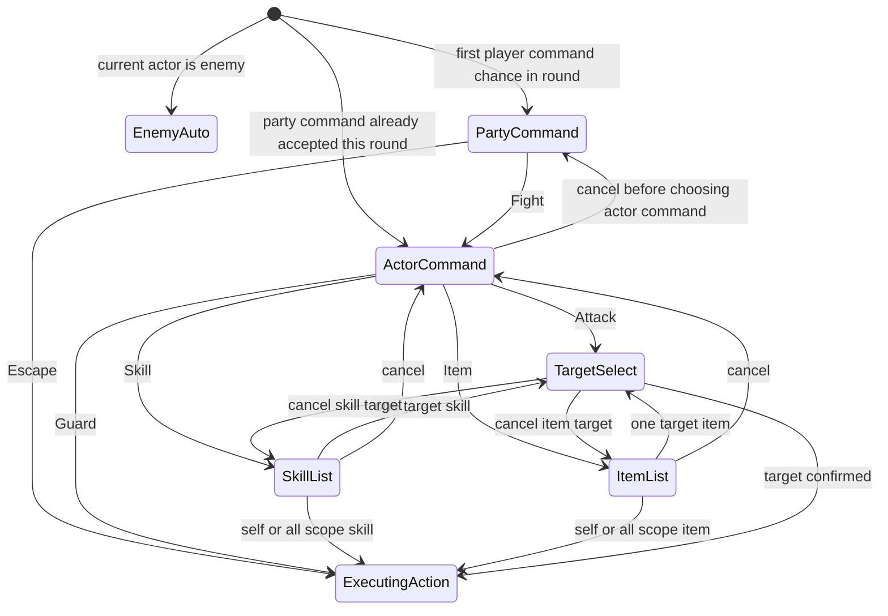

# 2.3 命令面板对齐 RPG Maker 习惯开发计划

## 目标

将当前战斗命令面板从“六项玩家主菜单”调整为更接近 RPG Maker MV/MZ 的两层命令结构：

- 队伍命令层：`Fight / Escape`
- 角色命令层：`Attack / Skill / Guard / Item`
- `Escape` 不再出现在角色命令中，只能从队伍命令层触发。
- `End Turn` 不再作为玩家可见命令；玩家想跳过行动时使用 `Guard`。
- 保留当前即时结算的 `BattleSession` / `TurnCore` 架构，不在本阶段改成“全队先输入指令再统一执行”的完整 RPG Maker 回合输入模型。

第一阶段重点是玩家可见菜单习惯、输入状态机和 RmlUi 表现层。领域层的 `BattleActionType::EndTurn` 可暂时保留为 AI / 调试 / 无目标 fallback 的内部动作，避免这次 UI 调整扩大为战斗领域模型清理。

## 当前上下文

- `BattleScene` 当前只有 `MenuState::MainMenu / SkillList / ItemList / TargetSelect`，`MainMenu` 直接显示六项：`Attack / Skill / Item / Guard / Escape / End Turn`。
- `ui/rmlui/scenes/battle.rml` 使用 `main_actions` 渲染主命令网格，列表菜单和目标菜单已经是数据驱动。
- `BattleScene` 的输入逻辑已经集中在 `onMenuUp/Down/Left/Right/Confirm/CancelPressed()`，适合扩展为多命令层状态机。
- `TurnCore` 以速度排序即时推进当前行动者；当前没有 RPG Maker 那种“队伍输入阶段”和“行动执行阶段”分离。
- `BattleSession` 已暴露 `currentActorId()`、`turnOrder()`、`units()`，但没有轻量 `roundIndex()` 访问器；如果要让队伍命令每轮只弹一次，建议补一个只读访问器而不是每次复制完整 `BattleSnapshot`。
- `BattleActionResolver` 已支持 `Escape`，失败时推进当前行动者；本阶段先复用该规则，不新增 party-level escape 领域动作。

## 设计边界

本计划做：

- 新增 PartyCommand 层，第一位玩家行动机会出现时先弹 `Fight / Escape`。
- 选 `Fight` 后进入当前行动者的 ActorCommand。
- 选 `Fight` 后，同一轮内后续玩家行动者默认直接进入 ActorCommand，不重复弹 PartyCommand。
- 选 `Escape` 时用当前玩家行动者提交现有 `BattleActionType::Escape`；如果逃跑失败，本轮后续玩家行动机会仍可重新看到 PartyCommand。
- 从玩家 UI 中移除 `End Turn`。

本计划不做：

- 不把战斗系统改为完整 RPG Maker 的“全队指令录入后再按速度执行”。
- 不重写逃跑概率或逃跑失败后的整队惩罚规则。
- 不删除领域层 `BattleActionType::EndTurn`，除非后续单独做 action model cleanup。
- 不新增鼠标以外的复杂说明 UI；命令层只依赖现有 `menu_*` 输入。

## 目标交互



## 数据与状态方案

### 菜单状态

将 `BattleScene::MenuState` 调整为：

```cpp
enum class MenuState {
    None,
    PartyCommand,
    ActorCommand,
    SkillList,
    ItemList,
    TargetSelect
};
```

`MainMenu` 语义拆成两层后，不建议继续沿用旧名，避免后续阅读时误判 `Escape` 和 `End Turn` 的归属。

### 命令 ViewModel

把当前 `MainActionViewModel` 重命名并收敛为通用命令视图模型，连同 `main_action_*` data binding 名称一起清理，避免“主动作”旧语义继续泄漏到 PartyCommand / ActorCommand 两层结构中：

```cpp
struct CommandViewModel {
    int command_id{0};
    int entry_index{0};
    Rml::String label{};
    bool enabled{false};
};
```

`BattleScene` 持有两组命令和两个 cursor：

- `std::vector<CommandViewModel> party_commands_`
- `std::vector<CommandViewModel> actor_commands_`
- `int party_command_cursor_{0}`
- `int actor_command_cursor_{0}`

### 命令 ID

```cpp
enum class PartyCommandId : int {
    Fight = 1,
    Escape = 2
};

enum class ActorCommandId : int {
    Attack = 1,
    Skill = 2,
    Guard = 3,
    Item = 4
};
```

这两个 enum 沿用当前 `MainActionId` 的做法，放在 `battle_scene.cpp` 匿名 namespace 中，作为 BattleScene 私有实现细节，不写入头文件，也不作为对外 UI / 领域契约。

角色命令顺序固定为 RPG Maker 习惯的 `Attack / Skill / Guard / Item`。RML 网格按两列显示时为：

```text
Attack   Skill
Guard    Item
```

### 每轮队伍命令门禁

新增轻量字段记录本轮是否已经通过队伍命令：

```cpp
std::optional<std::uint32_t> party_command_accepted_round_{};
bool actor_command_entered_via_fight_this_step_{false};
```

建议在 `BattleSession` 增加：

```cpp
[[nodiscard]] std::uint32_t roundIndex() const;
```

判断规则：

- 当前行动者不是玩家：不显示队伍命令。
- `party_command_accepted_round_ != session_.roundIndex()`：显示 `PartyCommand`。
- `party_command_accepted_round_ == session_.roundIndex()`：显示 `ActorCommand`。

交互细节：

- 选择 `Fight`：设置 `party_command_accepted_round_ = session_.roundIndex()`，进入 `ActorCommand`。
- 只有 `handlePartyCommand(Fight)` 进入 `ActorCommand` 时设置 `actor_command_entered_via_fight_this_step_ = true`。
- 在这次刚进入的 `ActorCommand` 中按取消：清除 `party_command_accepted_round_` 和 `actor_command_entered_via_fight_this_step_`，返回 `PartyCommand`。
- 玩家一旦选择任何 actor command 分支（`Attack / Skill / Guard / Item`），立即清除 `actor_command_entered_via_fight_this_step_`；之后从技能、道具或目标选择退回 ActorCommand 时，不再继续回到 PartyCommand。
- 选择 `Escape`：不设置 `party_command_accepted_round_`，直接提交现有 `Escape` action。
- `Escape` 成功：战斗结束，门禁状态不再参与后续流程。
- `Escape` 失败：由于未设置 `party_command_accepted_round_`，同一轮后续玩家行动机会仍会显示 `PartyCommand`。
- 玩家提交任意 actor action 后保持该 round 已接受，后续同轮玩家不再弹 `PartyCommand`。
- round index 增加后自然重新允许 PartyCommand，不需要额外 reset。

这能在现有即时回合系统上得到“每轮先问 Fight / Escape”的体验，同时避免玩家选择 `Fight` 后每个玩家角色都重复弹逃跑选项。

## UI 布局方案

### RML

在 `#battle-command-panel` 中拆分两个顶层命令容器：

- `#battle-party-command`，绑定 `party_command_visible`
- `#battle-actor-command`，绑定 `actor_command_visible`

示意：

```xml
<div id="battle-party-command" data-if="party_command_visible">
    <button data-for="command : party_commands"
            id="battle-party-command-{{ command.entry_index }}"
            data-event-click="party_command_select(command.entry_index)">
        {{ command.label }}
    </button>
</div>

<div id="battle-actor-command" data-if="actor_command_visible">
    <button data-for="command : actor_commands"
            id="battle-actor-command-{{ command.entry_index }}"
            data-event-click="actor_command_select(command.entry_index)">
        {{ command.label }}
    </button>
</div>
```

保留现有 `#battle-list-menu`、`#battle-target-menu` 结构，只把返回目标从旧 `MainMenu` 改为 `ActorCommand`。

### RCSS

- `#battle-party-command` 使用纵向 2 个全宽按钮，强调这是战斗开始的队伍级选择。
- `#battle-actor-command` 使用 2x2 网格，复用现有按钮视觉。
- 两个命令容器都固定 `width: 168dp`，高度不随条目数量抖动。
- 保持 `tf-nav-auto`，确保键盘/手柄方向键与确认键仍可用。
- 不新增说明文字面板，不把命令面板做成嵌套卡片。

建议尺寸：

- PartyCommand button：`168dp x 22dp`，纵向 `gap: 4dp`。
- ActorCommand button：`82dp x 18dp`，两列 `gap: 4dp`。
- `#battle-back-hint` 继续放底部，PartyCommand 下为空，ActorCommand 可在可返回队伍命令时显示 `Cancel: Party`。

## 输入规则

- `PartyCommand`
  - `Up/Down`：在 `Fight / Escape` 间移动。
  - `Left/Right`：可按一维列表处理，复用移动逻辑但不改变布局。
  - `Confirm`：执行 `handlePartyCommand()`。
  - `Cancel`：吞掉输入，不关闭战斗菜单。
- `ActorCommand`
  - `Up/Down`：按两列网格移动，步长为 `ACTOR_COMMAND_COLUMNS`。
  - `Left/Right`：左右移动，步长为 1。
  - `Confirm`：执行 `handleActorCommand()`。
  - `Cancel`：只有 `actor_command_entered_via_fight_this_step_` 为 true 时返回 `PartyCommand`；否则吞掉输入。
- `SkillList / ItemList`
  - `Cancel` 返回 `ActorCommand`。
- `TargetSelect`
  - `Cancel` 返回发起来源：技能返回 `SkillList`，道具返回 `ItemList`，普通攻击返回 `ActorCommand`。

`menuStateForActionDraftSource()` 中 `Attack` 的返回状态需要从旧 `MainMenu` 改为 `ActorCommand`。

## 实现步骤

1. 拆分命令状态
   - 将 `MenuState::MainMenu` 替换为 `PartyCommand` 和 `ActorCommand`。
   - 新增 `PartyCommandId`、`ActorCommandId`。
   - 两个新 enum 放在 `battle_scene.cpp` 匿名 namespace 中，不外露到 `battle_scene.h`。
   - 将 `MAIN_ACTION_COLUMNS` 改为 `ACTOR_COMMAND_COLUMNS = 2`，如需要增加 `PARTY_COMMAND_COLUMNS = 1`。

2. 扩展 BattleSession 轻量访问器
   - 在 `BattleSession` 增加 `roundIndex()` const。
   - `BattleScene` 使用该访问器判断本轮是否需要弹 PartyCommand。
   - 不通过 `snapshot()` 获取 round，避免每次进入菜单复制 units / states。

3. 重建命令 ViewModel
   - 将 `MainActionViewModel` 重命名为 `CommandViewModel`。
   - 将 `main_actions_` 替换为 `party_commands_` 与 `actor_commands_`。
   - 新增 `populatePartyCommands()`：生成 `Fight / Escape`。
   - 新增 `populateActorCommands()`：生成 `Attack / Skill / Guard / Item`。
   - 删除玩家可见 `End Turn` 条目。
   - 从 `BattleScene` 删除或闲置 `queueEndTurnAction()`；不再由 UI 调用。
   - grep `BattleActionType::EndTurn`，确认 `BattleAiPlanner`、`BattleActionResolver`、测试和调试路径仍闭合，不受 UI 调整波及。

4. 改造进入菜单流程
   - 将 `enterInputMenu()` 改为根据 `shouldOpenPartyCommand()` 进入 `PartyCommand` 或 `ActorCommand`。
   - 选择 `Fight` 后设置 `party_command_accepted_round_` 并进入 `ActorCommand`。
   - 选择 `Escape` 时不设置 `party_command_accepted_round_`，直接提交 `BattleActionType::Escape`。
   - 敌方行动仍走 `buildEnemyAction()`。

5. 改造输入和 focus
   - `syncMenuFocus()` 按 `PartyCommand / ActorCommand / SkillList / ItemList / TargetSelect` 选择不同 element id prefix。
   - `moveMenuCursor()` 根据当前状态选择对应 cursor 和 enabled vector。
   - `onMenuConfirmPressed()` 分派到 `handlePartyCommand()` 或 `handleActorCommand()`。
   - `onMenuCancelPressed()` 按新返回链路处理。

6. 改造动作入口
   - 将 `handleMainAction()` 拆成 `handlePartyCommand()` 和 `handleActorCommand()`。
   - `handlePartyCommand(Fight)` 设置 `actor_command_entered_via_fight_this_step_ = true`。
   - `handleActorCommand()` 在进入任何 actor command 分支前清除 `actor_command_entered_via_fight_this_step_`。
   - `queueAttackAction()` 仍默认 `OneEnemy` 并进入目标选择。
   - `queueSkillAction()`、`queueItemAction()`、`queueGuardAction()` 逻辑保持，入口改为 ActorCommand。
   - `queueEscapeAction()` 只由 PartyCommand 调用。

7. 改造 RmlUi 绑定
   - 注册并绑定 `CommandViewModel`。
   - 绑定 `party_commands`、`actor_commands`。
   - 绑定 `party_command_visible`、`actor_command_visible`。
   - 新增 `party_command_select`、`actor_command_select` data event。
   - 移除旧 `main_actions`、`main_menu_visible`、`main_action_select` 的绑定或改名后清理。

8. 改造 RML / RCSS
   - `battle.rml` 增加 PartyCommand 和 ActorCommand 两个容器。
   - `battle.rcss` 增加 `#battle-party-command`、`#battle-actor-command` 样式。
   - 确认两个新命令容器内的按钮都带 `tf-nav-auto`，让 theme 中的 `tab-index: auto` / `nav-*` 规则继续生效。
   - 确认没有 `End Turn` 文案出现在战斗命令 UI。

9. 清理测试和文档
   - 更新 `BattleSceneSmokeTest` 中旧 `MainMenu`、`main_actions`、`MAIN_ACTION_COLUMNS` 的断言。
   - 增加对 `PartyCommand`、`ActorCommand`、`Fight`、`Escape` 层级归属的 smoke 断言。
   - 如果命令门禁逻辑抽成小 helper，可补直接单元测试；否则通过源码 smoke 和 battle tester 手动验证。

## 测试计划

- `BattleSceneSmokeTest`
  - 源码中存在 `MenuState::PartyCommand` 和 `MenuState::ActorCommand`。
  - RML 中存在 `battle-party-command`、`battle-actor-command`。
  - RML 中存在 `party_command_select`、`actor_command_select`。
  - `Escape` 只出现在 party command 数据构建中，不出现在 actor command 构建中。
  - `End Turn` 不出现在 `battle.rml`，也不在 actor command 数据构建中。
  - `SkillList / ItemList` 的 cancel 返回 `ActorCommand`。
  - `onMenuCancelPressed()` 中存在从 `ActorCommand` 返回 `PartyCommand` 的显式分支，并受 `actor_command_entered_via_fight_this_step_` 保护。
  - `handlePartyCommand(Escape)` 不设置 `party_command_accepted_round_`。

- `BattleSessionTest`
  - 新增 `roundIndex()` accessor 后，确认与 `snapshot().round_index` 一致。
  - 跨轮后 `roundIndex()` 增加，供 PartyCommand 每轮重新出现。

- RmlUi 回归测试
  - `battle.rcss` 保持 `tab-index` 由 `tf-nav-auto` 覆盖。
  - PartyCommand 与 ActorCommand 均有固定尺寸，不影响 `battle-hud` 高度。
  - 不引入 RmlUi 不支持的 `border: 1dp solid ...` 写法。

- 手动验证
  - 运行 `ninja -C build game_tests`。
  - 运行 `./build/tests/game_tests --gtest_filter='*BattleSceneSmoke*:*BattleSession*:*BattleActionResolver*'`。
  - 运行 `ninja -C build battle_tester`。
  - 在 `battle_tester` 中确认：
    - 新一轮第一个玩家行动机会先显示 `Fight / Escape`。
    - 选 `Fight` 后显示 `Attack / Skill / Guard / Item`。
    - 刚进入 ActorCommand 时按 Cancel 能回到 `Fight / Escape`；第二次选 `Fight` 后行为一致。
    - 进入技能、道具或目标选择后再退回 ActorCommand，不会错误回到 PartyCommand。
    - `Escape` 不在角色命令中。
    - `Escape` 失败后，同轮后续玩家行动机会仍显示 `Fight / Escape`。
    - `End Turn` 不可见。
    - 技能、道具、目标选择的取消链路正确。
    - 选择 Guard 可作为跳过/防御回合的玩家行为。

## 待办清单

- [ ] `BattleSession` 增加 `roundIndex()` const 访问器。
- [ ] `BattleScene::MenuState` 拆分为 `PartyCommand` 和 `ActorCommand`。
- [ ] 新增 `PartyCommandId` 和 `ActorCommandId`。
- [ ] 新增或重命名为 `CommandViewModel`。
- [ ] 新增 `party_commands_ / actor_commands_`。
- [ ] 新增 `party_command_cursor_ / actor_command_cursor_`。
- [ ] 新增 `party_command_accepted_round_`。
- [ ] 新增 `actor_command_entered_via_fight_this_step_`。
- [ ] 实现 `shouldOpenPartyCommand()`。
- [ ] 实现 `populatePartyCommands()`。
- [ ] 实现 `populateActorCommands()`。
- [ ] 将 `enterInputMenu()` 改为选择 PartyCommand 或 ActorCommand。
- [ ] 拆分 `handleMainAction()` 为 `handlePartyCommand()` 和 `handleActorCommand()`。
- [ ] `handlePartyCommand(Escape)` 不设置 `party_command_accepted_round_`。
- [ ] `handleActorCommand()` 在进入具体动作分支前清除 `actor_command_entered_via_fight_this_step_`。
- [ ] 确保 `queueEscapeAction()` 只从 PartyCommand 调用。
- [ ] 从玩家命令 UI 删除 `End Turn`。
- [ ] grep `BattleActionType::EndTurn`，确认领域层 fallback / 测试 / 调试路径仍闭合。
- [ ] 更新 `menuStateForActionDraftSource()` 返回 `ActorCommand`。
- [ ] 更新 `onMenuCancelPressed()` 的返回链路。
- [ ] 更新 `moveMenuCursor()` 的 PartyCommand 一维导航和 ActorCommand 二维导航。
- [ ] 更新 `syncMenuFocus()` 的 element id prefix。
- [ ] 更新 RmlUi data model 注册和绑定。
- [ ] 更新 `battle.rml` 的命令容器。
- [ ] 更新 `battle.rcss` 的 PartyCommand / ActorCommand 布局。
- [ ] 确保新增命令按钮带 `tf-nav-auto`。
- [ ] 更新 `BattleSceneSmokeTest`。
- [ ] 更新 `BattleSessionTest`。
- [ ] 运行 `ninja -C build game_tests`。
- [ ] 运行相关 gtest filter。
- [ ] 运行 `ninja -C build battle_tester`。
- [ ] 手动验证 battle tester 命令层级和取消链路。

## 风险与边界

- 现有 `TurnCore` 是即时速度行动制，因此 PartyCommand 是“每轮第一个玩家行动机会”的 UI gate，不是完整 RPG Maker 的整队命令录入阶段。
- 逃跑失败仍复用当前 `BattleActionResolver` 规则，只推进当前行动者；如果后续要完全贴近 RPG Maker，需要新增 party-level escape 结算规则。
- 如果一轮以敌方先手开始，PartyCommand 会在第一个玩家行动者轮到时出现，而不是战斗画面一进入就出现。
- `EndTurn` 从玩家 UI 移除后，仍可能作为 AI fallback 或测试内部动作存在；后续可以单独做 `BattleActionType` 清理。
- RmlUi 按钮必须保持 `tf-nav-auto`，否则键盘/手柄导航会看似有 hover 样式但无法确认。
- `party_command_accepted_round_` 的生命周期与单场 `BattleScene` 实例绑定；当前战斗通过 push/pop 创建新实例，不需要跨战斗重置，也不要在战斗中额外 reset 到破坏每轮门禁语义。

## 需要确认的问题

暂无阻塞问题。默认采用“每轮首个玩家行动机会显示 PartyCommand，Fight 后进入当前 ActorCommand，Escape 复用现有 Escape action”的方案。
