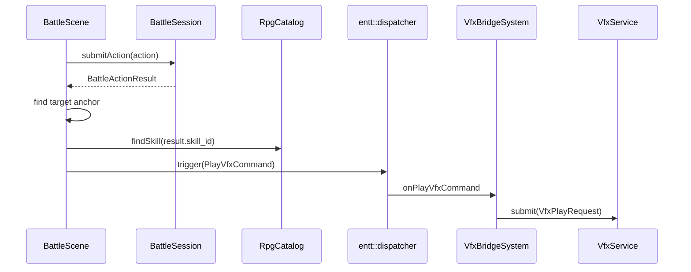

# 战斗魔法技能与 Effekseer 特效接入计划

## 目标

为当前回合制战斗补齐三名角色的早期技能定位，并让魔法 / 治疗技能在目标身上播放 Effekseer 特效。

- Alex：拥有 `skill.bash` 撞击技能；该技能已在 `assets/data/rpg/skills.json` 中存在，不需要特效。
- Lyria：拥有初级火焰与初级闪电技能，释放时在目标身上播放单体火焰 / 闪电特效。
- Tori：拥有初级治疗技能，释放时在目标身上播放单体治疗特效。

本计划优先复用现有战斗菜单、`BattleActionResolver`、`BattleAnimationDirector`、`VfxCatalog`、`VfxBridgeSystem` 和 Effekseer 双通道渲染链路，只补足 RPG 技能数据到战斗表现层的连接。

## 当前结论

- `assets/data/rpg/skills.json` 目前只有 `skill.attack`、`skill.bash`、`skill.poison_spit`。
- `assets/data/rpg/actors.json` 中 Alex 已经带有 `skill.bash`，无需新增；Lyria 作为魔法师已调整为 `class.mage`，后续技能组应移除 `skill.bash` 并换成火焰 / 闪电。
- `assets/data/rpg/classes.json` 已新增 `class.mage`，Lyria 的 MAT / MMP 明显高于剑客，避免低阶魔法用 `a.mat` 公式时弱于普通攻击。
- `assets/data/vfx_catalog.json` 目前只有示例 `laser01`，需要追加战斗技能用 effect id。
- `assets/vfx/effects` 中已有 RPG Maker 风格单体资源，可直接选用：
  - 火焰：`assets/vfx/effects/FireOne1.efkefc`
  - 闪电：`assets/vfx/effects/ThunderOne1.efkefc`
  - 治疗：`assets/vfx/effects/HealOne1.efkefc`
- 当前 VFX 播放推荐链路是 `PlayVfxCommand -> VfxBridgeSystem -> VfxCatalog -> VfxService -> EffekseerBackend`，游戏层不应直接依赖 Effekseer API。

## 数据设计

### 职业与属性

已在 `assets/data/rpg/classes.json` 新增 `class.mage`，并把 `actor.lyria` 的 `class_id` 改为 `class.mage`：

| Class ID | 定位 | MHP | MMP | ATK | DEF | MAT | MDF | AGI | LUK |
|---|---|---:|---:|---:|---:|---:|---:|---:|---:|
| `class.mage` | 魔法输出 | 420 | 82 | 11 | 12 | 30 | 24 | 27 | 30 |

这个属性让 Lyria 的普通攻击偏弱，但火焰 / 闪电能稳定高于普通攻击，并用 MP 消耗控制频率。Tori 仍保持 `class.monk`；治疗公式使用较高固定值补偿其 MAT 较低的问题，本阶段不新增 priest class。

### 技能新增

在 `assets/data/rpg/skills.json` 中新增三个技能：

| 技能 ID | 显示名 | 范围 | 命中类型 | MP | 伤害类型 | 公式建议 | 目标特效 |
|---|---|---|---|---:|---|---|---|
| `skill.fire_1` | 初级火焰 | `one_enemy` | `magical` | 4 | `hp_damage` | `a.mat * 3 - b.mdf * 2` | `battle.fire_one_1` |
| `skill.thunder_1` | 初级闪电 | `one_enemy` | `magical` | 5 | `hp_damage` | `a.mat * 3 + 8 - b.mdf * 2` | `battle.thunder_one_1` |
| `skill.heal_1` | 初级治疗 | `one_ally` | `certain` | 4 | `hp_recover` | `a.mat * 2 + 40` | `battle.heal_one_1` |

技能数值先保持低阶 Demo 体验：火焰与闪电同量级，闪电略高但 MP 更多；后续可用元素抗性、状态附加或随机浮动拉开差异。治疗选择 `one_ally`，这样 Tori 可以治疗自己或存活队友，并复用现有目标选择规则。

当前目标菜单与 resolver 都只允许选中存活单位；`skill.heal_1` 不是复活术，不能治疗已经 KO 的队友。这是本阶段的显式规则，不作为 bug 处理。

### 角色技能组

修改 `assets/data/rpg/actors.json`：

- Alex：确认并保留 `skill.attack`、`skill.bash`。
- Lyria：设为 `skill.attack`、`skill.fire_1`、`skill.thunder_1`，移除 `skill.bash`。
- Tori：建议设为 `skill.attack`、`skill.heal_1`。

### 特效目录

修改 `assets/data/vfx_catalog.json`，追加：

```json
{
  "effects": {
    "battle.fire_one_1": "assets/vfx/effects/FireOne1.efkefc",
    "battle.heal_one_1": "assets/vfx/effects/HealOne1.efkefc",
    "battle.thunder_one_1": "assets/vfx/effects/ThunderOne1.efkefc",
    "laser01": "assets/vfx/00_Basic/Laser01.efkefc"
  }
}
```

保留现有 `laser01` 映射，避免影响调试面板或已有测试夹具；新增 key 按字母序排列，方便后续浏览。

## 代码设计

### 技能表现字段

在 `game::data::SkillData` 中增加可选表现字段，例如：

```cpp
std::string target_vfx_id_{};
entt::id_type target_vfx_id_hash_{};
float target_vfx_scale_{1.0F};
```

`RpgCatalog::loadSkills()` 从 JSON 读取可选字段：

- `target_vfx_id`：为空时不播放目标特效。
- `target_vfx_scale`：可选，默认 `1.0`，必须大于 `0`。

这里不把 `.efkefc` 路径直接放进技能数据。技能只声明语义 id，真实路径由 `VfxCatalog` 负责，符合现有 VFX 架构边界。字段命名使用 `target_vfx_*`，为后续 `cast_vfx_*`、`projectile_vfx_*` 或 `impact_vfx_*` 留出命名空间。

### 播放时机

在 `BattleScene::FlowState::ExecutingAction` 中，`session_.submitAction()` 后已经会：

- 生成战斗日志；
- 更新敌方 HP 条；
- 收集 `BattlePresentationUnitAnchor`；
- 生成伤害飘字；
- 启动 `BattleAnimationDirector`。

计划在同一段流程中加入 `spawnSkillHitVfx(*last_action_result_, unit_anchors)`，在 action result 已经确定命中、目标、技能 id 后触发一次 `engine::vfx::PlayVfxCommand`。



触发条件：

- `result.status == Applied`
- `result.action_type == Skill`
- `!result.missed`
- `result.target_id.has_value()`
- `unit_anchors` 中能找到目标锚点
- 对应 `SkillData::target_vfx_id_hash_` 非 0

撞击 `skill.bash` 不配置 `target_vfx_id`，因此自然不会播放特效。

### 坐标与通道

战斗精灵锚点是屏幕逻辑坐标，不是探索地图世界坐标。为避免战斗特效被世界相机矩阵影响，战斗技能特效使用：

- `VfxChannel::Overlay`
- `world_position = target_anchor.base_screen_position + skillHitVfxOffset(...)`
- `z = 0.0F`
- `scale = skill.target_vfx_scale_`

偏移先用局部 helper 根据目标阵营 / 特效类型做轻量调整，例如治疗和单体法术默认上移 `-36px`，让特效中心靠近角色上半身。后续如果不同怪物体型差异明显，再把 `BattlePresentationUnitAnchor` 扩展出 `visual_height` 或 `effect_anchor_offset`。

### 时序

第一版用现有 `PlayVfxCommand` 立即触发目标特效，因此特效会在行动结算后立刻出现，不严格等待 `BattleAnimationDirector` 的 impact frame。这个结果可接受，但属于短期技术债：视觉上可能略早于受击 / 飘字峰值。

短期跟进项是在战斗表现层增加 `BattleVisualEvent` 或等价队列，由 `BattleAnimationDirector` 在 impact frame 派发 VFX / SFX。这样魔法特效、伤害飘字、受击 flash 可以共享同一时间点。

### 边界

- 当前 `BattleActionResult` 只有单个 `target_id` 和聚合数值，本计划只覆盖单体技能；未来 AOE 技能需要 per-target result 后再做多点播放。
- `one_ally` 只列出并允许选择存活队友；治疗不会复活 KO 单位。
- 不在 `BattleActionResolver` 中直接触发 VFX；领域层保持纯结算，不知道表现资源。
- 不修改 Effekseer 后端；现有资源加载、缓存、Layer、Y 翻转和渲染通道已经可复用。
- 本次不做音效、元素抗性、状态图标、技能学习 UI、复活术或升级曲线。

## 实施步骤

1. 更新 RPG 数据
   - 在 `skills.json` 增加 `skill.fire_1`、`skill.thunder_1`、`skill.heal_1`。
   - 给现有 `skill.attack`、`skill.bash`、`skill.poison_spit` 补显式 `mp_cost: 0`，保持数据风格一致。
   - 在 `actors.json` 确认 Alex 有 `skill.bash`，调整 Lyria / Tori 技能列表；Lyria 使用 `class.mage`。
   - 在 `vfx_catalog.json` 添加三个 battle effect id。

2. 扩展技能数据模型
   - 修改 `src/game/data/rpg_data.h` 的 `SkillData`。
   - 修改 `src/game/data/rpg_catalog.cpp` 的技能解析和校验。
   - 补充 `tests/game/rpg_catalog_test.cpp`，覆盖可选 `target_vfx_id` / `target_vfx_scale` 解析与非法 scale。

3. 接入 BattleScene 表现层
   - `battle_scene.cpp` include `engine/vfx/vfx_types.h`。
   - 新增私有 helper：`spawnSkillTargetVfx(...)`、`findUnitAnchor(...)`、`skillTargetVfxPosition(...)`。
   - 在 `ExecutingAction` 结算后、`BattleAnimationDirector::begin()` 附近触发 VFX，确保特效与伤害飘字 / impact 时间接近。
   - 记录即时播放的已知限制；短期跟进用 `BattleVisualEvent` 或表现层队列把触发移动到 impact frame。

4. 补充测试
   - `RpgCatalogTest`：技能表现字段解析。
   - `BattleSceneSmokeTest`：只做源码级回归，确认 `BattleScene` 存在 `spawnSkillHitVfx` 调用和关键 guard 条件。它不能证明 miss / 非技能 / 无目标不会运行时播放。
   - 若要真正覆盖负面分支，把 VFX 判定抽成可单测的自由函数，例如 `buildSkillTargetVfxCommand(result, skill, anchors)`，对 miss / 非技能 / 无目标 / 缺失 anchor 分别断言返回 `std::nullopt`。
   - `VfxBridgeSystemTest`：可选补充 catalog 中 `battle.fire_one_1` 路径解析，不必依赖真实 Effekseer。
   - 新增真实资源加载测试，例如 `tests/game/rpg_assets_catalog_test.cpp`：加载 `assets/data/rpg/manifest.json`、真实 RPG catalog 与 `assets/data/vfx_catalog.json`，并校验所有非空 `target_vfx_id` 都能在 `VfxCatalog` 中解析。

5. 手动验证
   - 使用 battle tester 或进入遭遇战，确认 Alex 技能列表有撞击。
   - 让 Lyria 释放初级火焰、初级闪电，目标身上出现对应 Effekseer 特效。
   - 让 Tori 对受伤且存活的队友释放初级治疗，目标身上出现治疗特效并恢复 HP。
   - 确认 KO 队友不会出现在初级治疗目标列表中；若未来需要复活，另做 `skill.revive_1`。
   - 打开 VFX debug / renderer stats，确认 OverlayVfxPass 有实例绘制，结束后实例数归零。

## 验证命令

```bash
ninja -C build game_tests
ninja -C build battle_tester
```

若只改数据与 catalog，可优先运行 RPG catalog / battle 相关测试；最终实现完成后仍建议跑完整 `game_tests`。

## 待办清单

- [x] 新增 `class.mage` 并将 Lyria 调整为魔法师职业。
- [x] 增加 `target_vfx_id` / `target_vfx_scale` 技能表现字段。
- [x] 新增火焰、闪电、治疗技能数据。
- [x] 更新 Alex / Lyria / Tori 的 `skill_ids`。
- [x] 给现有技能补显式 `mp_cost: 0`。
- [x] 更新 `assets/data/vfx_catalog.json`。
- [x] 在 `BattleScene` 根据技能结果触发 `PlayVfxCommand`。
- [x] 补充 catalog、真实资源加载与 BattleScene 回归测试。
- [ ] 短期跟进 impact-frame VFX 派发，避免即时播放与动作峰值错位。
- [x] 运行 `ninja -C build game_tests`。
- [x] 运行 `ninja -C build battle_tester`。
- [ ] 手动验证特效位置。

## 后续扩展

- 为 `BattleActionResult` 增加 per-target effects，支持 AOE 多目标特效与多段技能。
- 增加技能元素、状态附加和敌人元素抗性，让火焰 / 闪电在规则上产生差异。
- 为不同角色、怪物或大体型单位提供独立 `effect_anchor_offset`。
- 增加 `cast_vfx_id`、`projectile_vfx_id` 等字段，支持咏唱、飞行道具和目标命中特效分层。
