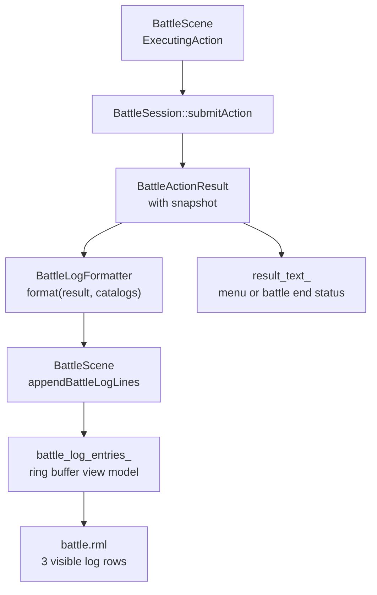

# 3.1 滚动战斗日志开发计划

## 目标

为战斗场景补充 RPG Maker 风格的滚动战斗日志，用 2-3 行持续显示最近发生的战斗事件，替代当前右上角单行 `result_text` 承担全部反馈的做法。

第一阶段只做战斗内短日志，不做独立结算界面、不做打字机逐字播放、不做可翻阅历史窗口。日志应覆盖当前 `BattleActionResult` 已有信息，并补齐技能/道具来源字段，为后续多目标技能、状态回合钩子、Victory 流程动画留下接口。

- 每次行动结算后追加一组日志行，例如 `Tori attacks Goblin!`、`Goblin takes 24 damage.`、`Goblin was defeated!`。
- 只在 HUD 中显示最近 3 行，旧日志向上滚出。
- 日志格式化从 `BattleScene` 拆出为可测试 helper，避免继续扩大 `battle_scene.cpp` 中的 `formatActionResultText()`。
- `result_text` 第一阶段只承担菜单提示和战斗终局状态；行动的命中、伤害、恢复、状态变化全部下放到滚动日志。
- 日志条目支持轻量 tone/class，便于伤害、恢复、状态、系统提示使用不同颜色。

## 当前上下文

- `BattleScene::refreshView()` 当前根据 `last_action_result_` 调用匿名 namespace 内的 `formatActionResultText()`，并把结果绑定到 `result_text_`。
- `BattleActionResult` 已包含日志所需的大部分字段：`action_type / actor_id / target_id / damage / hp_recovered / mp_recovered / mp_spent / missed / critical / target_guarded / target_defeated / escape_succeeded / states_added / states_removed / failure_reason / snapshot`。
- `BattleActionResult` 当前没有 `skill_id / item_id`；若 formatter 只接收 result，必须先补齐这两个字段，否则技能/道具名称查表契约不成立。
- `BattleActionResult::snapshot.units` 是行动后的全量单位快照，可以按 `actor_id / target_id` 查名字；目标 KO 与血量显示也应以行动后快照为准。
- `BattleScene` 已有 RmlUi data model、数组注册、`markDirty()`、菜单 focus 等基础设施，适合新增 `battle_log_entries_` 绑定。
- `ui/rmlui/scenes/battle.rml` 右上角已有 `#battle-top-status`，底部 HUD 右侧是命令面板，左侧是 party cards。日志优先放在顶部状态区下方的窄条带，不能遮挡行动顺序条、状态 tooltip、命令面板、单位精灵、敌方 HP 条和 DamagePopup。
- `tests/game/battle/battle_scene_smoke_test.cpp` 当前用静态 smoke test 验证 BattleScene 与 RML/RCSS 接线；新增日志也应补静态接线测试。formatter 本身应新增真实单元测试。

## 数据流



关键点：

- 日志只在 `submitAction()` 之后追加，不在每帧 `refreshView()` 中重复格式化。
- `BattleLogFormatter` 不依赖 RmlUi、ECS、Scene，只依赖 `BattleActionResult` 和可选目录指针。
- `BattleScene` 持有固定容量日志缓存，负责裁剪和 data model dirty，不负责具体文案规则。

## 数据契约

先扩展 `BattleActionResult`，让动作结果自包含“本次行动使用了哪个技能/道具”：

```cpp
struct BattleActionResult {
    BattleActionStatus status{BattleActionStatus::Rejected};
    BattleActionType action_type{BattleActionType::EndTurn};
    BattleUnitId actor_id{0};
    std::optional<BattleUnitId> target_id{};
    std::string skill_id{};
    std::string item_id{};
    // ...
};
```

初始化策略：

- 在 `BattleActionResolver` 的 `makeRejectedResult(action)` 中从 `BattleAction` 复制 `skill_id / item_id`，因为当前所有分支都以这个 result 为基础返回。
- 或在 `BattleSession::submitAction()` 调用 resolver 后立即写回 `result.skill_id = action.skill_id` 和 `result.item_id = action.item_id`；二者选一种即可，推荐前者，避免 rejected 早返回遗漏。
- 新增测试覆盖 Skill / Item 的 result 保留原始 ID，保证 formatter 不需要额外接收 `BattleAction`。

再新增轻量日志条目类型，建议放在 `src/game/battle/battle_log_formatter.h`：

```cpp
enum class BattleLogTone {
    Normal,
    Damage,
    Recovery,
    State,
    System,
    Error
};

struct BattleLogLine {
    std::string text{};
    BattleLogTone tone{BattleLogTone::Normal};
};

struct BattleLogFormatterContext {
    const game::data::RpgCatalog* rpg_catalog{nullptr};
    const game::data::ItemCatalog* item_catalog{nullptr};
};

[[nodiscard]] std::vector<BattleLogLine> formatBattleLogLines(
    const BattleActionResult& result,
    BattleLogFormatterContext context = {});
```

`BattleScene` 内部再映射成 RmlUi view model：

```cpp
struct BattleLogEntryViewModel {
    Rml::String text{};
    Rml::String tone_class{};

    friend bool operator==(const BattleLogEntryViewModel& lhs,
                           const BattleLogEntryViewModel& rhs) = default;
};
```

建议常量：

```cpp
constexpr std::size_t BATTLE_LOG_HISTORY_LIMIT = 24;
constexpr std::size_t BATTLE_LOG_VISIBLE_LIMIT = 3;
```

历史缓存保存最近 24 行即可，RML 只绑定最近 3 行。这样后续如果做“展开日志历史”，不需要重新设计第一层数据来源。

`BattleLogEntryViewModel` 第一阶段不需要 `entry_index`；`data-for` 自身能渲染稳定顺序，日志没有点击、hover 或按索引 stagger 动画需求。

## 格式化规则

第一阶段统一使用英文短句，保持与当前 `Attack / Skill / Guard / Item` 菜单文案一致；后续如果整体本地化，再统一接入文本表。

### 通用查名

- actor 名称：从 `result.snapshot.units` 按 `result.actor_id` 查找，缺失时用 `Actor #id`。
- target 名称：从 `result.target_id` 查找，缺失时用 `Target #id`。
- skill 名称：`result.skill_id` 非空时，`rpg_catalog->findSkill(result.skill_id)` 有 display name 则使用 display name，否则使用原 `skill_id`。
- item 名称：`result.item_id` 非空时，`item_catalog->findItem(hash(result.item_id))` 有 display name 则使用 display name，否则使用原 `item_id`。
- state 名称：`rpg_catalog->findState(state_id)` 有 display name 时使用 display name，否则使用原 `state_id`。

### 行动起始行

| Action | 文案 |
|---|---|
| `Attack` | `{actor} attacks {target}!` |
| `Skill` | `{actor} uses {skill}!` |
| `Item` | `{actor} uses {item}!` |
| `Guard` | `{actor} guards.` |
| `Escape` | `{actor} tries to escape.` |
| `EndTurn` | `{actor} waits.` |
| `Rejected` | `Action failed: {reason}` |

Rejected 只输出错误行，不继续输出伤害/恢复/状态行。

### 结果行

- `missed == true`：`{target} evades the attack.`，tone 为 `System`。
- `critical == true`：在伤害行前追加 `Critical hit!`，tone 为 `Damage`。
- `damage > 0`：`{target} takes {damage} damage.`，tone 为 `Damage`。
- `hp_recovered > 0`：`{target_or_actor} recovers {hp_recovered} HP.`，tone 为 `Recovery`。
- `mp_recovered > 0`：`{target_or_actor} recovers {mp_recovered} MP.`，tone 为 `Recovery`。
- `mp_spent > 0`：第一阶段不单独输出 MP 消耗；MP 条和技能成本已经能反馈资源变化，避免日志过密。
- `target_guarded == true`：`{target} guards against the blow.`，tone 为 `System`。
- `target_defeated == true`：`{target} was defeated!`，tone 为 `System`。
- `states_added`：合并为单行 `{target_or_actor} gains {state_a}, {state_b}.`，tone 为 `State`。
- `states_removed`：合并为单行 `{target_or_actor} loses {state_a}, {state_b}.`，tone 为 `State`。
- `Escape` 成功：`The party escaped!`，tone 为 `System`。
- `Escape` 失败：`Escape failed!`，tone 为 `Error` 或 `System`。
- `Guard`：起始行已经足够，不额外输出结果行。

`target_or_actor` 规则：

- 有 `target_id` 时使用目标。
- 无 `target_id` 的 Self / All scope 第一阶段使用 actor 名称；当前 `BattleActionResult` 还没有 per-target payload，多目标详细日志等后续结果模型扩展后再补。

### 行数控制

一次行动可能产生多行。为避免一招技能把整个日志刷掉，第一阶段每次行动最多追加 3 行：

1. 行动起始行
2. 主反馈行：miss / critical / damage / recovery / guarded / 状态变化合并成一条尽量短的结果行
3. 终止行：KO / escape success / escape failed 等会改变流程判断的系统结果

状态变化不再使用 `Additional state changes occurred.` 兜底；同类状态直接合并成逗号分隔列表。后续如果 `BattleActionResult` 扩展为多目标事件列表，再按事件流重构日志。

## BattleScene 集成

在 `BattleScene` 中新增：

```cpp
std::vector<game::battle::BattleLogLine> battle_log_history_{};
std::vector<BattleLogEntryViewModel> battle_log_entries_{};

void appendBattleLogLines(const std::vector<game::battle::BattleLogLine>& lines);
void rebuildBattleLogView();
[[nodiscard]] Rml::String battleLogToneClass(game::battle::BattleLogTone tone) const;
```

接入点：

- `initUI()`：注册 `BattleLogEntryViewModel`，绑定 `battle_log_entries`。
- `runStateMachine()` 的 `FlowState::ExecutingAction`：在 `last_action_result_ = session_.submitAction(...)` 后、`pending_action_.reset()` 前调用 formatter 并 append。该调用与 `battle_damage_popup_controller_.spawnFromResult(...)`、`battle_animation_director_.begin(...)` 同级，避免未来若改回 action+result formatter 时拿不到 action。
- `refreshView()`：不再负责生成完整详细日志；`result_text_` 只显示菜单提示或 `Victory / Defeat / Escaped`。
- `clean()`：清空日志缓存。
- 进入战斗时可追加一条系统日志，例如 `Battle started!`；如果觉得过于吵，第一阶段可以不加，保持日志只记录行动。

`formatActionResultText()` 建议删除或改为只服务终局文字；不要再生成行动伤害、命中、状态文案，避免与 DamagePopup 和滚动日志形成三重重复反馈。

不要让 `BattleLogFormatter` 直接返回 `Rml::String` 或 CSS class。formatter 产出领域无关的 text/tone，RmlUi 适配留在 scene 层。

## UI 布局

日志位置需要避开战场单位精灵、敌方 HP 条和 DamagePopup。第一版推荐放在顶部状态条下方的窄条带，而不是战场中段或 HUD 上沿：

- 容器：`#battle-log-panel`
- 初始位置建议：`left: 156dp; top: 42dp; width: 328dp; height: 50dp`
- 3 行，每行 `height: 15dp; line-height: 15dp`
- 背景用半透明深色，边框 1dp，不能压住 `#battle-turn-order-bar`、`#battle-top-status`，也不能压到双方站位中段、敌方 HP 条和 DamagePopup
- 日志只读，不添加 `tf-nav-auto`，不参与键盘/手柄焦点

如果实机截图发现顶部窄条仍遮住飞行动画或较高敌人，则备选为 HUD 上沿单行高密度条：`top: 232dp; height: 22dp`，只显示最新 1 行。最终坐标以视觉验证为准，不把 `top: 188dp; height: 60dp` 作为推荐值。

RML 示例：

```xml
<div id="battle-log-panel">
    <div class="battle-log-entry"
         data-for="entry : battle_log_entries"
         data-class-log-damage="entry.tone_class == 'damage'"
         data-class-log-recovery="entry.tone_class == 'recovery'"
         data-class-log-state="entry.tone_class == 'state'"
         data-class-log-system="entry.tone_class == 'system'"
         data-class-log-error="entry.tone_class == 'error'">
        {{ entry.text }}
    </div>
</div>
```

RCSS 约束：

- 文件开头已有 display reset，继续保持。
- 不使用 `border: 1dp solid ...`，只用 `border-width` / `border-color`。
- 固定 panel 和 entry 高度，日志变化不能挤压战斗 HUD。
- `overflow: hidden`，长文本一行内裁切；第一阶段不做横向滚动。
- `font-size` 控制在 `8dp-9dp`，避免 640x360 逻辑分辨率下遮挡。
- 避免大面积纯蓝/紫色块，颜色应跟现有战斗 HUD 的深色底、黄高亮、红伤害、绿恢复保持一致。

## 实现步骤

1. 扩展动作结果契约
   - 在 `BattleActionResult` 增加 `std::string skill_id` 和 `std::string item_id`。
   - 在 resolver result 初始化路径中从 `BattleAction` 复制这两个字段。
   - 补 `BattleActionResolverTest` 或 `BattleSessionTest`，验证 Skill / Item result 保留对应 ID。

2. 新增 formatter
   - 创建 `src/game/battle/battle_log_formatter.h/.cpp`。
   - 定义 `BattleLogTone / BattleLogLine / BattleLogFormatterContext`。
   - 实现 actor/target/skill/item/state 查名 helper。
   - 实现 `formatBattleLogLines()`，覆盖 Attack / Skill / Item / Guard / Escape / EndTurn / Rejected。
   - 将文案限制在最多 3 行，状态变化同类合并，保证 HUD 稳定。

3. 接入构建
   - 更新 `src/game/battle` 所在 CMake target，将 `battle_log_formatter.cpp` 加入编译。
   - 确认 tests target 能 include 新 header。

4. 改造 BattleScene 数据模型
   - 在 `battle_scene.h` 增加 `BattleLogEntryViewModel`、日志缓存和 helper 声明。
   - 在 `ensureDataTypesRegistered()` 注册 `BattleLogEntryViewModel` 和数组类型。
   - 在 `initUI()` 绑定 `battle_log_entries`。
   - 在 `markMenuDirty()` 之外单独 dirty `battle_log_entries`，避免菜单切换导致日志不必要刷新。

5. 行动后追加日志
   - 在 `FlowState::ExecutingAction` 中，`session_.submitAction()` 后、`pending_action_.reset()` 前调用 `formatBattleLogLines(*last_action_result_, {...})`。
   - 将返回行追加到 `battle_log_history_`。
   - 超过 `BATTLE_LOG_HISTORY_LIMIT` 时从头部裁剪。
   - 重建 `battle_log_entries_` 为最近 `BATTLE_LOG_VISIBLE_LIMIT` 行。

6. 收束顶部结果文本
   - 顶部 `#battle-result` 只显示菜单提示和 `Victory / Defeat / Escaped`。
   - 行动后的命中、伤害、恢复、状态变化不再写入 `result_text_`。
   - 不在 `refreshView()` 中追加日志，避免每帧重复写入。

7. 编写 RML
   - 在 `battle.rml` 中加入 `#battle-log-panel`。
   - 使用 `data-for="entry : battle_log_entries"` 渲染日志行。
   - 绑定 tone class，不使用按钮或导航 class。

8. 编写 RCSS
   - 增加 `#battle-log-panel`、`.battle-log-entry` 和 tone class 样式。
   - 固定尺寸和 `overflow: hidden`。
   - 验证 `#battle-log-panel` 不和状态 tooltip、顶部行动顺序条、下方 HUD、单位精灵、敌方 HP 条、DamagePopup 重叠。

9. 补充测试
   - 新增 `tests/game/battle/battle_log_formatter_test.cpp`。
   - 更新 `tests/CMakeLists.txt`。
   - 更新 `battle_scene_smoke_test.cpp`：
     - header 包含新 formatter 或相关字段。
     - source 在 `submitAction` 后、`pending_action_.reset()` 前调用 formatter 和 append。
     - RML 包含 `battle-log-panel`、`data-for="entry : battle_log_entries"`、tone class 绑定。
     - RCSS 包含日志 panel 和 tone 样式，且不出现 `solid` / `font-style: italic`。

## 测试用例

Formatter 单元测试建议覆盖：

- Attack 命中：输出 actor 攻击 target、target 受到伤害。
- Attack KO：追加 defeated 行。
- Skill / Item result contract：提交后 `BattleActionResult::skill_id / item_id` 保留原始 ID。
- Skill miss：输出 skill 名称和 evades。
- Skill damage + critical：输出 `Critical hit!` 与 damage。
- Skill add/remove state：状态名称来自 `RpgCatalog`，缺失时回退 state id。
- Item recovery：物品名称来自 `ItemCatalog`，恢复行使用 target 名称。
- Guard：只输出 guard 行。
- Escape success/fail：分别输出 escaped / failed。
- Rejected：只输出 failure reason，不输出普通行动行。
- 缺失 actor/target/catalog：使用稳定 fallback 文案，不崩溃。

BattleScene smoke test 建议覆盖：

- `BattleLogEntryViewModel` 注册字段 `text / tone_class`。
- `battle_log_entries` 绑定。
- `appendBattleLogLines` 被 `ExecutingAction` 调用，且调用点位于 `pending_action_.reset()` 前。
- RML / RCSS 接线存在。
- RCSS 坐标不使用 `top: 188dp; height: 60dp` 这类遮挡战场中段的旧方案。

视觉验证建议：

- 启动测试战斗，截取 640x360 逻辑画面。
- 观察玩家方、敌方、敌方 HP 条、DamagePopup、状态 tooltip 和日志面板是否互相遮挡。
- 如果顶部窄条与大体型敌人冲突，改用 HUD 上沿单行方案，并同步调整 `BATTLE_LOG_VISIBLE_LIMIT` 或 RML 显示数量。

构建验证：

```bash
cmake --build build --target TinyFarmRPGTests -j -- -k 0
ctest --test-dir build --output-on-failure -R "BattleLogFormatter|BattleSceneSmoke"
```

如果本地构建目录名称不是 `build`，使用项目当前 CMake build dir；构建时继续使用 ninja。

## 验收标准

- 玩家和敌人每次行动后，战斗画面能看到最近 3 行日志。
- 伤害、恢复、状态、KO、逃跑、失败原因都有可读文本；MP 消耗第一阶段不单独写日志。
- 顶部 `result_text` 只承担菜单提示和终局状态，不重复显示行动伤害/命中/状态描述。
- 日志 UI 不抢输入焦点，不影响 `PartyCommand / ActorCommand / SkillList / ItemList / TargetSelect` 的键盘/手柄操作。
- 日志区域在 640x360 逻辑分辨率下不遮挡行动顺序条、队伍状态卡、命令面板、状态 tooltip、单位精灵、敌方 HP 条和 DamagePopup。
- formatter 有独立单元测试，BattleScene / RML / RCSS 有 smoke 接线测试。

## 后续扩展

- `BattleActionResult` 增加 per-target event list 后，日志改为逐目标输出全体技能结果。
- 增加日志展开窗口，显示 `BATTLE_LOG_HISTORY_LIMIT` 内完整历史。
- 接入本地化文本表，统一中英文文案。
- 与 Victory 流程动画整合，在战斗结束前追加奖励、经验、任务推进摘要。
