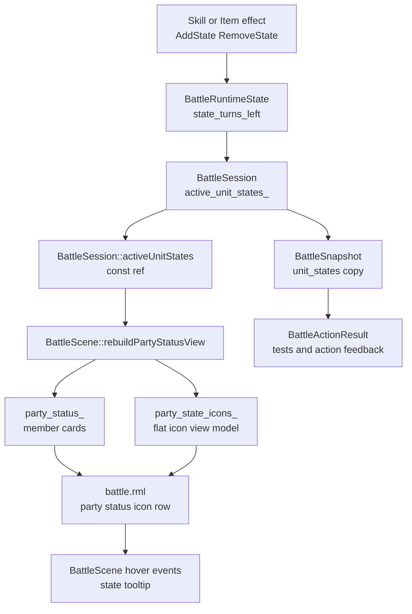

# 2.2 战斗状态图标开发计划

## 目标

为战斗场景补充队伍 HUD 状态图标条，让玩家能在战斗中看见角色当前受到的状态效果，并能通过鼠标 hover 查看状态名称、剩余回合和说明。

第一阶段只做玩家方状态卡显示，不改变状态结算规则、不新增状态持续伤害/回合钩子、不扩展敌方头顶 UI。状态数据由 `BattleSession` 从运行时状态重建成只读缓存，`BattleScene` 通过 `activeUnitStates()` 消费 const ref；`BattleSnapshot` 只在动作结果和测试断言中拷贝该缓存。

- 玩家状态卡的 HP/MP 区域下方显示小图标条。
- 状态按 `StateData::priority_` 降序展示，优先级相同时按状态 ID 稳定排序。
- 每个图标右下角显示剩余回合数字。
- 鼠标 hover 图标时显示 tooltip：状态名、剩余回合、描述。
- 缺少图标资源或状态定义时使用稳定 fallback 图标/文字，不让 UI 空白。

## 当前上下文

- `BattleRuntimeState::UnitRuntimeState::state_turns_left` 已按 `BattleUnitId -> state_id -> turns_left` 记录当前状态。
- `BattleActionResult::states_added / states_removed` 只描述本次行动变化，不足以重建 HUD 当前状态。
- `BattleSession` 当前暴露 `units / turn_order / current_actor_id / round_index / outcome`；状态 UI 需要新增 active states 只读入口，并保持热路径零拷贝。
- `StateData` 当前包含 `id / display_name / priority / min_turns / max_turns / traits`，没有 `description` 或 `icon_key` 字段。
- `BattleScene` 已有 RmlUi data model，`PartyStatusViewModel` 当前负责下方队伍卡基础信息；状态图标会新增独立扁平 view model。
- `ui/rmlui/scenes/battle.rml` 的 party card 当前只有 name、portrait、HP/MP 文本和条，需要在固定尺寸内加一行图标而不挤压命令面板。
- 项目已有 `ItemTooltipUI`，但它绑定的是独立 `item_tooltip.rml` 文档；战斗场景可以复用 tooltip 交互模式，但不直接复用物品 tooltip 类型。

## 数据流



## 数据契约

在 `battle_types.h` 增加只读快照类型：

```cpp
struct BattleStateSnapshot {
    std::string state_id{};
    int turns_left{0};
};

struct BattleUnitStateSnapshot {
    BattleUnitId unit_id{0};
    std::vector<BattleStateSnapshot> states{};
};
```

在 `BattleSnapshot` 增加：

```cpp
std::vector<BattleUnitStateSnapshot> unit_states{};
```

`BattleSession` 负责从 `runtime_state_.units` 重建状态缓存，并做清洗：

- `turns_left <= 0` 的状态不进入快照。
- `!unit.isAlive()` 的 KO 单位不输出状态；本项目当前没有“死亡状态”概念，KO 卡片第一阶段直接隐藏状态图标条。
- 状态 ID 保留原字符串，供 UI 通过 `RpgCatalog::findState()` 查显示名、优先级和图标。
- `unit_states` 以 `BattleSnapshot::units` 顺序遍历输出；只为存活且存在有效状态的单位追加条目，避免 UI 因 unordered_map 顺序产生抖动。
- 每个单位内部状态先查 `RpgCatalog::findState()` 取 `priority_`，定义缺失时 priority 视为 0；排序为 priority 降序、state_id 升序。

状态列表通过 `BattleSession::activeUnitStates()` 暴露为 const ref，缓存只在构造和 `submitAction()` 后重建；若行动推进到新回合，round begin 状态衰减发生在 resolver 内部，随后同一次 `submitAction()` 统一重建缓存。`BattleSnapshot::unit_states` 从该缓存拷贝，供 action result 和测试使用；`BattleScene` 热路径不应每帧调用完整 `snapshot()`。

不建议把 active states 直接写进 `BattleUnit`。`BattleUnit` 是基础战斗单位数据；状态持续回合属于单场会话运行时数据，放在 `BattleSnapshot::unit_states` 更清楚，也避免未来把状态属性和单位静态属性混在一起。

## RPG 状态数据扩展

第一阶段扩展 `StateData`：

```cpp
std::string description_{};
std::string icon_key_{};
```

JSON 字段建议：

```json
{
  "id": "state.poison",
  "display_name": "中毒",
  "description": "每回合受到少量伤害。",
  "icon_key": "poison",
  "priority": 50,
  "min_turns": 1,
  "max_turns": 1,
  "traits": []
}
```

解析策略：

- `description` 可选，缺省为空字符串。
- `icon_key` 可选，缺省由 `state_id` 规范化得到，例如 `state.poison -> poison`。
- icon decorator 由表现层 helper 生成：`image(battle-state-icon-poison)`。
- 若 `icon_key` 缺失，表现层从 `state_id` 规范化生成默认 key；配置过的 key 必须在 `battle_state_icons.rcss` 中有对应 spritesheet 定义，通过 smoke test 覆盖。状态定义缺失或 decorator 不可用时，RML 才显示 `short_label` fallback。

更新现有 `assets/data/rpg/states.json` 时只补 `description` 与 `icon_key`，不改变已有 `priority / min_turns / max_turns` 语义，例如 `state.poison` 继续保持 `priority: 50`。

状态图标 spritesheet 单独放在 `ui/rmlui/theme/battle_state_icons.rcss`，并在 `battle.rml` 中引入。第一批至少提供：

- `battle-state-icon-poison`
- `battle-state-icon-stun`
- `battle-state-icon-burn`
- `battle-state-icon-fallback`

若暂时没有合适美术资源，允许使用现有小图集或程序化占位图，但 RCSS 名称要先稳定下来，方便后续替换资源而不改 C++。

## ViewModel 设计

直接采用扁平状态图标数组，不使用嵌套 `data-for`。当前项目已有 hotbar、inventory 等 hover 用法都走单层 `data-for`，扁平数组能避开“内层循环事件读取外层 member”这种未验证路径。

在 `BattleScene` 内新增视图模型：

```cpp
struct StateIconViewModel {
    int unit_id{0};
    int entry_index{0}; // 同一 unit 内的状态序号，用于 hover 回查。
    Rml::String state_id{};
    Rml::String display_name{};
    Rml::String description{};
    Rml::String turns_text{};
    Rml::String short_label{};
    Rml::String icon_decorator{"none"};
    bool known{false};

    friend bool operator==(const StateIconViewModel& lhs,
                           const StateIconViewModel& rhs) = default;
};
```

`BattleScene` 增加：

```cpp
std::vector<StateIconViewModel> party_state_icons_{};
```

`PartyStatusViewModel` 不嵌套 `std::vector<StateIconViewModel>`；它继续只描述角色卡自身状态，如 `unit_id / name / hp / mp / active / ko`。RML 在每张 party card 内通过 `data-for="icon : party_state_icons"` 和 `data-if="icon.unit_id == member.unit_id"` 过滤显示对应状态图标。

构建规则：

- `state_id` 来自 `BattleSnapshot::unit_states`。
- `display_name` 优先使用 `StateData::display_name_`，缺失定义时使用原 state id。
- `description` 优先使用 `StateData::description_`，为空时 tooltip 可显示“暂无说明”。
- `turns_text` 使用 `std::to_string(turns_left)`；若未来支持永久状态，可再约定 `∞` 或空字符串，第一阶段不引入永久状态。
- `short_label` 对无图标状态使用稳定 ASCII fallback：去掉 `state.` 前缀后，取第一个 ASCII 字母并转大写；找不到可用字符时使用 `?`。不要截断中文显示名。
- `known` 标记 `RpgCatalog` 是否能找到该状态，便于 RCSS 给未知状态弱化颜色。
- `entry_index` 在每个 unit 内从 0 开始，RML hover 时传 `icon.unit_id` 和 `icon.entry_index`。
- `party_state_icons_` 按 party card 顺序、状态排序顺序生成；刷新时完整比较，变化后 `markDirty("party_state_icons")`。

## UI 布局

在 `battle.rml` 中于 `.battle-party-stats` 的 MP 条下方加入状态图标条：

- 容器：`.battle-state-icon-row`
- 单项：`.battle-state-icon`
- 图像：`.battle-state-icon-image`，绑定 `data-style-decorator="icon.icon_decorator"`
- 回合角标：`.battle-state-turns`
- hover 事件：`data-event-mouseover="state_icon_hover_enter(icon.unit_id, icon.entry_index)"` 和 `data-event-mouseout="state_icon_hover_exit(icon.unit_id, icon.entry_index)"`

布局建议：

- 每张 party card 仍保持 `110dp x 92dp`。
- `.battle-party-stats` 当前宽 `60dp`、高 `82dp`；图标条放在 MP 条下方，`width: 60dp; height: 12dp; margin-top: 5dp`。
- 单个图标 `9dp x 9dp`，`gap: 2dp`，回合角标 `6dp x 6dp`，最多稳定显示 4 个图标。
- `.battle-portrait` 可保持 `36dp x 36dp` 和 `margin-top: 4dp`，第一阶段不需要挤压头像。
- 超出 4 个时第一阶段裁切，不显示 `+N`；后续可以补汇总角标。
- 不使用 button，不参与键盘/手柄导航；图标是只读 HUD。
- 图标 hover 只响应鼠标；在 `tf-input-nav` 输入模式下这条路径仍可用，不会抢占键盘/手柄 focus。

RCSS 约束：

- 固定图标宽高和角标位置，状态变化不能导致 party card 抖动。
- `.battle-party-card` 需要 `position: relative`，供内部 tooltip 绝对定位。
- `.battle-party-card.ko-party-member .battle-state-icon-row` 设置 `display: none`；领域快照也不会给 KO 单位输出状态。
- fallback label 使用 `font-effect: shadow(1dp 1dp #000000cc)`，保证背景图下可读。
- 不新增大面板，也不把状态图标做成可点击菜单项。

## Tooltip 方案

第一阶段在 battle scene 文档内部增加轻量 tooltip，而不是复用 `ItemTooltipUI`：

- `battle.rml` 在每张 party card 内增加 `.battle-state-tooltip`，通过 data model 控制 `visible`、`active_unit_id`、`title`、`turns`、`description`。
- `BattleScene` 增加 `StateTooltipViewModel` 和 hover event handlers。
- tooltip 挂在每张 party card 内部，通过 `data-if="state_tooltip.visible && state_tooltip.active_unit_id == member.unit_id"` 只在当前 hover 的角色卡上显示。
- tooltip 使用 `position: absolute; top: -48dp; left: 0; width: 110dp; min-height: 42dp;` 相对 party card 定位，不读取鼠标坐标，避免引入额外 viewport/鼠标定位逻辑。
- 鼠标移出当前 hover 图标时隐藏；刷新状态后若 hover 的状态不存在，也隐藏。

建议字段：

```cpp
struct StateTooltipViewModel {
    int active_unit_id{0};
    Rml::String title{};
    Rml::String turns{};
    Rml::String description{};
    bool visible{false};
};
```

这样不需要 `state-tooltip-card-0..3` 这类硬编码锚点。未来队伍人数或 card 宽度变化时，tooltip 仍跟随所在 party card。

## 实现步骤

1. 扩展 RPG 状态数据
   - 在 `StateData` 增加 `description_` 和 `icon_key_`。
   - 在 `RpgCatalog::loadStates()` 解析可选字段。
   - 更新 `assets/data/rpg/states.json`，至少补 `state.poison`、`state.stun` 的描述和 icon key。
   - 更新测试 fixture 中的 `states.json`，补 `state.burn` 的字段。

2. 扩展战斗快照
   - 在 `battle_types.h` 增加 `BattleStateSnapshot` 和 `BattleUnitStateSnapshot`。
   - 在 `BattleSnapshot` 增加 `unit_states`。
   - 在 `BattleActionResolver` 暴露 `rpgCatalog()` 只读访问器，避免 `BattleSession` 重复保存 catalog 指针。
   - 在 `BattleSession` 增加 `active_unit_states_` 缓存和 `activeUnitStates()` const ref 访问器。
   - 在构造和 `submitAction()` 后重建 `active_unit_states_`；round begin 衰减由同一次行动提交后的统一重建覆盖。
   - `BattleSession::snapshot()` 从 `active_unit_states_` 拷贝 `unit_states`。
   - 状态缓存跳过 KO 单位和已过期状态。
   - 保持 `BattleActionResult::states_added / states_removed` 作为动作变化事件，不用于 HUD 当前态。

3. 补充状态图标 helper
   - 在 `BattleScene` 附近新增小型 helper，或单独建 `battle_state_icon_helpers.h`。
   - 实现 `battleStateIconDecorator(const StateData*)`。
   - 实现 `battleStateShortLabel(state_id)`，按 `state.` 后首个 ASCII 字母大写生成 fallback，避免中文截断。

4. 扩展 RmlUi view model
   - 新增 `StateIconViewModel`。
   - 新增 `std::vector<StateIconViewModel> party_state_icons_`。
   - 在 `ensureDataTypesRegistered()` 注册 `StateIconViewModel`。
   - 在 `initUI()` 绑定 `party_state_icons`、tooltip 数据和 hover event。

5. 刷新 party status
   - `rebuildPartyStatusView()` 统一从 `session_.units()` 和 `session_.activeUnitStates()` 获取状态，避免每帧完整 snapshot 拷贝。
   - 将玩家方存活单位状态写入扁平 `party_state_icons_`。
   - `party_status_` 和 `party_state_icons_` 分别做完整相等比较，只有内容变化时 mark dirty。
   - 若当前 tooltip 锚定的状态消失，隐藏 tooltip 并 dirty tooltip 字段。

6. 编写 RML
   - 引入 `<link type="text/rcss" href="../theme/battle_state_icons.rcss"/>`。
   - 在 `.battle-party-stats` 内加入状态图标条，使用 `data-for="icon : party_state_icons"` 和 `data-if="icon.unit_id == member.unit_id"`。
   - 在每张 party card 内加入 `.battle-state-tooltip`，避免重复 id。
   - 不给状态图标加 `tf-nav-auto`，避免抢焦点。

7. 编写 RCSS
   - 新增状态图标条、图标、回合角标、fallback label、tooltip 样式。
   - 控制尺寸，保证 `110dp x 92dp` party card 内文字和图标不重叠。
   - KO 状态下隐藏图标条；未知状态和 hover 状态分别设置颜色。

8. 补充测试
   - `RpgCatalogTest`：验证 state `description` 和 `icon_key` 解析。
   - `BattleSessionTest`：技能添加状态后 `snapshot.unit_states` 包含 state id 和 turns left。
   - `BattleSessionTest`：跨轮后状态剩余回合递减并从快照移除。
   - `BattleSessionTest`：多个状态按 priority 降序、state id 升序稳定排序。
   - `BattleSceneSmokeTest`：检查 `StateIconViewModel` 注册、`party_state_icons` 绑定、RML 存在 `battle-state-icon-row` 和 hover event。
   - `BattleSceneSmokeTest`：检查 `battle_state_icons.rcss` 被引入且定义 fallback/poison/stun。
   - 测试 fixture 指 `tests/game/battle/battle_catalog_fixture.h` 中生成的临时 `states.json` 内容，不是 `assets/data/rpg/states.json`。

9. 构建与验证
   - 运行 `ninja -C build game_tests`。
   - 运行过滤测试：`./build/tests/game_tests --gtest_filter='*RpgCatalog*:*BattleSession*:*BattleSceneSmoke*'`。
   - 运行 `ninja -C build battle_tester`。
   - 打开 `battle_tester`，使用会附加状态的技能确认图标出现、回合数递减、移出后 tooltip 消失。

## 待办清单

- [x] `StateData` 增加 `description_`。
- [x] `StateData` 增加 `icon_key_`。
- [x] `RpgCatalog::loadStates()` 解析 `description` 和 `icon_key`。
- [x] 更新 `assets/data/rpg/states.json` 状态说明与图标 key。
- [x] 新增 `BattleStateSnapshot`。
- [x] 新增 `BattleUnitStateSnapshot`。
- [x] `BattleSnapshot` 增加 `unit_states`。
- [x] `BattleSession` 新增 `active_unit_states_` 缓存。
- [x] `BattleSession` 新增 `activeUnitStates()` const ref 访问器。
- [x] `BattleSession::snapshot()` 从缓存输出 active states。
- [x] `BattleSession::snapshot()` 跳过 KO 单位状态。
- [x] active states 按单位顺序和状态优先级稳定排序。
- [x] 新增状态图标 decorator / fallback label helper。
- [x] `BattleScene` 新增 `StateIconViewModel`。
- [x] `BattleScene` 新增扁平 `party_state_icons_`。
- [x] 注册并绑定 `party_state_icons` RmlUi data model。
- [x] `rebuildPartyStatusView()` 从 `session_.units()` 和 `session_.activeUnitStates()` 构建玩家方状态图标。
- [x] 新增状态 tooltip view model。
- [x] 绑定状态图标 hover enter/exit 事件。
- [x] `battle.rml` 引入 `battle_state_icons.rcss`。
- [x] `battle.rml` 新增状态图标条。
- [x] `battle.rml` 新增状态 tooltip。
- [x] `battle.rcss` 新增状态图标条与 tooltip 样式。
- [x] `battle_state_icons.rcss` 定义 poison / stun / burn / fallback。
- [x] 补充 `RpgCatalogTest`。
- [x] 补充 `BattleSessionTest` 状态快照测试。
- [x] 补充 `BattleSceneSmokeTest`。
- [x] 运行 `ninja -C build game_tests`。
- [x] 运行相关过滤测试。
- [x] 运行 `ninja -C build battle_tester`。
- [ ] 手动确认图标、回合角标和 hover tooltip。

## 风险与边界

- 当前状态系统只记录剩余回合，不执行中毒掉血、眩晕跳过行动等 gameplay hook；本计划只做可视化，不改变战斗规则。
- `BattleActionResult::states_added / states_removed` 是动作反馈，不是当前状态源；HUD 必须从快照读取 active states。
- 状态图标第一阶段只显示玩家方 party card；敌方状态图标留到后续敌方 HP 条/目标选择详情中统一处理。
- KO 单位第一阶段不显示状态图标；若未来引入“死亡状态”或复活后保留状态规则，需要重新定义 snapshot 输出策略。
- Tooltip 第一阶段只支持鼠标 hover；键盘/手柄直接查看状态是已知缺口，但图标不参与导航符合只读 HUD 的定位。
- 状态图标资源可能暂时是占位图，但 spritesheet 名称要稳定。
- Party card 高度只有 `92dp`，实现时必须优先保证 HP/MP 文本和条不被挤压；状态图标条放在 `60dp` 宽的 stats 区域底部，不扩大底部 HUD。

## 需要确认的问题

暂无阻塞问题。默认采用“玩家 party card stats 区域内小图标条 + 扁平 `party_state_icons_` + 回合角标 + party card 内部 tooltip + 状态快照暴露 active states”的方案。
